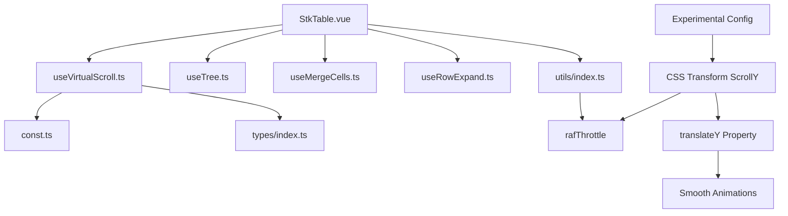
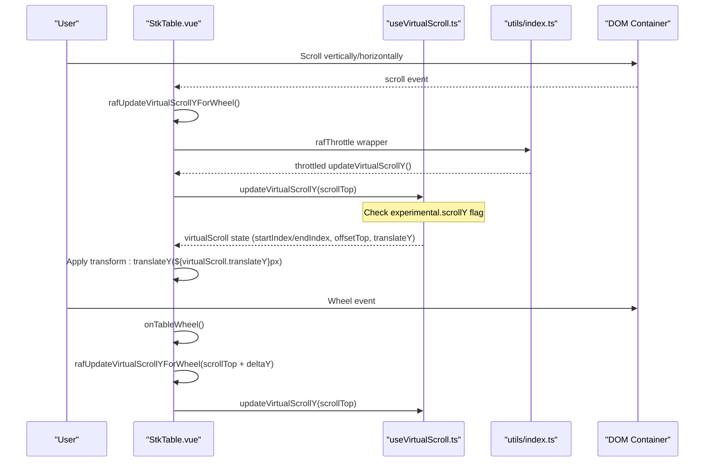
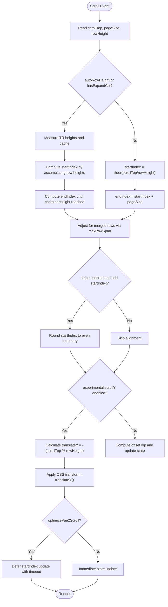
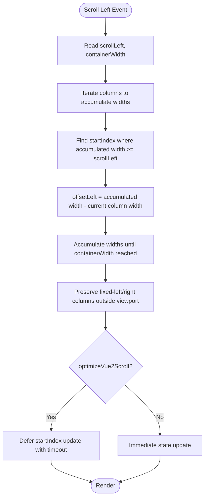
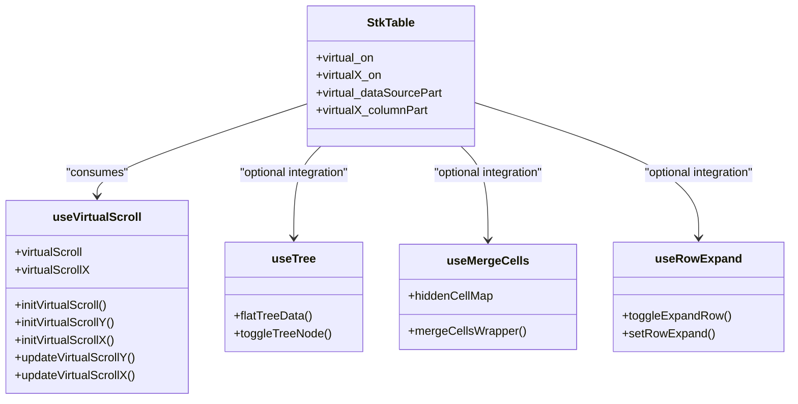
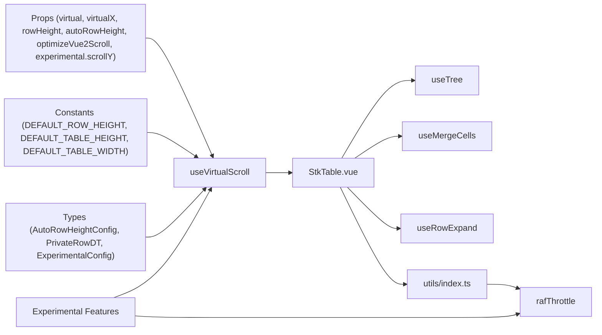

# Virtual Scroll Configuration

<cite>
**Referenced Files in This Document**
- [useVirtualScroll.ts](file://src/StkTable/useVirtualScroll.ts)
- [StkTable.vue](file://src/StkTable/StkTable.vue)
- [const.ts](file://src/StkTable/const.ts)
- [types/index.ts](file://src/StkTable/types/index.ts)
- [useTree.ts](file://src/StkTable/useTree.ts)
- [useMergeCells.ts](file://src/StkTable/useMergeCells.ts)
- [useRowExpand.ts](file://src/StkTable/useRowExpand.ts)
- [virtual.md](file://docs-src/main/table/advanced/virtual.md)
- [VirtualY.vue](file://docs-demo/advanced/virtual/VirtualY.vue)
- [VirtualX.vue](file://docs-demo/advanced/virtual/VirtualX.vue)
- [index.ts](file://src/StkTable/utils/index.ts)
- [experimental.md](file://docs-src/main/other/experimental.md)
</cite>

## Update Summary
**Changes Made**
- Enhanced documentation for the experimental.scrollY feature with new translateY properties and transform-based scrolling animations
- Updated virtual scroll architecture to include CSS transform-based vertical scrolling implementation details
- Documented the new translateY property in VirtualScrollStore and its role in smooth scrolling animations
- Added comprehensive coverage of transform-based scrolling performance optimizations
- Updated troubleshooting guide with experimental feature considerations and transform-based scrolling issues
- Enhanced performance optimization utilities documentation with rafThrottle integration

## Table of Contents
1. [Introduction](#introduction)
2. [Project Structure](#project-structure)
3. [Core Components](#core-components)
4. [Architecture Overview](#architecture-overview)
5. [Detailed Component Analysis](#detailed-component-analysis)
6. [Experimental ScrollY Feature](#experimental-scrollY-feature)
7. [Performance Optimization Utilities](#performance-optimization-utilities)
8. [Dependency Analysis](#dependency-analysis)
9. [Performance Considerations](#performance-considerations)
10. [Troubleshooting Guide](#troubleshooting-guide)
11. [Conclusion](#conclusion)
12. [Appendices](#appendices)

## Introduction
This document explains virtual scroll configuration options and best practices for the table component. It focuses on the virtual, virtualX, rowHeight, autoRowHeight, and optimizeVue2Scroll props and their impact on performance. It also details the pageSize calculation logic, how container dimensions affect virtual scrolling thresholds, and the initialization process via initVirtualScroll, initVirtualScrollY, and initVirtualScrollX. The document covers the virtual_on and virtualX_on computed properties that determine when virtual scrolling is active, and explains integration with other table features such as tree data, merge cells, and expandable rows. 

**Updated** Enhanced with experimental scrollY feature supporting CSS transform-based vertical scrolling for improved performance and smoother animations, along with the rafThrottle utility for optimized wheel scrolling. The new translateY property enables smooth transform-based scrolling animations that leverage GPU acceleration.

Finally, it provides performance benchmarking guidelines, memory usage considerations, and troubleshooting steps for common virtual scrolling issues, along with configuration examples for large datasets, wide tables, and mixed content scenarios.

## Project Structure
Virtual scrolling is implemented as a composable hook that encapsulates state and logic for both Y (vertical) and X (horizontal) virtualization. The main table component consumes this hook and applies the computed virtual state to render only visible rows and columns. The experimental scrollY feature introduces CSS transform-based vertical scrolling for enhanced performance, supported by the rafThrottle utility for smooth wheel interactions.

**Diagram sources**
- [StkTable.vue](file://src/StkTable/StkTable.vue#L263-L792)
- [useVirtualScroll.ts](file://src/StkTable/useVirtualScroll.ts#L60-L497)
- [const.ts](file://src/StkTable/const.ts#L1-L51)
- [types/index.ts](file://src/StkTable/types/index.ts#L54-L120)
- [useTree.ts](file://src/StkTable/useTree.ts#L12-L160)
- [useMergeCells.ts](file://src/StkTable/useMergeCells.ts#L11-L138)
- [useRowExpand.ts](file://src/StkTable/useRowExpand.ts#L11-L87)
- [index.ts](file://src/StkTable/utils/index.ts#L294-L314)

**Section sources**
- [StkTable.vue](file://src/StkTable/StkTable.vue#L263-L792)
- [useVirtualScroll.ts](file://src/StkTable/useVirtualScroll.ts#L60-L497)

## Core Components
- useVirtualScroll: Provides virtual scroll state and logic for Y and X axes, including initialization, update on scroll, and computed visibility helpers. Now includes experimental CSS transform-based vertical scrolling support with translateY tracking for smooth animations.
- StkTable.vue: Consumes the hook and renders only visible rows/columns, applying offsets and thresholds. Integrates experimental scrollY feature with transform-based rendering and wheel event handling.
- Types and constants: Define prop shapes, defaults, and constants used by virtual scroll logic, including experimental configuration options with scrollY support.
- rafThrottle utility: Provides requestAnimationFrame-based throttling for smooth wheel scrolling performance.

Key props and their roles:
- virtual: Enables vertical virtualization.
- virtualX: Enables horizontal virtualization.
- rowHeight: Base row height used when autoRowHeight is disabled.
- autoRowHeight: Enables dynamic row heights with optional expectedHeight estimation.
- optimizeVue2Scroll: Optimizes scroll performance for Vue 2 by deferring DOM updates on downward scrolls.
- experimental.scrollY: Enables experimental CSS transform-based vertical scrolling feature for enhanced performance.

**Section sources**
- [useVirtualScroll.ts](file://src/StkTable/useVirtualScroll.ts#L60-L497)
- [StkTable.vue](file://src/StkTable/StkTable.vue#L282-L480)
- [types/index.ts](file://src/StkTable/types/index.ts#L275-L278)
- [const.ts](file://src/StkTable/const.ts#L6-L8)
- [types/index.ts](file://src/StkTable/types/index.ts#L320-L323)
- [index.ts](file://src/StkTable/utils/index.ts#L294-L314)

## Architecture Overview
The virtual scroll architecture separates concerns between state management (useVirtualScroll) and rendering (StkTable.vue). The hook computes visible ranges and offsets, while the component applies styles and slices data accordingly. The experimental scrollY feature introduces CSS transform-based vertical scrolling for improved performance, enhanced by rafThrottle for smooth wheel interactions.

**Diagram sources**
- [StkTable.vue](file://src/StkTable/StkTable.vue#L1340-L1389)
- [StkTable.vue](file://src/StkTable/StkTable.vue#L791-L794)
- [useVirtualScroll.ts](file://src/StkTable/useVirtualScroll.ts#L273-L406)
- [useVirtualScroll.ts](file://src/StkTable/useVirtualScroll.ts#L291-L296)
- [index.ts](file://src/StkTable/utils/index.ts#L294-L314)

## Detailed Component Analysis

### Virtual Scroll Initialization and Thresholds
- initVirtualScroll(height?): Initializes both Y and X virtual scroll. Calls initVirtualScrollY and initVirtualScrollX.
- initVirtualScrollY(height?): Computes containerHeight and pageSize based on container clientHeight and rowHeight. Adjusts for header height and ensures scrollTop is within bounds. Supports experimental CSS transform-based scrolling.
- initVirtualScrollX(): Captures containerWidth and scrollWidth, then updates X virtual indices.

pageSize calculation logic:
- Y axis: pageSize = floor(containerHeight / rowHeight). If not headless, subtracts the number of header rows equivalent in body row heights.
- X axis: Uses containerWidth to compute visible column range.

Container dimension effects:
- Larger containerHeight increases pageSize, reducing re-computation frequency.
- For autoRowHeight, measurements are batched to avoid layout thrashing.
- Experimental scrollY feature uses translateY for smooth scrolling animations.

**Section sources**
- [useVirtualScroll.ts](file://src/StkTable/useVirtualScroll.ts#L195-L235)
- [useVirtualScroll.ts](file://src/StkTable/useVirtualScroll.ts#L204-L228)
- [useVirtualScroll.ts](file://src/StkTable/useVirtualScroll.ts#L230-L235)
- [const.ts](file://src/StkTable/const.ts#L6-L8)

### Vertical Virtual Scrolling (Y-axis)
- virtual_on computed: Activates virtualization when virtual is true and data length exceeds pageSize.
- virtual_dataSourcePart computed: Slices dataSourceCopy to visible range.
- virtual_offsetBottom computed: Calculates height of content below viewport for accurate scrollHeight.
- updateVirtualScrollY(sTop): Recomputes startIndex/endIndex based on scrollTop. Handles autoRowHeight and expanded row height overrides. Corrects for merged rows via maxRowSpan. Applies Vue 2 scroll optimization by deferring updates on fast downward scrolls.

**Updated** Enhanced with experimental CSS transform-based scrolling support. When experimental.scrollY is enabled, the method calculates translateY to position the table content using CSS transforms instead of scrollTop adjustments. The translateY value is computed as -(scrollTop % rowHeight) to maintain smooth animation continuity.

Key behaviors:
- When autoRowHeight is enabled, the hook measures TR elements and caches measured heights.
- When expandable rows are present, expanded row height overrides the base row height during calculations.
- Stripe alignment: Ensures startIndex aligns to even boundaries when stripe is enabled to prevent visual misalignment.
- Experimental transform scrolling: Calculates translateY based on rowHeight remainder for smooth animation.
- Scroll boundary handling: Maintains scroll position constraints while using transform positioning.

**Diagram sources**
- [useVirtualScroll.ts](file://src/StkTable/useVirtualScroll.ts#L273-L406)
- [useVirtualScroll.ts](file://src/StkTable/useVirtualScroll.ts#L291-L296)
- [useVirtualScroll.ts](file://src/StkTable/useVirtualScroll.ts#L326-L368)

**Section sources**
- [useVirtualScroll.ts](file://src/StkTable/useVirtualScroll.ts#L98-L124)
- [useVirtualScroll.ts](file://src/StkTable/useVirtualScroll.ts#L103-L107)
- [useVirtualScroll.ts](file://src/StkTable/useVirtualScroll.ts#L273-L406)

### Horizontal Virtual Scrolling (X-axis)
- virtualX_on computed: Activates horizontal virtualization when virtualX is true and total column width exceeds containerWidth plus a small threshold.
- virtualX_columnPart computed: Returns visible columns, preserving fixed-left and fixed-right columns outside the viewport.
- virtualX_offsetRight computed: Computes width of columns after the last visible column (excluding fixed-right).
- updateVirtualScrollX(sLeft): Computes startIndex and endIndex by accumulating widths of visible non-fixed columns, ensuring containerWidth coverage. Applies Vue 2 scroll optimization similarly to Y-axis.

**Diagram sources**
- [useVirtualScroll.ts](file://src/StkTable/useVirtualScroll.ts#L413-L477)
- [useVirtualScroll.ts](file://src/StkTable/useVirtualScroll.ts#L126-L175)

**Section sources**
- [useVirtualScroll.ts](file://src/StkTable/useVirtualScroll.ts#L126-L175)
- [useVirtualScroll.ts](file://src/StkTable/useVirtualScroll.ts#L413-L477)

### Integration with Other Features
- Tree data: Tree expansion adds/removes rows dynamically. Flatting logic and toggling are handled by useTree. Virtual scroll accounts for expanded rows by adjusting row heights and offsets.
- Merge cells: Merging affects row spans and requires correcting startIndex/endIndex to avoid partial merges. The hook checks maxRowSpan and adjusts ranges accordingly.
- Expandable rows: Expanded rows contribute extra height. The row height function checks for expanded state and uses expandConfig.height when applicable.

**Diagram sources**
- [StkTable.vue](file://src/StkTable/StkTable.vue#L775-L792)
- [useVirtualScroll.ts](file://src/StkTable/useVirtualScroll.ts#L60-L497)
- [useTree.ts](file://src/StkTable/useTree.ts#L12-L160)
- [useMergeCells.ts](file://src/StkTable/useMergeCells.ts#L84-L115)
- [useRowExpand.ts](file://src/StkTable/useRowExpand.ts#L18-L81)

**Section sources**
- [useVirtualScroll.ts](file://src/StkTable/useVirtualScroll.ts#L326-L368)
- [useTree.ts](file://src/StkTable/useTree.ts#L121-L125)
- [useRowExpand.ts](file://src/StkTable/useRowExpand.ts#L30-L81)

### Props Impact and Best Practices
- virtual: Enable for large datasets to limit DOM nodes to visible rows only. Combine with a fixed container height.
- virtualX: Enable for very wide tables. Always set explicit column widths to enable accurate width accumulation.
- rowHeight: Use a realistic default to minimize measurement overhead. For static layouts, this improves predictability.
- autoRowHeight: Use when rows contain variable content. Provide expectedHeight to reduce measurement cost. Clear cached heights when data changes.
- optimizeVue2Scroll: Recommended for Vue 2 to smooth out scroll performance differences between up/down directions.
- experimental.scrollY: Enable experimental CSS transform-based vertical scrolling for improved performance and smoother animations.

Configuration examples:
- Large dataset (vertical virtualization): See [VirtualY.vue](file://docs-demo/advanced/virtual/VirtualY.vue#L1-L34).
- Wide table (horizontal virtualization): See [VirtualX.vue](file://docs-demo/advanced/virtual/VirtualX.vue#L1-L29).
- Mixed content: Combine autoRowHeight with optimizeVue2Scroll and ensure rowKey is stable.
- Experimental transform scrolling: Enable experimental.scrollY for enhanced performance.

**Section sources**
- [virtual.md](file://docs-src/main/table/advanced/virtual.md#L1-L70)
- [VirtualY.vue](file://docs-demo/advanced/virtual/VirtualY.vue#L1-L34)
- [VirtualX.vue](file://docs-demo/advanced/virtual/VirtualX.vue#L1-L29)
- [types/index.ts](file://src/StkTable/types/index.ts#L275-L278)
- [types/index.ts](file://src/StkTable/types/index.ts#L320-L323)

## Experimental ScrollY Feature
**New Section** The experimental scrollY feature introduces CSS transform-based vertical scrolling for enhanced performance and smoother animations.

### Implementation Details
- **CSS Transform Rendering**: Instead of adjusting scrollTop, the feature calculates translateY values to position table content using CSS transforms.
- **Performance Benefits**: Transform-based scrolling leverages GPU acceleration and reduces layout calculations.
- **Integration Points**: Works alongside existing virtual scroll logic with minimal architectural changes.
- **Configuration**: Controlled via experimental.scrollY prop in ExperimentalConfig.
- **Conflict Resolution**: Automatically disables transform-based scrolling when scrollRowByRow is enabled to avoid conflicts.

### Key Changes in useVirtualScroll.ts
- **translateY Calculation**: New property in VirtualScrollStore tracks transform position.
- **Conditional Logic**: updateVirtualScrollY checks experimental.scrollY flag before applying transform.
- **Boundary Handling**: Maintains scroll position constraints while using transform positioning.
- **Scroll Row by Row Compatibility**: Disables transform when scrollRowByRow is active.

### Integration in StkTable.vue
- **Transform Application**: Table body uses `transform: translateY(${virtualScroll.translateY}px)` for positioning.
- **Class Toggle**: Adds 'exp-scroll-y' class when experimental.scrollY is enabled.
- **Fallback Support**: Graceful degradation when experimental feature is disabled.
- **Wheel Event Handling**: Uses rafUpdateVirtualScrollYForWheel for smooth wheel interactions.

**Section sources**
- [useVirtualScroll.ts](file://src/StkTable/useVirtualScroll.ts#L19-L38)
- [useVirtualScroll.ts](file://src/StkTable/useVirtualScroll.ts#L291-L296)
- [StkTable.vue](file://src/StkTable/StkTable.vue#L106)
- [StkTable.vue](file://src/StkTable/StkTable.vue#L29)
- [types/index.ts](file://src/StkTable/types/index.ts#L320-L323)

## Performance Optimization Utilities
**New Section** The rafThrottle utility provides requestAnimationFrame-based throttling for smooth wheel scrolling performance.

### rafThrottle Implementation
- **RequestAnimationFrame Integration**: Uses requestAnimationFrame for optimal timing with browser refresh cycles.
- **Coalescing Behavior**: Multiple calls within a single frame are coalesced - only the last call is executed.
- **Memory Management**: Tracks last arguments and clears RAF handles appropriately.
- **Performance Benefits**: Reduces CPU usage and prevents layout thrashing during rapid wheel events.

### Integration with Wheel Events
- **Smooth Scrolling**: rafUpdateVirtualScrollYForWheel wraps updateVirtualScrollY for throttled wheel interactions.
- **Frame-Based Processing**: Ensures wheel events are processed at optimal intervals.
- **Performance Optimization**: Prevents excessive virtual scroll computations during rapid scrolling.

**Section sources**
- [index.ts](file://src/StkTable/utils/index.ts#L294-L314)
- [StkTable.vue](file://src/StkTable/StkTable.vue#L791-L794)

## Dependency Analysis
- useVirtualScroll depends on:
  - Props (virtual, virtualX, rowHeight, autoRowHeight, expandConfig.height, optimizeVue2Scroll, experimental.scrollY, headerRowHeight, stripe)
  - Container dimensions (clientHeight/clientWidth/scrollHeight/scrollWidth)
  - Data structures (dataSourceCopy, tableHeaderLast, tableHeaders, rowKeyGen, maxRowSpan)
  - Experimental configuration for transform-based scrolling
  - rafThrottle utility for smooth wheel interactions
- StkTable.vue composes useVirtualScroll and integrates with useTree, useMergeCells, and useRowExpand.
- Wheel event handling depends on rafThrottle for performance optimization.

**Diagram sources**
- [useVirtualScroll.ts](file://src/StkTable/useVirtualScroll.ts#L6-L15)
- [const.ts](file://src/StkTable/const.ts#L6-L8)
- [types/index.ts](file://src/StkTable/types/index.ts#L275-L278)
- [types/index.ts](file://src/StkTable/types/index.ts#L320-L323)
- [StkTable.vue](file://src/StkTable/StkTable.vue#L775-L792)
- [index.ts](file://src/StkTable/utils/index.ts#L294-L314)

**Section sources**
- [useVirtualScroll.ts](file://src/StkTable/useVirtualScroll.ts#L6-L15)
- [StkTable.vue](file://src/StkTable/StkTable.vue#L775-L792)

## Performance Considerations
- Prefer fixed container sizes to stabilize pageSize and reduce reflows.
- Use virtualX with explicit column widths to avoid layout recalculations.
- For autoRowHeight, precompute expectedHeight to minimize DOM measurements. Clear cached heights when data mutates.
- Enable optimizeVue2Scroll for Vue 2 to reduce DOM churn on downward scrolls.
- Keep rowKey stable to avoid invalidating caches.
- Avoid excessive nested custom cells; prefer lightweight rendering for large datasets.
- **Experimental Feature**: Enable experimental.scrollY for enhanced performance with CSS transform-based scrolling.
- **Wheel Performance**: rafThrottle ensures smooth wheel interactions without excessive computations.
- **Browser Compatibility**: Test experimental scrollY across different browser versions for optimal performance.
- **GPU Acceleration**: Transform-based scrolling leverages hardware acceleration for smoother animations.
- **Memory Usage**: translateY property reduces layout calculations and improves scroll performance.

## Troubleshooting Guide
Common issues and resolutions:
- White screen on fast scroll (Vue 2): Enable optimizeVue2Scroll to defer updates.
- Incorrect visible range with merged rows: Ensure maxRowSpan is updated; the hook adjusts ranges based on it.
- Expanded rows causing clipping: Verify expandConfig.height is set; the row height function respects expanded rows.
- Columns not appearing in wide tables: Ensure virtualX is enabled and all columns have widths; total width exceeding containerWidth activates horizontal virtualization.
- Scroll jumps after data changes: Call initVirtualScrollY/initVirtualScroll to recompute thresholds and clamp scrollTop.
- **Experimental Feature Issues**: If transform-based scrolling causes rendering issues, disable experimental.scrollY prop.
- **Performance Problems**: Experimental scrollY may not work well with complex CSS transforms or certain browser versions.
- **Wheel Event Issues**: If wheel scrolling feels choppy, verify rafThrottle is properly integrated and not being overridden elsewhere.
- **Transform Conflicts**: Experimental scrollY automatically disables when scrollRowByRow is enabled; ensure proper prop configuration.
- **Translate Animation Issues**: If translateY animations appear jerky, check for CSS conflicts that might interfere with transform properties.

**Section sources**
- [useVirtualScroll.ts](file://src/StkTable/useVirtualScroll.ts#L396-L405)
- [useVirtualScroll.ts](file://src/StkTable/useVirtualScroll.ts#L326-L368)
- [useVirtualScroll.ts](file://src/StkTable/useVirtualScroll.ts#L183-L187)
- [useVirtualScroll.ts](file://src/StkTable/useVirtualScroll.ts#L126-L131)
- [useVirtualScroll.ts](file://src/StkTable/useVirtualScroll.ts#L222-L225)
- [StkTable.vue](file://src/StkTable/StkTable.vue#L1362-L1367)

## Conclusion
Virtual scrolling dramatically improves performance for large datasets and wide tables by rendering only visible items. Proper configuration of virtual, virtualX, rowHeight, autoRowHeight, and optimizeVue2Scroll, combined with correct initialization and awareness of integrations with tree data, merge cells, and expandable rows, yields a responsive and memory-efficient table experience. The new experimental scrollY feature with CSS transform-based vertical scrolling further enhances performance and provides smoother animations for modern browsers, supported by the rafThrottle utility for optimized wheel interactions.

[No sources needed since this section summarizes without analyzing specific files]

## Appendices

### API Summary
- Methods
  - initVirtualScroll(height?)
  - initVirtualScrollY(height?)
  - initVirtualScrollX()
  - updateVirtualScrollY(scrollTop)
  - updateVirtualScrollX(scrollLeft)
- Computed
  - virtual_on
  - virtualX_on
  - virtual_dataSourcePart
  - virtualX_columnPart
  - virtual_offsetBottom
  - virtualX_offsetRight
- Props
  - virtual: boolean
  - virtualX: boolean
  - rowHeight: number
  - autoRowHeight: boolean | AutoRowHeightConfig
  - optimizeVue2Scroll: boolean
  - expandConfig.height: number (used by row height function)
  - experimental.scrollY: boolean (experimental CSS transform-based scrolling)
- New Experimental Properties
  - translateY: number (transform position for experimental scrollY)
  - experimental: ExperimentalConfig (configuration object)
- Utility Functions
  - rafThrottle(fn): requestAnimationFrame-based throttling
  - rafUpdateVirtualScrollYForWheel(scrollTop): throttled wheel handler

**Section sources**
- [useVirtualScroll.ts](file://src/StkTable/useVirtualScroll.ts#L195-L496)
- [StkTable.vue](file://src/StkTable/StkTable.vue#L282-L480)
- [types/index.ts](file://src/StkTable/types/index.ts#L244-L247)
- [types/index.ts](file://src/StkTable/types/index.ts#L275-L278)
- [types/index.ts](file://src/StkTable/types/index.ts#L320-L323)
- [index.ts](file://src/StkTable/utils/index.ts#L294-L314)