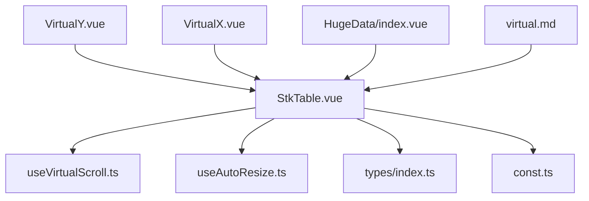
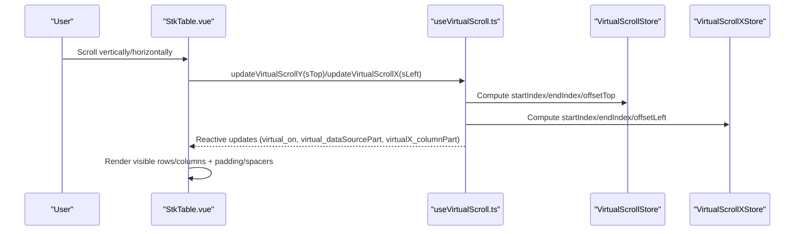
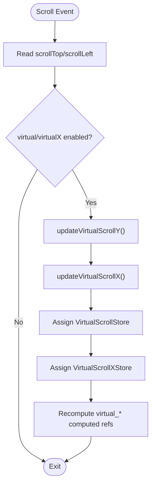
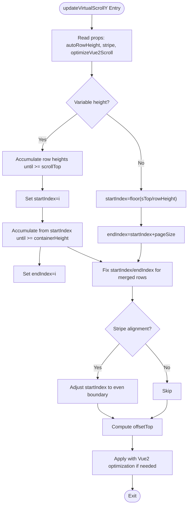
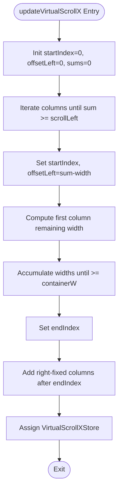
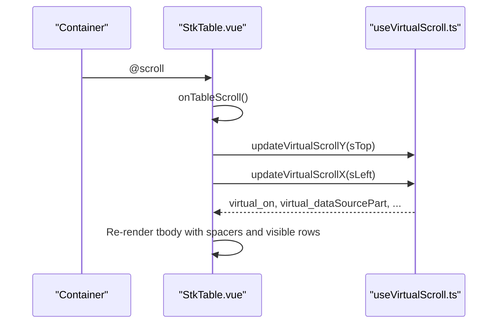
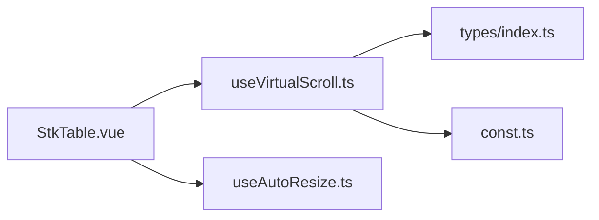

# Virtual Scrolling

<cite>
**Referenced Files in This Document**
- [useVirtualScroll.ts](file://src/StkTable/useVirtualScroll.ts)
- [StkTable.vue](file://src/StkTable/StkTable.vue)
- [types/index.ts](file://src/StkTable/types/index.ts)
- [const.ts](file://src/StkTable/const.ts)
- [useAutoResize.ts](file://src/StkTable/useAutoResize.ts)
- [virtual.md](file://docs-src/main/table/advanced/virtual.md)
- [VirtualY.vue](file://docs-demo/advanced/virtual/VirtualY.vue)
- [VirtualX.vue](file://docs-demo/advanced/virtual/VirtualX.vue)
- [HugeData/index.vue](file://docs-demo/demos/HugeData/index.vue)
- [AutoHeightVirtual/index.vue](file://docs-demo/advanced/auto-height-virtual/AutoHeightVirtual/index.vue)
</cite>

## Table of Contents
1. [Introduction](#introduction)
2. [Project Structure](#project-structure)
3. [Core Components](#core-components)
4. [Architecture Overview](#architecture-overview)
5. [Detailed Component Analysis](#detailed-component-analysis)
6. [Dependency Analysis](#dependency-analysis)
7. [Performance Considerations](#performance-considerations)
8. [Troubleshooting Guide](#troubleshooting-guide)
9. [Conclusion](#conclusion)
10. [Appendices](#appendices)

## Introduction
This document explains the virtual scrolling mechanics in Stk Table Vue. Virtual scrolling renders only the visible portion of very large datasets (rows or columns) to achieve smooth scrolling and low memory usage. It covers the virtual scroll engine, data structures, viewport management, Y-axis and X-axis algorithms, auto-row height, expandable rows, merged cells, configuration options, and best practices.

## Project Structure
Virtual scrolling is implemented as a composable hook that integrates with the main StkTable component. Supporting utilities manage auto-resize and expose initialization APIs. Demo pages illustrate usage patterns for Y-axis and X-axis virtual scrolling.

**Diagram sources**
- [StkTable.vue](file://src/StkTable/StkTable.vue#L1-L200)
- [useVirtualScroll.ts](file://src/StkTable/useVirtualScroll.ts#L1-L120)
- [useAutoResize.ts](file://src/StkTable/useAutoResize.ts#L1-L92)
- [types/index.ts](file://src/StkTable/types/index.ts#L1-L120)
- [const.ts](file://src/StkTable/const.ts#L1-L51)
- [VirtualY.vue](file://docs-demo/advanced/virtual/VirtualY.vue#L1-L34)
- [VirtualX.vue](file://docs-demo/advanced/virtual/VirtualX.vue#L1-L29)
- [HugeData/index.vue](file://docs-demo/demos/HugeData/index.vue#L270-L293)
- [virtual.md](file://docs-src/main/table/advanced/virtual.md#L1-L70)

**Section sources**
- [StkTable.vue](file://src/StkTable/StkTable.vue#L1-L200)
- [useVirtualScroll.ts](file://src/StkTable/useVirtualScroll.ts#L1-L120)
- [useAutoResize.ts](file://src/StkTable/useAutoResize.ts#L1-L92)
- [virtual.md](file://docs-src/main/table/advanced/virtual.md#L1-L70)

## Core Components
- Virtual scroll engine: useVirtualScroll
  - Provides reactive stores for Y-axis and X-axis virtualization, viewport calculations, and offsets.
  - Exposes initialization and update functions for both axes.
- Main table integration: StkTable.vue
  - Consumes the virtual scroll stores to render only visible rows/columns.
  - Applies top/bottom padding and left/right spacer columns for virtualized regions.
- Types and constants
  - Defines column and row types, auto-row height configuration, and defaults.
- Auto-resize utility
  - Watches container size changes and reinitializes virtual scroll viewport.

**Section sources**
- [useVirtualScroll.ts](file://src/StkTable/useVirtualScroll.ts#L60-L495)
- [StkTable.vue](file://src/StkTable/StkTable.vue#L46-L195)
- [types/index.ts](file://src/StkTable/types/index.ts#L54-L120)
- [const.ts](file://src/StkTable/const.ts#L4-L8)
- [useAutoResize.ts](file://src/StkTable/useAutoResize.ts#L14-L91)

## Architecture Overview
The virtual scrolling pipeline consists of:
- Initialization: compute container height/width, page size, and initial scroll offsets.
- Scroll updates: recalculate visible range based on scrollTop/scrollLeft.
- Rendering: render only visible rows/columns, pad top/bottom and left/right to match full dataset height/width.

**Diagram sources**
- [StkTable.vue](file://src/StkTable/StkTable.vue#L46-L195)
- [useVirtualScroll.ts](file://src/StkTable/useVirtualScroll.ts#L272-L474)

## Detailed Component Analysis

### Virtual Scroll Engine: useVirtualScroll
Responsibilities:
- Maintain VirtualScrollStore (Y-axis) and VirtualScrollXStore (X-axis).
- Compute page size from container height and row height.
- Determine visible range (startIndex/endIndex) and offsets (top/left).
- Handle auto-row height, expandable rows, and merged cells.
- Optimize Vue 2 scroll behavior with timeouts.

Key data structures:
- VirtualScrollStore
  - containerHeight, pageSize, startIndex, endIndex, rowHeight, offsetTop, scrollTop, scrollHeight
- VirtualScrollXStore
  - containerWidth, scrollWidth, startIndex, endIndex, offsetLeft, scrollLeft

Page size calculation (Y-axis):
- Derive from container height and row height, subtracting header row heights when applicable.

Viewport management:
- Y-axis: updateVirtualScrollY computes visible range based on scroll position and row heights.
- X-axis: updateVirtualScrollX computes visible columns based on cumulative widths and container width.

Auto-row height:
- Stores measured heights per row key and supports expectedHeight configuration.
- Adjusts offsets and visible range when heights vary.

Expandable rows:
- Detects expand column presence and adjusts row height during calculations.

Merged cells:
- Corrects startIndex/endIndex to avoid partial spans crossing merged rows.

Vue 2 scroll optimization:
- Uses timeouts to batch updates when scrolling down, preventing excessive re-renders.

**Diagram sources**
- [useVirtualScroll.ts](file://src/StkTable/useVirtualScroll.ts#L272-L474)

**Section sources**
- [useVirtualScroll.ts](file://src/StkTable/useVirtualScroll.ts#L17-L50)
- [useVirtualScroll.ts](file://src/StkTable/useVirtualScroll.ts#L196-L229)
- [useVirtualScroll.ts](file://src/StkTable/useVirtualScroll.ts#L231-L236)
- [useVirtualScroll.ts](file://src/StkTable/useVirtualScroll.ts#L272-L403)
- [useVirtualScroll.ts](file://src/StkTable/useVirtualScroll.ts#L410-L474)

### Y-Axis Virtual Scrolling Algorithm
Highlights:
- startIndex/endIndex calculation
  - For uniform row height: integer division of scrollTop by rowHeight.
  - For variable heights (auto-row height or expanded rows): accumulate row heights until thresholds are met.
- Offset computation
  - offsetTop reflects the cumulative height before startIndex.
- Merged cells correction
  - Ensures merged spans are fully included in the visible range.
- Stripe alignment
  - Adjusts startIndex to prevent visual misalignment in striped tables.

**Diagram sources**
- [useVirtualScroll.ts](file://src/StkTable/useVirtualScroll.ts#L272-L403)

**Section sources**
- [useVirtualScroll.ts](file://src/StkTable/useVirtualScroll.ts#L272-L403)

### X-Axis Virtual Scrolling Algorithm
Highlights:
- Visible columns determined by cumulative widths exceeding scrollLeft.
- Left-fixed columns remain visible even when outside the viewport.
- Right-fixed columns are handled similarly on the right side.
- Container width minus fixed left width determines the viewport for middle columns.

**Diagram sources**
- [useVirtualScroll.ts](file://src/StkTable/useVirtualScroll.ts#L410-L474)

**Section sources**
- [useVirtualScroll.ts](file://src/StkTable/useVirtualScroll.ts#L410-L474)

### Integration in StkTable.vue
- Reactivity
  - Consumes virtual_on, virtual_dataSourcePart, virtual_offsetBottom, virtualX_on, virtualX_columnPart, virtualX_offsetRight, tableHeaderHeight.
- Rendering
  - Renders only visible rows via virtual_dataSourcePart.
  - Pads top with a spacer row sized to virtualScroll.offsetTop.
  - Pads bottom with a spacer sized to virtual_offsetBottom.
  - Adds left/right spacer columns when virtualX_on is active.
- Events
  - Listens to scroll events and triggers updateVirtualScrollY/X.
  - Emits scroll-related events for external monitoring.

**Diagram sources**
- [StkTable.vue](file://src/StkTable/StkTable.vue#L39-L41)
- [StkTable.vue](file://src/StkTable/StkTable.vue#L103-L179)
- [useVirtualScroll.ts](file://src/StkTable/useVirtualScroll.ts#L272-L474)

**Section sources**
- [StkTable.vue](file://src/StkTable/StkTable.vue#L39-L41)
- [StkTable.vue](file://src/StkTable/StkTable.vue#L61-L101)
- [StkTable.vue](file://src/StkTable/StkTable.vue#L103-L179)
- [StkTable.vue](file://src/StkTable/StkTable.vue#L771-L788)

### Auto-Row Height Support
- Expected height
  - Configure via props.autoRowHeight.expectedHeight (number or function).
- Measured height
  - On-the-fly measurement stored per row key.
- Behavior
  - When autoRowHeight is enabled, updateVirtualScrollY accumulates measured heights to compute visible range.
  - Offsets adjust accordingly to maintain accurate scroll positioning.

**Section sources**
- [types/index.ts](file://src/StkTable/types/index.ts#L275-L278)
- [useVirtualScroll.ts](file://src/StkTable/useVirtualScroll.ts#L178-L190)
- [useVirtualScroll.ts](file://src/StkTable/useVirtualScroll.ts#L241-L270)
- [useVirtualScroll.ts](file://src/StkTable/useVirtualScroll.ts#L291-L318)

### Expandable Rows
- Detection
  - Presence of an expand column is detected to adjust row height logic.
- Height consideration
  - Expanded rows use expandConfig.height when computing visible range and offsets.

**Section sources**
- [useVirtualScroll.ts](file://src/StkTable/useVirtualScroll.ts#L95-L97)
- [useVirtualScroll.ts](file://src/StkTable/useVirtualScroll.ts#L184-L188)
- [types/index.ts](file://src/StkTable/types/index.ts#L243-L247)

### Merge Cells Scenarios
- Merged rows
  - If a merged span crosses startIndex or endIndex, the algorithm expands the visible range to include the entire span.
- Impact
  - Ensures merged cells are fully rendered and avoids partial spans.

**Section sources**
- [useVirtualScroll.ts](file://src/StkTable/useVirtualScroll.ts#L323-L356)

### Configuration Options
- Props
  - virtual: enable Y-axis virtualization.
  - virtualX: enable X-axis virtualization.
  - autoRowHeight: enable variable row heights.
  - rowHeight: base row height used for calculations when autoRowHeight is false.
  - autoResize: automatic viewport recalculation on container resize.
- Methods (exposed)
  - initVirtualScrollY(height?)
  - initVirtualScrollX()
  - initVirtualScroll(height?)

**Section sources**
- [StkTable.vue](file://src/StkTable/StkTable.vue#L278-L476)
- [virtual.md](file://docs-src/main/table/advanced/virtual.md#L4-L59)
- [const.ts](file://src/StkTable/const.ts#L4-L8)

### Best Practices
- Y-axis virtualization
  - Enable virtual for large datasets; keep rowHeight reasonable.
  - Prefer autoRowHeight only when necessary; otherwise use a fixed rowHeight.
- X-axis virtualization
  - Set explicit column widths for accurate viewport calculation.
  - Keep fixed columns minimal to reduce overhead.
- Mixed axes
  - Combine virtual and virtualX for extremely large datasets with many columns.
- Performance
  - Use autoResize to automatically recalculate viewport on container changes.
  - Avoid unnecessary reactivity churn by relying on built-in debouncing.

**Section sources**
- [virtual.md](file://docs-src/main/table/advanced/virtual.md#L14-L31)
- [useAutoResize.ts](file://src/StkTable/useAutoResize.ts#L14-L91)

## Dependency Analysis
- useVirtualScroll depends on:
  - Props and refs from StkTable.vue (container, trRefs, data, headers).
  - Constants for defaults (row height, table dimensions).
  - Utility for column width calculation.
- StkTable.vue depends on:
  - useVirtualScroll for computed visibility and offsets.
  - useAutoResize for viewport recalculation.
  - Types for column and row definitions.

**Diagram sources**
- [StkTable.vue](file://src/StkTable/StkTable.vue#L263-L267)
- [useVirtualScroll.ts](file://src/StkTable/useVirtualScroll.ts#L1-L5)
- [types/index.ts](file://src/StkTable/types/index.ts#L1-L120)
- [const.ts](file://src/StkTable/const.ts#L1-L8)

**Section sources**
- [StkTable.vue](file://src/StkTable/StkTable.vue#L263-L267)
- [useVirtualScroll.ts](file://src/StkTable/useVirtualScroll.ts#L1-L5)

## Performance Considerations
- Rendering cost
  - Only visible rows/columns are mounted, reducing DOM nodes and layout work.
- Memory footprint
  - Avoids storing off-screen DOM nodes; maintains small reactive state.
- Scroll responsiveness
  - Accumulated height scanning is bounded by viewport size; merged cell corrections limit extra rows.
- Auto-resize
  - Debounced recalculation prevents frequent re-initializations on rapid resizes.

[No sources needed since this section provides general guidance]

## Troubleshooting Guide
- White screen on fast scroll
  - Enable smoothScroll or optimizeVue2Scroll to mitigate rendering artifacts during rapid scrolling.
- Incorrect visible range with merged rows
  - Ensure merged cells are configured; the engine adjusts startIndex/endIndex to include full spans.
- Misaligned stripes
  - Stripe alignment logic adjusts startIndex to even boundaries; disable stripe if visual alignment is critical.
- X-axis virtualization not working
  - Verify column widths are set; virtualX_on requires total width exceeding container width.

**Section sources**
- [useVirtualScroll.ts](file://src/StkTable/useVirtualScroll.ts#L358-L365)
- [useVirtualScroll.ts](file://src/StkTable/useVirtualScroll.ts#L127-L132)
- [useVirtualScroll.ts](file://src/StkTable/useVirtualScroll.ts#L464-L473)

## Conclusion
Stk Table Vue’s virtual scrolling delivers high-performance rendering for large datasets by limiting DOM to visible items. The engine accurately handles variable row heights, expandable rows, merged cells, and wide tables with column virtualization. With proper configuration and best practices, virtual scrolling ensures smooth UX across diverse scenarios.

[No sources needed since this section summarizes without analyzing specific files]

## Appendices

### API and Demos
- Y-axis virtualization demo
  - Demonstrates virtual with a large dataset and fixed container height.
- X-axis virtualization demo
  - Demonstrates virtualX with thousands of columns and explicit widths.
- Huge data demo
  - Comprehensive example combining virtual, virtualX, sorting, and dynamic updates.
- Auto-row height virtual demo
  - Example of autoRowHeight with virtual enabled.

**Section sources**
- [VirtualY.vue](file://docs-demo/advanced/virtual/VirtualY.vue#L1-L34)
- [VirtualX.vue](file://docs-demo/advanced/virtual/VirtualX.vue#L1-L29)
- [HugeData/index.vue](file://docs-demo/demos/HugeData/index.vue#L270-L293)
- [AutoHeightVirtual/index.vue](file://docs-demo/advanced/auto-height-virtual/AutoHeightVirtual/index.vue#L24-L34)