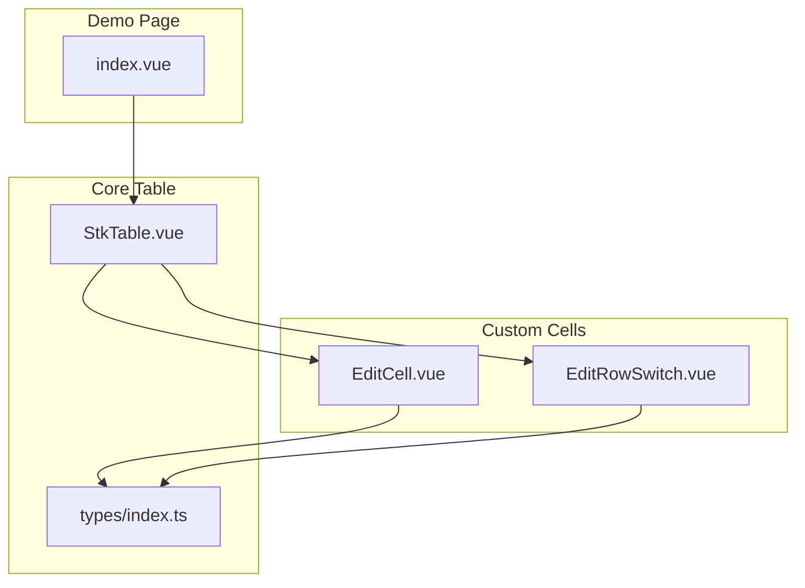
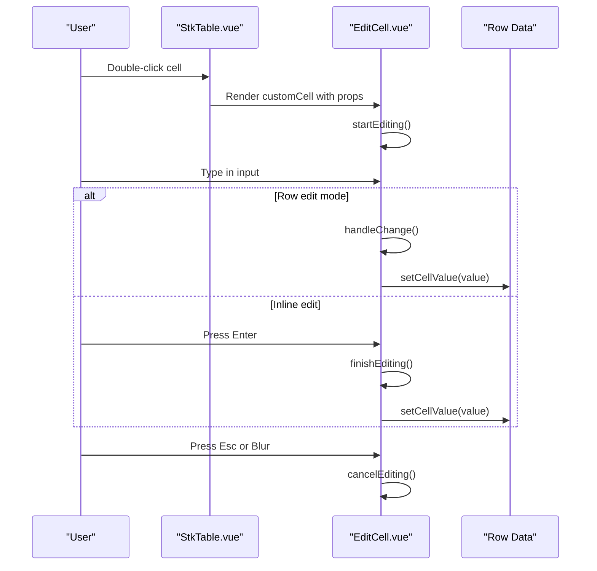
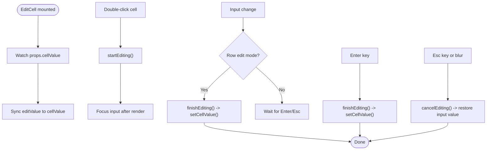
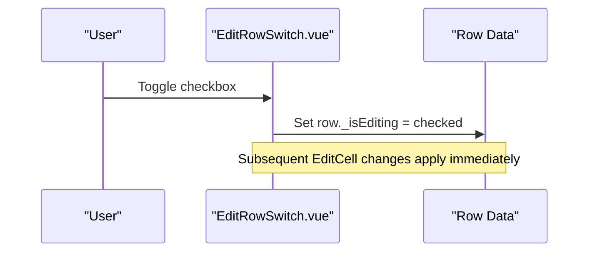
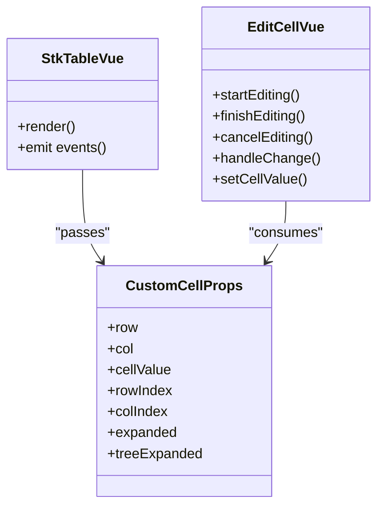
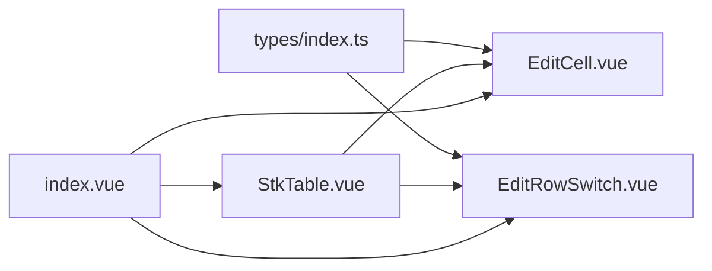

# Cell Editing Scenarios

<cite>
**Referenced Files in This Document**
- [EditCell.vue](file://docs-demo/demos/CellEdit/EditCell.vue)
- [EditRowSwitch.vue](file://docs-demo/demos/CellEdit/EditRowSwitch.vue)
- [index.vue](file://docs-demo/demos/CellEdit/index.vue)
- [type.ts](file://docs-demo/demos/CellEdit/type.ts)
- [StkTable.vue](file://src/StkTable/StkTable.vue)
- [index.ts](file://src/StkTable/types/index.ts)
- [cell-edit.md](file://docs-src/demos/cell-edit.md)
- [ExpandCell.vue](file://docs-demo/demos/HugeData/custom-cells/ExpandCell.vue)
- [SourceCell.vue](file://docs-demo/demos/HugeData/custom-cells/SourceCell.vue)
- [event.ts](file://docs-demo/demos/HugeData/event.ts)
- [types.ts](file://docs-demo/demos/HugeData/types.ts)
</cite>

## Table of Contents
1. [Introduction](#introduction)
2. [Project Structure](#project-structure)
3. [Core Components](#core-components)
4. [Architecture Overview](#architecture-overview)
5. [Detailed Component Analysis](#detailed-component-analysis)
6. [Dependency Analysis](#dependency-analysis)
7. [Performance Considerations](#performance-considerations)
8. [Troubleshooting Guide](#troubleshooting-guide)
9. [Conclusion](#conclusion)
10. [Appendices](#appendices)

## Introduction
This document explains the cell editing implementations and interactive data manipulation scenarios demonstrated in the repository. It focuses on:
- The EditCell component architecture and edit mode management
- Inline editing and row-based editing modes
- Custom editor components via customCell
- Event handling for edit operations
- Data persistence strategies and conflict resolution patterns
- Implementation guides for custom editors, validation rules, and user feedback mechanisms

The examples are built around a minimal, reusable EditCell component and a row-level toggle switch, integrated into the StkTable via customCell.

## Project Structure
The cell editing demo resides under docs-demo/demos/CellEdit and integrates with the core StkTable component. The key files are:
- EditCell.vue: An inline editor bound to a single cell value
- EditRowSwitch.vue: A row-level toggle that switches a row into persistent edit mode
- index.vue: A demo page configuring columns and data to showcase both inline and row-based editing
- type.ts: TypeScript types for row data and edit state
- StkTable.vue: The core table component that renders custom cells
- index.ts: Types for customCell props and column configuration

**Diagram sources**
- [index.vue](file://docs-demo/demos/CellEdit/index.vue#L1-L50)
- [EditCell.vue](file://docs-demo/demos/CellEdit/EditCell.vue#L1-L92)
- [EditRowSwitch.vue](file://docs-demo/demos/CellEdit/EditRowSwitch.vue#L1-L28)
- [StkTable.vue](file://src/StkTable/StkTable.vue#L135-L153)
- [index.ts](file://src/StkTable/types/index.ts#L8-L23)

**Section sources**
- [index.vue](file://docs-demo/demos/CellEdit/index.vue#L1-L50)
- [EditCell.vue](file://docs-demo/demos/CellEdit/EditCell.vue#L1-L92)
- [EditRowSwitch.vue](file://docs-demo/demos/CellEdit/EditRowSwitch.vue#L1-L28)
- [StkTable.vue](file://src/StkTable/StkTable.vue#L135-L153)
- [index.ts](file://src/StkTable/types/index.ts#L8-L23)

## Core Components
- EditCell.vue
  - Purpose: Provides inline editing for a single cell value
  - Edit modes:
    - Inline edit: Double-click to enter edit mode; Enter saves, Esc or blur cancels
    - Row edit mode: When the row’s _isEditing flag is true, edits apply immediately on change
  - Data binding: Two-way reactive editValue synchronized with props.cellValue; writes back to row[col.dataIndex]
  - Focus management: Sets focus to the input after rendering to improve UX
- EditRowSwitch.vue
  - Purpose: Adds a checkbox cell to toggle a row’s _isEditing flag
  - Behavior: Updates row._isEditing on change
- Demo page (index.vue)
  - Configures columns with customCell pointing to EditCell and a row-level switch column
  - Initializes data with some rows already in edit mode

Key props passed to custom cells:
- row, col, cellValue, rowIndex, colIndex, expanded, treeExpanded

**Section sources**
- [EditCell.vue](file://docs-demo/demos/CellEdit/EditCell.vue#L17-L72)
- [EditRowSwitch.vue](file://docs-demo/demos/CellEdit/EditRowSwitch.vue#L7-L17)
- [index.vue](file://docs-demo/demos/CellEdit/index.vue#L20-L48)
- [index.ts](file://src/StkTable/types/index.ts#L8-L23)

## Architecture Overview
The StkTable component renders custom cells by passing a standardized set of props to the component configured in customCell. The EditCell component reads the current value and exposes an input field when editing is active. The row-level switch toggles a per-row flag that affects how edits behave.

**Diagram sources**
- [StkTable.vue](file://src/StkTable/StkTable.vue#L135-L153)
- [EditCell.vue](file://docs-demo/demos/CellEdit/EditCell.vue#L38-L72)

## Detailed Component Analysis

### EditCell.vue Analysis
EditCell implements:
- Reactive editValue synchronized with props.cellValue
- Inline edit lifecycle: startEditing, finishEditing, cancelEditing
- Row edit mode: when row._isEditing is true, edits apply immediately on change
- Focus management after render
- Direct write-back to row[col.dataIndex]

**Diagram sources**
- [EditCell.vue](file://docs-demo/demos/CellEdit/EditCell.vue#L26-L72)

**Section sources**
- [EditCell.vue](file://docs-demo/demos/CellEdit/EditCell.vue#L17-L72)

### EditRowSwitch.vue Analysis
EditRowSwitch provides a checkbox cell that toggles row._isEditing. This enables row-based editing mode where inline changes are applied immediately without requiring Enter.

**Diagram sources**
- [EditRowSwitch.vue](file://docs-demo/demos/CellEdit/EditRowSwitch.vue#L13-L17)

**Section sources**
- [EditRowSwitch.vue](file://docs-demo/demos/CellEdit/EditRowSwitch.vue#L7-L17)

### StkTable Integration and Custom Cell Rendering
StkTable renders custom cells by passing props such as row, col, cellValue, rowIndex, colIndex, expanded, treeExpanded. The EditCell component consumes these props to manage editing state and data updates.

**Diagram sources**
- [StkTable.vue](file://src/StkTable/StkTable.vue#L135-L153)
- [index.ts](file://src/StkTable/types/index.ts#L8-L23)
- [EditCell.vue](file://docs-demo/demos/CellEdit/EditCell.vue#L17-L21)

**Section sources**
- [StkTable.vue](file://src/StkTable/StkTable.vue#L135-L153)
- [index.ts](file://src/StkTable/types/index.ts#L8-L23)

### Example: Inline Editing
- Trigger: Double-click a cell
- Behavior: Input appears; Enter saves; Esc or blur cancels
- Persistence: On save, the new value is written to row[col.dataIndex]

**Section sources**
- [EditCell.vue](file://docs-demo/demos/CellEdit/EditCell.vue#L38-L50)
- [index.vue](file://docs-demo/demos/CellEdit/index.vue#L32-L37)

### Example: Row-Based Editing Modes
- Trigger: Toggle the checkbox in the “edit” column
- Behavior: When _isEditing is true, inline changes apply immediately on change
- Persistence: Changes persist directly to row[col.dataIndex]

**Section sources**
- [EditRowSwitch.vue](file://docs-demo/demos/CellEdit/EditRowSwitch.vue#L13-L17)
- [EditCell.vue](file://docs-demo/demos/CellEdit/EditCell.vue#L63-L67)
- [index.vue](file://docs-demo/demos/CellEdit/index.vue#L41-L48)

### Custom Editor Components
Beyond EditCell, the repository demonstrates custom cells for other interactive scenarios:
- ExpandCell.vue: Emits an event to toggle expansion state
- SourceCell.vue: Renders a cell based on mapped values

These examples illustrate how to integrate event emission and mapping logic into custom cells.

**Section sources**
- [ExpandCell.vue](file://docs-demo/demos/HugeData/custom-cells/ExpandCell.vue#L1-L37)
- [SourceCell.vue](file://docs-demo/demos/HugeData/custom-cells/SourceCell.vue#L1-L19)
- [event.ts](file://docs-demo/demos/HugeData/event.ts#L1-L7)
- [types.ts](file://docs-demo/demos/HugeData/types.ts#L1-L52)

## Dependency Analysis
- EditCell depends on:
  - CustomCellProps interface for typed props
  - Vue reactivity (ref, computed, watch)
  - DOM ref for focus management
- EditRowSwitch depends on:
  - CustomCellProps interface
  - Direct mutation of row._isEditing
- StkTable depends on:
  - Column configuration with customCell
  - Rendering loop that passes props to custom cells

**Diagram sources**
- [index.ts](file://src/StkTable/types/index.ts#L8-L23)
- [EditCell.vue](file://docs-demo/demos/CellEdit/EditCell.vue#L17-L21)
- [EditRowSwitch.vue](file://docs-demo/demos/CellEdit/EditRowSwitch.vue#L7-L11)
- [StkTable.vue](file://src/StkTable/StkTable.vue#L135-L153)
- [index.vue](file://docs-demo/demos/CellEdit/index.vue#L20-L27)

**Section sources**
- [index.ts](file://src/StkTable/types/index.ts#L8-L23)
- [EditCell.vue](file://docs-demo/demos/CellEdit/EditCell.vue#L17-L21)
- [EditRowSwitch.vue](file://docs-demo/demos/CellEdit/EditRowSwitch.vue#L7-L11)
- [StkTable.vue](file://src/StkTable/StkTable.vue#L135-L153)
- [index.vue](file://docs-demo/demos/CellEdit/index.vue#L20-L27)

## Performance Considerations
- Inline editing triggers immediate reactive updates; in row edit mode, each change applies instantly. For large datasets, consider debouncing or batching updates to avoid excessive reactivity churn.
- Keep customCell lightweight; avoid heavy computations inside handleChange or finishEditing.
- Prefer direct property writes to row[col.dataIndex] for simplicity, but wrap with validation and normalization to minimize invalid states.

[No sources needed since this section provides general guidance]

## Troubleshooting Guide
Common issues and resolutions:
- Input does not receive focus after double-click
  - Ensure the input ref is available before focusing; the component uses a zero-delay timeout to set focus after render.
- Changes not saved when exiting inline edit
  - Confirm Enter key or explicit finishEditing is invoked; Esc or blur cancels without saving.
- Row edit mode not taking effect
  - Verify the row’s _isEditing flag is present and truthy; EditCell checks row._isEditing to decide behavior.
- Data not updating in the table
  - Ensure the column’s dataIndex matches the row property being modified; EditCell writes directly to row[col.dataIndex].

**Section sources**
- [EditCell.vue](file://docs-demo/demos/CellEdit/EditCell.vue#L38-L72)
- [EditRowSwitch.vue](file://docs-demo/demos/CellEdit/EditRowSwitch.vue#L13-L17)

## Conclusion
The repository demonstrates a clean, extensible pattern for cell editing:
- Inline editing with Enter/Esc controls and immediate row-level switching
- Custom cells integrated via customCell with a consistent prop contract
- Straightforward persistence by writing back to row[col.dataIndex]
- Extensible foundation for validation, async persistence, and user feedback

[No sources needed since this section summarizes without analyzing specific files]

## Appendices

### Implementation Guides

- Implementing a custom editor
  - Use customCell to mount a component that accepts CustomCellProps
  - Manage internal editValue and synchronize with props.cellValue
  - Decide edit mode: inline (Enter/Esc) or row-based (_isEditing)
  - Persist changes by writing to row[col.dataIndex]

- Validation rules
  - Validate input in handleChange or finishEditing
  - Optionally keep an originalValue and compare to detect changes
  - Provide user feedback (e.g., visual cues or messages) when validation fails

- User feedback mechanisms
  - Show tooltips or aria attributes indicating edit mode
  - Highlight edited cells or rows during row edit mode
  - Debounce rapid changes to reduce UI jitter

- Data persistence strategies
  - Immediate write-back for row edit mode
  - Deferred save for inline mode (e.g., on Enter or blur)
  - Async persistence: show loading states and handle errors gracefully

- Conflict resolution patterns
  - Detect concurrent edits by tracking lastModified timestamps
  - Implement optimistic updates with rollback on conflict
  - Use a queue or batch updates to avoid overwriting each other

**Section sources**
- [EditCell.vue](file://docs-demo/demos/CellEdit/EditCell.vue#L26-L72)
- [EditRowSwitch.vue](file://docs-demo/demos/CellEdit/EditRowSwitch.vue#L13-L17)
- [index.ts](file://src/StkTable/types/index.ts#L8-L23)
- [cell-edit.md](file://docs-src/demos/cell-edit.md#L1-L17)