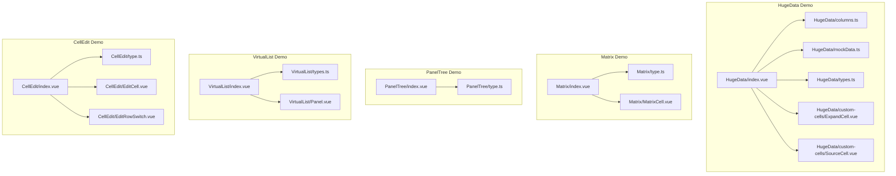
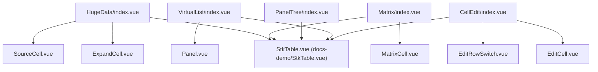
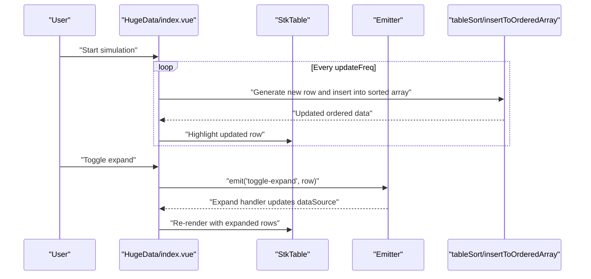
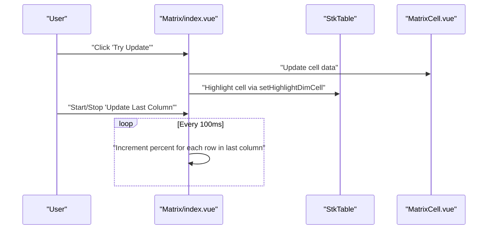
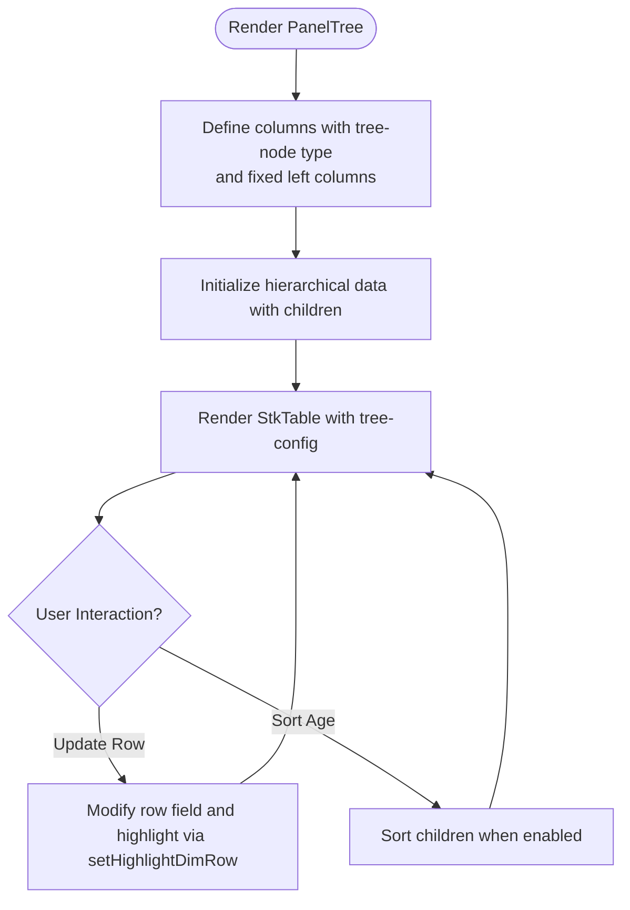
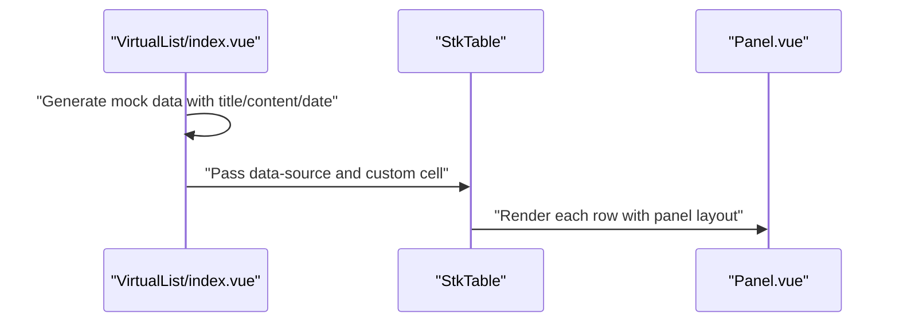
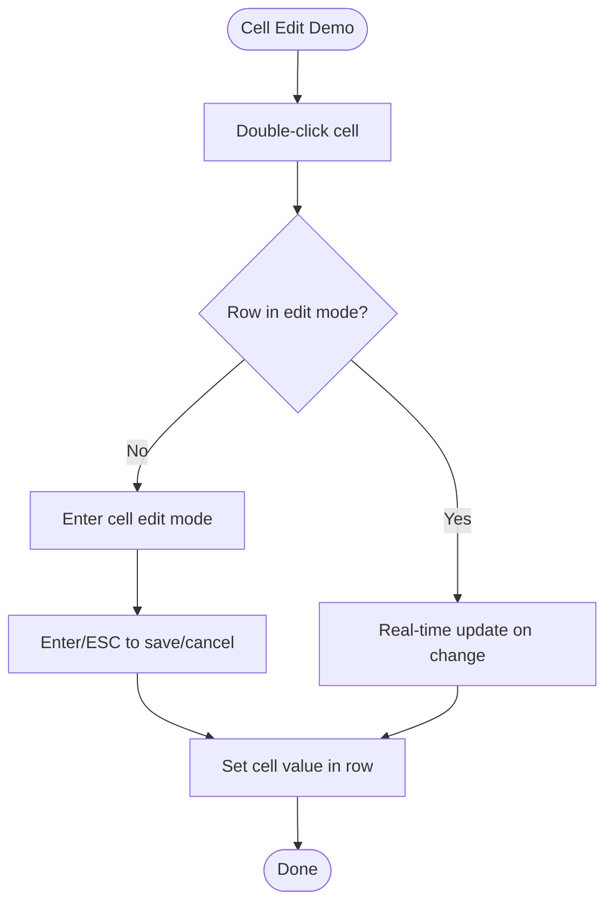
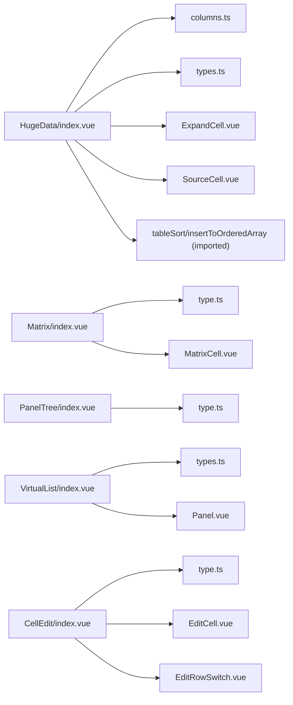

# Examples and Showcase

<cite>
**Referenced Files in This Document**
- [docs-demo/demos/HugeData/index.vue](file://docs-demo/demos/HugeData/index.vue)
- [docs-demo/demos/HugeData/columns.ts](file://docs-demo/demos/HugeData/columns.ts)
- [docs-demo/demos/HugeData/mockData.ts](file://docs-demo/demos/HugeData/mockData.ts)
- [docs-demo/demos/HugeData/types.ts](file://docs-demo/demos/HugeData/types.ts)
- [docs-demo/demos/HugeData/custom-cells/ExpandCell.vue](file://docs-demo/demos/HugeData/custom-cells/ExpandCell.vue)
- [docs-demo/demos/HugeData/custom-cells/SourceCell.vue](file://docs-demo/demos/HugeData/custom-cells/SourceCell.vue)
- [docs-demo/demos/Matrix/index.vue](file://docs-demo/demos/Matrix/index.vue)
- [docs-demo/demos/Matrix/type.ts](file://docs-demo/demos/Matrix/type.ts)
- [docs-demo/demos/Matrix/MatrixCell.vue](file://docs-demo/demos/Matrix/MatrixCell.vue)
- [docs-demo/demos/PanelTree/index.vue](file://docs-demo/demos/PanelTree/index.vue)
- [docs-demo/demos/PanelTree/type.ts](file://docs-demo/demos/PanelTree/type.ts)
- [docs-demo/demos/VirtualList/index.vue](file://docs-demo/demos/VirtualList/index.vue)
- [docs-demo/demos/VirtualList/types.ts](file://docs-demo/demos/VirtualList/types.ts)
- [docs-demo/demos/VirtualList/Panel.vue](file://docs-demo/demos/VirtualList/Panel.vue)
- [docs-demo/demos/CellEdit/index.vue](file://docs-demo/demos/CellEdit/index.vue)
- [docs-demo/demos/CellEdit/type.ts](file://docs-demo/demos/CellEdit/type.ts)
- [docs-demo/demos/CellEdit/EditCell.vue](file://docs-demo/demos/CellEdit/EditCell.vue)
- [docs-demo/demos/CellEdit/EditRowSwitch.vue](file://docs-demo/demos/CellEdit/EditRowSwitch.vue)
</cite>

## Table of Contents
1. [Introduction](#introduction)
2. [Project Structure](#project-structure)
3. [Core Components](#core-components)
4. [Architecture Overview](#architecture-overview)
5. [Detailed Component Analysis](#detailed-component-analysis)
6. [Dependency Analysis](#dependency-analysis)
7. [Performance Considerations](#performance-considerations)
8. [Troubleshooting Guide](#troubleshooting-guide)
9. [Conclusion](#conclusion)
10. [Appendices](#appendices)

## Introduction
This document showcases practical implementation examples and real-world use cases powered by StkTable Vue. It covers:
- Huge data demonstration with performance controls and virtualization
- Matrix table examples with custom cells and periodic updates
- Panel tree implementations with nested rows and highlighting
- Virtual list patterns for non-tabular content
- Cell editing scenarios with interactive data manipulation
- Dynamic column management and merging strategies
- Integration patterns with state management and backend services

Each example includes step-by-step implementation guidance, diagrams, and references to the exact source files for reproducibility.

## Project Structure
The examples are organized under docs-demo/demos with dedicated folders per feature. Each demo includes:
- An index.vue entry component
- Supporting TypeScript types
- Optional custom cell components
- Optional mock data and configuration files

**Diagram sources**
- [docs-demo/demos/HugeData/index.vue](file://docs-demo/demos/HugeData/index.vue#L1-L373)
- [docs-demo/demos/HugeData/columns.ts](file://docs-demo/demos/HugeData/columns.ts#L1-L223)
- [docs-demo/demos/HugeData/mockData.ts](file://docs-demo/demos/HugeData/mockData.ts#L1-L51)
- [docs-demo/demos/HugeData/types.ts](file://docs-demo/demos/HugeData/types.ts#L1-L52)
- [docs-demo/demos/HugeData/custom-cells/ExpandCell.vue](file://docs-demo/demos/HugeData/custom-cells/ExpandCell.vue#L1-L37)
- [docs-demo/demos/HugeData/custom-cells/SourceCell.vue](file://docs-demo/demos/HugeData/custom-cells/SourceCell.vue#L1-L19)
- [docs-demo/demos/Matrix/index.vue](file://docs-demo/demos/Matrix/index.vue#L1-L121)
- [docs-demo/demos/Matrix/type.ts](file://docs-demo/demos/Matrix/type.ts#L1-L16)
- [docs-demo/demos/Matrix/MatrixCell.vue](file://docs-demo/demos/Matrix/MatrixCell.vue#L1-L91)
- [docs-demo/demos/PanelTree/index.vue](file://docs-demo/demos/PanelTree/index.vue#L1-L333)
- [docs-demo/demos/PanelTree/type.ts](file://docs-demo/demos/PanelTree/type.ts#L1-L13)
- [docs-demo/demos/VirtualList/index.vue](file://docs-demo/demos/VirtualList/index.vue#L1-L43)
- [docs-demo/demos/VirtualList/types.ts](file://docs-demo/demos/VirtualList/types.ts#L1-L6)
- [docs-demo/demos/VirtualList/Panel.vue](file://docs-demo/demos/VirtualList/Panel.vue#L1-L42)
- [docs-demo/demos/CellEdit/index.vue](file://docs-demo/demos/CellEdit/index.vue#L1-L50)
- [docs-demo/demos/CellEdit/type.ts](file://docs-demo/demos/CellEdit/type.ts#L1-L15)
- [docs-demo/demos/CellEdit/EditCell.vue](file://docs-demo/demos/CellEdit/EditCell.vue#L1-L92)
- [docs-demo/demos/CellEdit/EditRowSwitch.vue](file://docs-demo/demos/CellEdit/EditRowSwitch.vue#L1-L28)

**Section sources**
- [docs-demo/demos/HugeData/index.vue](file://docs-demo/demos/HugeData/index.vue#L1-L373)
- [docs-demo/demos/Matrix/index.vue](file://docs-demo/demos/Matrix/index.vue#L1-L121)
- [docs-demo/demos/PanelTree/index.vue](file://docs-demo/demos/PanelTree/index.vue#L1-L333)
- [docs-demo/demos/VirtualList/index.vue](file://docs-demo/demos/VirtualList/index.vue#L1-L43)
- [docs-demo/demos/CellEdit/index.vue](file://docs-demo/demos/CellEdit/index.vue#L1-L50)

## Core Components
- HugeData: Demonstrates large datasets with virtual scrolling, sorting, merging, and periodic updates.
- Matrix: Builds a matrix-like table with custom cells and periodic percentage updates.
- PanelTree: Renders hierarchical data with tree nodes, fixed columns, and row highlighting.
- VirtualList: Uses StkTable as a virtualized list container for rich card-like items.
- CellEdit: Enables inline editing per cell and row-level editing mode.

**Section sources**
- [docs-demo/demos/HugeData/index.vue](file://docs-demo/demos/HugeData/index.vue#L1-L373)
- [docs-demo/demos/Matrix/index.vue](file://docs-demo/demos/Matrix/index.vue#L1-L121)
- [docs-demo/demos/PanelTree/index.vue](file://docs-demo/demos/PanelTree/index.vue#L1-L333)
- [docs-demo/demos/VirtualList/index.vue](file://docs-demo/demos/VirtualList/index.vue#L1-L43)
- [docs-demo/demos/CellEdit/index.vue](file://docs-demo/demos/CellEdit/index.vue#L1-L50)

## Architecture Overview
The demos share a common pattern:
- A StkTable component is configured via props (columns, data-source, virtualization flags).
- Custom cells encapsulate rendering and interactivity.
- Utilities and helpers manage sorting, merging, and highlighting.
- Optional event emitters coordinate actions like expanding rows.

**Diagram sources**
- [docs-demo/StkTable.vue](file://docs-demo/StkTable.vue#L1-L200)
- [docs-demo/demos/HugeData/index.vue](file://docs-demo/demos/HugeData/index.vue#L1-L373)
- [docs-demo/demos/HugeData/custom-cells/ExpandCell.vue](file://docs-demo/demos/HugeData/custom-cells/ExpandCell.vue#L1-L37)
- [docs-demo/demos/HugeData/custom-cells/SourceCell.vue](file://docs-demo/demos/HugeData/custom-cells/SourceCell.vue#L1-L19)
- [docs-demo/demos/Matrix/index.vue](file://docs-demo/demos/Matrix/index.vue#L1-L121)
- [docs-demo/demos/Matrix/MatrixCell.vue](file://docs-demo/demos/Matrix/MatrixCell.vue#L1-L91)
- [docs-demo/demos/VirtualList/index.vue](file://docs-demo/demos/VirtualList/index.vue#L1-L43)
- [docs-demo/demos/VirtualList/Panel.vue](file://docs-demo/demos/VirtualList/Panel.vue#L1-L42)
- [docs-demo/demos/CellEdit/index.vue](file://docs-demo/demos/CellEdit/index.vue#L1-L50)
- [docs-demo/demos/CellEdit/EditCell.vue](file://docs-demo/demos/CellEdit/EditCell.vue#L1-L92)
- [docs-demo/demos/CellEdit/EditRowSwitch.vue](file://docs-demo/demos/CellEdit/EditRowSwitch.vue#L1-L28)

## Detailed Component Analysis

### Huge Data Demonstration
This demo simulates a financial market feed with:
- Large dataset generation and sorting
- Periodic updates with highlight feedback
- Expandable child rows
- Column merging (rowspan/colspan)
- Virtual scrolling and performance toggles

Key capabilities:
- Dynamic data size selection and initialization
- Sorting configuration and remote sorting support
- Highlighting updated rows after insertion
- Toggle for row-by-row scrolling and translateZ stacking

**Diagram sources**
- [docs-demo/demos/HugeData/index.vue](file://docs-demo/demos/HugeData/index.vue#L120-L174)
- [docs-demo/demos/HugeData/custom-cells/ExpandCell.vue](file://docs-demo/demos/HugeData/custom-cells/ExpandCell.vue#L1-L37)

Implementation highlights:
- Columns definition with fixed left columns, sorting, alignment, and custom cells for special rows.
- Mock data template reused across generated rows.
- Sorting state and sort-change handler.
- Highlighting via setHighlightDimRow after nextTick.
- Merge cells toggled for rowspan/colspan tests.

Practical steps:
- Initialize columns and data source on mount.
- Simulate periodic updates and re-sort using binary insertion.
- Toggle virtualization and scroll modes for performance tuning.

**Section sources**
- [docs-demo/demos/HugeData/index.vue](file://docs-demo/demos/HugeData/index.vue#L1-L373)
- [docs-demo/demos/HugeData/columns.ts](file://docs-demo/demos/HugeData/columns.ts#L1-L223)
- [docs-demo/demos/HugeData/mockData.ts](file://docs-demo/demos/HugeData/mockData.ts#L1-L51)
- [docs-demo/demos/HugeData/types.ts](file://docs-demo/demos/HugeData/types.ts#L1-L52)
- [docs-demo/demos/HugeData/custom-cells/ExpandCell.vue](file://docs-demo/demos/HugeData/custom-cells/ExpandCell.vue#L1-L37)
- [docs-demo/demos/HugeData/custom-cells/SourceCell.vue](file://docs-demo/demos/HugeData/custom-cells/SourceCell.vue#L1-L19)

### Matrix Table Example
This demo builds a matrix with:
- Four time buckets (1M, 3M, 6M, 1Y)
- Custom cell component rendering code/value/count/bp with gradient percent bar
- Periodic updates to the last column’s percent values
- Highlighting a specific cell after targeted update

**Diagram sources**
- [docs-demo/demos/Matrix/index.vue](file://docs-demo/demos/Matrix/index.vue#L81-L100)
- [docs-demo/demos/Matrix/MatrixCell.vue](file://docs-demo/demos/Matrix/MatrixCell.vue#L1-L91)

Implementation highlights:
- Columns with customCell for each bucket.
- Initialization of row data with random values.
- Interval-based updates to the last column’s percent values.
- Highlighting a single cell using setHighlightDimCell.

**Section sources**
- [docs-demo/demos/Matrix/index.vue](file://docs-demo/demos/Matrix/index.vue#L1-L121)
- [docs-demo/demos/Matrix/type.ts](file://docs-demo/demos/Matrix/type.ts#L1-L16)
- [docs-demo/demos/Matrix/MatrixCell.vue](file://docs-demo/demos/Matrix/MatrixCell.vue#L1-L91)

### Panel Tree Implementation
This demo renders hierarchical data as a tree with:
- Fixed left columns for ID/name
- Sorting on age with sortChildren enabled
- Row-level highlighting and empty cell customization
- Default expansion for top-level keys

**Diagram sources**
- [docs-demo/demos/PanelTree/index.vue](file://docs-demo/demos/PanelTree/index.vue#L34-L320)
- [docs-demo/demos/PanelTree/type.ts](file://docs-demo/demos/PanelTree/type.ts#L1-L13)

Implementation highlights:
- Column with type tree-node and fixed left columns.
- Empty cell text customized for parent rows.
- Row active disabled for parent rows.
- Highlighting via setHighlightDimRow after nextTick.

**Section sources**
- [docs-demo/demos/PanelTree/index.vue](file://docs-demo/demos/PanelTree/index.vue#L1-L333)
- [docs-demo/demos/PanelTree/type.ts](file://docs-demo/demos/PanelTree/type.ts#L1-L13)

### Virtual List Pattern
This demo uses StkTable as a virtualized list container:
- Single column with a custom cell component rendering a panel-like layout
- Fixed row height and headless mode
- Non-tabular content with shadow and rounded corners

**Diagram sources**
- [docs-demo/demos/VirtualList/index.vue](file://docs-demo/demos/VirtualList/index.vue#L1-L43)
- [docs-demo/demos/VirtualList/types.ts](file://docs-demo/demos/VirtualList/types.ts#L1-L6)
- [docs-demo/demos/VirtualList/Panel.vue](file://docs-demo/demos/VirtualList/Panel.vue#L1-L42)

**Section sources**
- [docs-demo/demos/VirtualList/index.vue](file://docs-demo/demos/VirtualList/index.vue#L1-L43)
- [docs-demo/demos/VirtualList/types.ts](file://docs-demo/demos/VirtualList/types.ts#L1-L6)
- [docs-demo/demos/VirtualList/Panel.vue](file://docs-demo/demos/VirtualList/Panel.vue#L1-L42)

### Cell Editing Scenarios
This demo supports:
- Double-click to edit individual cells
- Real-time editing when row is in edit mode
- Row-level toggle to enable/disable editing mode
- Persisting edits back to the data model

**Diagram sources**
- [docs-demo/demos/CellEdit/index.vue](file://docs-demo/demos/CellEdit/index.vue#L32-L48)
- [docs-demo/demos/CellEdit/EditCell.vue](file://docs-demo/demos/CellEdit/EditCell.vue#L38-L72)
- [docs-demo/demos/CellEdit/EditRowSwitch.vue](file://docs-demo/demos/CellEdit/EditRowSwitch.vue#L13-L17)

Implementation highlights:
- Custom cell EditCell handles double-click, blur, enter, and escape events.
- EditRowSwitch toggles row-level editing mode.
- Data binding persists changes to the underlying row.

**Section sources**
- [docs-demo/demos/CellEdit/index.vue](file://docs-demo/demos/CellEdit/index.vue#L1-L50)
- [docs-demo/demos/CellEdit/type.ts](file://docs-demo/demos/CellEdit/type.ts#L1-L15)
- [docs-demo/demos/CellEdit/EditCell.vue](file://docs-demo/demos/CellEdit/EditCell.vue#L1-L92)
- [docs-demo/demos/CellEdit/EditRowSwitch.vue](file://docs-demo/demos/CellEdit/EditRowSwitch.vue#L1-L28)

## Dependency Analysis
The demos depend on shared StkTable components and utilities:
- StkTable props: columns, dataSource, rowKey, virtual/virtual-x, scroll options, sort config, mergeCells, highlight methods.
- Custom cells encapsulate presentation and interaction logic.
- Utilities for sorting and insertion are used in HugeData.

**Diagram sources**
- [docs-demo/demos/HugeData/index.vue](file://docs-demo/demos/HugeData/index.vue#L1-L14)
- [docs-demo/demos/HugeData/columns.ts](file://docs-demo/demos/HugeData/columns.ts#L1-L10)
- [docs-demo/demos/HugeData/types.ts](file://docs-demo/demos/HugeData/types.ts#L1-L52)
- [docs-demo/demos/HugeData/custom-cells/ExpandCell.vue](file://docs-demo/demos/HugeData/custom-cells/ExpandCell.vue#L1-L7)
- [docs-demo/demos/HugeData/custom-cells/SourceCell.vue](file://docs-demo/demos/HugeData/custom-cells/SourceCell.vue#L1-L4)
- [docs-demo/demos/Matrix/index.vue](file://docs-demo/demos/Matrix/index.vue#L23-L28)
- [docs-demo/demos/Matrix/type.ts](file://docs-demo/demos/Matrix/type.ts#L1-L16)
- [docs-demo/demos/Matrix/MatrixCell.vue](file://docs-demo/demos/Matrix/MatrixCell.vue#L22-L25)
- [docs-demo/demos/PanelTree/index.vue](file://docs-demo/demos/PanelTree/index.vue#L24-L28)
- [docs-demo/demos/PanelTree/type.ts](file://docs-demo/demos/PanelTree/type.ts#L1-L13)
- [docs-demo/demos/VirtualList/index.vue](file://docs-demo/demos/VirtualList/index.vue#L2-L7)
- [docs-demo/demos/VirtualList/types.ts](file://docs-demo/demos/VirtualList/types.ts#L1-L6)
- [docs-demo/demos/VirtualList/Panel.vue](file://docs-demo/demos/VirtualList/Panel.vue#L1-L6)
- [docs-demo/demos/CellEdit/index.vue](file://docs-demo/demos/CellEdit/index.vue#L21-L27)
- [docs-demo/demos/CellEdit/type.ts](file://docs-demo/demos/CellEdit/type.ts#L1-L15)
- [docs-demo/demos/CellEdit/EditCell.vue](file://docs-demo/demos/CellEdit/EditCell.vue#L17-L21)
- [docs-demo/demos/CellEdit/EditRowSwitch.vue](file://docs-demo/demos/CellEdit/EditRowSwitch.vue#L7-L11)

**Section sources**
- [docs-demo/demos/HugeData/index.vue](file://docs-demo/demos/HugeData/index.vue#L1-L14)
- [docs-demo/demos/Matrix/index.vue](file://docs-demo/demos/Matrix/index.vue#L23-L28)
- [docs-demo/demos/PanelTree/index.vue](file://docs-demo/demos/PanelTree/index.vue#L24-L28)
- [docs-demo/demos/VirtualList/index.vue](file://docs-demo/demos/VirtualList/index.vue#L2-L7)
- [docs-demo/demos/CellEdit/index.vue](file://docs-demo/demos/CellEdit/index.vue#L21-L27)

## Performance Considerations
- Virtualization: Enable virtual and virtual-x for large datasets to render only visible rows and columns.
- Scroll optimization: Use scroll-row-by-row or optimized scrollbar mode for smoother dragging.
- Transform stacking: translateZ can promote compositing for better scroll performance.
- Sorting: Prefer remote sorting for very large datasets; keep local sort for moderate sizes.
- Merge cells: Use mergeCells judiciously; excessive merging can increase render complexity.
- Highlighting: Use setHighlightDimRow/setHighlightDimCell sparingly to avoid frequent re-renders.

[No sources needed since this section provides general guidance]

## Troubleshooting Guide
Common issues and resolutions:
- Expanding rows does not reflect: Ensure row keys are unique and dataSource is updated immutably to trigger reactivity.
- Sorting not applied: Verify sort-field mapping and sort-type match data types.
- Highlight not visible: Confirm setHighlightDimRow/setHighlightDimCell is called after nextTick.
- Custom cell not rendering: Check customCell prop and ensure proper props forwarding.
- Virtual list misalignment: Set explicit row-height and ensure headless mode is appropriate.

**Section sources**
- [docs-demo/demos/HugeData/index.vue](file://docs-demo/demos/HugeData/index.vue#L90-L118)
- [docs-demo/demos/Matrix/index.vue](file://docs-demo/demos/Matrix/index.vue#L81-L100)
- [docs-demo/demos/PanelTree/index.vue](file://docs-demo/demos/PanelTree/index.vue#L312-L320)
- [docs-demo/demos/VirtualList/index.vue](file://docs-demo/demos/VirtualList/index.vue#L24-L35)
- [docs-demo/demos/CellEdit/EditCell.vue](file://docs-demo/demos/CellEdit/EditCell.vue#L38-L72)

## Conclusion
These examples demonstrate how to build scalable, interactive data experiences with StkTable Vue:
- Use virtualization and scroll optimizations for huge datasets.
- Employ custom cells for rich, domain-specific rendering.
- Manage dynamic columns and merging for complex layouts.
- Implement cell editing and row-level editing modes for interactive manipulation.
- Integrate with state management and backend services by passing data-source and handling events.

[No sources needed since this section summarizes without analyzing specific files]

## Appendices
- Live demos and downloadable code: Each demo’s index.vue file serves as a standalone example. Copy the relevant folder into your project and run the dev server.
- Step-by-step guides:
  - Huge Data: Initialize columns and data, configure virtualization, simulate updates, and toggle performance options.
  - Matrix: Define columns with custom cells, initialize data, and run periodic updates.
  - Panel Tree: Configure tree columns, provide hierarchical data, and enable row highlighting.
  - Virtual List: Provide panel-like custom cells and configure row height.
  - Cell Edit: Attach EditCell and EditRowSwitch, and bind to row data.

[No sources needed since this section provides general guidance]