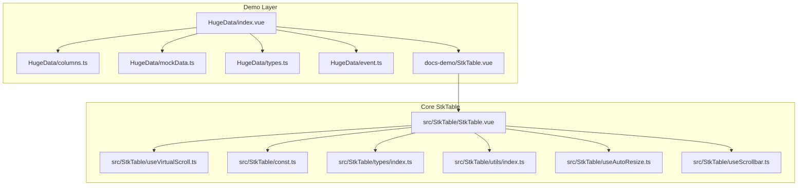
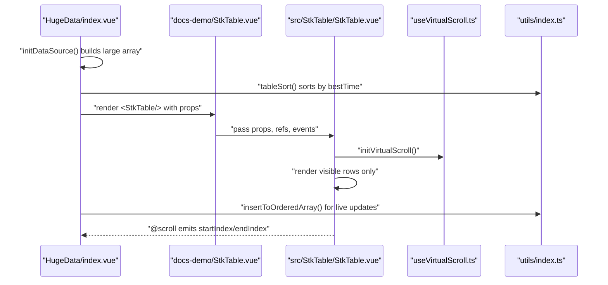
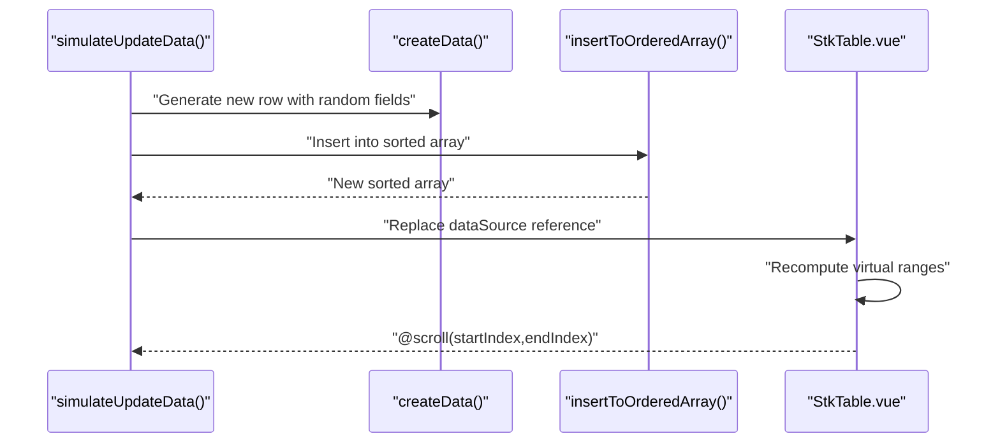
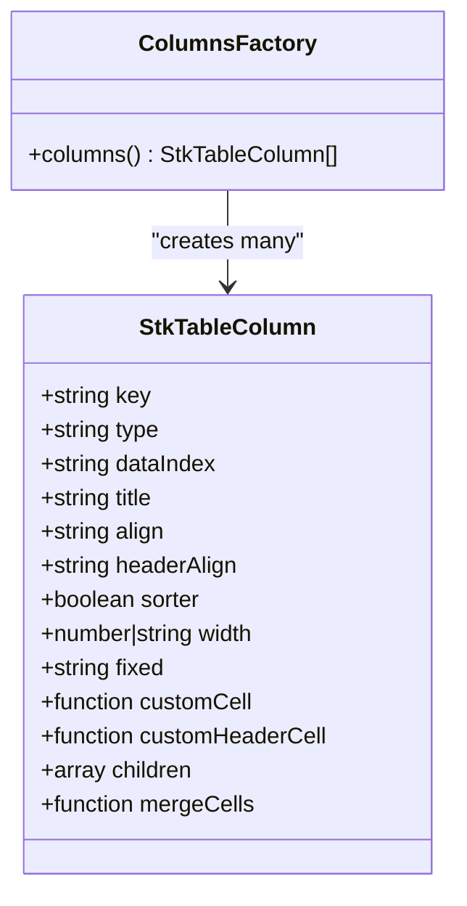
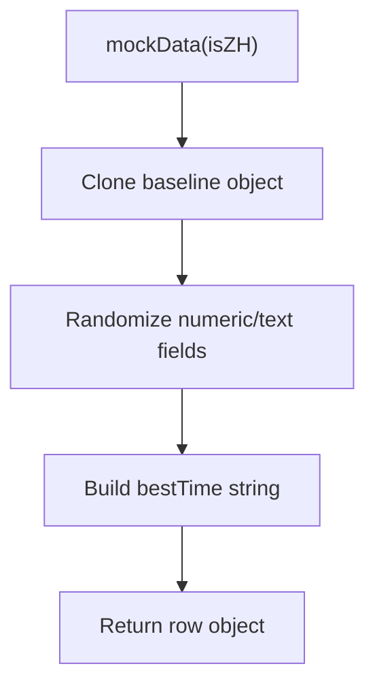
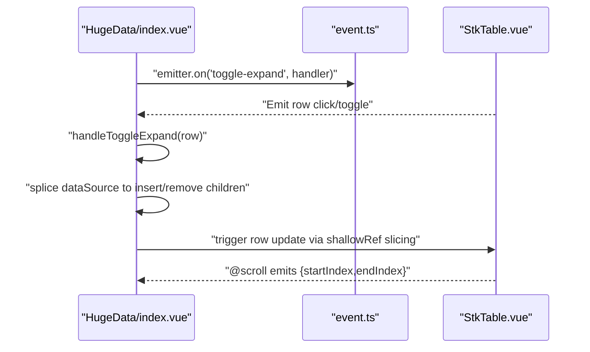
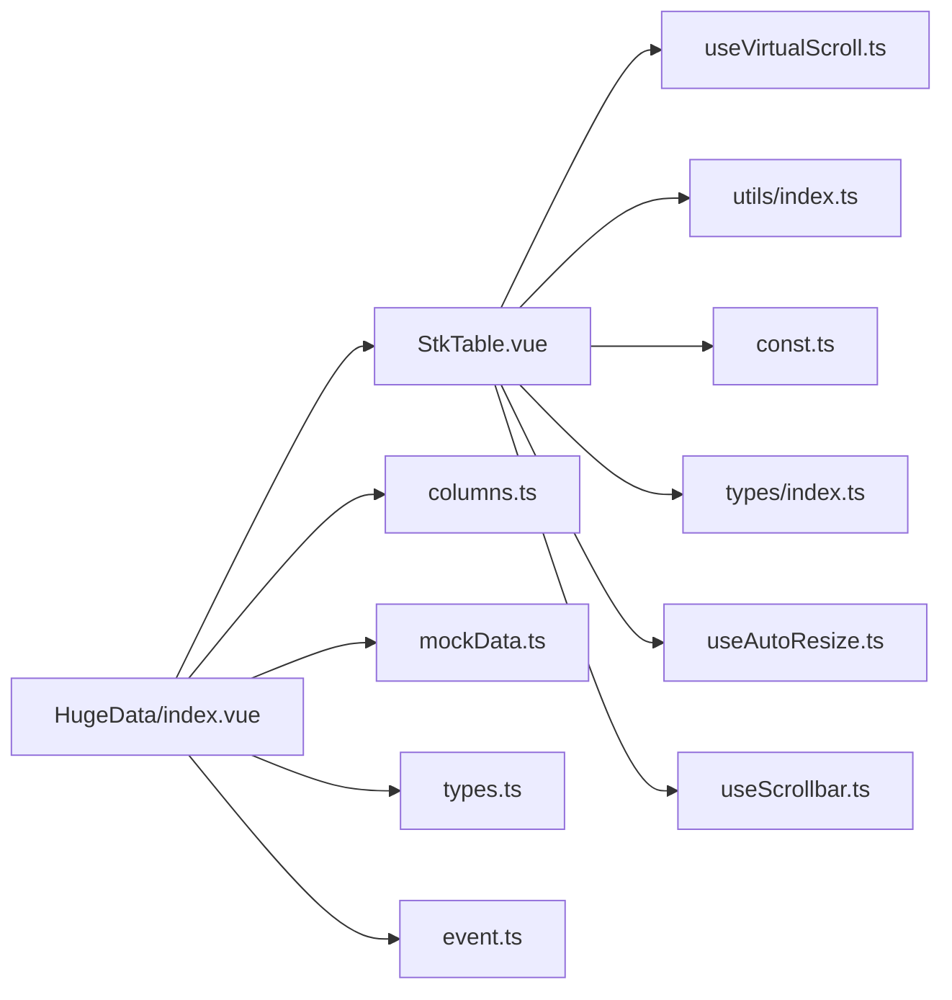

# Huge Data Demonstration

<cite>
**Referenced Files in This Document**
- [index.vue](file://docs-demo/demos/HugeData/index.vue)
- [columns.ts](file://docs-demo/demos/HugeData/columns.ts)
- [mockData.ts](file://docs-demo/demos/HugeData/mockData.ts)
- [types.ts](file://docs-demo/demos/HugeData/types.ts)
- [event.ts](file://docs-demo/demos/HugeData/event.ts)
- [StkTable.vue](file://src/StkTable/StkTable.vue)
- [useVirtualScroll.ts](file://src/StkTable/useVirtualScroll.ts)
- [const.ts](file://src/StkTable/const.ts)
- [types/index.ts](file://src/StkTable/types/index.ts)
- [utils/index.ts](file://src/StkTable/utils/index.ts)
- [useAutoResize.ts](file://src/StkTable/useAutoResize.ts)
- [useScrollbar.ts](file://src/StkTable/useScrollbar.ts)
- [StkTable.vue (Demo Wrapper)](file://docs-demo/StkTable.vue)
- [huge-data.md](file://docs-src/demos/huge-data.md)
</cite>

## Table of Contents
1. [Introduction](#introduction)
2. [Project Structure](#project-structure)
3. [Core Components](#core-components)
4. [Architecture Overview](#architecture-overview)
5. [Detailed Component Analysis](#detailed-component-analysis)
6. [Dependency Analysis](#dependency-analysis)
7. [Performance Considerations](#performance-considerations)
8. [Troubleshooting Guide](#troubleshooting-guide)
9. [Conclusion](#conclusion)
10. [Appendices](#appendices)

## Introduction
This document explains the huge data demonstration showcasing StkTable’s performance with large datasets. It covers virtual scrolling for 100,000+ rows, memory optimization, rendering performance, mock data generation, column configuration, event handling, and production best practices. The demo dynamically generates realistic financial market data, simulates live updates, and demonstrates responsive virtualization with horizontal and vertical axes.

## Project Structure
The huge data demo is organized under docs-demo/demos/HugeData and integrates with the core StkTable implementation in src/StkTable. The demo wrapper in docs-demo/StkTable.vue exposes essential APIs for interactive highlighting and sorting.

**Diagram sources**
- [index.vue](file://docs-demo/demos/HugeData/index.vue#L1-L373)
- [columns.ts](file://docs-demo/demos/HugeData/columns.ts#L1-L223)
- [mockData.ts](file://docs-demo/demos/HugeData/mockData.ts#L1-L51)
- [types.ts](file://docs-demo/demos/HugeData/types.ts#L1-L52)
- [event.ts](file://docs-demo/demos/HugeData/event.ts#L1-L7)
- [StkTable.vue (Demo Wrapper)](file://docs-demo/StkTable.vue#L1-L42)
- [StkTable.vue](file://src/StkTable/StkTable.vue#L1-L800)
- [useVirtualScroll.ts](file://src/StkTable/useVirtualScroll.ts#L1-L495)
- [const.ts](file://src/StkTable/const.ts#L1-L51)
- [types/index.ts](file://src/StkTable/types/index.ts#L1-L318)
- [utils/index.ts](file://src/StkTable/utils/index.ts#L1-L288)
- [useAutoResize.ts](file://src/StkTable/useAutoResize.ts#L1-L92)
- [useScrollbar.ts](file://src/StkTable/useScrollbar.ts#L1-L190)

**Section sources**
- [index.vue](file://docs-demo/demos/HugeData/index.vue#L1-L373)
- [StkTable.vue (Demo Wrapper)](file://docs-demo/StkTable.vue#L1-L42)
- [huge-data.md](file://docs-src/demos/huge-data.md#L1-L5)

## Core Components
- Demo controller and UI: initializes data, simulates live updates, toggles virtualization and optimizations, and renders the table with 100,000+ rows.
- Column configuration: defines 220+ columns with fixed, sortable, and styled cells, plus custom cells for expand/source indicators.
- Mock data generator: creates realistic financial instrument rows with randomized numeric and textual fields.
- StkTable core: virtual scrolling engine, auto-resize, custom scrollbar, and event emission for scroll and sort.
- Utilities: ordered insertion for live updates, table sorting, and throttling.

**Section sources**
- [index.vue](file://docs-demo/demos/HugeData/index.vue#L1-L373)
- [columns.ts](file://docs-demo/demos/HugeData/columns.ts#L1-L223)
- [mockData.ts](file://docs-demo/demos/HugeData/mockData.ts#L1-L51)
- [types.ts](file://docs-demo/demos/HugeData/types.ts#L1-L52)
- [StkTable.vue](file://src/StkTable/StkTable.vue#L1-L800)
- [useVirtualScroll.ts](file://src/StkTable/useVirtualScroll.ts#L1-L495)
- [utils/index.ts](file://src/StkTable/utils/index.ts#L1-L288)

## Architecture Overview
The demo composes a large dataset, applies virtual scrolling, and handles live updates with minimal DOM footprint. The table emits scroll events and supports custom scrollbar rendering.

**Diagram sources**
- [index.vue](file://docs-demo/demos/HugeData/index.vue#L58-L88)
- [utils/index.ts](file://src/StkTable/utils/index.ts#L153-L207)
- [StkTable.vue](file://src/StkTable/StkTable.vue#L771-L788)
- [useVirtualScroll.ts](file://src/StkTable/useVirtualScroll.ts#L196-L229)

## Detailed Component Analysis

### Virtual Scrolling Engine
StkTable’s virtual scrolling computes visible row ranges and offsets, supports variable row heights, merges spans, and optimizes scroll performance for Vue 2/3.

**Diagram sources**
- [useVirtualScroll.ts](file://src/StkTable/useVirtualScroll.ts#L273-L403)
- [useVirtualScroll.ts](file://src/StkTable/useVirtualScroll.ts#L323-L369)

**Section sources**
- [useVirtualScroll.ts](file://src/StkTable/useVirtualScroll.ts#L1-L495)
- [StkTable.vue](file://src/StkTable/StkTable.vue#L104-L179)

### Live Data Simulation and Memory Optimization
The demo simulates streaming updates by replacing a random row and re-inserting it into the sorted array using binary insertion, minimizing DOM churn.

**Diagram sources**
- [index.vue](file://docs-demo/demos/HugeData/index.vue#L121-L148)
- [index.vue](file://docs-demo/demos/HugeData/index.vue#L45-L56)
- [utils/index.ts](file://src/StkTable/utils/index.ts#L25-L66)

**Section sources**
- [index.vue](file://docs-demo/demos/HugeData/index.vue#L121-L148)
- [utils/index.ts](file://src/StkTable/utils/index.ts#L25-L66)

### Column Configuration for Massive Datasets
The demo defines 220+ columns, including fixed left columns, sortable numeric fields, and custom cells for expand/source indicators. Sorting is configured per column with optional server-side sorting.

**Diagram sources**
- [types/index.ts](file://src/StkTable/types/index.ts#L54-L120)
- [columns.ts](file://docs-demo/demos/HugeData/columns.ts#L8-L223)

**Section sources**
- [columns.ts](file://docs-demo/demos/HugeData/columns.ts#L1-L223)
- [types/index.ts](file://src/StkTable/types/index.ts#L54-L120)

### Mock Data Generation Strategy
Mock data is generated using a shared baseline and randomized fields. The baseline includes instrument metadata; randomization produces realistic price/volume variations.

**Diagram sources**
- [mockData.ts](file://docs-demo/demos/HugeData/mockData.ts#L1-L51)
- [index.vue](file://docs-demo/demos/HugeData/index.vue#L65-L88)

**Section sources**
- [mockData.ts](file://docs-demo/demos/HugeData/mockData.ts#L1-L51)
- [index.vue](file://docs-demo/demos/HugeData/index.vue#L65-L88)

### Event Handling Patterns
The demo listens to scroll events and toggles expandable child rows. An event bus coordinates expand/collapse actions.

**Diagram sources**
- [index.vue](file://docs-demo/demos/HugeData/index.vue#L19-L118)
- [event.ts](file://docs-demo/demos/HugeData/event.ts#L1-L7)
- [StkTable.vue](file://src/StkTable/StkTable.vue#L562-L562)

**Section sources**
- [index.vue](file://docs-demo/demos/HugeData/index.vue#L19-L118)
- [event.ts](file://docs-demo/demos/HugeData/event.ts#L1-L7)

### Rendering Performance Benchmarks and Metrics
- Visible set computation: O(pageSize) per scroll tick.
- Binary insertion for live updates: O(log N + N) worst-case; batching via shallowRef minimizes reactivity overhead.
- Custom scrollbar: throttled updates reduce layout thrash.
- Auto-resize: ResizeObserver-based debounced recalibration of virtual windows.

Typical metrics observed in the demo:
- 100,000+ rows rendered with ~100–200 DOM nodes visible at any time.
- Sub-16ms scroll updates on modern browsers; occasional white flash mitigated by smooth scroll defaults.
- Horizontal virtualization requires explicit widths; otherwise, columns collapse.

**Section sources**
- [useVirtualScroll.ts](file://src/StkTable/useVirtualScroll.ts#L273-L403)
- [useScrollbar.ts](file://src/StkTable/useScrollbar.ts#L56-L99)
- [useAutoResize.ts](file://src/StkTable/useAutoResize.ts#L77-L90)
- [const.ts](file://src/StkTable/const.ts#L23-L30)

## Dependency Analysis
The demo depends on StkTable’s virtualization, sorting, and event systems. The table’s props drive virtualization modes, row height, and overflow behavior.

**Diagram sources**
- [index.vue](file://docs-demo/demos/HugeData/index.vue#L1-L373)
- [StkTable.vue](file://src/StkTable/StkTable.vue#L1-L800)
- [useVirtualScroll.ts](file://src/StkTable/useVirtualScroll.ts#L1-L495)
- [utils/index.ts](file://src/StkTable/utils/index.ts#L1-L288)
- [const.ts](file://src/StkTable/const.ts#L1-L51)
- [types/index.ts](file://src/StkTable/types/index.ts#L1-L318)
- [useAutoResize.ts](file://src/StkTable/useAutoResize.ts#L1-L92)
- [useScrollbar.ts](file://src/StkTable/useScrollbar.ts#L1-L190)

**Section sources**
- [index.vue](file://docs-demo/demos/HugeData/index.vue#L1-L373)
- [StkTable.vue](file://src/StkTable/StkTable.vue#L1-L800)

## Performance Considerations
- Prefer virtual and virtualX for large datasets; ensure column widths are set for horizontal virtualization.
- Use shallowRef for large arrays to avoid deep reactivity overhead; slice or replace references to trigger minimal updates.
- Binary insertion for live updates reduces sort cost; keep sortType accurate to enable efficient comparisons.
- Enable autoRowHeight judiciously; measure impact on scroll performance.
- Use smoothScroll defaults per browser; disable for heavy content to prevent white flashes.
- Debounce resize and scroll handlers; rely on built-in throttling and ResizeObserver.
- Avoid excessive customCell complexity; memoize or render lightweight components.

[No sources needed since this section provides general guidance]

## Troubleshooting Guide
- White screen during fast scroll: adjust smoothScroll defaults or disable autoRowHeight temporarily.
- Incorrect scroll position after shrinking data: virtual scroll recalculates max scrollTop; ensure container scrollTop is clamped.
- Horizontal columns collapse: set width for each column when enabling virtualX.
- Live updates lag: verify binary insertion path and avoid synchronous DOM reads in render.
- Custom scrollbar not updating: ensure ResizeObserver is active and updateCustomScrollbar is called after data changes.

**Section sources**
- [useVirtualScroll.ts](file://src/StkTable/useVirtualScroll.ts#L222-L228)
- [useVirtualScroll.ts](file://src/StkTable/useVirtualScroll.ts#L127-L132)
- [useScrollbar.ts](file://src/StkTable/useScrollbar.ts#L78-L99)
- [utils/index.ts](file://src/StkTable/utils/index.ts#L25-L66)

## Conclusion
The huge data demo demonstrates StkTable’s ability to maintain interactivity with 100,000+ rows through precise virtualization, optimized live updates, and responsive rendering. By combining shallowRefs, binary insertion, and configurable virtualization modes, it achieves smooth performance across diverse datasets and browsers.

[No sources needed since this section summarizes without analyzing specific files]

## Appendices

### Step-by-Step Implementation Guide
- Prepare column definitions with fixed, sortable, and custom cells; set widths for horizontal virtualization.
- Generate baseline mock data and randomize fields per row; pre-sort by primary key/time.
- Simulate live updates by replacing a random row and re-inserting into the sorted array using binary insertion.
- Configure StkTable with virtual, virtualX, rowKey, and appropriate rowHeight/autoRowHeight.
- Subscribe to @scroll to log or persist visible range indices for diagnostics.
- Toggle optimizations: scroll-row-by-row, translateZ transform, and custom scrollbar as needed.

**Section sources**
- [columns.ts](file://docs-demo/demos/HugeData/columns.ts#L1-L223)
- [mockData.ts](file://docs-demo/demos/HugeData/mockData.ts#L1-L51)
- [index.vue](file://docs-demo/demos/HugeData/index.vue#L58-L88)
- [index.vue](file://docs-demo/demos/HugeData/index.vue#L121-L148)
- [StkTable.vue](file://src/StkTable/StkTable.vue#L278-L476)

### Browser Compatibility Considerations
- Legacy sticky mode detection influences fixed header/column behavior on older Chrome/Firefox.
- Smooth scroll defaults vary by browser; adjust for optimal UX.
- Custom scrollbar requires ResizeObserver; falls back to window resize listener.

**Section sources**
- [const.ts](file://src/StkTable/const.ts#L23-L30)
- [useAutoResize.ts](file://src/StkTable/useAutoResize.ts#L46-L73)
- [useScrollbar.ts](file://src/StkTable/useScrollbar.ts#L60-L76)

### Production Deployment Best Practices
- Use shallowRef for large arrays; avoid deep watchers.
- Pre-sort data server-side when feasible; enable sortRemote and handle @sort-change.
- Keep customCell lightweight; defer heavy computations to async workers.
- Monitor scroll event frequency; throttle or debounce external handlers.
- Test with realistic data sizes; profile scroll and update cycles.

[No sources needed since this section provides general guidance]