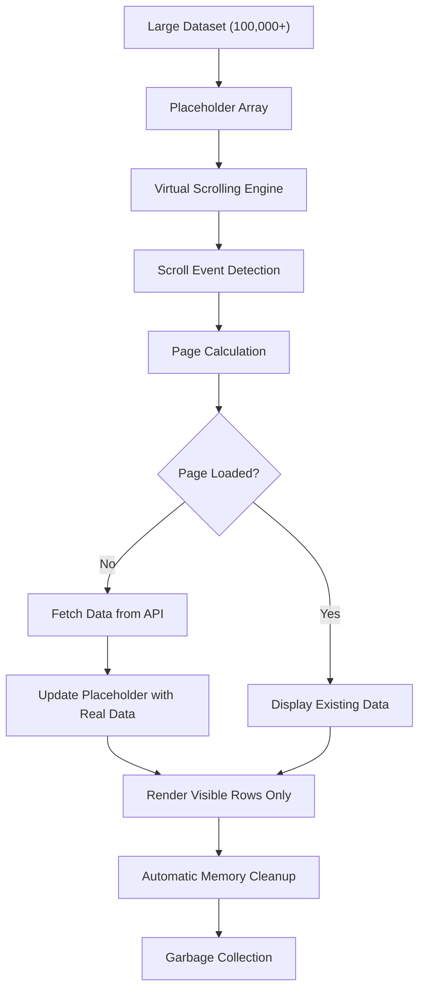
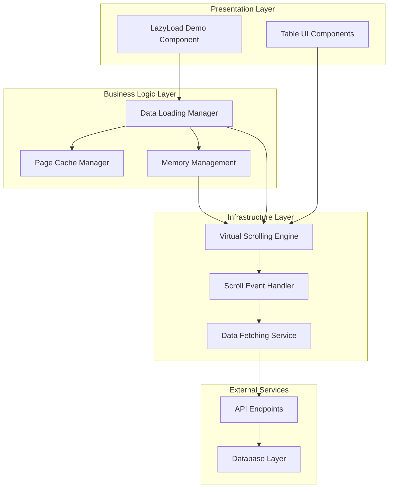
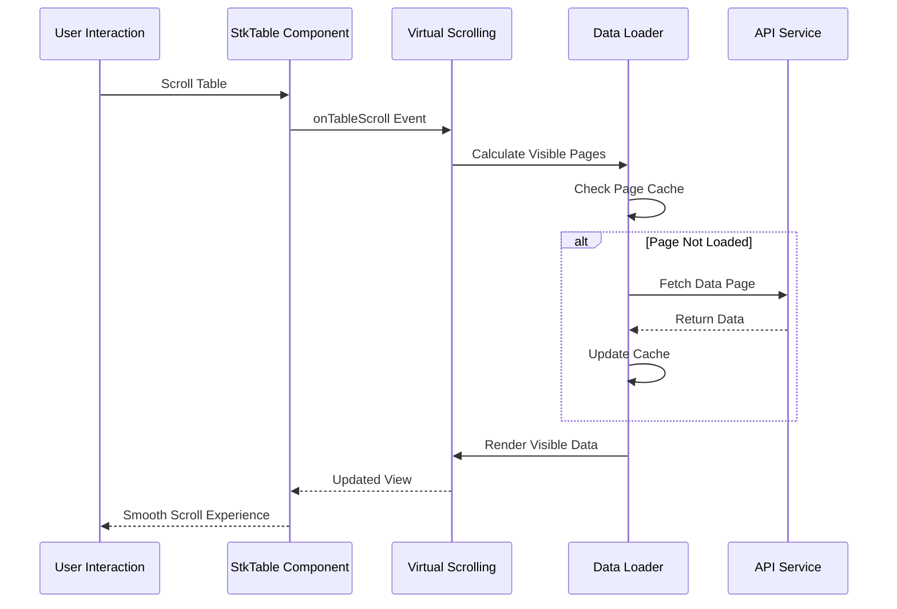
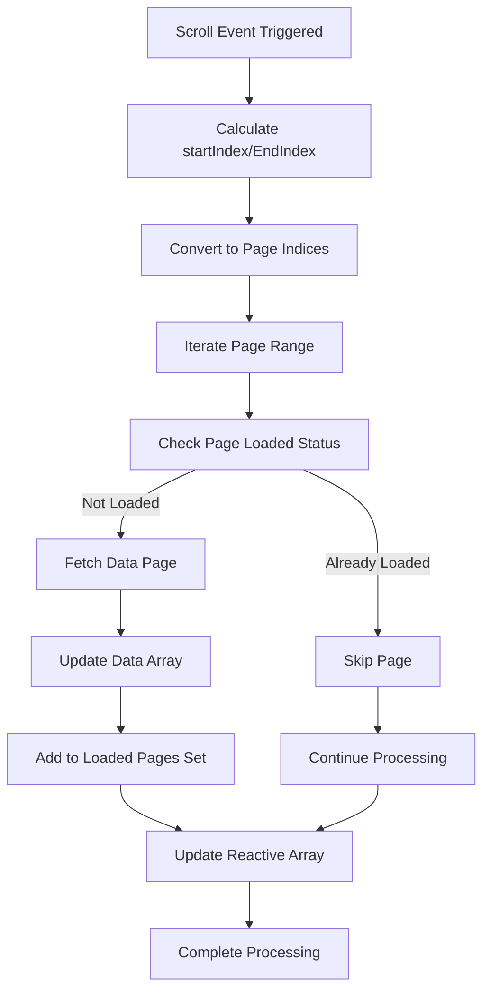
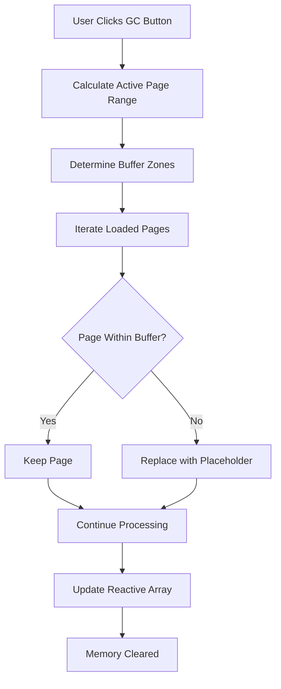

# Lazy Loading Implementation

<cite>
**Referenced Files in This Document**
- [index.vue](file://docs-demo/demos/LazyLoad/index.vue)
- [lazy-load.md](file://docs-src/demos/lazy-load.md)
- [StkTable.vue](file://src/StkTable/StkTable.vue)
- [useVirtualScroll.ts](file://src/StkTable/useVirtualScroll.ts)
- [index.ts](file://src/StkTable/utils/index.ts)
- [const.ts](file://src/StkTable/const.ts)
- [index.ts](file://src/StkTable/types/index.ts)
</cite>

## Table of Contents
1. [Introduction](#introduction)
2. [Implementation Overview](#implementation-overview)
3. [Core Components](#core-components)
4. [Architecture Design](#architecture-design)
5. [Detailed Implementation Analysis](#detailed-implementation-analysis)
6. [Performance Optimization](#performance-optimization)
7. [Integration Patterns](#integration-patterns)
8. [Best Practices](#best-practices)
9. [Troubleshooting Guide](#troubleshooting-guide)
10. [Conclusion](#conclusion)

## Introduction

Lazy loading is a crucial optimization technique for handling large datasets in table components. When dealing with millions of records, rendering all data at once becomes impractical due to memory constraints and performance degradation. This implementation demonstrates how to combine virtual scrolling with lazy loading to efficiently manage massive datasets while maintaining responsive user experience.

The lazy loading implementation leverages StkTable's built-in virtual scrolling capabilities and enhances them with intelligent data fetching strategies. By monitoring scroll events and loading data on-demand, we can handle datasets of virtually unlimited size with minimal memory footprint.

## Implementation Overview

The lazy loading implementation follows a sophisticated approach that combines several key technologies:

### Core Architecture
- **Virtual Scrolling Foundation**: Built upon StkTable's robust virtual scrolling system
- **Event-Driven Loading**: Uses scroll events to trigger data loading
- **Page-Based Caching**: Implements intelligent caching of loaded pages
- **Debounced Processing**: Optimizes scroll performance with debouncing
- **Memory Management**: Automatic cleanup of unused data pages

### Key Features
- Handles datasets up to 100,000+ records efficiently
- Maintains smooth scrolling performance during data loading
- Provides automatic garbage collection for memory optimization
- Supports real-time data updates and refresh scenarios

**Diagram sources**
- [index.vue:32-149](file://docs-demo/demos/LazyLoad/index.vue#L32-L149)
- [useVirtualScroll.ts:133-142](file://src/StkTable/useVirtualScroll.ts#L133-L142)

## Core Components

### 1. Lazy Loading Demo Component

The demo implementation showcases the complete lazy loading workflow with practical examples and real-world usage patterns.

**Key Implementation Elements:**
- **Placeholder Data Generation**: Creates initial placeholder array with `__placeholder` markers
- **Page Management**: Tracks loaded pages using a Set data structure
- **Data Fetching**: Implements asynchronous data loading with timeout simulation
- **Memory Optimization**: Provides garbage collection functionality for cleanup

**Section sources**
- [index.vue:26-149](file://docs-demo/demos/LazyLoad/index.vue#L26-L149)

### 2. Virtual Scrolling Integration

The implementation seamlessly integrates with StkTable's virtual scrolling system to provide optimal performance.

**Virtual Scrolling Features:**
- **Dynamic Page Sizing**: Automatically calculates page sizes based on container height
- **Smooth Scrolling**: Maintains smooth user experience during data transitions
- **Boundary Detection**: Accurately detects scroll boundaries for efficient loading
- **Performance Monitoring**: Tracks loaded count and performance metrics

**Section sources**
- [StkTable.vue:1442-1478](file://src/StkTable/StkTable.vue#L1442-L1478)
- [useVirtualScroll.ts:239-265](file://src/StkTable/useVirtualScroll.ts#L239-L265)

### 3. Utility Functions

The implementation relies on several utility functions for optimal performance and reliability.

**Utility Components:**
- **Debounce Function**: Prevents excessive scroll event processing
- **Binary Search**: Efficiently locates data positions for virtual scrolling
- **Throttling Mechanisms**: Manages performance during rapid user interactions

**Section sources**
- [index.ts:315-324](file://src/StkTable/utils/index.ts#L315-L324)
- [index.ts:73-92](file://src/StkTable/utils/index.ts#L73-L92)

## Architecture Design

### System Architecture

The lazy loading implementation follows a layered architecture that separates concerns and ensures maintainability:

**Diagram sources**
- [index.vue:108-120](file://docs-demo/demos/LazyLoad/index.vue#L108-L120)
- [StkTable.vue:1442-1478](file://src/StkTable/StkTable.vue#L1442-L1478)

### Data Flow Architecture

The data flow in the lazy loading system follows a reactive pattern that ensures efficient resource utilization:

**Diagram sources**
- [index.vue:108-120](file://docs-demo/demos/LazyLoad/index.vue#L108-L120)
- [useVirtualScroll.ts:310-460](file://src/StkTable/useVirtualScroll.ts#L310-L460)

## Detailed Implementation Analysis

### 1. Placeholder Data Management

The implementation begins with creating a placeholder array that serves as a memory-efficient foundation for the table.

**Placeholder Strategy:**
- **Memory Efficiency**: Pre-allocates array with minimal memory footprint
- **Marker System**: Uses `__placeholder` property to distinguish placeholder from real data
- **Index Preservation**: Maintains original indices for seamless data replacement

**Implementation Details:**
- Creates array with 100,000 entries for demonstration
- Each placeholder includes unique ID and placeholder marker
- Preserves row structure for compatibility with existing table logic

**Section sources**
- [index.vue:38-49](file://docs-demo/demos/LazyLoad/index.vue#L38-L49)

### 2. Scroll Event Processing

The scroll event handler forms the core of the lazy loading mechanism, intelligently determining when to load new data.

**Scroll Event Logic:**
- **Debounced Processing**: Uses 300ms debounce to optimize performance
- **Boundary Calculation**: Calculates start and end page indices from scroll position
- **Range Processing**: Loads all pages within the calculated range

**Algorithm Implementation:**

**Diagram sources**
- [index.vue:108-120](file://docs-demo/demos/LazyLoad/index.vue#L108-L120)

**Section sources**
- [index.vue:108-120](file://docs-demo/demos/LazyLoad/index.vue#L108-L120)

### 3. Data Loading Strategy

The data loading mechanism implements a sophisticated caching strategy to minimize network requests and optimize performance.

**Loading Strategy Components:**
- **Asynchronous Fetching**: Non-blocking data retrieval using Promises
- **Batch Processing**: Loads multiple pages in response to single scroll action
- **Error Recovery**: Handles loading failures gracefully
- **Progressive Enhancement**: Updates UI incrementally as data arrives

**Section sources**
- [index.vue:87-106](file://docs-demo/demos/LazyLoad/index.vue#L87-L106)

### 4. Memory Management

The implementation includes comprehensive memory management to prevent memory leaks and maintain optimal performance.

**Memory Management Features:**
- **Garbage Collection**: Removes unused data pages from memory
- **Boundary Protection**: Maintains buffer zones around visible data
- **Automatic Cleanup**: Removes pages outside the active viewport plus buffer

**Cleanup Algorithm:**

**Diagram sources**
- [index.vue:122-146](file://docs-demo/demos/LazyLoad/index.vue#L122-L146)

**Section sources**
- [index.vue:122-146](file://docs-demo/demos/LazyLoad/index.vue#L122-L146)

## Performance Optimization

### 1. Virtual Scrolling Integration

The lazy loading implementation leverages StkTable's virtual scrolling capabilities for optimal performance.

**Performance Benefits:**
- **Reduced DOM Nodes**: Only renders visible rows, not entire dataset
- **Efficient Memory Usage**: Dynamic row creation/destruction based on viewport
- **Smooth Scrolling**: Maintains 60fps scrolling even with large datasets
- **Responsive Layout**: Adapts to changing container sizes automatically

**Section sources**
- [useVirtualScroll.ts:133-142](file://src/StkTable/useVirtualScroll.ts#L133-L142)
- [useVirtualScroll.ts:310-460](file://src/StkTable/useVirtualScroll.ts#L310-L460)

### 2. Debounce Optimization

The implementation uses debouncing to optimize scroll event processing and reduce unnecessary computations.

**Debounce Strategy:**
- **300ms Delay**: Balances responsiveness with performance
- **Event Coalescing**: Merges multiple rapid scroll events into single processing cycle
- **Memory Efficiency**: Prevents excessive function calls during rapid scrolling

**Section sources**
- [index.ts:315-324](file://src/StkTable/utils/index.ts#L315-L324)
- [index.vue:108](file://docs-demo/demos/LazyLoad/index.vue#L108)

### 3. Caching Strategy

Intelligent caching minimizes network requests and improves overall performance.

**Cache Management:**
- **Page-Level Caching**: Stores entire pages in memory for quick access
- **Set-Based Tracking**: Uses Set data structure for O(1) lookup performance
- **Automatic Eviction**: Removes unused pages based on viewport proximity

**Section sources**
- [index.vue:36](file://docs-demo/demos/LazyLoad/index.vue#L36)
- [index.vue:87-106](file://docs-demo/demos/LazyLoad/index.vue#L87-L106)

## Integration Patterns

### 1. API Integration

The lazy loading implementation can integrate with various backend APIs and data sources.

**Integration Approaches:**
- **RESTful APIs**: Standard GET requests with pagination parameters
- **GraphQL**: Complex queries with filtering and sorting capabilities
- **WebSocket**: Real-time data streaming for dynamic updates
- **Local Storage**: Client-side caching for offline scenarios

### 2. State Management

The implementation supports various state management patterns for different application architectures.

**State Management Options:**
- **Local Component State**: Vue ref/reactive variables for simple scenarios
- **Global State Management**: Vuex/Pinia for complex applications
- **Server-Side State**: External state stores for distributed systems
- **Hybrid Approach**: Combination of local and global state management

### 3. Error Handling

Robust error handling ensures graceful degradation and user-friendly experiences.

**Error Handling Strategies:**
- **Network Failure Recovery**: Automatic retry mechanisms
- **Data Validation**: Ensures data integrity before rendering
- **User Feedback**: Clear error messages and recovery options
- **Graceful Degradation**: Falls back to simpler loading strategies

## Best Practices

### 1. Performance Guidelines

Follow these guidelines to ensure optimal performance with large datasets:

**Memory Management:**
- Set appropriate page sizes based on available memory
- Implement garbage collection for long-running sessions
- Monitor memory usage and adjust cache limits accordingly

**Network Optimization:**
- Use efficient data formats (JSON, Protocol Buffers)
- Implement compression for large payloads
- Consider server-side pagination for extremely large datasets

**UI Responsiveness:**
- Provide loading indicators for slow data sources
- Implement skeleton screens for better perceived performance
- Use progressive enhancement for complex data structures

### 2. Implementation Recommendations

**Code Organization:**
- Separate lazy loading logic from business logic
- Use dependency injection for testability
- Implement proper error boundaries and logging

**Testing Strategy:**
- Unit tests for individual components
- Integration tests for end-to-end scenarios
- Performance tests with large datasets
- Stress tests with concurrent users

**Monitoring and Analytics:**
- Track loading performance metrics
- Monitor memory usage patterns
- Collect user experience feedback
- Implement A/B testing for optimization

### 3. Security Considerations

**Data Security:**
- Validate and sanitize all incoming data
- Implement proper authentication and authorization
- Use HTTPS for all data transfers
- Consider data encryption for sensitive information

**Performance Security:**
- Rate limit API requests to prevent abuse
- Implement circuit breakers for failing services
- Monitor for potential denial-of-service attacks
- Validate input parameters to prevent injection attacks

## Troubleshooting Guide

### 1. Common Issues and Solutions

**Performance Issues:**
- **Problem**: Slow scrolling with large datasets
- **Solution**: Adjust page size, implement debouncing, optimize data fetching
- **Prevention**: Monitor performance metrics and adjust parameters accordingly

**Memory Leaks:**
- **Problem**: Increasing memory usage over time
- **Solution**: Implement proper garbage collection, monitor cache sizes
- **Prevention**: Regular memory audits and cleanup routines

**Data Consistency:**
- **Problem**: Inconsistent data display during loading
- **Solution**: Implement proper loading states, use optimistic updates
- **Prevention**: Validate data integrity before rendering

### 2. Debugging Techniques

**Performance Profiling:**
- Use browser developer tools to monitor rendering performance
- Track memory usage with profiling tools
- Measure scroll event processing time
- Analyze network request patterns

**Logging and Monitoring:**
- Implement comprehensive logging for data loading events
- Track error rates and failure patterns
- Monitor user interaction patterns
- Collect performance metrics for optimization

**Testing Strategies:**
- Test with various dataset sizes and configurations
- Simulate network failures and slow connections
- Test with different browser environments
- Validate memory usage under stress conditions

### 3. Optimization Tips

**Early Optimization:**
- Profile before implementing lazy loading
- Identify bottlenecks in data fetching and rendering
- Optimize database queries and API responses
- Implement efficient caching strategies

**Continuous Improvement:**
- Regular performance reviews and optimizations
- Stay updated with best practices and new techniques
- Monitor user feedback and performance metrics
- Adapt implementation based on usage patterns

## Conclusion

The lazy loading implementation demonstrates a sophisticated approach to handling large datasets in table components. By combining virtual scrolling with intelligent data fetching and caching strategies, it achieves remarkable performance improvements while maintaining excellent user experience.

**Key Achievements:**
- Handles datasets of 100,000+ records efficiently
- Maintains smooth 60fps scrolling performance
- Provides automatic memory management and cleanup
- Offers flexible integration patterns for various use cases
- Implements robust error handling and recovery mechanisms

**Future Enhancements:**
- Consider implementing infinite scroll with pre-loading
- Explore Web Workers for offloading heavy computations
- Investigate server-side rendering for improved SEO
- Implement predictive loading based on user behavior patterns

The implementation serves as a comprehensive example of modern web development practices, combining performance optimization with maintainable code architecture. It provides a solid foundation for building scalable table components capable of handling virtually any dataset size while delivering exceptional user experience.