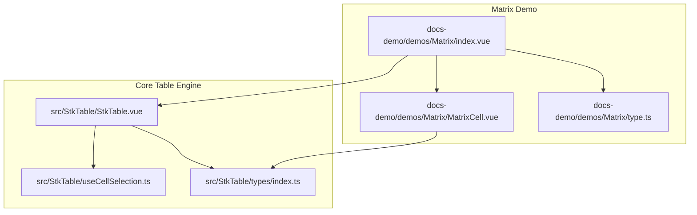
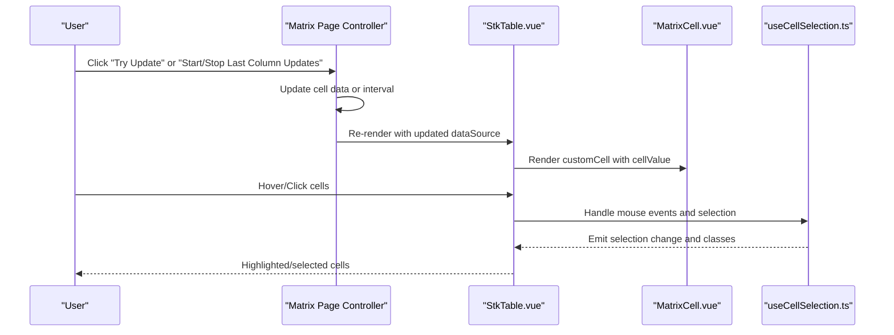
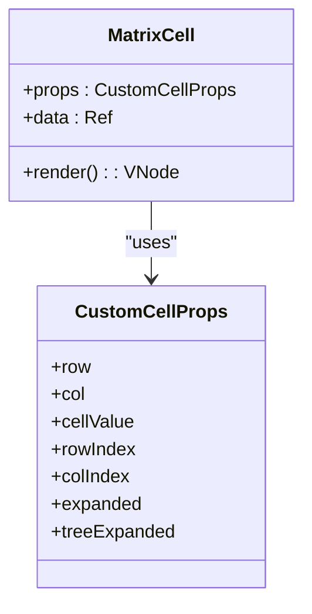
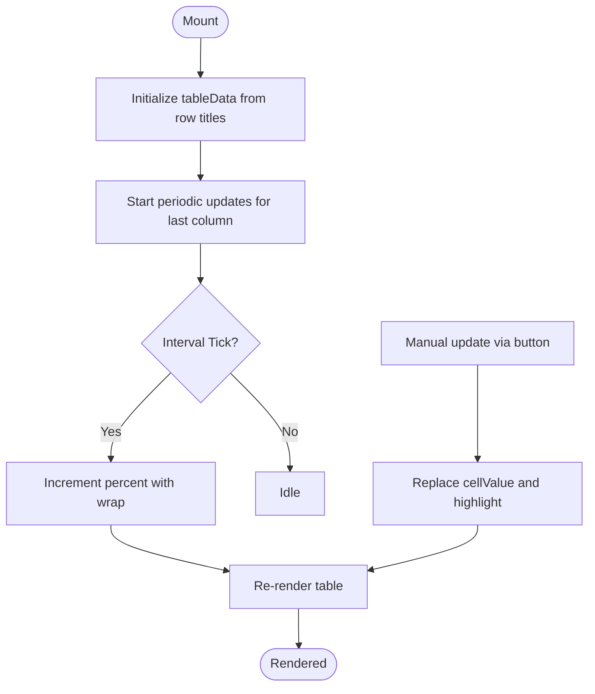
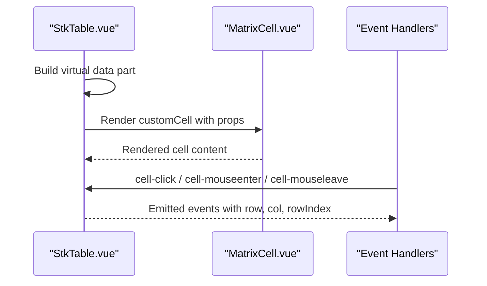
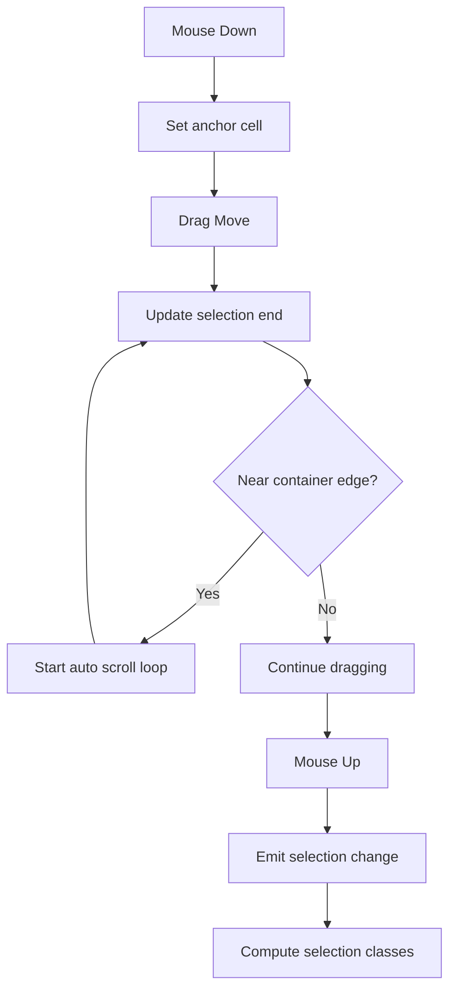
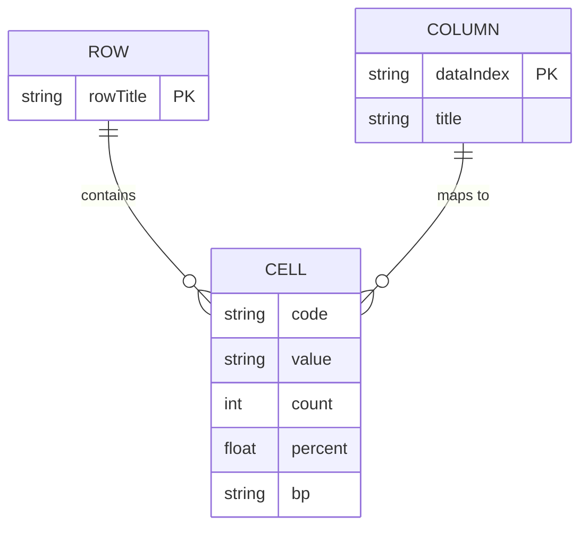
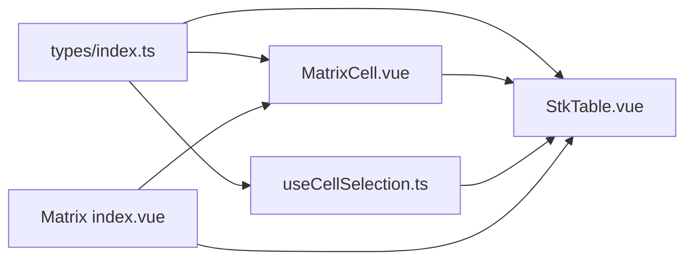

# Matrix Table Examples

<cite>
**Referenced Files in This Document**
- [MatrixCell.vue](file://docs-demo/demos/Matrix/MatrixCell.vue)
- [index.vue](file://docs-demo/demos/Matrix/index.vue)
- [type.ts](file://docs-demo/demos/Matrix/type.ts)
- [StkTable.vue](file://src/StkTable/StkTable.vue)
- [useCellSelection.ts](file://src/StkTable/useCellSelection.ts)
- [types/index.ts](file://src/StkTable/types/index.ts)
- [matrix.md](file://docs-src/demos/matrix.md)
- [RowCellHoverSelect.vue](file://docs-demo/basic/row-cell-mouse-event/RowCellHoverSelect.vue)
- [Special.vue](file://docs-demo/basic/merge-cells/MergeCellsRowVirtual/Special.vue)
- [dataSource.ts](file://docs-demo/basic/merge-cells/MergeCellsRowVirtual/dataSource.ts)
</cite>

## Table of Contents
1. [Introduction](#introduction)
2. [Project Structure](#project-structure)
3. [Core Components](#core-components)
4. [Architecture Overview](#architecture-overview)
5. [Detailed Component Analysis](#detailed-component-analysis)
6. [Dependency Analysis](#dependency-analysis)
7. [Performance Considerations](#performance-considerations)
8. [Troubleshooting Guide](#troubleshooting-guide)
9. [Conclusion](#conclusion)
10. [Appendices](#appendices)

## Introduction
This document provides comprehensive documentation for matrix table implementations that demonstrate grid-like data structures and cell-based interactions. It focuses on the MatrixCell component architecture, coordinate-based data mapping, and interactive cell selection patterns. It also covers dynamic matrix generation, cell state management, event-driven cell updates, styling approaches for matrix layouts, responsive design considerations, accessibility features, and implementation patterns for custom matrix operations, data validation, and user interaction handling.

## Project Structure
The matrix table examples are organized under the demos directory with a dedicated Matrix folder containing the cell renderer, page controller, and TypeScript types. The core table engine resides in the src/StkTable directory, exposing APIs for cell rendering, selection, highlighting, and interaction events.

**Diagram sources**
- [index.vue](file://docs-demo/demos/Matrix/index.vue#L1-L121)
- [MatrixCell.vue](file://docs-demo/demos/Matrix/MatrixCell.vue#L1-L91)
- [type.ts](file://docs-demo/demos/Matrix/type.ts#L1-L16)
- [StkTable.vue](file://src/StkTable/StkTable.vue#L1-L200)
- [useCellSelection.ts](file://src/StkTable/useCellSelection.ts#L1-L453)
- [types/index.ts](file://src/StkTable/types/index.ts#L1-L318)

**Section sources**
- [index.vue](file://docs-demo/demos/Matrix/index.vue#L1-L121)
- [MatrixCell.vue](file://docs-demo/demos/Matrix/MatrixCell.vue#L1-L91)
- [type.ts](file://docs-demo/demos/Matrix/type.ts#L1-L16)
- [StkTable.vue](file://src/StkTable/StkTable.vue#L1-L200)
- [useCellSelection.ts](file://src/StkTable/useCellSelection.ts#L1-L453)
- [types/index.ts](file://src/StkTable/types/index.ts#L1-L318)

## Core Components
- MatrixCell: A custom cell renderer that displays a compact matrix cell with directional indicators, percentage progress, and value/count metrics. It receives cellValue via CustomCellProps and applies conditional classes and CSS variables for styling.
- Matrix Page Controller: Initializes columns and data, generates dynamic matrix data, triggers periodic updates, and demonstrates highlighting and selection APIs.
- Table Engine: Provides cell rendering pipeline, selection handling, keyboard shortcuts, and interaction events.

Key capabilities:
- Coordinate-based data mapping: Each cell maps to a rowTitle and a time horizon (e.g., m1, m3, m6, y1) with a structured CellDataType.
- Event-driven updates: Periodic updates to the last column’s percent value simulate live data changes.
- Interactive selection: Demonstrates hover, active states, and keyboard-driven selection.

**Section sources**
- [MatrixCell.vue](file://docs-demo/demos/Matrix/MatrixCell.vue#L1-L91)
- [index.vue](file://docs-demo/demos/Matrix/index.vue#L1-L121)
- [type.ts](file://docs-demo/demos/Matrix/type.ts#L1-L16)
- [StkTable.vue](file://src/StkTable/StkTable.vue#L103-L176)
- [useCellSelection.ts](file://src/StkTable/useCellSelection.ts#L131-L332)

## Architecture Overview
The matrix table architecture integrates a custom cell renderer into the table engine. The page controller defines columns and data, while the table engine renders cells and manages interactions.

**Diagram sources**
- [index.vue](file://docs-demo/demos/Matrix/index.vue#L1-L121)
- [StkTable.vue](file://src/StkTable/StkTable.vue#L103-L176)
- [MatrixCell.vue](file://docs-demo/demos/Matrix/MatrixCell.vue#L1-L91)
- [useCellSelection.ts](file://src/StkTable/useCellSelection.ts#L131-L332)

## Detailed Component Analysis

### MatrixCell Component
MatrixCell is a function component receiving CustomCellProps. It:
- Receives cellValue and exposes it as a reactive reference.
- Applies conditional classes based on bp sign.
- Uses CSS variables to drive gradient fill and colors.
- Renders a two-row layout with code, bp, value, and count.

**Diagram sources**
- [MatrixCell.vue](file://docs-demo/demos/Matrix/MatrixCell.vue#L21-L26)
- [types/index.ts](file://src/StkTable/types/index.ts#L8-L23)

**Section sources**
- [MatrixCell.vue](file://docs-demo/demos/Matrix/MatrixCell.vue#L1-L91)
- [types/index.ts](file://src/StkTable/types/index.ts#L8-L23)

### Matrix Page Controller
The page controller:
- Defines columns with customCell pointing to MatrixCell.
- Generates tableData dynamically from row titles and random CellDataType values.
- Implements updateCell to refresh a specific cell and set highlight.
- Starts/stops periodic updates to the last column’s percent to simulate live data.

**Diagram sources**
- [index.vue](file://docs-demo/demos/Matrix/index.vue#L49-L100)

**Section sources**
- [index.vue](file://docs-demo/demos/Matrix/index.vue#L1-L121)
- [type.ts](file://docs-demo/demos/Matrix/type.ts#L1-L16)

### Table Rendering and Interaction Pipeline
The table engine:
- Iterates virtual data source parts to render rows and cells.
- Renders custom cells when customCell is provided, passing row, col, rowIndex, colIndex, and cellValue.
- Emits cell events (click, mouseenter, mouseleave, mouseover) and supports cell selection and highlighting.

**Diagram sources**
- [StkTable.vue](file://src/StkTable/StkTable.vue#L103-L176)
- [StkTable.vue](file://src/StkTable/StkTable.vue#L2872-L2914)

**Section sources**
- [StkTable.vue](file://src/StkTable/StkTable.vue#L103-L176)
- [StkTable.vue](file://src/StkTable/StkTable.vue#L2872-L2914)

### Cell Selection Patterns
The selection hook provides:
- Anchor-based selection with Shift expansion.
- Drag selection with automatic scrolling near edges.
- Keyboard shortcuts (Esc to clear, Ctrl/Cmd+C to copy).
- Normalized selection range computation and class assignment for selection borders.

**Diagram sources**
- [useCellSelection.ts](file://src/StkTable/useCellSelection.ts#L131-L332)

**Section sources**
- [useCellSelection.ts](file://src/StkTable/useCellSelection.ts#L1-L453)
- [RowCellHoverSelect.vue](file://docs-demo/basic/row-cell-mouse-event/RowCellHoverSelect.vue#L1-L83)

### Coordinate-Based Data Mapping
Each cell is addressed by:
- Row key: rowTitle (used as rowKey in the table).
- Column key: time horizon (m1, m3, m6, y1).
- Cell value: CellDataType with code, value, count, percent, bp.

**Diagram sources**
- [type.ts](file://docs-demo/demos/Matrix/type.ts#L1-L16)
- [index.vue](file://docs-demo/demos/Matrix/index.vue#L36-L42)

**Section sources**
- [type.ts](file://docs-demo/demos/Matrix/type.ts#L1-L16)
- [index.vue](file://docs-demo/demos/Matrix/index.vue#L36-L42)

### Dynamic Matrix Generation and Updates
Dynamic generation:
- Initializes tableData by mapping row titles to rows and generating CellDataType for each time horizon column.
- Randomly generated values for code, value, count, percent, and bp.

Event-driven updates:
- Manual updateCell replaces a specific cell’s value and triggers highlight.
- Periodic updates increment percent in the last column with wrap-around.

**Section sources**
- [index.vue](file://docs-demo/demos/Matrix/index.vue#L57-L79)
- [index.vue](file://docs-demo/demos/Matrix/index.vue#L81-L100)

### Styling Approaches for Matrix Layouts
- CSS variables control gradient fill and colors based on percent and bp sign.
- Conditional classes switch styles for upward/downward trends.
- Global scoped styles remove default padding and set table height for proper cell sizing.

Responsive considerations:
- Percentage-based widths and flexible layouts.
- CSS gradients adapt to variable percent values.

Accessibility:
- Keyboard navigation support for selection and copying.
- Focusable container when cellSelection is enabled.

**Section sources**
- [MatrixCell.vue](file://docs-demo/demos/Matrix/MatrixCell.vue#L28-L89)
- [index.vue](file://docs-demo/demos/Matrix/index.vue#L103-L120)
- [matrix.md](file://docs-src/demos/matrix.md#L1-L14)

### Implementation Patterns for Custom Matrix Operations
- Custom cell rendering: Use customCell in column definitions to inject MatrixCell.
- Highlighting: Use setHighlightDimCell to visually emphasize a cell after updates.
- Selection: Enable cellSelection to allow drag selection and keyboard shortcuts.
- Data validation: Validate CellDataType fields before assignment to prevent rendering errors.

Integration points:
- StkTable.vue renders custom cells and emits interaction events.
- useCellSelection.ts centralizes selection logic and keyboard handling.

**Section sources**
- [index.vue](file://docs-demo/demos/Matrix/index.vue#L36-L42)
- [StkTable.vue](file://src/StkTable/StkTable.vue#L135-L153)
- [useCellSelection.ts](file://src/StkTable/useCellSelection.ts#L334-L396)

### Related Examples: Merge Cells and Highlighting
While not strictly matrix cells, these examples illustrate advanced table features that complement matrix layouts:
- MergeCellsRowVirtual: Demonstrates dynamic rowspan configuration for grouped data.
- HighlightDim: Shows row and cell highlighting with configurable animation methods.

**Section sources**
- [Special.vue](file://docs-demo/basic/merge-cells/MergeCellsRowVirtual/Special.vue#L1-L23)
- [dataSource.ts](file://docs-demo/basic/merge-cells/MergeCellsRowVirtual/dataSource.ts#L1-L115)

## Dependency Analysis
The matrix demo depends on the table engine for rendering and interaction. The cell renderer depends on the shared types for props typing.

**Diagram sources**
- [types/index.ts](file://src/StkTable/types/index.ts#L1-L318)
- [MatrixCell.vue](file://docs-demo/demos/Matrix/MatrixCell.vue#L21-L26)
- [StkTable.vue](file://src/StkTable/StkTable.vue#L103-L176)
- [useCellSelection.ts](file://src/StkTable/useCellSelection.ts#L1-L453)
- [index.vue](file://docs-demo/demos/Matrix/index.vue#L1-L121)

**Section sources**
- [types/index.ts](file://src/StkTable/types/index.ts#L1-L318)
- [StkTable.vue](file://src/StkTable/StkTable.vue#L103-L176)
- [useCellSelection.ts](file://src/StkTable/useCellSelection.ts#L1-L453)
- [index.vue](file://docs-demo/demos/Matrix/index.vue#L1-L121)

## Performance Considerations
- Virtualization: The table supports virtual scrolling; enable virtual/virtualX for large datasets to improve rendering performance.
- Minimal reactivity: Prefer shallow refs for large data arrays to reduce deep observation overhead.
- Efficient updates: Batch updates to a single cell rather than rewriting entire rows when possible.
- CSS animations: Use CSS steps for smoother highlight animations when configured.

## Troubleshooting Guide
Common issues and resolutions:
- Custom cell height not applied: Ensure the table container has explicit height so customCell root elements can compute full height.
- Selection not working: Verify cellSelection prop is enabled and the table container is focusable.
- Copy to clipboard fails: The selection handler writes text to clipboard; ensure browser permissions allow clipboard access.

**Section sources**
- [matrix.md](file://docs-src/demos/matrix.md#L8-L14)
- [useCellSelection.ts](file://src/StkTable/useCellSelection.ts#L347-L396)

## Conclusion
The matrix table examples showcase a robust pattern for building grid-like interfaces with custom cell rendering, coordinate-based data mapping, and interactive selection. By leveraging the table engine’s extensibility, developers can implement dynamic matrices with live updates, responsive styling, and accessible interactions.

## Appendices
- Example references:
  - Matrix demo page: [index.vue](file://docs-demo/demos/Matrix/index.vue#L1-L121)
  - Matrix cell renderer: [MatrixCell.vue](file://docs-demo/demos/Matrix/MatrixCell.vue#L1-L91)
  - Data types: [type.ts](file://docs-demo/demos/Matrix/type.ts#L1-L16)
  - Table engine: [StkTable.vue](file://src/StkTable/StkTable.vue#L1-L200)
  - Selection logic: [useCellSelection.ts](file://src/StkTable/useCellSelection.ts#L1-L453)
  - Selection demo: [RowCellHoverSelect.vue](file://docs-demo/basic/row-cell-mouse-event/RowCellHoverSelect.vue#L1-L83)
  - Merge cells example: [Special.vue](file://docs-demo/basic/merge-cells/MergeCellsRowVirtual/Special.vue#L1-L23), [dataSource.ts](file://docs-demo/basic/merge-cells/MergeCellsRowVirtual/dataSource.ts#L1-L115)