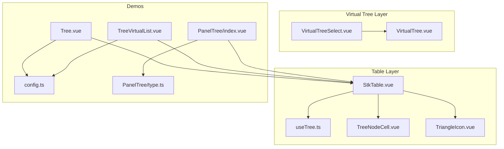
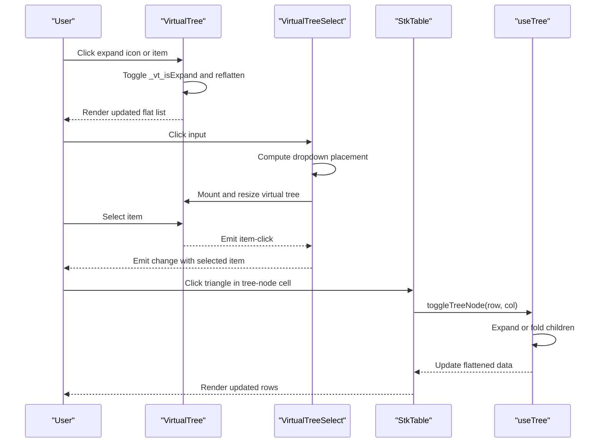
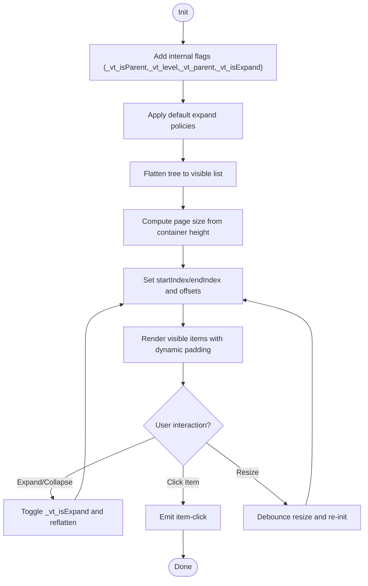
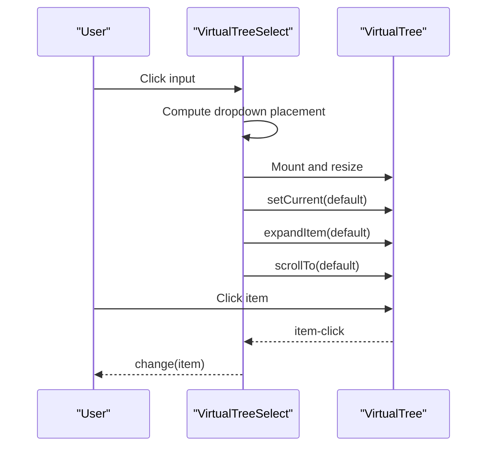
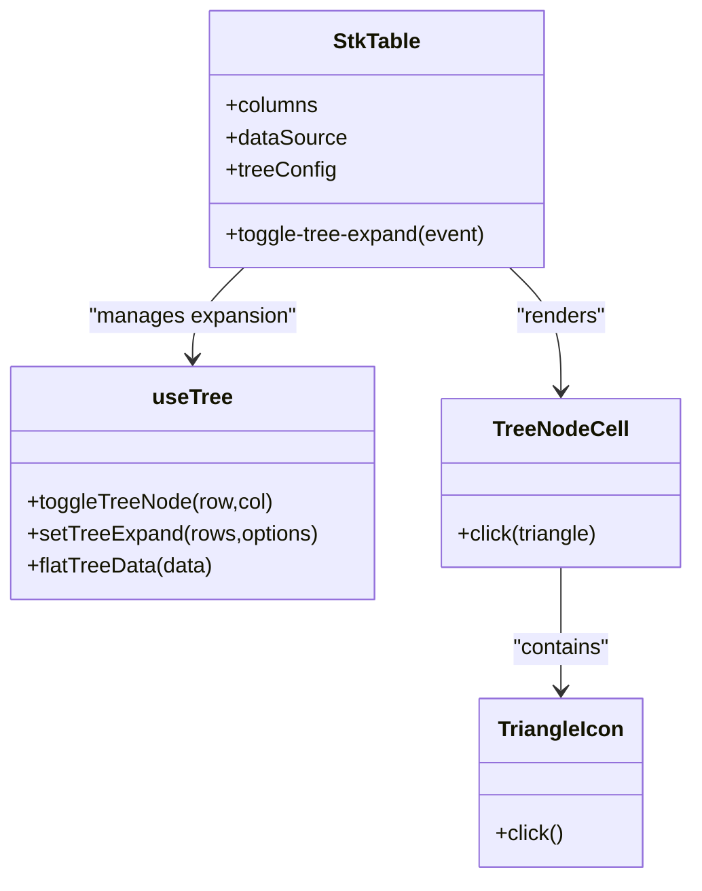
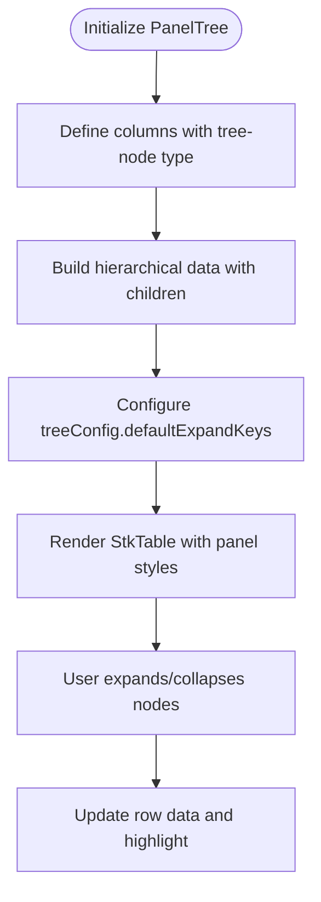
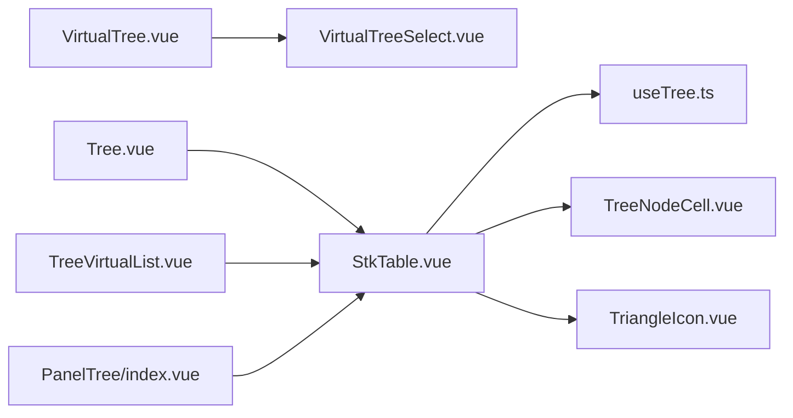

# Tree Panel Implementations

<cite>
**Referenced Files in This Document**
- [VirtualTree.vue](file://src/VirtualTree.vue)
- [VirtualTreeSelect.vue](file://src/VirtualTreeSelect.vue)
- [StkTable.vue](file://src/StkTable/StkTable.vue)
- [useTree.ts](file://src/StkTable/useTree.ts)
- [TreeNodeCell.vue](file://src/StkTable/components/TreeNodeCell.vue)
- [TriangleIcon.vue](file://src/StkTable/components/TriangleIcon.vue)
- [Tree.vue](file://docs-demo/basic/tree/Tree.vue)
- [config.ts](file://docs-demo/basic/tree/config.ts)
- [TreeDefaultExpandAll.vue](file://docs-demo/basic/tree/TreeDefaultExpandAll.vue)
- [TreeDefaultExpandKeys.vue](file://docs-demo/basic/tree/TreeDefaultExpandKeys.vue)
- [TreeDefaultExpandLevel.vue](file://docs-demo/basic/tree/TreeDefaultExpandLevel.vue)
- [TreeVirtualList.vue](file://docs-demo/basic/tree/TreeVirtualList.vue)
- [PanelTree/index.vue](file://docs-demo/demos/PanelTree/index.vue)
- [PanelTree/type.ts](file://docs-demo/demos/PanelTree/type.ts)
</cite>

## Table of Contents
1. [Introduction](#introduction)
2. [Project Structure](#project-structure)
3. [Core Components](#core-components)
4. [Architecture Overview](#architecture-overview)
5. [Detailed Component Analysis](#detailed-component-analysis)
6. [Dependency Analysis](#dependency-analysis)
7. [Performance Considerations](#performance-considerations)
8. [Troubleshooting Guide](#troubleshooting-guide)
9. [Conclusion](#conclusion)
10. [Appendices](#appendices)

## Introduction
This document explains tree panel implementations that combine hierarchical data structures with panel-based layouts. It focuses on two complementary patterns:
- A standalone virtualized tree list with expand/collapse and selection capabilities
- A tree-enabled table panel where tree nodes integrate seamlessly with tabular rows and columns

It covers data modeling, expand/collapse mechanics, panel integration, styling, responsive behavior, and user interaction patterns. Implementation guides are included for custom operations, filtering, and panel state management.

## Project Structure
The repository provides:
- A virtual tree component with virtual scrolling and optional multi-select
- A tree-select wrapper that hosts the virtual tree in a dropdown
- A table component with built-in tree support via a dedicated tree-node column type
- Demo pages showcasing tree defaults, virtual lists, and panel-based tree tables

**Diagram sources**
- [VirtualTree.vue](file://src/VirtualTree.vue#L1-L623)
- [VirtualTreeSelect.vue](file://src/VirtualTreeSelect.vue#L1-L368)
- [StkTable.vue](file://src/StkTable/StkTable.vue#L1-L800)
- [useTree.ts](file://src/StkTable/useTree.ts#L1-L162)
- [TreeNodeCell.vue](file://src/StkTable/components/TreeNodeCell.vue)
- [TriangleIcon.vue](file://src/StkTable/components/TriangleIcon.vue)
- [Tree.vue](file://docs-demo/basic/tree/Tree.vue#L1-L17)
- [config.ts](file://docs-demo/basic/tree/config.ts#L1-L113)
- [TreeVirtualList.vue](file://docs-demo/basic/tree/TreeVirtualList.vue#L1-L65)
- [PanelTree/index.vue](file://docs-demo/demos/PanelTree/index.vue#L1-L333)
- [PanelTree/type.ts](file://docs-demo/demos/PanelTree/type.ts#L1-L13)

**Section sources**
- [VirtualTree.vue](file://src/VirtualTree.vue#L1-L623)
- [VirtualTreeSelect.vue](file://src/VirtualTreeSelect.vue#L1-L368)
- [StkTable.vue](file://src/StkTable/StkTable.vue#L1-L800)
- [useTree.ts](file://src/StkTable/useTree.ts#L1-L162)
- [Tree.vue](file://docs-demo/basic/tree/Tree.vue#L1-L17)
- [TreeVirtualList.vue](file://docs-demo/basic/tree/TreeVirtualList.vue#L1-L65)
- [PanelTree/index.vue](file://docs-demo/demos/PanelTree/index.vue#L1-L333)

## Core Components
- VirtualTree: A virtualized list that renders hierarchical tree data with expand/collapse, keyboard-aware indentation, and optional checkboxes. It maintains a flattened visible list and computes offsets for efficient scrolling.
- VirtualTreeSelect: A dropdown wrapper around VirtualTree that manages visibility, positioning, and selection propagation to parent controls.
- StkTable with tree support: A table that supports tree-node columns. It flattens hierarchical data according to expansion state and exposes events for toggling nodes.
- useTree: A composable that encapsulates tree expansion logic, flattening, and default expansion policies.

Key capabilities:
- Nested data structures with children arrays
- Expand/collapse via icons or clicks
- Default expansion by level, keys, or all
- Selection modes (single/multi) with optional checkboxes
- Responsive layout and virtual scrolling for large datasets
- Panel integration with table cells and custom row styles

**Section sources**
- [VirtualTree.vue](file://src/VirtualTree.vue#L60-L516)
- [VirtualTreeSelect.vue](file://src/VirtualTreeSelect.vue#L27-L248)
- [StkTable.vue](file://src/StkTable/StkTable.vue#L160-L166)
- [useTree.ts](file://src/StkTable/useTree.ts#L12-L161)

## Architecture Overview
The tree panel architecture centers on two pathways:
- Standalone virtual tree: VirtualTree renders a flat list derived from hierarchical data, maintaining per-item metadata for expansion state and indentation.
- Table-based tree panel: StkTable uses a tree-node column type and delegates expansion to useTree, which flattens data and updates the visible dataset accordingly.

**Diagram sources**
- [VirtualTree.vue](file://src/VirtualTree.vue#L315-L362)
- [VirtualTreeSelect.vue](file://src/VirtualTreeSelect.vue#L137-L159)
- [StkTable.vue](file://src/StkTable/StkTable.vue#L160-L166)
- [useTree.ts](file://src/StkTable/useTree.ts#L17-L70)

## Detailed Component Analysis

### VirtualTree Component
VirtualTree transforms hierarchical data into a flat, visible list and virtualizes rendering. It:
- Adds internal flags to each node for expansion state, level, parent reference, and visibility
- Computes visible items based on scroll position and page size
- Supports default expansion policies and manual expansion APIs
- Emits selection and interaction events

**Diagram sources**
- [VirtualTree.vue](file://src/VirtualTree.vue#L257-L325)
- [VirtualTree.vue](file://src/VirtualTree.vue#L331-L339)
- [VirtualTree.vue](file://src/VirtualTree.vue#L345-L362)
- [VirtualTree.vue](file://src/VirtualTree.vue#L433-L440)

**Section sources**
- [VirtualTree.vue](file://src/VirtualTree.vue#L60-L516)

### VirtualTreeSelect Integration
VirtualTreeSelect wraps VirtualTree to behave as a dropdown selector:
- Conditionally mounts the tree component only when opened
- Positions the dropdown relative to the input, considering viewport boundaries
- Synchronizes selection with the parent via a change event
- Resets virtual tree state when reopening to ensure correct highlighting and scrolling

**Diagram sources**
- [VirtualTreeSelect.vue](file://src/VirtualTreeSelect.vue#L137-L159)
- [VirtualTreeSelect.vue](file://src/VirtualTreeSelect.vue#L164-L212)

**Section sources**
- [VirtualTreeSelect.vue](file://src/VirtualTreeSelect.vue#L27-L248)

### StkTable Tree Integration
StkTable integrates tree nodes via a dedicated column type:
- Detects presence of tree-node columns
- Uses useTree to manage expansion state and flatten data
- Renders triangle icons and delegates click handling to toggle nodes
- Emits toggle-tree-expand events for external control

**Diagram sources**
- [StkTable.vue](file://src/StkTable/StkTable.vue#L160-L166)
- [useTree.ts](file://src/StkTable/useTree.ts#L12-L161)
- [TreeNodeCell.vue](file://src/StkTable/components/TreeNodeCell.vue)
- [TriangleIcon.vue](file://src/StkTable/components/TriangleIcon.vue)

**Section sources**
- [StkTable.vue](file://src/StkTable/StkTable.vue#L160-L166)
- [useTree.ts](file://src/StkTable/useTree.ts#L12-L161)

### Panel-Based Tree Table (PanelTree)
The PanelTree demo showcases a table configured as a panel with:
- A tree-node column with fixed left alignment and merged header cells for parent rows
- Row-level styling to visually distinguish parent rows
- Empty cell placeholders for leaf rows
- Default expansion of specific keys
- Dynamic row updates with highlight effects

**Diagram sources**
- [PanelTree/index.vue](file://docs-demo/demos/PanelTree/index.vue#L34-L109)
- [PanelTree/index.vue](file://docs-demo/demos/PanelTree/index.vue#L15-L15)
- [PanelTree/index.vue](file://docs-demo/demos/PanelTree/index.vue#L312-L320)

**Section sources**
- [PanelTree/index.vue](file://docs-demo/demos/PanelTree/index.vue#L1-L333)
- [PanelTree/type.ts](file://docs-demo/demos/PanelTree/type.ts#L1-L13)

## Dependency Analysis
- VirtualTree depends on internal field mapping (key/title/children) and maintains per-item flags for rendering and interaction.
- VirtualTreeSelect depends on VirtualTree and manages dropdown lifecycle and positioning.
- StkTable depends on useTree for expansion logic and uses TreeNodeCell/TriangleIcon for rendering and interaction.
- Demos depend on StkTable and data generators to illustrate tree configurations and panel layouts.

**Diagram sources**
- [VirtualTree.vue](file://src/VirtualTree.vue#L1-L623)
- [VirtualTreeSelect.vue](file://src/VirtualTreeSelect.vue#L1-L368)
- [StkTable.vue](file://src/StkTable/StkTable.vue#L1-L800)
- [useTree.ts](file://src/StkTable/useTree.ts#L1-L162)
- [TreeNodeCell.vue](file://src/StkTable/components/TreeNodeCell.vue)
- [TriangleIcon.vue](file://src/StkTable/components/TriangleIcon.vue)
- [Tree.vue](file://docs-demo/basic/tree/Tree.vue#L1-L17)
- [TreeVirtualList.vue](file://docs-demo/basic/tree/TreeVirtualList.vue#L1-L65)
- [PanelTree/index.vue](file://docs-demo/demos/PanelTree/index.vue#L1-L333)

**Section sources**
- [VirtualTree.vue](file://src/VirtualTree.vue#L1-L623)
- [VirtualTreeSelect.vue](file://src/VirtualTreeSelect.vue#L1-L368)
- [StkTable.vue](file://src/StkTable/StkTable.vue#L1-L800)
- [useTree.ts](file://src/StkTable/useTree.ts#L1-L162)

## Performance Considerations
- Virtualization: Both VirtualTree and StkTable support virtual scrolling to limit DOM nodes and improve rendering performance for large datasets.
- Flattening cost: Tree flattening occurs on expansion changes and initialization; keep default expansion minimal for very deep trees.
- Resize debouncing: VirtualTree debounces resize calculations to avoid frequent reflows.
- Rendering scope: Prefer shallow refs for data sources to minimize reactive overhead in large trees.
- CSS containment: Use scoped styles and avoid heavy nested selectors in tree rows to reduce paint costs.

[No sources needed since this section provides general guidance]

## Troubleshooting Guide
Common issues and resolutions:
- Expand/collapse not working: Ensure the tree-node column is present and the triangle icon is clickable. Verify that toggle-tree-expand handlers are attached.
- Incorrect default expansion: Confirm defaultExpandAll/defaultExpandKeys/defaultExpandLevel match row keys and levels.
- Dropdown not positioning correctly: Check viewport bounds and adjust dropdownWidth/dropdownHeight/space settings.
- Selection not reflected: For VirtualTreeSelect, ensure the value prop is bound and change events are handled to propagate selection.

**Section sources**
- [useTree.ts](file://src/StkTable/useTree.ts#L17-L70)
- [VirtualTree.vue](file://src/VirtualTree.vue#L315-L362)
- [VirtualTreeSelect.vue](file://src/VirtualTreeSelect.vue#L164-L212)

## Conclusion
Tree panel implementations in this codebase combine flexible virtualized rendering with robust tree logic. Two primary patterns are supported:
- Standalone virtual tree with expand/collapse and selection
- Table-based panel with tree-node columns and integrated row styling

These patterns enable scalable, responsive, and interactive tree experiences suitable for large datasets and panel-based applications.

[No sources needed since this section summarizes without analyzing specific files]

## Appendices

### Data Modeling Examples
- Hierarchical data with children arrays and unique keys
- Parent rows with merged header cells and leaf rows with empty placeholders
- Large synthetic trees for virtual list testing

**Section sources**
- [config.ts](file://docs-demo/basic/tree/config.ts#L9-L92)
- [TreeVirtualList.vue](file://docs-demo/basic/tree/TreeVirtualList.vue#L95-L112)
- [PanelTree/index.vue](file://docs-demo/demos/PanelTree/index.vue#L59-L310)
- [PanelTree/type.ts](file://docs-demo/demos/PanelTree/type.ts#L1-L13)

### Expand/Collapse Patterns
- Default expand all, by keys, or by level
- Manual expansion via APIs
- Event-driven toggling with toggle-tree-expand

**Section sources**
- [TreeDefaultExpandAll.vue](file://docs-demo/basic/tree/TreeDefaultExpandAll.vue#L9-L12)
- [TreeDefaultExpandKeys.vue](file://docs-demo/basic/tree/TreeDefaultExpandKeys.vue#L10-L12)
- [TreeDefaultExpandLevel.vue](file://docs-demo/basic/tree/TreeDefaultExpandLevel.vue#L10-L11)
- [useTree.ts](file://src/StkTable/useTree.ts#L72-L74)

### Styling Approaches
- Tree indentation via computed padding based on node level
- Hover and highlight states for current items
- Panel-specific row styles and merged header cells
- Dropdown menu positioning and shadow effects

**Section sources**
- [VirtualTree.vue](file://src/VirtualTree.vue#L20-L25)
- [VirtualTree.vue](file://src/VirtualTree.vue#L569-L580)
- [PanelTree/index.vue](file://docs-demo/demos/PanelTree/index.vue#L322-L331)
- [VirtualTreeSelect.vue](file://src/VirtualTreeSelect.vue#L164-L212)

### User Interaction Patterns
- Clicking triangle icons to toggle nodes
- Clicking items to select/highlight (with optional cancelable behavior)
- Double-click and context menu events
- Keyboard-aware navigation and virtual scrolling

**Section sources**
- [StkTable.vue](file://src/StkTable/StkTable.vue#L147-L152)
- [VirtualTree.vue](file://src/VirtualTree.vue#L345-L362)
- [VirtualTree.vue](file://src/VirtualTree.vue#L379-L396)

### Implementation Guides
- Custom tree operations: Use setTreeExpand and toggleTreeNode to programmatically control expansion.
- Data filtering: Apply filters upstream to hierarchical data and reinitialize the tree to reflect filtered results.
- Panel state management: Persist defaultExpandKeys and current selections; restore state on mount or after data updates.

**Section sources**
- [useTree.ts](file://src/StkTable/useTree.ts#L72-L74)
- [VirtualTree.vue](file://src/VirtualTree.vue#L446-L458)
- [VirtualTreeSelect.vue](file://src/VirtualTreeSelect.vue#L236-L246)