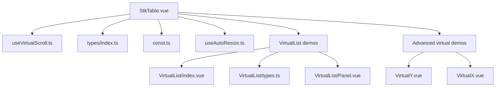
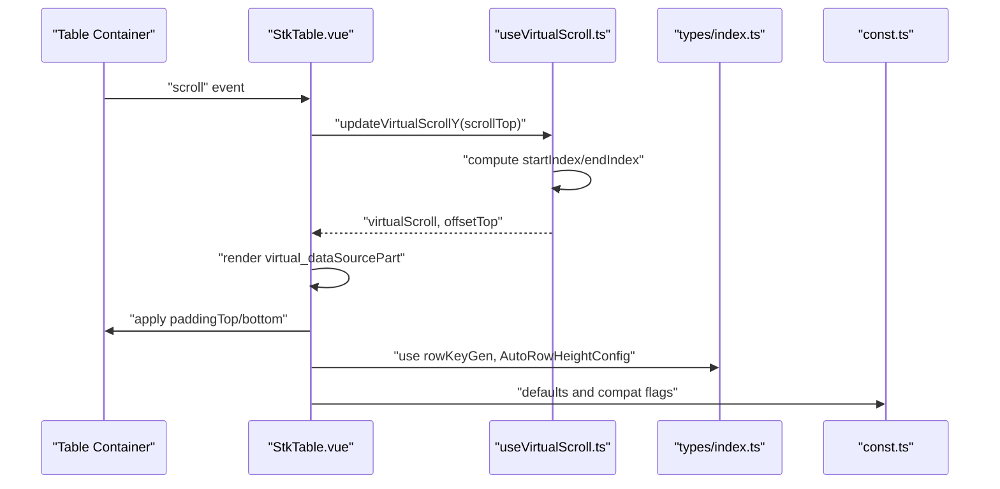
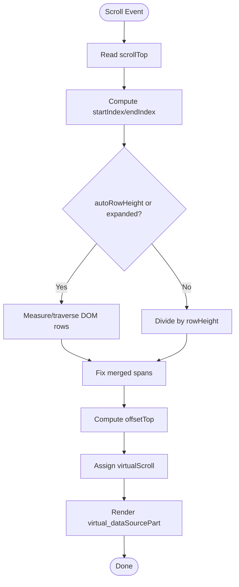
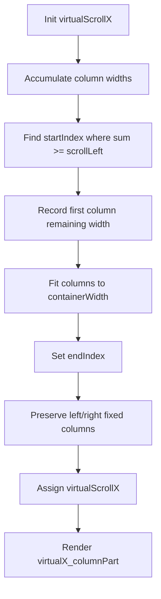
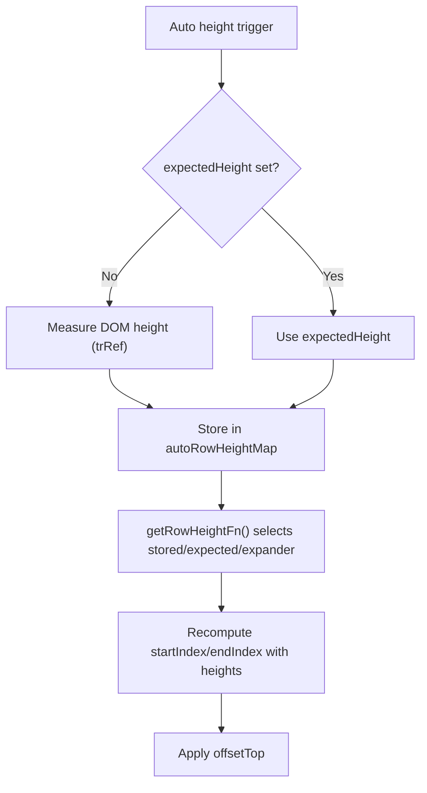
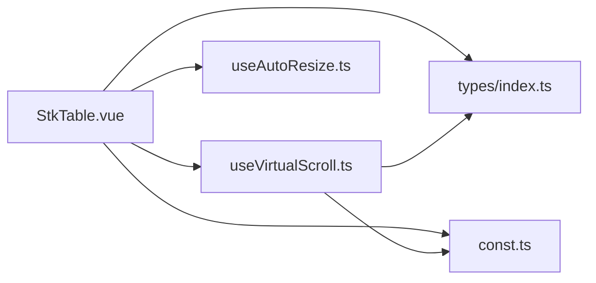

# Virtual List Patterns

<cite>
**Referenced Files in This Document**
- [StkTable.vue](file://src/StkTable/StkTable.vue)
- [useVirtualScroll.ts](file://src/StkTable/useVirtualScroll.ts)
- [types/index.ts](file://src/StkTable/types/index.ts)
- [const.ts](file://src/StkTable/const.ts)
- [useAutoResize.ts](file://src/StkTable/useAutoResize.ts)
- [virtual-list.md](file://docs-src/demos/virtual-list.md)
- [VirtualList/index.vue](file://docs-demo/demos/VirtualList/index.vue)
- [VirtualList/types.ts](file://docs-demo/demos/VirtualList/types.ts)
- [VirtualList/Panel.vue](file://docs-demo/demos/VirtualList/Panel.vue)
- [VirtualList/AutoHeightVirtualList/index.vue](file://docs-demo/demos/VirtualList/AutoHeightVirtualList/index.vue)
- [VirtualList/AutoHeightVirtualList/types.ts](file://docs-demo/demos/VirtualList/AutoHeightVirtualList/types.ts)
- [VirtualList/AutoHeightVirtualList/Panel.vue](file://docs-demo/demos/VirtualList/AutoHeightVirtualList/Panel.vue)
- [VirtualY.vue](file://docs-demo/advanced/virtual/VirtualY.vue)
- [VirtualX.vue](file://docs-demo/advanced/virtual/VirtualX.vue)
- [TreeVirtualList.vue](file://docs-demo/basic/tree/TreeVirtualList.vue)
- [AutoHeightVirtual/index.vue](file://docs-demo/advanced/auto-height-virtual/AutoHeightVirtual/index.vue)
- [AutoHeightVirtual/types.ts](file://docs-demo/advanced/auto-height-virtual/AutoHeightVirtual/types.ts)
</cite>

## Table of Contents
1. [Introduction](#introduction)
2. [Project Structure](#project-structure)
3. [Core Components](#core-components)
4. [Architecture Overview](#architecture-overview)
5. [Detailed Component Analysis](#detailed-component-analysis)
6. [Dependency Analysis](#dependency-analysis)
7. [Performance Considerations](#performance-considerations)
8. [Troubleshooting Guide](#troubleshooting-guide)
9. [Conclusion](#conclusion)
10. [Appendices](#appendices)

## Introduction
This document explains virtual list patterns and implementation strategies in the project’s table component. It focuses on the VirtualList architecture, performance optimizations, rendering efficiency, dynamic list generation, item recycling, scroll performance, styling, responsiveness, accessibility, and extensibility for custom virtualization strategies and data loading.

## Project Structure
The virtual list capability is implemented as part of the StkTable component with dedicated hooks and utilities:
- StkTable.vue orchestrates rendering, props, events, and integrates virtual scrolling.
- useVirtualScroll.ts computes visible windows, offsets, and manages Y/X virtualization.
- types/index.ts defines column types, row keys, and virtualization-related configurations.
- const.ts provides defaults and browser compatibility constants.
- useAutoResize.ts observes container size changes and reinitializes virtualization.

**Diagram sources**
- [StkTable.vue](file://src/StkTable/StkTable.vue#L1-L200)
- [useVirtualScroll.ts](file://src/StkTable/useVirtualScroll.ts#L1-L120)
- [types/index.ts](file://src/StkTable/types/index.ts#L1-L120)
- [const.ts](file://src/StkTable/const.ts#L1-L51)
- [useAutoResize.ts](file://src/StkTable/useAutoResize.ts#L1-L92)
- [VirtualList/index.vue](file://docs-demo/demos/VirtualList/index.vue#L1-L43)
- [VirtualY.vue](file://docs-demo/advanced/virtual/VirtualY.vue#L1-L34)
- [VirtualX.vue](file://docs-demo/advanced/virtual/VirtualX.vue#L1-L29)

**Section sources**
- [StkTable.vue](file://src/StkTable/StkTable.vue#L1-L200)
- [useVirtualScroll.ts](file://src/StkTable/useVirtualScroll.ts#L1-L120)
- [types/index.ts](file://src/StkTable/types/index.ts#L1-L120)
- [const.ts](file://src/StkTable/const.ts#L1-L51)
- [useAutoResize.ts](file://src/StkTable/useAutoResize.ts#L1-L92)

## Core Components
- Virtual scrolling engine: Computes visible rows/columns, offsets, and recycles DOM via slice and spacer heights.
- Auto row height support: Stores measured or estimated row heights per row key.
- X-axis virtualization: Tracks visible columns and preserves fixed columns outside the viewport.
- Auto resize observer: Reinitializes virtualization on container size changes.

Key responsibilities:
- StkTable.vue: Renders thead/tbody, binds scroll handlers, applies styles, and composes features.
- useVirtualScroll.ts: Central algorithm for Y/X virtualization, merging spans, and optimizing Vue 2 scroll.
- types/index.ts: Defines column shapes, row keys, and virtualization configs.
- const.ts: Defaults and compatibility flags.
- useAutoResize.ts: Debounced resize handling to refresh virtualization.

**Section sources**
- [StkTable.vue](file://src/StkTable/StkTable.vue#L100-L210)
- [useVirtualScroll.ts](file://src/StkTable/useVirtualScroll.ts#L170-L290)
- [types/index.ts](file://src/StkTable/types/index.ts#L54-L120)
- [const.ts](file://src/StkTable/const.ts#L6-L31)
- [useAutoResize.ts](file://src/StkTable/useAutoResize.ts#L14-L92)

## Architecture Overview
The virtual list architecture separates concerns between rendering, computation, and lifecycle:

**Diagram sources**
- [StkTable.vue](file://src/StkTable/StkTable.vue#L39-L41)
- [useVirtualScroll.ts](file://src/StkTable/useVirtualScroll.ts#L274-L407)
- [types/index.ts](file://src/StkTable/types/index.ts#L275-L278)
- [const.ts](file://src/StkTable/const.ts#L6-L31)

## Detailed Component Analysis

### Virtual Scrolling Engine (Y-axis)
The engine calculates the visible range of rows and applies top/bottom spacers to simulate full height.

**Diagram sources**
- [useVirtualScroll.ts](file://src/StkTable/useVirtualScroll.ts#L274-L407)

**Section sources**
- [useVirtualScroll.ts](file://src/StkTable/useVirtualScroll.ts#L17-L50)
- [useVirtualScroll.ts](file://src/StkTable/useVirtualScroll.ts#L274-L407)

### Horizontal Virtual Scrolling (X-axis)
X-axis virtualization tracks visible columns and preserves fixed columns outside the viewport.

**Diagram sources**
- [useVirtualScroll.ts](file://src/StkTable/useVirtualScroll.ts#L414-L478)

**Section sources**
- [useVirtualScroll.ts](file://src/StkTable/useVirtualScroll.ts#L127-L176)
- [useVirtualScroll.ts](file://src/StkTable/useVirtualScroll.ts#L414-L478)

### Auto Row Height Mechanism
Auto height supports expected height and measured heights per row key.

**Diagram sources**
- [useVirtualScroll.ts](file://src/StkTable/useVirtualScroll.ts#L178-L271)
- [useVirtualScroll.ts](file://src/StkTable/useVirtualScroll.ts#L292-L325)

**Section sources**
- [useVirtualScroll.ts](file://src/StkTable/useVirtualScroll.ts#L178-L271)
- [useVirtualScroll.ts](file://src/StkTable/useVirtualScroll.ts#L292-L325)

### Rendering Efficiency Patterns
- Dynamic list generation: The visible subset is derived from the data source slice and rendered in tbody.
- Item recycling: Only visible rows are mounted; top/bottom spacers simulate full height.
- Custom cells: Columns can render custom components per row, enabling rich virtualized items.

**Section sources**
- [StkTable.vue](file://src/StkTable/StkTable.vue#L104-L179)
- [types/index.ts](file://src/StkTable/types/index.ts#L49-L52)

### Scroll Performance Optimizations
- Vue 2 scroll optimization: Uses timeouts to batch updates when scrolling down quickly.
- Smooth scroll toggle: Controls wheel vs. frame-based scrolling behavior.
- Debounced resize: Reinitializes virtualization after container resize.

**Section sources**
- [useVirtualScroll.ts](file://src/StkTable/useVirtualScroll.ts#L397-L406)
- [useVirtualScroll.ts](file://src/StkTable/useVirtualScroll.ts#L467-L477)
- [const.ts](file://src/StkTable/const.ts#L29-L30)
- [useAutoResize.ts](file://src/StkTable/useAutoResize.ts#L76-L91)

### Styling Approaches and Responsive Design
- Headless and bordered toggles tailor the appearance to a pure list.
- Custom cell components encapsulate item styling and layout.
- Responsive width handling via column widths and virtual X ensures horizontal fit.

**Section sources**
- [virtual-list.md](file://docs-src/demos/virtual-list.md#L1-L37)
- [VirtualList/index.vue](file://docs-demo/demos/VirtualList/index.vue#L23-L42)
- [VirtualList/Panel.vue](file://docs-demo/demos/VirtualList/Panel.vue#L10-L41)
- [VirtualList/AutoHeightVirtualList/index.vue](file://docs-demo/demos/VirtualList/AutoHeightVirtualList/index.vue#L21-L43)

### Accessibility Features
- Keyboard navigation and focus management are supported via tabindex on the container.
- Highlighting and selection modes are configurable and exposed via props/events.

**Section sources**
- [StkTable.vue](file://src/StkTable/StkTable.vue#L30-L31)
- [StkTable.vue](file://src/StkTable/StkTable.vue#L478-L621)

### Implementation Patterns for Custom Virtualization Strategies
- Custom row height: Provide expectedHeight or rely on measurement.
- Custom column rendering: Use customCell to render complex items efficiently.
- Fixed columns: Preserve fixed left/right columns during X virtualization.
- Merged rows: Correct startIndex/endIndex to avoid partial merged spans.

**Section sources**
- [types/index.ts](file://src/StkTable/types/index.ts#L275-L278)
- [types/index.ts](file://src/StkTable/types/index.ts#L106-L115)
- [useVirtualScroll.ts](file://src/StkTable/useVirtualScroll.ts#L327-L360)

### Data Loading Techniques
- Large datasets: Use virtual to render only visible items.
- Dynamic updates: Reinitialize virtualization after data changes.
- Auto resize: Reinitialize virtualization on container resize.

**Section sources**
- [VirtualY.vue](file://docs-demo/advanced/virtual/VirtualY.vue#L23-L29)
- [VirtualX.vue](file://docs-demo/advanced/virtual/VirtualX.vue#L10-L12)
- [useAutoResize.ts](file://src/StkTable/useAutoResize.ts#L76-L91)

### User Interaction Handling with Large Collections
- Scroll events emit indices of visible items for tracking.
- Row and cell selection, sorting, and expansion integrate with virtualization.

**Section sources**
- [StkTable.vue](file://src/StkTable/StkTable.vue#L558-L562)
- [StkTable.vue](file://src/StkTable/StkTable.vue#L478-L621)

## Dependency Analysis
The virtual list depends on:
- StkTable.vue for orchestration and rendering.
- useVirtualScroll.ts for computation and recycling.
- types/index.ts for shape definitions and configs.
- const.ts for defaults and compatibility.
- useAutoResize.ts for lifecycle.

**Diagram sources**
- [StkTable.vue](file://src/StkTable/StkTable.vue#L263-L267)
- [useVirtualScroll.ts](file://src/StkTable/useVirtualScroll.ts#L60-L69)
- [types/index.ts](file://src/StkTable/types/index.ts#L1-L10)
- [const.ts](file://src/StkTable/const.ts#L1-L10)
- [useAutoResize.ts](file://src/StkTable/useAutoResize.ts#L14-L23)

**Section sources**
- [StkTable.vue](file://src/StkTable/StkTable.vue#L263-L267)
- [useVirtualScroll.ts](file://src/StkTable/useVirtualScroll.ts#L60-L69)
- [types/index.ts](file://src/StkTable/types/index.ts#L1-L10)
- [const.ts](file://src/StkTable/const.ts#L1-L10)
- [useAutoResize.ts](file://src/StkTable/useAutoResize.ts#L14-L23)

## Performance Considerations
- Prefer equal row heights for optimal performance; otherwise, measure or estimate heights.
- Use virtualX with explicit column widths to enable X virtualization.
- Keep custom cells lightweight; defer heavy work to async or lazy patterns.
- Leverage debounceMs in auto resize to avoid frequent recomputations.
- Use scrollRowByRow for predictable row-wise scrolling when needed.

[No sources needed since this section provides general guidance]

## Troubleshooting Guide
- Rows appear misaligned or striped incorrectly: Ensure stripe alignment by adjusting startIndex when needed.
- White screen on fast scroll: Enable smoothScroll or adjust optimizeVue2Scroll behavior.
- Incorrect merged row rendering: Verify merged spans correction logic.
- Columns not visible in X virtualization: Confirm fixed columns are preserved and widths sum exceeds container width.

**Section sources**
- [useVirtualScroll.ts](file://src/StkTable/useVirtualScroll.ts#L362-L369)
- [useVirtualScroll.ts](file://src/StkTable/useVirtualScroll.ts#L397-L406)
- [useVirtualScroll.ts](file://src/StkTable/useVirtualScroll.ts#L327-L360)
- [useVirtualScroll.ts](file://src/StkTable/useVirtualScroll.ts#L127-L132)

## Conclusion
The virtual list implementation combines a compact virtualization engine with flexible rendering and robust lifecycle management. By leveraging expected or measured row heights, preserving fixed columns, and optimizing scroll behavior, it achieves efficient rendering for large datasets while maintaining usability and accessibility.

[No sources needed since this section summarizes without analyzing specific files]

## Appendices

### Example Demos and References
- Pure virtual single-column list with custom cells and headless/bordered toggles.
- Auto height virtual list with variable row heights.
- Very large Y and X virtual lists to demonstrate scalability.

**Section sources**
- [virtual-list.md](file://docs-src/demos/virtual-list.md#L1-L37)
- [VirtualList/index.vue](file://docs-demo/demos/VirtualList/index.vue#L1-L43)
- [VirtualList/types.ts](file://docs-demo/demos/VirtualList/types.ts#L1-L6)
- [VirtualList/Panel.vue](file://docs-demo/demos/VirtualList/Panel.vue#L1-L42)
- [VirtualList/AutoHeightVirtualList/index.vue](file://docs-demo/demos/VirtualList/AutoHeightVirtualList/index.vue#L1-L44)
- [VirtualList/AutoHeightVirtualList/types.ts](file://docs-demo/demos/VirtualList/AutoHeightVirtualList/types.ts#L1-L7)
- [VirtualList/AutoHeightVirtualList/Panel.vue](file://docs-demo/demos/VirtualList/AutoHeightVirtualList/Panel.vue#L1-L42)
- [VirtualY.vue](file://docs-demo/advanced/virtual/VirtualY.vue#L1-L34)
- [VirtualX.vue](file://docs-demo/advanced/virtual/VirtualX.vue#L1-L29)
- [TreeVirtualList.vue](file://docs-demo/basic/tree/TreeVirtualList.vue#L1-L65)
- [AutoHeightVirtual/index.vue](file://docs-demo/advanced/auto-height-virtual/AutoHeightVirtual/index.vue#L1-L42)
- [AutoHeightVirtual/types.ts](file://docs-demo/advanced/auto-height-virtual/AutoHeightVirtual/types.ts#L1-L7)