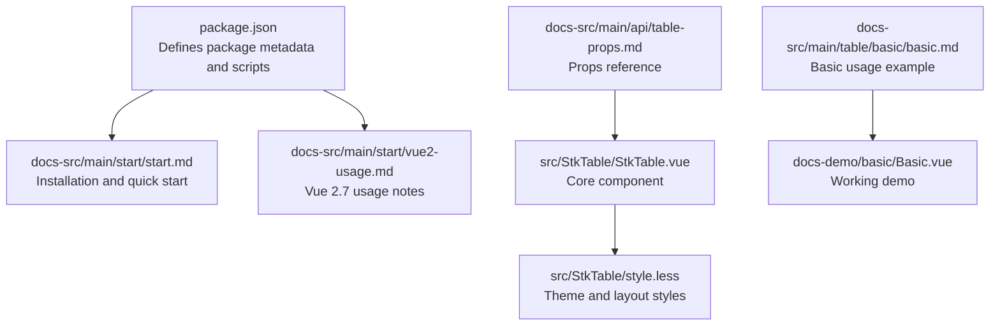
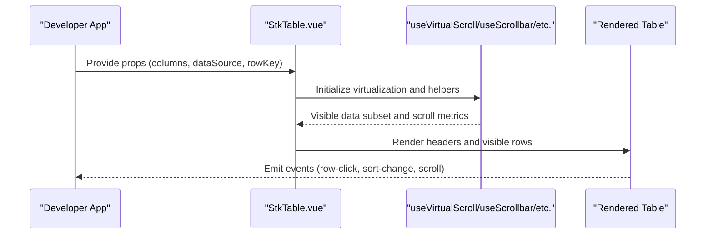
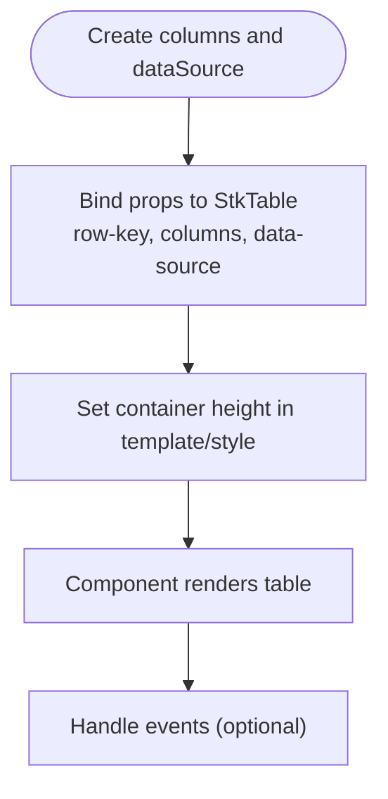
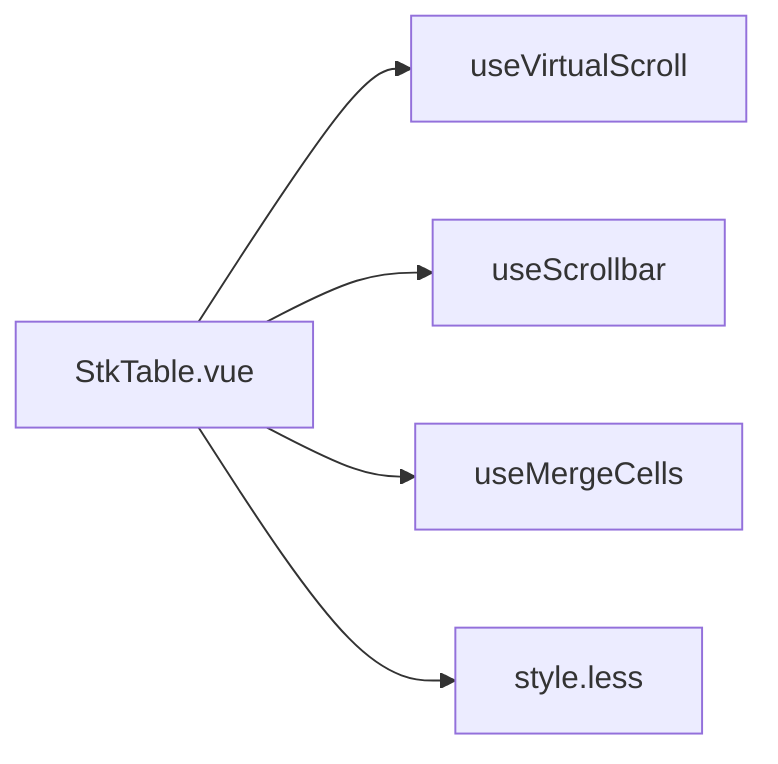

# Getting Started

<cite>
**Referenced Files in This Document**
- [package.json](file://package.json)
- [README.md](file://README.md)
- [docs-src/main/start/start.md](file://docs-src/main/start/start.md)
- [docs-src/main/start/vue2-usage.md](file://docs-src/main/start/vue2-usage.md)
- [docs-src/main/table/basic/basic.md](file://docs-src/main/table/basic/basic.md)
- [docs-demo/basic/Basic.vue](file://docs-demo/basic/Basic.vue)
- [src/StkTable/StkTable.vue](file://src/StkTable/StkTable.vue)
- [src/StkTable/types/index.ts](file://src/StkTable/types/index.ts)
- [src/StkTable/style.less](file://src/StkTable/style.less)
- [docs-src/main/api/table-props.md](file://docs-src/main/api/table-props.md)
- [docs-src/main/other/qa.md](file://docs-src/main/other/qa.md)
- [docs-src/main/other/tips.md](file://docs-src/main/other/tips.md)
</cite>

## Table of Contents
1. [Introduction](#introduction)
2. [Project Structure](#project-structure)
3. [Core Components](#core-components)
4. [Architecture Overview](#architecture-overview)
5. [Detailed Component Analysis](#detailed-component-analysis)
6. [Dependency Analysis](#dependency-analysis)
7. [Performance Considerations](#performance-considerations)
8. [Troubleshooting Guide](#troubleshooting-guide)
9. [Conclusion](#conclusion)
10. [Appendices](#appendices)

## Introduction
Stk Table Vue is a high-performance virtual table component designed for Vue 3 and Vue 2.7. It supports real-time data rendering, virtual scrolling, sorting, custom cells, and theming. This guide helps you install the library, set up a minimal project, and render your first table with columns and data.

## Project Structure
This repository includes:
- A published package definition and scripts
- Documentation site sources and demos
- The core StkTable component source and styles
- Demos and examples for basic usage and advanced features

**Diagram sources**
- [package.json](file://package.json#L1-L76)
- [docs-src/main/start/start.md](file://docs-src/main/start/start.md#L1-L77)
- [docs-src/main/start/vue2-usage.md](file://docs-src/main/start/vue2-usage.md#L1-L47)
- [src/StkTable/StkTable.vue](file://src/StkTable/StkTable.vue#L1-L200)
- [src/StkTable/style.less](file://src/StkTable/style.less#L1-L200)
- [docs-src/main/table/basic/basic.md](file://docs-src/main/table/basic/basic.md#L1-L41)
- [docs-demo/basic/Basic.vue](file://docs-demo/basic/Basic.vue#L1-L39)
- [docs-src/main/api/table-props.md](file://docs-src/main/api/table-props.md#L1-L200)

**Section sources**
- [package.json](file://package.json#L1-L76)
- [README.md](file://README.md#L1-L173)

## Core Components
- StkTable: The main table component with virtual scrolling, theming, and rich configuration.
- StkTableColumn: Type definition for column configuration (dataIndex, title, width, align, sorter, fixed, customCell, etc.).

Minimum required props to render a basic table:
- columns: Array of column configurations
- dataSource: Array of row data
- rowKey: Unique identifier for each row

These props are documented in the API reference and demonstrated in the basic example.

**Section sources**
- [src/StkTable/StkTable.vue](file://src/StkTable/StkTable.vue#L278-L476)
- [src/StkTable/types/index.ts](file://src/StkTable/types/index.ts#L54-L120)
- [docs-src/main/table/basic/basic.md](file://docs-src/main/table/basic/basic.md#L1-L41)

## Architecture Overview
The StkTable component renders a virtualized table body and optional multi-level headers. It computes visible rows based on container height and row heights, and exposes events for interactions like sorting, selection, and scrolling.

**Diagram sources**
- [src/StkTable/StkTable.vue](file://src/StkTable/StkTable.vue#L209-L267)
- [src/StkTable/StkTable.vue](file://src/StkTable/StkTable.vue#L763-L788)
- [src/StkTable/StkTable.vue](file://src/StkTable/StkTable.vue#L790-L791)

## Detailed Component Analysis

### Installation and Setup
- Install via npm:
  - Run: npm install stk-table-vue
- Import styles:
  - Import the stylesheet in your app entry to apply base styles.
- Vue 3 usage:
  - Use script setup and ref handling as shown in the quick start.
- Vue 2.7 usage:
  - Import the .vue source file directly and ensure TypeScript support in your build pipeline.

**Section sources**
- [docs-src/main/start/start.md](file://docs-src/main/start/start.md#L7-L28)
- [docs-src/main/start/vue2-usage.md](file://docs-src/main/start/vue2-usage.md#L1-L47)
- [README.md](file://README.md#L34-L84)

### Creating Your First Table
- Prepare columns and dataSource with a unique rowKey.
- Bind props to StkTable and set a container height.
- Optionally enable virtual scrolling and other features.

**Diagram sources**
- [docs-src/main/table/basic/basic.md](file://docs-src/main/table/basic/basic.md#L8-L39)
- [docs-demo/basic/Basic.vue](file://docs-demo/basic/Basic.vue#L1-L39)

**Section sources**
- [docs-src/main/table/basic/basic.md](file://docs-src/main/table/basic/basic.md#L1-L41)
- [docs-demo/basic/Basic.vue](file://docs-demo/basic/Basic.vue#L1-L39)

### Minimum Required Props
- columns: Defines table columns and their rendering behavior.
- dataSource: Provides the tabular data.
- rowKey: Identifies each row uniquely.

These are the core props required to render a functional table.

**Section sources**
- [src/StkTable/StkTable.vue](file://src/StkTable/StkTable.vue#L318-L323)
- [docs-src/main/table/basic/basic.md](file://docs-src/main/table/basic/basic.md#L3-L5)

### Vue 2.7 and Vue 3.x Usage Patterns
- Vue 3.x:
  - Use script setup and ref handling for template refs.
  - The quick start demonstrates ref usage and highlight APIs.
- Vue 2.7:
  - Import the .vue source file directly.
  - Ensure TypeScript parsing in your bundler.

**Section sources**
- [docs-src/main/start/start.md](file://docs-src/main/start/start.md#L30-L71)
- [docs-src/main/start/vue2-usage.md](file://docs-src/main/start/vue2-usage.md#L1-L47)

### Basic Styling Options
- Theme: Choose between light and dark themes.
- Borders: Control borders with bordered prop variants.
- Stripe: Enable zebra-striping for readability.
- Overflow: Configure header/body overflow behavior.
- Height: Set a container height to enable virtual scrolling.

Styling is implemented via CSS variables and class toggles.

**Section sources**
- [src/StkTable/StkTable.vue](file://src/StkTable/StkTable.vue#L6-L29)
- [src/StkTable/style.less](file://src/StkTable/style.less#L8-L200)
- [docs-src/main/table/basic/basic.md](file://docs-src/main/table/basic/basic.md#L36-L38)

### Common Configuration Scenarios
- Virtual scrolling: Enable virtual and virtualX for large datasets.
- Sorting: Enable sorter per column and handle sort-change events.
- Custom cells: Use customCell and customHeaderCell for advanced rendering.
- Fixed columns: Use fixed prop on columns and adjust fixedMode if needed.
- Highlighting: Use exposed methods to highlight rows or cells.

**Section sources**
- [src/StkTable/StkTable.vue](file://src/StkTable/StkTable.vue#L314-L317)
- [src/StkTable/types/index.ts](file://src/StkTable/types/index.ts#L67-L115)
- [docs-src/main/api/table-props.md](file://docs-src/main/api/table-props.md#L44-L47)

## Dependency Analysis
- StkTable depends on internal composables for virtual scrolling, scrolling, merging cells, and theming.
- Styles are bundled via a single less file and applied through class toggles.

**Diagram sources**
- [src/StkTable/StkTable.vue](file://src/StkTable/StkTable.vue#L248-L267)
- [src/StkTable/style.less](file://src/StkTable/style.less#L1-L200)

**Section sources**
- [src/StkTable/StkTable.vue](file://src/StkTable/StkTable.vue#L248-L267)

## Performance Considerations
- Prefer virtual scrolling for large datasets to reduce DOM nodes.
- Keep rowKey stable and unique to avoid re-renders.
- Limit heavy customCell logic to improve rendering performance.

[No sources needed since this section provides general guidance]

## Troubleshooting Guide
Common issues and resolutions:
- Columns or dataSource changes not reflected:
  - Reassign to a new array reference to trigger updates.
- Low browser compatibility with fixed widths:
  - Set explicit width on the main table element when using fixedMode.

**Section sources**
- [docs-src/main/other/qa.md](file://docs-src/main/other/qa.md#L1-L8)
- [docs-src/main/other/tips.md](file://docs-src/main/other/tips.md#L1-L11)

## Conclusion
You now have the essentials to install Stk Table Vue, configure the minimum required props, and render a working table. Explore the demos and API reference to unlock advanced features like virtual scrolling, custom cells, sorting, and theming.

[No sources needed since this section summarizes without analyzing specific files]

## Appendices

### Quick Start Checklist
- Install the package and import styles
- Prepare columns with title and dataIndex
- Prepare dataSource with unique row identifiers
- Bind rowKey, columns, and dataSource to StkTable
- Set a container height to enable virtual scrolling
- Review the demos for advanced patterns

**Section sources**
- [docs-src/main/start/start.md](file://docs-src/main/start/start.md#L30-L71)
- [docs-src/main/table/basic/basic.md](file://docs-src/main/table/basic/basic.md#L1-L41)