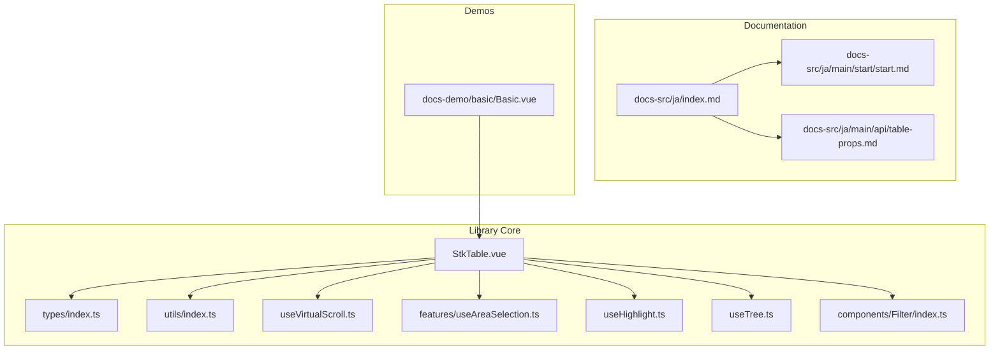
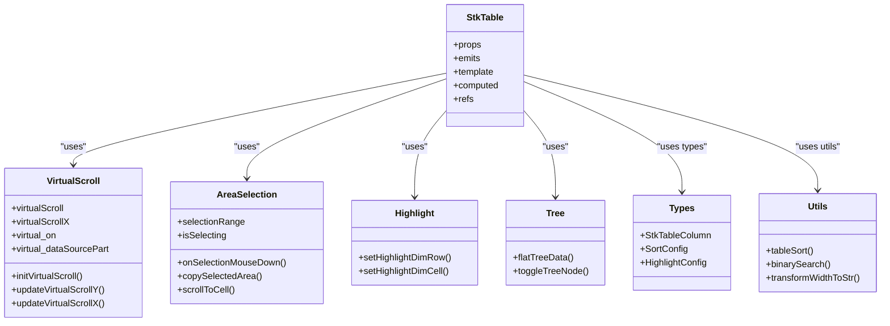
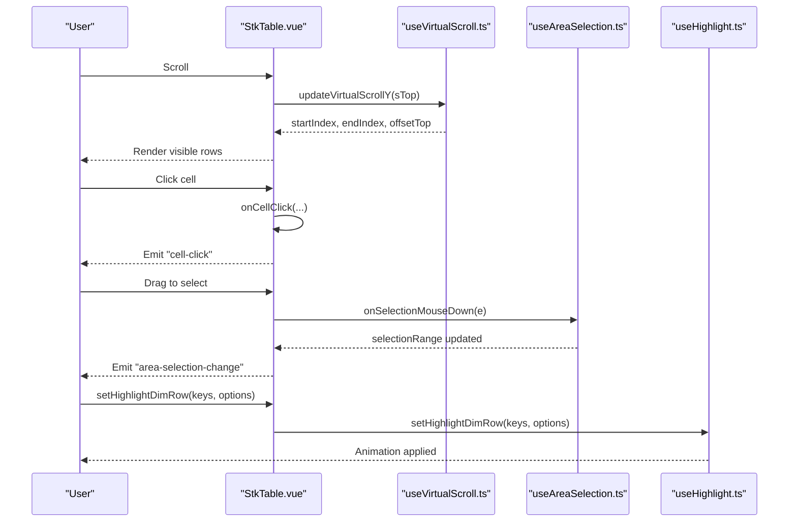
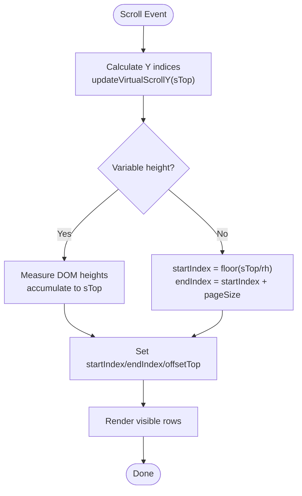
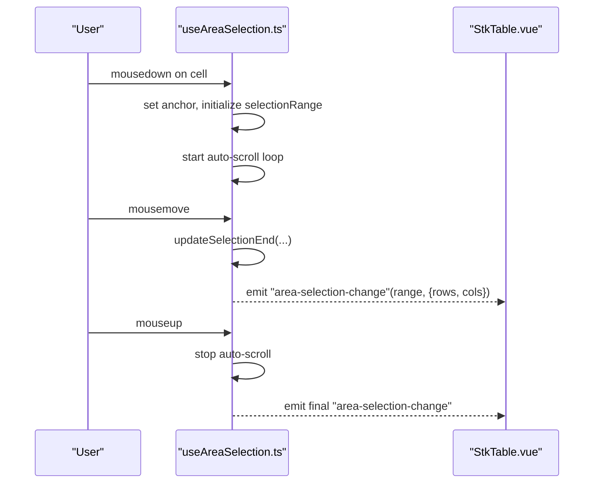
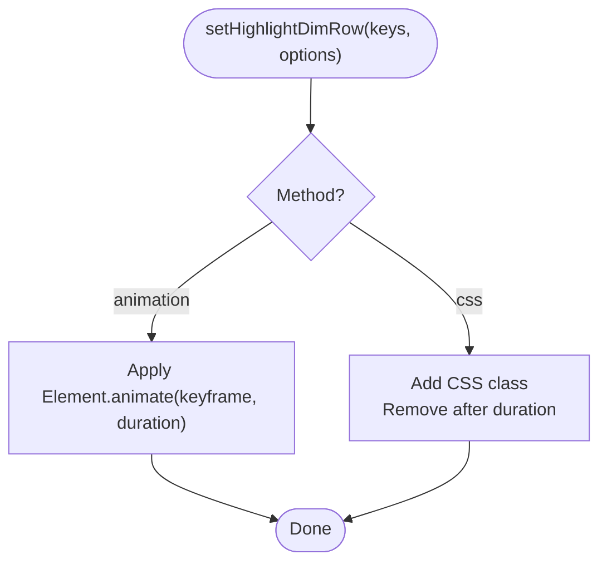
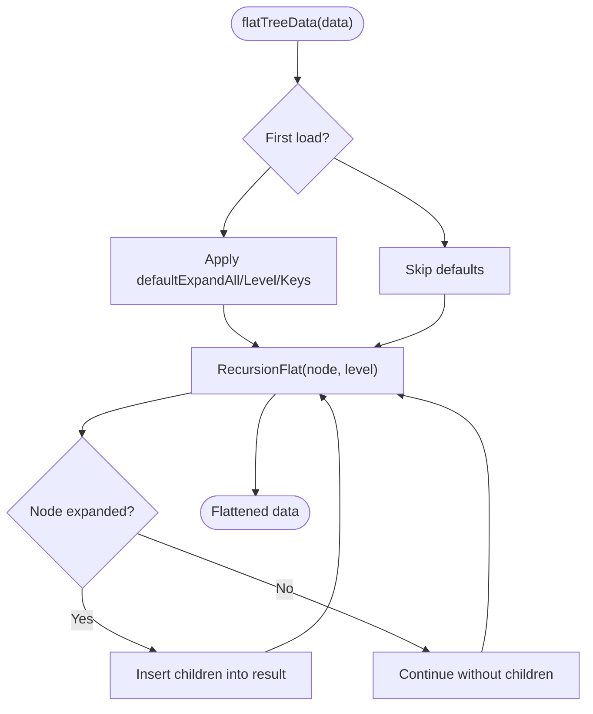
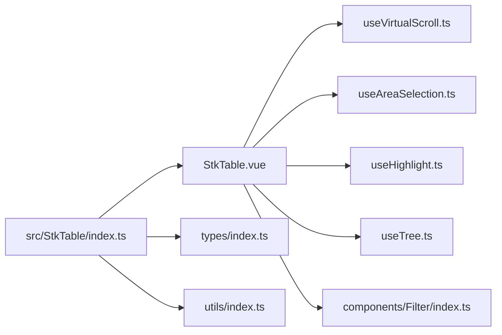

# Japanese Documentation

<cite>
**Referenced Files in This Document**
- [README.md](file://README.md)
- [package.json](file://package.json)
- [src/StkTable/index.ts](file://src/StkTable/index.ts)
- [src/StkTable/StkTable.vue](file://src/StkTable/StkTable.vue)
- [src/StkTable/types/index.ts](file://src/StkTable/types/index.ts)
- [src/StkTable/utils/index.ts](file://src/StkTable/utils/index.ts)
- [src/StkTable/useVirtualScroll.ts](file://src/StkTable/useVirtualScroll.ts)
- [src/StkTable/features/useAreaSelection.ts](file://src/StkTable/features/useAreaSelection.ts)
- [src/StkTable/components/Filter/index.ts](file://src/StkTable/components/Filter/index.ts)
- [src/StkTable/useHighlight.ts](file://src/StkTable/useHighlight.ts)
- [src/StkTable/useTree.ts](file://src/StkTable/useTree.ts)
- [docs-src/ja/index.md](file://docs-src/ja/index.md)
- [docs-src/ja/main/start/start.md](file://docs-src/ja/main/start/start.md)
- [docs-src/ja/main/api/table-props.md](file://docs-src/ja/main/api/table-props.md)
- [docs-demo/basic/Basic.vue](file://docs-demo/basic/Basic.vue)
</cite>

## Table of Contents
1. [Introduction](#introduction)
2. [Project Structure](#project-structure)
3. [Core Components](#core-components)
4. [Architecture Overview](#architecture-overview)
5. [Detailed Component Analysis](#detailed-component-analysis)
6. [Dependency Analysis](#dependency-analysis)
7. [Performance Considerations](#performance-considerations)
8. [Troubleshooting Guide](#troubleshooting-guide)
9. [Conclusion](#conclusion)
10. [Appendices](#appendices)

## Introduction
StkTable Vue is a high-performance virtual scrolling table component designed for real-time data display. It supports Vue 3 and Vue 2.7, offers advanced features such as row/cell highlighting, area selection, filtering, sorting, and tree data rendering, and provides a flexible API with full TypeScript support. The component emphasizes smooth scrolling, efficient rendering via virtualization, and customizable behavior for various use cases.

## Project Structure
The project is organized into several key areas:
- Core library under src/StkTable, including the main component, features, utilities, and types
- Documentation under docs-src/ja for Japanese users
- Demo applications under docs-demo for showcasing features
- Build and packaging configuration in package.json and vite.config.ts

**Diagram sources**
- [src/StkTable/StkTable.vue](file://src/StkTable/StkTable.vue)
- [src/StkTable/types/index.ts](file://src/StkTable/types/index.ts)
- [src/StkTable/utils/index.ts](file://src/StkTable/utils/index.ts)
- [src/StkTable/useVirtualScroll.ts](file://src/StkTable/useVirtualScroll.ts)
- [src/StkTable/features/useAreaSelection.ts](file://src/StkTable/features/useAreaSelection.ts)
- [src/StkTable/useHighlight.ts](file://src/StkTable/useHighlight.ts)
- [src/StkTable/useTree.ts](file://src/StkTable/useTree.ts)
- [src/StkTable/components/Filter/index.ts](file://src/StkTable/components/Filter/index.ts)
- [docs-src/ja/index.md](file://docs-src/ja/index.md)
- [docs-src/ja/main/start/start.md](file://docs-src/ja/main/start/start.md)
- [docs-src/ja/main/api/table-props.md](file://docs-src/ja/main/api/table-props.md)
- [docs-demo/basic/Basic.vue](file://docs-demo/basic/Basic.vue)

**Section sources**
- [README.md](file://README.md)
- [package.json](file://package.json)

## Core Components
- StkTable.vue: Main table component implementing rendering, events, and integrations with features like virtual scrolling, area selection, highlighting, and tree rendering.
- useVirtualScroll.ts: Implements virtual scrolling for both Y and X axes, calculating visible ranges and offsets.
- useAreaSelection.ts: Provides area selection via mouse drag and keyboard navigation, with copy-to-clipboard support.
- useHighlight.ts: Offers row and cell highlighting with configurable animation or CSS-based methods.
- useTree.ts: Manages tree data flattening and expansion/collapse behavior.
- types/index.ts: Defines column configuration, sort options, highlight options, and other type definitions.
- utils/index.ts: Utility functions for sorting, binary search, width transformations, and throttling.

**Section sources**
- [src/StkTable/StkTable.vue](file://src/StkTable/StkTable.vue)
- [src/StkTable/useVirtualScroll.ts](file://src/StkTable/useVirtualScroll.ts)
- [src/StkTable/features/useAreaSelection.ts](file://src/StkTable/features/useAreaSelection.ts)
- [src/StkTable/useHighlight.ts](file://src/StkTable/useHighlight.ts)
- [src/StkTable/useTree.ts](file://src/StkTable/useTree.ts)
- [src/StkTable/types/index.ts](file://src/StkTable/types/index.ts)
- [src/StkTable/utils/index.ts](file://src/StkTable/utils/index.ts)

## Architecture Overview
The table component orchestrates multiple features through composable hooks. Rendering is driven by reactive props and computed values, with virtual scrolling optimizing DOM updates. Features are integrated via dedicated composables that manage state, events, and side effects.

**Diagram sources**
- [src/StkTable/StkTable.vue](file://src/StkTable/StkTable.vue)
- [src/StkTable/useVirtualScroll.ts](file://src/StkTable/useVirtualScroll.ts)
- [src/StkTable/features/useAreaSelection.ts](file://src/StkTable/features/useAreaSelection.ts)
- [src/StkTable/useHighlight.ts](file://src/StkTable/useHighlight.ts)
- [src/StkTable/useTree.ts](file://src/StkTable/useTree.ts)
- [src/StkTable/types/index.ts](file://src/StkTable/types/index.ts)
- [src/StkTable/utils/index.ts](file://src/StkTable/utils/index.ts)

## Detailed Component Analysis

### StkTable.vue
- Responsibilities:
  - Renders header, body, and optional footer with support for multi-level headers and fixed columns.
  - Integrates virtual scrolling, highlighting, area selection, and tree features.
  - Emits events for user interactions (sorting, clicking, scrolling, context menus).
  - Applies theme, borders, overflow handling, and responsive behavior.
- Key behaviors:
  - Uses computed props and refs to manage visibility, dimensions, and styles.
  - Delegates rendering of custom cells, headers, and footers to provided components.
  - Handles drag-and-drop for rows and columns, and column resizing when enabled.

**Diagram sources**
- [src/StkTable/StkTable.vue](file://src/StkTable/StkTable.vue)
- [src/StkTable/useVirtualScroll.ts](file://src/StkTable/useVirtualScroll.ts)
- [src/StkTable/features/useAreaSelection.ts](file://src/StkTable/features/useAreaSelection.ts)
- [src/StkTable/useHighlight.ts](file://src/StkTable/useHighlight.ts)

**Section sources**
- [src/StkTable/StkTable.vue](file://src/StkTable/StkTable.vue)

### useVirtualScroll.ts
- Responsibilities:
  - Calculates visible data range for virtual scrolling (Y and X axes).
  - Computes offsets and transforms for efficient rendering.
  - Handles variable row heights and expandable rows.
- Key algorithms:
  - Binary search for determining start/end indices in variable-height scenarios.
  - Width accumulation for horizontal virtualization with fixed columns.

**Diagram sources**
- [src/StkTable/useVirtualScroll.ts](file://src/StkTable/useVirtualScroll.ts)

**Section sources**
- [src/StkTable/useVirtualScroll.ts](file://src/StkTable/useVirtualScroll.ts)

### useAreaSelection.ts
- Responsibilities:
  - Manages cell range selection via mouse drag and keyboard navigation.
  - Supports copying selected area to clipboard with optional custom formatting.
  - Scrolls to keep selected cells visible.
- Key behaviors:
  - Tracks anchor cell and selection range.
  - Uses auto-scroll near edges during drag.
  - Emits selection change events with affected rows and columns.

**Diagram sources**
- [src/StkTable/features/useAreaSelection.ts](file://src/StkTable/features/useAreaSelection.ts)
- [src/StkTable/StkTable.vue](file://src/StkTable/StkTable.vue)

**Section sources**
- [src/StkTable/features/useAreaSelection.ts](file://src/StkTable/features/useAreaSelection.ts)

### useHighlight.ts
- Responsibilities:
  - Highlights rows and cells with configurable animation or CSS methods.
  - Supports animation via Web Animations API and CSS keyframes.
- Key behaviors:
  - Computes duration and steps based on highlightConfig.
  - Updates row highlights dynamically in virtualized environments.

**Diagram sources**
- [src/StkTable/useHighlight.ts](file://src/StkTable/useHighlight.ts)

**Section sources**
- [src/StkTable/useHighlight.ts](file://src/StkTable/useHighlight.ts)

### useTree.ts
- Responsibilities:
  - Flattens hierarchical data for display with expand/collapse controls.
  - Supports default expand all, by level, or by keys.
- Key behaviors:
  - Recursively expands nodes and inserts children into the flattened array.
  - Emits toggle events for UI feedback.

**Diagram sources**
- [src/StkTable/useTree.ts](file://src/StkTable/useTree.ts)

**Section sources**
- [src/StkTable/useTree.ts](file://src/StkTable/useTree.ts)

### utils/index.ts
- Responsibilities:
  - Sorting helpers for numeric and string comparisons.
  - Binary search and insertion utilities.
  - Width transformation and throttling helpers.

**Section sources**
- [src/StkTable/utils/index.ts](file://src/StkTable/utils/index.ts)

### types/index.ts
- Responsibilities:
  - Defines column configuration, sort options, highlight options, area selection config, and related types.
  - Ensures type-safe integration across features.

**Section sources**
- [src/StkTable/types/index.ts](file://src/StkTable/types/index.ts)

## Dependency Analysis
- StkTable.vue depends on:
  - useVirtualScroll.ts for rendering optimization
  - useAreaSelection.ts for selection features
  - useHighlight.ts for visual feedback
  - useTree.ts for hierarchical data
  - types/index.ts and utils/index.ts for type safety and utilities
- Export surface:
  - src/StkTable/index.ts re-exports the main component, utilities, types, and feature registration.

**Diagram sources**
- [src/StkTable/index.ts](file://src/StkTable/index.ts)
- [src/StkTable/StkTable.vue](file://src/StkTable/StkTable.vue)
- [src/StkTable/types/index.ts](file://src/StkTable/types/index.ts)
- [src/StkTable/utils/index.ts](file://src/StkTable/utils/index.ts)
- [src/StkTable/useVirtualScroll.ts](file://src/StkTable/useVirtualScroll.ts)
- [src/StkTable/features/useAreaSelection.ts](file://src/StkTable/features/useAreaSelection.ts)
- [src/StkTable/useHighlight.ts](file://src/StkTable/useHighlight.ts)
- [src/StkTable/useTree.ts](file://src/StkTable/useTree.ts)
- [src/StkTable/components/Filter/index.ts](file://src/StkTable/components/Filter/index.ts)

**Section sources**
- [src/StkTable/index.ts](file://src/StkTable/index.ts)

## Performance Considerations
- Virtual scrolling reduces DOM nodes by rendering only visible items, improving responsiveness for large datasets.
- Variable row heights require measuring DOM heights; batch measurements are performed to minimize layout thrashing.
- Horizontal virtual scrolling maintains fixed columns outside the visible viewport to avoid unnecessary reflows.
- Throttling and requestAnimationFrame-based updates help maintain smooth scrolling performance.

## Troubleshooting Guide
- Highlighting does not appear:
  - Verify highlightConfig duration and fps are set appropriately.
  - Ensure the rowKey matches the data source and the element exists in the DOM.
- Area selection not working:
  - Confirm areaSelection prop is enabled and keyboard navigation is configured if needed.
  - Check that customCell rendering does not prevent pointer events.
- Tree nodes not expanding:
  - Ensure treeConfig is properly set and data includes children arrays.
  - Verify rowKey uniqueness to avoid lookup failures.
- Column resizing issues:
  - When colResizable is enabled, ensure each column has a width and v-model:columns is bound to update widths.

**Section sources**
- [src/StkTable/useHighlight.ts](file://src/StkTable/useHighlight.ts)
- [src/StkTable/features/useAreaSelection.ts](file://src/StkTable/features/useAreaSelection.ts)
- [src/StkTable/useTree.ts](file://src/StkTable/useTree.ts)
- [src/StkTable/StkTable.vue](file://src/StkTable/StkTable.vue)

## Conclusion
StkTable Vue delivers a robust, high-performance solution for rendering large datasets with rich interactivity. Its modular architecture, comprehensive feature set, and strong TypeScript support make it suitable for real-time dashboards, data grids, and analytical applications across Vue 2.7 and Vue 3 ecosystems.

## Appendices

### Quick Start (Japanese)
- Install the package and import styles.
- Create columns and data source, then render the table with row-key and data-source props.
- Use setHighlightDimRow/setHighlightDimCell for highlighting and areaSelection for range selection.

**Section sources**
- [docs-src/ja/main/start/start.md](file://docs-src/ja/main/start/start.md)
- [docs-demo/basic/Basic.vue](file://docs-demo/basic/Basic.vue)

### API Reference (Japanese)
- Explore props, events, slots, and expose APIs tailored for Japanese users.

**Section sources**
- [docs-src/ja/main/api/table-props.md](file://docs-src/ja/main/api/table-props.md)