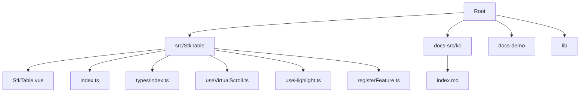
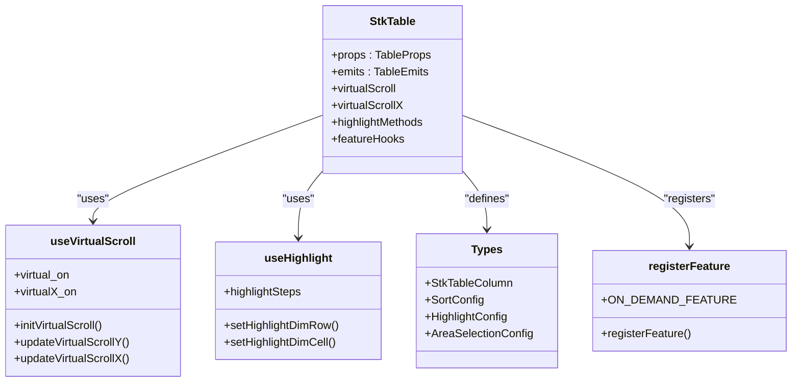
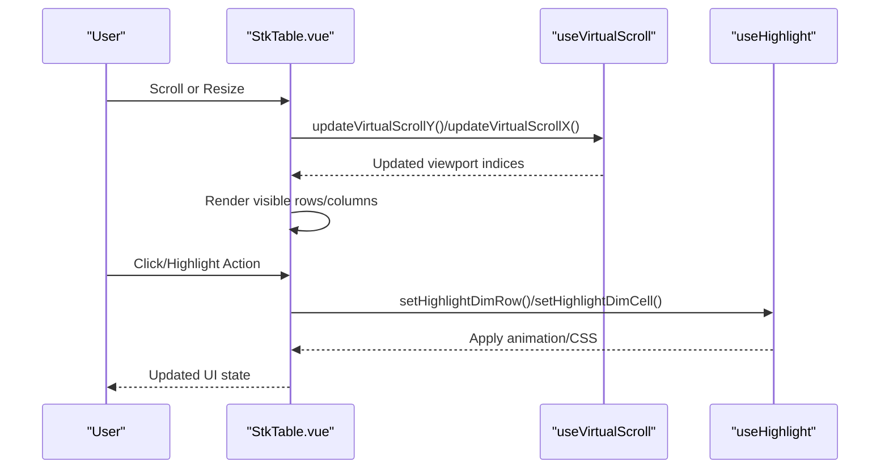
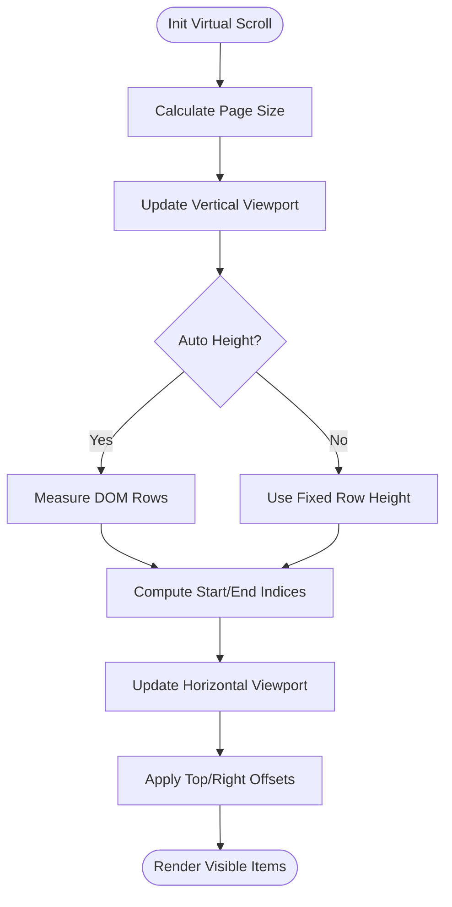
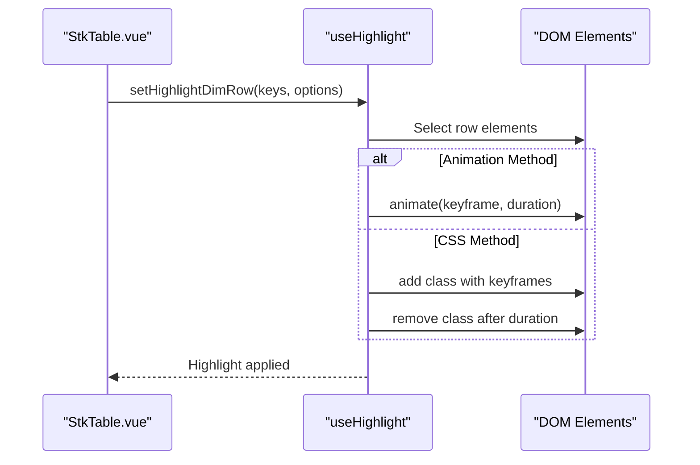
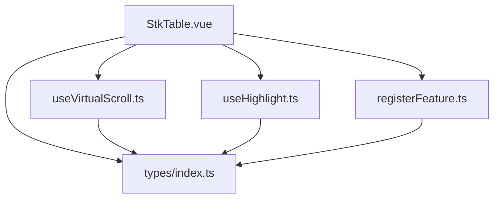

# Korean Documentation

<cite>
**Referenced Files in This Document**
- [README.md](file://README.md)
- [package.json](file://package.json)
- [src/StkTable/index.ts](file://src/StkTable/index.ts)
- [src/StkTable/StkTable.vue](file://src/StkTable/StkTable.vue)
- [src/StkTable/types/index.ts](file://src/StkTable/types/index.ts)
- [src/StkTable/useHighlight.ts](file://src/StkTable/useHighlight.ts)
- [src/StkTable/useVirtualScroll.ts](file://src/StkTable/useVirtualScroll.ts)
- [src/StkTable/registerFeature.ts](file://src/StkTable/registerFeature.ts)
- [docs-src/ko/index.md](file://docs-src/ko/index.md)
</cite>

## Table of Contents
1. [Introduction](#introduction)
2. [Project Structure](#project-structure)
3. [Core Components](#core-components)
4. [Architecture Overview](#architecture-overview)
5. [Detailed Component Analysis](#detailed-component-analysis)
6. [Dependency Analysis](#dependency-analysis)
7. [Performance Considerations](#performance-considerations)
8. [Troubleshooting Guide](#troubleshooting-guide)
9. [Conclusion](#conclusion)

## Introduction
Stk Table Vue is a high-performance virtual list component for Vue 3 and Vue 2.7, designed for real-time data display with features like data highlighting and dynamic effects. This documentation focuses on the Korean documentation structure and key implementation details to help developers integrate and customize the table effectively.

## Project Structure
The project follows a modular structure with the core component under `src/StkTable`, documentation under `docs-src/ko`, and demo implementations under `docs-demo`. The package configuration defines build scripts and dependencies for development and documentation generation.

**Diagram sources**
- [src/StkTable/StkTable.vue](file://src/StkTable/StkTable.vue)
- [src/StkTable/index.ts](file://src/StkTable/index.ts)
- [src/StkTable/types/index.ts](file://src/StkTable/types/index.ts)
- [src/StkTable/useVirtualScroll.ts](file://src/StkTable/useVirtualScroll.ts)
- [src/StkTable/useHighlight.ts](file://src/StkTable/useHighlight.ts)
- [src/StkTable/registerFeature.ts](file://src/StkTable/registerFeature.ts)
- [docs-src/ko/index.md](file://docs-src/ko/index.md)

**Section sources**
- [README.md](file://README.md)
- [package.json](file://package.json)

## Core Components
- StkTable.vue: Main component implementing virtual scrolling, column rendering, sorting, filtering, and highlighting.
- useVirtualScroll.ts: Manages virtual scrolling state and calculations for both Y and X axes.
- useHighlight.ts: Provides methods to highlight rows and cells with configurable animations and CSS keyframes.
- types/index.ts: Defines TypeScript interfaces for columns, sorting, highlighting, and other configurations.
- registerFeature.ts: Implements on-demand feature registration for optional features like area selection.

**Section sources**
- [src/StkTable/StkTable.vue](file://src/StkTable/StkTable.vue)
- [src/StkTable/useVirtualScroll.ts](file://src/StkTable/useVirtualScroll.ts)
- [src/StkTable/useHighlight.ts](file://src/StkTable/useHighlight.ts)
- [src/StkTable/types/index.ts](file://src/StkTable/types/index.ts)
- [src/StkTable/registerFeature.ts](file://src/StkTable/registerFeature.ts)

## Architecture Overview
The StkTable component orchestrates rendering and interactions through a combination of computed properties, reactive refs, and feature hooks. Virtual scrolling is handled by useVirtualScroll, while useHighlight manages visual feedback. The component exposes typed APIs via types/index.ts and supports on-demand feature registration.

**Diagram sources**
- [src/StkTable/StkTable.vue](file://src/StkTable/StkTable.vue)
- [src/StkTable/useVirtualScroll.ts](file://src/StkTable/useVirtualScroll.ts)
- [src/StkTable/useHighlight.ts](file://src/StkTable/useHighlight.ts)
- [src/StkTable/types/index.ts](file://src/StkTable/types/index.ts)
- [src/StkTable/registerFeature.ts](file://src/StkTable/registerFeature.ts)

## Detailed Component Analysis

### StkTable.vue
- Responsibilities:
  - Renders table header, body, and footer with support for multi-level headers and fixed columns.
  - Integrates virtual scrolling for large datasets.
  - Handles events like clicks, hover, drag-and-drop, and context menus.
  - Supports custom cells, headers, and footers via component slots.
  - Manages highlight state and visual effects.
- Key features:
  - Virtual scrolling with Y and X axes.
  - Highlighting for rows and cells with configurable animation and CSS keyframes.
  - Column resizing, sorting, and filtering capabilities.
  - Tree nodes and expandable rows.
  - Scrollbar customization and experimental scroll modes.

**Diagram sources**
- [src/StkTable/StkTable.vue](file://src/StkTable/StkTable.vue)
- [src/StkTable/useVirtualScroll.ts](file://src/StkTable/useVirtualScroll.ts)
- [src/StkTable/useHighlight.ts](file://src/StkTable/useHighlight.ts)

**Section sources**
- [src/StkTable/StkTable.vue](file://src/StkTable/StkTable.vue)

### useVirtualScroll.ts
- Responsibilities:
  - Calculates viewport boundaries for virtualized rendering.
  - Manages row heights, including auto-height and expanded row adjustments.
  - Updates virtual scroll state for both vertical and horizontal directions.
- Key computations:
  - Virtual scroll initialization with container height and page size.
  - Start/end index calculation for visible items.
  - Offset calculations for top padding and bottom padding.

**Diagram sources**
- [src/StkTable/useVirtualScroll.ts](file://src/StkTable/useVirtualScroll.ts)

**Section sources**
- [src/StkTable/useVirtualScroll.ts](file://src/StkTable/useVirtualScroll.ts)

### useHighlight.ts
- Responsibilities:
  - Provides methods to highlight rows and cells with configurable animation or CSS keyframes.
  - Manages animation loops and cleanup timers.
- Key methods:
  - setHighlightDimRow: Highlights one or multiple rows with animation or CSS.
  - setHighlightDimCell: Highlights a specific cell with animation or CSS.
  - Computes highlight steps for frame-based animations.

**Diagram sources**
- [src/StkTable/useHighlight.ts](file://src/StkTable/useHighlight.ts)

**Section sources**
- [src/StkTable/useHighlight.ts](file://src/StkTable/useHighlight.ts)

### types/index.ts
- Responsibilities:
  - Defines TypeScript interfaces for table columns, sorting, highlighting, area selection, and other configurations.
  - Provides type-safe props and emits for the StkTable component.
- Key types:
  - StkTableColumn: Column configuration including type, dataIndex, width, sorter, and custom renderers.
  - SortConfig: Sorting behavior including default sort, multi-sort, and locale compare options.
  - HighlightConfig: Highlight duration and frame rate configuration.
  - AreaSelectionConfig: Range selection behavior with clipboard formatting and keyboard controls.

**Section sources**
- [src/StkTable/types/index.ts](file://src/StkTable/types/index.ts)

### registerFeature.ts
- Responsibilities:
  - Implements on-demand feature registration to avoid bundling unused features.
  - Provides a fallback for unregistered features with safe defaults.
- Key exports:
  - ON_DEMAND_FEATURE: Registry for feature hooks.
  - registerFeature: Function to register feature implementations.

**Section sources**
- [src/StkTable/registerFeature.ts](file://src/StkTable/registerFeature.ts)

## Dependency Analysis
The StkTable component depends on several feature hooks and utilities. The main dependencies include virtual scrolling, highlighting, column management, and optional features like area selection.

**Diagram sources**
- [src/StkTable/StkTable.vue](file://src/StkTable/StkTable.vue)
- [src/StkTable/useVirtualScroll.ts](file://src/StkTable/useVirtualScroll.ts)
- [src/StkTable/useHighlight.ts](file://src/StkTable/useHighlight.ts)
- [src/StkTable/types/index.ts](file://src/StkTable/types/index.ts)
- [src/StkTable/registerFeature.ts](file://src/StkTable/registerFeature.ts)

**Section sources**
- [src/StkTable/index.ts](file://src/StkTable/index.ts)
- [package.json](file://package.json)

## Performance Considerations
- Virtual Scrolling: Enables efficient rendering of large datasets by only rendering visible items and calculating offsets for top/bottom padding.
- Auto Row Height: Uses cached measurements to minimize layout thrashing during virtualization.
- Animation Optimization: Uses requestAnimationFrame for smooth animations and CSS keyframes for fallback compatibility.
- Optional Features: On-demand registration prevents unnecessary bundle bloat.

## Troubleshooting Guide
- Highlighting not working:
  - Verify highlightConfig settings and ensure the element exists in the DOM.
  - Check animation vs CSS method compatibility with the browser.
- Virtual scroll misalignment:
  - Confirm row heights and autoRowHeight settings match actual rendered heights.
  - Ensure fixedMode and table layout settings are appropriate for the dataset.
- Feature not available:
  - Register the feature using registerFeature if using on-demand features.

**Section sources**
- [src/StkTable/useHighlight.ts](file://src/StkTable/useHighlight.ts)
- [src/StkTable/useVirtualScroll.ts](file://src/StkTable/useVirtualScroll.ts)
- [src/StkTable/registerFeature.ts](file://src/StkTable/registerFeature.ts)

## Conclusion
Stk Table Vue provides a robust, high-performance solution for rendering large datasets with rich interactivity. Its modular architecture, comprehensive TypeScript support, and on-demand features make it suitable for a wide range of applications requiring real-time data display and manipulation.