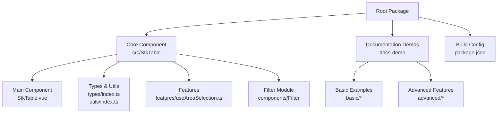
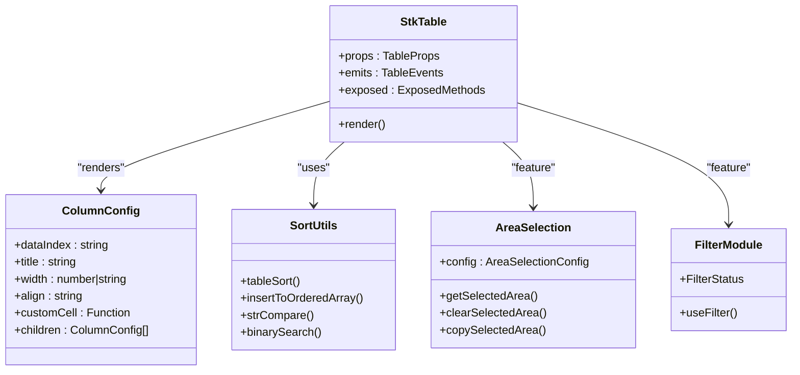
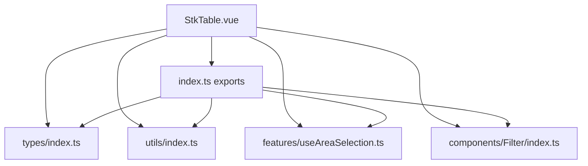

# AI Usage Guide

<cite>
**Referenced Files in This Document**
- [AI_USAGE_GUIDE.md](file://AI_USAGE_GUIDE.md)
- [README.md](file://README.md)
- [package.json](file://package.json)
- [src/StkTable/index.ts](file://src/StkTable/index.ts)
- [src/StkTable/StkTable.vue](file://src/StkTable/StkTable.vue)
- [src/StkTable/types/index.ts](file://src/StkTable/types/index.ts)
- [src/StkTable/utils/index.ts](file://src/StkTable/utils/index.ts)
- [src/StkTable/features/useAreaSelection.ts](file://src/StkTable/features/useAreaSelection.ts)
- [src/StkTable/components/Filter/index.ts](file://src/StkTable/components/Filter/index.ts)
- [docs-demo/StkTable.vue](file://docs-demo/StkTable.vue)
- [docs-demo/basic/Basic.vue](file://docs-demo/basic/Basic.vue)
- [docs-demo/advanced/virtual/VirtualY.vue](file://docs-demo/advanced/virtual/VirtualY.vue)
- [docs-demo/advanced/column-resize/ColResizable.vue](file://docs-demo/advanced/column-resize/ColResizable.vue)
</cite>

## Table of Contents
1. [Introduction](#introduction)
2. [Project Structure](#project-structure)
3. [Core Components](#core-components)
4. [Architecture Overview](#architecture-overview)
5. [Detailed Component Analysis](#detailed-component-analysis)
6. [Dependency Analysis](#dependency-analysis)
7. [Performance Considerations](#performance-considerations)
8. [Troubleshooting Guide](#troubleshooting-guide)
9. [Conclusion](#conclusion)

## Introduction
This AI Usage Guide is designed to help AI coding assistants understand and generate StkTable Vue component code effectively. StkTable is a high-performance virtual scrolling table component supporting Vue 3 and Vue 2.7, featuring advanced capabilities like sorting, filtering, area selection, tree data, and customizable rendering.

The guide consolidates installation, API reference, type definitions, practical usage patterns, and integration examples to streamline development workflows.

## Project Structure
The repository is organized into several key areas:
- Core component implementation under src/StkTable
- Documentation and demos under docs-demo and docs-src
- Build and packaging configuration in package.json
- Feature modules for area selection and filtering
- Demo showcases for common usage patterns

**Diagram sources**
- [src/StkTable/StkTable.vue](file://src/StkTable/StkTable.vue)
- [src/StkTable/types/index.ts](file://src/StkTable/types/index.ts)
- [src/StkTable/utils/index.ts](file://src/StkTable/utils/index.ts)
- [src/StkTable/features/useAreaSelection.ts](file://src/StkTable/features/useAreaSelection.ts)
- [src/StkTable/components/Filter/index.ts](file://src/StkTable/components/Filter/index.ts)
- [docs-demo/basic/Basic.vue](file://docs-demo/basic/Basic.vue)
- [docs-demo/advanced/virtual/VirtualY.vue](file://docs-demo/advanced/virtual/VirtualY.vue)
- [docs-demo/advanced/column-resize/ColResizable.vue](file://docs-demo/advanced/column-resize/ColResizable.vue)

**Section sources**
- [package.json](file://package.json)
- [src/StkTable/index.ts](file://src/StkTable/index.ts)

## Core Components
This section outlines the primary building blocks of StkTable and how they work together.

- StkTable main component: Provides the table rendering engine with virtual scrolling, sorting, filtering, and interactive features.
- Types and utilities: Define column configurations, sort states, and helper functions for sorting and array manipulation.
- Feature modules: Encapsulate advanced capabilities like area selection and filtering.
- Exported APIs: Public exports for component, utilities, and feature registration.

Key exports and their roles:
- Component: StkTable
- Utilities: tableSort, insertToOrderedArray, strCompare, binarySearch
- Features: useAreaSelection, registerFeature
- Filter: useFilter
- Types: StkTableColumn, SortState, SortConfig, SortOption, Order

**Section sources**
- [src/StkTable/index.ts](file://src/StkTable/index.ts)
- [src/StkTable/types/index.ts](file://src/StkTable/types/index.ts)
- [src/StkTable/utils/index.ts](file://src/StkTable/utils/index.ts)
- [src/StkTable/features/useAreaSelection.ts](file://src/StkTable/features/useAreaSelection.ts)
- [src/StkTable/components/Filter/index.ts](file://src/StkTable/components/Filter/index.ts)

## Architecture Overview
The StkTable architecture centers around a modular design:
- Central component orchestrating rendering and interactions
- Feature modules injected via registerFeature
- Utility functions supporting sorting and data manipulation
- Type-safe column configuration enabling flexible rendering

**Diagram sources**
- [src/StkTable/StkTable.vue](file://src/StkTable/StkTable.vue)
- [src/StkTable/types/index.ts](file://src/StkTable/types/index.ts)
- [src/StkTable/utils/index.ts](file://src/StkTable/utils/index.ts)
- [src/StkTable/features/useAreaSelection.ts](file://src/StkTable/features/useAreaSelection.ts)
- [src/StkTable/components/Filter/index.ts](file://src/StkTable/components/Filter/index.ts)

## Detailed Component Analysis

### StkTable Main Component
The main component manages rendering, virtual scrolling, events, and feature integration. It exposes a rich API for programmatic control and supports extensive customization through props, slots, and events.

Key aspects:
- Props: Width, theme, borders, overflow handling, virtual scrolling, fixed columns, sorting, area selection, drag-and-drop, and more.
- Events: Comprehensive event coverage for clicks, sorting, scrolling, resizing, and selection changes.
- Slots: Custom header, empty state, expandable rows, and custom bottom area.
- Exposed methods: Initialization, selection, highlighting, sorting, filtering, and navigation helpers.

Practical usage patterns:
- Basic table with row keys and columns
- Virtual scrolling with fixed height containers
- Sorting with local or remote strategies
- Area selection with keyboard and mouse
- Custom cell rendering using render functions

**Section sources**
- [src/StkTable/StkTable.vue](file://src/StkTable/StkTable.vue)
- [docs-demo/basic/Basic.vue](file://docs-demo/basic/Basic.vue)
- [docs-demo/advanced/virtual/VirtualY.vue](file://docs-demo/advanced/virtual/VirtualY.vue)

### Column Configuration (StkTableColumn<T>)
Column configuration defines how data is presented and interacted with. It supports:
- Basic properties: dataIndex, title, key, type (seq, expand, dragRow, tree-node)
- Sizing: width, minWidth, maxWidth
- Alignment: cell and header alignment
- Styling: className and headerClassName
- Sorting: sorter, sortField, sortType, sortConfig
- Fixed columns: left/right
- Custom rendering: customCell, customHeaderCell, customFooterCell
- Nested headers: children
- Cell merging: mergeCells

Special column types:
- seq: renders sequential numbering
- expand: renders expand/collapse controls
- dragRow: renders draggable handle
- tree-node: renders tree node with expand/collapse

**Section sources**
- [src/StkTable/types/index.ts](file://src/StkTable/types/index.ts)
- [AI_USAGE_GUIDE.md](file://AI_USAGE_GUIDE.md)

### Sorting and Utilities
Sorting utilities enable robust data ordering:
- tableSort: sorts arrays locally with configurable strategies
- insertToOrderedArray: inserts items into sorted arrays efficiently
- strCompare: compares strings with optional locale support
- binarySearch: performs efficient binary search

Sort configuration supports:
- defaultSort, emptyToBottom, stringLocaleCompare, sortChildren
- multiSort and multiSortLimit for compound sorting

**Section sources**
- [src/StkTable/utils/index.ts](file://src/StkTable/utils/index.ts)
- [src/StkTable/types/index.ts](file://src/StkTable/types/index.ts)

### Area Selection Feature
The area selection feature provides:
- Mouse drag selection with automatic scrolling near edges
- Keyboard navigation (arrow keys, Tab, Shift+Tab)
- Copy-to-clipboard functionality with custom formatting
- Programmatic access to selected ranges and data

Integration:
- Register the feature using registerFeature
- Enable via areaSelection prop
- Access via exposed methods: getSelectedArea, clearSelectedArea, copySelectedArea

**Section sources**
- [src/StkTable/features/useAreaSelection.ts](file://src/StkTable/features/useAreaSelection.ts)
- [src/StkTable/StkTable.vue](file://src/StkTable/StkTable.vue)
- [docs-demo/StkTable.vue](file://docs-demo/StkTable.vue)

### Filter Module
The filter module provides:
- useFilter hook for reactive filter state
- FilterStatus type for filter state representation
- Optional integration with column configurations

**Section sources**
- [src/StkTable/components/Filter/index.ts](file://src/StkTable/components/Filter/index.ts)
- [src/StkTable/types/index.ts](file://src/StkTable/types/index.ts)

### Practical Usage Patterns
Common scenarios and templates:
- Virtual scrolling with fixed height containers
- Horizontal and vertical virtual scrolling
- Sorting with single or multiple columns
- Fixed columns with shadows
- Custom cell rendering using render functions
- Tree data with expandable nodes
- Row expansion with custom slots
- Column resizing with v-model:columns
- Highlighting cells and rows
- Area selection with keyboard and mouse
- Multi-level headers
- Merged cells
- Dark theme usage
- Custom empty state
- Remote sorting with server-side data updates

**Section sources**
- [AI_USAGE_GUIDE.md](file://AI_USAGE_GUIDE.md)
- [docs-demo/advanced/virtual/VirtualY.vue](file://docs-demo/advanced/virtual/VirtualY.vue)
- [docs-demo/advanced/column-resize/ColResizable.vue](file://docs-demo/advanced/column-resize/ColResizable.vue)

## Dependency Analysis
The component relies on internal modules and Vue reactivity primitives. Dependencies are structured to minimize coupling and maximize modularity.

**Diagram sources**
- [src/StkTable/StkTable.vue](file://src/StkTable/StkTable.vue)
- [src/StkTable/types/index.ts](file://src/StkTable/types/index.ts)
- [src/StkTable/utils/index.ts](file://src/StkTable/utils/index.ts)
- [src/StkTable/features/useAreaSelection.ts](file://src/StkTable/features/useAreaSelection.ts)
- [src/StkTable/components/Filter/index.ts](file://src/StkTable/components/Filter/index.ts)
- [src/StkTable/index.ts](file://src/StkTable/index.ts)

**Section sources**
- [src/StkTable/index.ts](file://src/StkTable/index.ts)
- [src/StkTable/StkTable.vue](file://src/StkTable/StkTable.vue)

## Performance Considerations
- Virtual scrolling requires a fixed-height parent container to compute visible regions accurately.
- Horizontal virtual scrolling mandates explicit column widths for proper layout.
- Column resizing and header dragging require v-model:columns binding to update column metadata reactively.
- Prefer rowKey for optimal performance across selection, highlighting, and updates.
- Use customCell with Vue's h() function for efficient rendering; avoid heavy computations inside render functions.
- For large datasets, leverage virtual props and limit unnecessary re-renders by stabilizing data references.

[No sources needed since this section provides general guidance]

## Troubleshooting Guide
Common issues and resolutions:
- Virtual scrolling not working: Ensure the parent container has a fixed height.
- Horizontal virtual scrolling misalignment: Verify all columns have explicit widths.
- Column resizing not updating: Confirm v-model:columns is bound and columns are reactive.
- Missing rowKey warnings: Provide a stable rowKey to enable selection and highlighting features.
- Custom cell rendering not updating: Use functional components or ensure reactive props are passed correctly.
- Sorting not applied: For remote sorting, handle sort-change and update dataSource accordingly.
- Fixed columns not visible: Set column widths and consider fixedColShadow for visual cues.

**Section sources**
- [AI_USAGE_GUIDE.md](file://AI_USAGE_GUIDE.md)
- [src/StkTable/StkTable.vue](file://src/StkTable/StkTable.vue)

## Conclusion
This guide provides a comprehensive foundation for developing with StkTable. By leveraging the documented APIs, types, and patterns, developers can build performant, feature-rich tables tailored to diverse use cases. The modular architecture and extensive customization options make StkTable suitable for both simple and complex data presentation needs.