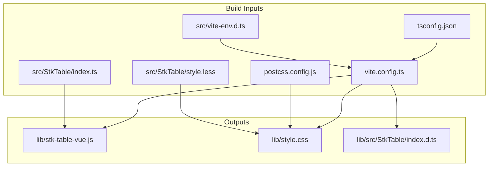
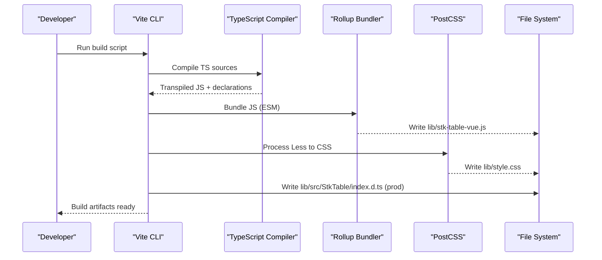
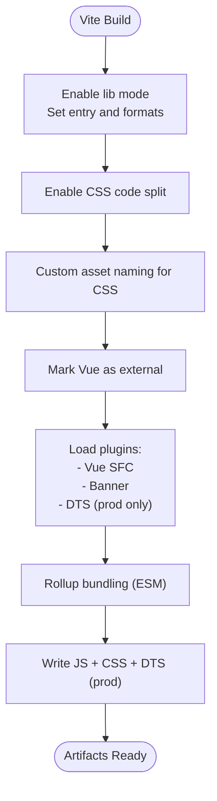
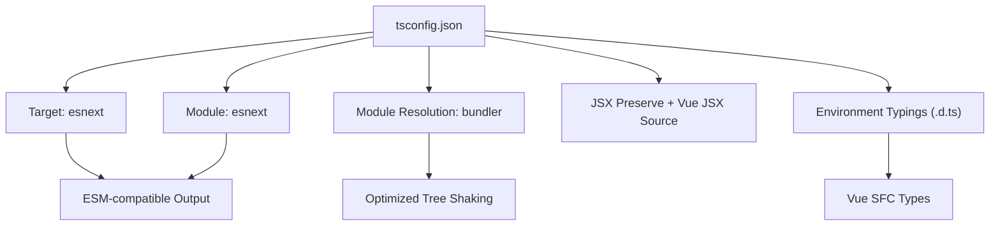
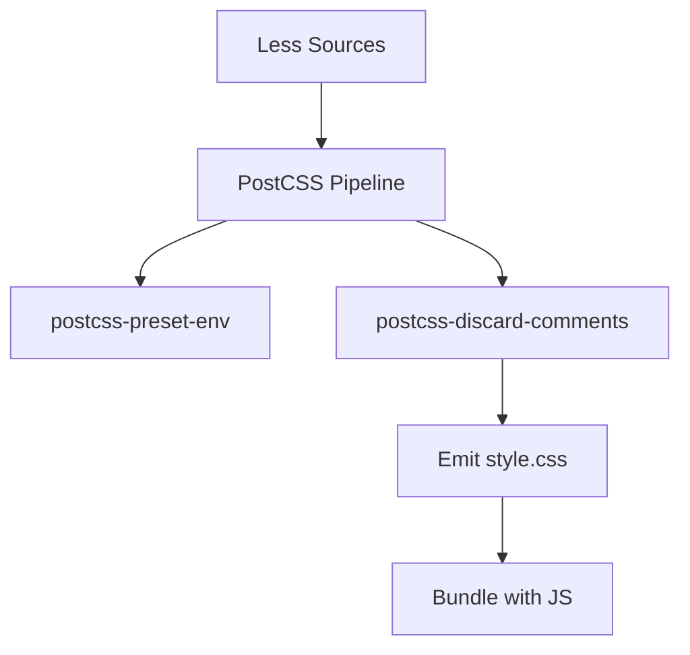
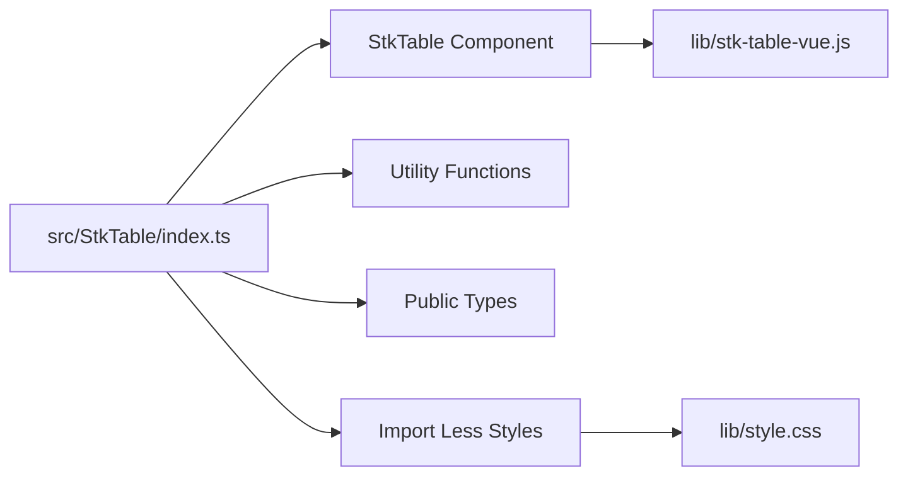
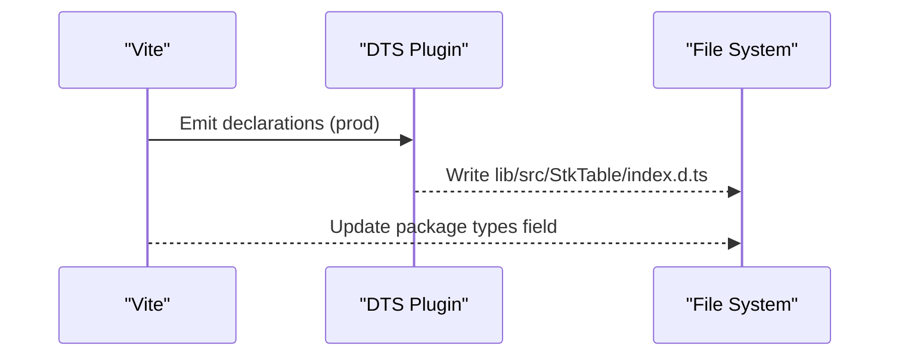
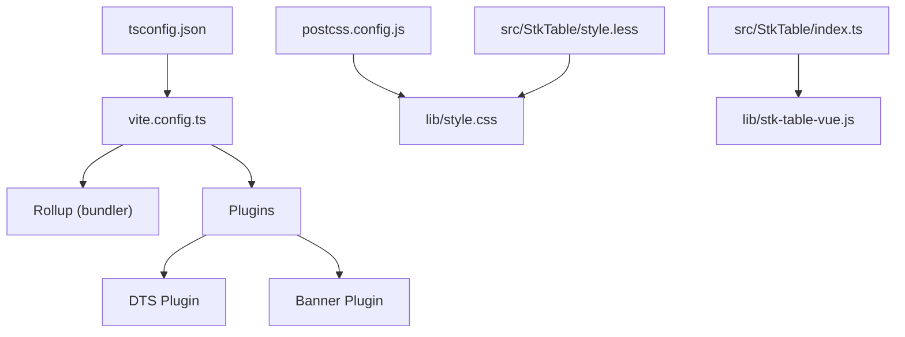

# Build System Configuration

<cite>
**Referenced Files in This Document**
- [package.json](file://package.json)
- [vite.config.ts](file://vite.config.ts)
- [tsconfig.json](file://tsconfig.json)
- [postcss.config.js](file://postcss.config.js)
- [jsconfig.json](file://jsconfig.json)
- [src/vite-env.d.ts](file://src/vite-env.d.ts)
- [src/StkTable/index.ts](file://src/StkTable/index.ts)
- [src/StkTable/style.less](file://src/StkTable/style.less)
- [src/StkTable/types/index.ts](file://src/StkTable/types/index.ts)
- [src/StkTable/utils/index.ts](file://src/StkTable/utils/index.ts)
- [lib/src/StkTable/index.d.ts](file://lib/src/StkTable/index.d.ts)
- [lib/stk-table-vue.js](file://lib/stk-table-vue.js)
- [lib/style.css](file://lib/style.css)
</cite>

## Table of Contents
1. [Introduction](#introduction)
2. [Project Structure](#project-structure)
3. [Core Components](#core-components)
4. [Architecture Overview](#architecture-overview)
5. [Detailed Component Analysis](#detailed-component-analysis)
6. [Dependency Analysis](#dependency-analysis)
7. [Performance Considerations](#performance-considerations)
8. [Troubleshooting Guide](#troubleshooting-guide)
9. [Conclusion](#conclusion)

## Introduction
This document explains the build system configuration for the project, focusing on Vite setup, TypeScript compilation, CSS preprocessing and bundling, and production optimization strategies. It covers library build configuration, entry points, output formats, asset handling, TypeScript configuration for ESM modules, declaration file generation, PostCSS configuration, and practical guidance for webpack and Rollup alternatives. It also includes performance optimization techniques such as tree shaking, bundle analysis, and production tuning.

## Project Structure
The build system centers around Vite for development and library builds, TypeScript for type-safe compilation, and PostCSS for CSS preprocessing. Key configuration files and outputs are organized as follows:
- Vite configuration defines library mode, entry points, output formats, CSS code splitting, and asset naming.
- TypeScript configuration targets modern JavaScript environments and enables bundler module resolution.
- PostCSS configuration applies preset-env and comment discarding for cross-browser compatibility and clean CSS.
- The library output consists of an ES module bundle and a single bundled CSS file.

**Diagram sources**
- [vite.config.ts](file://vite.config.ts#L1-L66)
- [tsconfig.json](file://tsconfig.json#L1-L39)
- [postcss.config.js](file://postcss.config.js#L1-L7)
- [src/vite-env.d.ts](file://src/vite-env.d.ts#L1-L11)
- [src/StkTable/index.ts](file://src/StkTable/index.ts#L1-L5)
- [src/StkTable/style.less](file://src/StkTable/style.less#L1-L690)
- [lib/stk-table-vue.js](file://lib/stk-table-vue.js#L1-L800)
- [lib/style.css](file://lib/style.css#L1-L511)
- [lib/src/StkTable/index.d.ts](file://lib/src/StkTable/index.d.ts#L1-L4)

**Section sources**
- [package.json](file://package.json#L1-L76)
- [vite.config.ts](file://vite.config.ts#L1-L66)
- [tsconfig.json](file://tsconfig.json#L1-L39)
- [postcss.config.js](file://postcss.config.js#L1-L7)
- [src/vite-env.d.ts](file://src/vite-env.d.ts#L1-L11)
- [src/StkTable/index.ts](file://src/StkTable/index.ts#L1-L5)
- [src/StkTable/style.less](file://src/StkTable/style.less#L1-L690)
- [lib/stk-table-vue.js](file://lib/stk-table-vue.js#L1-L800)
- [lib/style.css](file://lib/style.css#L1-L511)
- [lib/src/StkTable/index.d.ts](file://lib/src/StkTable/index.d.ts#L1-L4)

## Core Components
- Vite Library Build
  - Entry point: a single TypeScript module exporting the primary component and utilities.
  - Output format: ES module.
  - CSS handling: CSS extracted into a single bundled stylesheet with custom asset naming.
  - External dependencies: Vue is treated as external to avoid bundling framework code.
  - Plugins: Vue SFC support, banner metadata, and declaration generation in production.
- TypeScript Configuration
  - Targets modern JS environments with ESM semantics.
  - Uses bundler module resolution for optimal tree shaking.
  - Includes Vue SFC typings via a dedicated environment declaration.
- PostCSS Configuration
  - Applies postcss-preset-env for modern CSS features and cross-browser compatibility.
  - Discards comments to reduce CSS size.
- Package Metadata
  - Defines the main entry for Node environments and the types location for consumers.

**Section sources**
- [vite.config.ts](file://vite.config.ts#L10-L33)
- [tsconfig.json](file://tsconfig.json#L1-L39)
- [postcss.config.js](file://postcss.config.js#L1-L7)
- [package.json](file://package.json#L5-L6)
- [src/vite-env.d.ts](file://src/vite-env.d.ts#L1-L11)

## Architecture Overview
The build pipeline transforms TypeScript sources and Less styles into a distributable ES module bundle and a single CSS file. Vite orchestrates the process, leveraging Rollup under the hood for bundling. Declarations are generated during production builds to support TypeScript consumers.

**Diagram sources**
- [vite.config.ts](file://vite.config.ts#L1-L66)
- [tsconfig.json](file://tsconfig.json#L1-L39)
- [postcss.config.js](file://postcss.config.js#L1-L7)
- [lib/stk-table-vue.js](file://lib/stk-table-vue.js#L1-L800)
- [lib/style.css](file://lib/style.css#L1-L511)
- [lib/src/StkTable/index.d.ts](file://lib/src/StkTable/index.d.ts#L1-L4)

## Detailed Component Analysis

### Vite Configuration for Library Builds
Key aspects:
- Library mode with a single entry exporting the component and utilities.
- Output format configured as ES module.
- Vue plugin enabled for SFC support.
- CSS code splitting enabled to extract styles into a separate file.
- Asset naming customized so CSS bundles use a consistent filename.
- Externalization of Vue to keep the bundle lean and compatible with consumer frameworks.
- Banner plugin injects metadata into outputs.
- Declaration generation runs only in production to avoid unnecessary work in development.

**Diagram sources**
- [vite.config.ts](file://vite.config.ts#L10-L33)
- [vite.config.ts](file://vite.config.ts#L40-L65)

**Section sources**
- [vite.config.ts](file://vite.config.ts#L10-L33)
- [vite.config.ts](file://vite.config.ts#L40-L65)

### TypeScript Configuration for ESM Modules and Declarations
Highlights:
- Targets modern JS environments suitable for ESM consumption.
- Uses bundler module resolution to preserve static imports for tree shaking.
- Enables JSX preservation and Vue JSX source configuration.
- Includes Vue SFC typings via a dedicated environment declaration.
- Paths mapping simplifies imports within the project.

**Diagram sources**
- [tsconfig.json](file://tsconfig.json#L1-L39)
- [src/vite-env.d.ts](file://src/vite-env.d.ts#L1-L11)

**Section sources**
- [tsconfig.json](file://tsconfig.json#L1-L39)
- [src/vite-env.d.ts](file://src/vite-env.d.ts#L1-L11)

### PostCSS Configuration, CSS Preprocessing, and Style Bundling
- PostCSS preset-env compiles modern CSS features to broader browser support.
- Comments are discarded to minimize CSS size.
- Styles are bundled from Less sources into a single CSS file named consistently.
- The CSS file is emitted alongside the JS bundle and imported automatically by consumers.

**Diagram sources**
- [postcss.config.js](file://postcss.config.js#L1-L7)
- [src/StkTable/style.less](file://src/StkTable/style.less#L1-L690)
- [lib/style.css](file://lib/style.css#L1-L511)

**Section sources**
- [postcss.config.js](file://postcss.config.js#L1-L7)
- [src/StkTable/style.less](file://src/StkTable/style.less#L1-L690)
- [lib/style.css](file://lib/style.css#L1-L511)

### Entry Points and Exports
- Library entry exports the primary component, utility functions, and public types.
- The Less file is imported at the module level to ensure styles are included in the build.
- Consumers receive a single ES module with a bundled CSS asset.

**Diagram sources**
- [src/StkTable/index.ts](file://src/StkTable/index.ts#L1-L5)
- [src/StkTable/style.less](file://src/StkTable/style.less#L1-L690)
- [lib/stk-table-vue.js](file://lib/stk-table-vue.js#L1-L800)
- [lib/style.css](file://lib/style.css#L1-L511)

**Section sources**
- [src/StkTable/index.ts](file://src/StkTable/index.ts#L1-L5)
- [src/StkTable/style.less](file://src/StkTable/style.less#L1-L690)

### Type Checking and Declaration Generation
- Declarations are generated during production builds using the DTS plugin.
- The package exposes a types field pointing to the generated declaration file for consumers.
- Utility and type modules are exported for precise typing of public APIs.

**Diagram sources**
- [vite.config.ts](file://vite.config.ts#L54-L54)
- [lib/src/StkTable/index.d.ts](file://lib/src/StkTable/index.d.ts#L1-L4)
- [package.json](file://package.json#L6-L6)

**Section sources**
- [vite.config.ts](file://vite.config.ts#L54-L54)
- [lib/src/StkTable/index.d.ts](file://lib/src/StkTable/index.d.ts#L1-L4)
- [package.json](file://package.json#L6-L6)

### Webpack Alternatives and Rollup Setup
While the project uses Vite, the same library distribution goals can be achieved with:
- Webpack: Configure entry to the main module, output for ES modules, CSS extraction plugin, and externals for Vue. Use tree shaking by enabling production mode and proper module flags.
- Rollup: Use the TypeScript plugin for transpilation, Vue plugin for SFCs, and a CSS plugin to extract styles. Set external for Vue and configure output format to ESM. Apply terser for minification and ensure minimal chunking for a single JS/CSS bundle.

[No sources needed since this section provides general guidance]

### Optimization Techniques for Production Builds
- Tree shaking: Use ESM imports and bundler module resolution to enable dead-code elimination.
- Minification: Enable minification in Vite for production builds to reduce bundle size.
- CSS optimization: PostCSS preset-env and comment discarding reduce CSS size and improve compatibility.
- Asset naming: Consistent CSS filenames simplify caching and CDN delivery.
- External dependencies: Mark Vue as external to avoid bundling and leverage consumer versions.

**Section sources**
- [vite.config.ts](file://vite.config.ts#L11-L11)
- [vite.config.ts](file://vite.config.ts#L19-L19)
- [postcss.config.js](file://postcss.config.js#L1-L7)

## Dependency Analysis
The build system exhibits low internal coupling and clear separation of concerns:
- Vite orchestrates bundling and plugin execution.
- TypeScript handles transpilation and declaration emission.
- PostCSS processes styles independently.
- The library entry aggregates component, utilities, and styles.

**Diagram sources**
- [vite.config.ts](file://vite.config.ts#L1-L66)
- [tsconfig.json](file://tsconfig.json#L1-L39)
- [postcss.config.js](file://postcss.config.js#L1-L7)
- [src/StkTable/index.ts](file://src/StkTable/index.ts#L1-L5)
- [src/StkTable/style.less](file://src/StkTable/style.less#L1-L690)
- [lib/stk-table-vue.js](file://lib/stk-table-vue.js#L1-L800)
- [lib/style.css](file://lib/style.css#L1-L511)

**Section sources**
- [vite.config.ts](file://vite.config.ts#L1-L66)
- [tsconfig.json](file://tsconfig.json#L1-L39)
- [postcss.config.js](file://postcss.config.js#L1-L7)
- [src/StkTable/index.ts](file://src/StkTable/index.ts#L1-L5)
- [src/StkTable/style.less](file://src/StkTable/style.less#L1-L690)

## Performance Considerations
- Prefer ESM modules and bundler module resolution to maximize tree shaking.
- Keep Vue as external to avoid duplication and leverage consumer framework versions.
- Use CSS code splitting and consistent asset naming for efficient caching.
- Minimize runtime code by avoiding heavy polyfills; rely on PostCSS preset-env for compatibility.
- Monitor bundle sizes and analyze chunks to identify oversized dependencies.

[No sources needed since this section provides general guidance]

## Troubleshooting Guide
Common issues and resolutions:
- Missing Vue types in development: Ensure the environment declaration is present and loaded by the TypeScript compiler.
- CSS not applied in consumers: Verify the CSS file is bundled and imported alongside the JS bundle.
- Incorrect module resolution: Confirm bundler module resolution is used to preserve static imports.
- Excess bundle size: Review externalized dependencies and enable minification for production builds.

**Section sources**
- [src/vite-env.d.ts](file://src/vite-env.d.ts#L1-L11)
- [vite.config.ts](file://vite.config.ts#L19-L19)
- [vite.config.ts](file://vite.config.ts#L11-L11)

## Conclusion
The project’s build system leverages Vite for efficient library builds, TypeScript for robust type safety, and PostCSS for modern CSS workflows. By configuring library mode, externalizing Vue, generating declarations in production, and bundling styles into a single CSS asset, the system delivers a compact, tree-shakeable ES module suitable for diverse consumer environments. Adopting the recommended optimization techniques ensures maintainable and performant distributions.