# Ecosystem Integration

<cite>
**Referenced Files in This Document**
- [package.json](file://package.json)
- [README.md](file://README.md)
- [vite.config.ts](file://vite.config.ts)
- [src/StkTable/index.ts](file://src/StkTable/index.ts)
- [src/StkTable/StkTable.vue](file://src/StkTable/StkTable.vue)
- [src/StkTable/types/index.ts](file://src/StkTable/types/index.ts)
- [src/StkTable/utils/index.ts](file://src/StkTable/utils/index.ts)
- [docs-demo/hooks/useI18n/index.ts](file://docs-demo/hooks/useI18n/index.ts)
- [docs-demo/hooks/useI18n/en.ts](file://docs-demo/hooks/useI18n/en.ts)
- [docs-demo/hooks/useI18n/zh.ts](file://docs-demo/hooks/useI18n/zh.ts)
- [docs-demo/advanced/custom-cell/CustomCell/index.vue](file://docs-demo/advanced/custom-cell/CustomCell/index.vue)
- [docs-demo/advanced/virtual/VirtualY.vue](file://docs-demo/advanced/virtual/VirtualY.vue)
- [docs-demo/advanced/column-resize/ColResizable.vue](file://docs-demo/advanced/column-resize/ColResizable.vue)
- [test/StkTableSimple.vue](file://test/StkTableSimple.vue)
</cite>

## Table of Contents
1. [Introduction](#introduction)
2. [Project Structure](#project-structure)
3. [Core Components](#core-components)
4. [Architecture Overview](#architecture-overview)
5. [Detailed Component Analysis](#detailed-component-analysis)
6. [Dependency Analysis](#dependency-analysis)
7. [Performance Considerations](#performance-considerations)
8. [Troubleshooting Guide](#troubleshooting-guide)
9. [Conclusion](#conclusion)
10. [Appendices](#appendices)

## Introduction
This document provides comprehensive ecosystem integration guidance for Stk Table Vue, focusing on how to integrate with popular Vue ecosystem packages, state management systems, routing, internationalization, form libraries, validation systems, data fetching libraries, UI component libraries, charting tools, testing frameworks, linting tools, and development workflows. It also covers SSR considerations for Nuxt.js and server-side rendering.

## Project Structure
The repository is organized into:
- Library source under src/StkTable
- Documentation demos under docs-demo
- Documentation site under docs-src
- Tests under test
- Build and tooling configuration under vite.config.ts and package.json

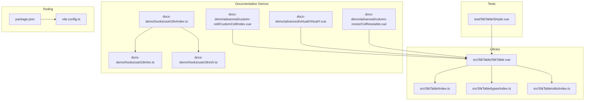

**Diagram sources**
- [src/StkTable/StkTable.vue](file://src/StkTable/StkTable.vue#L1-L200)
- [src/StkTable/index.ts](file://src/StkTable/index.ts#L1-L5)
- [src/StkTable/types/index.ts](file://src/StkTable/types/index.ts#L1-L120)
- [src/StkTable/utils/index.ts](file://src/StkTable/utils/index.ts#L1-L120)
- [docs-demo/advanced/custom-cell/CustomCell/index.vue](file://docs-demo/advanced/custom-cell/CustomCell/index.vue#L1-L24)
- [docs-demo/advanced/virtual/VirtualY.vue](file://docs-demo/advanced/virtual/VirtualY.vue#L1-L34)
- [docs-demo/advanced/column-resize/ColResizable.vue](file://docs-demo/advanced/column-resize/ColResizable.vue#L1-L46)
- [docs-demo/hooks/useI18n/index.ts](file://docs-demo/hooks/useI18n/index.ts#L1-L41)
- [docs-demo/hooks/useI18n/en.ts](file://docs-demo/hooks/useI18n/en.ts#L1-L128)
- [docs-demo/hooks/useI18n/zh.ts](file://docs-demo/hooks/useI18n/zh.ts#L1-L140)
- [test/StkTableSimple.vue](file://test/StkTableSimple.vue#L1-L55)
- [package.json](file://package.json#L1-L76)
- [vite.config.ts](file://vite.config.ts#L1-L66)

**Section sources**
- [package.json](file://package.json#L1-L76)
- [vite.config.ts](file://vite.config.ts#L1-L66)

## Core Components
- StkTable component: A high-performance virtual table supporting virtual scrolling, resizable columns, sorting, selection, and custom cells.
- Types and utilities: Strongly typed column definitions, sort helpers, and shared utilities for integration patterns.
- Demo integrations: Examples showing custom cells, virtual scrolling, and resizable columns.

Integration highlights:
- Props and events: Comprehensive props for configuration and rich emitted events for stateful integrations.
- Slots and custom cells: Extensible via slots and customCell/customHeaderCell for UI component library integration.
- Sorting utilities: Standalone tableSort and related helpers for server-side or centralized sorting.

**Section sources**
- [src/StkTable/StkTable.vue](file://src/StkTable/StkTable.vue#L278-L476)
- [src/StkTable/types/index.ts](file://src/StkTable/types/index.ts#L54-L120)
- [src/StkTable/utils/index.ts](file://src/StkTable/utils/index.ts#L153-L207)
- [src/StkTable/index.ts](file://src/StkTable/index.ts#L1-L5)

## Architecture Overview
Stk Table Vue exposes a single component with optional utilities. Consumers integrate by passing data and configuration props, listening to emitted events, and leveraging slots/custom cells for UI composition.

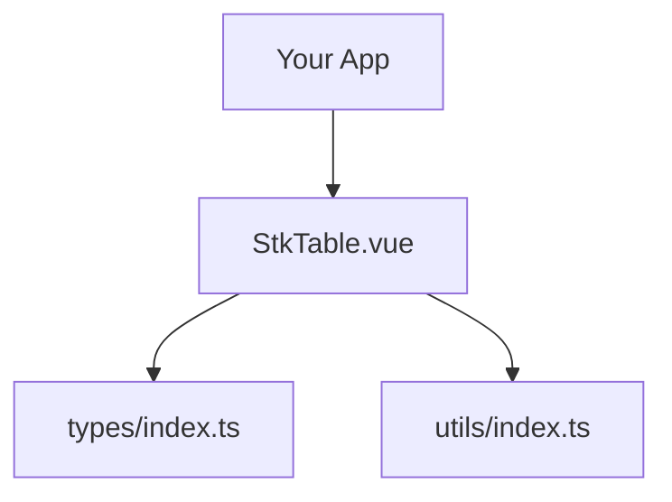

**Diagram sources**
- [src/StkTable/StkTable.vue](file://src/StkTable/StkTable.vue#L209-L267)
- [src/StkTable/types/index.ts](file://src/StkTable/types/index.ts#L1-L120)
- [src/StkTable/utils/index.ts](file://src/StkTable/utils/index.ts#L1-L120)

## Detailed Component Analysis

### StkTable Component Integration Patterns
- Props-driven configuration: Configure virtual scrolling, borders, themes, and selection behavior via props.
- Events for state synchronization: Use emitted events to propagate state changes to external stores or services.
- Slots and custom cells: Render UI components from external libraries inside customCell/customHeaderCell.

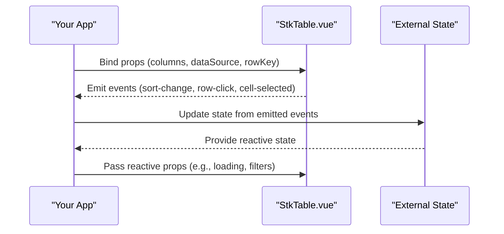

**Diagram sources**
- [src/StkTable/StkTable.vue](file://src/StkTable/StkTable.vue#L478-L621)

**Section sources**
- [src/StkTable/StkTable.vue](file://src/StkTable/StkTable.vue#L278-L476)
- [src/StkTable/StkTable.vue](file://src/StkTable/StkTable.vue#L478-L621)

### Internationalization Integration (Vue I18n)
The project includes a lightweight i18n hook that reads the current locale and resolves translations. This pattern can be adapted to work with Vue I18n or other i18n ecosystems.

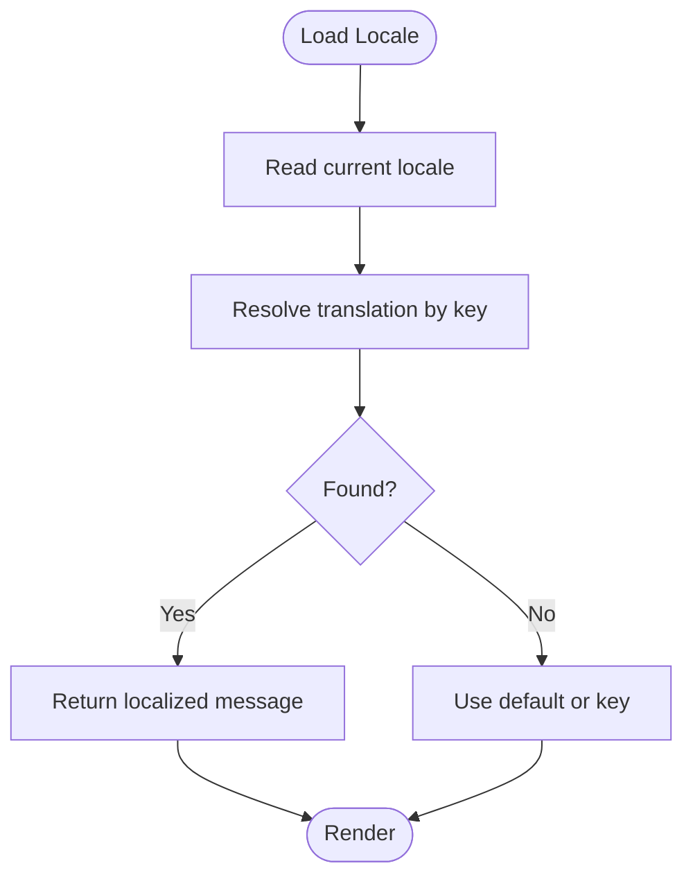

**Diagram sources**
- [docs-demo/hooks/useI18n/index.ts](file://docs-demo/hooks/useI18n/index.ts#L14-L40)
- [docs-demo/hooks/useI18n/en.ts](file://docs-demo/hooks/useI18n/en.ts#L1-L128)
- [docs-demo/hooks/useI18n/zh.ts](file://docs-demo/hooks/useI18n/zh.ts#L1-L140)

**Section sources**
- [docs-demo/hooks/useI18n/index.ts](file://docs-demo/hooks/useI18n/index.ts#L1-L41)
- [docs-demo/hooks/useI18n/en.ts](file://docs-demo/hooks/useI18n/en.ts#L1-L128)
- [docs-demo/hooks/useI18n/zh.ts](file://docs-demo/hooks/useI18n/zh.ts#L1-L140)

### State Management Integration (Vuex/Pinia)
Recommended patterns:
- Centralized state: Keep columns, filters, pagination, and sort state in a store.
- Event-to-action mapping: On sort-change and selection events, dispatch actions to update the store.
- Reactive props: Pass store-derived props to StkTable (e.g., loading indicators, filtered data).
- Utilities: Use tableSort and related helpers for deterministic client-side sorting or pass sorted data from the server.

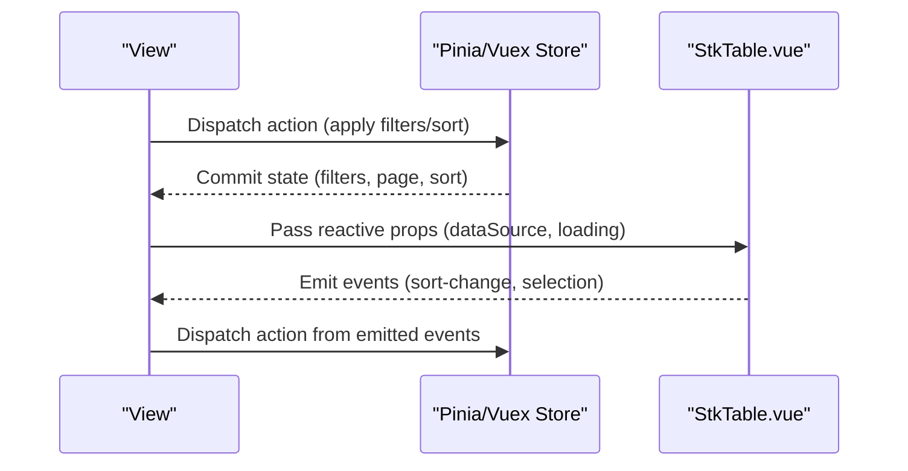

**Diagram sources**
- [src/StkTable/StkTable.vue](file://src/StkTable/StkTable.vue#L478-L621)
- [src/StkTable/utils/index.ts](file://src/StkTable/utils/index.ts#L153-L207)

**Section sources**
- [src/StkTable/StkTable.vue](file://src/StkTable/StkTable.vue#L478-L621)
- [src/StkTable/utils/index.ts](file://src/StkTable/utils/index.ts#L153-L207)

### Routing Integration (Vue Router)
- Navigation guards: Use guards to load initial table state (filters, sort) from route params/query.
- Route synchronization: Update route query params when sort-change or selection changes occur.
- Lazy loading: Defer heavy data loads until after navigation completes.

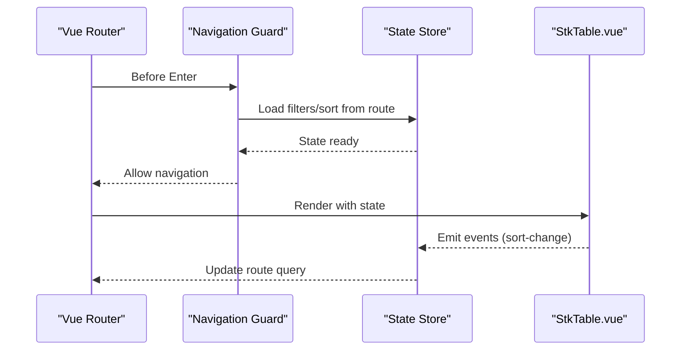

**Diagram sources**
- [src/StkTable/StkTable.vue](file://src/StkTable/StkTable.vue#L478-L621)

**Section sources**
- [src/StkTable/StkTable.vue](file://src/StkTable/StkTable.vue#L478-L621)

### Form Libraries Integration (Reactivity Forms and Vuelidate)
Patterns:
- Reactive forms: Bind form controls to store state; on submit, compute derived columns/dataSource and pass to StkTable.
- Validation: Use Vuelidate rules to validate form inputs; on valid submission, trigger data fetch/update and refresh table state.
- Custom cells: Render form controls inside customCell for inline editing scenarios.

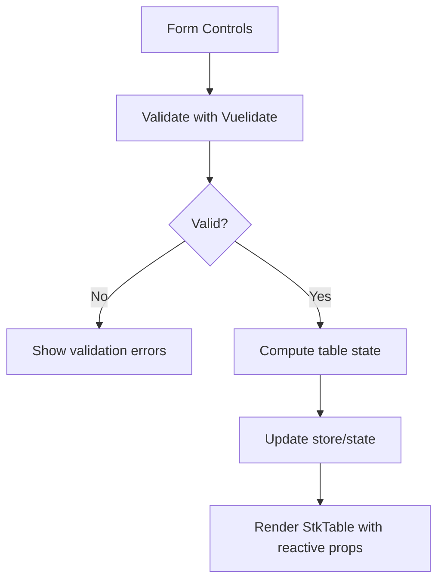

**Diagram sources**
- [docs-demo/advanced/custom-cell/CustomCell/index.vue](file://docs-demo/advanced/custom-cell/CustomCell/index.vue#L1-L24)

**Section sources**
- [docs-demo/advanced/custom-cell/CustomCell/index.vue](file://docs-demo/advanced/custom-cell/CustomCell/index.vue#L1-L24)

### Data Fetching Integration
- Composition API: Use onMounted and watchers to fetch data; pass loading state via props.
- Error boundaries: Surface errors via slots or global error handlers.
- Sorting and filtering: Apply client-side transformations using tableSort or delegate to server APIs.

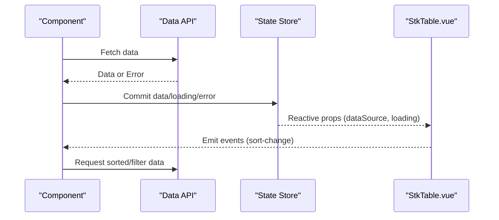

**Diagram sources**
- [src/StkTable/utils/index.ts](file://src/StkTable/utils/index.ts#L153-L207)
- [src/StkTable/StkTable.vue](file://src/StkTable/StkTable.vue#L478-L621)

**Section sources**
- [src/StkTable/utils/index.ts](file://src/StkTable/utils/index.ts#L153-L207)
- [src/StkTable/StkTable.vue](file://src/StkTable/StkTable.vue#L478-L621)

### UI Component Libraries Integration
- Custom cells: Render UI components (buttons, badges, icons) inside customCell/customHeaderCell.
- Themes: Use theme props and CSS variables exposed by StkTable to align with library themes.
- Slots: Utilize named slots for overlays, footers, and custom bottom areas.

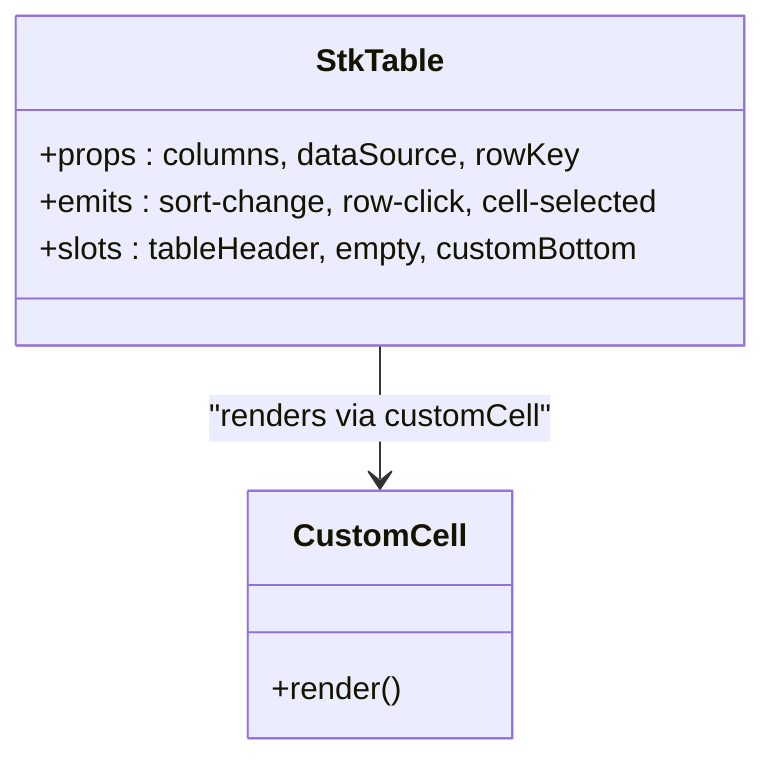

**Diagram sources**
- [src/StkTable/StkTable.vue](file://src/StkTable/StkTable.vue#L135-L153)
- [src/StkTable/types/index.ts](file://src/StkTable/types/index.ts#L49-L52)

**Section sources**
- [src/StkTable/StkTable.vue](file://src/StkTable/StkTable.vue#L135-L153)
- [src/StkTable/types/index.ts](file://src/StkTable/types/index.ts#L49-L52)

### Charting and Visualization Tools
- Render charts inside customCell for hybrid data visualization within table cells.
- Use virtual scrolling for large datasets; ensure chart rendering is optimized (e.g., lightweight chart libs, lazy initialization).

**Section sources**
- [docs-demo/advanced/virtual/VirtualY.vue](file://docs-demo/advanced/virtual/VirtualY.vue#L1-L34)

### Testing Frameworks Integration (Vitest)
- Unit tests: Import StkTable from the built module and render with minimal props.
- Mock data: Use small arrays for fast tests; leverage tableSort utilities for deterministic assertions.
- Event testing: Simulate user interactions and assert emitted events.

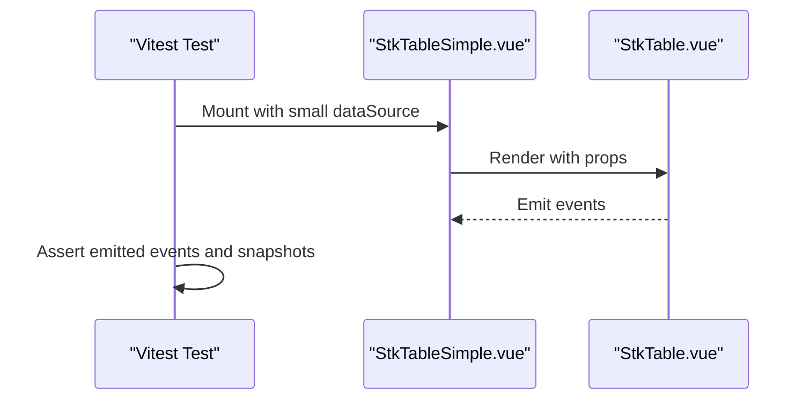

**Diagram sources**
- [test/StkTableSimple.vue](file://test/StkTableSimple.vue#L1-L55)
- [src/StkTable/StkTable.vue](file://src/StkTable/StkTable.vue#L478-L621)

**Section sources**
- [test/StkTableSimple.vue](file://test/StkTableSimple.vue#L1-L55)
- [src/StkTable/StkTable.vue](file://src/StkTable/StkTable.vue#L478-L621)

### Linting and Development Workflow
- ESLint and Prettier: Enforced via devDependencies; configure IDE integrations for consistent formatting and linting.
- VitePress docs: Built with VitePress; use demo-driven documentation to showcase integration patterns.

**Section sources**
- [package.json](file://package.json#L43-L75)
- [README.md](file://README.md#L22-L96)

### SSR Integration (Nuxt.js)
Considerations:
- Component hydration: Ensure StkTable is rendered on the client only when necessary (e.g., dynamic columns or heavy interactions).
- Module usage: Import StkTable in client-only contexts or use dynamic imports to avoid SSR mismatches.
- Styles: Verify CSS-injected styles are handled during SSR; the build outputs a dedicated CSS file.

**Section sources**
- [vite.config.ts](file://vite.config.ts#L10-L33)
- [src/StkTable/index.ts](file://src/StkTable/index.ts#L4-L5)

## Dependency Analysis
- External runtime dependency: vue is marked external in the build configuration.
- Dev tooling: Vite, Vitest, ESLint, Prettier, and VitePress are configured for development and documentation.

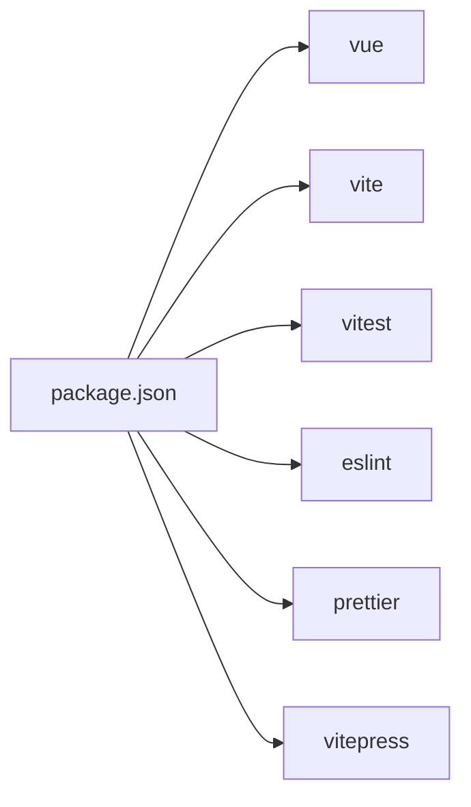

**Diagram sources**
- [package.json](file://package.json#L43-L75)

**Section sources**
- [package.json](file://package.json#L43-L75)
- [vite.config.ts](file://vite.config.ts#L18-L20)

## Performance Considerations
- Virtual scrolling: Enable virtual and virtualX for large datasets; ensure column widths are set for horizontal virtualization.
- Resizable columns: Use v-model:columns with col-resizable for dynamic layouts; keep updates minimal.
- Sorting: Prefer server-side sorting for very large datasets; use tableSort for small to medium datasets.

**Section sources**
- [docs-demo/advanced/virtual/VirtualY.vue](file://docs-demo/advanced/virtual/VirtualY.vue#L1-L34)
- [docs-demo/advanced/column-resize/ColResizable.vue](file://docs-demo/advanced/column-resize/ColResizable.vue#L1-L46)
- [src/StkTable/utils/index.ts](file://src/StkTable/utils/index.ts#L153-L207)

## Troubleshooting Guide
- Empty data state: Control visibility via showNoData and customize via the empty slot.
- Selection conflicts: Disable selectedCellRevokable or cellActive as needed; use cellSelectionChange to manage ranges.
- Sorting inconsistencies: Use sortRemote with @sort-change to synchronize with backend; apply tableSort for client-side scenarios.

**Section sources**
- [src/StkTable/StkTable.vue](file://src/StkTable/StkTable.vue#L192-L194)
- [src/StkTable/StkTable.vue](file://src/StkTable/StkTable.vue#L478-L621)

## Conclusion
Stk Table Vue integrates cleanly with the Vue ecosystem through props, events, slots, and utilities. By centralizing state in Pinia/Vuex, synchronizing routes, validating forms, and leveraging virtualization, you can build responsive, maintainable applications. For SSR, guard client-only rendering and ensure styles are properly injected.

## Appendices
- API surface: Props, emits, slots, and exposed utilities are documented in the official docs linked from the README.
- Build output: The library builds as an ES module with a dedicated CSS asset.

**Section sources**
- [README.md](file://README.md#L85-L96)
- [vite.config.ts](file://vite.config.ts#L10-L33)