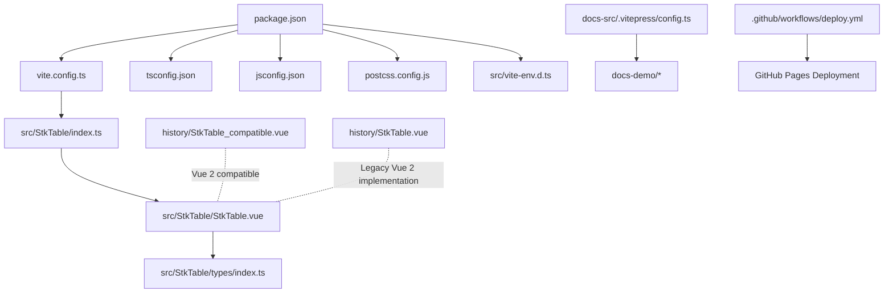
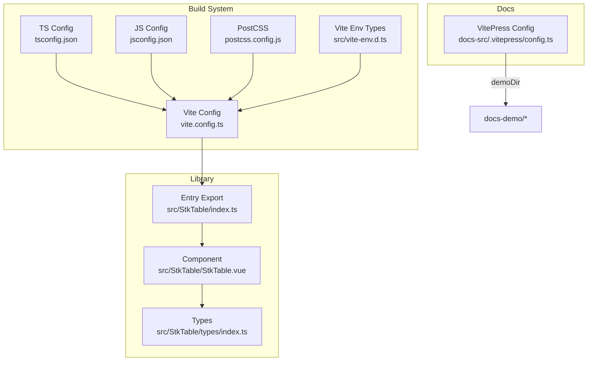
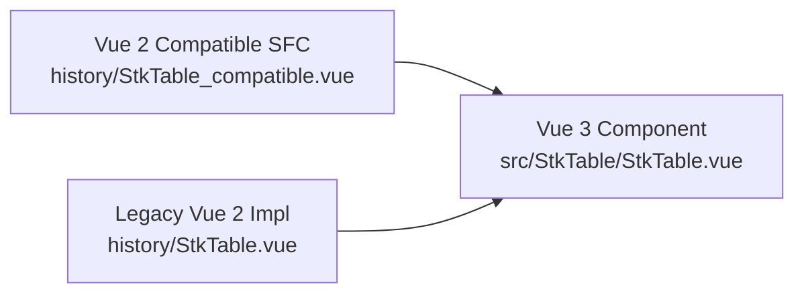
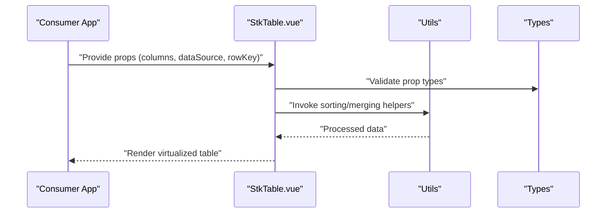
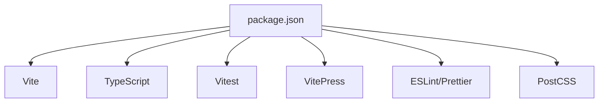
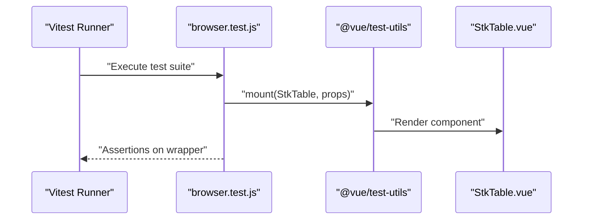
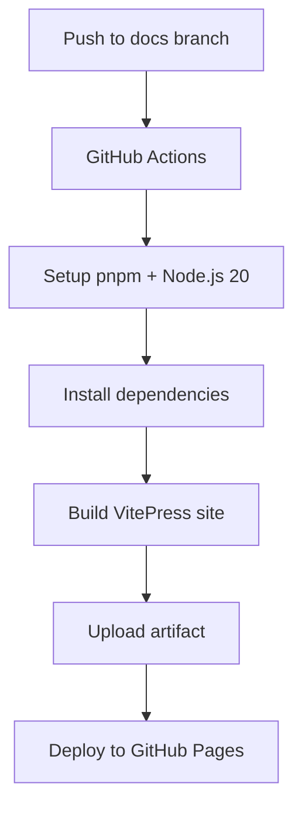

# Integration Guides

<cite>
**Referenced Files in This Document**
- [package.json](file://package.json)
- [vite.config.ts](file://vite.config.ts)
- [tsconfig.json](file://tsconfig.json)
- [jsconfig.json](file://jsconfig.json)
- [postcss.config.js](file://postcss.config.js)
- [src/vite-env.d.ts](file://src/vite-env.d.ts)
- [docs-src/.vitepress/config.ts](file://docs-src/.vitepress/config.ts)
- [vitest.workspace.ts](file://vitest.workspace.ts)
- [.github/workflows/deploy.yml](file://.github/workflows/deploy.yml)
- [src/StkTable/index.ts](file://src/StkTable/index.ts)
- [src/StkTable/StkTable.vue](file://src/StkTable/StkTable.vue)
- [src/StkTable/types/index.ts](file://src/StkTable/types/index.ts)
- [history/StkTable_compatible.vue](file://history/StkTable_compatible.vue)
- [history/StkTable.vue](file://history/StkTable.vue)
- [lib/src/StkTable/index.d.ts](file://lib/src/StkTable/index.d.ts)
- [test/StkTable.browser.test.js](file://test/StkTable.browser.test.js)
- [.eslintrc.cjs](file://.eslintrc.cjs)
- [.prettierrc.cjs](file://.prettierrc.cjs)
</cite>

## Table of Contents
1. [Introduction](#introduction)
2. [Project Structure](#project-structure)
3. [Core Components](#core-components)
4. [Architecture Overview](#architecture-overview)
5. [Detailed Component Analysis](#detailed-component-analysis)
6. [Dependency Analysis](#dependency-analysis)
7. [Performance Considerations](#performance-considerations)
8. [Testing Strategies](#testing-strategies)
9. [Development Workflow Setup](#development-workflow-setup)
10. [Continuous Integration](#continuous-integration)
11. [Integration Scenarios](#integration-scenarios)
12. [Troubleshooting Guide](#troubleshooting-guide)
13. [Conclusion](#conclusion)

## Introduction
This document provides comprehensive integration guidance for incorporating the virtual table component into diverse environments. It covers:
- Vue 2.7 compatibility implementation
- Build system configuration with Vite
- TypeScript integration patterns
- Webpack configuration, module resolution, and bundler optimization
- Testing strategies and development workflow
- Continuous integration considerations
- Integration with popular Vue ecosystem packages, state management systems, and form libraries
- SSR considerations, hydration challenges, and server-side rendering compatibility

## Project Structure
The repository is organized around a modular library package exporting a Vue 3 SFC with TypeScript types, alongside a Vite-powered documentation site and a legacy Vue 2-compatible implementation for backward compatibility.

**Diagram sources**
- [package.json](file://package.json#L1-L76)
- [vite.config.ts](file://vite.config.ts#L1-L66)
- [tsconfig.json](file://tsconfig.json#L1-L39)
- [jsconfig.json](file://jsconfig.json#L1-L13)
- [postcss.config.js](file://postcss.config.js#L1-L7)
- [src/vite-env.d.ts](file://src/vite-env.d.ts#L1-L11)
- [src/StkTable/index.ts](file://src/StkTable/index.ts#L1-L5)
- [src/StkTable/StkTable.vue](file://src/StkTable/StkTable.vue#L1-L800)
- [src/StkTable/types/index.ts](file://src/StkTable/types/index.ts#L1-L318)
- [docs-src/.vitepress/config.ts](file://docs-src/.vitepress/config.ts#L1-L46)
- [.github/workflows/deploy.yml](file://.github/workflows/deploy.yml#L1-L64)
- [history/StkTable_compatible.vue](file://history/StkTable_compatible.vue#L1-L585)
- [history/StkTable.vue](file://history/StkTable.vue#L1-L800)

**Section sources**
- [package.json](file://package.json#L1-L76)
- [vite.config.ts](file://vite.config.ts#L1-L66)
- [tsconfig.json](file://tsconfig.json#L1-L39)
- [jsconfig.json](file://jsconfig.json#L1-L13)
- [postcss.config.js](file://postcss.config.js#L1-L7)
- [src/vite-env.d.ts](file://src/vite-env.d.ts#L1-L11)
- [docs-src/.vitepress/config.ts](file://docs-src/.vitepress/config.ts#L1-L46)
- [history/StkTable_compatible.vue](file://history/StkTable_compatible.vue#L1-L585)
- [history/StkTable.vue](file://history/StkTable.vue#L1-L800)

## Core Components
- Library entry exports the primary component and utilities for TypeScript consumers.
- The main component is a Vue 3 Single File Component with TypeScript script setup and extensive props/events/types.
- Legacy Vue 2-compatible implementation is provided for environments requiring Vue 2.7 support.

Key integration artifacts:
- Library entry and exports: [src/StkTable/index.ts](file://src/StkTable/index.ts#L1-L5)
- Main component with props/events: [src/StkTable/StkTable.vue](file://src/StkTable/StkTable.vue#L209-L621)
- Type definitions: [src/StkTable/types/index.ts](file://src/StkTable/types/index.ts#L54-L120)
- Legacy Vue 2 compatible component: [history/StkTable_compatible.vue](file://history/StkTable_compatible.vue#L1-L585)
- Legacy Vue 2 implementation: [history/StkTable.vue](file://history/StkTable.vue#L334-L470)

**Section sources**
- [src/StkTable/index.ts](file://src/StkTable/index.ts#L1-L5)
- [src/StkTable/StkTable.vue](file://src/StkTable/StkTable.vue#L209-L621)
- [src/StkTable/types/index.ts](file://src/StkTable/types/index.ts#L54-L120)
- [history/StkTable_compatible.vue](file://history/StkTable_compatible.vue#L1-L585)
- [history/StkTable.vue](file://history/StkTable.vue#L334-L470)

## Architecture Overview
The build and integration architecture centers on Vite for development and library builds, with TypeScript configuration supporting bundler module resolution and PostCSS for styles. The documentation site is powered by VitePress.

**Diagram sources**
- [vite.config.ts](file://vite.config.ts#L1-L66)
- [tsconfig.json](file://tsconfig.json#L1-L39)
- [jsconfig.json](file://jsconfig.json#L1-L13)
- [postcss.config.js](file://postcss.config.js#L1-L7)
- [src/vite-env.d.ts](file://src/vite-env.d.ts#L1-L11)
- [src/StkTable/index.ts](file://src/StkTable/index.ts#L1-L5)
- [src/StkTable/StkTable.vue](file://src/StkTable/StkTable.vue#L1-L800)
- [src/StkTable/types/index.ts](file://src/StkTable/types/index.ts#L1-L318)
- [docs-src/.vitepress/config.ts](file://docs-src/.vitepress/config.ts#L1-L46)

**Section sources**
- [vite.config.ts](file://vite.config.ts#L1-L66)
- [tsconfig.json](file://tsconfig.json#L1-L39)
- [jsconfig.json](file://jsconfig.json#L1-L13)
- [postcss.config.js](file://postcss.config.js#L1-L7)
- [src/vite-env.d.ts](file://src/vite-env.d.ts#L1-L11)
- [src/StkTable/index.ts](file://src/StkTable/index.ts#L1-L5)
- [src/StkTable/StkTable.vue](file://src/StkTable/StkTable.vue#L1-L800)
- [src/StkTable/types/index.ts](file://src/StkTable/types/index.ts#L1-L318)
- [docs-src/.vitepress/config.ts](file://docs-src/.vitepress/config.ts#L1-L46)

## Detailed Component Analysis

### Vue 2.7 Compatibility Implementation
Two compatibility layers are provided:
- A Vue 2-compatible SFC that mirrors core behaviors for environments constrained to Vue 2.7.
- A legacy Vue 2 implementation with explicit props and methods for older setups.

Integration guidance:
- Prefer the Vue 3 component for new projects.
- For Vue 2.7 environments, import and use the compatible SFC.
- Ensure the consuming app’s Vue version satisfies the compatibility layer’s expectations.

**Diagram sources**
- [src/StkTable/StkTable.vue](file://src/StkTable/StkTable.vue#L1-L800)
- [history/StkTable_compatible.vue](file://history/StkTable_compatible.vue#L1-L585)
- [history/StkTable.vue](file://history/StkTable.vue#L1-L800)

**Section sources**
- [history/StkTable_compatible.vue](file://history/StkTable_compatible.vue#L1-L585)
- [history/StkTable.vue](file://history/StkTable.vue#L334-L470)

### Build System with Vite
- Library build targets modern browsers and externalizes Vue.
- Asset naming ensures CSS bundles are named consistently.
- Development aliases and TypeScript module resolution are configured.

Key configuration points:
- Externalized runtime dependency: [vite.config.ts](file://vite.config.ts#L18-L20)
- Alias and extension resolution: [vite.config.ts](file://vite.config.ts#L34-L39)
- TypeScript bundler module resolution: [tsconfig.json](file://tsconfig.json#L11-L11)

**Section sources**
- [vite.config.ts](file://vite.config.ts#L1-L66)
- [tsconfig.json](file://tsconfig.json#L1-L39)

### TypeScript Integration Patterns
- Strict TypeScript configuration with bundler module resolution.
- Path aliases configured for clean imports.
- Component props and events typed via dedicated interfaces.

Patterns:
- Use path aliases for imports (e.g., @/*).
- Leverage exported types for props and columns.
- Keep component props in a single file to avoid Vue 2.7 compilation issues.

**Section sources**
- [tsconfig.json](file://tsconfig.json#L1-L39)
- [jsconfig.json](file://jsconfig.json#L1-L13)
- [src/StkTable/types/index.ts](file://src/StkTable/types/index.ts#L54-L120)
- [src/StkTable/StkTable.vue](file://src/StkTable/StkTable.vue#L278-L476)

### Webpack Configuration, Module Resolution, and Bundler Optimization
While the project uses Vite, the same principles apply for Webpack-based integrations:
- Configure module resolution to match tsconfig paths.
- Externalize Vue in library builds.
- Enable CSS code splitting and asset naming for predictable outputs.
- Use bundler-friendly TypeScript settings (moduleResolution: bundler).

Reference configuration:
- Vite externalization and asset naming: [vite.config.ts](file://vite.config.ts#L18-L30)
- Path aliases and extensions: [vite.config.ts](file://vite.config.ts#L34-L39)
- TypeScript bundler module resolution: [tsconfig.json](file://tsconfig.json#L11-L11)

**Section sources**
- [vite.config.ts](file://vite.config.ts#L1-L66)
- [tsconfig.json](file://tsconfig.json#L1-L39)

### API and Props Flow

**Diagram sources**
- [src/StkTable/StkTable.vue](file://src/StkTable/StkTable.vue#L209-L621)
- [src/StkTable/types/index.ts](file://src/StkTable/types/index.ts#L54-L120)
- [src/StkTable/index.ts](file://src/StkTable/index.ts#L1-L5)

**Section sources**
- [src/StkTable/StkTable.vue](file://src/StkTable/StkTable.vue#L209-L621)
- [src/StkTable/types/index.ts](file://src/StkTable/types/index.ts#L54-L120)
- [src/StkTable/index.ts](file://src/StkTable/index.ts#L1-L5)

## Dependency Analysis
- Runtime dependency: Vue is externalized in the library build.
- Dev-time tooling includes Vite, TypeScript, ESLint, Prettier, Vitest, and VitePress.
- Documentation site integrates a demo plugin and local search.

**Diagram sources**
- [package.json](file://package.json#L43-L75)
- [vite.config.ts](file://vite.config.ts#L1-L66)
- [.eslintrc.cjs](file://.eslintrc.cjs#L1-L45)
- [.prettierrc.cjs](file://.prettierrc.cjs#L1-L36)

**Section sources**
- [package.json](file://package.json#L43-L75)
- [.eslintrc.cjs](file://.eslintrc.cjs#L1-L45)
- [.prettierrc.cjs](file://.prettierrc.cjs#L1-L36)

## Performance Considerations
- Virtual scrolling is enabled via props and computed logic to render only visible rows/columns.
- CSS code splitting and asset naming ensure predictable CSS delivery.
- Externalizing Vue reduces bundle size for consumers.

Recommendations:
- Enable virtual scrolling for large datasets.
- Keep column widths explicit for X-axis virtualization.
- Use CSS custom properties for theme-driven styles.

**Section sources**
- [src/StkTable/StkTable.vue](file://src/StkTable/StkTable.vue#L763-L788)
- [vite.config.ts](file://vite.config.ts#L32-L32)

## Testing Strategies
- Unit tests use Vitest with @vue/test-utils and happy-dom environment.
- Tests mount the component with realistic props and assert DOM attributes and classes.
- Workspace configuration extends Vite config for test environments.

**Diagram sources**
- [vitest.workspace.ts](file://vitest.workspace.ts#L1-L17)
- [test/StkTable.browser.test.js](file://test/StkTable.browser.test.js#L1-L72)

**Section sources**
- [vitest.workspace.ts](file://vitest.workspace.ts#L1-L17)
- [test/StkTable.browser.test.js](file://test/StkTable.browser.test.js#L1-L72)

## Development Workflow Setup
- Development server: Vite dev server for rapid iteration.
- Documentation: VitePress dev/build for interactive docs with live demos.
- Formatting and linting: ESLint and Prettier configured for consistent code quality.

Scripts and tools:
- Dev server: [package.json](file://package.json#L13-L21)
- Docs dev/build: [package.json](file://package.json#L17-L20)
- ESLint config: [.eslintrc.cjs](file://.eslintrc.cjs#L1-L45)
- Prettier config: [.prettierrc.cjs](file://.prettierrc.cjs#L1-L36)

**Section sources**
- [package.json](file://package.json#L13-L21)
- [.eslintrc.cjs](file://.eslintrc.cjs#L1-L45)
- [.prettierrc.cjs](file://.prettierrc.cjs#L1-L36)

## Continuous Integration
- GitHub Actions workflow builds and deploys the VitePress documentation site to GitHub Pages.
- Uses pnpm, Node.js 20, and uploads the built static assets.

**Diagram sources**
- [.github/workflows/deploy.yml](file://.github/workflows/deploy.yml#L1-L64)

**Section sources**
- [.github/workflows/deploy.yml](file://.github/workflows/deploy.yml#L1-L64)

## Integration Scenarios

### Vue 2.7 Compatibility
- Use the Vue 2-compatible SFC for Vue 2.7 projects.
- Ensure props and methods align with the compatible implementation.

**Section sources**
- [history/StkTable_compatible.vue](file://history/StkTable_compatible.vue#L1-L585)

### Build System with Vite
- Configure Vite to alias and resolve TypeScript modules.
- Externalize Vue in library builds and split CSS assets.

**Section sources**
- [vite.config.ts](file://vite.config.ts#L34-L39)
- [tsconfig.json](file://tsconfig.json#L11-L11)

### TypeScript Integration Patterns
- Import via path aliases (@/*).
- Use exported types for props and columns.
- Keep component props in a single file to avoid Vue 2.7 compilation issues.

**Section sources**
- [jsconfig.json](file://jsconfig.json#L1-L13)
- [src/StkTable/types/index.ts](file://src/StkTable/types/index.ts#L54-L120)
- [src/StkTable/StkTable.vue](file://src/StkTable/StkTable.vue#L278-L476)

### Webpack Configuration, Module Resolution, and Bundler Optimization
- Mirror Vite settings in Webpack: externalize Vue, enable bundler module resolution, and split CSS.

**Section sources**
- [vite.config.ts](file://vite.config.ts#L18-L30)
- [tsconfig.json](file://tsconfig.json#L11-L11)

### Testing Strategies
- Use Vitest with happy-dom for browser-like DOM testing.
- Mount the component with realistic props and assert rendered attributes.

**Section sources**
- [vitest.workspace.ts](file://vitest.workspace.ts#L1-L17)
- [test/StkTable.browser.test.js](file://test/StkTable.browser.test.js#L1-L72)

### Development Workflow Setup
- Run Vite dev server for the library and VitePress for docs.
- Enforce formatting and linting with ESLint and Prettier.

**Section sources**
- [package.json](file://package.json#L13-L21)
- [.eslintrc.cjs](file://.eslintrc.cjs#L1-L45)
- [.prettierrc.cjs](file://.prettierrc.cjs#L1-L36)

### Continuous Integration
- Automate documentation builds and deployments using GitHub Actions.

**Section sources**
- [.github/workflows/deploy.yml](file://.github/workflows/deploy.yml#L1-L64)

### Integration with Popular Vue Ecosystem Packages
- State Management: Integrate props/events with Vuex or Pinia stores.
- Form Libraries: Bind columns and data to reactive forms; leverage emitted events for selection and sorting.

Note: The component exposes comprehensive props and events suitable for state management and form integration.

**Section sources**
- [src/StkTable/StkTable.vue](file://src/StkTable/StkTable.vue#L478-L621)
- [src/StkTable/types/index.ts](file://src/StkTable/types/index.ts#L54-L120)

### SSR Considerations, Hydration Challenges, and Server-Side Rendering Compatibility
- The component relies on client-side DOM APIs and dynamic styles; it is intended for client-side rendering.
- For SSR, ensure the component is only rendered on the client or guarded by client-only directives.
- Avoid relying on window/document during SSR; initialize dynamic features after mount.

Guidance:
- Guard dynamic features behind client-only checks.
- Initialize virtual scrolling and custom scrollbar after mount.
- Ensure CSS is injected appropriately for SSR environments.

**Section sources**
- [src/StkTable/StkTable.vue](file://src/StkTable/StkTable.vue#L631-L633)
- [src/StkTable/StkTable.vue](file://src/StkTable/StkTable.vue#L763-L791)

## Troubleshooting Guide
Common issues and resolutions:
- TypeScript path aliases not resolving: Verify tsconfig and jsconfig path mappings.
- CSS not included: Confirm assetFileNames naming and CSS code splitting settings.
- Vue externalization warnings: Ensure consumers include Vue in their bundles or peer dependencies.
- DOM-related errors in SSR: Guard DOM-dependent logic behind client-only checks.

**Section sources**
- [tsconfig.json](file://tsconfig.json#L21-L25)
- [jsconfig.json](file://jsconfig.json#L3-L8)
- [vite.config.ts](file://vite.config.ts#L18-L30)
- [src/StkTable/StkTable.vue](file://src/StkTable/StkTable.vue#L631-L633)

## Conclusion
This guide consolidates integration patterns for the virtual table component across modern and legacy Vue environments, highlighting Vite-based builds, TypeScript configurations, testing, and CI/CD. By following the provided patterns—externalizing Vue, enabling CSS code splitting, leveraging TypeScript bundler module resolution, and guarding SSR-specific logic—you can integrate the component reliably in diverse applications and ecosystems.