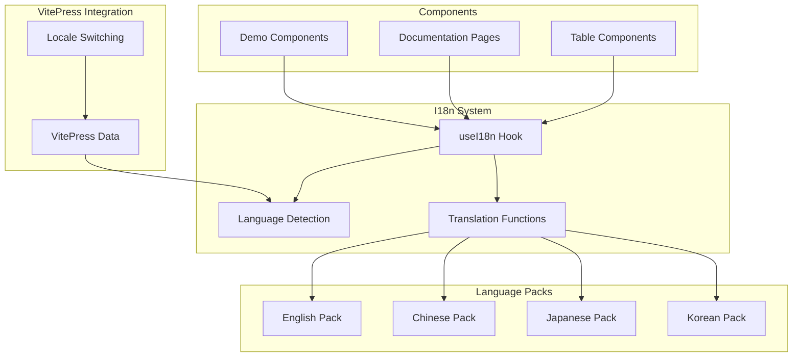
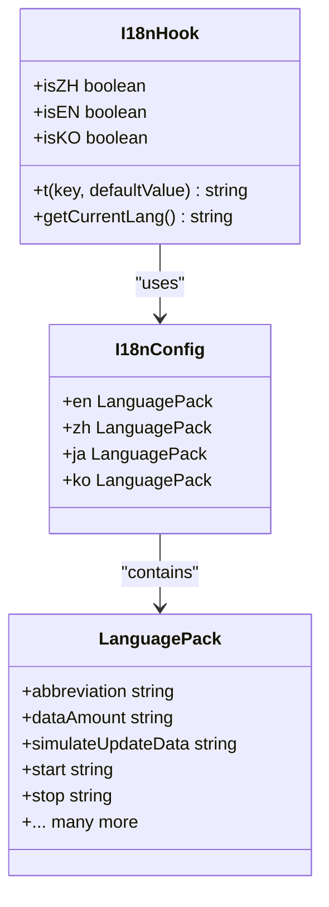
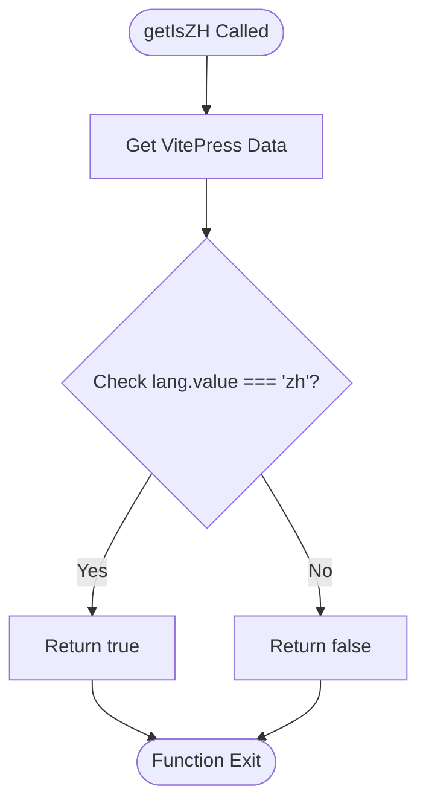
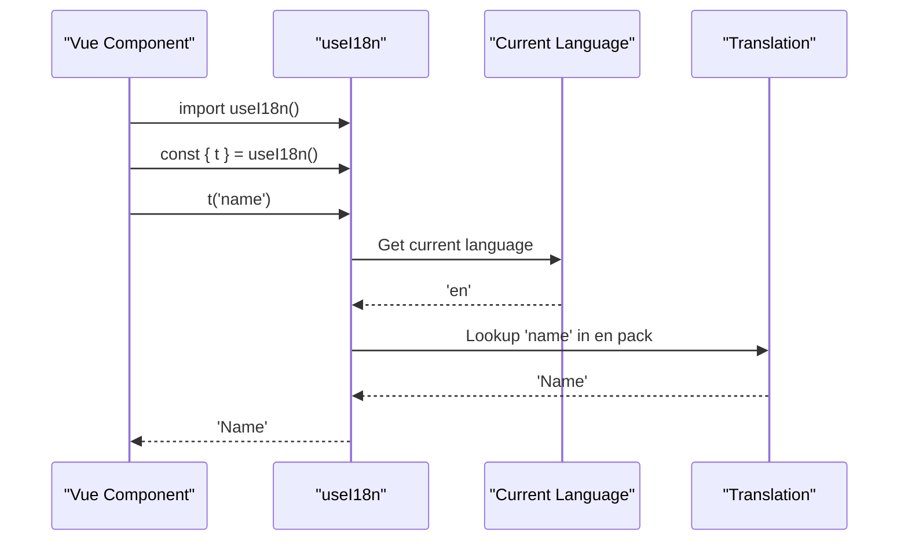
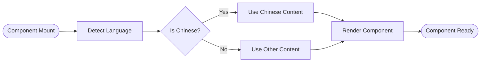
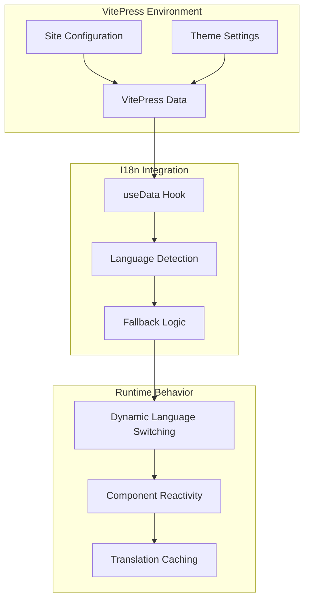

# Internationalization System

<cite>
**Referenced Files in This Document**
- [index.ts](file://docs-demo/hooks/useI18n/index.ts)
- [en.ts](file://docs-demo/hooks/useI18n/en.ts)
- [zh.ts](file://docs-demo/hooks/useI18n/zh.ts)
- [ja.ts](file://docs-demo/hooks/useI18n/ja.ts)
- [ko.ts](file://docs-demo/hooks/useI18n/ko.ts)
- [getIsZH.ts](file://docs-demo/hooks/getIsZH.ts)
- [Basic.vue](file://docs-demo/basic/Basic.vue)
- [AreaSelection.vue](file://docs-demo/advanced/area-selection/AreaSelection.vue)
- [ColResizable.vue](file://docs-demo/advanced/column-resize/ColResizable.vue)
- [HeaderDrag.vue](file://docs-demo/advanced/header-drag/HeaderDrag.vue)
- [index.vue](file://docs-demo/advanced/auto-height-virtual/AutoHeightVirtual/index.vue)
- [StkTable.vue](file://docs-demo/StkTable.vue)
</cite>

## Table of Contents
1. [Introduction](#introduction)
2. [System Architecture](#system-architecture)
3. [Core Components](#core-components)
4. [Language Packs](#language-packs)
5. [Usage Patterns](#usage-patterns)
6. [Integration with VitePress](#integration-with-vitepress)
7. [Implementation Details](#implementation-details)
8. [Best Practices](#best-practices)
9. [Troubleshooting Guide](#troubleshooting-guide)
10. [Conclusion](#conclusion)

## Introduction

The internationalization (i18n) system in this Vue table library project provides multilingual support for documentation and demo components. The system supports four languages: English, Chinese, Japanese, and Korean, enabling users from different linguistic backgrounds to interact with the table components using familiar terminology.

The i18n system is built around a lightweight, composable approach that integrates seamlessly with VitePress documentation framework. It provides translation functions, language detection, and conditional rendering based on the current locale.

## System Architecture

The internationalization system follows a modular architecture with clear separation of concerns:



**Diagram sources**
- [index.ts:16-47](file://docs-demo/hooks/useI18n/index.ts#L16-L47)
- [en.ts:1-138](file://docs-demo/hooks/useI18n/en.ts#L1-L138)
- [zh.ts:1-146](file://docs-demo/hooks/useI18n/zh.ts#L1-L146)

## Core Components

### useI18n Hook

The central component of the i18n system is the `useI18n` composable hook, which provides:

- **Translation Function (`t`)**: Main function for retrieving localized strings
- **Language Detection**: Automatic detection of current locale from VitePress
- **Conditional Utilities**: Computed properties for language-specific rendering
- **Fallback Mechanism**: Graceful fallback to English when translations are missing



**Diagram sources**
- [index.ts:8-14](file://docs-demo/hooks/useI18n/index.ts#L8-L14)
- [index.ts:16-47](file://docs-demo/hooks/useI18n/index.ts#L16-L47)

**Section sources**
- [index.ts:1-48](file://docs-demo/hooks/useI18n/index.ts#L1-L48)

### Language Detection Utility

The system includes a specialized utility for detecting Chinese language contexts:



**Diagram sources**
- [getIsZH.ts:3-6](file://docs-demo/hooks/getIsZH.ts#L3-L6)

**Section sources**
- [getIsZH.ts:1-7](file://docs-demo/hooks/getIsZH.ts#L1-L7)

## Language Packs

Each supported language has a dedicated translation file containing key-value pairs for UI strings:

### English Language Pack
Contains comprehensive translations for table component terminology including:
- Basic table terms (name, age, address, gender)
- Advanced features (virtual scrolling, column resizing, sorting)
- UI states (selected, hover, active)
- Data manipulation operations (add, clear, update)

### Chinese Language Pack
Provides localized terms for Chinese-speaking users:
- Simplified Chinese translations for all table concepts
- Cultural adaptations for financial and business terminology
- Consistent with the project's Chinese documentation

### Japanese Language Pack
Features Japanese translations with cultural adaptations:
- Japanese equivalents for technical terminology
- Proper honorifics and formality levels
- Localization of financial market terms

### Korean Language Pack
Includes Korean translations for Korean-speaking audience:
- Korean technical terminology equivalents
- Cultural adaptations for business contexts
- Consistent with Korean documentation standards

**Section sources**
- [en.ts:1-138](file://docs-demo/hooks/useI18n/en.ts#L1-L138)
- [zh.ts:1-146](file://docs-demo/hooks/useI18n/zh.ts#L1-L146)
- [ja.ts:1-138](file://docs-demo/hooks/useI18n/ja.ts#L1-L138)
- [ko.ts:1-146](file://docs-demo/hooks/useI18n/ko.ts#L1-L146)

## Usage Patterns

### Basic Translation Usage

Components import and use the i18n hook to translate static text:



**Diagram sources**
- [Basic.vue:5-7](file://docs-demo/basic/Basic.vue#L5-L7)
- [index.ts:19-22](file://docs-demo/hooks/useI18n/index.ts#L19-L22)

### Conditional Content Rendering

Some components use language detection for dynamic content:



**Diagram sources**
- [index.vue](file://docs-demo/advanced/auto-height-virtual/AutoHeightVirtual/index.vue#L8)

**Section sources**
- [Basic.vue:1-39](file://docs-demo/basic/Basic.vue#L1-L39)
- [AreaSelection.vue:1-69](file://docs-demo/advanced/area-selection/AreaSelection.vue#L1-L69)
- [ColResizable.vue:1-46](file://docs-demo/advanced/column-resize/ColResizable.vue#L1-L46)
- [HeaderDrag.vue:1-39](file://docs-demo/advanced/header-drag/HeaderDrag.vue#L1-L39)
- [index.vue:1-42](file://docs-demo/advanced/auto-height-virtual/AutoHeightVirtual/index.vue#L1-L42)

## Integration with VitePress

The i18n system integrates deeply with VitePress through the `useData` composable:



**Diagram sources**
- [index.ts:1-2](file://docs-demo/hooks/useI18n/index.ts#L1-L2)
- [index.ts:17-22](file://docs-demo/hooks/useI18n/index.ts#L17-L22)

The integration provides several benefits:
- **Automatic Locale Detection**: Uses VitePress's built-in language detection
- **Reactive Updates**: Changes in locale automatically update all translations
- **Consistent Behavior**: Aligns with VitePress documentation patterns

**Section sources**
- [index.ts:1-48](file://docs-demo/hooks/useI18n/index.ts#L1-L48)
- [StkTable.vue:1-49](file://docs-demo/StkTable.vue#L1-L49)

## Implementation Details

### Translation Resolution Algorithm

The system implements a robust fallback mechanism:

```mermaid
flowchart TD
Start([t(key, defaultValue)]) --> GetCurrentLang[Get Current Language]
GetCurrentLang --> CheckLang{Language Exists?}
CheckLang --> |Yes| CheckKey{Key Exists?}
CheckLang --> |No| UseDefault[Use Default Value]
CheckKey --> |Yes| ReturnTranslation[Return Translation]
CheckKey --> |No| CheckEnglish{English Exists?}
CheckEnglish --> |Yes| ReturnEn[Return English]
CheckEnglish --> |No| ReturnDefault
ReturnTranslation --> End([Translation Complete])
ReturnEn --> End
UseDefault --> End
ReturnDefault --> End
```

**Diagram sources**
- [index.ts:19-22](file://docs-demo/hooks/useI18n/index.ts#L19-L22)

### Performance Optimizations

The implementation includes several performance considerations:
- **Computed Properties**: Language detection uses Vue's reactive system
- **Minimal Dependencies**: Single dependency on VitePress for data access
- **Efficient Lookups**: Direct object property access for translations
- **Memory Efficiency**: Shared language packs across components

**Section sources**
- [index.ts:24-47](file://docs-demo/hooks/useI18n/index.ts#L24-L47)

## Best Practices

### Translation Key Management

1. **Consistent Key Naming**: Use descriptive, hierarchical keys
2. **Fallback Strategy**: Always provide meaningful default values
3. **Context Awareness**: Consider context-specific translations
4. **Pluralization Support**: Plan for future pluralization needs

### Component Integration

1. **Hook Placement**: Import useI18n at the top of script setup blocks
2. **Reactive Usage**: Use the returned t function reactively
3. **Conditional Logic**: Leverage language detection for dynamic content
4. **Performance**: Minimize unnecessary re-renders by using computed properties

### Maintenance Guidelines

1. **Regular Audits**: Periodically review translation completeness
2. **Community Contributions**: Encourage community contributions for new languages
3. **Testing**: Verify translations work correctly across different component states
4. **Documentation**: Maintain clear documentation of translation keys and usage patterns

## Troubleshooting Guide

### Common Issues and Solutions

#### Missing Translations
**Problem**: Keys not found in current language pack
**Solution**: The system falls back to English or uses the default value

#### Language Detection Failures
**Problem**: Incorrect language detection
**Solution**: Verify VitePress configuration and ensure proper site setup

#### Performance Issues
**Problem**: Slow translation lookups
**Solution**: The system is optimized for performance; check for excessive re-renders

#### Memory Leaks
**Problem**: Translation objects not properly cleaned up
**Solution**: The system uses Vue's reactive system; ensure proper component lifecycle management

**Section sources**
- [index.ts:19-22](file://docs-demo/hooks/useI18n/index.ts#L19-L22)

## Conclusion

The internationalization system provides a robust, maintainable solution for multilingual support in the Vue table library documentation and demos. Its architecture balances simplicity with functionality, offering:

- **Comprehensive Language Support**: Four major world languages with detailed translations
- **Seamless Integration**: Deep integration with VitePress for automatic locale detection
- **Performance Optimization**: Efficient lookup mechanisms with reactive updates
- **Developer Experience**: Simple API with powerful fallback capabilities

The system serves as both a functional i18n solution and a demonstration of best practices for implementing internationalization in Vue applications, particularly within documentation frameworks like VitePress.

Future enhancements could include pluralization support, context-aware translations, and additional language coverage, building upon the solid foundation established by the current implementation.