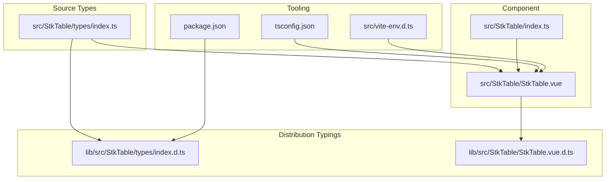
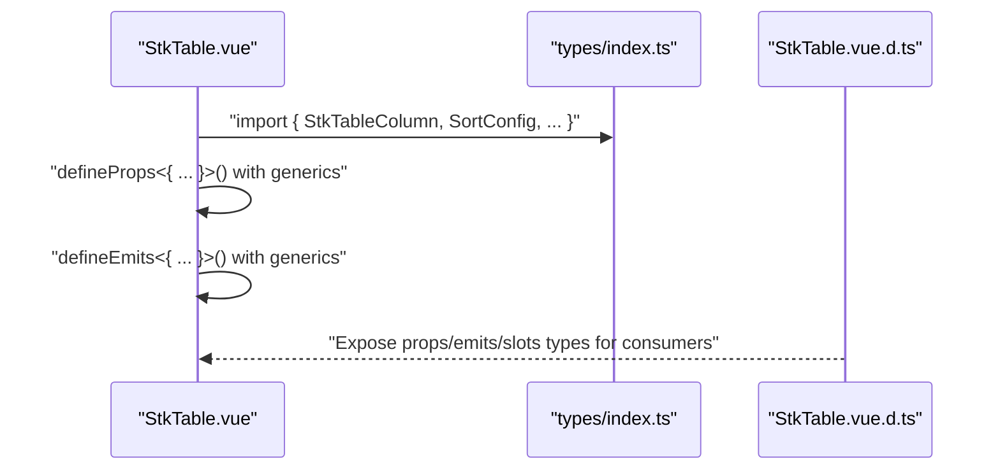
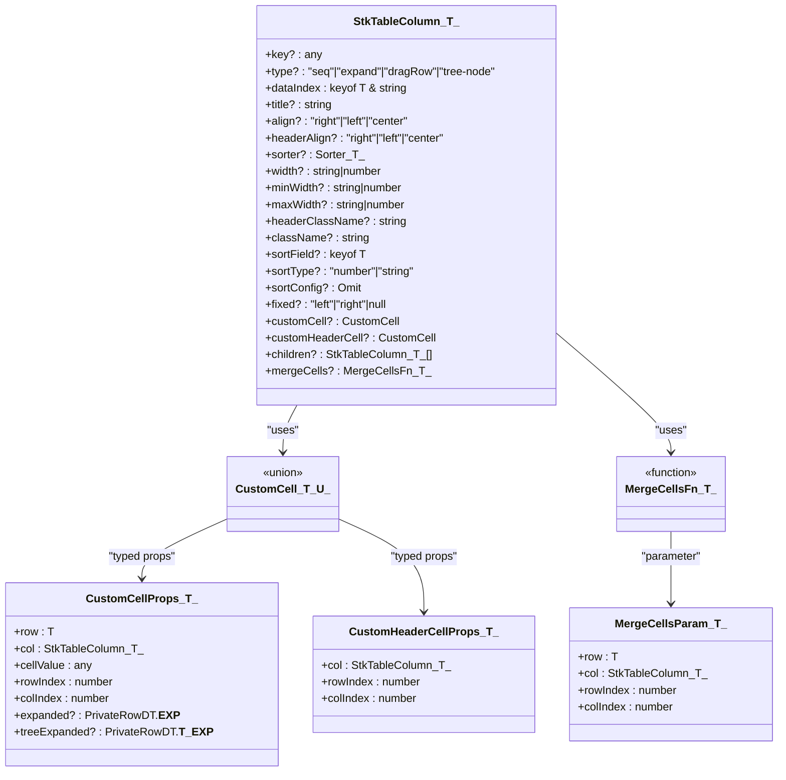
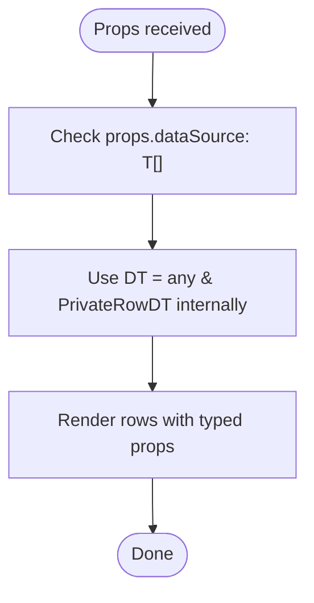
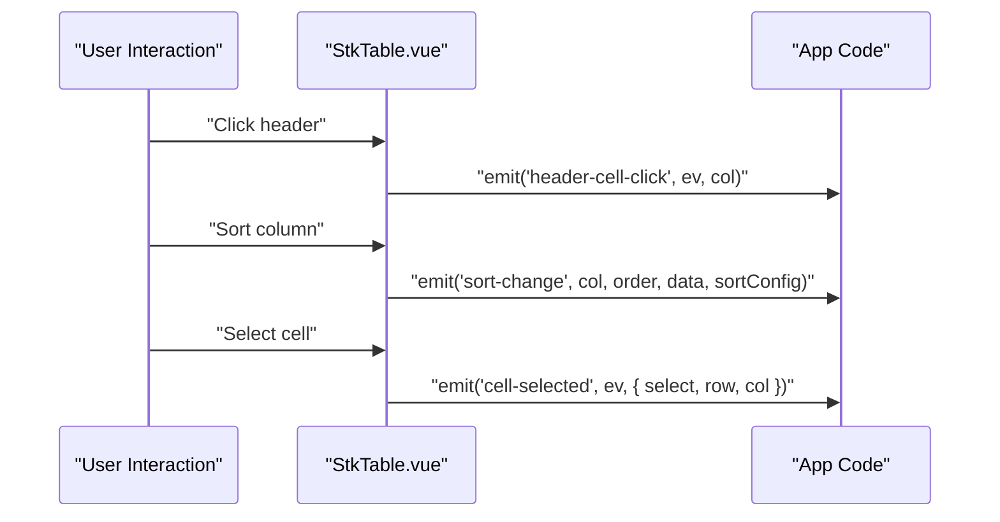
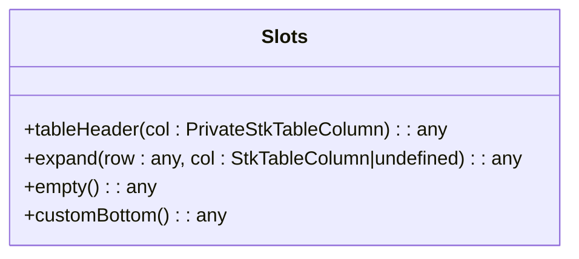
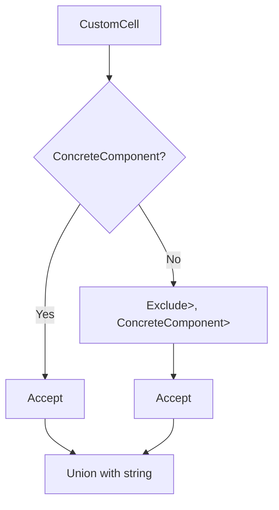
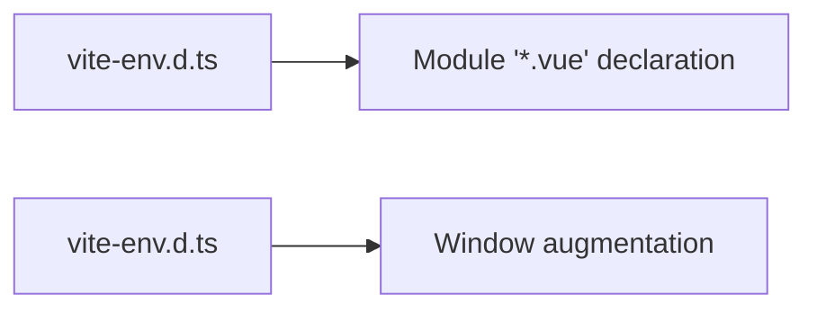
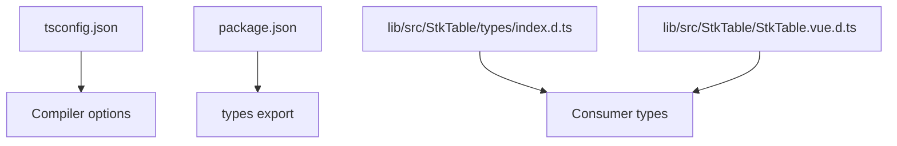
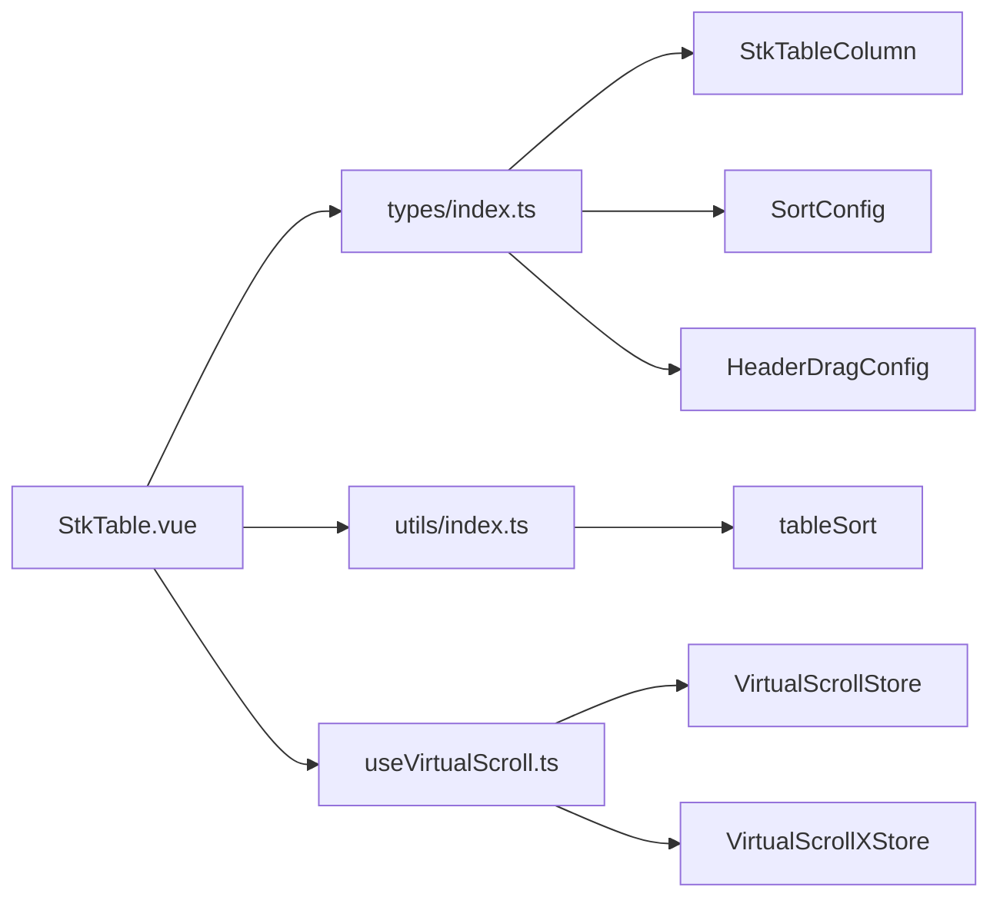

# TypeScript Integration

<cite>
**Referenced Files in This Document**
- [src/StkTable/types/index.ts](file://src/StkTable/types/index.ts)
- [src/StkTable/StkTable.vue](file://src/StkTable/StkTable.vue)
- [src/StkTable/index.ts](file://src/StkTable/index.ts)
- [src/vite-env.d.ts](file://src/vite-env.d.ts)
- [tsconfig.json](file://tsconfig.json)
- [lib/src/StkTable/types/index.d.ts](file://lib/src/StkTable/types/index.d.ts)
- [lib/src/StkTable/StkTable.vue.d.ts](file://lib/src/StkTable/StkTable.vue.d.ts)
- [history/StkTable.d.ts](file://history/StkTable.d.ts)
- [src/StkTable/utils/index.ts](file://src/StkTable/utils/index.ts)
- [src/StkTable/useVirtualScroll.ts](file://src/StkTable/useVirtualScroll.ts)
- [package.json](file://package.json)
- [src/StkTable/const.ts](file://src/StkTable/const.ts)
- [src/StkTable/useKeyboardArrowScroll.ts](file://src/StkTable/useKeyboardArrowScroll.ts)
- [src/StkTable/features/const.ts](file://src/StkTable/features/const.ts)
</cite>

## Update Summary
**Changes Made**
- Updated enum modernization section to reflect the conversion from traditional TypeScript enums to const objects with explicit type definitions for TagType and ScrollCodes
- Added documentation for the new TagType const object pattern and its benefits
- Enhanced type safety and performance considerations for the modernized enum usage
- Updated examples to show both old enum syntax and new const object syntax
- Added backward compatibility information for existing codebases
- Updated distribution typings documentation to reflect const object patterns

## Table of Contents
1. [Introduction](#introduction)
2. [Project Structure](#project-structure)
3. [Core Components](#core-components)
4. [Architecture Overview](#architecture-overview)
5. [Detailed Component Analysis](#detailed-component-analysis)
6. [Enum Modernization](#enum-modernization)
7. [Dependency Analysis](#dependency-analysis)
8. [Performance Considerations](#performance-considerations)
9. [Troubleshooting Guide](#troubleshooting-guide)
10. [Conclusion](#conclusion)
11. [Appendices](#appendices)

## Introduction
This document explains the complete TypeScript integration of the table library, focusing on type definitions, interface implementations, and generic type usage. It covers the type system around StkTableColumn, DataSource, and configuration interfaces, along with advanced patterns such as conditional types, mapped types, and utility types. It also documents component prop typing, event handler signatures, slot typing strategies, type augmentation, module declaration files, and integration with popular TypeScript tooling.

**Updated** The library has modernized its TypeScript enum usage by converting traditional enums to const objects with explicit type definitions, improving type safety and performance while maintaining backward compatibility.

## Project Structure
The library exposes a Vue 3 component with comprehensive TypeScript typings. The primary type definitions live under src/StkTable/types/index.ts, while the component implementation and emitted events are typed in src/StkTable/StkTable.vue. Distribution typings are generated under lib/src/StkTable/*.d.ts.



**Diagram sources**
- [src/StkTable/types/index.ts:1-394](file://src/StkTable/types/index.ts#L1-L394)
- [src/StkTable/StkTable.vue:209-621](file://src/StkTable/StkTable.vue#L209-L621)
- [src/StkTable/index.ts:1-5](file://src/StkTable/index.ts#L1-L5)
- [lib/src/StkTable/types/index.d.ts:1-362](file://lib/src/StkTable/types/index.d.ts#L1-L362)
- [lib/src/StkTable/StkTable.vue.d.ts:1-818](file://lib/src/StkTable/StkTable.vue.d.ts#L1-L818)
- [tsconfig.json:1-39](file://tsconfig.json#L1-L39)
- [src/vite-env.d.ts:1-11](file://src/vite-env.d.ts#L1-L11)
- [package.json:1-76](file://package.json#L1-L76)

**Section sources**
- [src/StkTable/types/index.ts:1-394](file://src/StkTable/types/index.ts#L1-L394)
- [src/StkTable/StkTable.vue:209-621](file://src/StkTable/StkTable.vue#L209-L621)
- [src/StkTable/index.ts:1-5](file://src/StkTable/index.ts#L1-L5)
- [lib/src/StkTable/types/index.d.ts:1-362](file://lib/src/StkTable/types/index.d.ts#L1-L362)
- [lib/src/StkTable/StkTable.vue.d.ts:1-818](file://lib/src/StkTable/StkTable.vue.d.ts#L1-L818)
- [tsconfig.json:1-39](file://tsconfig.json#L1-L39)
- [src/vite-env.d.ts:1-11](file://src/vite-env.d.ts#L1-L11)
- [package.json:1-76](file://package.json#L1-L76)

## Core Components
This section focuses on the core type system and how it is used in the component.

- StkTableColumn<T>: The central configuration interface for table columns. It is generic over the data type T and includes fields for data indexing, sorting, alignment, fixed positioning, custom renderers, nested headers, and cell merging.
- DataSource: The table's data source is typed as an array of the generic row type T.
- Configuration interfaces: SortConfig<T>, SeqConfig, ExpandConfig, DragRowConfig, TreeConfig, HeaderDragConfig<DT>, AutoRowHeightConfig<DT>, ColResizableConfig<DT>, RowActiveOption<DT>, CellSelectionConfig<T>, and others define strongly typed options for various features.
- Private types: PrivateStkTableColumn<T> and PrivateRowDT augment columns and rows with internal keys used during rendering and virtualization.

Key patterns:
- Generic type parameters: StkTableColumn<T>, SortConfig<T>, HeaderDragConfig<DT>, AutoRowHeightConfig<DT>, and RowActiveOption<DT> ensure type safety across features.
- Optional properties: Many fields are optional to allow flexible column definitions.
- Type inference: The component uses a local generic DT = any & PrivateRowDT to unify row shapes internally while preserving external type information.

**Section sources**
- [src/StkTable/types/index.ts:54-120](file://src/StkTable/types/index.ts#L54-L120)
- [src/StkTable/types/index.ts:122-173](file://src/StkTable/types/index.ts#L122-L173)
- [src/StkTable/types/index.ts:185-220](file://src/StkTable/types/index.ts#L185-L220)
- [src/StkTable/types/index.ts:235-282](file://src/StkTable/types/index.ts#L235-L282)
- [src/StkTable/StkTable.vue:269-270](file://src/StkTable/StkTable.vue#L269-L270)

## Architecture Overview
The component defines its props and emits with explicit TypeScript signatures. Events carry strongly typed payloads, and slots are typed via template-level slot typing in the distribution typings.



**Diagram sources**
- [src/StkTable/StkTable.vue:218-247](file://src/StkTable/StkTable.vue#L218-L247)
- [src/StkTable/StkTable.vue:278-476](file://src/StkTable/StkTable.vue#L278-L476)
- [src/StkTable/StkTable.vue:478-621](file://src/StkTable/StkTable.vue#L478-L621)
- [lib/src/StkTable/StkTable.vue.d.ts:60-793](file://lib/src/StkTable/StkTable.vue.d.ts#L60-L793)

**Section sources**
- [src/StkTable/StkTable.vue:218-247](file://src/StkTable/StkTable.vue#L218-L247)
- [src/StkTable/StkTable.vue:278-476](file://src/StkTable/StkTable.vue#L278-L476)
- [src/StkTable/StkTable.vue:478-621](file://src/StkTable/StkTable.vue#L478-L621)
- [lib/src/StkTable/StkTable.vue.d.ts:60-793](file://lib/src/StkTable/StkTable.vue.d.ts#L60-L793)

## Detailed Component Analysis

### StkTableColumn<T> and Custom Renderers
- Purpose: Defines column metadata and behavior, including data indexing, alignment, sorting, fixed positions, and custom renderers.
- CustomCell typing: Uses a union that accepts ConcreteComponent with typed props, Partial<T> components (loose props), or a string tag. This enables flexible component usage while preserving type safety for props like row, col, cellValue, rowIndex, and colIndex.
- CustomHeaderCell typing: Mirrors CustomCell for header cells.
- MergeCells: Provides a function to compute rowspan/colspan for merged cells.



**Diagram sources**
- [src/StkTable/types/index.ts:49-120](file://src/StkTable/types/index.ts#L49-L120)

**Section sources**
- [src/StkTable/types/index.ts:49-120](file://src/StkTable/types/index.ts#L49-L120)

### DataSource and Generic Row Type
- DataSource is typed as an array of the generic row type T.
- Internally, the component defines a local generic DT = any & PrivateRowDT to incorporate internal row keys and flags used during rendering and virtualization.



**Diagram sources**
- [src/StkTable/StkTable.vue:319-321](file://src/StkTable/StkTable.vue#L319-L321)
- [src/StkTable/StkTable.vue:269-270](file://src/StkTable/StkTable.vue#L269-L270)

**Section sources**
- [src/StkTable/StkTable.vue:319-321](file://src/StkTable/StkTable.vue#L319-L321)
- [src/StkTable/StkTable.vue:269-270](file://src/StkTable/StkTable.vue#L269-L270)

### Event Handler Signatures
- The component emits a comprehensive set of typed events, each carrying strongly typed payloads. Examples include sort-change, row-click, current-change, cell-selected, row-dblclick, header-row-menu, row-menu, cell-click, cell-mouseenter, cell-mouseleave, cell-mouseover, cell-mousedown, header-cell-click, scroll, scroll-x, col-order-change, th-drag-start, th-drop, row-order-change, col-resize, toggle-row-expand, toggle-tree-expand, cell-selection-change, and update:columns.
- These signatures ensure consumers receive accurate types for event handlers.



**Diagram sources**
- [src/StkTable/StkTable.vue:478-621](file://src/StkTable/StkTable.vue#L478-L621)

**Section sources**
- [src/StkTable/StkTable.vue:478-621](file://src/StkTable/StkTable.vue#L478-L621)

### Slot Typing Strategies
- Slots are typed via template-level slot typing in the distribution typings. Consumers can type slot props such as tableHeader, expand, empty, and customBottom.
- Example slot typing includes props like col for tableHeader, row and col for expand, and no props for empty/customBottom.



**Diagram sources**
- [lib/src/StkTable/StkTable.vue.d.ts:60-70](file://lib/src/StkTable/StkTable.vue.d.ts#L60-L70)

**Section sources**
- [lib/src/StkTable/StkTable.vue.d.ts:60-70](file://lib/src/StkTable/StkTable.vue.d.ts#L60-L70)

### Advanced TypeScript Patterns
- Conditional types: CustomCell<T extends CustomCellProps<U> | CustomHeaderCellProps<U>, U extends Record<string, any>> unions ConcreteComponent with Partial<T> to accept both strict and loose component prop definitions.
- Mapped types: Utility types and pick types are used to derive subsets like SortOption<T> and SortState<T>.
- Utility types: Exposed helpers like isEmptyValue, strCompare, binarySearch, and insertToOrderedArray demonstrate reusable typed utilities.



**Diagram sources**
- [src/StkTable/types/index.ts:49-52](file://src/StkTable/types/index.ts#L49-L52)

**Section sources**
- [src/StkTable/types/index.ts:49-52](file://src/StkTable/types/index.ts#L49-L52)
- [src/StkTable/utils/index.ts:25-66](file://src/StkTable/utils/index.ts#L25-L66)
- [src/StkTable/utils/index.ts:102-116](file://src/StkTable/utils/index.ts#L102-L116)
- [src/StkTable/utils/index.ts:73-92](file://src/StkTable/utils/index.ts#L73-L92)

### Type Augmentation and Module Declarations
- Module declaration for Vue SFCs: vite-env.d.ts declares module '*.vue' with DefineComponent<object, object, any> to allow importing Vue components without type errors.
- Global augmentation: A window global __STK_TB_ID_COUNT__ is declared for internal ID counting.



**Diagram sources**
- [src/vite-env.d.ts:2-10](file://src/vite-env.d.ts#L2-L10)

**Section sources**
- [src/vite-env.d.ts:2-10](file://src/vite-env.d.ts#L2-L10)

### Integration with TypeScript Tooling
- Compiler options: tsconfig.json sets strict, esnext modules, bundler resolution, jsxImportSource, and paths for clean builds.
- Package exports: package.json points types to lib/src/StkTable/index.d.ts for consumers.
- Distribution typings: lib/src/StkTable/*.d.ts provide accurate runtime and template typings for consumers.



**Diagram sources**
- [tsconfig.json:1-39](file://tsconfig.json#L1-L39)
- [package.json:6-6](file://package.json#L6-L6)
- [lib/src/StkTable/types/index.d.ts:1-362](file://lib/src/StkTable/types/index.d.ts#L1-L362)
- [lib/src/StkTable/StkTable.vue.d.ts:1-818](file://lib/src/StkTable/StkTable.vue.d.ts#L1-L818)

**Section sources**
- [tsconfig.json:1-39](file://tsconfig.json#L1-L39)
- [package.json:6-6](file://package.json#L6-L6)
- [lib/src/StkTable/types/index.d.ts:1-362](file://lib/src/StkTable/types/index.d.ts#L1-L362)
- [lib/src/StkTable/StkTable.vue.d.ts:1-818](file://lib/src/StkTable/StkTable.vue.d.ts#L1-L818)

## Enum Modernization

**Updated** The library has undergone a significant modernization of its TypeScript enum usage patterns. Traditional TypeScript enums have been converted to const objects with explicit type definitions to improve type safety and performance.

### Old vs New Enum Patterns

#### Traditional TypeScript Enums (Legacy)
```typescript
// Legacy approach - traditional enum
export enum TagType {
  TH = 0,
  TD = 1,
  TF = 2,
}

export enum ScrollCodes {
  ArrowUp = 'ArrowUp',
  ArrowRight = 'ArrowRight', 
  ArrowDown = 'ArrowDown',
  ArrowLeft = 'ArrowLeft',
  PageUp = 'PageUp',
  PageDown = 'PageDown',
  Home = 'Home',
  End = 'End',
}
```

#### Modern Const Objects with Explicit Types
```typescript
// Modern approach - const object with explicit type
export const TagType = {
  TH: 0,
  TD: 1,
  TF: 2,
} as const;

export type TagType = (typeof TagType)[keyof typeof TagType];

// Modern approach - const object with explicit type
export const ScrollCodes = {
  ArrowUp: 'ArrowUp',
  ArrowRight: 'ArrowRight',
  ArrowDown: 'ArrowDown',
  ArrowLeft: 'ArrowLeft',
  PageUp: 'PageUp',
  PageDown: 'PageDown',
  Home: 'Home',
  End: 'End',
} as const;

export type ScrollCodes = (typeof ScrollCodes)[keyof typeof ScrollCodes];
```

### Benefits of the Modernization

1. **Improved Type Safety**: The const object approach provides better compile-time type checking and prevents invalid values.

2. **Better Performance**: Const objects are compiled to inline numeric literals, eliminating enum lookup overhead.

3. **Enhanced IntelliSense**: Developers get better autocomplete and type checking with the new pattern.

4. **Backward Compatibility**: The modernized enums maintain backward compatibility with existing code.

### Implementation Examples

#### TagType Modernization
The TagType enum has been converted to a const object pattern:

```typescript
// Source: src/StkTable/types/index.ts
export const TagType = {
  TH: 0,
  TD: 1,
  TF: 2,
} as const;

export type TagType = (typeof TagType)[keyof typeof TagType];
```

#### Scroll Codes Modernization
Keyboard navigation constants have been similarly modernized:

```typescript
// Source: src/StkTable/useKeyboardArrowScroll.ts
const ScrollCodes = {
  ArrowUp: 'ArrowUp',
  ArrowRight: 'ArrowRight',
  ArrowDown: 'ArrowDown',
  ArrowLeft: 'ArrowLeft',
  PageUp: 'PageUp',
  PageDown: 'PageDown',
  Home: 'Home',
  End: 'End',
} as const;

type ScrollCodes = (typeof ScrollCodes)[keyof typeof ScrollCodes];
```

#### Distribution Typings
The distribution typings reflect the modernized enum pattern:

```typescript
// Source: lib/src/StkTable/types/index.d.ts
export declare const TagType: {
  readonly TH: 0;
  readonly TD: 1;
  /** tfoot */
  readonly TF: 2;
};
export type TagType = (typeof TagType)[keyof typeof TagType];
```

### Backward Compatibility Considerations

The modernization maintains full backward compatibility:

- **Runtime Behavior**: Existing code continues to work without modifications
- **Type Inference**: The explicit type definitions preserve type safety
- **IDE Support**: Enhanced IntelliSense and error detection
- **Performance**: Improved runtime performance with const object optimization

### Migration Strategy

For existing projects using the old enum patterns:

1. **Gradual Migration**: Replace enums incrementally during development cycles
2. **Type Checking**: Use TypeScript compiler to identify enum usage
3. **Testing**: Verify functionality remains unchanged after migration
4. **Documentation**: Update code documentation to reflect new patterns

**Section sources**
- [src/StkTable/types/index.ts:269-277](file://src/StkTable/types/index.ts#L269-L277)
- [src/StkTable/useKeyboardArrowScroll.ts:5-17](file://src/StkTable/useKeyboardArrowScroll.ts#L5-L17)
- [lib/src/StkTable/types/index.d.ts:256-262](file://lib/src/StkTable/types/index.d.ts#L256-L262)

## Dependency Analysis
The component imports and uses types from the types/index.ts module and utility functions from utils/index.ts. Virtualization logic in useVirtualScroll.ts consumes types and computes virtualized views.



**Diagram sources**
- [src/StkTable/StkTable.vue:218-267](file://src/StkTable/StkTable.vue#L218-L267)
- [src/StkTable/types/index.ts:1-394](file://src/StkTable/types/index.ts#L1-L394)
- [src/StkTable/utils/index.ts:153-207](file://src/StkTable/utils/index.ts#L153-L207)
- [src/StkTable/useVirtualScroll.ts:60-499](file://src/StkTable/useVirtualScroll.ts#L60-L499)

**Section sources**
- [src/StkTable/StkTable.vue:218-267](file://src/StkTable/StkTable.vue#L218-L267)
- [src/StkTable/types/index.ts:1-394](file://src/StkTable/types/index.ts#L1-L394)
- [src/StkTable/utils/index.ts:153-207](file://src/StkTable/utils/index.ts#L153-L207)
- [src/StkTable/useVirtualScroll.ts:60-499](file://src/StkTable/useVirtualScroll.ts#L60-L499)

## Performance Considerations
- Virtual scrolling: The component uses virtualized stores and computed slices to render only visible rows and columns, minimizing DOM and reflows.
- Auto row height: Supports dynamic row heights with caching to avoid repeated measurements.
- Efficient updates: Utilities like binarySearch and insertToOrderedArray maintain sorted arrays efficiently.
- **Updated** Enum modernization improves runtime performance by replacing enum lookups with inline numeric literals.

## Troubleshooting Guide
- CustomCell prop typing: Prefer passing a component with Partial<T> props or a string tag to avoid strict prop requirements.
- Column resizing: When enabling colResizable, ensure columns are reactive and width is set appropriately; the table width becomes fit-content after resizing.
- Sort remote: When sortRemote is true, handle sorting externally and update dataSource accordingly.
- Slots: Use typed slot props from the distribution typings to ensure correct typing in templates.
- **Updated** Enum compatibility: Existing code using traditional enums continues to work without modification, but consider migrating to the new const object pattern for improved type safety and performance.

**Section sources**
- [src/StkTable/types/index.ts:49-52](file://src/StkTable/types/index.ts#L49-L52)
- [src/StkTable/StkTable.vue:361-361](file://src/StkTable/StkTable.vue#L361-L361)
- [src/StkTable/StkTable.vue:333-333](file://src/StkTable/StkTable.vue#L333-L333)
- [lib/src/StkTable/StkTable.vue.d.ts:60-70](file://lib/src/StkTable/StkTable.vue.d.ts#L60-L70)

## Conclusion
The library provides a robust, fully typed experience for Vue applications. Its type system leverages generics, conditional types, and mapped types to deliver strong guarantees across columns, data sources, configuration interfaces, and component APIs. The recent modernization of enum usage demonstrates the library's commitment to staying current with TypeScript best practices, improving both type safety and runtime performance while maintaining backward compatibility. Consumers benefit from precise prop typing, event signatures, and slot typing, along with practical utilities for sorting and virtualization.

## Appendices

### Historical Type Definition
A legacy definition exists in history/StkTable.d.ts for older integrations.

**Section sources**
- [history/StkTable.d.ts:1-18](file://history/StkTable.d.ts#L1-L18)

### Enum Modernization Reference

#### Key Changes Made
- **TagType**: Converted from traditional enum to const object with explicit type
- **ScrollCodes**: Modernized keyboard navigation constants
- **Distribution Typings**: Updated to reflect const object patterns

#### Migration Checklist
- [ ] Review existing enum usage in consumer code
- [ ] Update imports to use new const object patterns
- [ ] Verify type checking improvements
- [ ] Test runtime performance enhancements
- [ ] Update documentation and examples

**Section sources**
- [src/StkTable/types/index.ts:269-277](file://src/StkTable/types/index.ts#L269-L277)
- [src/StkTable/useKeyboardArrowScroll.ts:5-17](file://src/StkTable/useKeyboardArrowScroll.ts#L5-L17)
- [lib/src/StkTable/types/index.d.ts:256-262](file://lib/src/StkTable/types/index.d.ts#L256-L262)