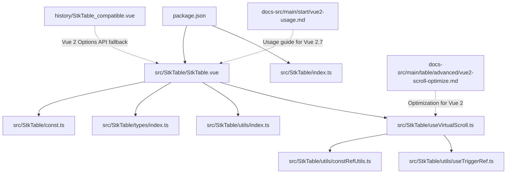
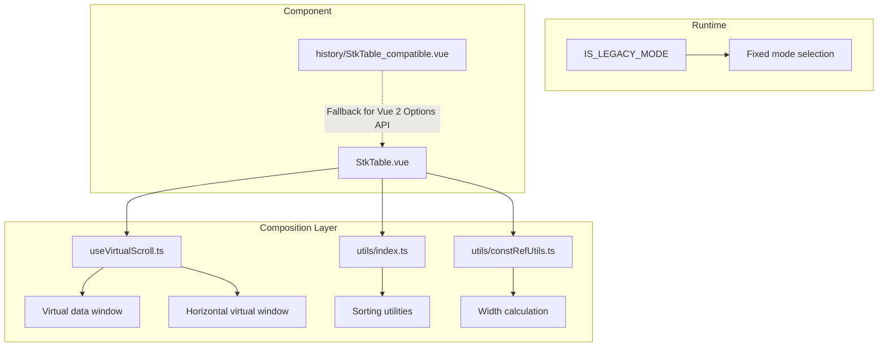
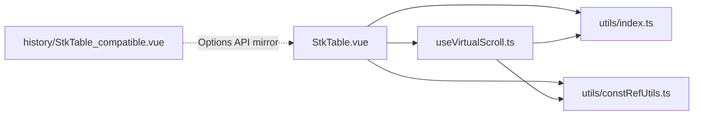

# Vue 2.7 Compatibility

<cite>
**Referenced Files in This Document**
- [package.json](file://package.json)
- [index.ts](file://src/StkTable/index.ts)
- [StkTable.vue](file://src/StkTable/StkTable.vue)
- [const.ts](file://src/StkTable/const.ts)
- [types/index.ts](file://src/StkTable/types/index.ts)
- [utils/index.ts](file://src/StkTable/utils/index.ts)
- [useVirtualScroll.ts](file://src/StkTable/useVirtualScroll.ts)
- [constRefUtils.ts](file://src/StkTable/utils/constRefUtils.ts)
- [useTriggerRef.ts](file://src/StkTable/utils/useTriggerRef.ts)
- [vue2-usage.md](file://docs-src/main/start/vue2-usage.md)
- [vue2-scroll-optimize.md](file://docs-src/main/table/advanced/vue2-scroll-optimize.md)
- [StkTable_compatible.vue](file://history/StkTable_compatible.vue)
</cite>

## Table of Contents
1. [Introduction](#introduction)
2. [Project Structure](#project-structure)
3. [Core Components](#core-components)
4. [Architecture Overview](#architecture-overview)
5. [Detailed Component Analysis](#detailed-component-analysis)
6. [Dependency Analysis](#dependency-analysis)
7. [Performance Considerations](#performance-considerations)
8. [Troubleshooting Guide](#troubleshooting-guide)
9. [Conclusion](#conclusion)
10. [Appendices](#appendices)

## Introduction
This document explains how this project supports Vue 2.7 alongside Vue 3, focusing on migration strategies, compatibility considerations, and implementation differences. It covers the dual-framework architecture, Vue 2.7-specific configuration, compatibility limitations, component registration patterns, template syntax differences, prop handling variations, and practical steps to maintain compatibility across both frameworks. It also addresses plugin registration, directive usage, and Composition API alternatives where applicable.

## Project Structure
The project is organized around a single primary component that targets both Vue 3 and Vue 2.7:
- The main component is authored as a Vue Single-File Component with TypeScript and the Composition API.
- A dedicated compatibility file exists for Vue 2.7 environments that require a traditional Options API approach.
- Documentation provides guidance for integrating the component in Vue 2.7 projects.

**Diagram sources**
- [package.json](file://package.json#L1-L76)
- [StkTable.vue](file://src/StkTable/StkTable.vue#L1-L800)
- [index.ts](file://src/StkTable/index.ts#L1-L5)
- [const.ts](file://src/StkTable/const.ts#L1-L51)
- [types/index.ts](file://src/StkTable/types/index.ts#L1-L318)
- [utils/index.ts](file://src/StkTable/utils/index.ts#L1-L288)
- [useVirtualScroll.ts](file://src/StkTable/useVirtualScroll.ts#L280-L479)
- [constRefUtils.ts](file://src/StkTable/utils/constRefUtils.ts#L1-L30)
- [useTriggerRef.ts](file://src/StkTable/utils/useTriggerRef.ts#L1-L34)
- [StkTable_compatible.vue](file://history/StkTable_compatible.vue#L1-L585)
- [vue2-usage.md](file://docs-src/main/start/vue2-usage.md#L1-L47)
- [vue2-scroll-optimize.md](file://docs-src/main/table/advanced/vue2-scroll-optimize.md#L1-L26)

**Section sources**
- [package.json](file://package.json#L1-L76)
- [StkTable.vue](file://src/StkTable/StkTable.vue#L1-L800)
- [index.ts](file://src/StkTable/index.ts#L1-L5)
- [StkTable_compatible.vue](file://history/StkTable_compatible.vue#L1-L585)
- [vue2-usage.md](file://docs-src/main/start/vue2-usage.md#L1-L47)
- [vue2-scroll-optimize.md](file://docs-src/main/table/advanced/vue2-scroll-optimize.md#L1-L26)

## Core Components
- StkTable.vue: The primary component implementing the table with virtualization, sorting, merging cells, fixed columns/headers, and advanced features. It uses the Composition API and TypeScript.
- const.ts: Defines constants including legacy mode detection and defaults.
- types/index.ts: Declares props, events, and types for the component.
- utils/index.ts: Provides shared utilities for sorting, comparison, throttling, and DOM helpers.
- useVirtualScroll.ts: Implements virtual scrolling logic with Vue 2.7-specific optimizations.
- utils/constRefUtils.ts and utils/useTriggerRef.ts: Utility helpers for width calculation and controlled refs.
- history/StkTable_compatible.vue: A Vue 2 Options API-compatible variant for environments that cannot use SFC + TS.

Key compatibility highlights:
- Legacy mode detection enables fallback rendering for older browsers.
- A dedicated prop optimizeVue2Scroll mitigates Vue 2 diff overhead during rapid scrolling.
- The component exports a named default for ES module consumers and registers styles via the index barrel.

**Section sources**
- [StkTable.vue](file://src/StkTable/StkTable.vue#L275-L476)
- [const.ts](file://src/StkTable/const.ts#L23-L30)
- [types/index.ts](file://src/StkTable/types/index.ts#L54-L120)
- [utils/index.ts](file://src/StkTable/utils/index.ts#L153-L207)
- [useVirtualScroll.ts](file://src/StkTable/useVirtualScroll.ts#L280-L479)
- [constRefUtils.ts](file://src/StkTable/utils/constRefUtils.ts#L1-L30)
- [useTriggerRef.ts](file://src/StkTable/utils/useTriggerRef.ts#L1-L34)
- [index.ts](file://src/StkTable/index.ts#L1-L5)
- [StkTable_compatible.vue](file://history/StkTable_compatible.vue#L128-L361)

## Architecture Overview
The component architecture centers on a Composition API SFC with modular composable logic for features like virtual scrolling, fixed columns, and highlighting. A runtime constant determines whether to use a legacy fixed-mode path for older browsers. A dedicated compatibility file provides a traditional Options API implementation for Vue 2.7 projects that cannot consume SFC + TS directly.

**Diagram sources**
- [const.ts](file://src/StkTable/const.ts#L23-L30)
- [useVirtualScroll.ts](file://src/StkTable/useVirtualScroll.ts#L280-L479)
- [utils/index.ts](file://src/StkTable/utils/index.ts#L153-L207)
- [constRefUtils.ts](file://src/StkTable/utils/constRefUtils.ts#L1-L30)
- [StkTable.vue](file://src/StkTable/StkTable.vue#L635-L788)
- [StkTable_compatible.vue](file://history/StkTable_compatible.vue#L128-L361)

## Detailed Component Analysis

### Vue 2.7 Dual-Framework Support
- The primary component is authored as a Vue 3 SFC with TypeScript and Composition API.
- Vue 2.7 projects can import the SFC directly if the build pipeline supports TypeScript parsing and SFC compilation.
- A fallback Options API component is provided for environments that cannot consume SFC + TS.

Migration guidance:
- Prefer importing the SFC in Vue 2.7 projects when possible.
- If SFC + TS is not feasible, use the compatibility file as a drop-in replacement.

**Section sources**
- [vue2-usage.md](file://docs-src/main/start/vue2-usage.md#L1-L47)
- [StkTable_compatible.vue](file://history/StkTable_compatible.vue#L1-L585)

### Template Syntax Differences
- Vue 3 SFC uses script setup and defineProps/defineEmits.
- Vue 2 Options API uses a traditional script block with a default export and explicit data/computed/watch/methods.

Key differences observed:
- Props definition placement and defaults differ between script setup and Options API.
- Emits are declared via defineEmits in Vue 3 vs. an emits property in Vue 2.
- Composition functions are invoked inside script setup; in Vue 2, logic is encapsulated in methods/computed.

**Section sources**
- [StkTable.vue](file://src/StkTable/StkTable.vue#L275-L621)
- [StkTable_compatible.vue](file://history/StkTable_compatible.vue#L128-L361)

### Prop Handling Variations
- Vue 3: Props are typed via defineProps with defaults and optional modifiers.
- Vue 2: Props are declared in the default export’s props object with types and defaults.

Compatibility considerations:
- Ensure prop defaults and types match between the two variants.
- Events emitted by the component must be mirrored in the Options API variant.

**Section sources**
- [StkTable.vue](file://src/StkTable/StkTable.vue#L275-L476)
- [StkTable_compatible.vue](file://history/StkTable_compatible.vue#L128-L155)

### Component Registration Patterns
- The index barrel exports the default component and related utilities/types.
- Consumers can import the component directly from the SFC or use the built distribution.

Best practices:
- Prefer the SFC import in Vue 2.7 projects if the build supports it.
- Otherwise, use the compatibility file.

**Section sources**
- [index.ts](file://src/StkTable/index.ts#L1-L5)
- [vue2-usage.md](file://docs-src/main/start/vue2-usage.md#L35-L47)

### Plugin Registration and Directives
- The component does not rely on global plugins or custom directives.
- It uses built-in directives (v-if, v-for, v-bind, v-model-like updates via update:columns) and standard DOM APIs.

Implications for Vue 2.7:
- No special plugin registration is required.
- Ensure the project’s Vue 2.7 runtime supports the directives used.

**Section sources**
- [StkTable.vue](file://src/StkTable/StkTable.vue#L2-L207)
- [StkTable_compatible.vue](file://history/StkTable_compatible.vue#L1-L108)

### Composition API Alternatives in Vue 2.7
- Vue 2.7 supports many Composition API features, enabling the use of script setup and reactive refs.
- For environments where script setup is unavailable, the Options API variant serves as a drop-in replacement.

Recommendations:
- Use script setup in Vue 2.7 when possible for consistency with Vue 3.
- Fall back to Options API only when necessary.

**Section sources**
- [vue2-usage.md](file://docs-src/main/start/vue2-usage.md#L1-L47)
- [StkTable_compatible.vue](file://history/StkTable_compatible.vue#L128-L361)

### Vue 2.7 Specific Configuration
- optimizeVue2Scroll: A boolean prop designed to mitigate Vue 2 diff overhead during rapid scrolling by deferring DOM updates slightly.
- Legacy mode: A runtime flag that forces relative fixed mode for older browsers.

Practical usage:
- Enable optimizeVue2Scroll when experiencing scroll jank in Vue 2.7.
- The component automatically selects fixed mode based on browser capabilities.

**Section sources**
- [StkTable.vue](file://src/StkTable/StkTable.vue#L380-L463)
- [useVirtualScroll.ts](file://src/StkTable/useVirtualScroll.ts#L393-L402)
- [useVirtualScroll.ts](file://src/StkTable/useVirtualScroll.ts#L464-L473)
- [const.ts](file://src/StkTable/const.ts#L23-L30)
- [vue2-scroll-optimize.md](file://docs-src/main/table/advanced/vue2-scroll-optimize.md#L1-L26)

### Step-by-Step Migration Guide
1. Install the package and ensure TypeScript parsing is available in your Vue 2.7 build.
2. Import the SFC directly if supported; otherwise, use the compatibility file.
3. Mirror props and events between the SFC and the compatibility variant.
4. Enable optimizeVue2Scroll if you observe scroll performance issues.
5. Validate fixed columns/headers behavior in older browsers; the component adapts automatically.

**Section sources**
- [vue2-usage.md](file://docs-src/main/start/vue2-usage.md#L1-L47)
- [StkTable.vue](file://src/StkTable/StkTable.vue#L380-L463)
- [useVirtualScroll.ts](file://src/StkTable/useVirtualScroll.ts#L393-L402)
- [useVirtualScroll.ts](file://src/StkTable/useVirtualScroll.ts#L464-L473)

### Common Compatibility Issues and Solutions
- SFC + TS not supported: Use the compatibility file as a direct replacement.
- Scroll performance in Vue 2.7: Enable optimizeVue2Scroll.
- Fixed columns in older browsers: The component detects legacy mode and switches to relative fixed mode.

**Section sources**
- [vue2-usage.md](file://docs-src/main/start/vue2-usage.md#L1-L47)
- [vue2-scroll-optimize.md](file://docs-src/main/table/advanced/vue2-scroll-optimize.md#L1-L26)
- [const.ts](file://src/StkTable/const.ts#L23-L30)

### Best Practices for Maintaining Compatibility
- Keep prop/event definitions synchronized between the SFC and the compatibility variant.
- Test fixed columns/headers in older browsers; rely on automatic legacy mode handling.
- Prefer script setup in Vue 2.7 when possible to reduce divergence.
- Use the optimizeVue2Scroll prop for improved scroll performance.

**Section sources**
- [StkTable.vue](file://src/StkTable/StkTable.vue#L380-L463)
- [useVirtualScroll.ts](file://src/StkTable/useVirtualScroll.ts#L393-L402)
- [useVirtualScroll.ts](file://src/StkTable/useVirtualScroll.ts#L464-L473)
- [const.ts](file://src/StkTable/const.ts#L23-L30)

## Dependency Analysis
The component depends on internal utilities and composables. The virtual scrolling module orchestrates data windows and scroll offsets, while utilities provide sorting and DOM helpers. The compatibility file duplicates the core logic in an Options API form.

**Diagram sources**
- [StkTable.vue](file://src/StkTable/StkTable.vue#L763-L788)
- [useVirtualScroll.ts](file://src/StkTable/useVirtualScroll.ts#L280-L479)
- [utils/index.ts](file://src/StkTable/utils/index.ts#L153-L207)
- [constRefUtils.ts](file://src/StkTable/utils/constRefUtils.ts#L1-L30)
- [StkTable_compatible.vue](file://history/StkTable_compatible.vue#L128-L361)

**Section sources**
- [StkTable.vue](file://src/StkTable/StkTable.vue#L763-L788)
- [useVirtualScroll.ts](file://src/StkTable/useVirtualScroll.ts#L280-L479)
- [utils/index.ts](file://src/StkTable/utils/index.ts#L153-L207)
- [constRefUtils.ts](file://src/StkTable/utils/constRefUtils.ts#L1-L30)
- [StkTable_compatible.vue](file://history/StkTable_compatible.vue#L128-L361)

## Performance Considerations
- Virtual scrolling reduces DOM nodes by rendering only visible items.
- optimizeVue2Scroll mitigates Vue 2 diff overhead by staggering DOM updates during rapid scroll.
- Legacy mode ensures fixed columns/headers remain functional on older browsers.

Recommendations:
- Enable optimizeVue2Scroll in Vue 2.7 projects with heavy virtualized lists.
- Prefer sticky positioning on modern browsers; the component falls back to relative mode when needed.

**Section sources**
- [useVirtualScroll.ts](file://src/StkTable/useVirtualScroll.ts#L393-L402)
- [useVirtualScroll.ts](file://src/StkTable/useVirtualScroll.ts#L464-L473)
- [const.ts](file://src/StkTable/const.ts#L23-L30)
- [vue2-scroll-optimize.md](file://docs-src/main/table/advanced/vue2-scroll-optimize.md#L1-L26)

## Troubleshooting Guide
Common issues and resolutions:
- SFC + TS build errors in Vue 2.7: Switch to the compatibility file.
- Scroll jank in Vue 2.7: Enable optimizeVue2Scroll.
- Fixed columns misaligned in older browsers: The component automatically uses relative fixed mode.

**Section sources**
- [vue2-usage.md](file://docs-src/main/start/vue2-usage.md#L1-L47)
- [vue2-scroll-optimize.md](file://docs-src/main/table/advanced/vue2-scroll-optimize.md#L1-L26)
- [const.ts](file://src/StkTable/const.ts#L23-L30)

## Conclusion
This project provides a robust, dual-framework solution supporting Vue 3 and Vue 2.7. By leveraging Composition API features available in Vue 2.7, the component maintains a single codebase while offering a compatibility fallback for environments that cannot consume SFC + TS. With targeted configuration like optimizeVue2Scroll and automatic legacy mode handling, teams can deliver consistent performance and behavior across both frameworks.

## Appendices

### API Summary: Props, Events, and Slots
- Props: Includes width, rowHeight, autoRowHeight, fixedMode, theme, virtual/virtualX, columns, dataSource, rowKey, colKey, emptyCellText, noDataFull, showNoData, sortRemote, showHeaderOverflow, showOverflow, rowHover, rowActive, cellHover, cellActive, selectedCellRevokable, cellSelection, headerDrag, rowClassName, colResizable, colMinWidth, bordered, autoResize, fixedColShadow, optimizeVue2Scroll, sortConfig, hideHeaderTitle, highlightConfig, seqConfig, expandConfig, dragRowConfig, treeConfig, cellFixedMode, smoothScroll, scrollRowByRow, scrollbar.
- Events: Comprehensive set covering sorting, row/cell interactions, drag-and-drop, scroll, and selection changes.
- Slots: tableHeader and empty placeholders for customization.

**Section sources**
- [StkTable.vue](file://src/StkTable/StkTable.vue#L275-L621)
- [types/index.ts](file://src/StkTable/types/index.ts#L54-L120)