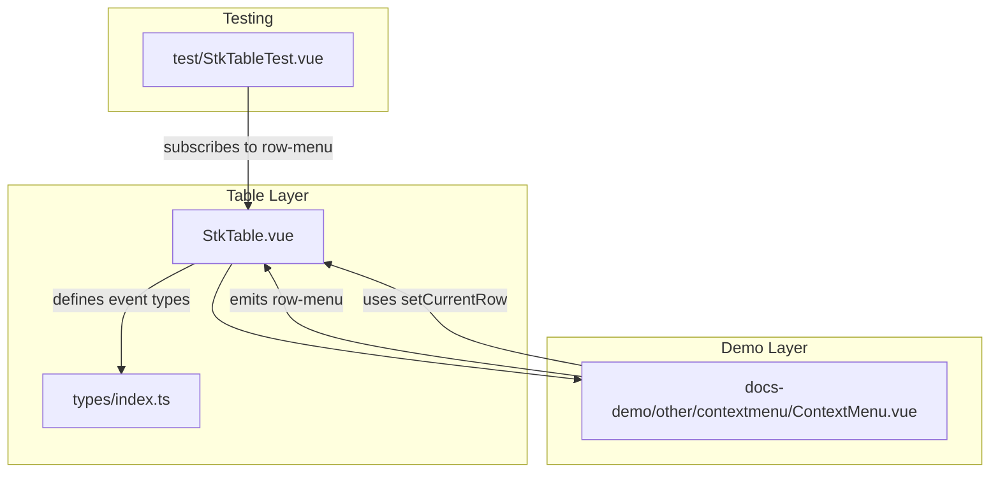
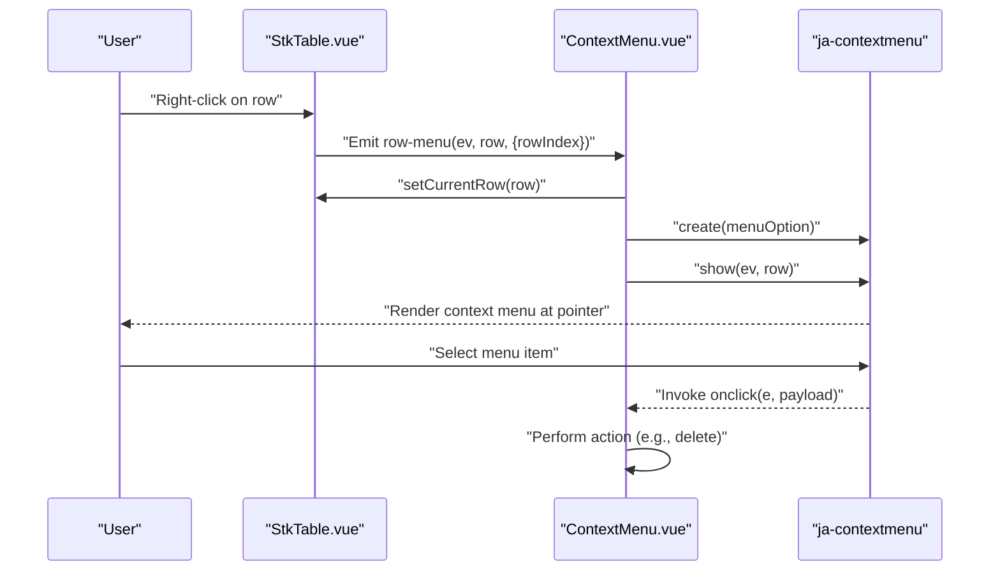
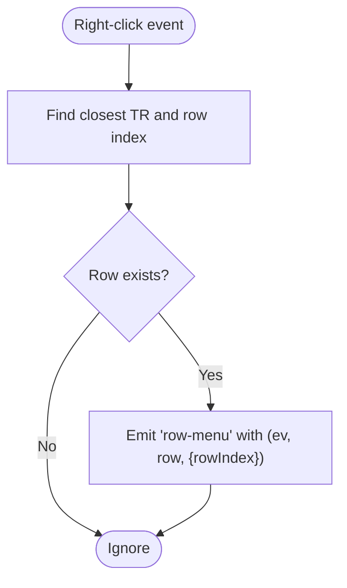
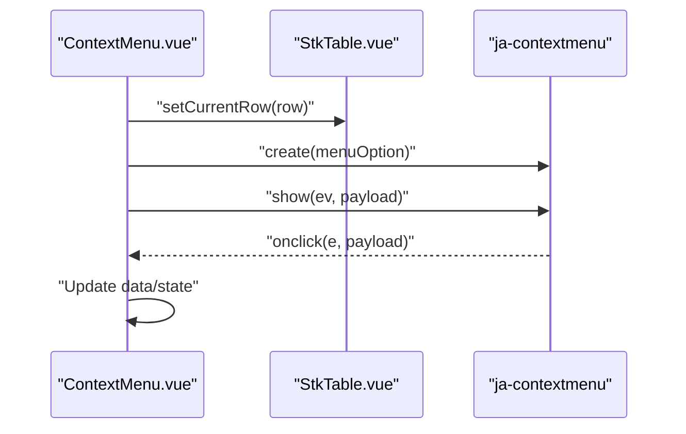
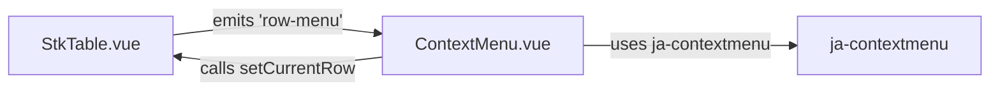

# Context Menus

<cite>
**Referenced Files in This Document**
- [ContextMenu.vue](file://docs-demo/other/contextmenu/ContextMenu.vue)
- [contextmenu.md](file://docs-src/main/other/contextmenu.md)
- [contextmenu.md (EN)](file://docs-src/en/main/other/contextmenu.md)
- [StkTable.vue](file://src/StkTable/StkTable.vue)
- [types/index.ts](file://src/StkTable/types/index.ts)
- [StkTableTest.vue](file://test/StkTableTest.vue)
</cite>

## Table of Contents
1. [Introduction](#introduction)
2. [Project Structure](#project-structure)
3. [Core Components](#core-components)
4. [Architecture Overview](#architecture-overview)
5. [Detailed Component Analysis](#detailed-component-analysis)
6. [Dependency Analysis](#dependency-analysis)
7. [Performance Considerations](#performance-considerations)
8. [Troubleshooting Guide](#troubleshooting-guide)
9. [Conclusion](#conclusion)
10. [Appendices](#appendices)

## Introduction
This document explains how to integrate custom context menus with the table component, focusing on right-click triggers, menu positioning, and menu item configuration. It covers how the table emits row and header context menu events, how to wire a third-party context menu library to those events, and how to build context-sensitive menus based on selection state and data. It also includes guidance on accessibility, browser compatibility, touch devices, and mobile-friendly alternatives.

## Project Structure
The context menu integration spans three primary areas:
- The table component emits row and header context menu events.
- A demo showcases integrating a third-party context menu library with the table.
- Tests demonstrate event handling and selection state updates.

**Diagram sources**
- [StkTable.vue](file://src/StkTable/StkTable.vue#L513-L520)
- [ContextMenu.vue](file://docs-demo/other/contextmenu/ContextMenu.vue#L60-L63)
- [types/index.ts](file://src/StkTable/types/index.ts#L54-L120)
- [StkTableTest.vue](file://test/StkTableTest.vue#L370-L372)

**Section sources**
- [StkTable.vue](file://src/StkTable/StkTable.vue#L57-L62)
- [StkTable.vue](file://src/StkTable/StkTable.vue#L1326-L1335)
- [ContextMenu.vue](file://docs-demo/other/contextmenu/ContextMenu.vue#L60-L63)
- [contextmenu.md](file://docs-src/main/other/contextmenu.md#L1-L46)
- [contextmenu.md (EN)](file://docs-src/en/main/other/contextmenu.md#L1-L46)

## Core Components
- Table emits row-menu and header-row-menu events on right-click.
- The demo integrates a third-party context menu library and passes the clicked row as payload.
- The demo uses setCurrentRow to synchronize selection state with the context menu action.

Key responsibilities:
- Trigger mechanism: right-click on a row or header.
- Positioning logic: the third-party library positions the menu at the mouse coordinates.
- Menu item configuration: items receive the payload (row data) and can mutate state or data.
- Selection integration: setCurrentRow ensures the selected row is highlighted and available to menu actions.

**Section sources**
- [StkTable.vue](file://src/StkTable/StkTable.vue#L57-L62)
- [StkTable.vue](file://src/StkTable/StkTable.vue#L1326-L1335)
- [ContextMenu.vue](file://docs-demo/other/contextmenu/ContextMenu.vue#L60-L63)
- [types/index.ts](file://src/StkTable/types/index.ts#L54-L120)

## Architecture Overview
The integration follows a publish-subscribe pattern:
- The table publishes row-menu and header-row-menu events.
- The consumer subscribes to these events and renders a context menu positioned at the event location.
- Actions inside the context menu can update selection state via setCurrentRow and modify data.

**Diagram sources**
- [StkTable.vue](file://src/StkTable/StkTable.vue#L57-L62)
- [StkTable.vue](file://src/StkTable/StkTable.vue#L1326-L1335)
- [ContextMenu.vue](file://docs-demo/other/contextmenu/ContextMenu.vue#L60-L63)

## Detailed Component Analysis

### Table Context Menu Events
- The table listens for right-click on rows and headers and emits row-menu and header-row-menu respectively.
- The emitted payload includes the MouseEvent, the row data, and the row index.

Implementation highlights:
- Row right-click handler computes the row index and emits row-menu with row and rowIndex.
- Header right-click handler emits header-row-menu with the MouseEvent.

**Diagram sources**
- [StkTable.vue](file://src/StkTable/StkTable.vue#L1326-L1335)

**Section sources**
- [StkTable.vue](file://src/StkTable/StkTable.vue#L57-L62)
- [StkTable.vue](file://src/StkTable/StkTable.vue#L1326-L1335)

### Demo: Context Menu Integration
- The demo creates a context menu instance and defines items that receive the payload (the clicked row).
- It synchronizes selection by calling setCurrentRow before showing the menu.
- Menu items can mutate data (e.g., delete a row) and optionally prevent the menu from closing.

**Diagram sources**
- [ContextMenu.vue](file://docs-demo/other/contextmenu/ContextMenu.vue#L60-L63)

**Section sources**
- [ContextMenu.vue](file://docs-demo/other/contextmenu/ContextMenu.vue#L37-L58)
- [ContextMenu.vue](file://docs-demo/other/contextmenu/ContextMenu.vue#L60-L63)

### Menu Item Configuration and Actions
- Items can be static or dynamic (computed label based on payload).
- Each item receives the MouseEvent and the payload (row data).
- Actions can:
  - Update selection state via setCurrentRow.
  - Modify data (e.g., delete, update).
  - Show confirm dialogs or alerts.
  - Return a value to control menu closing behavior (as supported by the library).

**Section sources**
- [ContextMenu.vue](file://docs-demo/other/contextmenu/ContextMenu.vue#L40-L58)
- [contextmenu.md](file://docs-src/main/other/contextmenu.md#L14-L40)
- [contextmenu.md (EN)](file://docs-src/en/main/other/contextmenu.md#L14-L40)

### Integration with Selection State
- The demo sets the current row before showing the menu to ensure the action operates on the intended row.
- The table’s setCurrentRow supports selecting by row object or key and can suppress emitting current-change if needed.

**Section sources**
- [ContextMenu.vue](file://docs-demo/other/contextmenu/ContextMenu.vue#L60-L63)
- [StkTable.vue](file://src/StkTable/StkTable.vue#L1534-L1575)

### Accessibility Considerations
- Keyboard-triggered context menus:
  - Provide an alternative activation method (e.g., a dedicated key combination) when right-click is unavailable.
  - Ensure focus management so that the context menu appears near the focused element.
- Screen readers:
  - Announce the context menu opening and available actions.
  - Provide skip links to avoid redundant announcements.
- Pointer alternatives:
  - On single-touch devices, offer a long-press gesture or a dedicated button to open the menu.
  - On hybrid devices, support both right-click and long-press.

[No sources needed since this section provides general guidance]

### Browser Compatibility and Touch Devices
- Right-click:
  - Works reliably on desktop browsers. Some mobile browsers emulate right-click under specific conditions; otherwise, use long-press or a dedicated button.
- Long-press:
  - Implement a pointerdown timer to detect long press and open the context menu.
- Touch gestures:
  - Use a two-finger tap or swipe to reveal a contextual menu on touch devices.
- Mobile-friendly alternatives:
  - Provide a “More” button per row that opens a simplified menu.
  - Offer a global “Actions” menu accessed via a floating action button.

[No sources needed since this section provides general guidance]

## Dependency Analysis
- The demo depends on a third-party context menu library for rendering and positioning.
- The table exposes row-menu and header-row-menu events for integration.
- The demo uses setCurrentRow to keep selection state synchronized with the context menu.

**Diagram sources**
- [StkTable.vue](file://src/StkTable/StkTable.vue#L57-L62)
- [ContextMenu.vue](file://docs-demo/other/contextmenu/ContextMenu.vue#L60-L63)

**Section sources**
- [StkTable.vue](file://src/StkTable/StkTable.vue#L513-L520)
- [ContextMenu.vue](file://docs-demo/other/contextmenu/ContextMenu.vue#L37-L58)

## Performance Considerations
- Avoid heavy computations in menu item handlers; precompute data when possible.
- Debounce or throttle repeated context menu triggers if users can rapidly move the pointer.
- Keep the menu lightweight; defer complex UI updates until after the menu closes.

[No sources needed since this section provides general guidance]

## Troubleshooting Guide
Common issues and resolutions:
- Menu does not appear:
  - Ensure the row-menu listener is attached and the event is not prevented elsewhere.
  - Verify the payload is passed to the menu show method.
- Wrong row targeted:
  - Confirm setCurrentRow is called with the correct row before showing the menu.
- Menu overlaps scrollable content:
  - Use a portal or absolute positioning strategy to render outside scroll containers.
- Disabled right-click context menu:
  - Provide an alternative activation method (long-press, dedicated button) for mobile and kiosk environments.

**Section sources**
- [StkTableTest.vue](file://test/StkTableTest.vue#L370-L372)
- [ContextMenu.vue](file://docs-demo/other/contextmenu/ContextMenu.vue#L60-L63)

## Conclusion
The table component provides robust right-click integration via row-menu and header-row-menu events. By combining these events with a third-party context menu library and synchronizing selection via setCurrentRow, you can deliver powerful, context-sensitive actions. Follow the accessibility and cross-device guidelines to ensure a consistent experience across platforms.

[No sources needed since this section summarizes without analyzing specific files]

## Appendices

### API Summary: Context Menu Events
- row-menu: Emitted when a row is right-clicked. Payload includes the MouseEvent, row data, and rowIndex.
- header-row-menu: Emitted when the header row is right-clicked. Payload includes the MouseEvent.

**Section sources**
- [StkTable.vue](file://src/StkTable/StkTable.vue#L513-L520)
- [StkTable.vue](file://src/StkTable/StkTable.vue#L1326-L1328)

### Example References
- Basic usage and installation instructions for the third-party context menu library.
- Live demo showcasing row-based context menu with dynamic labels and destructive actions.

**Section sources**
- [contextmenu.md](file://docs-src/main/other/contextmenu.md#L8-L46)
- [contextmenu.md (EN)](file://docs-src/en/main/other/contextmenu.md#L8-L46)
- [ContextMenu.vue](file://docs-demo/other/contextmenu/ContextMenu.vue#L29-L58)