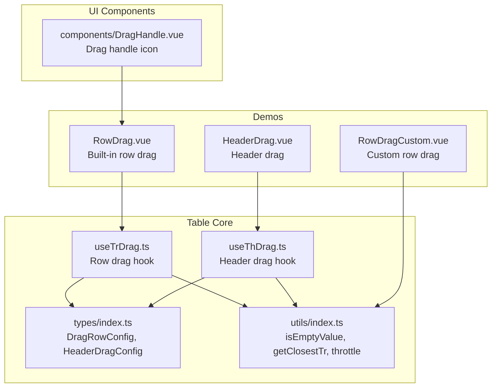
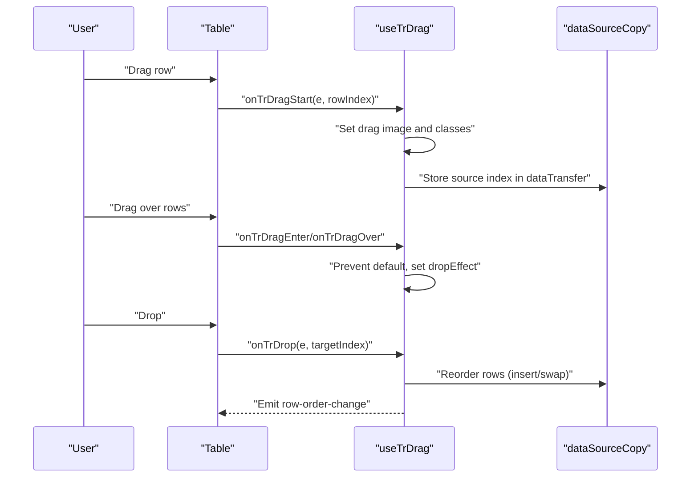
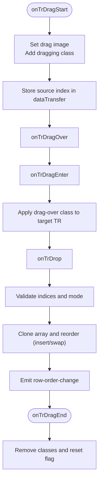
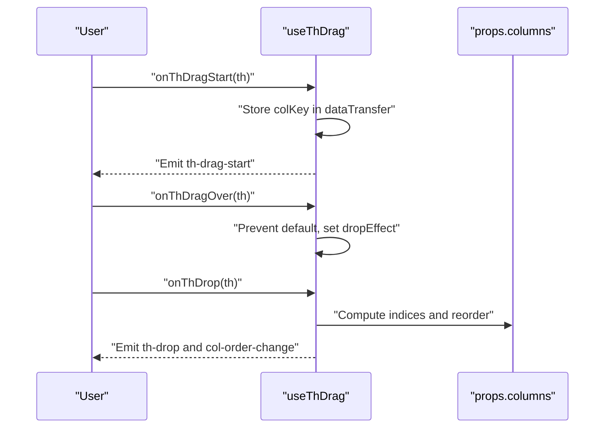
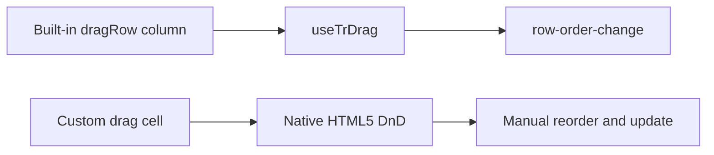
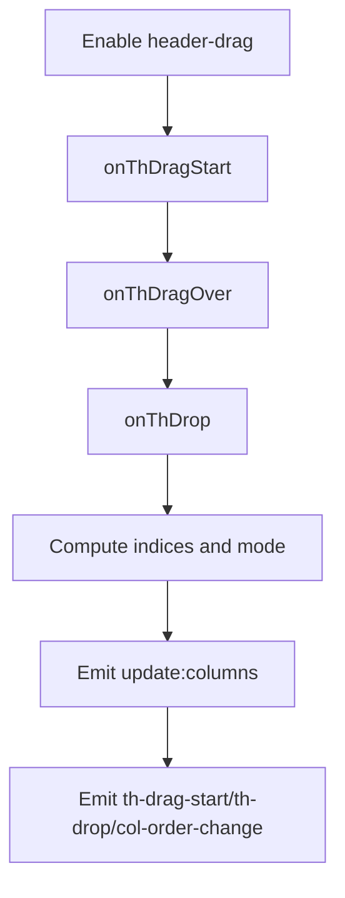
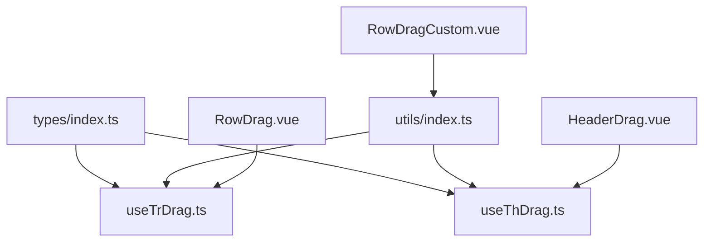

# Drag and Drop Functionality

<cite>
**Referenced Files in This Document**
- [useTrDrag.ts](file://src/StkTable/useTrDrag.ts)
- [useThDrag.ts](file://src/StkTable/useThDrag.ts)
- [DragHandle.vue](file://src/StkTable/components/DragHandle.vue)
- [index.ts](file://src/StkTable/types/index.ts)
- [index.ts](file://src/StkTable/utils/index.ts)
- [RowDrag.vue](file://docs-demo/advanced/row-drag/RowDrag.vue)
- [RowDragCustom.vue](file://docs-demo/advanced/row-drag/RowDragCustom.vue)
- [HeaderDrag.vue](file://docs-demo/advanced/header-drag/HeaderDrag.vue)
- [row-drag.md](file://docs-src/main/table/advanced/row-drag.md)
- [header-drag.md](file://docs-src/main/table/advanced/header-drag.md)
</cite>

## Table of Contents
1. [Introduction](#introduction)
2. [Project Structure](#project-structure)
3. [Core Components](#core-components)
4. [Architecture Overview](#architecture-overview)
5. [Detailed Component Analysis](#detailed-component-analysis)
6. [Dependency Analysis](#dependency-analysis)
7. [Performance Considerations](#performance-considerations)
8. [Troubleshooting Guide](#troubleshooting-guide)
9. [Conclusion](#conclusion)
10. [Appendices](#appendices)

## Introduction
This document explains the drag and drop functionality for row reordering and column reordering in the table. It covers:
- The built-in row drag mechanism via a dedicated column type and internal drag hooks
- The header drag mechanism for column reordering and visibility controls
- Visual indicators and drag handles
- Events, drop zones, and validation rules
- Examples of custom drag handles and integration with native HTML5 drag-and-drop
- Performance considerations for large datasets and smooth interactions

## Project Structure
The drag and drop features are implemented in composable hooks and integrated into the table component. Demo pages illustrate usage patterns for row and column dragging.

**Diagram sources**
- [useTrDrag.ts](file://src/StkTable/useTrDrag.ts#L1-L114)
- [useThDrag.ts](file://src/StkTable/useThDrag.ts#L1-L103)
- [index.ts](file://src/StkTable/types/index.ts#L249-L273)
- [index.ts](file://src/StkTable/utils/index.ts#L1-L288)
- [DragHandle.vue](file://src/StkTable/components/DragHandle.vue#L1-L10)
- [RowDrag.vue](file://docs-demo/advanced/row-drag/RowDrag.vue#L1-L53)
- [RowDragCustom.vue](file://docs-demo/advanced/row-drag/RowDragCustom.vue#L1-L176)
- [HeaderDrag.vue](file://docs-demo/advanced/header-drag/HeaderDrag.vue#L1-L39)

**Section sources**
- [useTrDrag.ts](file://src/StkTable/useTrDrag.ts#L1-L114)
- [useThDrag.ts](file://src/StkTable/useThDrag.ts#L1-L103)
- [index.ts](file://src/StkTable/types/index.ts#L249-L273)
- [index.ts](file://src/StkTable/utils/index.ts#L1-L288)
- [DragHandle.vue](file://src/StkTable/components/DragHandle.vue#L1-L10)
- [RowDrag.vue](file://docs-demo/advanced/row-drag/RowDrag.vue#L1-L53)
- [RowDragCustom.vue](file://docs-demo/advanced/row-drag/RowDragCustom.vue#L1-L176)
- [HeaderDrag.vue](file://docs-demo/advanced/header-drag/HeaderDrag.vue#L1-L39)

## Core Components
- Row drag hook: Implements HTML5 drag-and-drop for rows, supports insert and swap modes, and emits row order change events.
- Header drag hook: Enables column reordering and exposes events for drag start, drop, and order change.
- Drag handle component: Provides a reusable SVG-based drag handle for row dragging.
- Types: Define configuration shapes for dragRowConfig and headerDrag.

Key responsibilities:
- Row drag: Tracks drag state, applies visual feedback, validates indices, and updates data source accordingly.
- Header drag: Validates draggable state per column, computes insertion/sort indices, and emits update events.
- Drag handle: Encapsulates the visual indicator and draggable attribute.

**Section sources**
- [useTrDrag.ts](file://src/StkTable/useTrDrag.ts#L15-L114)
- [useThDrag.ts](file://src/StkTable/useThDrag.ts#L10-L103)
- [DragHandle.vue](file://src/StkTable/components/DragHandle.vue#L1-L10)
- [index.ts](file://src/StkTable/types/index.ts#L249-L273)

## Architecture Overview
The drag and drop architecture separates concerns:
- Hooks encapsulate drag logic and state
- Utilities provide shared helpers (DOM queries, validation)
- Types define configuration and event contracts
- Demos show integration patterns for both row and header dragging

**Diagram sources**
- [useTrDrag.ts](file://src/StkTable/useTrDrag.ts#L26-L103)

## Detailed Component Analysis

### Row Drag Hook (useTrDrag)
Implements HTML5 drag-and-drop for rows:
- Drag start: Sets drag image, adds dragging class, stores source index
- Drag over/enter: Prevents default, sets drop effect, toggles hover class
- Drop: Computes target index, validates indices, reorders data source, emits event
- Drag end: Cleans up classes and state

**Diagram sources**
- [useTrDrag.ts](file://src/StkTable/useTrDrag.ts#L26-L103)

**Section sources**
- [useTrDrag.ts](file://src/StkTable/useTrDrag.ts#L15-L114)
- [index.ts](file://src/StkTable/utils/index.ts#L245-L254)

### Header Drag Hook (useThDrag)
Enables column reordering via header drag:
- Computes drag configuration from props (mode, disabled predicate)
- On drag start: Stores column key in dataTransfer and emits start event
- On drag over: Validates draggable attribute and prevents default
- On drop: Compares start/end keys, reorders columns, emits update and order-change events

**Diagram sources**
- [useThDrag.ts](file://src/StkTable/useThDrag.ts#L28-L93)

**Section sources**
- [useThDrag.ts](file://src/StkTable/useThDrag.ts#L10-L103)
- [index.ts](file://src/StkTable/utils/index.ts#L5-L11)

### Drag Handle Component (DragHandle.vue)
Provides a reusable SVG-based drag handle:
- Marked as draggable
- Renders a series of small circles forming a handle icon

Usage example: Built-in row drag column type leverages this component internally.

**Section sources**
- [DragHandle.vue](file://src/StkTable/components/DragHandle.vue#L1-L10)

### Drag Events, Drop Zones, and Validation Rules
- Row drag events:
  - row-order-change(sourceIndex, targetIndex)
- Header drag events:
  - th-drag-start(dragStartKey)
  - th-drop(targetColKey)
  - col-order-change(dragStartKey, targetColKey)
- Validation rules:
  - Ignore drops when source equals target index/key
  - Skip reordering when mode is 'none'
  - Ensure column keys are present and valid before reordering

**Section sources**
- [useTrDrag.ts](file://src/StkTable/useTrDrag.ts#L80-L103)
- [useThDrag.ts](file://src/StkTable/useThDrag.ts#L56-L93)
- [index.ts](file://src/StkTable/utils/index.ts#L5-L11)

### Row Drag Implementation Patterns
- Built-in row drag:
  - Configure a column with type 'dragRow'
  - The table manages drag visuals and reordering automatically
- Custom row drag:
  - Implement native HTML5 drag-and-drop handlers on a custom cell
  - Manage visual feedback and data source updates manually

**Diagram sources**
- [RowDrag.vue](file://docs-demo/advanced/row-drag/RowDrag.vue#L14-L25)
- [RowDragCustom.vue](file://docs-demo/advanced/row-drag/RowDragCustom.vue#L18-L44)
- [useTrDrag.ts](file://src/StkTable/useTrDrag.ts#L105-L112)

**Section sources**
- [RowDrag.vue](file://docs-demo/advanced/row-drag/RowDrag.vue#L14-L25)
- [RowDragCustom.vue](file://docs-demo/advanced/row-drag/RowDragCustom.vue#L18-L44)
- [row-drag.md](file://docs-src/main/table/advanced/row-drag.md#L1-L30)

### Header Drag and Column Visibility Controls
- Enable header drag via props
- Reorder columns by emitting update:columns with reordered array
- Disable specific columns via headerDrag.disabled predicate
- Emit th-drag-start and th-drop for external integrations

**Diagram sources**
- [useThDrag.ts](file://src/StkTable/useThDrag.ts#L28-L93)
- [HeaderDrag.vue](file://docs-demo/advanced/header-drag/HeaderDrag.vue#L30-L37)

**Section sources**
- [useThDrag.ts](file://src/StkTable/useThDrag.ts#L10-L103)
- [header-drag.md](file://docs-src/main/table/advanced/header-drag.md#L1-L68)

### Integration with External Drag-and-Drop Libraries
- The custom row drag demo illustrates integrating native HTML5 drag-and-drop
- For third-party libraries, replace native handlers with library-specific callbacks
- Ensure to:
  - Preserve dataTransfer semantics for source/target identification
  - Apply visual feedback consistently with existing classes
  - Update the data source immutably and emit appropriate events

**Section sources**
- [RowDragCustom.vue](file://docs-demo/advanced/row-drag/RowDragCustom.vue#L58-L105)

## Dependency Analysis
- useTrDrag depends on:
  - DragRowConfig type for mode selection
  - Utility functions for DOM traversal and index extraction
- useThDrag depends on:
  - HeaderDragConfig type for mode and disabled predicate
  - Utility functions for value checks
- Both hooks rely on HTML5 DataTransfer and DOM events
- Demos depend on the hooks and types to demonstrate usage

**Diagram sources**
- [index.ts](file://src/StkTable/types/index.ts#L249-L273)
- [index.ts](file://src/StkTable/utils/index.ts#L1-L288)
- [useTrDrag.ts](file://src/StkTable/useTrDrag.ts#L1-L114)
- [useThDrag.ts](file://src/StkTable/useThDrag.ts#L1-L103)
- [RowDrag.vue](file://docs-demo/advanced/row-drag/RowDrag.vue#L1-L53)
- [RowDragCustom.vue](file://docs-demo/advanced/row-drag/RowDragCustom.vue#L1-L176)
- [HeaderDrag.vue](file://docs-demo/advanced/header-drag/HeaderDrag.vue#L1-L39)

**Section sources**
- [index.ts](file://src/StkTable/types/index.ts#L249-L273)
- [index.ts](file://src/StkTable/utils/index.ts#L1-L288)
- [useTrDrag.ts](file://src/StkTable/useTrDrag.ts#L1-L114)
- [useThDrag.ts](file://src/StkTable/useThDrag.ts#L1-L103)
- [RowDrag.vue](file://docs-demo/advanced/row-drag/RowDrag.vue#L1-L53)
- [RowDragCustom.vue](file://docs-demo/advanced/row-drag/RowDragCustom.vue#L1-L176)
- [HeaderDrag.vue](file://docs-demo/advanced/header-drag/HeaderDrag.vue#L1-L39)

## Performance Considerations
- Prefer immutable updates to avoid unnecessary mutations and to keep reactivity efficient
- For large datasets:
  - Minimize DOM reflows by batching visual changes (e.g., hover classes)
  - Use virtualization to reduce rendered nodes during drag operations
  - Avoid heavy computations inside drag handlers; precompute where possible
- Use throttling for frequent drag events if needed to reduce workload
- Keep drag images lightweight to prevent rendering overhead

[No sources needed since this section provides general guidance]

## Troubleshooting Guide
Common issues and resolutions:
- Drop does not trigger:
  - Ensure onTrDragOver prevents default behavior and sets dropEffect
  - Verify dataTransfer is available and contains the expected data
- Reordering not applied:
  - Confirm mode is not 'none'
  - Check that source and target indices are valid and different
- Header drag not working:
  - Ensure the column is marked as draggable and key attributes are present
  - Verify disabled predicate does not block the column unintentionally
- Visual feedback missing:
  - Confirm dragging and drag-over classes are applied and removed correctly

**Section sources**
- [useTrDrag.ts](file://src/StkTable/useTrDrag.ts#L42-L78)
- [useThDrag.ts](file://src/StkTable/useThDrag.ts#L42-L64)

## Conclusion
The table’s drag and drop system provides robust row and column reordering with clear separation of concerns. Built-in row drag simplifies integration, while header drag enables flexible column management. Custom implementations remain straightforward thanks to native HTML5 drag-and-drop support. Following the validation rules and performance recommendations ensures smooth interactions even with large datasets.

[No sources needed since this section summarizes without analyzing specific files]

## Appendices

### API Definitions
- Row drag configuration:
  - mode: 'none' | 'insert' | 'swap'
- Header drag configuration:
  - mode: 'none' | 'insert' | 'swap'
  - disabled: (col) => boolean

**Section sources**
- [index.ts](file://src/StkTable/types/index.ts#L249-L273)