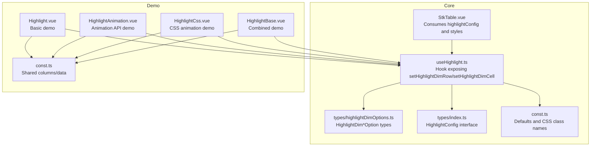
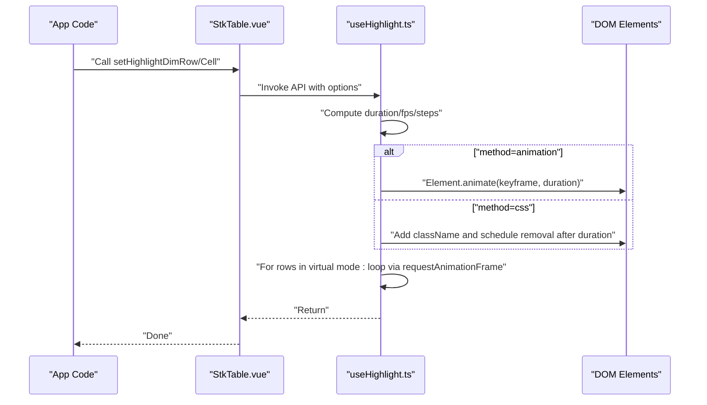
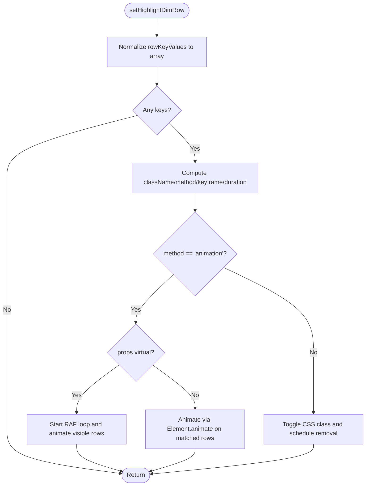
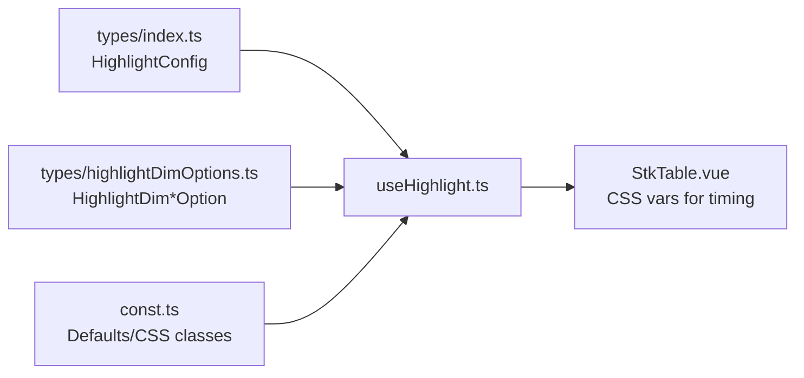

# Highlighting System

<cite>
**Referenced Files in This Document**
- [useHighlight.ts](file://src/StkTable/useHighlight.ts)
- [highlightDimOptions.ts](file://src/StkTable/types/highlightDimOptions.ts)
- [index.ts](file://src/StkTable/types/index.ts)
- [const.ts](file://src/StkTable/const.ts)
- [StkTable.vue](file://src/StkTable/StkTable.vue)
- [Highlight.vue](file://docs-demo/advanced/highlight/Highlight.vue)
- [HighlightAnimation.vue](file://docs-demo/advanced/highlight/HighlightAnimation.vue)
- [HighlightCss.vue](file://docs-demo/advanced/highlight/HighlightCss.vue)
- [HighlightBase.vue](file://docs-demo/advanced/highlight/HighlightBase.vue)
- [const.ts](file://docs-demo/advanced/highlight/const.ts)
- [highlight.md](file://docs-src/main/table/advanced/highlight.md)
</cite>

## Table of Contents
1. [Introduction](#introduction)
2. [Project Structure](#project-structure)
3. [Core Components](#core-components)
4. [Architecture Overview](#architecture-overview)
5. [Detailed Component Analysis](#detailed-component-analysis)
6. [Dependency Analysis](#dependency-analysis)
7. [Performance Considerations](#performance-considerations)
8. [Troubleshooting Guide](#troubleshooting-guide)
9. [Conclusion](#conclusion)
10. [Appendices](#appendices)

## Introduction
This document explains the highlighting system for rows and cells in the table component. It covers:
- The HighlightConfig interface and its properties duration and fps
- Programmatic highlighting APIs: setHighlightDimRow and setHighlightDimCell
- CSS-based and animation-based highlighting modes
- Highlight dimension options and their visual effects
- Practical examples and integration patterns with data manipulation workflows

## Project Structure
The highlighting system spans several modules:
- Hook that implements highlighting logic and exposes APIs
- Type definitions for highlight options and configuration
- Constants for default highlight behavior
- Demo components showcasing different highlighting approaches
- Documentation pages describing usage and behavior

**Diagram sources**
- [useHighlight.ts](file://src/StkTable/useHighlight.ts#L1-L258)
- [highlightDimOptions.ts](file://src/StkTable/types/highlightDimOptions.ts#L1-L27)
- [index.ts](file://src/StkTable/types/index.ts#L228-L233)
- [const.ts](file://src/StkTable/const.ts#L10-L21)
- [StkTable.vue](file://src/StkTable/StkTable.vue#L34-L38)
- [Highlight.vue](file://docs-demo/advanced/highlight/Highlight.vue#L1-L76)
- [HighlightAnimation.vue](file://docs-demo/advanced/highlight/HighlightAnimation.vue#L1-L70)
- [HighlightCss.vue](file://docs-demo/advanced/highlight/HighlightCss.vue#L1-L75)
- [HighlightBase.vue](file://docs-demo/advanced/highlight/HighlightBase.vue#L1-L122)
- [const.ts](file://docs-demo/advanced/highlight/const.ts#L1-L13)

**Section sources**
- [useHighlight.ts](file://src/StkTable/useHighlight.ts#L1-L258)
- [highlightDimOptions.ts](file://src/StkTable/types/highlightDimOptions.ts#L1-L27)
- [index.ts](file://src/StkTable/types/index.ts#L228-L233)
- [const.ts](file://src/StkTable/const.ts#L10-L21)
- [StkTable.vue](file://src/StkTable/StkTable.vue#L34-L38)
- [Highlight.vue](file://docs-demo/advanced/highlight/Highlight.vue#L1-L76)
- [HighlightAnimation.vue](file://docs-demo/advanced/highlight/HighlightAnimation.vue#L1-L70)
- [HighlightCss.vue](file://docs-demo/advanced/highlight/HighlightCss.vue#L1-L75)
- [HighlightBase.vue](file://docs-demo/advanced/highlight/HighlightBase.vue#L1-L122)
- [const.ts](file://docs-demo/advanced/highlight/const.ts#L1-L13)

## Core Components
- HighlightConfig: global configuration for highlight duration and fps
- HighlightDimRowOption and HighlightDimCellOption: per-call options controlling method, keyframe, className, and duration
- useHighlight hook: computes derived values (duration, fps/steps), manages animation loops, and exposes setHighlightDimRow and setHighlightDimCell
- StkTable.vue: consumes highlightConfig and applies CSS variables for timing

Key highlights:
- Duration defaults to a constant and can be overridden via HighlightConfig
- fps controls step-based easing for smoother animations
- Two rendering methods: animation (Element.animate) and css (class toggling with @keyframes)

**Section sources**
- [index.ts](file://src/StkTable/types/index.ts#L228-L233)
- [highlightDimOptions.ts](file://src/StkTable/types/highlightDimOptions.ts#L1-L27)
- [useHighlight.ts](file://src/StkTable/useHighlight.ts#L27-L65)
- [const.ts](file://src/StkTable/const.ts#L10-L21)
- [StkTable.vue](file://src/StkTable/StkTable.vue#L34-L38)

## Architecture Overview
The highlighting pipeline integrates configuration, animation computation, and DOM updates.

**Diagram sources**
- [useHighlight.ts](file://src/StkTable/useHighlight.ts#L109-L166)
- [useHighlight.ts](file://src/StkTable/useHighlight.ts#L172-L219)
- [useHighlight.ts](file://src/StkTable/useHighlight.ts#L70-L98)
- [StkTable.vue](file://src/StkTable/StkTable.vue#L34-L38)

## Detailed Component Analysis

### HighlightConfig and Options
- HighlightConfig
  - duration: total highlight duration in seconds
  - fps: frames per second for step-based timing; influences step count for easing
- HighlightDim*Option union types
  - Base: duration override
  - Animation variant: method='animation', optional keyframe; if keyframe provided, fps is ignored
  - Css variant: method='css', optional className, duration used to remove class after animation

Behavioral notes:
- When fps is set, the system derives step-based easing for smoother transitions
- Custom keyframe disables fps-driven steps
- CSS method requires duration to match the CSS animation length so the class is removed at the right time

**Section sources**
- [index.ts](file://src/StkTable/types/index.ts#L228-L233)
- [highlightDimOptions.ts](file://src/StkTable/types/highlightDimOptions.ts#L1-L27)
- [useHighlight.ts](file://src/StkTable/useHighlight.ts#L59-L65)
- [highlight.md](file://docs-src/main/table/advanced/highlight.md#L24-L43)

### setHighlightDimRow
Highlights one or more rows:
- Accepts an array of row keys
- Method selection:
  - animation: uses Element.animate; in virtual mode, starts a frame loop to update visibility and animate
  - css: toggles a CSS class and removes it after duration
- Virtual mode note: animation path uses a requestAnimationFrame loop to update visible rows and animate them progressively

**Diagram sources**
- [useHighlight.ts](file://src/StkTable/useHighlight.ts#L133-L166)
- [useHighlight.ts](file://src/StkTable/useHighlight.ts#L144-L161)
- [useHighlight.ts](file://src/StkTable/useHighlight.ts#L70-L98)

**Section sources**
- [useHighlight.ts](file://src/StkTable/useHighlight.ts#L133-L166)
- [useHighlight.ts](file://src/StkTable/useHighlight.ts#L70-L98)

### setHighlightDimCell
Highlights a single cell:
- Selects element by row and column keys
- Method selection:
  - animation: Element.animate with keyframe
  - css: toggles a CSS class and schedules removal after duration
- Virtual scrolling note: cell highlighting does not maintain persistent state across virtualization

**Section sources**
- [useHighlight.ts](file://src/StkTable/useHighlight.ts#L109-L123)

### CSS-Based Highlighting with HighlightCss
- Uses method='css'
- Requires className and duration aligned with CSS animation length
- Demonstrates custom @keyframes and scoped class application

Practical guidance:
- Ensure the CSS animation duration matches the provided duration
- Use :deep to apply styles to table internals if needed

**Section sources**
- [HighlightCss.vue](file://docs-demo/advanced/highlight/HighlightCss.vue#L1-L75)
- [highlight.md](file://docs-src/main/table/advanced/highlight.md#L69-L91)

### Animation-Based Highlighting with HighlightAnimation
- Uses method='animation' with custom keyframe
- Provides fine-grained control over color, transform, and easing
- Demonstrates dynamic keyframes and durations

**Section sources**
- [HighlightAnimation.vue](file://docs-demo/advanced/highlight/HighlightAnimation.vue#L1-L70)
- [highlight.md](file://docs-src/main/table/advanced/highlight.md#L47-L67)

### Combined Example with HighlightBase
- Mixes animation and CSS methods across rows and cells
- Demonstrates multiple intervals and varied durations

**Section sources**
- [HighlightBase.vue](file://docs-demo/advanced/highlight/HighlightBase.vue#L1-L122)

### Integration Patterns with Data Manipulation
Common workflows:
- After inserting a new row, highlight the inserted row immediately
- On periodic updates, highlight changed cells to draw attention
- Combine highlighting with sorting or filtering to emphasize reordering

Examples:
- Adding data and highlighting the newly inserted row
- Periodic cell highlighting at intervals

**Section sources**
- [Highlight.vue](file://docs-demo/advanced/highlight/Highlight.vue#L34-L48)
- [Highlight.vue](file://docs-demo/advanced/highlight/Highlight.vue#L17-L32)

## Dependency Analysis
The highlighting system depends on:
- HighlightConfig and option types
- Constants for default colors, duration, and CSS class names
- StkTable.vue consuming highlightConfig and applying CSS variables

**Diagram sources**
- [index.ts](file://src/StkTable/types/index.ts#L228-L233)
- [highlightDimOptions.ts](file://src/StkTable/types/highlightDimOptions.ts#L1-L27)
- [const.ts](file://src/StkTable/const.ts#L10-L21)
- [useHighlight.ts](file://src/StkTable/useHighlight.ts#L27-L65)
- [StkTable.vue](file://src/StkTable/StkTable.vue#L34-L38)

**Section sources**
- [index.ts](file://src/StkTable/types/index.ts#L228-L233)
- [highlightDimOptions.ts](file://src/StkTable/types/highlightDimOptions.ts#L1-L27)
- [const.ts](file://src/StkTable/const.ts#L10-L21)
- [useHighlight.ts](file://src/StkTable/useHighlight.ts#L27-L65)
- [StkTable.vue](file://src/StkTable/StkTable.vue#L34-L38)

## Performance Considerations
- Lower fps reduces CPU/GPU load by using step-based easing; beneficial for frequent highlights
- Animation API (Element.animate) is generally efficient; in virtual mode, a single RAF loop updates visible rows
- CSS method relies on class toggling and setTimeout; ensure duration matches CSS animation length to avoid flicker
- Avoid excessive concurrent highlights; batch row highlights by passing arrays to leverage single DOM updates

[No sources needed since this section provides general guidance]

## Troubleshooting Guide
Common issues and resolutions:
- Highlight not visible
  - Ensure rowKey is configured; the system selects rows by row key
  - Verify correct className and duration when using CSS method
- Animation appears choppy
  - Reduce fps to lower computational overhead
  - Avoid custom keyframe if relying on fps-driven steps
- CSS class remains after animation
  - Match duration to CSS animation length; the system removes the class after duration

**Section sources**
- [highlight.md](file://docs-src/main/table/advanced/highlight.md#L7-L11)
- [highlight.md](file://docs-src/main/table/advanced/highlight.md#L36-L43)
- [highlight.md](file://docs-src/main/table/advanced/highlight.md#L79-L81)

## Conclusion
The highlighting system offers flexible, performant ways to draw attention to rows and cells:
- Configure global duration and fps via HighlightConfig
- Choose between animation and CSS methods per call
- Use animation for dynamic effects and CSS for simplicity and compatibility
- Integrate highlighting into data manipulation workflows for immediate user feedback

[No sources needed since this section summarizes without analyzing specific files]

## Appendices

### API Reference Summary
- setHighlightDimRow(rowKeyValues, option?)
  - Highlights one or more rows
  - Option supports method, className, keyframe, duration
- setHighlightDimCell(rowKeyValue, colKeyValue, option?)
  - Highlights a single cell
  - Option supports method, className, keyframe, duration
- HighlightConfig
  - duration: seconds
  - fps: frames per second (controls step-based easing)

**Section sources**
- [useHighlight.ts](file://src/StkTable/useHighlight.ts#L109-L166)
- [index.ts](file://src/StkTable/types/index.ts#L228-L233)
- [highlight.md](file://docs-src/main/table/advanced/highlight.md#L108-L135)