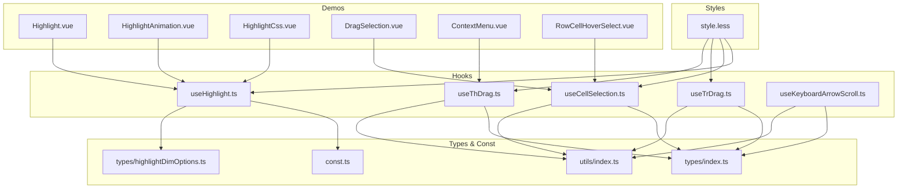
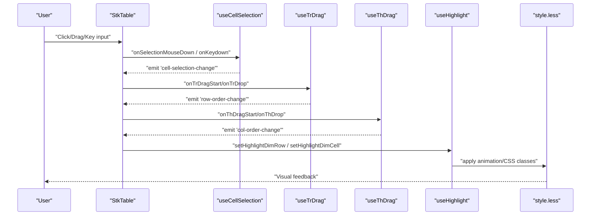
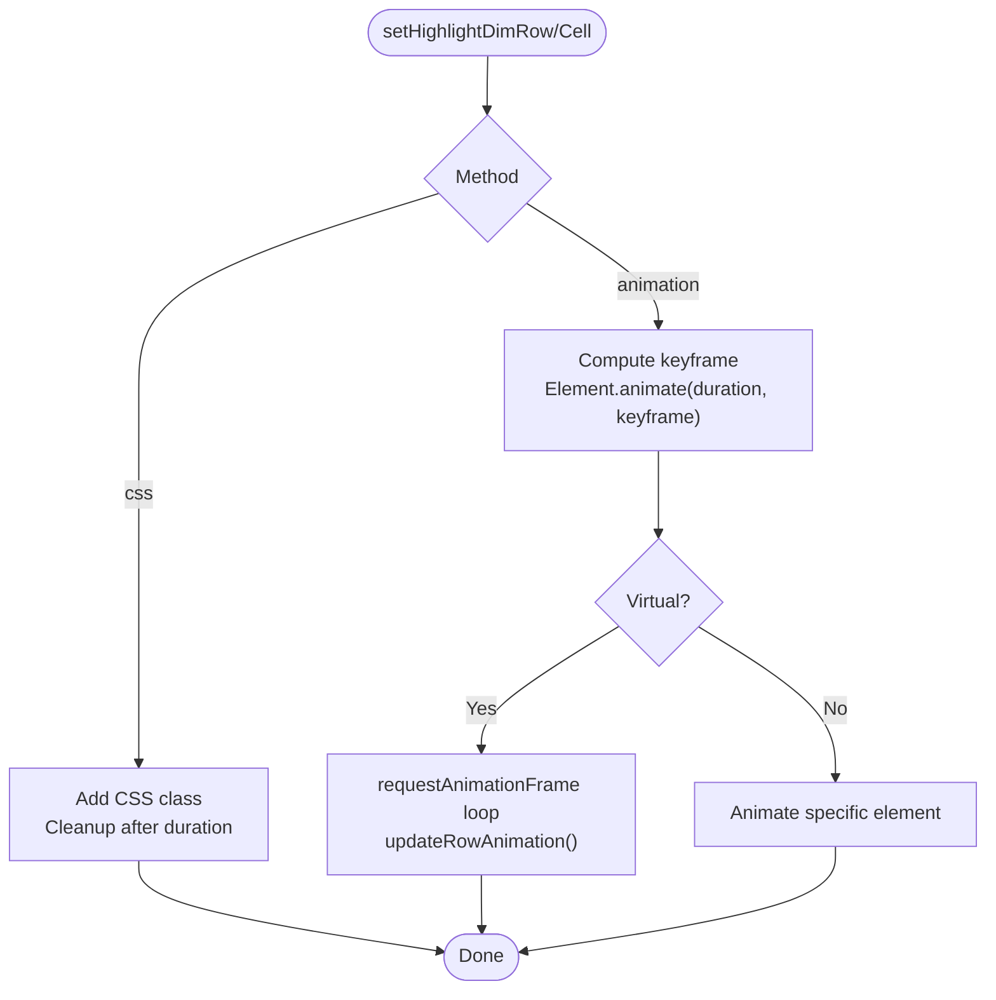
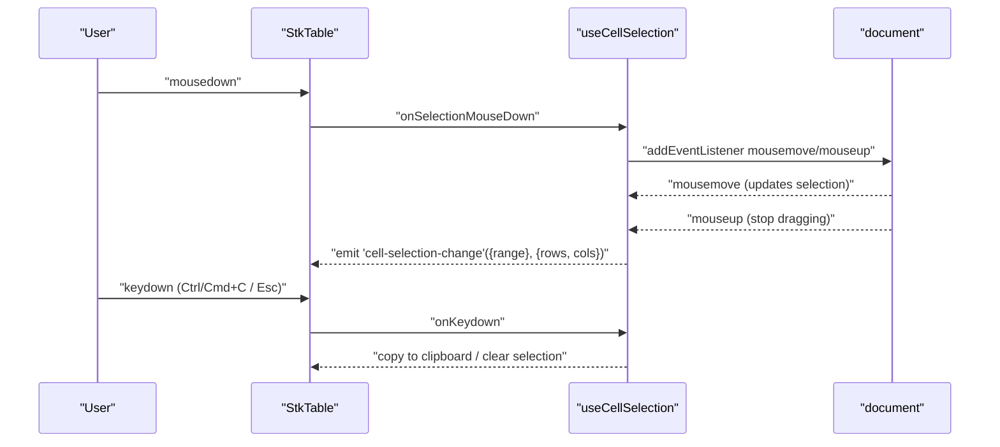
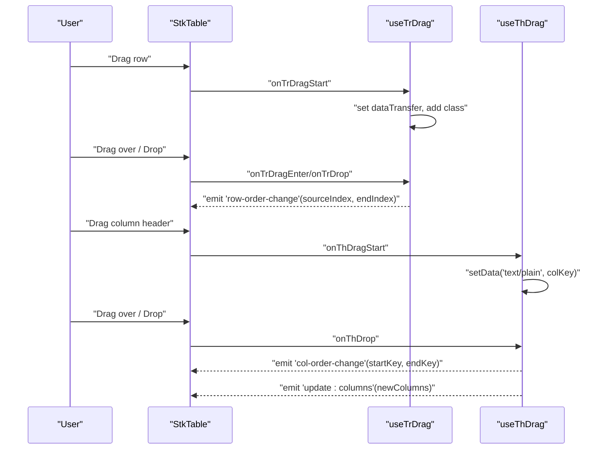
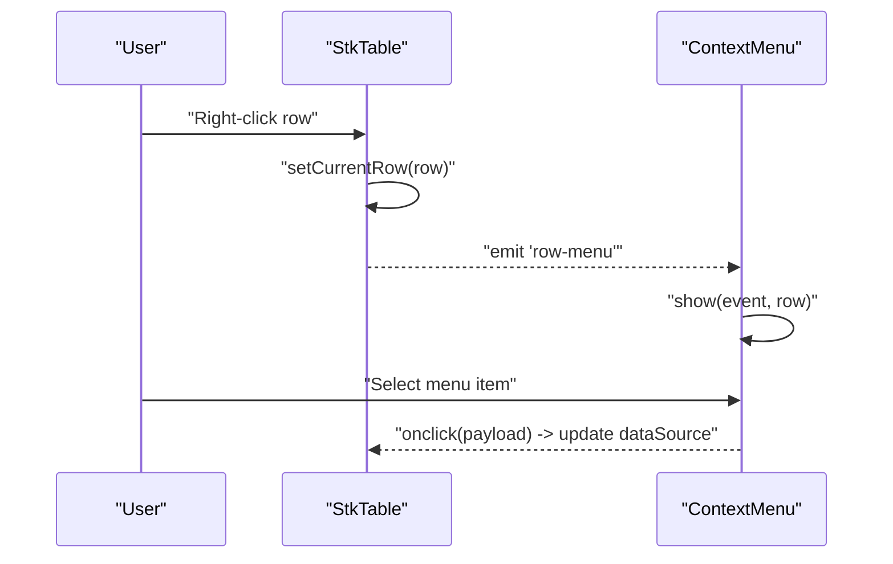
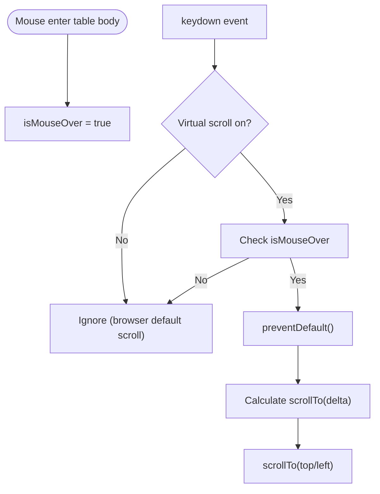
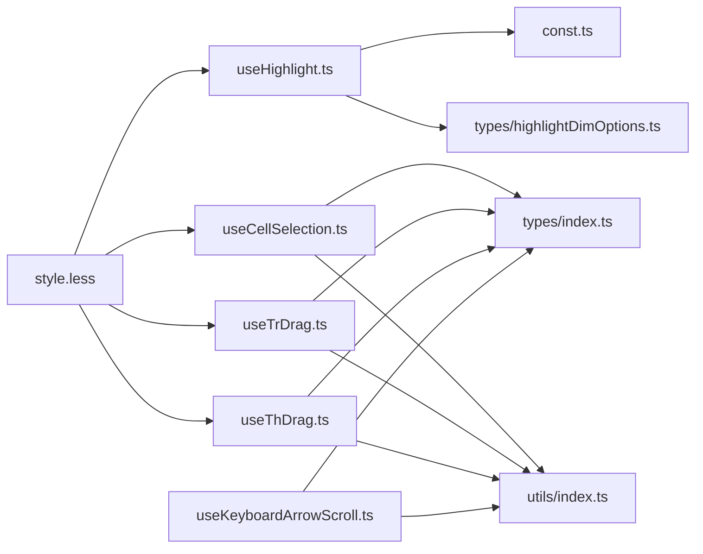

# Interaction Features

<cite>
**Referenced Files in This Document**
- [useHighlight.ts](file://src/StkTable/useHighlight.ts)
- [useCellSelection.ts](file://src/StkTable/useCellSelection.ts)
- [useTrDrag.ts](file://src/StkTable/useTrDrag.ts)
- [useThDrag.ts](file://src/StkTable/useThDrag.ts)
- [useKeyboardArrowScroll.ts](file://src/StkTable/useKeyboardArrowScroll.ts)
- [const.ts](file://src/StkTable/const.ts)
- [types/index.ts](file://src/StkTable/types/index.ts)
- [types/highlightDimOptions.ts](file://src/StkTable/types/highlightDimOptions.ts)
- [style.less](file://src/StkTable/style.less)
- [utils/index.ts](file://src/StkTable/utils/index.ts)
- [Highlight.vue](file://docs-demo/advanced/highlight/Highlight.vue)
- [HighlightAnimation.vue](file://docs-demo/advanced/highlight/HighlightAnimation.vue)
- [HighlightCss.vue](file://docs-demo/advanced/highlight/HighlightCss.vue)
- [DragSelection.vue](file://docs-demo/advanced/drag-selection/DragSelection.vue)
- [ContextMenu.vue](file://docs-demo/other/contextmenu/ContextMenu.vue)
- [RowCellHoverSelect.vue](file://docs-demo/basic/row-cell-mouse-event/RowCellHoverSelect.vue)
</cite>

## Table of Contents
1. [Introduction](#introduction)
2. [Project Structure](#project-structure)
3. [Core Components](#core-components)
4. [Architecture Overview](#architecture-overview)
5. [Detailed Component Analysis](#detailed-component-analysis)
6. [Dependency Analysis](#dependency-analysis)
7. [Performance Considerations](#performance-considerations)
8. [Troubleshooting Guide](#troubleshooting-guide)
9. [Conclusion](#conclusion)
10. [Appendices](#appendices)

## Introduction
This document focuses on the interaction features of the table, covering:
- Highlighting system for rows and cells with CSS and animation methods
- Selection mechanisms for rows and cells, including keyboard navigation and mouse interactions
- Drag-and-drop functionality for reordering rows and columns
- Context menu integration, mouse event handling, and hover effects
- Keyboard shortcuts, accessibility considerations, and touch interaction support
- Implementation examples and integration patterns with external systems

## Project Structure
The interaction features are implemented via composable hooks and documented demo pages:
- useHighlight: manages row/cell highlighting with animation and CSS methods
- useCellSelection: handles cell selection, drag selection, keyboard copy, and auto-scroll during selection
- useTrDrag: enables row reordering via HTML5 drag-and-drop
- useThDrag: enables column reordering via HTML5 drag-and-drop
- useKeyboardArrowScroll: provides keyboard arrow navigation for virtual scrolling
- Styles and constants define CSS animations, classes, and theme-aware variables
- Demo pages illustrate usage patterns and integration

**Diagram sources**
- [useHighlight.ts](file://src/StkTable/useHighlight.ts#L1-L258)
- [useCellSelection.ts](file://src/StkTable/useCellSelection.ts#L1-L453)
- [useTrDrag.ts](file://src/StkTable/useTrDrag.ts#L1-L114)
- [useThDrag.ts](file://src/StkTable/useThDrag.ts#L1-L103)
- [useKeyboardArrowScroll.ts](file://src/StkTable/useKeyboardArrowScroll.ts#L1-L113)
- [types/index.ts](file://src/StkTable/types/index.ts#L1-L318)
- [types/highlightDimOptions.ts](file://src/StkTable/types/highlightDimOptions.ts#L1-L27)
- [const.ts](file://src/StkTable/const.ts#L1-L51)
- [utils/index.ts](file://src/StkTable/utils/index.ts#L1-L288)
- [style.less](file://src/StkTable/style.less#L1-L691)
- [Highlight.vue](file://docs-demo/advanced/highlight/Highlight.vue#L1-L76)
- [HighlightAnimation.vue](file://docs-demo/advanced/highlight/HighlightAnimation.vue#L1-L70)
- [HighlightCss.vue](file://docs-demo/advanced/highlight/HighlightCss.vue#L1-L75)
- [DragSelection.vue](file://docs-demo/advanced/drag-selection/DragSelection.vue#L1-L59)
- [ContextMenu.vue](file://docs-demo/other/contextmenu/ContextMenu.vue#L1-L92)
- [RowCellHoverSelect.vue](file://docs-demo/basic/row-cell-mouse-event/RowCellHoverSelect.vue#L1-L83)

**Section sources**
- [useHighlight.ts](file://src/StkTable/useHighlight.ts#L1-L258)
- [useCellSelection.ts](file://src/StkTable/useCellSelection.ts#L1-L453)
- [useTrDrag.ts](file://src/StkTable/useTrDrag.ts#L1-L114)
- [useThDrag.ts](file://src/StkTable/useThDrag.ts#L1-L103)
- [useKeyboardArrowScroll.ts](file://src/StkTable/useKeyboardArrowScroll.ts#L1-L113)
- [style.less](file://src/StkTable/style.less#L1-L691)
- [types/index.ts](file://src/StkTable/types/index.ts#L1-L318)
- [types/highlightDimOptions.ts](file://src/StkTable/types/highlightDimOptions.ts#L1-L27)
- [const.ts](file://src/StkTable/const.ts#L1-L51)
- [utils/index.ts](file://src/StkTable/utils/index.ts#L1-L288)
- [Highlight.vue](file://docs-demo/advanced/highlight/Highlight.vue#L1-L76)
- [HighlightAnimation.vue](file://docs-demo/advanced/highlight/HighlightAnimation.vue#L1-L70)
- [HighlightCss.vue](file://docs-demo/advanced/highlight/HighlightCss.vue#L1-L75)
- [DragSelection.vue](file://docs-demo/advanced/drag-selection/DragSelection.vue#L1-L59)
- [ContextMenu.vue](file://docs-demo/other/contextmenu/ContextMenu.vue#L1-L92)
- [RowCellHoverSelect.vue](file://docs-demo/basic/row-cell-mouse-event/RowCellHoverSelect.vue#L1-L83)

## Core Components
- Highlighting system
  - Methods: setHighlightDimRow, setHighlightDimCell
  - Modes: animation (Element.animate), CSS (@keyframes)
  - Configurable duration and FPS for animation steps
  - Theme-aware colors and CSS classes
- Cell selection
  - Drag selection with Shift modifier, auto-scroll near edges
  - Keyboard shortcuts: Copy (Ctrl/Cmd+C) and Clear (Esc)
  - Emits selection range and sliced rows/columns
- Row/column drag-and-drop
  - Rows: HTML5 drag-and-drop with move effect and drop handlers
  - Columns: Header drag-and-drop with insert/swap modes
- Keyboard navigation
  - Arrow keys, Page Up/Down, Home/End for virtual scrolling
  - Requires mouse hover to activate
- Hover and active states
  - Row hover/active and cell hover/active via CSS classes
  - Context menu integration via row-menu events

**Section sources**
- [useHighlight.ts](file://src/StkTable/useHighlight.ts#L27-L256)
- [useCellSelection.ts](file://src/StkTable/useCellSelection.ts#L40-L451)
- [useTrDrag.ts](file://src/StkTable/useTrDrag.ts#L19-L112)
- [useThDrag.ts](file://src/StkTable/useThDrag.ts#L14-L101)
- [useKeyboardArrowScroll.ts](file://src/StkTable/useKeyboardArrowScroll.ts#L32-L112)
- [style.less](file://src/StkTable/style.less#L187-L257)

## Architecture Overview
The interaction features are composed into the table via composable hooks. The highlighting hook orchestrates animation and CSS paths, while selection and drag hooks manage user gestures and emit events. Styles provide the visual feedback and transitions.

**Diagram sources**
- [useCellSelection.ts](file://src/StkTable/useCellSelection.ts#L132-L332)
- [useTrDrag.ts](file://src/StkTable/useTrDrag.ts#L26-L103)
- [useThDrag.ts](file://src/StkTable/useThDrag.ts#L29-L93)
- [useHighlight.ts](file://src/StkTable/useHighlight.ts#L109-L166)
- [style.less](file://src/StkTable/style.less#L462-L596)

## Detailed Component Analysis

### Highlighting System
Highlights rows and cells with two animation methods:
- Animation API: Uses Element.animate with configurable keyframes and steps derived from FPS
- CSS keyframes: Adds/removes CSS classes with duration-based cleanup

Key behaviors:
- Duration and FPS control animation timing
- Steps-based easing for frame-perfect transitions
- Virtual vs non-virtual rendering paths
- Theme-aware colors (light/dark)
- Automatic cleanup of timeouts for CSS mode

**Diagram sources**
- [useHighlight.ts](file://src/StkTable/useHighlight.ts#L109-L166)
- [useHighlight.ts](file://src/StkTable/useHighlight.ts#L227-L250)
- [const.ts](file://src/StkTable/const.ts#L10-L21)
- [style.less](file://src/StkTable/style.less#L462-L596)

**Section sources**
- [useHighlight.ts](file://src/StkTable/useHighlight.ts#L27-L256)
- [types/highlightDimOptions.ts](file://src/StkTable/types/highlightDimOptions.ts#L1-L27)
- [const.ts](file://src/StkTable/const.ts#L10-L21)
- [style.less](file://src/StkTable/style.less#L462-L596)
- [Highlight.vue](file://docs-demo/advanced/highlight/Highlight.vue#L17-L32)
- [HighlightAnimation.vue](file://docs-demo/advanced/highlight/HighlightAnimation.vue#L10-L27)
- [HighlightCss.vue](file://docs-demo/advanced/highlight/HighlightCss.vue#L8-L39)

### Selection Mechanisms (Rows and Cells)
Selection supports:
- Mouse drag selection with anchor and Shift expansion
- Auto-scroll near edges during drag selection
- Keyboard shortcuts:
  - Copy selection to clipboard (Ctrl/Cmd+C)
  - Clear selection (Esc)
- Emits selection range and sliced data for rows/columns

**Diagram sources**
- [useCellSelection.ts](file://src/StkTable/useCellSelection.ts#L132-L332)
- [DragSelection.vue](file://docs-demo/advanced/drag-selection/DragSelection.vue#L39-L51)

**Section sources**
- [useCellSelection.ts](file://src/StkTable/useCellSelection.ts#L40-L451)
- [DragSelection.vue](file://docs-demo/advanced/drag-selection/DragSelection.vue#L1-L59)
- [style.less](file://src/StkTable/style.less#L229-L257)

### Drag-and-Drop: Reordering Rows and Columns
Row reordering:
- Uses HTML5 drag-and-drop with custom drag image positioning
- Supports insert and swap modes
- Emits row-order-change event

Column reordering:
- Drags header cells to reorder columns
- Supports insert and swap modes
- Emits col-order-change and updates columns prop

**Diagram sources**
- [useTrDrag.ts](file://src/StkTable/useTrDrag.ts#L26-L103)
- [useThDrag.ts](file://src/StkTable/useThDrag.ts#L29-L93)

**Section sources**
- [useTrDrag.ts](file://src/StkTable/useTrDrag.ts#L19-L112)
- [useThDrag.ts](file://src/StkTable/useThDrag.ts#L14-L101)
- [ContextMenu.vue](file://docs-demo/other/contextmenu/ContextMenu.vue#L60-L63)

### Context Menu Integration and Mouse Events
Context menu integration:
- External library ja-contextmenu is used
- Table exposes setCurrentRow and row-menu event
- Menu items operate on the clicked row payload

Mouse event handling:
- Hover and active states for rows and cells via CSS classes
- Demo toggles rowHover, cellHover, rowActive, cellActive, and selectedCellRevokable

**Diagram sources**
- [ContextMenu.vue](file://docs-demo/other/contextmenu/ContextMenu.vue#L60-L63)
- [RowCellHoverSelect.vue](file://docs-demo/basic/row-cell-mouse-event/RowCellHoverSelect.vue#L37-L43)

**Section sources**
- [ContextMenu.vue](file://docs-demo/other/contextmenu/ContextMenu.vue#L1-L92)
- [RowCellHoverSelect.vue](file://docs-demo/basic/row-cell-mouse-event/RowCellHoverSelect.vue#L1-L83)
- [style.less](file://src/StkTable/style.less#L187-L222)

### Keyboard Navigation and Shortcuts
Keyboard arrow scrolling:
- Activates when mouse is over the table body
- Supports ArrowUp/Down/Right/Left, PageUp/Down, Home/End
- Virtual scrolling aware, respects header height and row height

Keyboard shortcuts in selection:
- Copy selection to clipboard (Ctrl/Cmd+C)
- Clear selection (Esc)

**Diagram sources**
- [useKeyboardArrowScroll.ts](file://src/StkTable/useKeyboardArrowScroll.ts#L64-L97)

**Section sources**
- [useKeyboardArrowScroll.ts](file://src/StkTable/useKeyboardArrowScroll.ts#L32-L112)
- [useCellSelection.ts](file://src/StkTable/useCellSelection.ts#L347-L396)

### Accessibility and Touch Support
Accessibility:
- Keyboard navigation requires mouse hover to activate
- CSS hover/active states provide visual focus feedback
- Clipboard copy uses standard browser APIs

Touch support:
- Drag-and-drop relies on HTML5 DragEvent APIs
- No explicit touch-specific gesture handling is present in the analyzed files

[No sources needed since this section provides general guidance]

## Dependency Analysis
Inter-module dependencies and coupling:
- useHighlight depends on constants for colors and classes, and types for options
- useCellSelection depends on utils for closest element queries and types for selection config
- useTrDrag and useThDrag depend on utils for DOM queries and types for drag configs
- style.less defines CSS classes consumed by all interaction features
- Demos integrate hooks and expose public methods (e.g., setCurrentRow, setSelectedCell)

**Diagram sources**
- [useHighlight.ts](file://src/StkTable/useHighlight.ts#L1-L258)
- [useCellSelection.ts](file://src/StkTable/useCellSelection.ts#L1-L453)
- [useTrDrag.ts](file://src/StkTable/useTrDrag.ts#L1-L114)
- [useThDrag.ts](file://src/StkTable/useThDrag.ts#L1-L103)
- [useKeyboardArrowScroll.ts](file://src/StkTable/useKeyboardArrowScroll.ts#L1-L113)
- [types/index.ts](file://src/StkTable/types/index.ts#L1-L318)
- [types/highlightDimOptions.ts](file://src/StkTable/types/highlightDimOptions.ts#L1-L27)
- [const.ts](file://src/StkTable/const.ts#L1-L51)
- [utils/index.ts](file://src/StkTable/utils/index.ts#L1-L288)
- [style.less](file://src/StkTable/style.less#L1-L691)

**Section sources**
- [useHighlight.ts](file://src/StkTable/useHighlight.ts#L1-L258)
- [useCellSelection.ts](file://src/StkTable/useCellSelection.ts#L1-L453)
- [useTrDrag.ts](file://src/StkTable/useTrDrag.ts#L1-L114)
- [useThDrag.ts](file://src/StkTable/useThDrag.ts#L1-L103)
- [useKeyboardArrowScroll.ts](file://src/StkTable/useKeyboardArrowScroll.ts#L1-L113)
- [style.less](file://src/StkTable/style.less#L1-L691)

## Performance Considerations
- Animation FPS and steps: Configure highlightConfig.fps to balance smoothness and CPU usage
- Virtual scrolling: useKeyboardArrowScroll is virtual-aware and avoids unnecessary scroll calculations
- Auto-scroll during selection: throttled via requestAnimationFrame loops; stops when outside edges
- CSS vs animation: CSS mode adds/removes classes and relies on browser animation engine; animation mode uses Element.animate for precise control
- Drag-and-drop: Uses native HTML5 APIs; minimal overhead beyond DOM queries and class toggling

[No sources needed since this section provides general guidance]

## Troubleshooting Guide
Common issues and resolutions:
- Highlight not visible
  - Ensure rowKey matches the element id pattern used by the highlighting hook
  - Verify theme-aware colors and CSS classes are applied
- Selection does not copy to clipboard
  - Confirm browser supports navigator.clipboard and page is secure (HTTPS)
  - Ensure cellSelection.formatCellForClipboard returns strings for all cells
- Drag-and-drop not working
  - Verify draggable attributes and dataTransfer usage in header cells
  - Check that drop targets accept the dragged data type
- Keyboard navigation inactive
  - Ensure mouse is hovering over the table body when pressing arrow keys
  - Confirm virtual scrolling is enabled and row height/header height are set appropriately

**Section sources**
- [useHighlight.ts](file://src/StkTable/useHighlight.ts#L109-L166)
- [useCellSelection.ts](file://src/StkTable/useCellSelection.ts#L347-L396)
- [useTrDrag.ts](file://src/StkTable/useTrDrag.ts#L26-L103)
- [useThDrag.ts](file://src/StkTable/useThDrag.ts#L29-L93)
- [useKeyboardArrowScroll.ts](file://src/StkTable/useKeyboardArrowScroll.ts#L64-L97)

## Conclusion
The interaction features provide a robust foundation for user engagement:
- Highlighting supports both animation and CSS paths with theme-aware visuals
- Selection integrates mouse and keyboard interactions with clipboard support
- Drag-and-drop enables intuitive reordering of rows and columns
- Context menus and hover states enhance usability
- Keyboard navigation and virtual scrolling improve accessibility and performance

[No sources needed since this section summarizes without analyzing specific files]

## Appendices
Integration patterns:
- Highlighting
  - Use setHighlightDimRow for row feedback after data mutations
  - Use setHighlightDimCell for targeted cell feedback
  - Customize animation keyframes and duration via highlightConfig
- Selection
  - Enable cellSelection and listen to cell-selection-change for downstream actions
  - Provide formatCellForClipboard to match custom cell rendering
- Drag-and-drop
  - For rows: configure dragRowConfig.mode as insert or swap
  - For columns: configure headerDrag.mode similarly and handle col-order-change
- Context menu
  - Bind setCurrentRow and row-menu to show external context menus
- Hover and active states
  - Toggle rowHover, cellHover, rowActive, cellActive, and selectedCellRevokable via props

**Section sources**
- [Highlight.vue](file://docs-demo/advanced/highlight/Highlight.vue#L11-L14)
- [HighlightAnimation.vue](file://docs-demo/advanced/highlight/HighlightAnimation.vue#L12-L20)
- [HighlightCss.vue](file://docs-demo/advanced/highlight/HighlightCss.vue#L11-L18)
- [DragSelection.vue](file://docs-demo/advanced/drag-selection/DragSelection.vue#L7-L10)
- [ContextMenu.vue](file://docs-demo/other/contextmenu/ContextMenu.vue#L60-L63)
- [RowCellHoverSelect.vue](file://docs-demo/basic/row-cell-mouse-event/RowCellHoverSelect.vue#L12-L20)