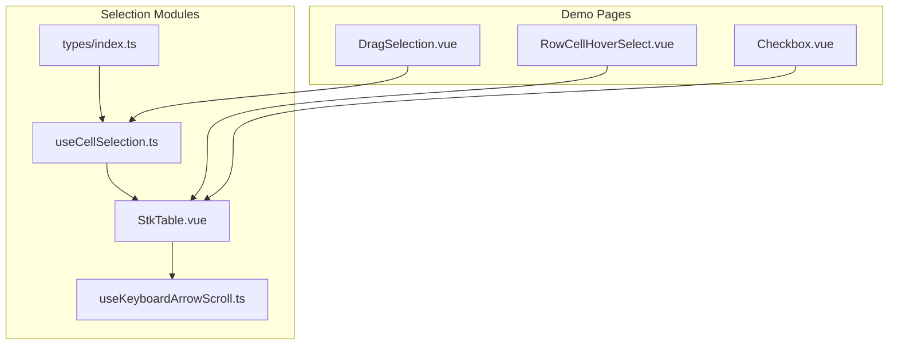
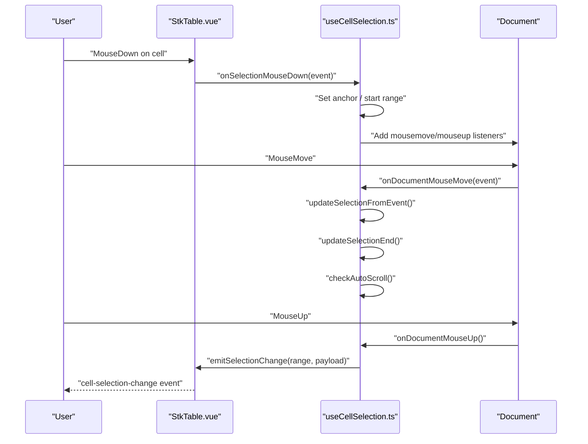
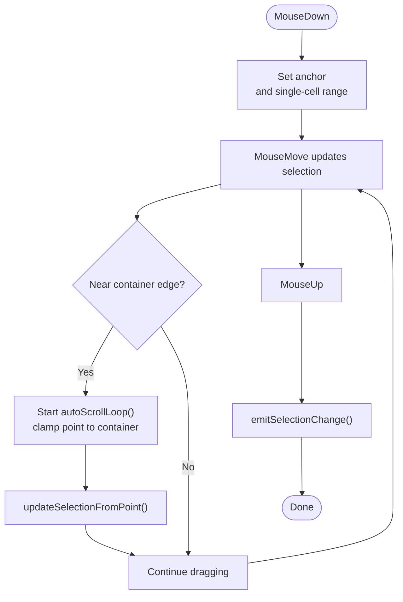
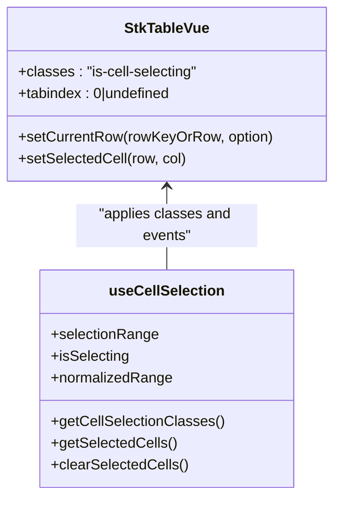
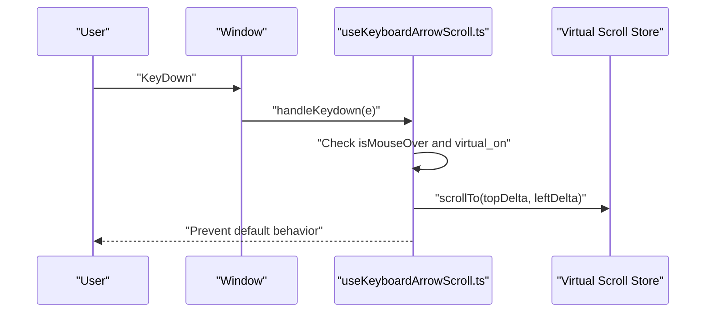
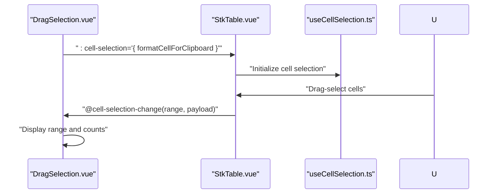
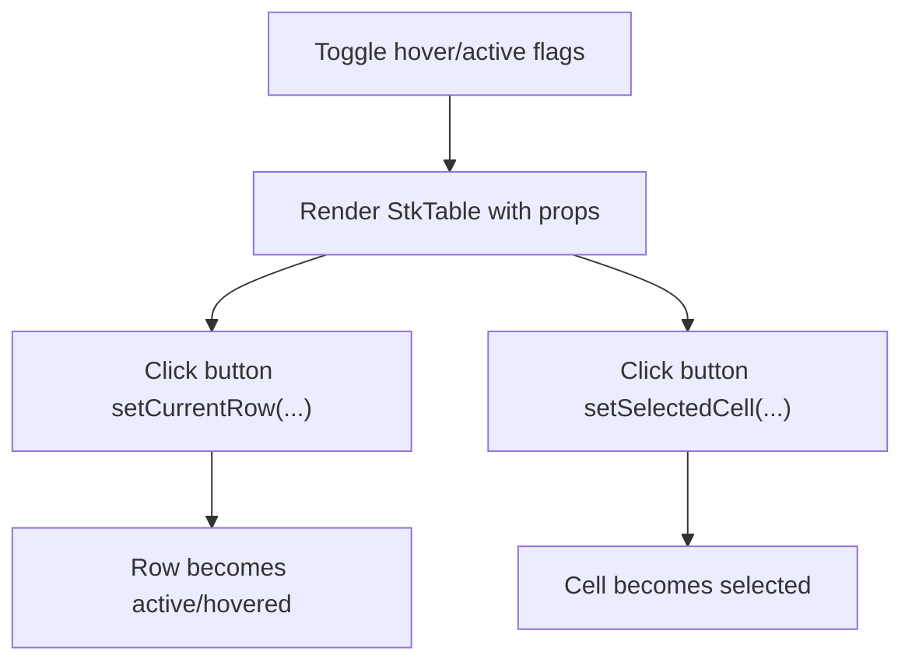
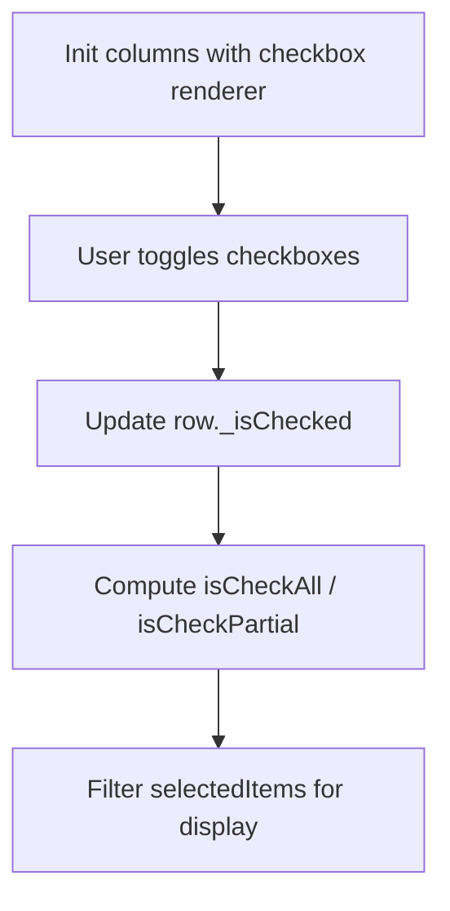
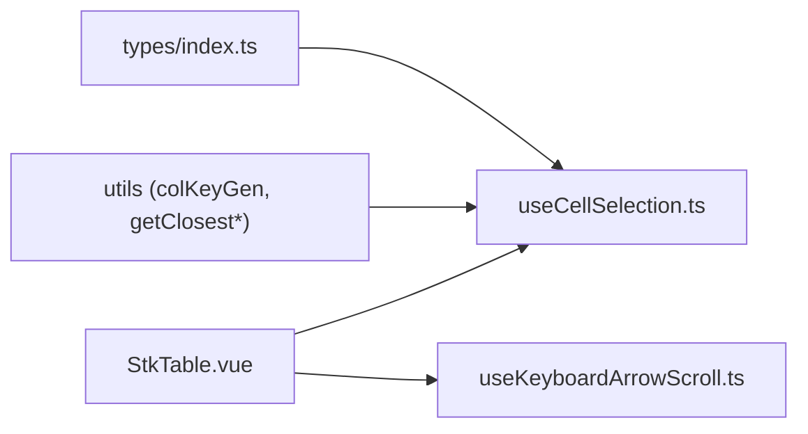

# Selection Systems

<cite>
**Referenced Files in This Document**
- [useCellSelection.ts](file://src/StkTable/useCellSelection.ts)
- [types/index.ts](file://src/StkTable/types/index.ts)
- [StkTable.vue](file://src/StkTable/StkTable.vue)
- [useKeyboardArrowScroll.ts](file://src/StkTable/useKeyboardArrowScroll.ts)
- [DragSelection.vue](file://docs-demo/advanced/drag-selection/DragSelection.vue)
- [RowCellHoverSelect.vue](file://docs-demo/basic/row-cell-mouse-event/RowCellHoverSelect.vue)
- [Checkbox.vue](file://docs-demo/basic/checkbox/Checkbox.vue)
- [checkbox.md](file://docs-src/main/table/basic/checkbox.md)
</cite>

## Table of Contents
1. [Introduction](#introduction)
2. [Project Structure](#project-structure)
3. [Core Components](#core-components)
4. [Architecture Overview](#architecture-overview)
5. [Detailed Component Analysis](#detailed-component-analysis)
6. [Dependency Analysis](#dependency-analysis)
7. [Performance Considerations](#performance-considerations)
8. [Troubleshooting Guide](#troubleshooting-guide)
9. [Conclusion](#conclusion)
10. [Appendices](#appendices)

## Introduction
This document explains the selection systems implemented in the table library, covering:
- Cell selection via drag selection with range computation and keyboard copy
- Hover-based selection states for rows and cells
- Checkbox-based selection patterns for multi-select scenarios
- Keyboard navigation and accessibility considerations
- Programmatic selection APIs and integration with external controls

It consolidates the internal implementation and official documentation examples to help both developers and users build robust selection experiences.

## Project Structure
The selection systems span several modules:
- Cell selection logic and utilities
- Table component integration and state classes
- Keyboard navigation helpers
- Demo pages showcasing drag selection, hover selection, and checkbox-based selection

**Diagram sources**
- [useCellSelection.ts](file://src/StkTable/useCellSelection.ts#L42-L51)
- [types/index.ts](file://src/StkTable/types/index.ts#L298-L317)
- [StkTable.vue](file://src/StkTable/StkTable.vue#L28-L30)
- [useKeyboardArrowScroll.ts](file://src/StkTable/useKeyboardArrowScroll.ts#L32-L35)
- [DragSelection.vue](file://docs-demo/advanced/drag-selection/DragSelection.vue#L1-L15)
- [RowCellHoverSelect.vue](file://docs-demo/basic/row-cell-mouse-event/RowCellHoverSelect.vue#L1-L20)
- [Checkbox.vue](file://docs-demo/basic/checkbox/Checkbox.vue#L1-L20)

**Section sources**
- [useCellSelection.ts](file://src/StkTable/useCellSelection.ts#L1-L51)
- [types/index.ts](file://src/StkTable/types/index.ts#L298-L317)
- [StkTable.vue](file://src/StkTable/StkTable.vue#L28-L30)
- [useKeyboardArrowScroll.ts](file://src/StkTable/useKeyboardArrowScroll.ts#L32-L35)
- [DragSelection.vue](file://docs-demo/advanced/drag-selection/DragSelection.vue#L1-L15)
- [RowCellHoverSelect.vue](file://docs-demo/basic/row-cell-mouse-event/RowCellHoverSelect.vue#L1-L20)
- [Checkbox.vue](file://docs-demo/basic/checkbox/Checkbox.vue#L1-L20)

## Core Components
- Cell selection engine: Provides drag selection, range normalization, auto-scroll during drag, keyboard copy, and selection classes for styling.
- Table integration: Exposes selection state classes and tabindex for accessibility.
- Keyboard navigation: Handles arrow/page/home/end scrolling while maintaining focus inside the table body.
- Demo integrations: Showcases drag selection events, hover selection toggles, and checkbox-based multi-select.

Key exports and types:
- CellSelectionRange and CellSelectionConfig types
- useCellSelection hook exposing selectionRange, isSelecting, selectedCellKeys, normalizedRange, event handlers, and helpers
- Table classes for selection visuals and keyboard focus

**Section sources**
- [types/index.ts](file://src/StkTable/types/index.ts#L298-L317)
- [useCellSelection.ts](file://src/StkTable/useCellSelection.ts#L42-L51)
- [useCellSelection.ts](file://src/StkTable/useCellSelection.ts#L446-L456)
- [StkTable.vue](file://src/StkTable/StkTable.vue#L28-L30)
- [useKeyboardArrowScroll.ts](file://src/StkTable/useKeyboardArrowScroll.ts#L65-L97)

## Architecture Overview
The selection pipeline connects user interactions to state updates and emits structured events.

**Diagram sources**
- [useCellSelection.ts](file://src/StkTable/useCellSelection.ts#L137-L172)
- [useCellSelection.ts](file://src/StkTable/useCellSelection.ts#L175-L201)
- [useCellSelection.ts](file://src/StkTable/useCellSelection.ts#L217-L235)
- [useCellSelection.ts](file://src/StkTable/useCellSelection.ts#L320-L330)
- [useCellSelection.ts](file://src/StkTable/useCellSelection.ts#L333-L345)

## Detailed Component Analysis

### Cell Selection Engine (useCellSelection)
Responsibilities:
- Track selection range and anchor point
- Normalize ranges for consistent styling and payload
- Compute selected cell keys for fast membership checks
- Handle drag selection with Shift extension and auto-scroll near edges
- Emit selection change events with rows and columns payload
- Support keyboard shortcuts: Escape to clear, Ctrl/Cmd+C to copy formatted selection
- Provide programmatic helpers: getSelectedCells, clearSelectedCells

Highlights:
- Range normalization ensures min/max boundaries regardless of drag direction
- Auto-scroll uses requestAnimationFrame and clamps elementFromPoint to container bounds
- Clipboard formatting callback allows customizing copied text per column

**Diagram sources**
- [useCellSelection.ts](file://src/StkTable/useCellSelection.ts#L137-L172)
- [useCellSelection.ts](file://src/StkTable/useCellSelection.ts#L175-L201)
- [useCellSelection.ts](file://src/StkTable/useCellSelection.ts#L217-L282)
- [useCellSelection.ts](file://src/StkTable/useCellSelection.ts#L320-L345)

**Section sources**
- [useCellSelection.ts](file://src/StkTable/useCellSelection.ts#L17-L24)
- [useCellSelection.ts](file://src/StkTable/useCellSelection.ts#L75-L95)
- [useCellSelection.ts](file://src/StkTable/useCellSelection.ts#L98-L102)
- [useCellSelection.ts](file://src/StkTable/useCellSelection.ts#L137-L172)
- [useCellSelection.ts](file://src/StkTable/useCellSelection.ts#L175-L201)
- [useCellSelection.ts](file://src/StkTable/useCellSelection.ts#L217-L282)
- [useCellSelection.ts](file://src/StkTable/useCellSelection.ts#L320-L345)
- [useCellSelection.ts](file://src/StkTable/useCellSelection.ts#L357-L401)
- [useCellSelection.ts](file://src/StkTable/useCellSelection.ts#L426-L444)

### Table Integration and Accessibility
- Adds selection-related classes to the table container for styling selected ranges and drag state
- Sets tabindex when cellSelection is enabled to allow keyboard focus and copy actions
- Exposes programmatic setters for current row and selected cell

**Diagram sources**
- [StkTable.vue](file://src/StkTable/StkTable.vue#L28-L30)
- [StkTable.vue](file://src/StkTable/StkTable.vue#L3256-L3266)
- [useCellSelection.ts](file://src/StkTable/useCellSelection.ts#L409-L422)
- [useCellSelection.ts](file://src/StkTable/useCellSelection.ts#L426-L444)

**Section sources**
- [StkTable.vue](file://src/StkTable/StkTable.vue#L28-L30)
- [StkTable.vue](file://src/StkTable/StkTable.vue#L3256-L3266)

### Keyboard Navigation and Scrolling
- Keyboard arrow keys enable smooth scrolling within virtualized tables when the mouse is over the table body
- Supports PageUp/PageDown, Home, End for quick navigation
- Prevents default browser scrolling to maintain virtual scroll behavior

**Diagram sources**
- [useKeyboardArrowScroll.ts](file://src/StkTable/useKeyboardArrowScroll.ts#L65-L97)

**Section sources**
- [useKeyboardArrowScroll.ts](file://src/StkTable/useKeyboardArrowScroll.ts#L65-L97)

### Drag Selection Demo
- Demonstrates enabling cell selection, listening to cell-selection-change, and formatting clipboard content
- Shows how to display the current selection range and payload counts

**Diagram sources**
- [DragSelection.vue](file://docs-demo/advanced/drag-selection/DragSelection.vue#L3-L14)
- [DragSelection.vue](file://docs-demo/advanced/drag-selection/DragSelection.vue#L41-L47)

**Section sources**
- [DragSelection.vue](file://docs-demo/advanced/drag-selection/DragSelection.vue#L1-L59)

### Hover-Based Selection (RowCellHoverSelect)
- Shows how to toggle row hover, cell hover, row active, and selected cell revokability
- Demonstrates programmatic selection via setCurrentRow and setSelectedCell

**Diagram sources**
- [RowCellHoverSelect.vue](file://docs-demo/basic/row-cell-mouse-event/RowCellHoverSelect.vue#L11-L21)
- [RowCellHoverSelect.vue](file://docs-demo/basic/row-cell-mouse-event/RowCellHoverSelect.vue#L37-L43)
- [RowCellHoverSelect.vue](file://docs-demo/basic/row-cell-mouse-event/RowCellHoverSelect.vue#L70-L81)

**Section sources**
- [RowCellHoverSelect.vue](file://docs-demo/basic/row-cell-mouse-event/RowCellHoverSelect.vue#L1-L83)

### Checkbox-Based Selection (Multi-Select)
- Shows a custom checkbox column with header and cell renderers
- Tracks selection state in data and computes partial/full selection states
- Integrates with external controls to display selected items

**Diagram sources**
- [Checkbox.vue](file://docs-demo/basic/checkbox/Checkbox.vue#L60-L97)
- [Checkbox.vue](file://docs-demo/basic/checkbox/Checkbox.vue#L47-L58)

**Section sources**
- [Checkbox.vue](file://docs-demo/basic/checkbox/Checkbox.vue#L1-L126)
- [checkbox.md](file://docs-src/main/table/basic/checkbox.md#L1-L47)

## Dependency Analysis
- useCellSelection depends on:
  - Types for CellSelectionRange and CellSelectionConfig
  - Utility helpers for mapping column keys to indices and finding row/column indices from DOM
  - Table container ref and data/header refs for payload computation
- StkTable integrates selection classes and exposes programmatic setters
- useKeyboardArrowScroll depends on virtual scroll stores and listens to global keydown and mouse enter/leave

**Diagram sources**
- [types/index.ts](file://src/StkTable/types/index.ts#L298-L317)
- [useCellSelection.ts](file://src/StkTable/useCellSelection.ts#L5-L14)
- [StkTable.vue](file://src/StkTable/StkTable.vue#L28-L30)
- [useKeyboardArrowScroll.ts](file://src/StkTable/useKeyboardArrowScroll.ts#L32-L35)

**Section sources**
- [types/index.ts](file://src/StkTable/types/index.ts#L298-L317)
- [useCellSelection.ts](file://src/StkTable/useCellSelection.ts#L5-L14)
- [StkTable.vue](file://src/StkTable/StkTable.vue#L28-L30)
- [useKeyboardArrowScroll.ts](file://src/StkTable/useKeyboardArrowScroll.ts#L32-L35)

## Performance Considerations
- Auto-scroll uses requestAnimationFrame and clamps elementFromPoint to avoid expensive DOM queries outside the container.
- selectedCellKeys is a Set for O(1) membership checks across the selected rectangle.
- normalizedRange avoids recomputation by caching normalized values.
- Keyboard navigation only applies when the mouse is over the table body to prevent unnecessary work.

[No sources needed since this section provides general guidance]

## Troubleshooting Guide
Common issues and resolutions:
- Selection not cleared after drag: Ensure mouseup listeners are removed and isSelecting is reset.
- Copy to clipboard fails silently: The handler catches write failures and logs a warning; verify clipboard permissions.
- Shift drag selects wrong range: Verify anchorCell is set on initial mousedown and updateSelectionEnd is called on move.
- Keyboard scrolling not working: Confirm isMouseOver is true and virtual_on is active; ensure the table body has focus.

**Section sources**
- [useCellSelection.ts](file://src/StkTable/useCellSelection.ts#L319-L330)
- [useCellSelection.ts](file://src/StkTable/useCellSelection.ts#L396-L399)
- [useCellSelection.ts](file://src/StkTable/useCellSelection.ts#L204-L212)
- [useKeyboardArrowScroll.ts](file://src/StkTable/useKeyboardArrowScroll.ts#L65-L70)

## Conclusion
The selection systems combine a robust cell selection engine with flexible table integration and helpful keyboard utilities. Developers can enable drag selection, customize clipboard formatting, and integrate with external controls. Users benefit from hover states, keyboard navigation, and accessible markup.

[No sources needed since this section summarizes without analyzing specific files]

## Appendices

### Selection Events and Payload
- Event: cell-selection-change
  - Payload includes the normalized range and arrays of rows and columns within the selection
  - Useful for updating UI, copying to clipboard, or triggering downstream actions

**Section sources**
- [useCellSelection.ts](file://src/StkTable/useCellSelection.ts#L333-L345)

### Programmatic Selection Manipulation
- Get selected cells: returns rows, cols, and the raw range
- Clear selection: resets selectionRange and isSelecting
- Set current row: supports row key or row object, with optional deep search
- Set selected cell: programmatically select a specific cell

**Section sources**
- [useCellSelection.ts](file://src/StkTable/useCellSelection.ts#L426-L444)
- [StkTable.vue](file://src/StkTable/StkTable.vue#L3014-L3048)
- [RowCellHoverSelect.vue](file://docs-demo/basic/row-cell-mouse-event/RowCellHoverSelect.vue#L37-L43)

### Accessibility Notes
- Tab index is set when cellSelection is enabled to allow keyboard focus
- Keyboard arrow scrolling requires the mouse to be over the table body
- Screen readers: announce selection changes via emitted events; ensure custom renderers provide meaningful aria labels if needed

**Section sources**
- [StkTable.vue](file://src/StkTable/StkTable.vue#L30-L30)
- [useKeyboardArrowScroll.ts](file://src/StkTable/useKeyboardArrowScroll.ts#L65-L70)