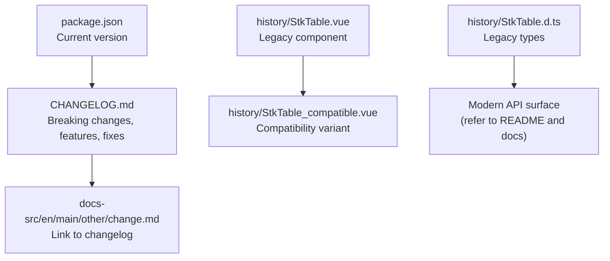
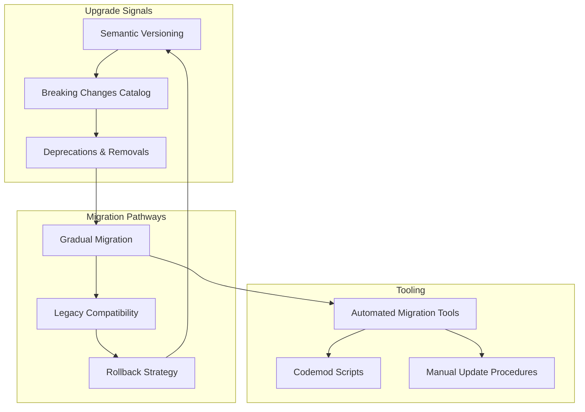
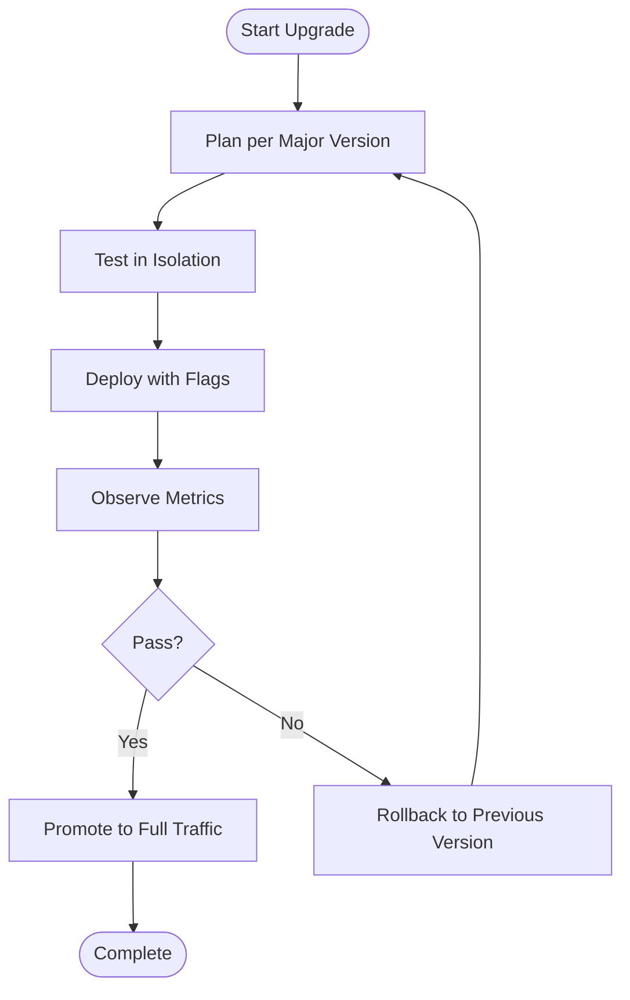
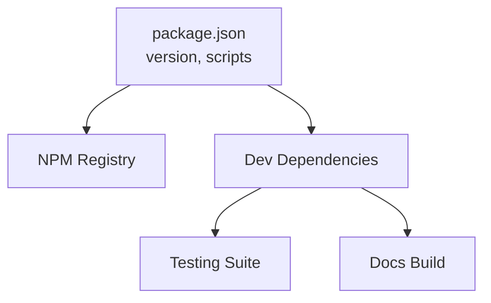

# Migration and Updates

<cite>
**Referenced Files in This Document**
- [CHANGELOG.md](file://CHANGELOG.md)
- [package.json](file://package.json)
- [README.md](file://README.md)
- [history/StkTable.vue](file://history/StkTable.vue)
- [history/StkTable_compatible.vue](file://history/StkTable_compatible.vue)
- [history/StkTable.d.ts](file://history/StkTable.d.ts)
- [docs-src/en/main/other/change.md](file://docs-src/en/main/other/change.md)
</cite>

## Table of Contents
1. [Introduction](#introduction)
2. [Project Structure](#project-structure)
3. [Core Components](#core-components)
4. [Architecture Overview](#architecture-overview)
5. [Detailed Component Analysis](#detailed-component-analysis)
6. [Dependency Analysis](#dependency-analysis)
7. [Performance Considerations](#performance-considerations)
8. [Troubleshooting Guide](#troubleshooting-guide)
9. [Conclusion](#conclusion)
10. [Appendices](#appendices)

## Introduction
This document provides comprehensive guidance for migrating and updating applications using Stk Table Vue across versions. It explains how to interpret breaking changes, adopt new APIs, and safely upgrade while preserving functionality. It also covers semantic versioning signals, deprecation handling, compatibility layers, and practical strategies for gradual migration and rollback.

## Project Structure
The repository organizes migration-relevant information across:
- Version history and breaking changes in the changelog
- Package metadata indicating current version and release cadence
- Legacy component variants for compatibility scenarios
- Documentation pointers to the official changelog

**Diagram sources**
- [package.json](file://package.json#L1-L76)
- [CHANGELOG.md](file://CHANGELOG.md#L1-L649)
- [docs-src/en/main/other/change.md](file://docs-src/en/main/other/change.md#L1-L6)
- [history/StkTable.vue](file://history/StkTable.vue#L1-L1660)
- [history/StkTable_compatible.vue](file://history/StkTable_compatible.vue#L1-L585)
- [history/StkTable.d.ts](file://history/StkTable.d.ts#L1-L18)

**Section sources**
- [package.json](file://package.json#L1-L76)
- [CHANGELOG.md](file://CHANGELOG.md#L1-L649)
- [docs-src/en/main/other/change.md](file://docs-src/en/main/other/change.md#L1-L6)

## Core Components
- Changelog-driven breaking changes: Use the changelog to identify breaking changes, deprecated features, and new capabilities per release.
- Current package version: The package manifest defines the current version and release channel.
- Legacy compatibility: Historical component variants exist to support older environments or migration phases.

Key migration touchpoints:
- Breaking changes marked with explicit labels in the changelog
- Deprecated features with recommended replacements
- Compatibility variants for gradual adoption

**Section sources**
- [CHANGELOG.md](file://CHANGELOG.md#L1-L649)
- [package.json](file://package.json#L1-L76)
- [history/StkTable.vue](file://history/StkTable.vue#L1-L1660)
- [history/StkTable_compatible.vue](file://history/StkTable_compatible.vue#L1-L585)
- [history/StkTable.d.ts](file://history/StkTable.d.ts#L1-L18)

## Architecture Overview
The migration architecture centers on three pillars:
- Semantic versioning: Major/minor/patch signals guide upgrade risk and compatibility.
- Breaking change catalog: The changelog enumerates incompatible changes and deprecations.
- Compatibility pathways: Legacy components and compatibility helpers enable incremental upgrades.

[No sources needed since this diagram shows conceptual workflow, not actual code structure]

## Detailed Component Analysis

### Semantic Versioning and Release Signals
- Major releases indicate breaking changes and removals.
- Minor releases add features and may include behavioral changes.
- Patch releases fix bugs without changing APIs.
- The current package version indicates the baseline for upgrades.

Practical guidance:
- Pin to minor versions during migration windows.
- Review changelog diffs between your baseline and target versions.
- Prefer upgrading one major version at a time to isolate breaking changes.

**Section sources**
- [package.json](file://package.json#L1-L76)
- [CHANGELOG.md](file://CHANGELOG.md#L1-L649)

### Breaking Change Identification
Use the changelog to identify breaking changes:
- Explicit “Break Change” markers
- Deprecated features with replacement suggestions
- Behavioral changes affecting rendering, events, or APIs

Common categories:
- Prop renames or removals
- Event signature updates
- Method return types or parameters
- CSS class or attribute changes
- Behavior changes in virtualization or fixed columns

Example indicators:
- Removal of attributes or classes
- Prop defaults or validation changes
- Emits or exposed methods changes

**Section sources**
- [CHANGELOG.md](file://CHANGELOG.md#L235-L237)
- [CHANGELOG.md](file://CHANGELOG.md#L261-L262)
- [CHANGELOG.md](file://CHANGELOG.md#L285-L288)
- [CHANGELOG.md](file://CHANGELOG.md#L308-L310)
- [CHANGELOG.md](file://CHANGELOG.md#L51-L52)
- [CHANGELOG.md](file://CHANGELOG.md#L91-L92)

### Upgrade Strategies
- One-version-at-a-time: Limit risk by upgrading incrementally.
- Feature flags: Gate new behavior behind flags to test in production.
- Shadow runs: Run staged instances with new versions against subsets of traffic.
- Canary deployments: Gradually increase traffic to the upgraded version.

[No sources needed since this diagram shows conceptual workflow, not actual code structure]

### Automated Migration Tools and Codemod Scripts
- Use automated tools to refactor common breaking changes (e.g., prop renames, event signatures).
- Employ codemods to bulk-replace deprecated patterns with modern equivalents.
- Validate changes with tests and visual regression checks.

Guidance:
- Target frequent breaking changes enumerated in the changelog.
- Keep codemods idempotent and reversible.
- Combine with manual review for nuanced cases.

[No sources needed since this section provides general guidance]

### Manual Update Procedures
- Update package version and run dependency checks.
- Apply breaking change fixes identified in the changelog.
- Verify UI and behavior across browsers and environments.
- Re-run tests and integration checks.

[No sources needed since this section provides general guidance]

### Legacy Component Compatibility
Historical variants exist to ease migration:
- Legacy component: Older implementation retained for compatibility.
- Compatibility variant: Alternative implementation tailored for specific environments.

Use these variants during migration windows to validate behavior and performance before fully adopting the latest API.

**Section sources**
- [history/StkTable.vue](file://history/StkTable.vue#L1-L1660)
- [history/StkTable_compatible.vue](file://history/StkTable_compatible.vue#L1-L585)
- [history/StkTable.d.ts](file://history/StkTable.d.ts#L1-L18)

### Gradual Migration Approaches
- Dual-mode rendering: Render both legacy and modern variants conditionally.
- Feature toggles: Enable new behavior per feature flag.
- Incremental prop/method adoption: Replace deprecated usage gradually.

[No sources needed since this section provides general guidance]

### Rollback Strategies
- Pin to previous working versions until issues are resolved.
- Revert breaking changes in staging first.
- Maintain hotfix branches for immediate rollbacks.

[No sources needed since this section provides general guidance]

## Dependency Analysis
The package manifest defines the current version and ecosystem dependencies. Use this to:
- Determine compatible Vue versions
- Track transitive dependency impacts
- Validate upgrade feasibility

**Diagram sources**
- [package.json](file://package.json#L1-L76)

**Section sources**
- [package.json](file://package.json#L1-L76)

## Performance Considerations
- Prefer incremental upgrades to avoid compounding performance regressions.
- Validate virtualization and fixed-column behavior after each major version.
- Monitor metrics around scroll performance, highlight animations, and layout stability.

[No sources needed since this section provides general guidance]

## Troubleshooting Guide
Common migration issues and resolutions:
- CSS class conflicts: Adjust class names per breaking changes (e.g., class renames).
- Event parameter mismatches: Update handlers to match new event signatures.
- Prop defaults or validation errors: Align with new defaults documented in the changelog.
- Legacy compatibility quirks: Use compatibility variants during transition.

Where to look:
- Changelog for breaking changes and deprecations
- Legacy component variants for behavior parity
- Documentation links to official changelog

**Section sources**
- [CHANGELOG.md](file://CHANGELOG.md#L1-L649)
- [docs-src/en/main/other/change.md](file://docs-src/en/main/other/change.md#L1-L6)
- [history/StkTable_compatible.vue](file://history/StkTable_compatible.vue#L1-L585)

## Conclusion
Migrating Stk Table Vue requires disciplined adherence to semantic versioning signals, careful study of the changelog, and pragmatic use of compatibility pathways. Adopt incremental upgrades, leverage automated tooling where possible, and maintain robust rollback plans. Validate behavior across environments and keep documentation updated with lessons learned.

[No sources needed since this section summarizes without analyzing specific files]

## Appendices

### Practical Migration Playbook
- Step 1: Identify baseline and target versions
- Step 2: Audit breaking changes and deprecations
- Step 3: Prepare automated and manual remediation steps
- Step 4: Stage and test changes
- Step 5: Deploy with monitoring and rollback capability

[No sources needed since this section provides general guidance]