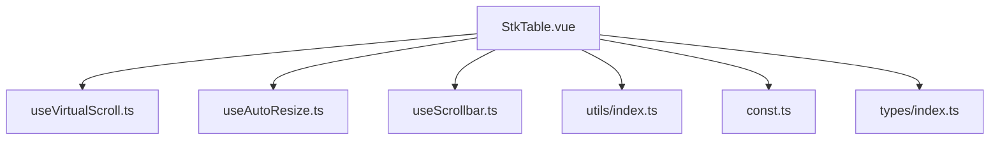
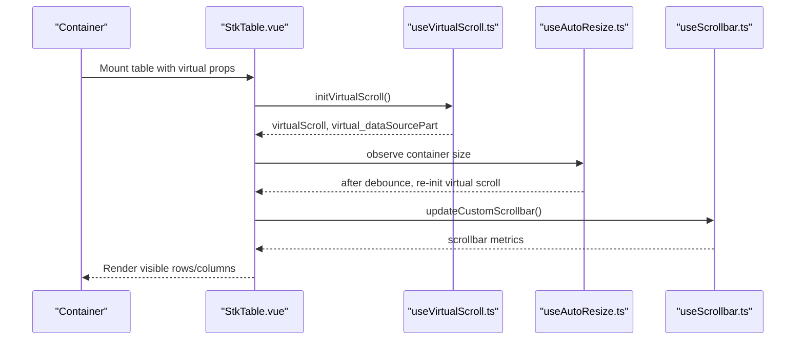
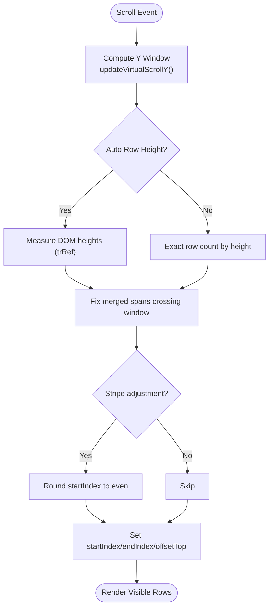
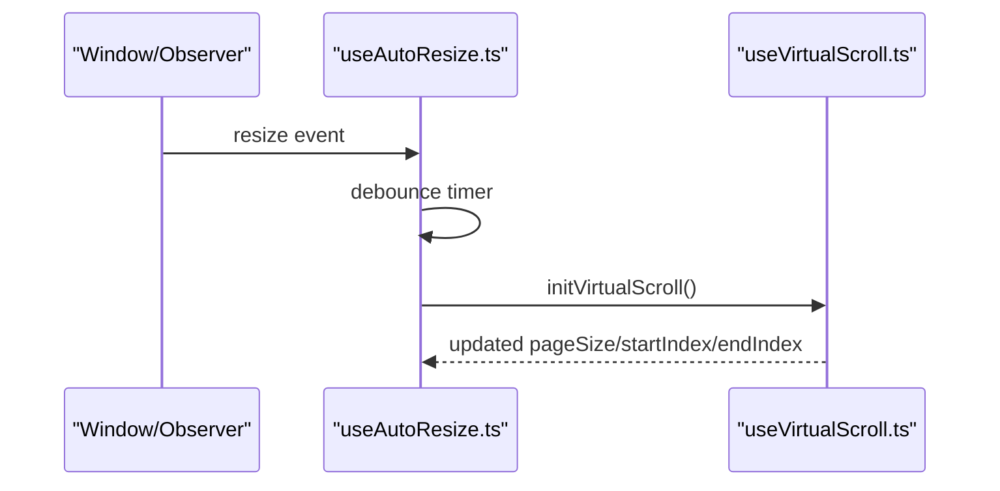
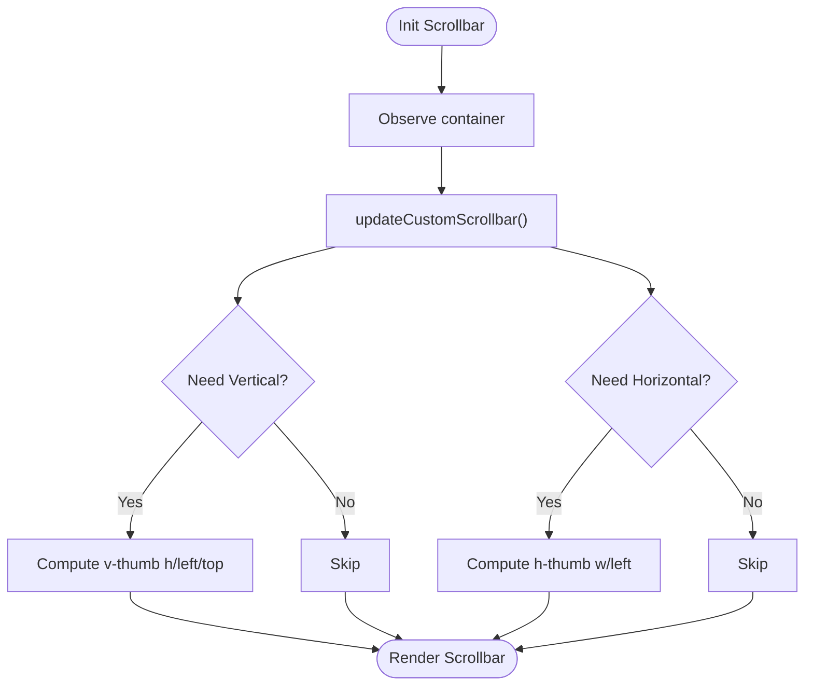
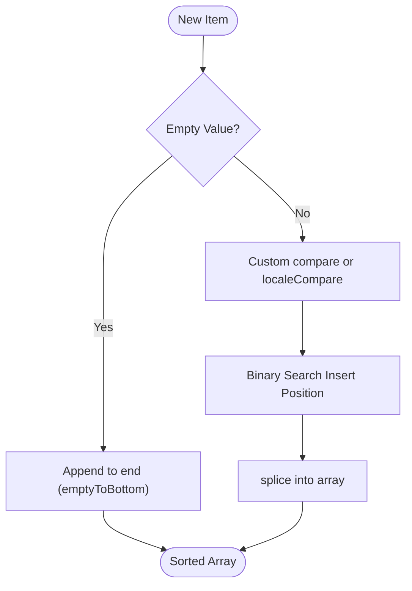
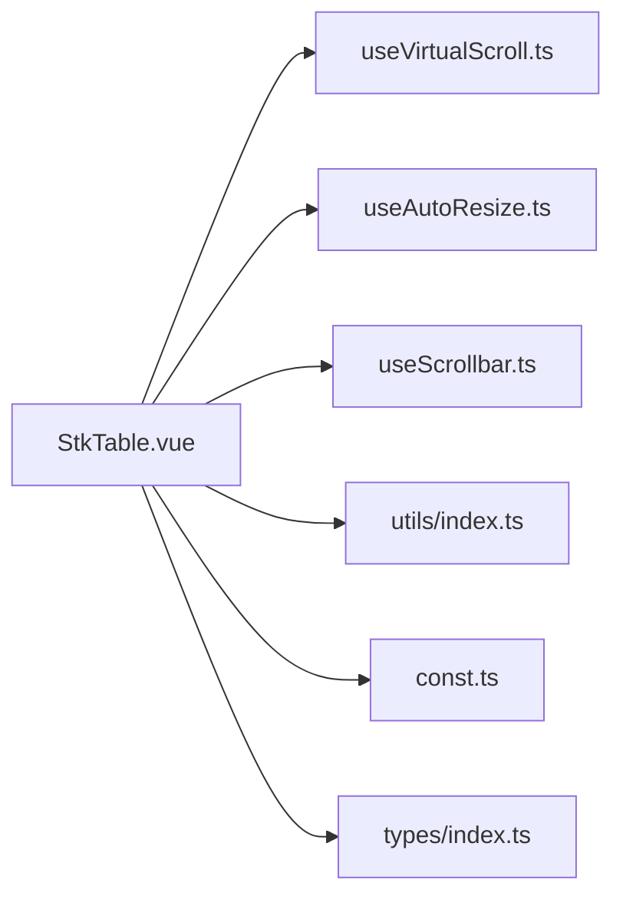

# Performance Optimization

<cite>
**Referenced Files in This Document**
- [StkTable.vue](file://src/StkTable/StkTable.vue)
- [useVirtualScroll.ts](file://src/StkTable/useVirtualScroll.ts)
- [useAutoResize.ts](file://src/StkTable/useAutoResize.ts)
- [useScrollbar.ts](file://src/StkTable/useScrollbar.ts)
- [utils/index.ts](file://src/StkTable/utils/index.ts)
- [const.ts](file://src/StkTable/const.ts)
- [types/index.ts](file://src/StkTable/types/index.ts)
- [VirtualY.vue](file://docs-demo/advanced/virtual/VirtualY.vue)
- [HugeData/index.vue](file://docs-demo/demos/HugeData/index.vue)
- [VirtualTree.vue](file://src/VirtualTree.vue)
</cite>

## Table of Contents
1. [Introduction](#introduction)
2. [Project Structure](#project-structure)
3. [Core Components](#core-components)
4. [Architecture Overview](#architecture-overview)
5. [Detailed Component Analysis](#detailed-component-analysis)
6. [Dependency Analysis](#dependency-analysis)
7. [Performance Considerations](#performance-considerations)
8. [Troubleshooting Guide](#troubleshooting-guide)
9. [Conclusion](#conclusion)
10. [Appendices](#appendices)

## Introduction
This document focuses on performance optimization strategies for Stk Table Vue, with emphasis on virtual scrolling, memory management, rendering optimization, and handling large datasets. It consolidates best practices, component lifecycle optimization, reactive data management, DOM manipulation minimization, benchmarking, monitoring, profiling, and common pitfalls with concrete references to the codebase.

## Project Structure
Stk Table Vue organizes performance-critical logic into modular composable hooks and a central table component:
- Central component: renders the table, orchestrates virtual scrolling, merges cells, highlights, and integrates optional features (tree, drag selection, custom scrollbar).
- Hooks:
  - Virtual scrolling: computes visible windows, offsets, and manages row/column visibility.
  - Auto resize: observes container size changes and recalibrates virtual scrolling.
  - Custom scrollbar: optional native-like scrollbar with drag support.
  - Utilities: sorting helpers, throttling, and browser compatibility constants.
- Demo pages illustrate large dataset scenarios and virtual scrolling usage.

**Diagram sources**
- [StkTable.vue](file://src/StkTable/StkTable.vue#L209-L800)
- [useVirtualScroll.ts](file://src/StkTable/useVirtualScroll.ts#L60-L495)
- [useAutoResize.ts](file://src/StkTable/useAutoResize.ts#L14-L92)
- [useScrollbar.ts](file://src/StkTable/useScrollbar.ts#L29-L190)
- [utils/index.ts](file://src/StkTable/utils/index.ts#L1-L288)
- [const.ts](file://src/StkTable/const.ts#L1-L51)
- [types/index.ts](file://src/StkTable/types/index.ts#L1-L318)

**Section sources**
- [StkTable.vue](file://src/StkTable/StkTable.vue#L209-L800)
- [useVirtualScroll.ts](file://src/StkTable/useVirtualScroll.ts#L60-L495)
- [useAutoResize.ts](file://src/StkTable/useAutoResize.ts#L14-L92)
- [useScrollbar.ts](file://src/StkTable/useScrollbar.ts#L29-L190)
- [utils/index.ts](file://src/StkTable/utils/index.ts#L1-L288)
- [const.ts](file://src/StkTable/const.ts#L1-L51)
- [types/index.ts](file://src/StkTable/types/index.ts#L1-L318)

## Core Components
- Virtual Scrolling Engine: Computes visible rows/columns, offsets, and handles auto row height and expanded row heights.
- Auto Resize Hook: Observes container resize via ResizeObserver or window resize and recalibrates virtual scrolling with debouncing.
- Custom Scrollbar: Optional native-like scrollbar with throttled updates and drag interactions.
- Sorting Utilities: Efficient helpers for ordered insertion and locale-aware comparisons.
- Constants and Types: Provide defaults, compatibility flags, and type-safe configurations.

**Section sources**
- [useVirtualScroll.ts](file://src/StkTable/useVirtualScroll.ts#L60-L495)
- [useAutoResize.ts](file://src/StkTable/useAutoResize.ts#L14-L92)
- [useScrollbar.ts](file://src/StkTable/useScrollbar.ts#L29-L190)
- [utils/index.ts](file://src/StkTable/utils/index.ts#L153-L207)
- [const.ts](file://src/StkTable/const.ts#L1-L51)
- [types/index.ts](file://src/StkTable/types/index.ts#L54-L120)

## Architecture Overview
The table component composes multiple hooks to manage performance-sensitive operations. Virtual scrolling is the core mechanism to render only visible items, while auto resize and custom scrollbar keep the viewport consistent under dynamic conditions.

**Diagram sources**
- [StkTable.vue](file://src/StkTable/StkTable.vue#L763-L791)
- [useVirtualScroll.ts](file://src/StkTable/useVirtualScroll.ts#L196-L236)
- [useAutoResize.ts](file://src/StkTable/useAutoResize.ts#L76-L90)
- [useScrollbar.ts](file://src/StkTable/useScrollbar.ts#L78-L99)

## Detailed Component Analysis

### Virtual Scrolling Engine
The engine computes:
- Visible row range and offsets for vertical virtualization.
- Visible column range and offsets for horizontal virtualization.
- Dynamic row heights including auto height and expanded rows.
- Corrections for merged rows to avoid partial spans.

**Diagram sources**
- [useVirtualScroll.ts](file://src/StkTable/useVirtualScroll.ts#L273-L403)

Best practices derived from the implementation:
- Prefer exact row counting when auto row height is not used to minimize DOM measurements.
- Use trRef measurement only when auto height is enabled to cache per-row heights.
- Correct merged spans to prevent partial row rendering.
- Apply stripe alignment adjustments to avoid visual artifacts during fast scrolls.

**Section sources**
- [useVirtualScroll.ts](file://src/StkTable/useVirtualScroll.ts#L196-L403)

### Auto Resize and Debounced Recalculation
- Watches virtual and virtualX flags to attach observers.
- Uses ResizeObserver when available; falls back to window resize.
- Debounces recalculations to avoid layout thrashing.

**Diagram sources**
- [useAutoResize.ts](file://src/StkTable/useAutoResize.ts#L76-L90)
- [useVirtualScroll.ts](file://src/StkTable/useVirtualScroll.ts#L196-L229)

**Section sources**
- [useAutoResize.ts](file://src/StkTable/useAutoResize.ts#L14-L92)
- [useVirtualScroll.ts](file://src/StkTable/useVirtualScroll.ts#L196-L229)

### Custom Scrollbar
- Throttles updates to reduce layout work.
- Computes thumb sizes and positions based on scroll ratios.
- Supports drag interactions for both axes.

**Diagram sources**
- [useScrollbar.ts](file://src/StkTable/useScrollbar.ts#L78-L99)

**Section sources**
- [useScrollbar.ts](file://src/StkTable/useScrollbar.ts#L29-L190)

### Sorting Utilities and Ordered Insertion
- Binary search insertion maintains sorted arrays without full re-sort.
- Locale-aware string comparison and configurable empty-to-bottom behavior.

**Diagram sources**
- [utils/index.ts](file://src/StkTable/utils/index.ts#L25-L66)
- [utils/index.ts](file://src/StkTable/utils/index.ts#L73-L92)
- [utils/index.ts](file://src/StkTable/utils/index.ts#L102-L116)

**Section sources**
- [utils/index.ts](file://src/StkTable/utils/index.ts#L153-L207)

### Large Dataset Demo Patterns
- Demonstrates virtual and virtualX enabled with a large data source.
- Highlights efficient rendering of tens of thousands of rows.

**Section sources**
- [VirtualY.vue](file://docs-demo/advanced/virtual/VirtualY.vue#L1-L34)
- [HugeData/index.vue](file://docs-demo/demos/HugeData/index.vue#L1-L373)

### Additional Virtual List Example
- A dedicated virtual tree/list component illustrates similar virtualization patterns for hierarchical data.

**Section sources**
- [VirtualTree.vue](file://src/VirtualTree.vue#L1-L623)

## Dependency Analysis
The table component depends on several focused hooks. Coupling is low due to composables; cohesion is high within each hook’s responsibility.

**Diagram sources**
- [StkTable.vue](file://src/StkTable/StkTable.vue#L209-L800)
- [useVirtualScroll.ts](file://src/StkTable/useVirtualScroll.ts#L60-L495)
- [useAutoResize.ts](file://src/StkTable/useAutoResize.ts#L14-L92)
- [useScrollbar.ts](file://src/StkTable/useScrollbar.ts#L29-L190)
- [utils/index.ts](file://src/StkTable/utils/index.ts#L1-L288)
- [const.ts](file://src/StkTable/const.ts#L1-L51)
- [types/index.ts](file://src/StkTable/types/index.ts#L1-L318)

**Section sources**
- [StkTable.vue](file://src/StkTable/StkTable.vue#L209-L800)
- [useVirtualScroll.ts](file://src/StkTable/useVirtualScroll.ts#L60-L495)
- [useAutoResize.ts](file://src/StkTable/useAutoResize.ts#L14-L92)
- [useScrollbar.ts](file://src/StkTable/useScrollbar.ts#L29-L190)
- [utils/index.ts](file://src/StkTable/utils/index.ts#L1-L288)
- [const.ts](file://src/StkTable/const.ts#L1-L51)
- [types/index.ts](file://src/StkTable/types/index.ts#L1-L318)

## Performance Considerations

### Virtual Scrolling Best Practices
- Enable virtual for large datasets and virtualX when total column width exceeds container width.
- Set explicit widths for columns to enable horizontal virtualization.
- Prefer exact row heights when possible; use auto row height only when content varies significantly.
- Avoid frequent reflows by minimizing DOM measurements inside the scroll loop.

**Section sources**
- [useVirtualScroll.ts](file://src/StkTable/useVirtualScroll.ts#L127-L132)
- [useVirtualScroll.ts](file://src/StkTable/useVirtualScroll.ts#L178-L190)

### Memory Management Techniques
- Cache row heights in a Map keyed by row key to avoid repeated measurements.
- Clear cached heights when data changes to prevent stale measurements.
- Use shallow refs for data sources to reduce deep reactivity overhead.

**Section sources**
- [useVirtualScroll.ts](file://src/StkTable/useVirtualScroll.ts#L241-L253)
- [StkTable.vue](file://src/StkTable/StkTable.vue#L717-L718)

### Rendering Optimization
- Render only visible rows/columns; keep template logic minimal inside loops.
- Use computed properties for derived values (e.g., virtual data parts, offsets).
- Avoid unnecessary watchers and reactive churn by batching updates.

**Section sources**
- [useVirtualScroll.ts](file://src/StkTable/useVirtualScroll.ts#L104-L108)
- [useVirtualScroll.ts](file://src/StkTable/useVirtualScroll.ts#L110-L125)

### Handling Large Datasets Efficiently
- Use server-side sorting and pagination for extremely large datasets.
- For client-side virtualization, prefer binary insertion for live-updated streams.
- Keep column widths static to stabilize horizontal virtualization.

**Section sources**
- [utils/index.ts](file://src/StkTable/utils/index.ts#L25-L66)
- [HugeData/index.vue](file://docs-demo/demos/HugeData/index.vue#L121-L148)

### Component Lifecycle Optimization
- Initialize virtual scrolling after mount and after container size is known.
- Attach observers conditionally based on props to avoid unnecessary listeners.
- Clean up observers on unmount to prevent memory leaks.

**Section sources**
- [useAutoResize.ts](file://src/StkTable/useAutoResize.ts#L32-L40)
- [useAutoResize.ts](file://src/StkTable/useAutoResize.ts#L65-L74)

### Reactive Data Management
- Use shallow refs for large arrays to avoid deep reactivity.
- Minimize reactive property churn; batch updates when modifying large lists.
- Leverage computed getters for derived state to reduce recomputation.

**Section sources**
- [StkTable.vue](file://src/StkTable/StkTable.vue#L717-L718)

### DOM Manipulation Minimization
- Prefer CSS transforms and offsets over moving DOM nodes.
- Use virtualized offsets for top/bottom padding to avoid shifting DOM.
- Limit custom scrollbar updates to throttled intervals.

**Section sources**
- [useVirtualScroll.ts](file://src/StkTable/useVirtualScroll.ts#L110-L125)
- [useScrollbar.ts](file://src/StkTable/useScrollbar.ts#L56-L58)

### Benchmarking, Monitoring, and Profiling
- Use browser devtools performance panel to record scroll interactions and measure frame times.
- Monitor scroll events and log startIndex/endIndex to validate virtual windows.
- Profile long-running operations like sorting and binary insertion to ensure they remain below 1–2 ms per operation.

**Section sources**
- [HugeData/index.vue](file://docs-demo/demos/HugeData/index.vue#L192-L194)

## Troubleshooting Guide

Common pitfalls and solutions:
- White screen during fast vertical scroll: Enable optimizeVue2Scroll to defer updates slightly.
  - Reference: [useVirtualScroll.ts](file://src/StkTable/useVirtualScroll.ts#L393-L402)
- Incorrect merged row rendering: Ensure merged spans are corrected around window boundaries.
  - Reference: [useVirtualScroll.ts](file://src/StkTable/useVirtualScroll.ts#L323-L356)
- Horizontal virtualization not activating: Ensure columns have explicit widths and total width exceeds container width.
  - Reference: [useVirtualScroll.ts](file://src/StkTable/useVirtualScroll.ts#L127-L132)
- Scrollbar flicker or incorrect sizing: Throttle updates and recalculate after layout.
  - Reference: [useScrollbar.ts](file://src/StkTable/useScrollbar.ts#L56-L58), [useScrollbar.ts](file://src/StkTable/useScrollbar.ts#L78-L99)
- Excessive layout thrashing on resize: Debounce auto resize recalculations.
  - Reference: [useAutoResize.ts](file://src/StkTable/useAutoResize.ts#L76-L90)

**Section sources**
- [useVirtualScroll.ts](file://src/StkTable/useVirtualScroll.ts#L393-L402)
- [useVirtualScroll.ts](file://src/StkTable/useVirtualScroll.ts#L323-L356)
- [useVirtualScroll.ts](file://src/StkTable/useVirtualScroll.ts#L127-L132)
- [useScrollbar.ts](file://src/StkTable/useScrollbar.ts#L56-L58)
- [useScrollbar.ts](file://src/StkTable/useScrollbar.ts#L78-L99)
- [useAutoResize.ts](file://src/StkTable/useAutoResize.ts#L76-L90)

## Conclusion
Stk Table Vue achieves high-performance rendering for large datasets through a modular, composable architecture centered on virtual scrolling, debounced auto resizing, and optional custom scrollbar. By following the best practices outlined—prefer exact row heights, cache measured heights, minimize DOM measurements, throttle updates, and leverage binary insertion—you can maintain smooth interactions even with hundreds of thousands of rows.

## Appendices

### Practical Checklists
- Virtual Scrolling
  - Enable virtual and virtualX for large datasets.
  - Set explicit column widths for X virtualization.
  - Use auto row height only when necessary; clear caches on data changes.
- Rendering
  - Keep templates inside loops minimal.
  - Use computed for derived values; avoid reactive churn.
- Resize and Scrollbar
  - Debounce resize recalculations.
  - Throttle custom scrollbar updates.
- Data Operations
  - Use binary insertion for live-updated sorted lists.
  - Batch DOM updates when modifying large arrays.