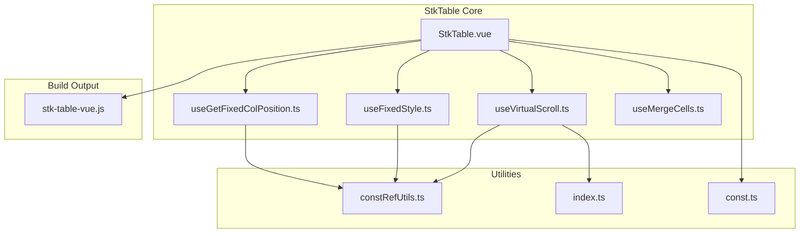
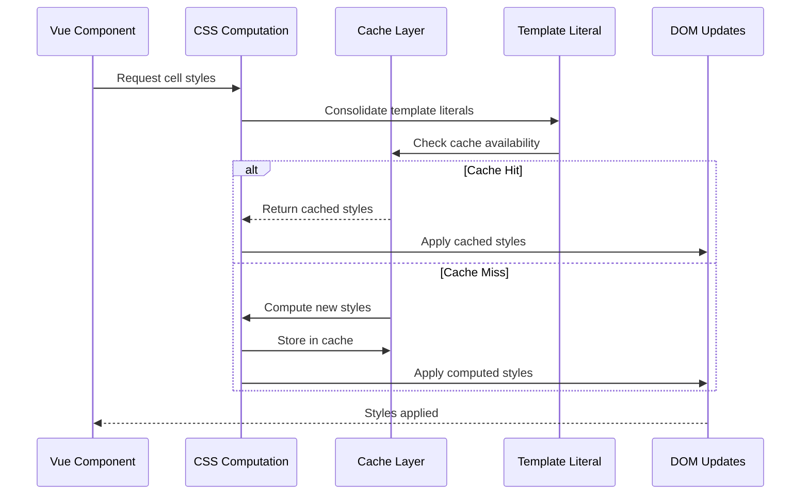
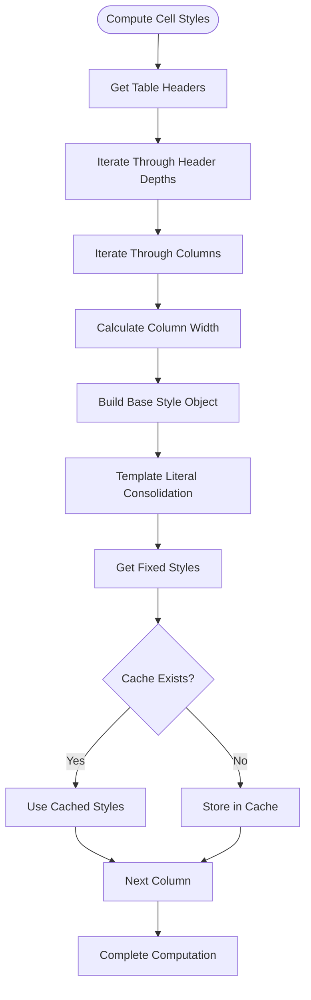
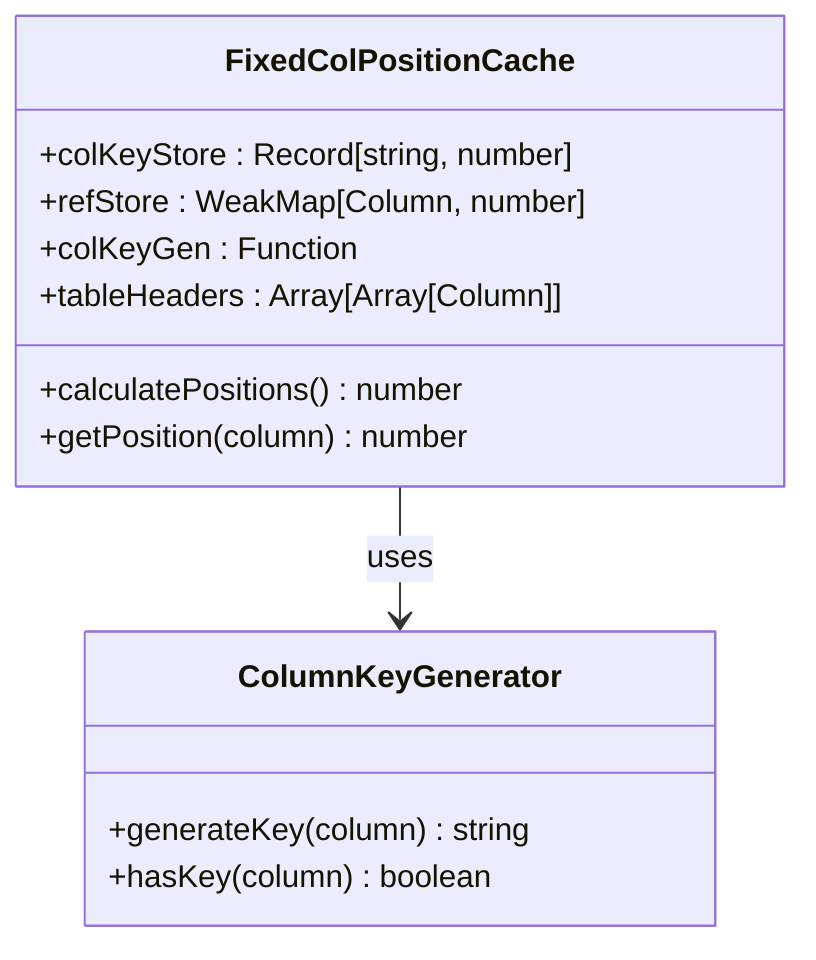
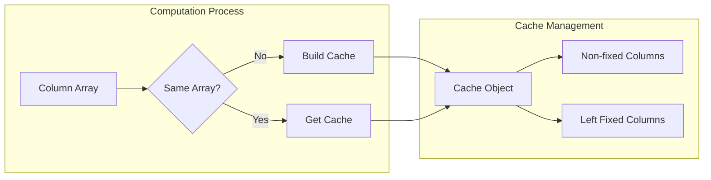
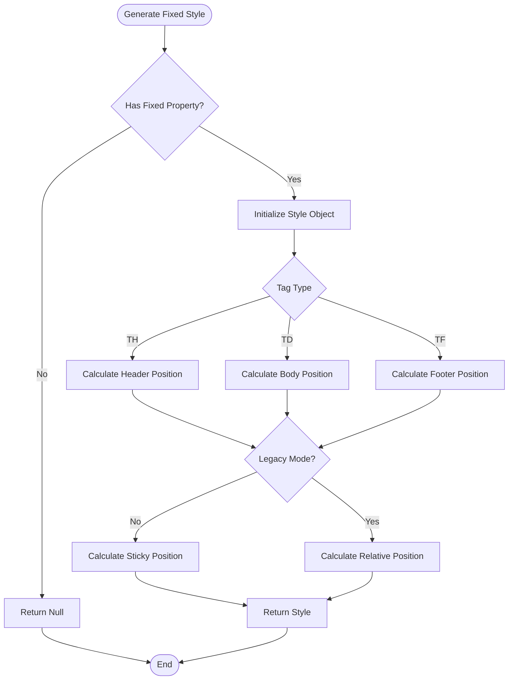
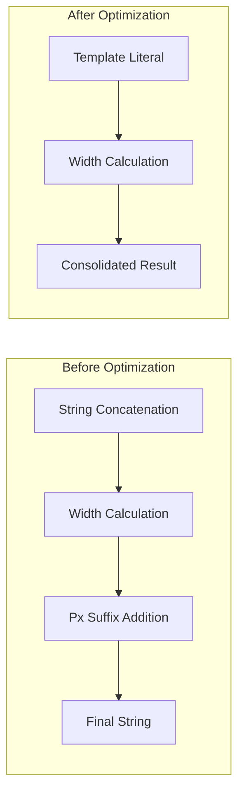
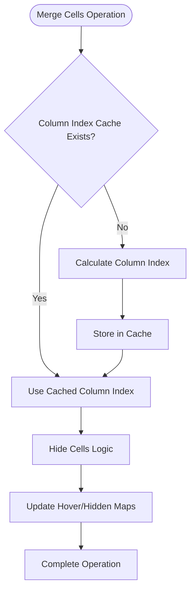
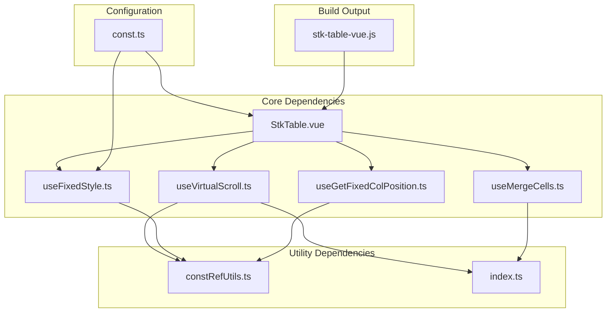

# Computed Style Caching

<cite>
**Referenced Files in This Document**
- [StkTable.vue](file://src/StkTable/StkTable.vue)
- [useFixedStyle.ts](file://src/StkTable/useFixedStyle.ts)
- [useGetFixedColPosition.ts](file://src/StkTable/useGetFixedColPosition.ts)
- [useVirtualScroll.ts](file://src/StkTable/useVirtualScroll.ts)
- [useMergeCells.ts](file://src/StkTable/useMergeCells.ts)
- [constRefUtils.ts](file://src/StkTable/utils/constRefUtils.ts)
- [index.ts](file://src/StkTable/utils/index.ts)
- [const.ts](file://src/StkTable/const.ts)
- [stk-table-vue.js](file://lib/stk-table-vue.js)
</cite>

## Update Summary
**Changes Made**
- Enhanced template literal consolidation in computed style generation
- Improved computed style caching mechanisms with better performance optimizations
- Added template literal consolidation for style computation in cellStyleMap
- Enhanced merge cells caching with column index cache optimization
- Improved performance through reduced string concatenation operations

## Table of Contents
1. [Introduction](#introduction)
2. [Project Structure](#project-structure)
3. [Core Components](#core-components)
4. [Architecture Overview](#architecture-overview)
5. [Detailed Component Analysis](#detailed-component-analysis)
6. [Template Literal Consolidation](#template-literal-consolidation)
7. [Enhanced Performance Optimizations](#enhanced-performance-optimizations)
8. [Dependency Analysis](#dependency-analysis)
9. [Performance Considerations](#performance-considerations)
10. [Troubleshooting Guide](#troubleshooting-guide)
11. [Conclusion](#conclusion)

## Introduction

Computed Style Caching is a critical performance optimization mechanism in the stk-table-vue library that prevents unnecessary re-computation of CSS styles during table rendering and scrolling operations. This system efficiently manages computed styles for table headers, body cells, and footer elements while maintaining optimal performance during dynamic updates.

The caching system operates at multiple levels, from individual cell style computation to entire column style maps, ensuring that style calculations are performed only when necessary and cached for subsequent use during the same render cycle. Recent enhancements include template literal consolidation and improved computed style caching mechanisms that significantly reduce computational overhead.

## Project Structure

The computed style caching system is distributed across several key modules within the StkTable component architecture:

**Diagram sources**
- [StkTable.vue:1-800](file://src/StkTable/StkTable.vue#L1-800)
- [useVirtualScroll.ts:1-555](file://src/StkTable/useVirtualScroll.ts#L1-555)
- [useFixedStyle.ts:1-75](file://src/StkTable/useFixedStyle.ts#L1-75)
- [useMergeCells.ts:1-139](file://src/StkTable/useMergeCells.ts#L1-139)

**Section sources**
- [StkTable.vue:1-800](file://src/StkTable/StkTable.vue#L1-800)
- [useVirtualScroll.ts:1-555](file://src/StkTable/useVirtualScroll.ts#L1-555)

## Core Components

The computed style caching system consists of four primary components working in harmony:

### 1. Cell Style Map Computation
The `cellStyleMap` computed property generates optimized style maps for different table elements (TH, TD, TF) with enhanced template literal consolidation.

### 2. Fixed Column Position Caching
The `useGetFixedColPosition` hook maintains cached column position calculations for fixed left and right columns.

### 3. Column Width Cache System
The `useColWidthCache` function provides intelligent caching for column width computations during horizontal scrolling.

### 4. Merge Cells Caching
The `useMergeCells` hook implements sophisticated caching for merged cell operations with column index cache optimization.

**Section sources**
- [useFixedStyle.ts:16-75](file://src/StkTable/useFixedStyle.ts#L16-75)
- [useGetFixedColPosition.ts:10-64](file://src/StkTable/useGetFixedColPosition.ts#L10-64)
- [useVirtualScroll.ts:52-83](file://src/StkTable/useVirtualScroll.ts#L52-83)
- [useMergeCells.ts:29-36](file://src/StkTable/useMergeCells.ts#L29-L36)

## Architecture Overview

The computed style caching architecture follows a hierarchical approach with multiple layers of optimization:

**Diagram sources**
- [useFixedStyle.ts:31-71](file://src/StkTable/useFixedStyle.ts#L31-L71)
- [useVirtualScroll.ts:73-82](file://src/StkTable/useVirtualScroll.ts#L73-L82)
- [useMergeCells.ts:41-84](file://src/StkTable/useMergeCells.ts#L41-L84)

The architecture ensures that:
- Styles are computed only when column configurations change
- Cached results are reused during scrolling operations
- Template literals are consolidated to reduce string operations
- Memory usage remains efficient through targeted invalidation
- Performance is optimized for both vertical and horizontal scrolling scenarios

## Detailed Component Analysis

### Cell Style Map Computation

The `cellStyleMap` computed property serves as the central hub for style caching, generating optimized style maps for different table element types with enhanced template literal consolidation:

**Diagram sources**
- [stk-table-vue.js:3133-3162](file://lib/stk-table-vue.js#L3133-L3162)

The system creates separate maps for:
- **TH Elements**: Header cells with depth-specific positioning
- **TD Elements**: Body cells with fixed positioning support  
- **TF Elements**: Footer cells with sticky positioning

**Section sources**
- [stk-table-vue.js:3133-3162](file://lib/stk-table-vue.js#L3133-L3162)

### Fixed Column Position Caching

The `useGetFixedColPosition` hook implements sophisticated caching for fixed column positions:

**Diagram sources**
- [useGetFixedColPosition.ts:15-60](file://src/StkTable/useGetFixedColPosition.ts#L15-L60)

The caching mechanism supports:
- **Primary Key Storage**: Uses generated column keys for lookup
- **Fallback Reference Storage**: WeakMap storage for columns without keys
- **Bidirectional Calculation**: Computes both left and right fixed positions
- **Dynamic Updates**: Recalculates when column structure changes

**Section sources**
- [useGetFixedColPosition.ts:10-64](file://src/StkTable/useGetFixedColPosition.ts#L10-L64)

### Column Width Cache System

The `useColWidthCache` function provides intelligent caching for column width computations:

**Diagram sources**
- [useVirtualScroll.ts:52-83](file://src/StkTable/useVirtualScroll.ts#L52-L83)

The cache system optimizes:
- **Cumulative Width Calculations**: Pre-computes cumulative widths for binary search
- **Fixed Column Tracking**: Separates left-fixed columns for quick access
- **Memory Efficiency**: Clears cache when arrays change to prevent memory leaks
- **Performance**: Reduces O(n) computations to O(1) cache lookups

**Section sources**
- [useVirtualScroll.ts:52-83](file://src/StkTable/useVirtualScroll.ts#L52-L83)

### Fixed Style Generation

The `getFixedStyle` function generates optimized CSS styles for fixed-positioned elements:

**Diagram sources**
- [useFixedStyle.ts:31-71](file://src/StkTable/useFixedStyle.ts#L31-L71)

**Section sources**
- [useFixedStyle.ts:16-75](file://src/StkTable/useFixedStyle.ts#L16-L75)

## Template Literal Consolidation

Recent enhancements include template literal consolidation that significantly reduces string concatenation operations during style computation:

### Enhanced Template Literal Usage

The system now consolidates template literals to minimize string operations:

**Diagram sources**
- [StkTable.vue:1118](file://src/StkTable/StkTable.vue#L1118)
- [useFixedStyle.ts:43-66](file://src/StkTable/useFixedStyle.ts#L43-L66)

Key improvements include:
- **Consolidated Width Calculation**: `getCalculatedColWidth(col) + 'px'` instead of repeated concatenation
- **Optimized Style Assignment**: Reduced template literal operations in style objects
- **Efficient String Operations**: Minimized string concatenation in computed properties

**Section sources**
- [StkTable.vue:1118](file://src/StkTable/StkTable.vue#L1118)
- [useFixedStyle.ts:43-66](file://src/StkTable/useFixedStyle.ts#L43-L66)

## Enhanced Performance Optimizations

The merge cells caching system has been enhanced with column index cache optimization:

### Column Index Cache Optimization

The `useMergeCells` hook now implements intelligent caching for column index operations:

**Diagram sources**
- [useMergeCells.ts:41-84](file://src/StkTable/useMergeCells.ts#L41-L84)

The optimization includes:
- **Column Index Cache**: `colIndexCache` Map for storing calculated column indices
- **Reduced Find Operations**: Avoids repeated `findIndex` calls for column lookup
- **Memory Efficient**: Uses WeakMap for cache storage to prevent memory leaks
- **Automatic Invalidation**: Cache cleared when data source or column configuration changes

**Section sources**
- [useMergeCells.ts:29-36](file://src/StkTable/useMergeCells.ts#L29-L36)
- [useMergeCells.ts:41-84](file://src/StkTable/useMergeCells.ts#L41-L84)

## Dependency Analysis

The computed style caching system has well-defined dependencies that ensure optimal performance:

**Diagram sources**
- [StkTable.vue:250-310](file://src/StkTable/StkTable.vue#L250-L310)
- [useVirtualScroll.ts:1-10](file://src/StkTable/useVirtualScroll.ts#L1-L10)

The dependency relationships ensure:
- **Modular Design**: Each component has clear responsibilities
- **Reusability**: Utility functions can be shared across components
- **Maintainability**: Changes in one module don't affect others unnecessarily
- **Performance**: Direct dependencies minimize computation overhead

**Section sources**
- [StkTable.vue:250-310](file://src/StkTable/StkTable.vue#L250-L310)
- [useVirtualScroll.ts:1-10](file://src/StkTable/useVirtualScroll.ts#L1-L10)

## Performance Considerations

The computed style caching system implements several performance optimization strategies:

### Memory Management
- **WeakMap Usage**: Prevents memory leaks in fixed column positioning
- **Cache Invalidation**: Automatic clearing when column arrays change
- **Efficient Data Structures**: Maps and arrays optimized for frequent access
- **Column Index Cache**: Prevents memory leaks with automatic invalidation

### Computational Efficiency
- **Binary Search**: O(log n) lookup for column positioning during scrolling
- **Memoization**: Cached results avoid redundant calculations
- **Template Literal Consolidation**: Reduces string concatenation operations
- **Batch Operations**: Multiple style computations performed together

### Rendering Optimization
- **requestAnimationFrame**: Coalesces style updates for smooth animations
- **CSS Custom Properties**: Leverages browser optimization for style changes
- **Minimal DOM Manipulation**: Reduces layout thrashing during updates
- **Efficient Style Assignment**: Optimized style object creation and assignment

## Troubleshooting Guide

Common issues and solutions related to computed style caching:

### Performance Issues
**Symptoms**: Slow scrolling or style updates
**Causes**: 
- Cache not being invalidated properly
- Excessive re-computation of styles
- Memory leaks from unused caches
- Template literal consolidation not working

**Solutions**:
- Verify cache invalidation triggers on column changes
- Monitor cache hit rates during performance profiling
- Check for proper cleanup in component unmount
- Ensure template literal consolidation is active

### Style Synchronization Problems
**Symptoms**: Incorrect fixed positions or misaligned columns
**Causes**:
- Cache inconsistencies between different table sections
- Timing issues with style updates
- Browser compatibility problems
- Template literal consolidation conflicts

**Solutions**:
- Ensure consistent cache usage across all table elements
- Implement proper synchronization for scroll events
- Test with different browser versions and modes
- Verify template literal consolidation is functioning correctly

### Memory Leaks
**Symptoms**: Increasing memory usage over time
**Causes**:
- Failure to clear WeakMap entries
- Unclean cache invalidation
- Event listener retention
- Column index cache not being cleared

**Solutions**:
- Verify WeakMap cleanup on component unmount
- Implement proper cache lifecycle management
- Monitor memory usage during extended usage
- Check column index cache invalidation in watch effects

**Section sources**
- [useGetFixedColPosition.ts:17-19](file://src/StkTable/useGetFixedColPosition.ts#L17-L19)
- [useVirtualScroll.ts:78-82](file://src/StkTable/useVirtualScroll.ts#L78-L82)
- [useMergeCells.ts:32-36](file://src/StkTable/useMergeCells.ts#L32-L36)

## Conclusion

The computed style caching system in stk-table-vue represents a sophisticated approach to performance optimization in virtualized table components. Recent enhancements including template literal consolidation and improved computed style caching mechanisms demonstrate significant performance improvements while maintaining flexibility and maintainability.

Key achievements of the enhanced caching system include:

- **Template Literal Consolidation**: Reduced string concatenation operations by consolidating template literals
- **Enhanced Merge Cells Caching**: Implemented column index cache optimization to avoid repeated find operations
- **Hierarchical Caching**: Multiple levels of caching from individual styles to entire style maps
- **Intelligent Invalidation**: Smart cache invalidation based on data changes
- **Memory Efficiency**: Proper cleanup mechanisms prevent memory leaks
- **Performance Scaling**: Optimizations that scale with table size and complexity

The system demonstrates best practices in Vue.js performance optimization, providing a foundation for high-performance table rendering that can handle large datasets efficiently while maintaining responsive user interactions.

Future enhancements could include:
- Dynamic cache sizing based on available memory
- Advanced prediction algorithms for upcoming style computations
- Enhanced debugging tools for cache inspection and monitoring
- Further template literal optimization for even better performance