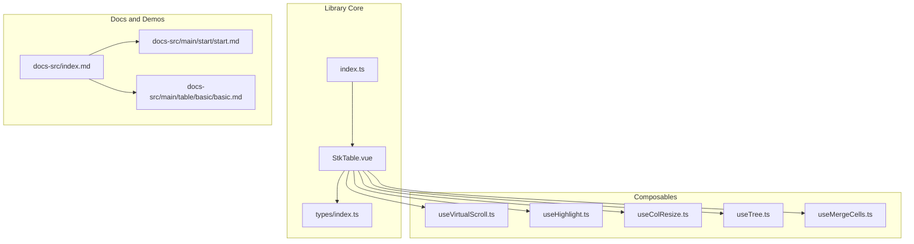
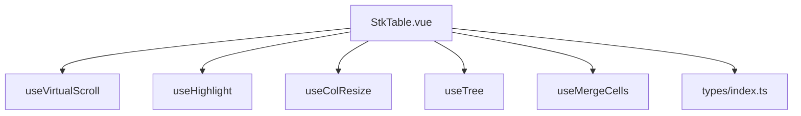
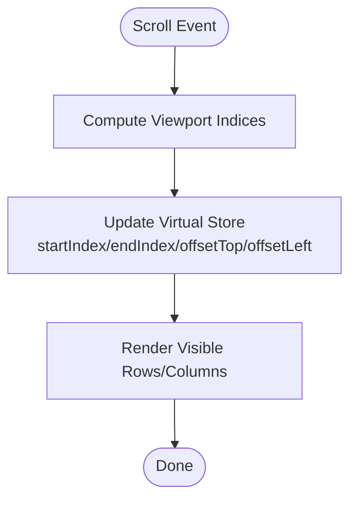
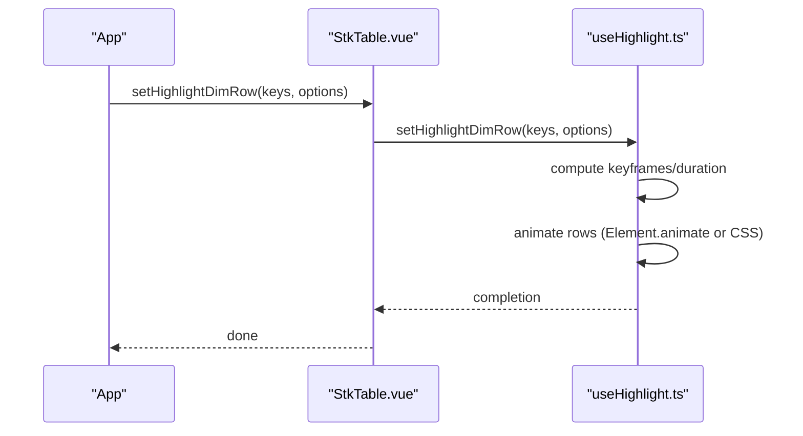
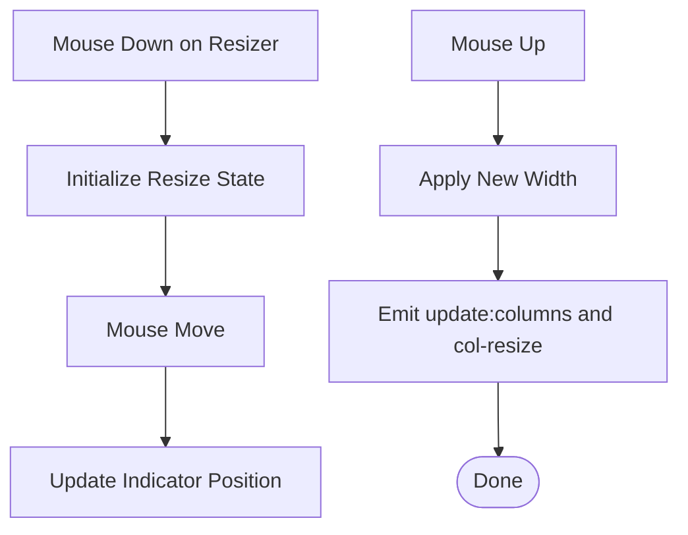
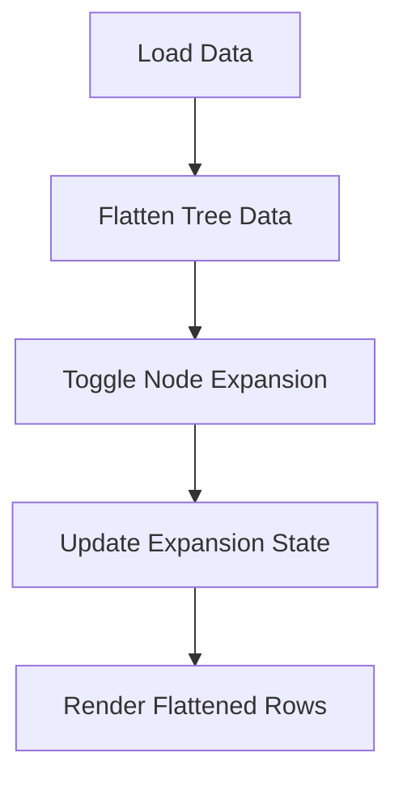
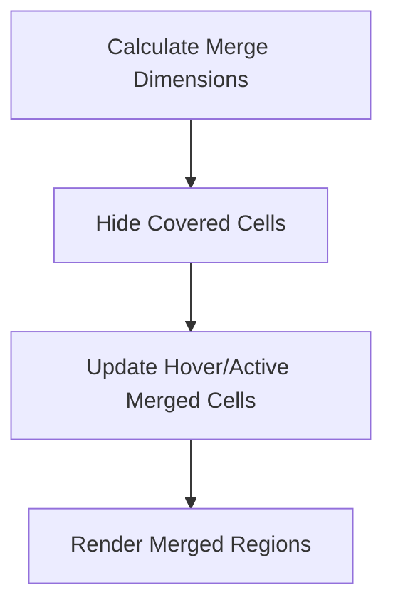
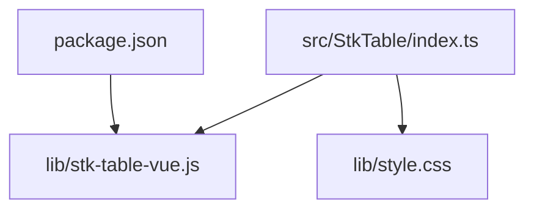

# Project Overview

<cite>
**Referenced Files in This Document**
- [README.md](file://README.md)
- [package.json](file://package.json)
- [index.md](file://docs-src/index.md)
- [start.md](file://docs-src/main/start/start.md)
- [vue2-usage.md](file://docs-src/main/start/vue2-usage.md)
- [basic.md](file://docs-src/main/table/basic/basic.md)
- [StkTable.vue](file://src/StkTable/StkTable.vue)
- [index.ts](file://src/StkTable/index.ts)
- [useVirtualScroll.ts](file://src/StkTable/useVirtualScroll.ts)
- [useHighlight.ts](file://src/StkTable/useHighlight.ts)
- [useColResize.ts](file://src/StkTable/useColResize.ts)
- [useTree.ts](file://src/StkTable/useTree.ts)
- [useMergeCells.ts](file://src/StkTable/useMergeCells.ts)
- [types/index.ts](file://src/StkTable/types/index.ts)
- [CHANGELOG.md](file://CHANGELOG.md)
</cite>

## Table of Contents
1. [Introduction](#introduction)
2. [Project Structure](#project-structure)
3. [Core Components](#core-components)
4. [Architecture Overview](#architecture-overview)
5. [Detailed Component Analysis](#detailed-component-analysis)
6. [Dependency Analysis](#dependency-analysis)
7. [Performance Considerations](#performance-considerations)
8. [Troubleshooting Guide](#troubleshooting-guide)
9. [Conclusion](#conclusion)
10. [Appendices](#appendices)

## Introduction
Stk Table Vue (also referred to as Sticky Table) is a high-performance virtual table component library designed for real-time data display. Its core value proposition lies in delivering smooth, responsive experiences for large datasets while maintaining a lightweight footprint. The library emphasizes:
- Real-time and dynamic data scenarios (e.g., live feeds, dashboards)
- High-performance rendering via virtual scrolling (vertical, horizontal, and mixed)
- Dual Vue 2.7/3.x compatibility for broad adoption
- Advanced UX features such as highlighting, resizable columns, tree tables, and merged cells

Key differentiators:
- Built-in virtualization for both axes with intelligent viewport management
- Integrated highlighting system for rows and cells with configurable animation or CSS modes
- Rich column management including custom cells, sortable headers, fixed columns, and resizable columns
- Tree table support and merged cells for complex layouts
- First-class TypeScript support and reactive configuration

Target use cases:
- Financial dashboards and market data displays
- Monitoring and analytics panels
- Large tabular datasets requiring smooth scrolling and frequent updates
- Applications needing advanced column behaviors (sorting, resizing, merging, tree expansion)

Installation and quick start are documented in the official documentation and examples included in this repository.

**Section sources**
- [README.md](file://README.md#L15-L19)
- [index.md](file://docs-src/index.md#L23-L43)
- [CHANGELOG.md](file://CHANGELOG.md#L1-L200)

## Project Structure
The repository is organized around a modular Vue 3 composition-based architecture with a focus on virtualization and advanced table features. The core component and supporting composables are located under src/StkTable, while documentation and demos are under docs-src and docs-demo respectively.

**Diagram sources**
- [StkTable.vue](file://src/StkTable/StkTable.vue#L1-L200)
- [index.ts](file://src/StkTable/index.ts#L1-L5)
- [useVirtualScroll.ts](file://src/StkTable/useVirtualScroll.ts#L1-L200)
- [useHighlight.ts](file://src/StkTable/useHighlight.ts#L1-L200)
- [useColResize.ts](file://src/StkTable/useColResize.ts#L1-L200)
- [useTree.ts](file://src/StkTable/useTree.ts#L1-L162)
- [useMergeCells.ts](file://src/StkTable/useMergeCells.ts#L1-L122)
- [index.md](file://docs-src/index.md#L1-L46)
- [start.md](file://docs-src/main/start/start.md#L1-L77)
- [basic.md](file://docs-src/main/table/basic/basic.md#L1-L41)

**Section sources**
- [index.ts](file://src/StkTable/index.ts#L1-L5)
- [StkTable.vue](file://src/StkTable/StkTable.vue#L1-L200)
- [index.md](file://docs-src/index.md#L1-L46)

## Core Components
- StkTable.vue: The primary table component implementing rendering, virtual scrolling, highlighting, column management, and event emissions.
- useVirtualScroll.ts: Provides virtual scrolling state and calculations for both vertical and horizontal axes, including dynamic page size and offset management.
- useHighlight.ts: Implements row and cell highlighting with animation or CSS-based modes, supporting theme-aware colors and configurable durations/frequencies.
- useColResize.ts: Enables interactive column resizing with visual indicators, min/max constraints, and reactive updates to column widths.
- useTree.ts: Adds tree table capabilities including expand/collapse, default expansion policies, and flattened data management.
- useMergeCells.ts: Handles merged cells logic for rowspan/colspan, including hover/active state propagation across merged regions.
- types/index.ts: Defines comprehensive TypeScript types for columns, sorting, merging, tree configuration, and other features.

These components work together to deliver a cohesive, high-performance table experience with advanced customization.

**Section sources**
- [StkTable.vue](file://src/StkTable/StkTable.vue#L209-L621)
- [useVirtualScroll.ts](file://src/StkTable/useVirtualScroll.ts#L1-L200)
- [useHighlight.ts](file://src/StkTable/useHighlight.ts#L1-L200)
- [useColResize.ts](file://src/StkTable/useColResize.ts#L1-L200)
- [useTree.ts](file://src/StkTable/useTree.ts#L1-L162)
- [useMergeCells.ts](file://src/StkTable/useMergeCells.ts#L1-L122)
- [types/index.ts](file://src/StkTable/types/index.ts#L1-L200)

## Architecture Overview
The architecture follows a composition-driven design:
- StkTable.vue orchestrates rendering and delegates specialized behaviors to composable modules.
- Composables encapsulate cross-cutting concerns (virtualization, highlighting, resizing, tree, merging) and expose reactive state and methods.
- Types provide strong typing for props, events, and internal structures.

**Diagram sources**
- [StkTable.vue](file://src/StkTable/StkTable.vue#L209-L621)
- [useVirtualScroll.ts](file://src/StkTable/useVirtualScroll.ts#L1-L200)
- [useHighlight.ts](file://src/StkTable/useHighlight.ts#L1-L200)
- [useColResize.ts](file://src/StkTable/useColResize.ts#L1-L200)
- [useTree.ts](file://src/StkTable/useTree.ts#L1-L162)
- [useMergeCells.ts](file://src/StkTable/useMergeCells.ts#L1-L122)
- [types/index.ts](file://src/StkTable/types/index.ts#L1-L200)

## Detailed Component Analysis

### Virtual Scrolling
Virtual scrolling ensures smooth rendering of large datasets by only rendering visible rows and columns. The implementation computes viewport boundaries, manages page sizes, and adjusts offsets for both vertical and horizontal scrolling.

**Diagram sources**
- [useVirtualScroll.ts](file://src/StkTable/useVirtualScroll.ts#L100-L176)

**Section sources**
- [useVirtualScroll.ts](file://src/StkTable/useVirtualScroll.ts#L1-L200)
- [StkTable.vue](file://src/StkTable/StkTable.vue#L763-L788)

### Highlighting System
The highlighting system supports animated or CSS-based row and cell highlights with configurable keyframes, duration, and theme-aware colors. It integrates with virtual scrolling and uses requestAnimationFrame for smooth animations.

**Diagram sources**
- [useHighlight.ts](file://src/StkTable/useHighlight.ts#L109-L166)
- [StkTable.vue](file://src/StkTable/StkTable.vue#L253-L253)

**Section sources**
- [useHighlight.ts](file://src/StkTable/useHighlight.ts#L1-L200)
- [StkTable.vue](file://src/StkTable/StkTable.vue#L253-L253)

### Column Resizing
Interactive column resizing allows users to adjust column widths with visual feedback. The implementation tracks mouse movement, enforces minimum widths, and emits updates to the column configuration.

**Diagram sources**
- [useColResize.ts](file://src/StkTable/useColResize.ts#L83-L198)

**Section sources**
- [useColResize.ts](file://src/StkTable/useColResize.ts#L1-L200)
- [StkTable.vue](file://src/StkTable/StkTable.vue#L249-L249)

### Tree Table
Tree table support enables hierarchical data display with expand/collapse controls. It flattens data for rendering while preserving node relationships and expansion states.

**Diagram sources**
- [useTree.ts](file://src/StkTable/useTree.ts#L121-L125)

**Section sources**
- [useTree.ts](file://src/StkTable/useTree.ts#L1-L162)
- [StkTable.vue](file://src/StkTable/StkTable.vue#L262-L262)

### Merged Cells
Merged cells support rowspan/colspan with hidden-cell logic to avoid overlapping renders. Hover and active states propagate across merged regions for consistent UX.

**Diagram sources**
- [useMergeCells.ts](file://src/StkTable/useMergeCells.ts#L66-L97)

**Section sources**
- [useMergeCells.ts](file://src/StkTable/useMergeCells.ts#L1-L122)
- [StkTable.vue](file://src/StkTable/StkTable.vue#L794-L800)

## Dependency Analysis
The library’s package metadata indicates a modern build pipeline with TypeScript, Vite, and VitePress for documentation. The main entry exports the StkTable component and related utilities, with styles imported via the index.

**Diagram sources**
- [package.json](file://package.json#L1-L76)
- [index.ts](file://src/StkTable/index.ts#L1-L5)

**Section sources**
- [package.json](file://package.json#L1-L76)
- [index.ts](file://src/StkTable/index.ts#L1-L5)

## Performance Considerations
- Virtual scrolling reduces DOM nodes to visible items, minimizing layout and paint costs.
- Auto row height and merged cells require additional computations; use them judiciously for very large datasets.
- Custom scrollbar and scroll-row-by-row modes help mitigate white-screen issues during fast scrolling.
- Column resizing recalculates widths; prefer fixed widths for horizontal virtual lists to reduce layout thrash.

[No sources needed since this section provides general guidance]

## Troubleshooting Guide
Common issues and resolutions:
- Empty data state: Ensure showNoData and noDataFull are configured appropriately; customize the empty slot for clarity.
- Scroll behavior anomalies: Adjust smoothScroll and scrollRowByRow settings; verify row heights and headerRowHeight.
- Highlight not visible: Confirm highlightConfig settings and theme; ensure rowKey matches rendered rows.
- Column resize not working: Verify colResizable is enabled and columns are reactive; check minWidth constraints.
- Tree expansion conflicts: Review defaultExpandAll/defaultExpandLevel/defaultExpandKeys; ensure proper rowKey generation.

**Section sources**
- [StkTable.vue](file://src/StkTable/StkTable.vue#L28-L38)
- [useHighlight.ts](file://src/StkTable/useHighlight.ts#L28-L65)
- [useColResize.ts](file://src/StkTable/useColResize.ts#L51-L56)
- [useTree.ts](file://src/StkTable/useTree.ts#L13-L15)

## Conclusion
Stk Table Vue delivers a robust, high-performance solution for real-time, data-intensive applications. Its dual Vue 2.7/3.x compatibility, comprehensive virtualization, and advanced features like highlighting, resizable columns, tree tables, and merged cells make it a versatile choice for demanding UI needs. The project’s active development and detailed documentation further support long-term maintainability and ease of adoption.

[No sources needed since this section summarizes without analyzing specific files]

## Appendices

### Installation and Quick Start
- Install via npm and import the stylesheet and component as shown in the documentation.
- Vue 2.7 usage is supported by importing the SFC source directly.

**Section sources**
- [start.md](file://docs-src/main/start/start.md#L7-L28)
- [vue2-usage.md](file://docs-src/main/start/vue2-usage.md#L1-L47)

### Basic Usage Example
- Configure columns, dataSource, and rowKey; apply height via inline styles.
- Explore the basic demo for a minimal setup.

**Section sources**
- [basic.md](file://docs-src/main/table/basic/basic.md#L8-L39)

### Supported Features Overview
- Virtual scrolling (vertical, horizontal, mixed)
- Highlighting (rows and cells) with animation/CSS modes
- Advanced column management (custom cells, sortable headers, fixed/resizable columns)
- Tree table and merged cells
- Custom scrollbar and scroll-row-by-row behavior

**Section sources**
- [StkTable.vue](file://src/StkTable/StkTable.vue#L28-L476)
- [types/index.ts](file://src/StkTable/types/index.ts#L54-L120)

### Maturity, Community, and Roadmap
- The project is actively maintained with regular releases and changelog updates.
- Community resources include online demos, StackBlitz playground, and official documentation.
- Roadmap directions include ongoing enhancements to virtualization, UX polish, and feature stability.

**Section sources**
- [CHANGELOG.md](file://CHANGELOG.md#L1-L200)
- [README.md](file://README.md#L22-L96)
- [index.md](file://docs-src/index.md#L1-L46)