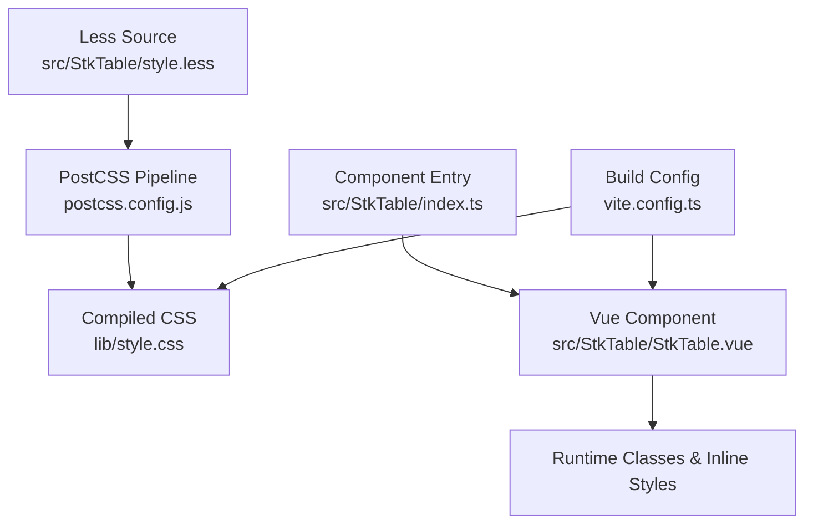
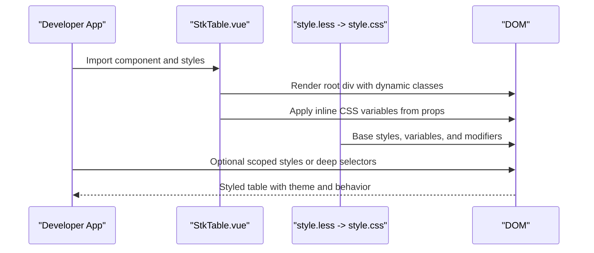
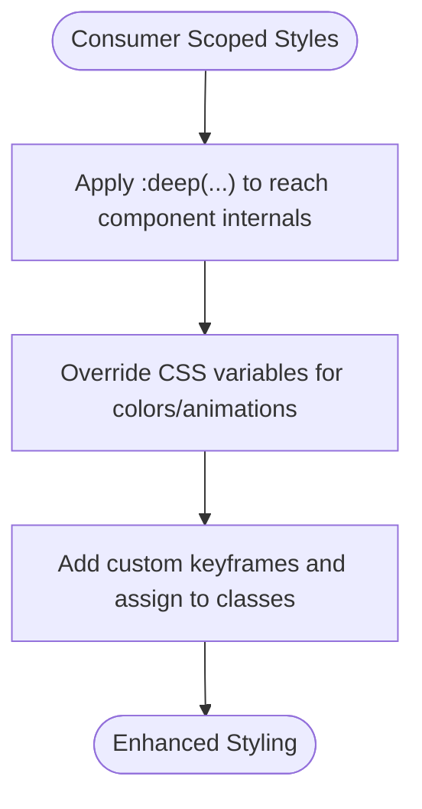
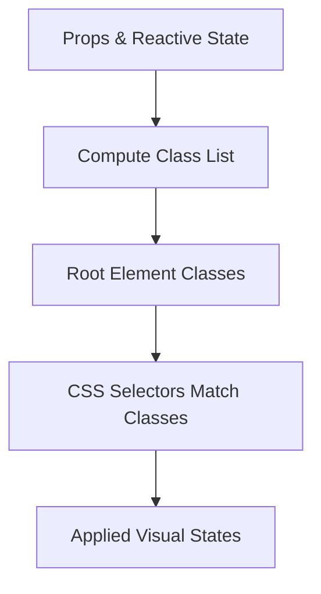
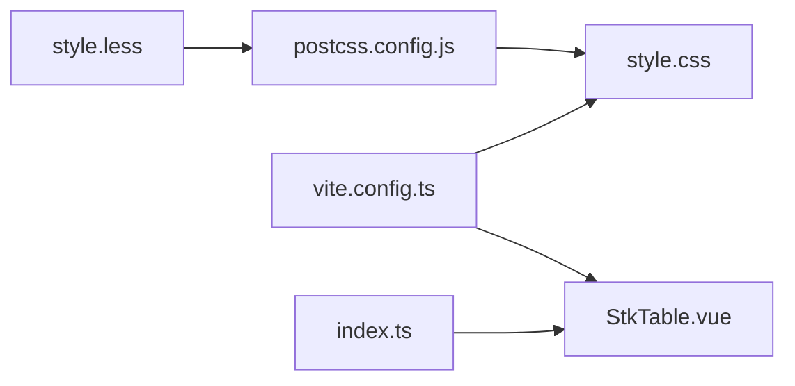

# CSS Customization

<cite>
**Referenced Files in This Document**
- [style.less](file://src/StkTable/style.less)
- [index.ts](file://src/StkTable/index.ts)
- [StkTable.vue](file://src/StkTable/StkTable.vue)
- [index.ts (types)](file://src/StkTable/types/index.ts)
- [style.css](file://lib/style.css)
- [vite.config.ts](file://vite.config.ts)
- [postcss.config.js](file://postcss.config.js)
- [package.json](file://package.json)
- [ScrollbarStyle.vue](file://docs-demo/basic/scrollbar-style/ScrollbarStyle.vue)
- [CustomScrollbar.vue](file://docs-demo/basic/scrollbar-style/CustomScrollbar.vue)
- [StkTableTest.vue](file://test/StkTableTest.vue)
- [useCellSelection.ts](file://src/StkTable/useCellSelection.ts)
</cite>

## Update Summary
**Changes Made**
- Updated color scheme documentation to reflect HSL color modernization
- Enhanced hover and selection visual effects documentation
- Improved dark theme color consistency coverage
- Added background-blend-mode documentation for cell range selection
- Updated CSS variable system to include HSL-based color schemes

## Table of Contents
1. [Introduction](#introduction)
2. [Project Structure](#project-structure)
3. [Core Components](#core-components)
4. [Architecture Overview](#architecture-overview)
5. [Detailed Component Analysis](#detailed-component-analysis)
6. [Dependency Analysis](#dependency-analysis)
7. [Performance Considerations](#performance-considerations)
8. [Troubleshooting Guide](#troubleshooting-guide)
9. [Conclusion](#conclusion)
10. [Appendices](#appendices)

## Introduction
This document explains the CSS customization and styling extensibility architecture of the table component library. It covers the Less preprocessing pipeline, the CSS variable-driven theming model, component classes, and utility styles. It also documents how component props map to CSS classes and variables, how class-based state management and conditional styling work, and how to apply advanced customization techniques such as CSS-in-JS patterns via inline styles, dynamic class application, and style encapsulation. Practical examples demonstrate common styling modifications, component overrides, and custom theme creation. Guidance is included for managing CSS specificity, optimizing performance through selective styling, and integrating with popular CSS frameworks.

**Updated** The CSS architecture now features a modern HSL color scheme for enhanced visual consistency and improved dark theme color harmony.

## Project Structure
The CSS architecture centers around a single Less source file that defines CSS variables, base styles, modifiers, and utilities. The Vite build process compiles Less to CSS, runs PostCSS transforms, and bundles the resulting stylesheet alongside the component library. Consumers import the component and its styles, or rely on the bundled CSS asset.

**Diagram sources**
- [style.less](file://src/StkTable/style.less#L1-L692)
- [postcss.config.js](file://postcss.config.js#L1-L7)
- [style.css](file://lib/style.css#L1-L511)
- [index.ts](file://src/StkTable/index.ts#L1-L5)
- [StkTable.vue](file://src/StkTable/StkTable.vue#L1-L200)
- [vite.config.ts](file://vite.config.ts#L1-L66)

**Section sources**
- [style.less](file://src/StkTable/style.less#L1-L692)
- [index.ts](file://src/StkTable/index.ts#L1-L5)
- [vite.config.ts](file://vite.config.ts#L1-L66)
- [postcss.config.js](file://postcss.config.js#L1-L7)
- [style.css](file://lib/style.css#L1-L511)

## Core Components
- **CSS Variables**: Centralized theming via CSS custom properties (e.g., row heights, paddings, colors, gradients, scrollbar colors). Now featuring modern HSL color values for enhanced visual consistency.
- **Modifier Classes**: Boolean and variant classes applied dynamically based on component props and runtime state (e.g., bordered, striped, dark/light theme, hover/active states).
- **Utility Classes**: Alignment helpers, overflow controls, and specialized utilities (e.g., text alignment, selection range borders).
- **Inline Styles**: Runtime CSS variables injected via the component's root element to reflect prop-driven values (e.g., row height, highlight duration, scrollbar dimensions).
- **PostCSS Transformations**: Preset environment and comment discarding enhance compatibility and reduce bundle size.

**Updated** The color system now uses HSL values for hover and active states, providing better color consistency across light and dark themes.

How props connect to CSS:
- Boolean props map to modifier classes on the root element.
- Numeric props are mapped to inline CSS variables on the root element.
- Column-level className and headerClassName are merged into the cell elements.

**Section sources**
- [style.less](file://src/StkTable/style.less#L8-L110)
- [StkTable.vue](file://src/StkTable/StkTable.vue#L6-L38)
- [index.ts (types)](file://src/StkTable/types/index.ts#L54-L120)
- [postcss.config.js](file://postcss.config.js#L1-L7)

## Architecture Overview
The styling architecture follows a predictable flow:
- Less defines variables and selectors.
- The component applies modifier classes and sets inline CSS variables.
- PostCSS optimizes the CSS for production.
- Consumers can override styles via CSS-in-JS (scoped styles, deep selectors), CSS variables, or by importing and overriding the built CSS.

**Diagram sources**
- [index.ts](file://src/StkTable/index.ts#L4-L5)
- [StkTable.vue](file://src/StkTable/StkTable.vue#L3-L41)
- [style.less](file://src/StkTable/style.less#L8-L692)
- [style.css](file://lib/style.css#L1-L511)

## Detailed Component Analysis

### CSS Variable System and Theming
- The root component class defines a comprehensive set of CSS variables for colors, dimensions, gradients, and animations.
- Dark theme modifier toggles a subset of variables to invert colors and adjust contrast.
- Utilities derive from variables to keep themes cohesive.
- **Updated** Color variables now use HSL values for enhanced visual consistency and modern appearance.

**Updated** The color system features:
- Light theme: `hsl(207, 90%, 70%)` for hover states, `hsl(207, 90%, 54%)` for active states
- Dark theme: `hsl(219, 59%, 60%)` for hover states, `hsl(219, 59%, 51%)` for active states
- Background-blend-mode: `overlay` for refined cell range selection visual blending

Practical implications:
- Override any variable in a consumer scope to customize the entire table.
- Use the dark modifier class to switch to dark palette.
- HSL values provide better color consistency across different themes.

**Section sources**
- [style.less](file://src/StkTable/style.less#L8-L110)
- [style.less](file://src/StkTable/style.less#L143-L186)

### Modifier Classes and Conditional Styling
Modifier classes are computed from props and state:
- Theme: light/dark.
- Borders: bordered, bordered-h, bordered-v, bordered-body-h/v variants.
- Stripes: stripe with optional row-hover and row-active.
- Hover/Active: cell-hover, cell-active, row-hover, row-active.
- Overflow: text-overflow, header-text-overflow.
- Scrolling: virtual, auto-row-height, fixed-relative-mode, scroll-row-by-row, scrollbar-on.
- Resizing: col-resizable, is-col-resizing.
- Selection: is-cell-selecting.

These classes drive conditional styles (e.g., background images for borders, hover/active shadows, striped rows).

**Section sources**
- [StkTable.vue](file://src/StkTable/StkTable.vue#L6-L29)
- [style.less](file://src/StkTable/style.less#L143-L204)
- [style.less](file://src/StkTable/style.less#L120-L142)

### Inline CSS Variables from Props
Props are translated into inline CSS variables on the root element:
- Row heights, header row height.
- Highlight duration and steps for frame-based animations.
- Scrollbar width and height.

This enables dynamic theming without recompiling styles.

**Section sources**
- [StkTable.vue](file://src/StkTable/StkTable.vue#L31-L38)
- [style.less](file://src/StkTable/style.less#L2-L30)

### Column-Level Styling and Dynamic Classes
- Columns support className and headerClassName, which are merged into cell elements.
- Additional classes are conditionally applied based on column type and state (e.g., seq-column, expanded, tree-expanded, drag-row-cell).
- Alignment props map to utility classes (text-l, text-c, text-r).

This allows per-column overrides and state-specific visuals.

**Section sources**
- [index.ts (types)](file://src/StkTable/types/index.ts#L84-L120)
- [lib\stk-table-vue.js](file://lib/stk-table-vue.js#L2740-L2773)

### Scrollbar Styling and Customization
Two approaches are demonstrated:
- Global CSS variables scoped to a container class to alter thumb colors and hover states.
- Native WebKit scrollbar pseudo-elements for width, radius, track, and corner styling.

These examples illustrate how to customize the embedded scrollbar while respecting the component's runtime variables.

**Section sources**
- [ScrollbarStyle.vue](file://docs-demo/basic/scrollbar-style/ScrollbarStyle.vue#L37-L70)
- [CustomScrollbar.vue](file://docs-demo/basic/scrollbar-style/CustomScrollbar.vue#L1-L87)

### Advanced Customization Patterns

#### CSS-in-JS with Scoped Styles
- Consumers can wrap the component and apply scoped styles to override utilities or animations.
- The test file demonstrates deep selectors and custom animations for highlighting rows and cells.

**Diagram sources**
- [StkTableTest.vue](file://test/StkTableTest.vue#L551-L588)

**Section sources**
- [StkTableTest.vue](file://test/StkTableTest.vue#L551-L588)

#### Style Encapsulation and Isolation
- Use scoped styles to limit overrides to a specific instance.
- Combine scoped styles with deep selectors to target internal classes without leaking to siblings.

**Section sources**
- [ScrollbarStyle.vue](file://docs-demo/basic/scrollbar-style/ScrollbarStyle.vue#L29-L70)

#### Custom Theme Creation
- Define a new theme by setting CSS variables in a container class.
- Toggle the dark modifier class to switch palettes.
- Adjust typography, spacing, and border visuals by overriding relevant variables.

**Updated** When creating custom themes, consider using HSL color values for better visual consistency across light and dark modes.

**Section sources**
- [style.less](file://src/StkTable/style.less#L8-L110)

### Class-Based State Management and Conditional Styling
The component computes a rich set of classes reflecting current state and props. These classes enable conditional styling in CSS without JavaScript logic in stylesheets.

**Diagram sources**
- [StkTable.vue](file://src/StkTable/StkTable.vue#L6-L29)
- [style.less](file://src/StkTable/style.less#L143-L204)

**Section sources**
- [StkTable.vue](file://src/StkTable/StkTable.vue#L6-L29)
- [style.less](file://src/StkTable/style.less#L143-L204)

### Enhanced Cell Range Selection Visual Effects
**Updated** The cell range selection feature now uses advanced visual blending techniques:

- **Background Blend Mode**: Uses `background-blend-mode: overlay` for refined visual blending with the background
- **Dynamic Border Styling**: Implements inset box-shadow borders with directional variables (--cs-t, --cs-b, --cs-l, --cs-r)
- **Modern Color Harmony**: Utilizes HSL color values for consistent visual effects across themes

The selection system creates a sophisticated visual effect where the selected range blends naturally with the underlying cell colors while maintaining clear boundary definition.

**Section sources**
- [style.less](file://src/StkTable/style.less#L437-L462)
- [useCellSelection.ts](file://src/StkTable/useCellSelection.ts#L409-L422)

## Dependency Analysis
The CSS pipeline depends on:
- Less compilation to CSS.
- PostCSS with preset environment and comment removal.
- Vite bundling with asset naming and CSS extraction.

**Diagram sources**
- [style.less](file://src/StkTable/style.less#L1-L692)
- [postcss.config.js](file://postcss.config.js#L1-L7)
- [style.css](file://lib/style.css#L1-L511)
- [vite.config.ts](file://vite.config.ts#L1-L66)
- [index.ts](file://src/StkTable/index.ts#L1-L5)

**Section sources**
- [package.json](file://package.json#L57-L62)
- [postcss.config.js](file://postcss.config.js#L1-L7)
- [vite.config.ts](file://vite.config.ts#L10-L33)

## Performance Considerations
- Prefer CSS variables for theming to avoid duplicating styles across variants.
- Use targeted class toggles rather than global resets to minimize cascade recalculations.
- Keep selector specificity low; leverage utility classes and modifiers to avoid deep nesting.
- Limit heavy animations to visible areas; the highlight animation uses CSS variables and steps to balance smoothness and performance.
- Use virtual scrolling to reduce DOM nodes and repaint cost; the CSS accommodates virtual modes with minimal overhead.
- **Updated** HSL color values provide better performance characteristics for color transitions compared to RGB values.

## Troubleshooting Guide
Common issues and resolutions:
- Styles not applying inside shadow roots or deep components: Use deep selectors to pierce component boundaries.
- Overly broad overrides affecting sibling instances: Scope styles to a wrapper container to isolate changes.
- Scrollbar visuals inconsistent with theme: Set CSS variables for thumb and track colors in a themed container class.
- Animation artifacts: Ensure steps-based animation steps are correctly computed and applied via inline CSS variables.
- **Updated** Color inconsistency issues: When creating custom themes, use HSL color values to maintain visual consistency across light and dark modes.
- **Updated** Selection visual blending problems: Ensure background-blend-mode is supported by the browser and test across different background colors.

**Section sources**
- [StkTableTest.vue](file://test/StkTableTest.vue#L551-L588)
- [ScrollbarStyle.vue](file://docs-demo/basic/scrollbar-style/ScrollbarStyle.vue#L37-L70)

## Conclusion
The table component's CSS architecture is designed for flexibility and performance. By combining a robust CSS variable system, modifier classes, and inline CSS variables from props, it supports extensive customization without sacrificing maintainability. Consumers can override styles locally, create custom themes, and integrate with existing design systems using familiar CSS techniques.

**Updated** The modern HSL color scheme ensures consistent visual effects across themes, while advanced blending techniques provide enhanced user experience for interactive features like cell selection.

## Appendices

### Practical Examples Index
- Custom scrollbar styling with CSS variables and WebKit pseudo-elements.
- Scoped styles with deep selectors for animations and header overrides.
- Dynamic inline CSS variables driven by component props.
- **Updated** HSL color scheme implementation for custom themes.
- **Updated** Advanced cell range selection visual effects with background-blend-mode.

**Section sources**
- [ScrollbarStyle.vue](file://docs-demo/basic/scrollbar-style/ScrollbarStyle.vue#L29-L70)
- [CustomScrollbar.vue](file://docs-demo/basic/scrollbar-style/CustomScrollbar.vue#L1-L87)
- [StkTableTest.vue](file://test/StkTableTest.vue#L551-L588)