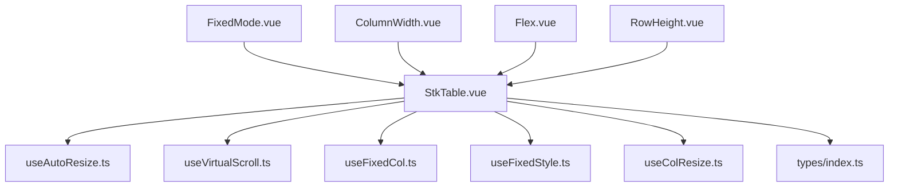
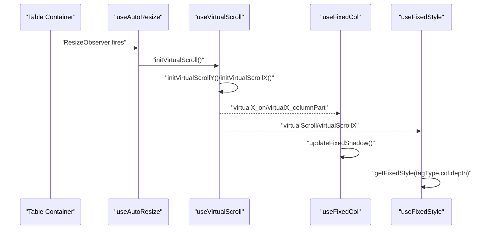
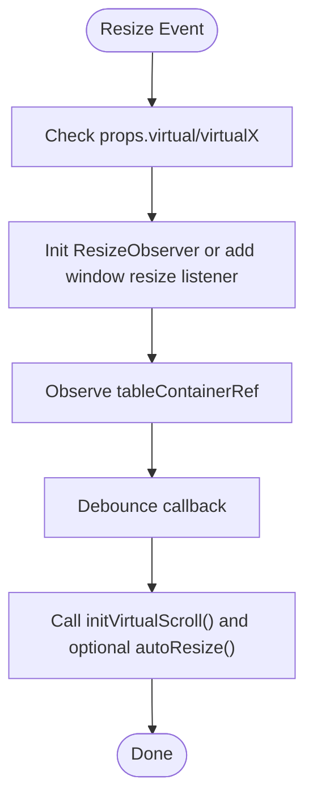
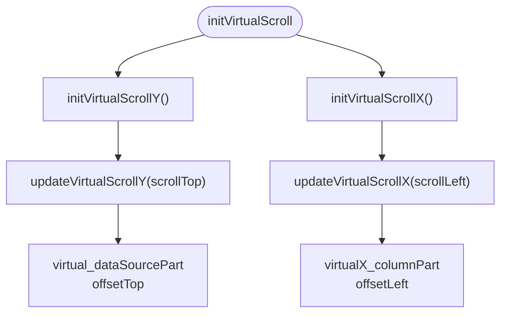
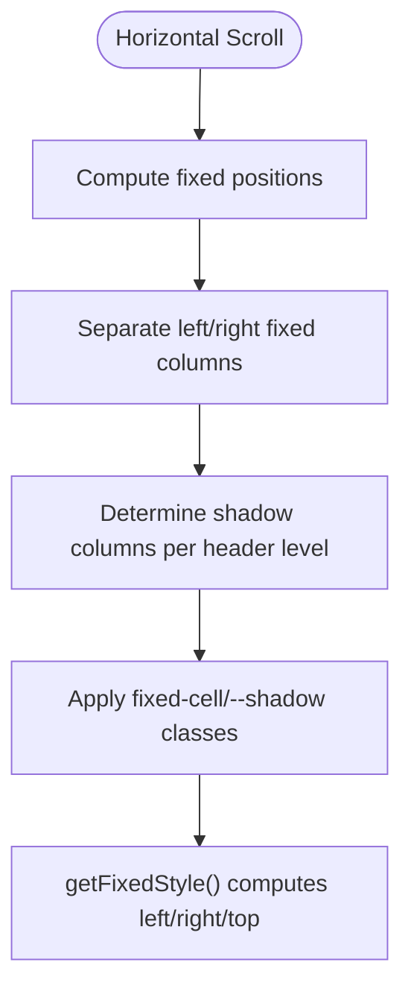
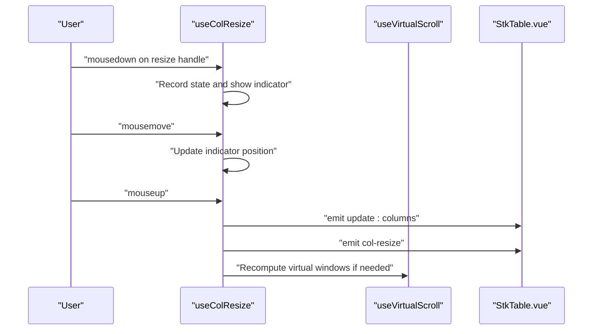
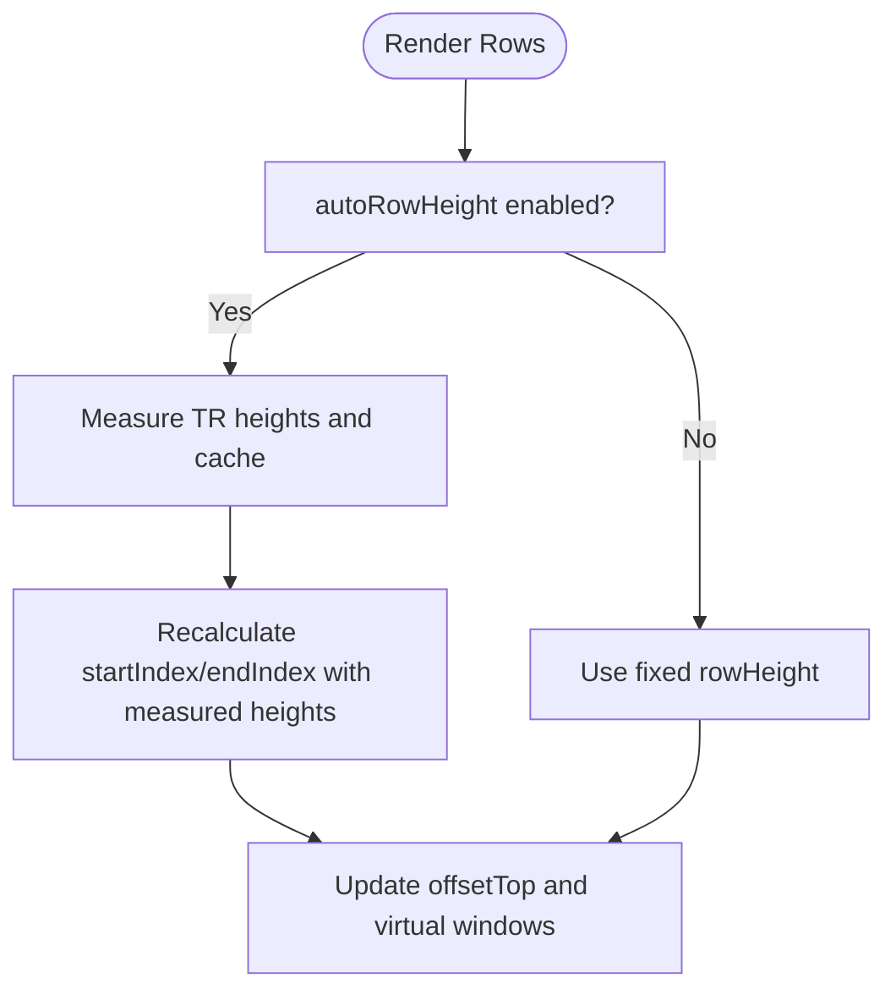
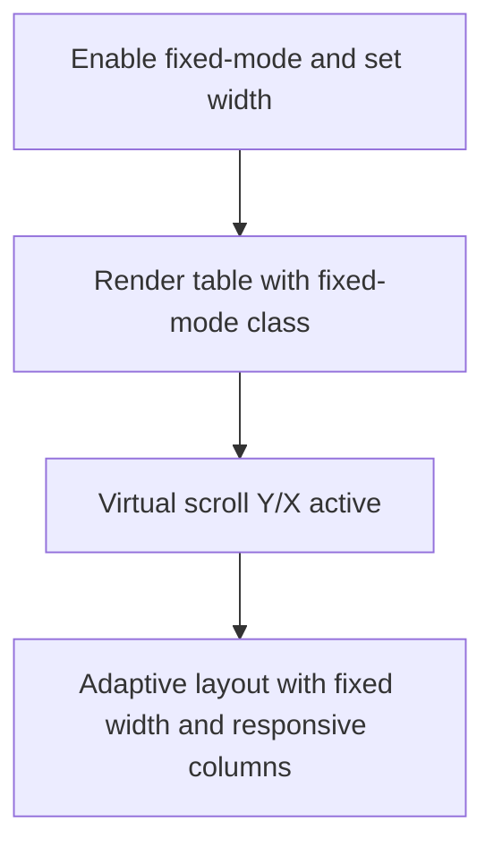
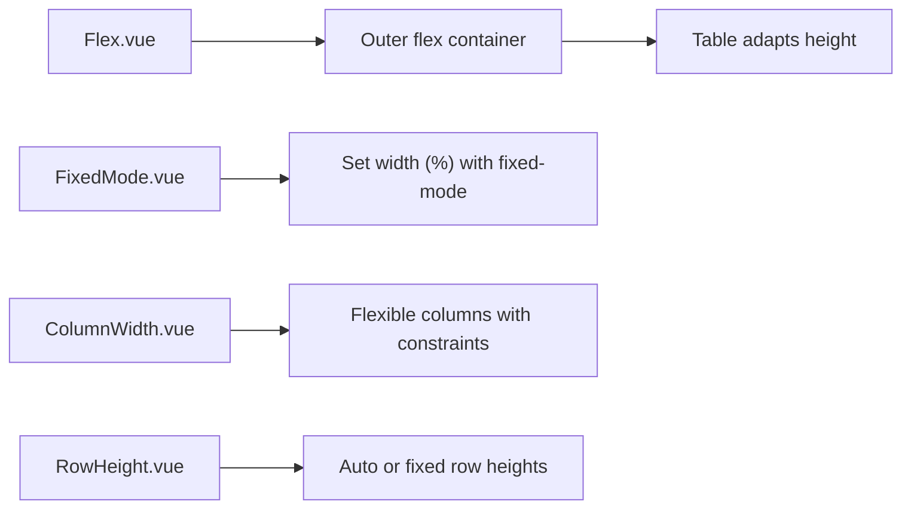
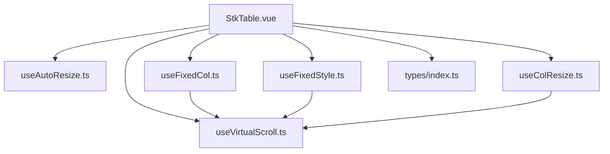

# Responsive Design

<cite>
**Referenced Files in This Document**
- [StkTable.vue](file://src/StkTable/StkTable.vue)
- [useAutoResize.ts](file://src/StkTable/useAutoResize.ts)
- [useFixedCol.ts](file://src/StkTable/useFixedCol.ts)
- [useFixedStyle.ts](file://src/StkTable/useFixedStyle.ts)
- [useVirtualScroll.ts](file://src/StkTable/useVirtualScroll.ts)
- [useColResize.ts](file://src/StkTable/useColResize.ts)
- [types/index.ts](file://src/StkTable/types/index.ts)
- [FixedMode.vue](file://docs-demo/basic/fixed-mode/FixedMode.vue)
- [ColumnWidth.vue](file://docs-demo/basic/column-width/ColumnWidth.vue)
- [Flex.vue](file://docs-demo/basic/size/Flex.vue)
- [RowHeight.vue](file://docs-demo/basic/row-height/RowHeight.vue)
- [size.md](file://docs-src/main/table/basic/size.md)
</cite>

## Table of Contents
1. [Introduction](#introduction)
2. [Project Structure](#project-structure)
3. [Core Components](#core-components)
4. [Architecture Overview](#architecture-overview)
5. [Detailed Component Analysis](#detailed-component-analysis)
6. [Dependency Analysis](#dependency-analysis)
7. [Performance Considerations](#performance-considerations)
8. [Troubleshooting Guide](#troubleshooting-guide)
9. [Conclusion](#conclusion)
10. [Appendices](#appendices)

## Introduction
This document explains the responsive design capabilities and adaptive layout mechanisms in the table library. It focuses on:
- Fixed-mode implementation and fixed-relative-mode for complex layouts
- Flexible column widths and column resizing
- Viewport adaptation via automatic resize handling and virtual scrolling
- Responsive breakpoints and mobile-first considerations
- Touch interaction support
- Adaptive row height calculations
- Practical examples and cross-device compatibility guidance
- Performance implications and accessibility considerations

## Project Structure
The responsive behavior is implemented primarily in the core table component and supporting composables:
- The main table component orchestrates rendering, styles, and events
- Composables handle auto-resize, fixed columns, virtual scrolling, and column resizing
- Demo pages illustrate responsive configurations and fixed-mode usage

**Diagram sources**
- [StkTable.vue](file://src/StkTable/StkTable.vue#L1-L200)
- [useAutoResize.ts](file://src/StkTable/useAutoResize.ts#L1-L92)
- [useVirtualScroll.ts](file://src/StkTable/useVirtualScroll.ts#L1-L499)
- [useFixedCol.ts](file://src/StkTable/useFixedCol.ts#L1-L156)
- [useFixedStyle.ts](file://src/StkTable/useFixedStyle.ts#L1-L76)
- [useColResize.ts](file://src/StkTable/useColResize.ts#L1-L215)
- [types/index.ts](file://src/StkTable/types/index.ts#L1-L318)
- [FixedMode.vue](file://docs-demo/basic/fixed-mode/FixedMode.vue#L1-L46)
- [ColumnWidth.vue](file://docs-demo/basic/column-width/ColumnWidth.vue#L1-L46)
- [Flex.vue](file://docs-demo/basic/size/Flex.vue#L1-L60)
- [RowHeight.vue](file://docs-demo/basic/row-height/RowHeight.vue#L1-L48)

**Section sources**
- [StkTable.vue](file://src/StkTable/StkTable.vue#L1-L200)
- [useAutoResize.ts](file://src/StkTable/useAutoResize.ts#L1-L92)
- [useVirtualScroll.ts](file://src/StkTable/useVirtualScroll.ts#L1-L499)
- [useFixedCol.ts](file://src/StkTable/useFixedCol.ts#L1-L156)
- [useFixedStyle.ts](file://src/StkTable/useFixedStyle.ts#L1-L76)
- [useColResize.ts](file://src/StkTable/useColResize.ts#L1-L215)
- [types/index.ts](file://src/StkTable/types/index.ts#L1-L318)
- [FixedMode.vue](file://docs-demo/basic/fixed-mode/FixedMode.vue#L1-L46)
- [ColumnWidth.vue](file://docs-demo/basic/column-width/ColumnWidth.vue#L1-L46)
- [Flex.vue](file://docs-demo/basic/size/Flex.vue#L1-L60)
- [RowHeight.vue](file://docs-demo/basic/row-height/RowHeight.vue#L1-L48)
- [size.md](file://docs-src/main/table/basic/size.md#L1-L22)

## Core Components
- Automatic resize observer: watches container size changes and triggers virtual scroll re-init and optional callbacks
- Virtual scrolling (Y/X): computes visible windows for rows and columns, supports fixed columns and adaptive offsets
- Fixed columns: tracks fixed columns and applies shadow classes based on scroll position
- Fixed styles: computes absolute positions for fixed cells in both fixed and fixed-relative modes
- Column resizing: enables dynamic width adjustments with minimum/maximum constraints and indicator feedback
- Types: defines column configuration including width, minWidth, maxWidth, and fixed positioning

**Section sources**
- [useAutoResize.ts](file://src/StkTable/useAutoResize.ts#L14-L92)
- [useVirtualScroll.ts](file://src/StkTable/useVirtualScroll.ts#L60-L499)
- [useFixedCol.ts](file://src/StkTable/useFixedCol.ts#L19-L156)
- [useFixedStyle.ts](file://src/StkTable/useFixedStyle.ts#L19-L76)
- [useColResize.ts](file://src/StkTable/useColResize.ts#L29-L215)
- [types/index.ts](file://src/StkTable/types/index.ts#L54-L120)

## Architecture Overview
The responsive pipeline integrates container observation, virtualization, and fixed-positioning logic to adapt to viewport changes and user interactions.

**Diagram sources**
- [useAutoResize.ts](file://src/StkTable/useAutoResize.ts#L76-L92)
- [useVirtualScroll.ts](file://src/StkTable/useVirtualScroll.ts#L196-L236)
- [useFixedCol.ts](file://src/StkTable/useFixedCol.ts#L91-L145)
- [useFixedStyle.ts](file://src/StkTable/useFixedStyle.ts#L34-L72)

## Detailed Component Analysis

### Automatic Resize and Viewport Adaptation
- Watches virtual and virtualX flags to enable/disable observers
- Uses ResizeObserver when available, falls back to window resize
- Debounces resize events and optionally invokes a user-provided callback
- Reinitializes virtual scroll to recalculate visible windows after resize

**Diagram sources**
- [useAutoResize.ts](file://src/StkTable/useAutoResize.ts#L14-L92)

**Section sources**
- [useAutoResize.ts](file://src/StkTable/useAutoResize.ts#L14-L92)
- [size.md](file://docs-src/main/table/basic/size.md#L1-L22)

### Virtual Scrolling and Adaptive Layouts
- Vertical virtualization: calculates page size, start/end indices, and top offset based on row heights and header height
- Horizontal virtualization: computes visible columns, preserves fixed-left/right columns, and calculates right offset
- Auto row height: measures rendered rows and caches heights for accurate virtualization
- Optimizations: Vue 2 scroll down/up batching to reduce re-renders

**Diagram sources**
- [useVirtualScroll.ts](file://src/StkTable/useVirtualScroll.ts#L196-L236)
- [useVirtualScroll.ts](file://src/StkTable/useVirtualScroll.ts#L274-L407)
- [useVirtualScroll.ts](file://src/StkTable/useVirtualScroll.ts#L414-L478)

**Section sources**
- [useVirtualScroll.ts](file://src/StkTable/useVirtualScroll.ts#L60-L499)

### Fixed Columns and Fixed-Relative Mode
- Fixed columns are tracked and styled with absolute positioning
- Shadow indicators appear when fixed columns are partially obscured by scroll
- Fixed-relative mode adjusts fixed positions relative to virtual scroll offsets
- Left/right fixed columns are preserved during horizontal virtualization

**Diagram sources**
- [useFixedCol.ts](file://src/StkTable/useFixedCol.ts#L91-L145)
- [useFixedStyle.ts](file://src/StkTable/useFixedStyle.ts#L34-L72)

**Section sources**
- [useFixedCol.ts](file://src/StkTable/useFixedCol.ts#L19-L156)
- [useFixedStyle.ts](file://src/StkTable/useFixedStyle.ts#L19-L76)

### Column Widths and Resizing
- Columns support explicit width, minWidth, and maxWidth
- Column resizing handles fixed columns and reverse calculation for edge cases
- Indicator shows live resizing position during drag
- Emits updates to columns and resize events

**Diagram sources**
- [useColResize.ts](file://src/StkTable/useColResize.ts#L83-L198)
- [useVirtualScroll.ts](file://src/StkTable/useVirtualScroll.ts#L127-L132)

**Section sources**
- [useColResize.ts](file://src/StkTable/useColResize.ts#L29-L215)
- [types/index.ts](file://src/StkTable/types/index.ts#L78-L83)

### Adaptive Row Height Calculations
- Supports fixed row height and auto row height
- Measures rendered rows when auto height is enabled and caches measured heights
- Adjusts virtualization offsets and bottom padding accordingly
- Honors expandable row height when applicable

**Diagram sources**
- [useVirtualScroll.ts](file://src/StkTable/useVirtualScroll.ts#L178-L190)
- [useVirtualScroll.ts](file://src/StkTable/useVirtualScroll.ts#L292-L325)
- [useVirtualScroll.ts](file://src/StkTable/useVirtualScroll.ts#L383-L392)

**Section sources**
- [useVirtualScroll.ts](file://src/StkTable/useVirtualScroll.ts#L178-L271)

### Fixed-Mode Implementation
- Fixed-mode ensures the table maintains a specified width while adapting to container constraints
- Demonstrated with percentage width and virtual scrolling enabled
- Works with and without headers (headless mode)

**Diagram sources**
- [FixedMode.vue](file://docs-demo/basic/fixed-mode/FixedMode.vue#L24-L43)
- [StkTable.vue](file://src/StkTable/StkTable.vue#L48-L52)

**Section sources**
- [FixedMode.vue](file://docs-demo/basic/fixed-mode/FixedMode.vue#L1-L46)
- [StkTable.vue](file://src/StkTable/StkTable.vue#L48-L52)

### Practical Examples and Mobile Optimization
- Flex layout: place the table inside a flex container to adapt height automatically
- Fixed width examples: demonstrate fixed-mode with percentage width
- Column width examples: show flexible widths and constraints
- Row height examples: demonstrate fixed and auto row heights

**Diagram sources**
- [Flex.vue](file://docs-demo/basic/size/Flex.vue#L33-L58)
- [FixedMode.vue](file://docs-demo/basic/fixed-mode/FixedMode.vue#L24-L43)
- [ColumnWidth.vue](file://docs-demo/basic/column-width/ColumnWidth.vue#L12-L17)
- [RowHeight.vue](file://docs-demo/basic/row-height/RowHeight.vue#L39-L46)

**Section sources**
- [Flex.vue](file://docs-demo/basic/size/Flex.vue#L1-L60)
- [FixedMode.vue](file://docs-demo/basic/fixed-mode/FixedMode.vue#L1-L46)
- [ColumnWidth.vue](file://docs-demo/basic/column-width/ColumnWidth.vue#L1-L46)
- [RowHeight.vue](file://docs-demo/basic/row-height/RowHeight.vue#L1-L48)
- [size.md](file://docs-src/main/table/basic/size.md#L1-L22)

## Dependency Analysis
The responsive system composes several modules with clear responsibilities and minimal coupling.

**Diagram sources**
- [StkTable.vue](file://src/StkTable/StkTable.vue#L1-L200)
- [useAutoResize.ts](file://src/StkTable/useAutoResize.ts#L1-L92)
- [useVirtualScroll.ts](file://src/StkTable/useVirtualScroll.ts#L1-L499)
- [useFixedCol.ts](file://src/StkTable/useFixedCol.ts#L1-L156)
- [useFixedStyle.ts](file://src/StkTable/useFixedStyle.ts#L1-L76)
- [useColResize.ts](file://src/StkTable/useColResize.ts#L1-L215)
- [types/index.ts](file://src/StkTable/types/index.ts#L1-L318)

**Section sources**
- [StkTable.vue](file://src/StkTable/StkTable.vue#L1-L200)
- [useAutoResize.ts](file://src/StkTable/useAutoResize.ts#L1-L92)
- [useVirtualScroll.ts](file://src/StkTable/useVirtualScroll.ts#L1-L499)
- [useFixedCol.ts](file://src/StkTable/useFixedCol.ts#L1-L156)
- [useFixedStyle.ts](file://src/StkTable/useFixedStyle.ts#L1-L76)
- [useColResize.ts](file://src/StkTable/useColResize.ts#L1-L215)
- [types/index.ts](file://src/StkTable/types/index.ts#L1-L318)

## Performance Considerations
- Resize debouncing prevents excessive re-initialization of virtual scroll
- Virtual scrolling reduces DOM nodes and improves rendering performance for large datasets
- Horizontal virtualization preserves fixed columns to avoid layout thrashing
- Auto row height measurement batches DOM reads to minimize layout recalculations
- Vue 2 scroll optimizations reduce re-render churn during fast scrolling
- Touch-enabled scrollbars improve usability on mobile devices

[No sources needed since this section provides general guidance]

## Troubleshooting Guide
- Fixed columns not visible: ensure fixed columns are included in the visible window; horizontal virtualization preserves fixed-left/right columns
- Shadows not appearing: verify fixedColShadow is enabled and that scrollLeft/offsetLeft are updating
- Column resize conflicts with fixed columns: resizing near fixed edges may require reverse calculation; confirm indicator behavior and emitted updates
- Auto height mismatch: after data changes, clear cached auto heights and re-measure; ensure row keys remain stable
- Resize observer not firing: check container visibility and ensure props.virtual/virtualX are reactive; fallback to window resize listener

**Section sources**
- [useFixedCol.ts](file://src/StkTable/useFixedCol.ts#L91-L145)
- [useColResize.ts](file://src/StkTable/useColResize.ts#L83-L198)
- [useVirtualScroll.ts](file://src/StkTable/useVirtualScroll.ts#L243-L254)
- [useAutoResize.ts](file://src/StkTable/useAutoResize.ts#L42-L74)

## Conclusion
The table’s responsive design leverages automatic resize observation, robust virtual scrolling, and precise fixed-column positioning to deliver smooth, adaptive layouts across devices. By combining fixed-mode with flexible column widths, adaptive row heights, and careful touch interactions, the system achieves excellent performance and usability on desktop and mobile.

[No sources needed since this section summarizes without analyzing specific files]

## Appendices

### Responsive Breakpoints and Mobile-First Principles
- Use flexible containers (e.g., flex) to adapt table height
- Prefer percentage or viewport-relative widths for fluid layouts
- Enable virtual scrolling for large datasets to maintain responsiveness
- Keep column widths flexible with minWidth/maxWidth constraints

**Section sources**
- [size.md](file://docs-src/main/table/basic/size.md#L1-L22)
- [Flex.vue](file://docs-demo/basic/size/Flex.vue#L33-L58)

### Accessibility Considerations
- Ensure sufficient touch target sizes for interactive elements (resizers, sorters)
- Maintain keyboard navigation support via tabindex and focus management
- Provide clear visual feedback for fixed column shadows and hover states
- Preserve semantic table structure for assistive technologies

[No sources needed since this section provides general guidance]