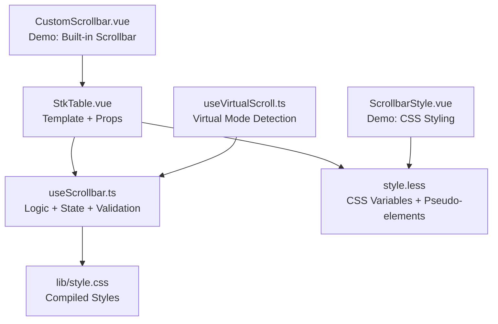
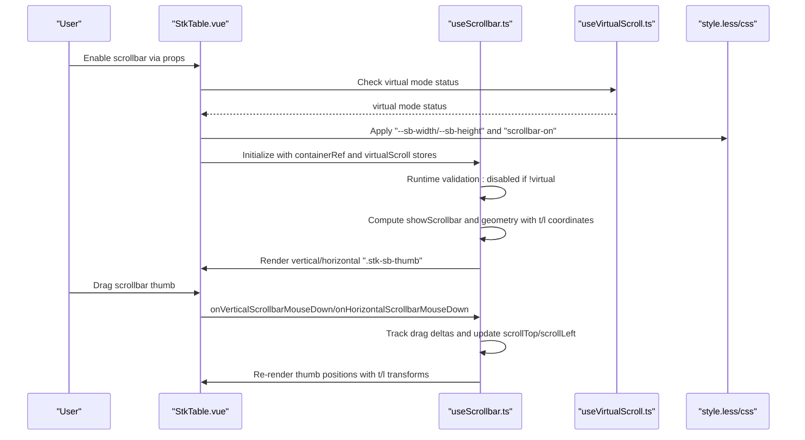
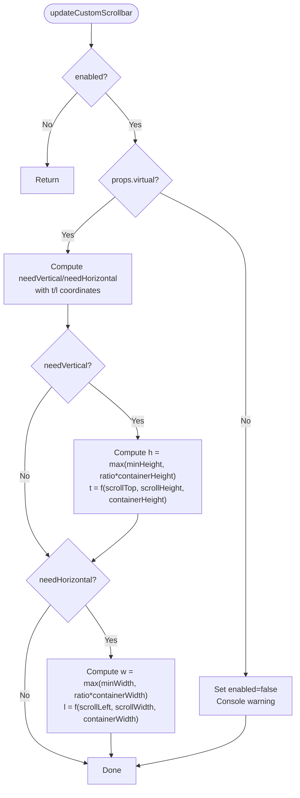
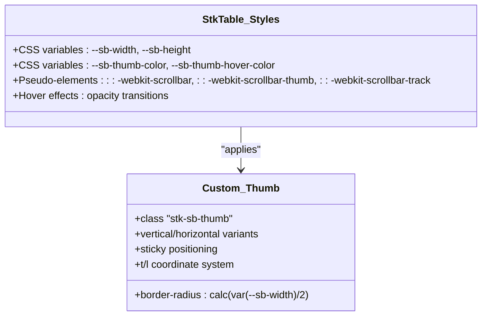
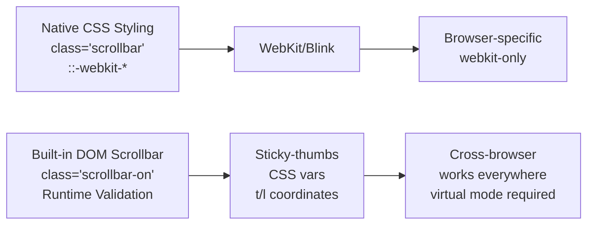
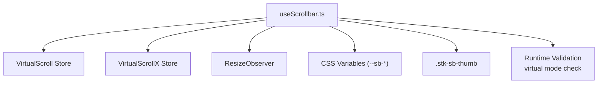

# Scrollbar Styling

<cite>
**Referenced Files in This Document**
- [StkTable.vue](file://src/StkTable/StkTable.vue)
- [useScrollbar.ts](file://src/StkTable/useScrollbar.ts)
- [style.less](file://src/StkTable/style.less)
- [useVirtualScroll.ts](file://src/StkTable/useVirtualScroll.ts)
- [CustomScrollbar.vue](file://docs-demo/basic/scrollbar-style/CustomScrollbar.vue)
- [ScrollbarStyle.vue](file://docs-demo/basic/scrollbar-style/ScrollbarStyle.vue)
- [scrollbar.md](file://docs-src/main/table/basic/scrollbar.md)
- [table-props.md](file://docs-src/en/main/api/table-props.md)
- [style.css](file://lib/style.css)
</cite>

## Update Summary
**Changes Made**
- Updated runtime validation section to reflect automatic scrollbar disabling when virtual mode is not enabled
- Modified coordinate system documentation to reflect the change from `top/left` to `t/l` properties
- Added new troubleshooting section for virtual mode validation
- Updated examples to demonstrate proper virtual mode usage

## Table of Contents
1. [Introduction](#introduction)
2. [Project Structure](#project-structure)
3. [Core Components](#core-components)
4. [Architecture Overview](#architecture-overview)
5. [Detailed Component Analysis](#detailed-component-analysis)
6. [Dependency Analysis](#dependency-analysis)
7. [Performance Considerations](#performance-considerations)
8. [Troubleshooting Guide](#troubleshooting-guide)
9. [Conclusion](#conclusion)

## Introduction
This document explains the custom scrollbar implementation for the table component, covering both the built-in DOM-based scrollbar and CSS-based styling. It focuses on:
- How the built-in scrollbar is rendered and controlled with runtime validation
- CSS pseudo-elements and variables for styling
- Cross-browser compatibility and positioning
- Hover effects and the scrollbar-on class
- Practical examples and customization patterns
- Performance and accessibility considerations

## Project Structure
The scrollbar feature spans three primary areas:
- Component template and props: defines the scrollbar-enabled state and exposes configuration
- Hook logic: computes visibility and geometry, handles drag interactions with runtime validation
- Styles: CSS variables and pseudo-elements for appearance and behavior

**Diagram sources**
- [StkTable.vue](file://src/StkTable/StkTable.vue#L1-L200)
- [useScrollbar.ts](file://src/StkTable/useScrollbar.ts#L1-L192)
- [style.less](file://src/StkTable/style.less#L1-L200)
- [useVirtualScroll.ts](file://src/StkTable/useVirtualScroll.ts#L1-L200)
- [style.css](file://lib/style.css#L36-L510)
- [CustomScrollbar.vue](file://docs-demo/basic/scrollbar-style/CustomScrollbar.vue#L1-L87)
- [ScrollbarStyle.vue](file://docs-demo/basic/scrollbar-style/ScrollbarStyle.vue#L1-L71)

**Section sources**
- [StkTable.vue](file://src/StkTable/StkTable.vue#L1-L200)
- [useScrollbar.ts](file://src/StkTable/useScrollbar.ts#L1-L192)
- [style.less](file://src/StkTable/style.less#L1-L200)
- [useVirtualScroll.ts](file://src/StkTable/useVirtualScroll.ts#L1-L200)
- [CustomScrollbar.vue](file://docs-demo/basic/scrollbar-style/CustomScrollbar.vue#L1-L87)
- [ScrollbarStyle.vue](file://docs-demo/basic/scrollbar-style/ScrollbarStyle.vue#L1-L71)

## Core Components
- Scrollbar props and state
  - The component accepts a scrollbar prop supporting boolean or ScrollbarOptions to enable and configure the built-in scrollbar.
  - The component applies a class to toggle native vs custom scrollbar behavior.
  - **Updated**: Runtime validation automatically disables custom scrollbar when virtual mode is not enabled.
- Scrollbar hook
  - Computes visibility and geometry for vertical and horizontal scrollbars.
  - Handles drag interactions for both axes with coordinate system using `t/l` properties.
  - Throttles updates to maintain performance.
- Styles and variables
  - CSS variables define scrollbar thumb and hover colors.
  - Pseudo-elements target the custom scrollbar visuals.
  - The scrollbar-on class hides native scrollbars when custom scrollbars are enabled.

**Section sources**
- [StkTable.vue](file://src/StkTable/StkTable.vue#L27-L38)
- [StkTable.vue](file://src/StkTable/StkTable.vue#L182-L205)
- [useScrollbar.ts](file://src/StkTable/useScrollbar.ts#L5-L43)
- [style.less](file://src/StkTable/style.less#L50-L118)
- [style.css](file://lib/style.css#L479-L510)

## Architecture Overview
The built-in scrollbar is implemented as DOM elements styled via CSS variables with automatic runtime validation. The component toggles between native and custom scrollbars using a class and adjusts overflow accordingly.

**Diagram sources**
- [StkTable.vue](file://src/StkTable/StkTable.vue#L27-L38)
- [StkTable.vue](file://src/StkTable/StkTable.vue#L182-L205)
- [useScrollbar.ts](file://src/StkTable/useScrollbar.ts#L38-L43)
- [useScrollbar.ts](file://src/StkTable/useScrollbar.ts#L78-L189)
- [useVirtualScroll.ts](file://src/StkTable/useVirtualScroll.ts#L99-L101)
- [style.less](file://src/StkTable/style.less#L656-L689)

## Detailed Component Analysis

### Built-in Scrollbar Implementation
- Runtime validation
  - **Updated**: The hook automatically disables custom scrollbar when `props.virtual` is false, preventing runtime errors and providing clear console warnings.
  - Ensures custom scrollbar functionality only operates in virtual mode environments.
- Rendering
  - Vertical and horizontal thumbs are conditionally rendered when needed.
  - Positions and sizes are computed from virtual scroll stores and applied via inline transforms using `t/l` coordinates.
- Interaction
  - Mouse and touch events capture drag start positions and compute scroll deltas proportional to track and content ranges.
- Visibility and sizing
  - Visibility is determined by comparing scrollable area against container size.
  - Sizes are clamped to minimum values and scaled proportionally.

**Diagram sources**
- [useScrollbar.ts](file://src/StkTable/useScrollbar.ts#L38-L43)
- [useScrollbar.ts](file://src/StkTable/useScrollbar.ts#L80-L101)

**Section sources**
- [StkTable.vue](file://src/StkTable/StkTable.vue#L182-L205)
- [useScrollbar.ts](file://src/StkTable/useScrollbar.ts#L38-L43)
- [useScrollbar.ts](file://src/StkTable/useScrollbar.ts#L80-L189)

### CSS Variables and Pseudo-elements
- Variables
  - --sb-width and --sb-height control the thickness of vertical and horizontal thumbs.
  - --sb-thumb-color and --sb-thumb-hover-color control the base and hover colors.
- Pseudo-elements
  - The custom scrollbar is styled via pseudo-elements targeting the thumb and track.
  - Positioning uses sticky placement and transforms to align within the container.
- Hover behavior
  - Global hover on the table increases thumb opacity.
  - Thumb hover and active states adjust background color and opacity.

**Diagram sources**
- [style.less](file://src/StkTable/style.less#L50-L118)
- [style.less](file://src/StkTable/style.less#L656-L689)
- [style.css](file://lib/style.css#L479-L510)

**Section sources**
- [style.less](file://src/StkTable/style.less#L50-L118)
- [style.less](file://src/StkTable/style.less#L656-L689)
- [style.css](file://lib/style.css#L479-L510)

### Cross-Browser Compatibility and Native vs Custom Scrollbars
- Native scrollbar styling
  - The demo shows applying a class to the table and using webkit pseudo-elements for styling.
  - Effective in Blink/WebKit browsers (Chrome, Safari, Opera).
- Custom scrollbar mode
  - The scrollbar-on class hides native scrollbars while the component renders its own DOM-based scrollbar.
  - The hook observes container size changes and throttles updates to reduce layout churn.
  - **Updated**: Automatic runtime validation ensures custom scrollbar only operates in virtual mode.

**Diagram sources**
- [ScrollbarStyle.vue](file://docs-demo/basic/scrollbar-style/ScrollbarStyle.vue#L37-L70)
- [scrollbar.md](file://docs-src/main/table/basic/scrollbar.md#L3-L21)
- [style.less](file://src/StkTable/style.less#L112-L118)
- [useScrollbar.ts](file://src/StkTable/useScrollbar.ts#L38-L43)

**Section sources**
- [scrollbar.md](file://docs-src/main/table/basic/scrollbar.md#L3-L21)
- [ScrollbarStyle.vue](file://docs-demo/basic/scrollbar-style/ScrollbarStyle.vue#L37-L70)
- [style.less](file://src/StkTable/style.less#L112-L118)
- [useScrollbar.ts](file://src/StkTable/useScrollbar.ts#L38-L43)

### Practical Examples and Theming
- Enabling built-in scrollbar
  - Pass scrollbar prop as true or provide ScrollbarOptions with width and height.
  - **Updated**: Must be used with virtual mode enabled (`virtual` prop).
- Sizing adjustments
  - Control thickness via --sb-width and --sb-height.
- Themes
  - Override --sb-thumb-color and --sb-thumb-hover-color per theme.
- Responsive behavior
  - The hook recomputes geometry on container resize; ensure container dimensions are stable to avoid frequent recalculations.

**Section sources**
- [CustomScrollbar.vue](file://docs-demo/basic/scrollbar-style/CustomScrollbar.vue#L1-L87)
- [scrollbar.md](file://docs-src/main/table/basic/scrollbar.md#L23-L75)
- [table-props.md](file://docs-src/en/main/api/table-props.md#L202-L218)

## Dependency Analysis
The scrollbar feature depends on:
- Virtual scroll stores for geometry with runtime validation
- ResizeObserver for efficient updates
- CSS variables for theming
- Sticky positioning for precise placement
- **Updated**: Virtual mode detection for runtime validation

**Diagram sources**
- [useScrollbar.ts](file://src/StkTable/useScrollbar.ts#L29-L76)
- [useVirtualScroll.ts](file://src/StkTable/useVirtualScroll.ts#L99-L101)
- [style.less](file://src/StkTable/style.less#L50-L118)

**Section sources**
- [useScrollbar.ts](file://src/StkTable/useScrollbar.ts#L29-L76)
- [useVirtualScroll.ts](file://src/StkTable/useVirtualScroll.ts#L99-L101)
- [style.less](file://src/StkTable/style.less#L50-L118)

## Performance Considerations
- Throttled updates
  - The hook throttles geometry recomputation to reduce layout thrash during rapid resizes.
- Minimal DOM
  - Only renders thumbs when needed and uses transforms for positioning.
- Sticky placement
  - Reduces reflow compared to absolute/fixed positioning.
- Resize observation
  - Uses ResizeObserver when available; falls back to window resize listener.
- **Updated**: Runtime validation prevents unnecessary computations when virtual mode is disabled.

Recommendations:
- Keep container sizes stable to minimize recomputations.
- Prefer enabling the built-in scrollbar only when necessary to avoid extra DOM nodes.
- Tune minWidth/minHeight to balance usability and visual footprint.
- **Updated**: Always enable virtual mode when using custom scrollbar functionality.

**Section sources**
- [useScrollbar.ts](file://src/StkTable/useScrollbar.ts#L56-L58)
- [useScrollbar.ts](file://src/StkTable/useScrollbar.ts#L60-L76)
- [useScrollbar.ts](file://src/StkTable/useScrollbar.ts#L38-L43)

## Troubleshooting Guide
Common issues and resolutions:
- Thumbs not visible
  - Ensure scrollbar prop is enabled and container has overflow; verify CSS variables are set.
  - **Updated**: Verify virtual mode is enabled when using custom scrollbar.
- Draggable area feels small
  - Increase minWidth/minHeight in ScrollbarOptions or adjust --sb-width/--sb-height.
- Jittery or slow dragging
  - Confirm throttling is active and container dimensions are stable; avoid excessive reflows.
- Native scrollbar still visible
  - Apply the scrollbar-on class to hide native scrollbars when using custom ones.
- **New**: Console warnings about scrollbar only working in virtual mode
  - Occur when attempting to use custom scrollbar without enabling virtual mode.
  - Solution: Add `virtual` prop to enable virtual scrolling.

Accessibility checklist:
- Ensure sufficient color contrast for thumb and hover states.
- Provide keyboard navigation support (the component supports arrow keys and paging).
- Avoid relying solely on hover to reveal scrollbars; rely on natural scrollbar presence or persistent custom thumbs.
- **Updated**: Verify custom scrollbar functionality only works with virtual mode enabled.

**Section sources**
- [useScrollbar.ts](file://src/StkTable/useScrollbar.ts#L30-L41)
- [useScrollbar.ts](file://src/StkTable/useScrollbar.ts#L38-L43)
- [style.less](file://src/StkTable/style.less#L66-L68)
- [scrollbar.md](file://docs-src/main/table/basic/scrollbar.md#L77-L89)

## Conclusion
The table's scrollbar feature offers two complementary approaches:
- Native CSS styling for Blink/WebKit browsers
- A built-in DOM-based scrollbar with robust interaction, theming via CSS variables, and runtime validation

**Updated**: The enhanced implementation now includes automatic runtime validation that prevents custom scrollbar usage outside virtual mode environments, ensuring reliable operation and clear error messaging. By combining the scrollbar prop, CSS variables, sticky-positioned thumbs with `t/l` coordinate system, and virtual mode validation, developers can achieve consistent, performant, and accessible scrollbars across diverse environments.