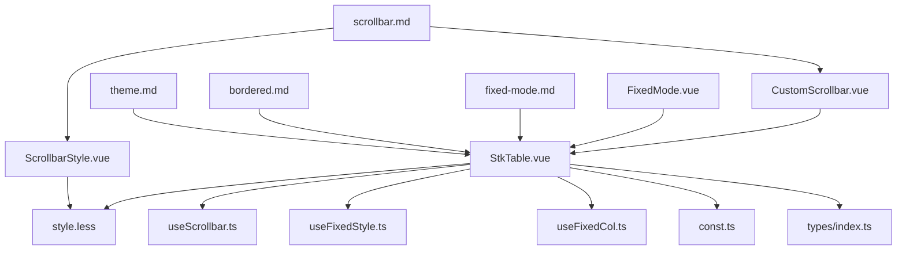
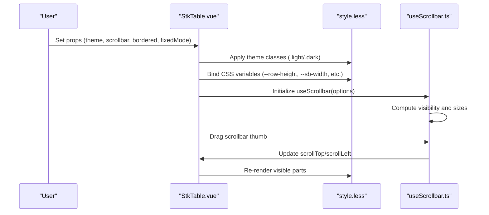
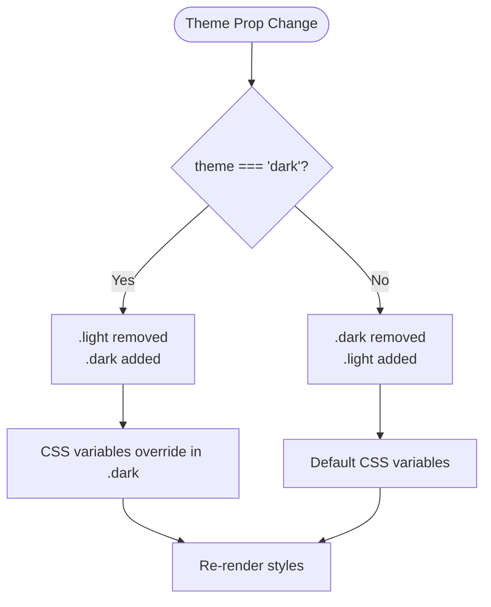
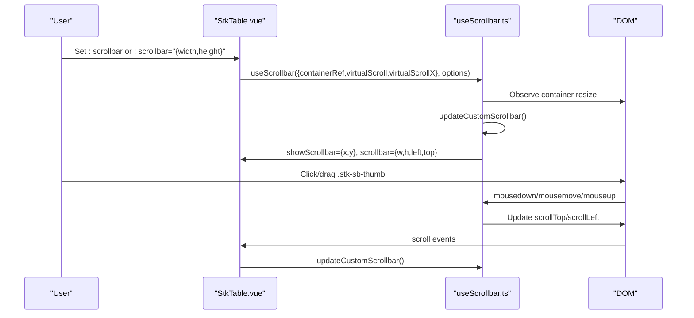
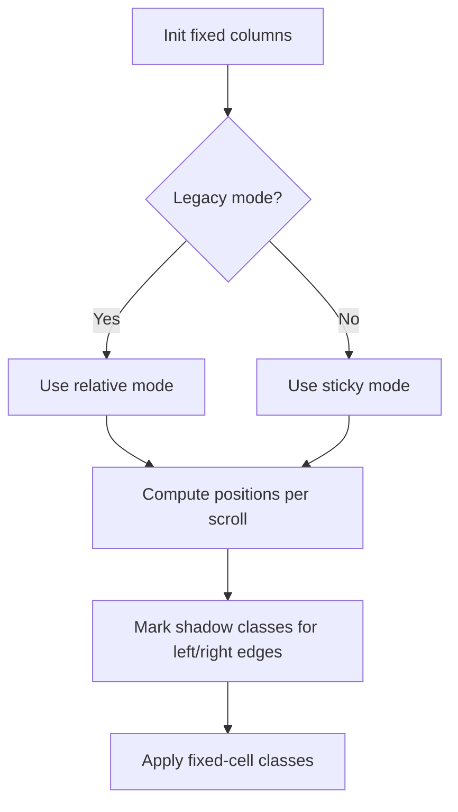
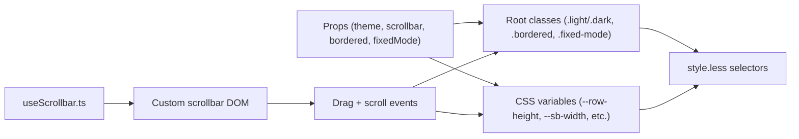

# Styling and Customization

<cite>
**Referenced Files in This Document**
- [style.less](file://src/StkTable/style.less)
- [StkTable.vue](file://src/StkTable/StkTable.vue)
- [useScrollbar.ts](file://src/StkTable/useScrollbar.ts)
- [useFixedStyle.ts](file://src/StkTable/useFixedStyle.ts)
- [useFixedCol.ts](file://src/StkTable/useFixedCol.ts)
- [const.ts](file://src/StkTable/const.ts)
- [index.ts](file://src/StkTable/types/index.ts)
- [ScrollbarStyle.vue](file://docs-demo/basic/scrollbar-style/ScrollbarStyle.vue)
- [CustomScrollbar.vue](file://docs-demo/basic/scrollbar-style/CustomScrollbar.vue)
- [scrollbar.md](file://docs-src/main/table/basic/scrollbar.md)
- [theme.md](file://docs-src/main/table/basic/theme.md)
- [bordered.md](file://docs-src/main/table/basic/bordered.md)
- [fixed-mode.md](file://docs-src/main/table/basic/fixed-mode.md)
- [FixedMode.vue](file://docs-demo/basic/fixed-mode/FixedMode.vue)
</cite>

## Table of Contents
1. [Introduction](#introduction)
2. [Project Structure](#project-structure)
3. [Core Components](#core-components)
4. [Architecture Overview](#architecture-overview)
5. [Detailed Component Analysis](#detailed-component-analysis)
6. [Dependency Analysis](#dependency-analysis)
7. [Performance Considerations](#performance-considerations)
8. [Troubleshooting Guide](#troubleshooting-guide)
9. [Conclusion](#conclusion)
10. [Appendices](#appendices)

## Introduction
This document explains the styling and customization capabilities of the table component. It covers:
- Theme system with light and dark modes
- CSS variable customization and Less preprocessing
- Scrollbar styling and custom scrollbar implementation
- Cross-browser compatibility considerations
- Responsive design, fixed mode configurations, and layout options
- Practical examples for common styling patterns and maintainable customizations

## Project Structure
The styling system is primarily implemented in a single Less stylesheet and integrated via a Vue SFC. Hooks encapsulate interactive behaviors like custom scrollbar dragging and fixed column positioning. Demos and documentation illustrate usage patterns and browser-specific caveats.

**Diagram sources**
- [StkTable.vue](file://src/StkTable/StkTable.vue#L1-L200)
- [style.less](file://src/StkTable/style.less#L1-L691)
- [useScrollbar.ts](file://src/StkTable/useScrollbar.ts#L1-L190)
- [useFixedStyle.ts](file://src/StkTable/useFixedStyle.ts#L1-L76)
- [useFixedCol.ts](file://src/StkTable/useFixedCol.ts#L1-L151)
- [const.ts](file://src/StkTable/const.ts#L1-L51)
- [index.ts](file://src/StkTable/types/index.ts#L1-L318)
- [ScrollbarStyle.vue](file://docs-demo/basic/scrollbar-style/ScrollbarStyle.vue#L1-L71)
- [CustomScrollbar.vue](file://docs-demo/basic/scrollbar-style/CustomScrollbar.vue#L1-L87)
- [scrollbar.md](file://docs-src/main/table/basic/scrollbar.md#L1-L88)
- [theme.md](file://docs-src/main/table/basic/theme.md#L1-L9)
- [bordered.md](file://docs-src/main/table/basic/bordered.md#L1-L16)
- [fixed-mode.md](file://docs-src/main/table/basic/fixed-mode.md#L1-L19)
- [FixedMode.vue](file://docs-demo/basic/fixed-mode/FixedMode.vue#L1-L46)

**Section sources**
- [StkTable.vue](file://src/StkTable/StkTable.vue#L1-L200)
- [style.less](file://src/StkTable/style.less#L1-L691)

## Core Components
- Theme system: Light/dark modes applied via class toggles on the root element and supported by CSS variables.
- CSS variables: Centralized palette and spacing tokens for colors, borders, shadows, selection, and scrollbar visuals.
- Custom scrollbar: Optional DOM-based scrollbar with draggable thumbs and dynamic sizing.
- Fixed columns: Sticky and relative positioning with shadow indicators and class-driven rendering.
- Border and layout: Configurable borders and fixed table-layout mode for predictable column widths.

**Section sources**
- [style.less](file://src/StkTable/style.less#L8-L109)
- [StkTable.vue](file://src/StkTable/StkTable.vue#L6-L29)
- [useScrollbar.ts](file://src/StkTable/useScrollbar.ts#L29-L41)
- [useFixedStyle.ts](file://src/StkTable/useFixedStyle.ts#L34-L72)
- [useFixedCol.ts](file://src/StkTable/useFixedCol.ts#L34-L60)

## Architecture Overview
The component applies theme classes and binds CSS variables from props. Styles are authored in Less and compiled to CSS. Interactive behaviors (scrollbar dragging, fixed column updates) are handled by dedicated hooks.

**Diagram sources**
- [StkTable.vue](file://src/StkTable/StkTable.vue#L6-L38)
- [style.less](file://src/StkTable/style.less#L32-L38)
- [useScrollbar.ts](file://src/StkTable/useScrollbar.ts#L29-L99)

## Detailed Component Analysis

### Theme System (Light/Dark)
- Classes: The root element receives either .light or .dark based on the theme prop.
- Variables: Color tokens for backgrounds, borders, hover/active states, and scrollbar thumbs are overridden in the .dark variant.
- Usage: Switch themes by changing the theme prop; the component toggles the appropriate class.

**Diagram sources**
- [StkTable.vue](file://src/StkTable/StkTable.vue#L10-L11)
- [style.less](file://src/StkTable/style.less#L69-L109)

**Section sources**
- [StkTable.vue](file://src/StkTable/StkTable.vue#L10-L11)
- [style.less](file://src/StkTable/style.less#L69-L109)
- [theme.md](file://docs-src/main/table/basic/theme.md#L1-L9)

### CSS Variable Customization and Less Preprocessing
- Tokens: Row heights, paddings, borders, highlight colors, sort arrows, fold icons, selection colors, and scrollbar visuals are defined as CSS variables.
- Overrides: Users can override variables on .stk-table or .stk-table.dark to customize appearance consistently.
- Preprocessing: Less variables and mixins are used to compute gradients and derived styles.

Practical override targets:
- Backgrounds and borders: --th-bgc, --td-bgc, --border-color, --border-width
- Hover/active states: --tr-hover-bgc, --tr-active-bgc, --td-hover-color, --td-active-color
- Highlights: --highlight-color, --highlight-duration, --highlight-timing-function
- Stripe pattern: --stripe-bgc
- Sort arrows: --sort-arrow-color, --sort-arrow-hover-color, --sort-arrow-active-color
- Fold icon: --fold-icon-color, --fold-icon-hover-color
- Selection: --cell-selection-bgc, --cell-selection-bc
- Scrollbar: --sb-thumb-color, --sb-thumb-hover-color

**Section sources**
- [style.less](file://src/StkTable/style.less#L9-L56)
- [style.less](file://src/StkTable/style.less#L111-L118)
- [style.less](file://src/StkTable/style.less#L142-L186)

### Scrollbar Styling and Custom Scrollbar Implementation
- Native scrollbar styling: Apply a class to the table and style ::-webkit-scrollbar pseudo-elements for Blink/WebKit browsers.
- Custom scrollbar: Enable via the scrollbar prop with optional width/height/min dimensions. The hook computes visibility and thumb sizes, handles drag events, and updates scroll offsets.

**Diagram sources**
- [StkTable.vue](file://src/StkTable/StkTable.vue#L182-L205)
- [useScrollbar.ts](file://src/StkTable/useScrollbar.ts#L29-L99)
- [useScrollbar.ts](file://src/StkTable/useScrollbar.ts#L101-L173)

**Section sources**
- [scrollbar.md](file://docs-src/main/table/basic/scrollbar.md#L1-L88)
- [ScrollbarStyle.vue](file://docs-demo/basic/scrollbar-style/ScrollbarStyle.vue#L1-L71)
- [CustomScrollbar.vue](file://docs-demo/basic/scrollbar-style/CustomScrollbar.vue#L1-L87)
- [useScrollbar.ts](file://src/StkTable/useScrollbar.ts#L29-L41)
- [useScrollbar.ts](file://src/StkTable/useScrollbar.ts#L78-L99)

### Cross-Browser Compatibility
- Legacy sticky mode: On older Chrome/Firefox, the fixed mode falls back to relative positioning to avoid sticky limitations.
- Smooth scroll defaults: Defaults vary by browser to mitigate white-screen during fast wheel events.
- WebKit-only custom scrollbar: Native custom scrollbar styling relies on ::-webkit-scrollbar; other engines require the custom DOM scrollbar.

**Section sources**
- [const.ts](file://src/StkTable/const.ts#L23-L30)
- [StkTable.vue](file://src/StkTable/StkTable.vue#L636-L636)

### Border and Layout Customization
- Borders: The bordered prop supports multiple variants (all, horizontal-only, vertical-only, body-only) and adjusts background gradients for borders.
- Fixed table-layout: Enabling fixedMode forces table-layout: fixed and impacts how widths are calculated and rendered.

**Section sources**
- [bordered.md](file://docs-src/main/table/basic/bordered.md#L1-L16)
- [style.less](file://src/StkTable/style.less#L142-L186)
- [fixed-mode.md](file://docs-src/main/table/basic/fixed-mode.md#L1-L19)
- [FixedMode.vue](file://docs-demo/basic/fixed-mode/FixedMode.vue#L24-L32)

### Fixed Columns and Shadows
- Positioning: Fixed columns use either sticky or relative positioning depending on mode and browser support.
- Shadow indicators: Dynamic classes apply directional shadows when fixed columns become exposed due to horizontal scroll.
- Class mapping: Fixed columns receive classes indicating position and active state.

**Diagram sources**
- [useFixedStyle.ts](file://src/StkTable/useFixedStyle.ts#L34-L72)
- [useFixedCol.ts](file://src/StkTable/useFixedCol.ts#L85-L140)
- [style.less](file://src/StkTable/style.less#L510-L549)

**Section sources**
- [useFixedStyle.ts](file://src/StkTable/useFixedStyle.ts#L34-L72)
- [useFixedCol.ts](file://src/StkTable/useFixedCol.ts#L34-L60)
- [style.less](file://src/StkTable/style.less#L510-L549)

### Responsive Design and Layout Options
- Fit-content width: When column resizing is enabled, the main table switches to fit-content width to adapt to dynamic column widths.
- Auto row height: When enabled, cells and wrappers adjust to content height rather than fixed row height.
- Text overflow: Dedicated classes truncate text in headers and cells to prevent wrapping.

**Section sources**
- [style.less](file://src/StkTable/style.less#L127-L133)
- [style.less](file://src/StkTable/style.less#L315-L324)
- [style.less](file://src/StkTable/style.less#L259-L279)

### Component-Level Styling Approaches
- Per-column classes: Columns accept headerClassName and className for targeted overrides.
- Highlighting: Highlight classes animate transitions using CSS variables for duration and steps.
- Selection and hover: Inset box-shadows and background colors are controlled via variables and classes.

**Section sources**
- [index.ts](file://src/StkTable/types/index.ts#L84-L87)
- [style.less](file://src/StkTable/style.less#L462-L467)
- [style.less](file://src/StkTable/style.less#L214-L222)

## Dependency Analysis
The component’s styling depends on:
- Root class toggles for theme
- CSS variables bound from props
- Hook-managed scrollbar state and DOM interactions
- Fixed column utilities for positioning and shadow classes

**Diagram sources**
- [StkTable.vue](file://src/StkTable/StkTable.vue#L6-L38)
- [style.less](file://src/StkTable/style.less#L8-L691)
- [useScrollbar.ts](file://src/StkTable/useScrollbar.ts#L78-L99)

**Section sources**
- [StkTable.vue](file://src/StkTable/StkTable.vue#L6-L38)
- [style.less](file://src/StkTable/style.less#L8-L691)
- [useScrollbar.ts](file://src/StkTable/useScrollbar.ts#L78-L99)

## Performance Considerations
- Custom scrollbar reduces white-screen risk during fast wheel events by avoiding onwheel-based scrolling when configured.
- CSS variables minimize repaint costs by centralizing theme tokens.
- Fixed mode and sticky positioning can increase layout work; prefer relative mode on legacy browsers.
- Debounced resize observation prevents excessive recomputation of scrollbar sizes.

Recommendations:
- Prefer CSS variables for theming to avoid runtime style recalculation.
- Use the custom scrollbar to stabilize rendering during rapid scrolls.
- Limit heavy animations (e.g., highlight steps) on low-end devices.

**Section sources**
- [const.ts](file://src/StkTable/const.ts#L23-L30)
- [useScrollbar.ts](file://src/StkTable/useScrollbar.ts#L56-L58)

## Troubleshooting Guide
- Custom scrollbar not visible:
  - Ensure the scrollbar prop is enabled and the container has sufficient height/width.
  - Verify showScrollbar reflects true for the relevant axis.
- Native custom scrollbar not applying:
  - Confirm the class is applied to the root and ::-webkit-scrollbar is supported by the engine.
- Dark mode colors look incorrect:
  - Override the relevant CSS variables on .stk-table.dark.
- Fixed column shadows flicker:
  - Confirm fixedColShadow is enabled and updateFixedShadow runs on scroll.
- Borders missing on edges:
  - Use bordered variants and add custom borders where needed due to scroll-edge behavior.

**Section sources**
- [useScrollbar.ts](file://src/StkTable/useScrollbar.ts#L78-L99)
- [style.less](file://src/StkTable/style.less#L142-L186)
- [useFixedCol.ts](file://src/StkTable/useFixedCol.ts#L85-L140)

## Conclusion
The table component offers a robust, CSS-variable-driven theming system with native and custom scrollbar options. By leveraging Less preprocessing and hook-based behaviors, it balances flexibility, performance, and cross-browser compatibility. Use the documented patterns to implement maintainable, scalable customizations.

## Appendices

### Practical Examples Index
- Native custom scrollbar styling: [ScrollbarStyle.vue](file://docs-demo/basic/scrollbar-style/ScrollbarStyle.vue#L1-L71)
- Built-in custom scrollbar: [CustomScrollbar.vue](file://docs-demo/basic/scrollbar-style/CustomScrollbar.vue#L1-L87)
- Fixed table-layout mode: [FixedMode.vue](file://docs-demo/basic/fixed-mode/FixedMode.vue#L24-L32)

**Section sources**
- [ScrollbarStyle.vue](file://docs-demo/basic/scrollbar-style/ScrollbarStyle.vue#L1-L71)
- [CustomScrollbar.vue](file://docs-demo/basic/scrollbar-style/CustomScrollbar.vue#L1-L87)
- [FixedMode.vue](file://docs-demo/basic/fixed-mode/FixedMode.vue#L24-L32)