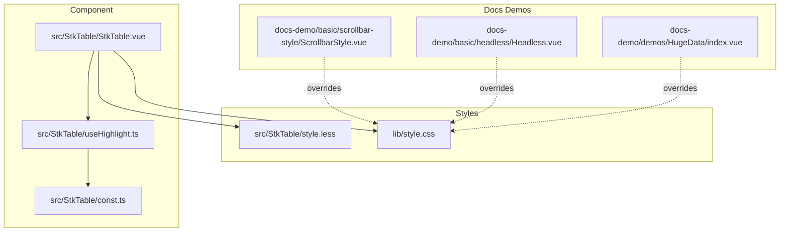
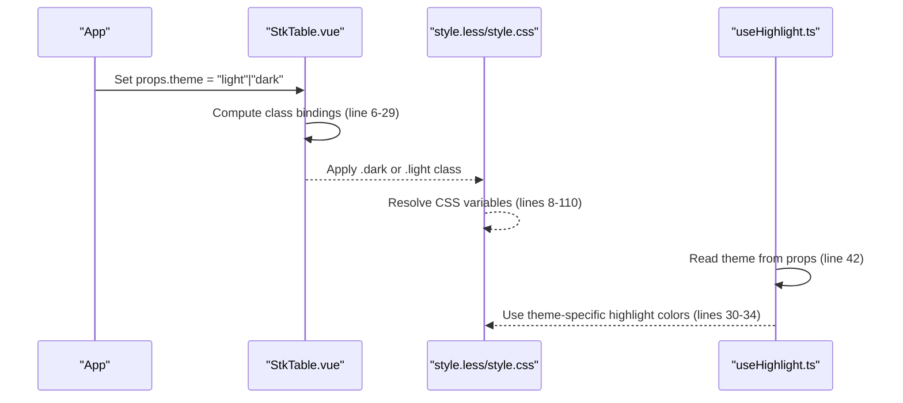
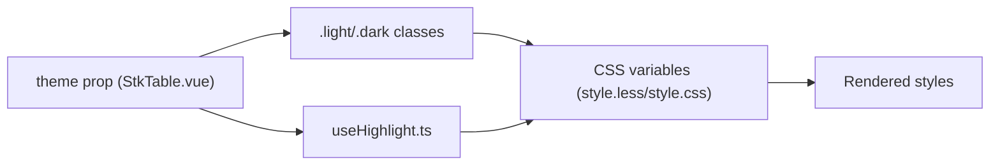

# Theme System

<cite>
**Referenced Files in This Document**
- [style.less](file://src/StkTable/style.less)
- [style.css](file://lib/style.css)
- [StkTable.vue](file://src/StkTable/StkTable.vue)
- [index.ts](file://src/StkTable/index.ts)
- [useHighlight.ts](file://src/StkTable/useHighlight.ts)
- [const.ts](file://src/StkTable/const.ts)
- [theme.md](file://docs-src/main/table/basic/theme.md)
- [theme.md](file://docs-src/en/main/table/basic/theme.md)
- [ScrollbarStyle.vue](file://docs-demo/basic/scrollbar-style/ScrollbarStyle.vue)
- [Headless.vue](file://docs-demo/basic/headless/Headless.vue)
- [HugeData/index.vue](file://docs-demo/demos/HugeData/index.vue)
</cite>

## Table of Contents
1. [Introduction](#introduction)
2. [Project Structure](#project-structure)
3. [Core Components](#core-components)
4. [Architecture Overview](#architecture-overview)
5. [Detailed Component Analysis](#detailed-component-analysis)
6. [Dependency Analysis](#dependency-analysis)
7. [Performance Considerations](#performance-considerations)
8. [Troubleshooting Guide](#troubleshooting-guide)
9. [Conclusion](#conclusion)

## Introduction
This document explains the theme system for the table component, focusing on light and dark mode implementation. It covers CSS custom properties (variables) that control colors, spacing, and visual elements, how the dark mode class applies overrides, and how to customize themes via CSS variable overrides, component-level theme switching, and dynamic theme detection. Practical examples, browser compatibility, and performance implications are included.

## Project Structure
The theme system spans three primary areas:
- Styles: CSS custom properties and dark mode overrides
- Component: runtime theme selection and dynamic CSS variables
- Utilities: highlight behavior that respects theme

**Diagram sources**
- [style.less](file://src/StkTable/style.less#L8-L110)
- [style.css](file://lib/style.css#L14-L87)
- [StkTable.vue](file://src/StkTable/StkTable.vue#L6-L29)
- [useHighlight.ts](file://src/StkTable/useHighlight.ts#L30-L42)
- [const.ts](file://src/StkTable/const.ts#L11-L14)
- [ScrollbarStyle.vue](file://docs-demo/basic/scrollbar-style/ScrollbarStyle.vue#L37-L70)
- [Headless.vue](file://docs-demo/basic/headless/Headless.vue#L37-L37)
- [HugeData/index.vue](file://docs-demo/demos/HugeData/index.vue#L354-L354)

**Section sources**
- [style.less](file://src/StkTable/style.less#L8-L110)
- [style.css](file://lib/style.css#L14-L87)
- [StkTable.vue](file://src/StkTable/StkTable.vue#L6-L29)
- [useHighlight.ts](file://src/StkTable/useHighlight.ts#L30-L42)
- [const.ts](file://src/StkTable/const.ts#L11-L14)

## Core Components
- CSS custom properties define all themeable values (colors, spacings, gradients, animations).
- Dark mode is applied by toggling the .dark class on the root element.
- The component exposes a theme prop to switch between light and dark modes.
- Highlight behavior adapts to the current theme via constant definitions.

Key implementation references:
- CSS variables and dark overrides: [style.less](file://src/StkTable/style.less#L8-L110), [style.css](file://lib/style.css#L14-L87)
- Component theme binding: [StkTable.vue](file://src/StkTable/StkTable.vue#L6-L29)
- Highlight theme colors: [const.ts](file://src/StkTable/const.ts#L11-L14), [useHighlight.ts](file://src/StkTable/useHighlight.ts#L30-L42)

**Section sources**
- [style.less](file://src/StkTable/style.less#L8-L110)
- [style.css](file://lib/style.css#L14-L87)
- [StkTable.vue](file://src/StkTable/StkTable.vue#L6-L29)
- [const.ts](file://src/StkTable/const.ts#L11-L14)
- [useHighlight.ts](file://src/StkTable/useHighlight.ts#L30-L42)

## Architecture Overview
The theme system architecture combines CSS variables with component-driven class toggles and utility-aware behavior.

**Diagram sources**
- [StkTable.vue](file://src/StkTable/StkTable.vue#L6-L29)
- [style.less](file://src/StkTable/style.less#L8-L110)
- [style.css](file://lib/style.css#L14-L87)
- [useHighlight.ts](file://src/StkTable/useHighlight.ts#L30-L42)
- [const.ts](file://src/StkTable/const.ts#L11-L14)

## Detailed Component Analysis

### CSS Variables and Dark Mode Overrides
The component defines a comprehensive set of CSS custom properties for colors, borders, gradients, hover/active states, stripes, sorting arrows, fold icons, scrollbars, and selection visuals. Dark mode overrides are provided under the .dark class to invert palettes while preserving contrast and readability.

Highlights:
- Base variables include row height, paddings, border color/width, cell/table backgrounds, hover/active states, gradients, highlight color, stripe background, sort arrows, fold icons, column resize indicator, fixed column shadows, drag handle hover, scrollbar colors, and cell selection styles.
- Dark mode class redefines all of the above to darker tones, adjusting transparency and contrast for fixed columns and ensuring accessibility.

Practical override locations:
- Base variables and dark overrides: [style.less](file://src/StkTable/style.less#L8-L110)
- Minified production CSS: [style.css](file://lib/style.css#L14-L87)

**Section sources**
- [style.less](file://src/StkTable/style.less#L8-L110)
- [style.css](file://lib/style.css#L14-L87)

### Component-Level Theme Switching
The component exposes a theme prop with a default value of "light". The template dynamically binds classes based on props.theme and other flags. CSS variables are also set at runtime for highlight duration and timing function.

Implementation details:
- Theme prop and default: [StkTable.vue](file://src/StkTable/StkTable.vue#L292-L432)
- Dynamic class binding for theme: [StkTable.vue](file://src/StkTable/StkTable.vue#L6-L29)
- Runtime CSS variables for highlight: [StkTable.vue](file://src/StkTable/StkTable.vue#L31-L38)

**Section sources**
- [StkTable.vue](file://src/StkTable/StkTable.vue#L6-L29)
- [StkTable.vue](file://src/StkTable/StkTable.vue#L292-L432)
- [StkTable.vue](file://src/StkTable/StkTable.vue#L31-L38)

### Highlight Behavior and Theme Awareness
The highlight utility reads the current theme to determine the starting color for animations and fades. It supports three methods: Web Animations API, CSS keyframes, and JS-driven animation loop.

Key points:
- Theme-aware highlight colors: [const.ts](file://src/StkTable/const.ts#L11-L14)
- Highlight hook reads props.theme to choose colors: [useHighlight.ts](file://src/StkTable/useHighlight.ts#L42-L42)
- CSS variables for highlight duration/timing are set by the component: [StkTable.vue](file://src/StkTable/StkTable.vue#L31-L38)

**Section sources**
- [const.ts](file://src/StkTable/const.ts#L11-L14)
- [useHighlight.ts](file://src/StkTable/useHighlight.ts#L30-L42)
- [StkTable.vue](file://src/StkTable/StkTable.vue#L31-L38)

### Practical Examples and Customization Patterns
Common customization scenarios supported by the theme system:

- Override base variables globally:
  - Example: Adjust scrollbar thumb colors per theme using CSS variables.
  - Reference: [ScrollbarStyle.vue](file://docs-demo/basic/scrollbar-style/ScrollbarStyle.vue#L37-L70)

- Target dark mode specifically:
  - Example: Customize header background in dark mode.
  - Reference: [Headless.vue](file://docs-demo/basic/headless/Headless.vue#L37-L37)

- Override component-level variables:
  - Example: Dark mode selector for a demo page.
  - Reference: [HugeData/index.vue](file://docs-demo/demos/HugeData/index.vue#L354-L354)

- Theme documentation and selector mapping:
  - Reference: [theme.md](file://docs-src/main/table/basic/theme.md#L1-L9), [theme.md](file://docs-src/en/main/table/basic/theme.md#L1-L8)

Note: These examples demonstrate how to apply theme-specific styles alongside the built-in .dark class.

**Section sources**
- [ScrollbarStyle.vue](file://docs-demo/basic/scrollbar-style/ScrollbarStyle.vue#L37-L70)
- [Headless.vue](file://docs-demo/basic/headless/Headless.vue#L37-L37)
- [HugeData/index.vue](file://docs-demo/demos/HugeData/index.vue#L354-L354)
- [theme.md](file://docs-src/main/table/basic/theme.md#L1-L9)
- [theme.md](file://docs-src/en/main/table/basic/theme.md#L1-L8)

### Dynamic Theme Detection
While the component exposes a theme prop for explicit control, dynamic detection can be achieved by:
- Observing system preference via JavaScript and updating the theme prop accordingly.
- Applying a global .dark class on the document root when the user prefers dark mode.
- Ensuring CSS variables cascade properly from higher-level containers.

This pattern leverages the existing .dark class and CSS variable overrides without modifying the component’s internal logic.

[No sources needed since this section provides general guidance]

### Browser Compatibility Considerations
- CSS variables are widely supported in modern browsers. Legacy mode considerations exist elsewhere in the codebase for sticky positioning, but theme variables themselves are broadly compatible.
- For older browsers, ensure fallback colors are defined in base variables so that dark mode transitions remain readable.
- When overriding variables, test across browsers to confirm gradient and shadow rendering consistency.

[No sources needed since this section provides general guidance]

## Dependency Analysis
The theme system depends on:
- Component props for theme selection
- CSS custom properties for visual values
- Utility modules for theme-aware behavior

**Diagram sources**
- [StkTable.vue](file://src/StkTable/StkTable.vue#L6-L29)
- [style.less](file://src/StkTable/style.less#L8-L110)
- [style.css](file://lib/style.css#L14-L87)
- [useHighlight.ts](file://src/StkTable/useHighlight.ts#L30-L42)

**Section sources**
- [StkTable.vue](file://src/StkTable/StkTable.vue#L6-L29)
- [style.less](file://src/StkTable/style.less#L8-L110)
- [style.css](file://lib/style.css#L14-L87)
- [useHighlight.ts](file://src/StkTable/useHighlight.ts#L30-L42)

## Performance Considerations
- CSS variable updates are efficient and avoid costly DOM reflows when toggling .dark vs .light.
- Highlight animations leverage CSS animations or Web Animations API; ensure reasonable durations and frame rates to avoid jank.
- Avoid excessive re-computation of CSS variables; the component sets them once per render cycle.
- When overriding variables globally, keep selectors scoped to minimize cascade recalculation.

[No sources needed since this section provides general guidance]

## Troubleshooting Guide
- Theme not applying:
  - Verify the theme prop is passed and bound to the component.
  - Confirm the .dark or .light class appears on the root element.
  - References: [StkTable.vue](file://src/StkTable/StkTable.vue#L6-L29), [theme.md](file://docs-src/main/table/basic/theme.md#L1-L9)

- Colors look incorrect in dark mode:
  - Ensure the .dark class is present and CSS variables are not overridden unexpectedly by parent styles.
  - References: [style.less](file://src/StkTable/style.less#L70-L110), [style.css](file://lib/style.css#L60-L87)

- Highlight color mismatch:
  - Confirm the highlight utility reads the correct theme from props.
  - References: [useHighlight.ts](file://src/StkTable/useHighlight.ts#L42-L42), [const.ts](file://src/StkTable/const.ts#L11-L14)

- Scrollbar theme overrides not taking effect:
  - Scope your overrides to the appropriate container and ensure specificity is sufficient.
  - References: [ScrollbarStyle.vue](file://docs-demo/basic/scrollbar-style/ScrollbarStyle.vue#L37-L70)

**Section sources**
- [StkTable.vue](file://src/StkTable/StkTable.vue#L6-L29)
- [style.less](file://src/StkTable/style.less#L70-L110)
- [style.css](file://lib/style.css#L60-L87)
- [useHighlight.ts](file://src/StkTable/useHighlight.ts#L42-L42)
- [const.ts](file://src/StkTable/const.ts#L11-L14)
- [ScrollbarStyle.vue](file://docs-demo/basic/scrollbar-style/ScrollbarStyle.vue#L37-L70)
- [theme.md](file://docs-src/main/table/basic/theme.md#L1-L9)

## Conclusion
The theme system centers on a robust set of CSS custom properties with targeted dark mode overrides, controlled by a simple theme prop on the component. Developers can customize themes globally or per container by overriding CSS variables, and the highlight utility automatically adapts to the current theme. With careful variable scoping and minimal reflows, theme switching remains performant and accessible across modern browsers.