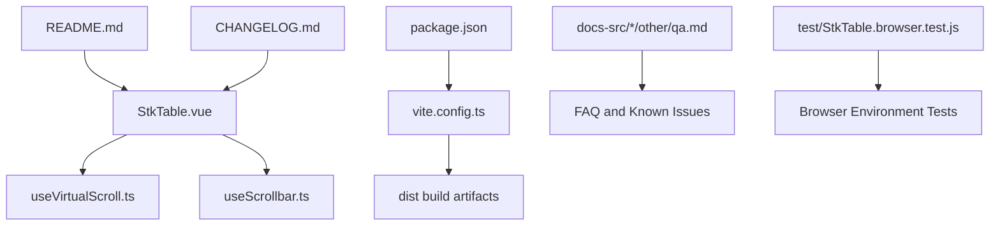
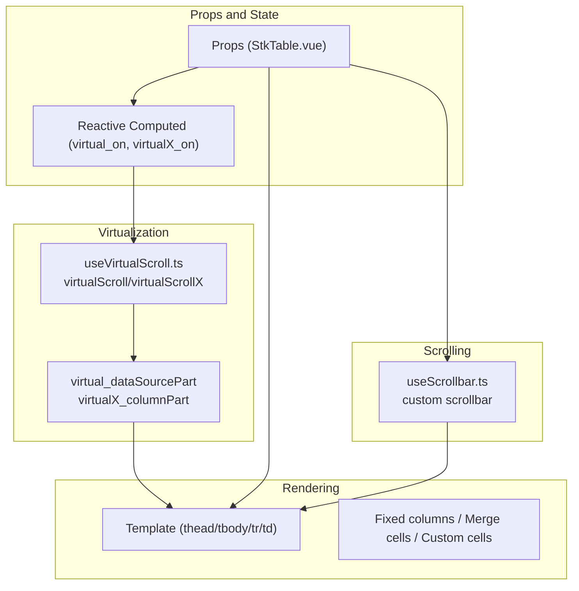
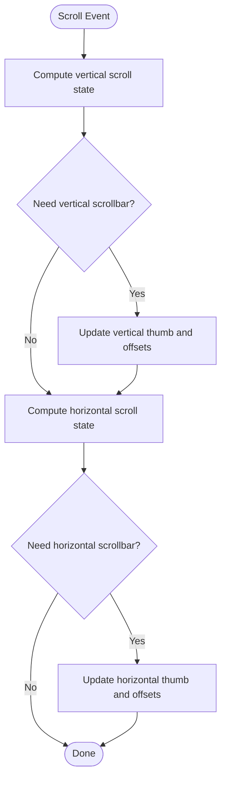
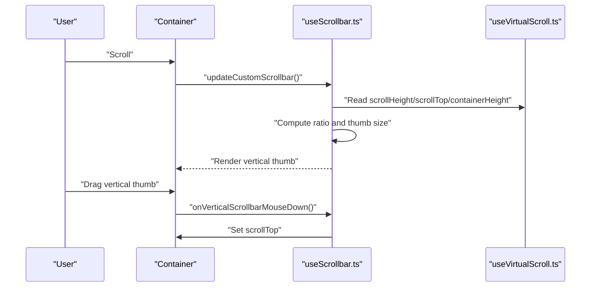
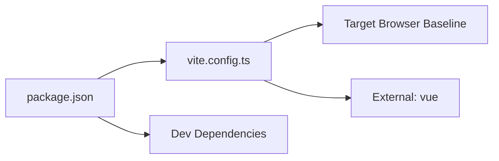

# Troubleshooting and FAQ

<cite>
**Referenced Files in This Document**
- [README.md](file://README.md)
- [CHANGELOG.md](file://CHANGELOG.md)
- [package.json](file://package.json)
- [vite.config.ts](file://vite.config.ts)
- [src/StkTable/StkTable.vue](file://src/StkTable/StkTable.vue)
- [src/StkTable/useVirtualScroll.ts](file://src/StkTable/useVirtualScroll.ts)
- [src/StkTable/useScrollbar.ts](file://src/StkTable/useScrollbar.ts)
- [docs-src/main/other/qa.md](file://docs-src/main/other/qa.md)
- [docs-src/en/main/other/qa.md](file://docs-src/en/main/other/qa.md)
- [test/StkTable.browser.test.js](file://test/StkTable.browser.test.js)
</cite>

## Table of Contents
1. [Introduction](#introduction)
2. [Project Structure](#project-structure)
3. [Core Components](#core-components)
4. [Architecture Overview](#architecture-overview)
5. [Detailed Component Analysis](#detailed-component-analysis)
6. [Dependency Analysis](#dependency-analysis)
7. [Performance Considerations](#performance-considerations)
8. [Troubleshooting Guide](#troubleshooting-guide)
9. [Conclusion](#conclusion)
10. [Appendices](#appendices)

## Introduction
This document provides comprehensive troubleshooting guidance for the Stk Table Vue project. It focuses on diagnosing and resolving performance issues, rendering anomalies, and compatibility challenges across browsers and Vue versions. It also covers debugging techniques, development tool usage, and diagnostic approaches, including systematic methodologies for interpreting error messages and applying preventive measures. Community-reported issues and their step-by-step fixes are included to help you quickly restore expected behavior.

## Project Structure
The project is a Vue 3 and Vue 2.7-compatible virtual table library. Key areas relevant to troubleshooting include:
- Core component: StkTable.vue
- Virtualization and scrolling: useVirtualScroll.ts, useScrollbar.ts
- Build configuration and targets: vite.config.ts
- Documentation and FAQs: docs-src/*/other/qa.md
- Tests: test/StkTable.browser.test.js

**Diagram sources**
- [README.md](file://README.md#L1-L173)
- [CHANGELOG.md](file://CHANGELOG.md#L1-L649)
- [package.json](file://package.json#L1-L76)
- [vite.config.ts](file://vite.config.ts#L1-L66)
- [src/StkTable/StkTable.vue](file://src/StkTable/StkTable.vue#L1-L800)
- [src/StkTable/useVirtualScroll.ts](file://src/StkTable/useVirtualScroll.ts#L1-L200)
- [src/StkTable/useScrollbar.ts](file://src/StkTable/useScrollbar.ts#L1-L190)
- [docs-src/main/other/qa.md](file://docs-src/main/other/qa.md#L1-L8)
- [docs-src/en/main/other/qa.md](file://docs-src/en/main/other/qa.md#L1-L10)
- [test/StkTable.browser.test.js](file://test/StkTable.browser.test.js#L1-L72)

**Section sources**
- [README.md](file://README.md#L1-L173)
- [CHANGELOG.md](file://CHANGELOG.md#L1-L649)
- [package.json](file://package.json#L1-L76)
- [vite.config.ts](file://vite.config.ts#L1-L66)

## Core Components
- StkTable.vue: Central component implementing virtualization, fixed columns, custom cells, sorting, merging, and custom scrollbar. It exposes props, emits, slots, and methods that are commonly involved in troubleshooting.
- useVirtualScroll.ts: Implements virtual scroll calculations, row/column visibility windows, and offsets. Many rendering and performance issues originate here.
- useScrollbar.ts: Provides custom scrollbar behavior and sizing. Misconfiguration often leads to missing or misaligned scrollbars.

Common troubleshooting scenarios:
- Virtual scroll not activating or incorrect startIndex/endIndex
- Horizontal virtual scroll not rendering columns properly
- Custom scrollbar not visible or not updating
- Empty state not displaying as expected
- Column or dataSource changes not taking effect

**Section sources**
- [src/StkTable/StkTable.vue](file://src/StkTable/StkTable.vue#L1-L800)
- [src/StkTable/useVirtualScroll.ts](file://src/StkTable/useVirtualScroll.ts#L1-L200)
- [src/StkTable/useScrollbar.ts](file://src/StkTable/useScrollbar.ts#L1-L190)

## Architecture Overview
The table’s runtime architecture integrates props-driven configuration, reactive computations, and event handlers to manage virtualization and rendering.

**Diagram sources**
- [src/StkTable/StkTable.vue](file://src/StkTable/StkTable.vue#L1-L800)
- [src/StkTable/useVirtualScroll.ts](file://src/StkTable/useVirtualScroll.ts#L1-L200)
- [src/StkTable/useScrollbar.ts](file://src/StkTable/useScrollbar.ts#L1-L190)

## Detailed Component Analysis

### Virtual Scrolling Troubleshooting
Common symptoms:
- Rows/columns not appearing while scrolling
- Incorrect startIndex/endIndex reported
- Horizontal virtual scroll cutting off columns or not rendering fixed columns

Root causes and checks:
- Virtual scroll activation depends on data length exceeding internal pageSize. Verify data length and props.virtual.
- Horizontal virtual scroll requires accurate column width summation and container width comparison. Ensure columns have widths and table is sized appropriately.
- Fixed columns in horizontal virtual mode are temporarily injected into the visible window. Confirm fixed column keys and widths.

Recommended diagnostics:
- Inspect computed flags virtual_on and virtualX_on.
- Log virtualScroll/virtualScrollX state during scroll events.
- Validate column widths and tableHeaderLast composition.

**Diagram sources**
- [src/StkTable/useVirtualScroll.ts](file://src/StkTable/useVirtualScroll.ts#L1-L200)
- [src/StkTable/useScrollbar.ts](file://src/StkTable/useScrollbar.ts#L1-L190)

**Section sources**
- [src/StkTable/useVirtualScroll.ts](file://src/StkTable/useVirtualScroll.ts#L100-L176)
- [src/StkTable/StkTable.vue](file://src/StkTable/StkTable.vue#L1-L800)

### Custom Scrollbar Troubleshooting
Symptoms:
- Custom scrollbar not visible
- Scrollbar thumb does not move or jumps
- Scroll events not triggering as expected

Checks:
- Ensure props.scrollbar is enabled (boolean or ScrollbarOptions).
- Confirm ResizeObserver updates are firing and showScrollbar flags are set.
- Validate min sizes and thumb sizing logic.

**Diagram sources**
- [src/StkTable/useScrollbar.ts](file://src/StkTable/useScrollbar.ts#L78-L100)
- [src/StkTable/useVirtualScroll.ts](file://src/StkTable/useVirtualScroll.ts#L73-L82)

**Section sources**
- [src/StkTable/useScrollbar.ts](file://src/StkTable/useScrollbar.ts#L29-L99)
- [src/StkTable/StkTable.vue](file://src/StkTable/StkTable.vue#L182-L205)

### Empty State and No-Data Rendering
Symptoms:
- No data placeholder not showing
- Full-height no-data not working

Checks:
- Ensure dataSource is empty and showNoData is true.
- Verify noDataFull flag and slot usage.

**Section sources**
- [src/StkTable/StkTable.vue](file://src/StkTable/StkTable.vue#L192-L195)
- [test/StkTable.browser.test.js](file://test/StkTable.browser.test.js#L58-L70)

### Column and DataSource Change Not Taking Effect
Symptoms:
- Updating columns or dataSource visually does not reflect changes

Explanation:
- The component watches columns/dataSource without deep watching. Reassigning a new reference resolves the issue.

Resolution steps:
- Replace columns with a new array reference.
- Replace dataSource with a new array reference.

**Section sources**
- [docs-src/main/other/qa.md](file://docs-src/main/other/qa.md#L3-L7)
- [docs-src/en/main/other/qa.md](file://docs-src/en/main/other/qa.md#L3-L4)

## Dependency Analysis
Build and compatibility dependencies:
- Target browser baseline affects polyfills and syntax. The build targets a specific Chromium baseline.
- Vue version support spans Vue 3 and Vue 2.7.
- External dependency: vue is treated as external in Rollup.

**Diagram sources**
- [package.json](file://package.json#L1-L76)
- [vite.config.ts](file://vite.config.ts#L10-L33)

**Section sources**
- [package.json](file://package.json#L43-L75)
- [vite.config.ts](file://vite.config.ts#L13-L13)

## Performance Considerations
- Virtualization thresholds: virtual_on activates when data length exceeds internal pageSize. Tune data volume and rowHeight to avoid unnecessary virtualization overhead.
- Horizontal virtualization: Ensure column widths are set and table width allows proper computation of scrollWidth vs containerWidth.
- Custom scrollbar: Enabling custom scrollbar can mitigate white-screen issues during drag and reduce reflow.
- Auto row height: Variable row heights increase computation cost; use judiciously and precompute where possible.

[No sources needed since this section provides general guidance]

## Troubleshooting Guide

### Systematic Problem-Solving Methodology
1. Reproduce the issue with minimal dataset and simplest props.
2. Inspect computed flags (virtual_on, virtualX_on) and state (virtualScroll/virtualScrollX).
3. Verify column widths and table sizing.
4. Toggle props like scrollbar, autoRowHeight, and virtual/virtualX to isolate the cause.
5. Review recent changes against the changelog for known regressions or fixes.
6. Run tests in the browser environment to confirm rendering behavior.

### Common Issues and Fixes

#### Issue: Columns changes do not take effect
- Cause: Internal watcher does not deep-watch columns.
- Fix: Assign a new columns reference.

**Section sources**
- [docs-src/main/other/qa.md](file://docs-src/main/other/qa.md#L3-L4)
- [docs-src/en/main/other/qa.md](file://docs-src/en/main/other/qa.md#L3-L4)

#### Issue: dataSource changes do not take effect
- Cause: Same as columns; shallow watcher.
- Fix: Assign a new dataSource reference.

**Section sources**
- [docs-src/main/other/qa.md](file://docs-src/main/other/qa.md#L6-L7)
- [docs-src/en/main/other/qa.md](file://docs-src/en/main/other/qa.md#L3-L4)

#### Issue: Virtual scroll not activating or incorrect indices
- Symptoms: Rows not appearing, startIndex/endIndex incorrect.
- Checks:
  - Ensure data length exceeds internal pageSize.
  - Confirm rowHeight and headerRowHeight.
  - Validate container height and virtualScroll state.
- Related fix: A previous bug corrected startIndex/endIndex reporting in normal scroll mode.

**Section sources**
- [src/StkTable/useVirtualScroll.ts](file://src/StkTable/useVirtualScroll.ts#L100-L108)
- [CHANGELOG.md](file://CHANGELOG.md#L118-L121)

#### Issue: Horizontal virtual scroll cuts off columns or ignores fixed columns
- Symptoms: Missing rightmost columns or fixed columns not visible.
- Checks:
  - Ensure tableHeaderLast widths sum exceeds containerWidth + 100.
  - Confirm fixed column keys and widths.
  - Validate virtualX_columnPart composition logic.
- Related fix: A known issue noted for column count reduction causing endIndex overflow; ensure column visibility bounds are recalculated.

**Section sources**
- [src/StkTable/useVirtualScroll.ts](file://src/StkTable/useVirtualScroll.ts#L127-L163)
- [CHANGELOG.md](file://CHANGELOG.md#L420-L421)

#### Issue: Custom scrollbar not visible or not updating
- Symptoms: No scrollbar thumbs, or thumbs not moving.
- Checks:
  - Enable props.scrollbar and confirm merged options.
  - Ensure ResizeObserver fires and showScrollbar flags are set.
  - Validate min sizes and thumb sizing logic.
- Related fix: Custom scrollbar support was added to resolve white-screen issues during drag.

**Section sources**
- [src/StkTable/useScrollbar.ts](file://src/StkTable/useScrollbar.ts#L29-L99)
- [CHANGELOG.md](file://CHANGELOG.md#L30-L32)

#### Issue: Empty state not showing or not full height
- Symptoms: No “No data” placeholder or not filling container.
- Checks:
  - Ensure dataSource is empty and showNoData is true.
  - Toggle noDataFull to see if placeholder fills container.

**Section sources**
- [src/StkTable/StkTable.vue](file://src/StkTable/StkTable.vue#L192-L195)
- [test/StkTable.browser.test.js](file://test/StkTable.browser.test.js#L58-L70)

#### Issue: White screen during scrollbar drag
- Cause: Vanilla scrollbar drag can cause white screen in some environments.
- Fix: Enable custom scrollbar via props.scrollbar to mitigate.

**Section sources**
- [CHANGELOG.md](file://CHANGELOG.md#L30-L32)

#### Issue: Performance degradation with merged cells and hover
- Symptom: Hover row background performance impacted by merged cells.
- Fix: Review hover/active merged cell logic and consider simplifying hover styles.

**Section sources**
- [CHANGELOG.md](file://CHANGELOG.md#L56-L57)

### Debugging Techniques and Tools
- Console inspection: Log props, computed flags, and state during scroll events.
- Test harness: Use browser environment tests to assert attributes and classes.
- Devtools: Inspect rendered DOM nodes for data-row-key/data-col-key presence and correct widths.

**Section sources**
- [test/StkTable.browser.test.js](file://test/StkTable.browser.test.js#L27-L48)

### Development Tools and Diagnostics
- Build target: The project targets a specific Chromium baseline; ensure your environment matches or polyfill accordingly.
- External dependencies: vue is externalized; confirm compatible versions are installed in consuming apps.

**Section sources**
- [vite.config.ts](file://vite.config.ts#L13-L13)
- [package.json](file://package.json#L73-L73)

### Compatibility and Version Conflicts
- Vue version: Supports Vue 3 and Vue 2.7. Ensure your app’s Vue version aligns with supported ranges.
- Browser compatibility: The build target implies a minimum Chromium baseline; older browsers may require polyfills.

**Section sources**
- [README.md](file://README.md#L19-L19)
- [vite.config.ts](file://vite.config.ts#L13-L13)
- [package.json](file://package.json#L73-L73)

### Preventive Measures
- Always pass new references when updating columns or dataSource.
- Set explicit column widths for horizontal virtualization.
- Enable custom scrollbar when drag interactions are expected.
- Keep dependencies updated and review changelog for breaking changes.

**Section sources**
- [docs-src/main/other/qa.md](file://docs-src/main/other/qa.md#L3-L7)
- [CHANGELOG.md](file://CHANGELOG.md#L1-L649)

## Conclusion
By systematically validating computed flags, state, and props, and by referencing the changelog for known fixes, most issues can be resolved quickly. Use the provided diagnostic steps and tests to confirm expected behavior, and apply the recommended preventive measures to avoid recurring problems.

[No sources needed since this section summarizes without analyzing specific files]

## Appendices

### Quick Reference: Common Props and Events to Inspect
- Props: virtual, virtualX, rowHeight, headerRowHeight, autoRowHeight, scrollbar, colResizable, fixedColShadow, showNoData, noDataFull
- Events: scroll, scroll-x, col-resize, update:columns
- Methods: exposed methods documented in API docs

**Section sources**
- [src/StkTable/StkTable.vue](file://src/StkTable/StkTable.vue#L278-L476)
- [src/StkTable/StkTable.vue](file://src/StkTable/StkTable.vue#L478-L621)