# API 参考

<cite>
**本文引用的文件**   
- [src/StkTable/index.ts](file://src/StkTable/index.ts)
- [src/StkTable/const.ts](file://src/StkTable/const.ts)
- [src/StkTable/types/index.ts](file://src/StkTable/types/index.ts)
- [src/StkTable/useTableColumns.ts](file://src/StkTable/useTableColumns.ts)
- [src/StkTable/useSorter.ts](file://src/StkTable/useSorter.ts)
- [src/StkTable/useMergeCells.ts](file://src/StkTable/useMergeCells.ts)
- [src/StkTable/useTree.ts](file://src/StkTable/useTree.ts)
- [src/StkTable/useRowExpand.ts](file://src/StkTable/useRowExpand.ts)
- [src/StkTable/useVirtualScroll.ts](file://src/StkTable/useVirtualScroll.ts)
- [src/StkTable/useFixedCol.ts](file://src/StkTable/useFixedCol.ts)
- [src/StkTable/useHighlight.ts](file://src/StkTable/useHighlight.ts)
- [src/StkTable/useThDrag.ts](file://src/StkTable/useThDrag.ts)
- [src/StkTable/useTrDrag.ts](file://src/StkTable/useTrDrag.ts)
- [src/StkTable/useKeyboardArrowScroll.ts](file://src/StkTable/useKeyboardArrowScroll.ts)
- [src/StkTable/useMaxRowSpan.ts](file://src/StkTable/useMaxRowSpan.ts)
- [src/StkTable/useScrollbar.ts](file://src/StkTable/useScrollbar.ts)
- [src/StkTable/useAutoResize.ts](file://src/StkTable/useAutoResize.ts)
- [src/StkTable/useColResize.ts](file://src/StkTable/useColResize.ts)
- [src/StkTable/useGetFixedColPosition.ts](file://src/StkTable/useGetFixedColPosition.ts)
- [src/StkTable/useFixedStyle.ts](file://src/StkTable/useFixedStyle.ts)
- [src/StkTable/useWheeling.ts](file://src/StkTable/useWheeling.ts)
- [src/StkTable/components/DragHandle.vue](file://src/StkTable/components/DragHandle.vue)
- [src/StkTable/components/SortIcon.vue](file://src/StkTable/components/SortIcon.vue)
- [src/StkTable/components/TreeNodeCell.vue](file://src/StkTable/components/TreeNodeCell.vue)
- [src/StkTable/components/TriangleIcon.vue](file://src/StkTable/components/TriangleIcon.vue)
- [src/StkTable/custom-cells/CheckboxCell/index.ts](file://src/StkTable/custom-cells/CheckboxCell/index.ts)
- [src/StkTable/custom-cells/EditableCell/index.ts](file://src/StkTable/custom-cells/EditableCell/index.ts)
- [src/StkTable/custom-cells/FilterCell/index.ts](file://src/StkTable/custom-cells/FilterCell/index.ts)
- [src/StkTable/custom-cells/NumberCell/index.ts](file://src/StkTable/custom-cells/NumberCell/index.ts)
- [src/StkTable/custom-cells/ChangeCell/index.ts](file://src/StkTable/custom-cells/ChangeCell/index.ts)
- [src/StkTable/registerFeature.ts](file://src/StkTable/registerFeature.ts)
- [src/StkTable/features/index.ts](file://src/StkTable/features/index.ts)
- [src/StkTable/features/const.ts](file://src/StkTable/features/const.ts)
- [src/StkTable/features/useAreaSelection.ts](file://src/StkTable/features/useAreaSelection.ts)
- [src/StkTable/utils/index.ts](file://src/StkTable/utils/index.ts)
- [src/StkTable/utils/constRefUtils.ts](file://src/StkTable/utils/constRefUtils.ts)
- [src/StkTable/utils/useTriggerRef.ts](file://src/StkTable/utils/useTriggerRef.ts)
- [src/VirtualTree.vue](file://src/VirtualTree.vue)
- [src/VirtualTreeSelect.vue](file://src/VirtualTreeSelect.vue)
- [index.js](file://index.js)
- [package.json](file://package.json)
</cite>

## 目录
1. [简介](#简介)
2. [项目结构](#项目结构)
3. [核心组件与类型](#核心组件与类型)
4. [架构总览](#架构总览)
5. [详细组件分析](#详细组件分析)
6. [依赖关系分析](#依赖关系分析)
7. [性能考量](#性能考量)
8. [故障排查指南](#故障排查指南)
9. [结论](#结论)
10. [附录：TypeScript 类型与接口规范](#附录typescript-类型与接口规范)

## 简介
本章节为 stk-table-vue 的完整 API 参考，覆盖 StkTable 主组件的属性、方法、事件与插槽；StkTableColumn 列配置的全部选项；以及所有暴露的方法接口。文档以“从入门到进阶”的方式组织，帮助开发者快速定位并理解可用的编程接口。

## 项目结构
stk-table-vue 采用模块化设计，核心逻辑通过组合式函数（hooks）拆分至独立模块，便于按需使用与维护。主要目录说明如下：
- src/StkTable：表格核心实现，包含主组件入口、类型定义、样式与各类功能 hooks
- src/StkTable/components：表格内部 UI 子组件（拖拽手柄、排序图标、树节点单元格等）
- src/StkTable/custom-cells：内置可复用单元格类型（复选框、编辑、过滤、数字、变更等）
- src/StkTable/features：可选特性扩展（如区域选择等）
- src/StkTable/utils：通用工具与辅助函数
- index.js：包导出入口
- docs-src：文档站点源码（含多语言 API 文档）

```mermaid
graph TB
A["index.js<br/>包导出入口"] --> B["src/StkTable/index.ts<br/>主组件与导出"]
B --> C["src/StkTable/types/index.ts<br/>类型定义"]
B --> D["src/StkTable/const.ts<br/>常量"]
B --> E["src/StkTable/useTableColumns.ts<br/>列处理"]
B --> F["src/StkTable/useSorter.ts<br/>排序"]
B --> G["src/StkTable/useMergeCells.ts<br/>合并单元格"]
B --> H["src/StkTable/useTree.ts<br/>树形数据"]
B --> I["src/StkTable/useRowExpand.ts<br/>行展开"]
B --> J["src/StkTable/useVirtualScroll.ts<br/>虚拟滚动"]
B --> K["src/StkTable/useFixedCol.ts<br/>固定列"]
B --> L["src/StkTable/useHighlight.ts<br/>高亮"]
B --> M["src/StkTable/useThDrag.ts<br/>表头拖拽"]
B --> N["src/StkTable/useTrDrag.ts<br/>行拖拽"]
B --> O["src/StkTable/useKeyboardArrowScroll.ts<br/>键盘方向键滚动"]
B --> P["src/StkTable/useMaxRowSpan.ts<br/>最大行跨度"]
B --> Q["src/StkTable/useScrollbar.ts<br/>滚动条"]
B --> R["src/StkTable/useAutoResize.ts<br/>自适应尺寸"]
B --> S["src/StkTable/useColResize.ts<br/>列宽调整"]
B --> T["src/StkTable/useGetFixedColPosition.ts<br/>固定列位置计算"]
B --> U["src/StkTable/useFixedStyle.ts<br/>固定样式"]
B --> V["src/StkTable/useWheeling.ts<br/>滚轮行为"]
```

图表来源
- [index.js:1-200](file://index.js#L1-L200)
- [src/StkTable/index.ts:1-200](file://src/StkTable/index.ts#L1-L200)

章节来源
- [index.js:1-200](file://index.js#L1-L200)
- [src/StkTable/index.ts:1-200](file://src/StkTable/index.ts#L1-L200)

## 核心组件与类型
本节概述 StkTable 主组件与 StkTableColumn 列配置的 API 概览，并提供 TypeScript 类型与接口的索引。

- StkTable 主组件
  - 属性：数据源、列配置、分页/排序/筛选/合并/树形/展开/固定列/虚拟滚动/高亮/拖拽/键盘导航/滚动条/自适应尺寸/列宽调整等
  - 方法：刷新、滚动控制、排序控制、选中状态控制、展开控制、树操作、合并更新、高亮控制等
  - 事件：行点击、双击、悬停、排序变化、筛选变化、选中变化、展开变化、拖拽完成、滚动事件等
  - 插槽：表头、单元格、底部、空数据、展开内容等

- StkTableColumn 列配置
  - 基础：字段名、标题、宽度、对齐、排序、筛选、格式化、渲染、可编辑、可拖拽、固定等
  - 高级：合并规则、树节点、展开、高亮、自定义单元格、过滤器、序列号等

- 类型与接口
  - 数据行类型、列配置类型、排序/筛选/合并/树形/展开/高亮/拖拽等配置对象
  - 事件回调参数类型与方法返回类型

章节来源
- [src/StkTable/types/index.ts:1-200](file://src/StkTable/types/index.ts#L1-L200)
- [src/StkTable/index.ts:1-200](file://src/StkTable/index.ts#L1-L200)

## 架构总览
下图展示了 StkTable 主组件与其功能模块之间的调用关系与职责划分。每个模块以组合式函数形式存在，主组件在初始化时按需引入并协调各模块。

```mermaid
classDiagram
class StkTable {
+props : "数据源, 列配置, 功能开关"
+methods : "刷新, 滚动, 排序, 选中, 展开, 树操作, 合并, 高亮"
+events : "行交互, 排序/筛选变化, 选中/展开变化, 拖拽, 滚动"
+slots : "表头, 单元格, 底部, 空数据, 展开内容"
}
class useTableColumns {
+resolveColumns()
+updateColumnState()
}
class useSorter {
+sortData()
+resetSort()
}
class useMergeCells {
+computeMerges()
+applyMerges()
}
class useTree {
+buildTree()
+toggleNode()
}
class useRowExpand {
+expandRow()
+collapseRow()
}
class useVirtualScroll {
+renderVisibleRows()
+handleScroll()
}
class useFixedCol {
+calcFixedCols()
+syncScroll()
}
class useHighlight {
+highlightRange()
+clearHighlight()
}
class useThDrag {
+startDrag()
+onDrag()
+endDrag()
}
class useTrDrag {
+startDrag()
+onDrag()
+endDrag()
}
class useKeyboardArrowScroll {
+handleKeydown()
}
class useMaxRowSpan {
+computeMaxSpan()
}
class useScrollbar {
+initScrollbar()
+updateScrollbar()
}
class useAutoResize {
+observeSize()
}
class useColResize {
+resizeColumn()
}
class useGetFixedColPosition {
+getPositions()
}
class useFixedStyle {
+applyStyles()
}
class useWheeling {
+handleWheel()
}
StkTable --> useTableColumns : "列解析"
StkTable --> useSorter : "排序"
StkTable --> useMergeCells : "合并"
StkTable --> useTree : "树形"
StkTable --> useRowExpand : "展开"
StkTable --> useVirtualScroll : "虚拟滚动"
StkTable --> useFixedCol : "固定列"
StkTable --> useHighlight : "高亮"
StkTable --> useThDrag : "表头拖拽"
StkTable --> useTrDrag : "行拖拽"
StkTable --> useKeyboardArrowScroll : "键盘导航"
StkTable --> useMaxRowSpan : "行跨度"
StkTable --> useScrollbar : "滚动条"
StkTable --> useAutoResize : "自适应"
StkTable --> useColResize : "列宽调整"
StkTable --> useGetFixedColPosition : "固定列位置"
StkTable --> useFixedStyle : "固定样式"
StkTable --> useWheeling : "滚轮行为"
```

图表来源
- [src/StkTable/index.ts:1-200](file://src/StkTable/index.ts#L1-L200)
- [src/StkTable/useTableColumns.ts:1-200](file://src/StkTable/useTableColumns.ts#L1-L200)
- [src/StkTable/useSorter.ts:1-200](file://src/StkTable/useSorter.ts#L1-L200)
- [src/StkTable/useMergeCells.ts:1-200](file://src/StkTable/useMergeCells.ts#L1-L200)
- [src/StkTable/useTree.ts:1-200](file://src/StkTable/useTree.ts#L1-L200)
- [src/StkTable/useRowExpand.ts:1-200](file://src/StkTable/useRowExpand.ts#L1-L200)
- [src/StkTable/useVirtualScroll.ts:1-200](file://src/StkTable/useVirtualScroll.ts#L1-L200)
- [src/StkTable/useFixedCol.ts:1-200](file://src/StkTable/useFixedCol.ts#L1-L200)
- [src/StkTable/useHighlight.ts:1-200](file://src/StkTable/useHighlight.ts#L1-L200)
- [src/StkTable/useThDrag.ts:1-200](file://src/StkTable/useThDrag.ts#L1-L200)
- [src/StkTable/useTrDrag.ts:1-200](file://src/StkTable/useTrDrag.ts#L1-L200)
- [src/StkTable/useKeyboardArrowScroll.ts:1-200](file://src/StkTable/useKeyboardArrowScroll.ts#L1-L200)
- [src/StkTable/useMaxRowSpan.ts:1-200](file://src/StkTable/useMaxRowSpan.ts#L1-L200)
- [src/StkTable/useScrollbar.ts:1-200](file://src/StkTable/useScrollbar.ts#L1-L200)
- [src/StkTable/useAutoResize.ts:1-200](file://src/StkTable/useAutoResize.ts#L1-L200)
- [src/StkTable/useColResize.ts:1-200](file://src/StkTable/useColResize.ts#L1-L200)
- [src/StkTable/useGetFixedColPosition.ts:1-200](file://src/StkTable/useGetFixedColPosition.ts#L1-L200)
- [src/StkTable/useFixedStyle.ts:1-200](file://src/StkTable/useFixedStyle.ts#L1-L200)
- [src/StkTable/useWheeling.ts:1-200](file://src/StkTable/useWheeling.ts#L1-L200)

## 详细组件分析

### StkTable 主组件
- 属性
  - 数据相关：数据源数组、行标识字段、是否启用树形、默认展开层级、默认选中项等
  - 列相关：列配置数组、列宽模式、是否允许列宽调整、固定列配置等
  - 排序与筛选：默认排序、多排序开关、筛选器配置、远程排序/筛选开关等
  - 合并与展示：合并规则、斑马纹、边框、主题、尺寸、空态文案等
  - 交互能力：行点击/双击/悬停、拖拽（表头/行）、键盘方向键滚动、滚轮行为、高亮范围等
  - 性能优化：虚拟滚动开关、行高策略、自动高度、滚动条样式等
- 方法
  - 刷新数据、重置视图、滚动控制（滚动到指定行/列）、排序控制（设置/清除排序）、选中控制（全选/单选/批量）、展开控制（展开/折叠）、树操作（展开/折叠/切换）、合并更新、高亮控制等
- 事件
  - 行交互事件（click/doubleClick/hover）、排序变化（sort/change）、筛选变化（filter/change）、选中变化（select/change）、展开变化（expand/change）、拖拽完成（drag/end）、滚动事件（scroll）等
- 插槽
  - 表头插槽、单元格插槽、底部插槽、空数据插槽、展开内容插槽等

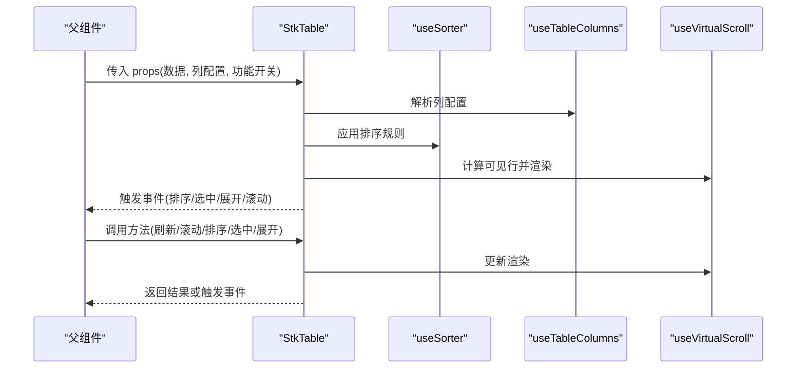

图表来源
- [src/StkTable/index.ts:1-200](file://src/StkTable/index.ts#L1-L200)
- [src/StkTable/useTableColumns.ts:1-200](file://src/StkTable/useTableColumns.ts#L1-L200)
- [src/StkTable/useSorter.ts:1-200](file://src/StkTable/useSorter.ts#L1-L200)
- [src/StkTable/useVirtualScroll.ts:1-200](file://src/StkTable/useVirtualScroll.ts#L1-L200)

章节来源
- [src/StkTable/index.ts:1-200](file://src/StkTable/index.ts#L1-L200)
- [src/StkTable/types/index.ts:1-200](file://src/StkTable/types/index.ts#L1-L200)

### StkTableColumn 列配置
- 基础属性
  - 字段名、标题、宽度、对齐方式、排序开关、筛选开关、格式化函数、渲染函数、可编辑开关、拖拽开关、固定列等
- 高级属性
  - 合并规则、树节点标识、展开内容、高亮条件、自定义单元格、过滤器配置、序列号起始值等
- 返回值与类型
  - 列配置对象类型、格式化函数签名、渲染函数签名、过滤器回调签名等

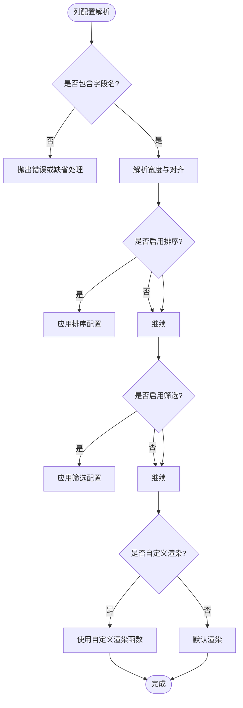

图表来源
- [src/StkTable/useTableColumns.ts:1-200](file://src/StkTable/useTableColumns.ts#L1-L200)
- [src/StkTable/types/index.ts:1-200](file://src/StkTable/types/index.ts#L1-L200)

章节来源
- [src/StkTable/useTableColumns.ts:1-200](file://src/StkTable/useTableColumns.ts#L1-L200)
- [src/StkTable/types/index.ts:1-200](file://src/StkTable/types/index.ts#L1-L200)

### 排序模块（useSorter）
- 功能
  - 支持单列/多列排序、自定义比较函数、空值处理、远程排序开关
- 方法
  - 设置排序、清除排序、获取当前排序状态
- 事件
  - 排序变化事件，携带排序字段与顺序信息

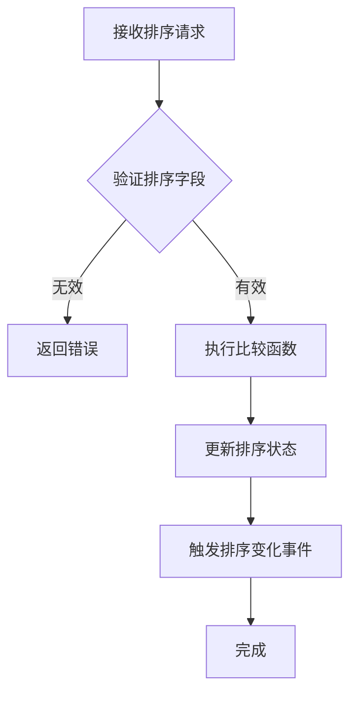

图表来源
- [src/StkTable/useSorter.ts:1-200](file://src/StkTable/useSorter.ts#L1-L200)

章节来源
- [src/StkTable/useSorter.ts:1-200](file://src/StkTable/useSorter.ts#L1-L200)

### 合并单元格模块（useMergeCells）
- 功能
  - 根据规则计算合并区间、应用合并样式、动态更新合并状态
- 方法
  - 计算合并、应用合并、重置合并
- 注意事项
  - 合并规则需保证不重叠、与虚拟滚动兼容时需考虑可见区域

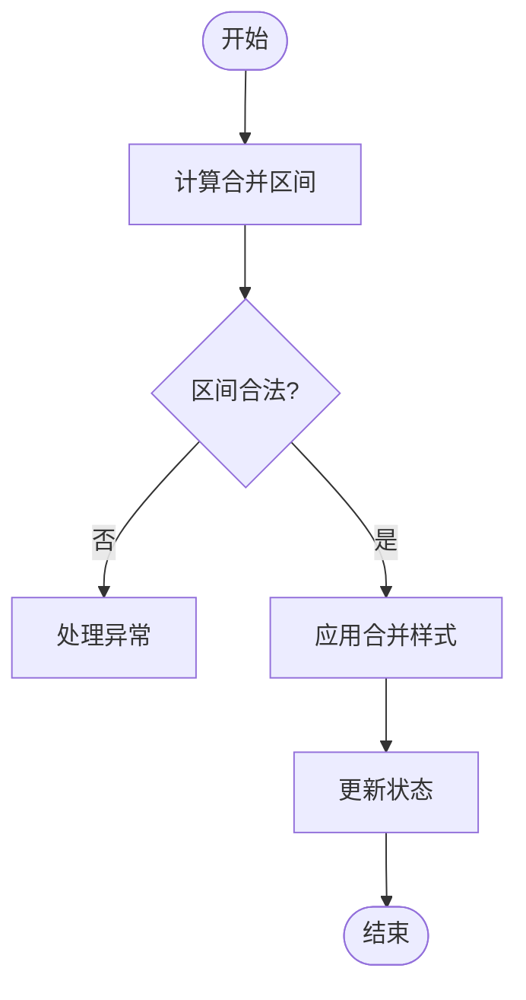

图表来源
- [src/StkTable/useMergeCells.ts:1-200](file://src/StkTable/useMergeCells.ts#L1-L200)

章节来源
- [src/StkTable/useMergeCells.ts:1-200](file://src/StkTable/useMergeCells.ts#L1-L200)

### 树形数据模块（useTree）
- 功能
  - 构建树形结构、展开/折叠节点、默认展开层级/键/级别
- 方法
  - 切换节点、获取节点路径、判断是否为叶子节点
- 事件
  - 节点展开/折叠变化事件

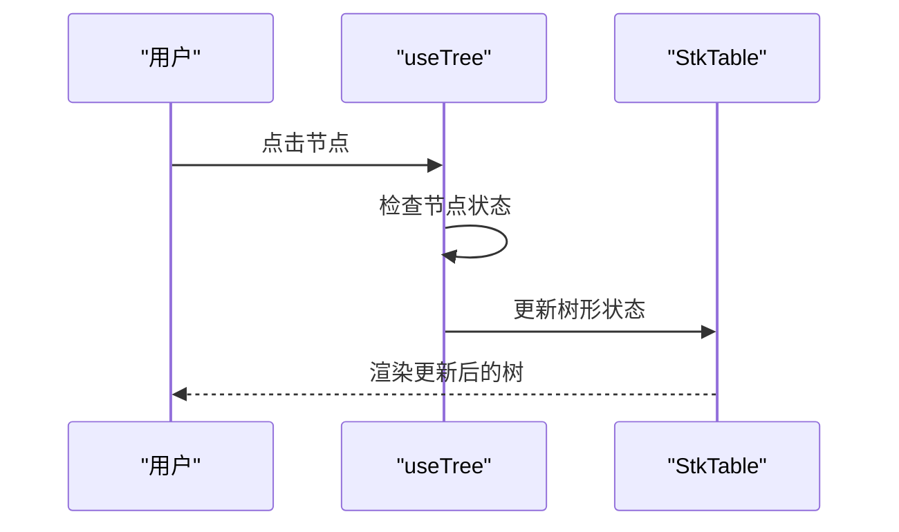

图表来源
- [src/StkTable/useTree.ts:1-200](file://src/StkTable/useTree.ts#L1-L200)

章节来源
- [src/StkTable/useTree.ts:1-200](file://src/StkTable/useTree.ts#L1-L200)

### 行展开模块（useRowExpand）
- 功能
  - 展开/折叠行内容、默认展开配置、展开内容插槽
- 方法
  - 展开行、折叠行、切换展开状态
- 事件
  - 展开/折叠变化事件

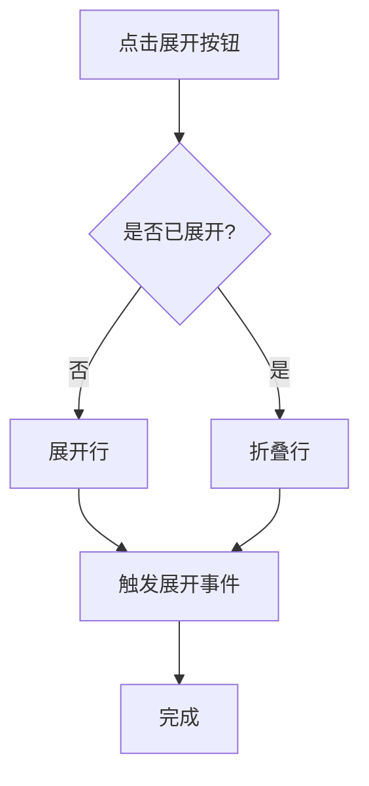

图表来源
- [src/StkTable/useRowExpand.ts:1-200](file://src/StkTable/useRowExpand.ts#L1-L200)

章节来源
- [src/StkTable/useRowExpand.ts:1-200](file://src/StkTable/useRowExpand.ts#L1-L200)

### 虚拟滚动模块（useVirtualScroll）
- 功能
  - 仅渲染可见行、滚动时动态更新、支持自动高度与固定行高
- 方法
  - 计算可见行、处理滚动事件、更新滚动位置
- 性能
  - 大幅减少 DOM 节点数量，提升大数据渲染性能

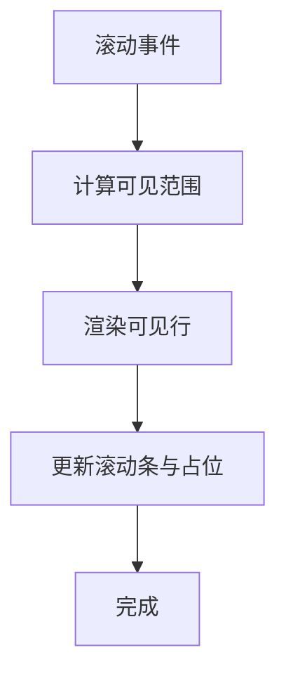

图表来源
- [src/StkTable/useVirtualScroll.ts:1-200](file://src/StkTable/useVirtualScroll.ts#L1-L200)

章节来源
- [src/StkTable/useVirtualScroll.ts:1-200](file://src/StkTable/useVirtualScroll.ts#L1-L200)

### 固定列模块（useFixedCol / useGetFixedColPosition / useFixedStyle）
- 功能
  - 固定左右列、同步横向滚动、计算固定列位置、应用固定样式
- 方法
  - 计算固定列、同步滚动、更新样式
- 注意事项
  - 与虚拟滚动结合时需确保位置计算准确

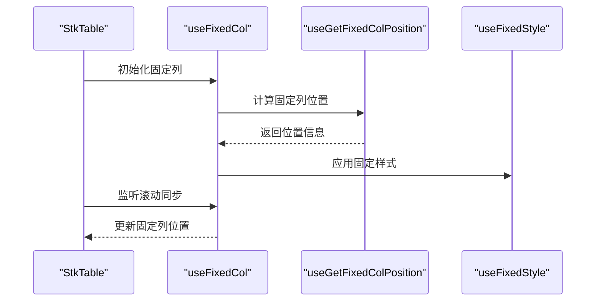

图表来源
- [src/StkTable/useFixedCol.ts:1-200](file://src/StkTable/useFixedCol.ts#L1-L200)
- [src/StkTable/useGetFixedColPosition.ts:1-200](file://src/StkTable/useGetFixedColPosition.ts#L1-L200)
- [src/StkTable/useFixedStyle.ts:1-200](file://src/StkTable/useFixedStyle.ts#L1-L200)

章节来源
- [src/StkTable/useFixedCol.ts:1-200](file://src/StkTable/useFixedCol.ts#L1-L200)
- [src/StkTable/useGetFixedColPosition.ts:1-200](file://src/StkTable/useGetFixedColPosition.ts#L1-L200)
- [src/StkTable/useFixedStyle.ts:1-200](file://src/StkTable/useFixedStyle.ts#L1-L200)

### 高亮模块（useHighlight）
- 功能
  - 高亮指定范围、清除高亮、高亮动画
- 方法
  - 高亮范围、清除高亮
- 事件
  - 高亮变化事件

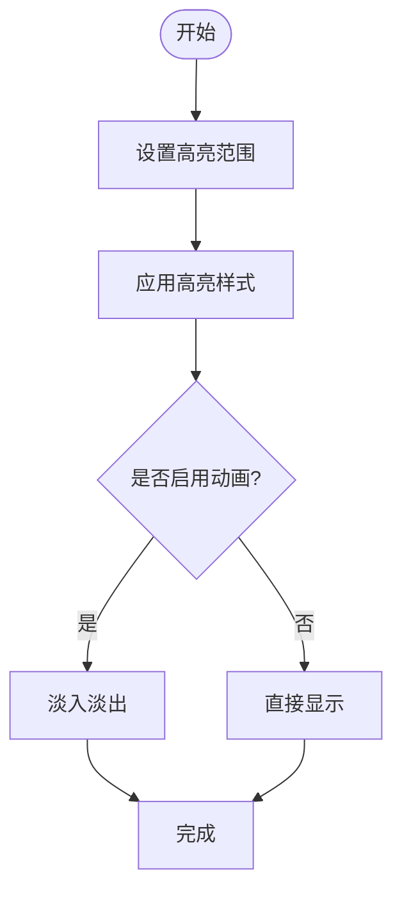

图表来源
- [src/StkTable/useHighlight.ts:1-200](file://src/StkTable/useHighlight.ts#L1-L200)

章节来源
- [src/StkTable/useHighlight.ts:1-200](file://src/StkTable/useHighlight.ts#L1-L200)

### 拖拽模块（useThDrag / useTrDrag）
- 功能
  - 表头拖拽（列宽调整/列顺序调整）、行拖拽（行顺序调整）
- 方法
  - 开始拖拽、拖拽中、结束拖拽
- 事件
  - 拖拽开始、拖拽中、拖拽结束事件

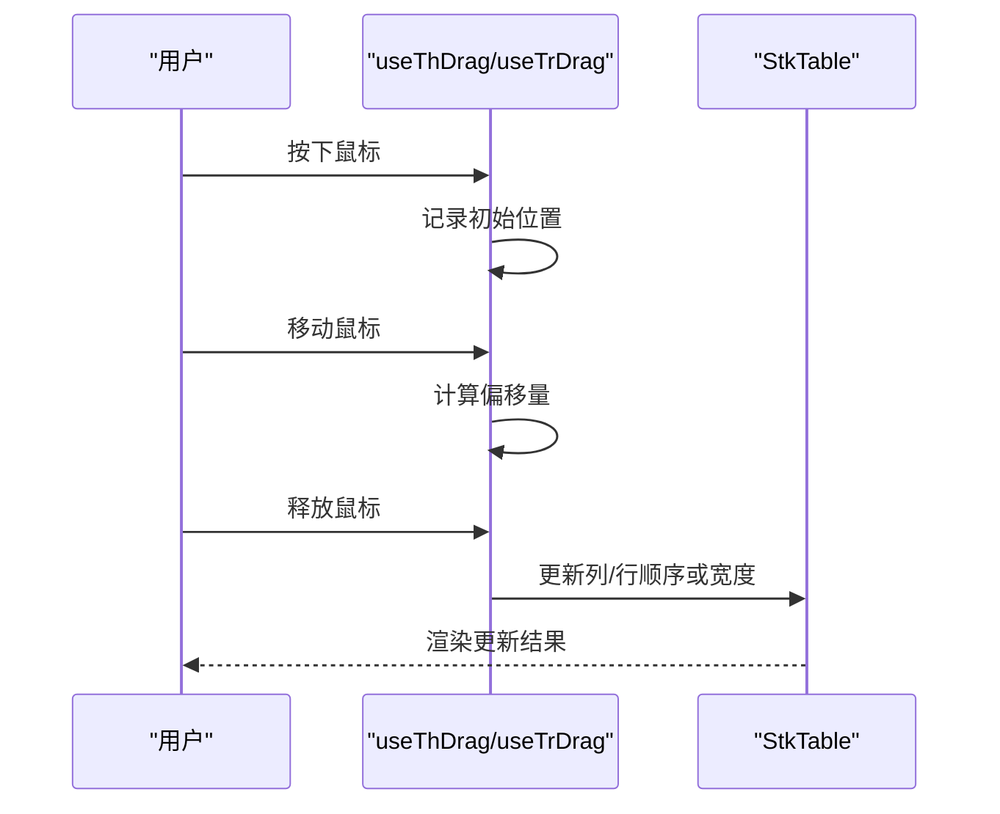

图表来源
- [src/StkTable/useThDrag.ts:1-200](file://src/StkTable/useThDrag.ts#L1-L200)
- [src/StkTable/useTrDrag.ts:1-200](file://src/StkTable/useTrDrag.ts#L1-L200)

章节来源
- [src/StkTable/useThDrag.ts:1-200](file://src/StkTable/useThDrag.ts#L1-L200)
- [src/StkTable/useTrDrag.ts:1-200](file://src/StkTable/useTrDrag.ts#L1-L200)

### 键盘导航（useKeyboardArrowScroll）
- 功能
  - 使用方向键在单元格间导航、回车编辑、上下滚动
- 方法
  - 处理键盘事件、更新焦点位置
- 注意事项
  - 与虚拟滚动结合时需确保焦点可见

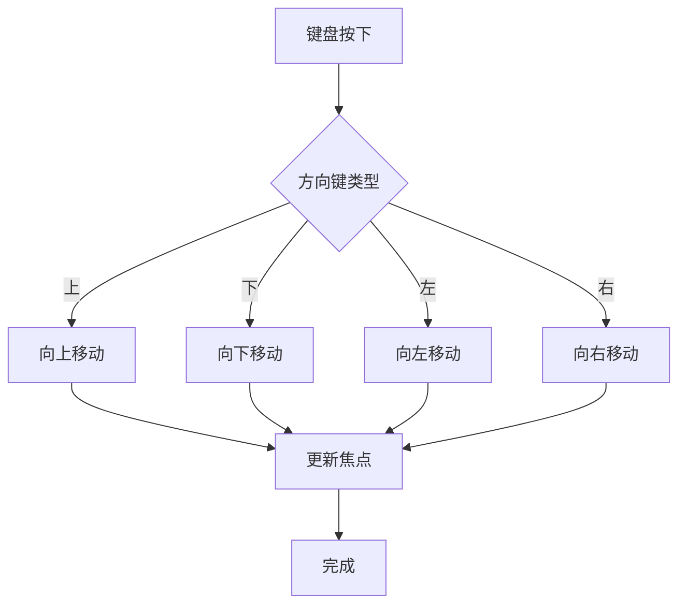

图表来源
- [src/StkTable/useKeyboardArrowScroll.ts:1-200](file://src/StkTable/useKeyboardArrowScroll.ts#L1-L200)

章节来源
- [src/StkTable/useKeyboardArrowScroll.ts:1-200](file://src/StkTable/useKeyboardArrowScroll.ts#L1-L200)

### 其他模块（行跨度、滚动条、自适应、列宽调整、滚轮行为）
- useMaxRowSpan：计算最大行跨度，用于合并单元格场景
- useScrollbar：初始化与更新滚动条样式
- useAutoResize：监听容器尺寸变化，自动调整表格尺寸
- useColResize：处理列宽调整交互
- useWheeling：定制滚轮行为（如垂直滚动锁定）

章节来源
- [src/StkTable/useMaxRowSpan.ts:1-200](file://src/StkTable/useMaxRowSpan.ts#L1-L200)
- [src/StkTable/useScrollbar.ts:1-200](file://src/StkTable/useScrollbar.ts#L1-L200)
- [src/StkTable/useAutoResize.ts:1-200](file://src/StkTable/useAutoResize.ts#L1-L200)
- [src/StkTable/useColResize.ts:1-200](file://src/StkTable/useColResize.ts#L1-L200)
- [src/StkTable/useWheeling.ts:1-200](file://src/StkTable/useWheeling.ts#L1-L200)

## 依赖关系分析
StkTable 主组件依赖多个功能模块，模块之间低耦合、高内聚，便于单独测试与替换。部分模块之间存在间接依赖，例如虚拟滚动与固定列的位置计算需协同工作。

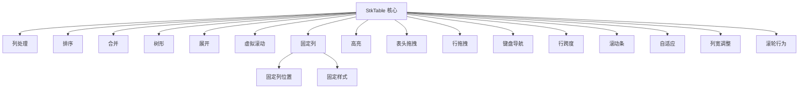

图表来源
- [src/StkTable/index.ts:1-200](file://src/StkTable/index.ts#L1-L200)
- [src/StkTable/useFixedCol.ts:1-200](file://src/StkTable/useFixedCol.ts#L1-L200)
- [src/StkTable/useGetFixedColPosition.ts:1-200](file://src/StkTable/useGetFixedColPosition.ts#L1-L200)
- [src/StkTable/useFixedStyle.ts:1-200](file://src/StkTable/useFixedStyle.ts#L1-L200)

章节来源
- [src/StkTable/index.ts:1-200](file://src/StkTable/index.ts#L1-L200)

## 性能考量
- 虚拟滚动：仅渲染可见行，显著降低 DOM 节点数量，适合大数据场景
- 列宽与固定列：避免频繁重排，使用增量更新
- 合并单元格：预计算合并区间，减少重复计算
- 高亮与动画：按需启用，避免不必要的重绘
- 拖拽与键盘：节流与防抖处理，提升交互流畅度

[本节为通用指导，无需特定文件引用]

## 故障排查指南
- 常见问题
  - 列宽异常：检查列宽配置与自适应开关
  - 固定列错位：确认滚动同步与位置计算
  - 虚拟滚动闪烁：检查行高策略与占位元素
  - 合并单元格失效：验证合并规则与可见区域
  - 拖拽冲突：检查事件冒泡与阻止默认行为
- 调试建议
  - 使用浏览器开发者工具检查 DOM 与样式
  - 打印关键状态与事件参数
  - 逐步禁用功能模块定位问题

[本节为通用指导，无需特定文件引用]

## 结论
stk-table-vue 提供了丰富且灵活的表格能力，通过模块化设计与清晰的 API 接口，开发者可以快速构建高性能、可定制的表格应用。建议在实际项目中按需启用功能模块，并结合 TypeScript 类型定义进行类型安全开发。

[本节为总结性内容，无需特定文件引用]

## 附录：TypeScript 类型与接口规范
- 数据类型
  - 行数据接口：字段名与值映射
  - 列配置接口：字段名、标题、宽度、对齐、排序、筛选、格式化、渲染、可编辑、拖拽、固定等
  - 排序接口：字段、顺序、比较函数
  - 筛选接口：字段、操作符、值
  - 合并接口：行/列跨度、条件函数
  - 树形接口：节点标识、父子关系、展开状态
  - 展开接口：行标识、展开内容
  - 高亮接口：范围、样式、动画
  - 拖拽接口：起始位置、目标位置、回调
  - 滚动接口：位置、方向、速度
- 方法接口
  - 刷新、滚动、排序、选中、展开、树操作、合并、高亮等方法的参数与返回值类型
- 事件接口
  - 行交互、排序/筛选变化、选中/展开变化、拖拽、滚动等事件的参数类型

章节来源
- [src/StkTable/types/index.ts:1-200](file://src/StkTable/types/index.ts#L1-L200)
- [src/StkTable/index.ts:1-200](file://src/StkTable/index.ts#L1-L200)