# 事件 (Emits)

<cite>
**本文引用的文件**   
- [StkTable.vue](file://src/StkTable/StkTable.vue)
- [useSorter.ts](file://src/StkTable/useSorter.ts)
- [useRowExpand.ts](file://src/StkTable/useRowExpand.ts)
- [useAreaSelection.ts](file://src/StkTable/features/useAreaSelection.ts)
- [useTrDrag.ts](file://src/StkTable/useTrDrag.ts)
- [useThDrag.ts](file://src/StkTable/useThDrag.ts)
- [useVirtualScroll.ts](file://src/StkTable/useVirtualScroll.ts)
- [useWheeling.ts](file://src/StkTable/useWheeling.ts)
- [useKeyboardArrowScroll.ts](file://src/StkTable/useKeyboardArrowScroll.ts)
- [useMergeCells.ts](file://src/StkTable/useMergeCells.ts)
- [useMaxRowSpan.ts](file://src/StkTable/useMaxRowSpan.ts)
- [useHighlight.ts](file://src/StkTable/useHighlight.ts)
- [index.ts](file://src/StkTable/index.ts)
- [table-props.md](file://docs-src/main/api/table-props.md)
- [emits.md](file://docs-src/main/api/emits.md)
</cite>

## 目录
1. [简介](#简介)
2. [项目结构](#项目结构)
3. [核心组件与事件总览](#核心组件与事件总览)
4. [架构概览](#架构概览)
5. [详细组件分析](#详细组件分析)
6. [依赖关系分析](#依赖关系分析)
7. [性能注意事项](#性能注意事项)
8. [故障排查指南](#故障排查指南)
9. [结论](#结论)
10. [附录：TypeScript 类型与监听示例](#附录typescript-类型与监听示例)

## 简介
本章节面向 StkTable 组件的事件系统，系统化梳理并文档化所有对外暴露的“事件（Emits）”。内容覆盖用户交互事件（点击、选择、排序）、数据变化事件（行展开、单元格编辑）、滚动事件等。对每个事件提供触发时机、事件参数说明、使用场景、执行顺序与注意事项，帮助开发者准确捕获和处理表格的各种交互行为。

## 项目结构
StkTable 的事件由主组件与多个功能模块共同产生，并通过统一的导出入口对外暴露。关键文件包括：
- 主组件：负责组合各功能模块，统一派发事件
- 功能模块：分别处理排序、行展开、区域选择、拖拽、虚拟滚动、键盘导航、合并单元格、高亮等能力，并在各自逻辑中触发对应事件
- 文档与类型：API 文档与类型定义位于 docs-src 与 src 的类型文件中

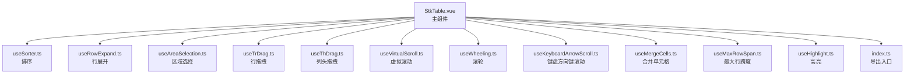

图表来源
- [StkTable.vue](file://src/StkTable/StkTable.vue)
- [useSorter.ts](file://src/StkTable/useSorter.ts)
- [useRowExpand.ts](file://src/StkTable/useRowExpand.ts)
- [useAreaSelection.ts](file://src/StkTable/features/useAreaSelection.ts)
- [useTrDrag.ts](file://src/StkTable/useTrDrag.ts)
- [useThDrag.ts](file://src/StkTable/useThDrag.ts)
- [useVirtualScroll.ts](file://src/StkTable/useVirtualScroll.ts)
- [useWheeling.ts](file://src/StkTable/useWheeling.ts)
- [useKeyboardArrowScroll.ts](file://src/StkTable/useKeyboardArrowScroll.ts)
- [useMergeCells.ts](file://src/StkTable/useMergeCells.ts)
- [useMaxRowSpan.ts](file://src/StkTable/useMaxRowSpan.ts)
- [useHighlight.ts](file://src/StkTable/useHighlight.ts)
- [index.ts](file://src/StkTable/index.ts)

章节来源
- [StkTable.vue](file://src/StkTable/StkTable.vue)
- [index.ts](file://src/StkTable/index.ts)

## 核心组件与事件总览
StkTable 的事件按功能域划分如下：
- 用户交互事件
  - 点击/双击行或单元格
  - 选择（单选/多选/区域选择）
  - 排序（单列/多列）
  - 拖拽（行拖拽、列头拖拽）
- 数据变化事件
  - 行展开/收起
  - 单元格编辑（开始/确认/取消）
  - 合并单元格变更
- 滚动事件
  - 虚拟滚动可视区变化
  - 滚轮事件
  - 键盘方向键滚动
- 其他
  - 高亮相关事件（如需要）

注意：具体事件名称、参数结构与触发时机以源码实现为准。本节为分类总览，详细内容见后续章节。

章节来源
- [StkTable.vue](file://src/StkTable/StkTable.vue)
- [emits.md](file://docs-src/main/api/emits.md)

## 架构概览
下图展示了事件从功能模块到主组件再到外部监听的流向。各功能模块在内部逻辑完成后，通过主组件统一向外派发事件，确保调用方只需关注主组件事件即可。

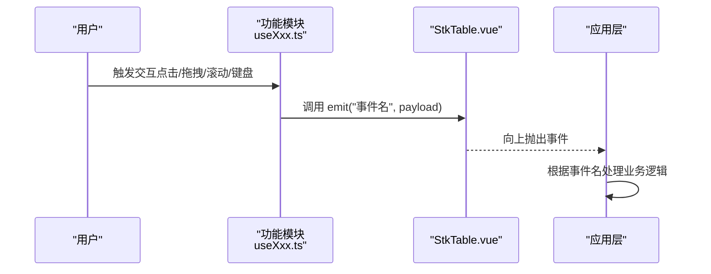

图表来源
- [StkTable.vue](file://src/StkTable/StkTable.vue)
- [useSorter.ts](file://src/StkTable/useSorter.ts)
- [useRowExpand.ts](file://src/StkTable/useRowExpand.ts)
- [useAreaSelection.ts](file://src/StkTable/features/useAreaSelection.ts)
- [useTrDrag.ts](file://src/StkTable/useTrDrag.ts)
- [useThDrag.ts](file://src/StkTable/useThDrag.ts)
- [useVirtualScroll.ts](file://src/StkTable/useVirtualScroll.ts)
- [useWheeling.ts](file://src/StkTable/useWheeling.ts)
- [useKeyboardArrowScroll.ts](file://src/StkTable/useKeyboardArrowScroll.ts)

## 详细组件分析

### 排序事件（useSorter.ts）
- 触发时机
  - 点击列头切换排序状态
  - 通过 API 设置排序时（若设计为同步派发）
- 事件参数（建议）
  - 字段名、排序方向、是否多列排序、排序配置对象
- 使用场景
  - 前端排序、后端远程排序回调
- 执行顺序与注意事项
  - 先更新内部排序状态，再派发事件
  - 多列排序时，注意优先级与稳定性

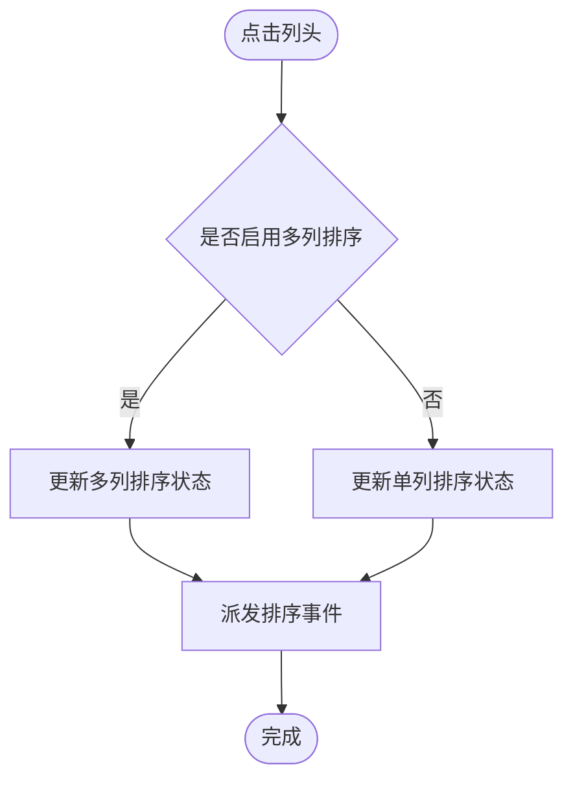

图表来源
- [useSorter.ts](file://src/StkTable/useSorter.ts)

章节来源
- [useSorter.ts](file://src/StkTable/useSorter.ts)

### 行展开事件（useRowExpand.ts）
- 触发时机
  - 点击行展开按钮或调用展开/收起 API
- 事件参数（建议）
  - 行标识、展开/收起状态、层级信息（树形表）
- 使用场景
  - 懒加载子节点、动态渲染展开内容
- 执行顺序与注意事项
  - 先更新展开集合，再派发事件
  - 树形表需考虑父子联动

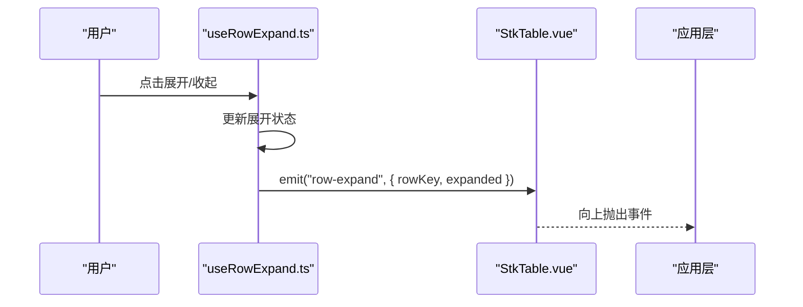

图表来源
- [useRowExpand.ts](file://src/StkTable/useRowExpand.ts)
- [StkTable.vue](file://src/StkTable/StkTable.vue)

章节来源
- [useRowExpand.ts](file://src/StkTable/useRowExpand.ts)

### 区域选择事件（useAreaSelection.ts）
- 触发时机
  - 鼠标拖拽选区、Shift 扩展选区、Ctrl/Cmd 多选
- 事件参数（建议）
  - 选区范围、选中行集合、操作模式（新增/替换/追加）
- 使用场景
  - 批量操作、导出选中数据
- 执行顺序与注意事项
  - 计算选区后更新选中集合，再派发事件
  - 大数据量下注意性能优化

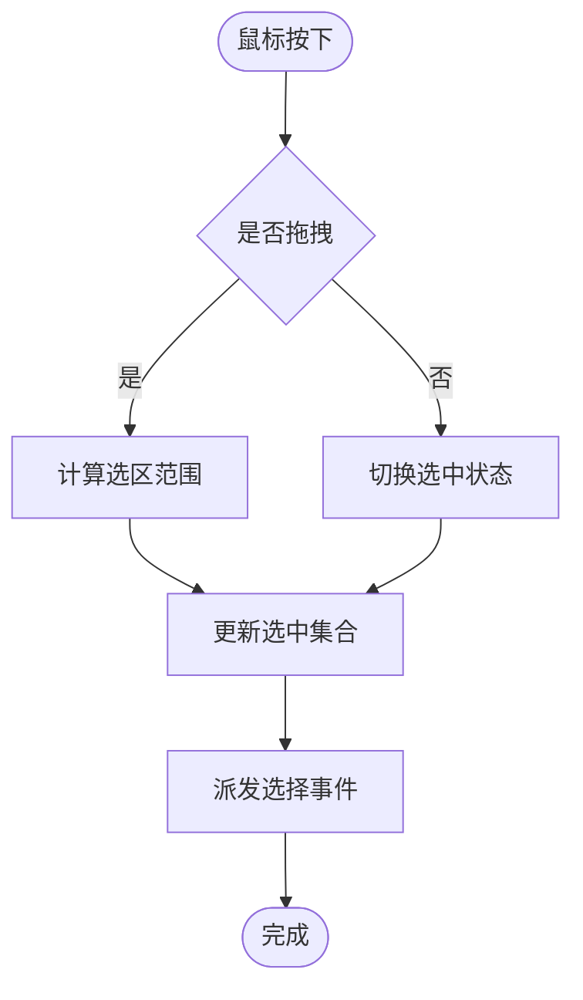

图表来源
- [useAreaSelection.ts](file://src/StkTable/features/useAreaSelection.ts)

章节来源
- [useAreaSelection.ts](file://src/StkTable/features/useAreaSelection.ts)

### 行拖拽事件（useTrDrag.ts）
- 触发时机
  - 拖拽行进行重排、复制、删除等
- 事件参数（建议）
  - 被拖拽行、目标位置、拖拽动作类型
- 使用场景
  - 自定义排序、分组、批量移动
- 执行顺序与注意事项
  - 拖拽开始/移动/结束分别派发事件
  - 避免与列头拖拽冲突

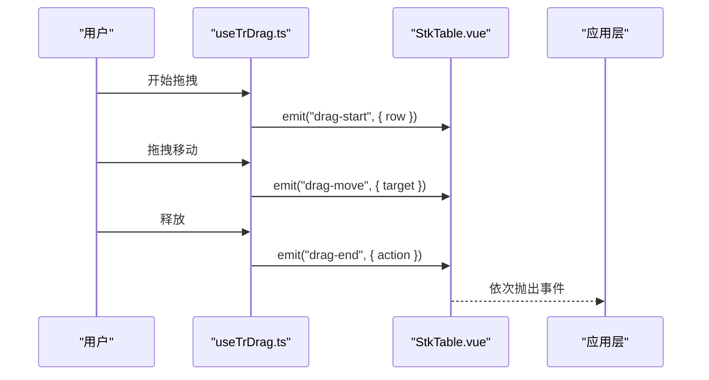

图表来源
- [useTrDrag.ts](file://src/StkTable/useTrDrag.ts)
- [StkTable.vue](file://src/StkTable/StkTable.vue)

章节来源
- [useTrDrag.ts](file://src/StkTable/useTrDrag.ts)

### 列头拖拽事件（useThDrag.ts）
- 触发时机
  - 拖拽列头调整列宽、重排列顺序
- 事件参数（建议）
  - 列标识、新宽度/新位置、动作类型
- 使用场景
  - 自定义列布局、响应式列宽
- 执行顺序与注意事项
  - 拖拽过程中实时反馈，结束时持久化

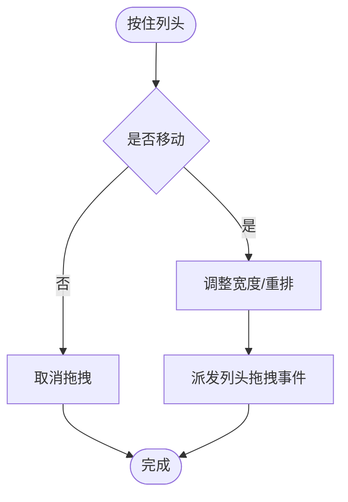

图表来源
- [useThDrag.ts](file://src/StkTable/useThDrag.ts)

章节来源
- [useThDrag.ts](file://src/StkTable/useThDrag.ts)

### 虚拟滚动与滚轮事件（useVirtualScroll.ts / useWheeling.ts）
- 触发时机
  - 滚动条滚动、滚轮滚动、键盘方向键滚动
- 事件参数（建议）
  - 可视区索引、滚动距离、滚动方向
- 使用场景
  - 大数据分页加载、懒渲染、滚动统计
- 执行顺序与注意事项
  - 节流/防抖优化，避免频繁重绘

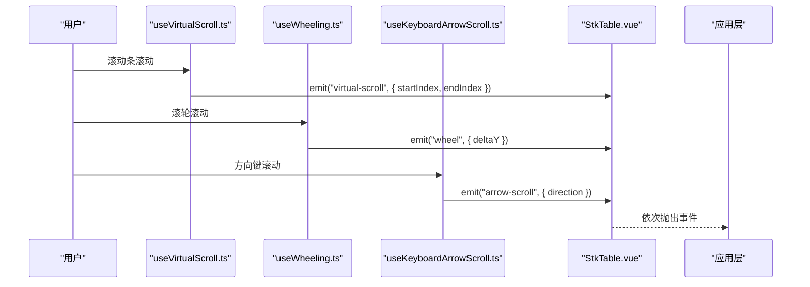

图表来源
- [useVirtualScroll.ts](file://src/StkTable/useVirtualScroll.ts)
- [useWheeling.ts](file://src/StkTable/useWheeling.ts)
- [useKeyboardArrowScroll.ts](file://src/StkTable/useKeyboardArrowScroll.ts)
- [StkTable.vue](file://src/StkTable/StkTable.vue)

章节来源
- [useVirtualScroll.ts](file://src/StkTable/useVirtualScroll.ts)
- [useWheeling.ts](file://src/StkTable/useWheeling.ts)
- [useKeyboardArrowScroll.ts](file://src/StkTable/useKeyboardArrowScroll.ts)

### 合并单元格与高亮事件（useMergeCells.ts / useMaxRowSpan.ts / useHighlight.ts）
- 触发时机
  - 合并单元格计算变更、最大行跨度更新、高亮状态变化
- 事件参数（建议）
  - 合并规则、跨度信息、高亮行列坐标
- 使用场景
  - 复杂报表展示、数据对比高亮
- 执行顺序与注意事项
  - 合并与跨度计算应在渲染前完成
  - 高亮应避免影响滚动性能

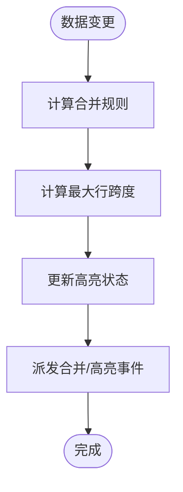

图表来源
- [useMergeCells.ts](file://src/StkTable/useMergeCells.ts)
- [useMaxRowSpan.ts](file://src/StkTable/useMaxRowSpan.ts)
- [useHighlight.ts](file://src/StkTable/useHighlight.ts)

章节来源
- [useMergeCells.ts](file://src/StkTable/useMergeCells.ts)
- [useMaxRowSpan.ts](file://src/StkTable/useMaxRowSpan.ts)
- [useHighlight.ts](file://src/StkTable/useHighlight.ts)

### 单元格编辑事件（custom-cells）
- 触发时机
  - 进入编辑、提交编辑、取消编辑
- 事件参数（建议）
  - 行标识、列标识、旧值、新值、编辑状态
- 使用场景
  - 表单校验、异步保存、撤销/重做
- 执行顺序与注意事项
  - 先校验再提交，失败回滚

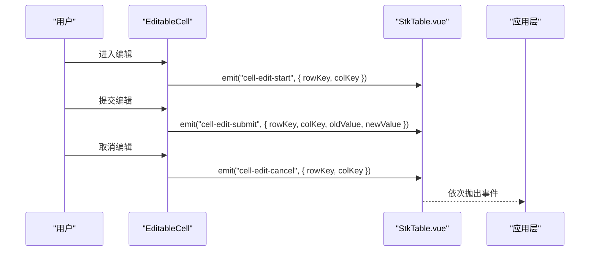

图表来源
- [StkTable.vue](file://src/StkTable/StkTable.vue)

章节来源
- [StkTable.vue](file://src/StkTable/StkTable.vue)

## 依赖关系分析
StkTable 主组件聚合各功能模块，事件最终由主组件统一向外抛出。模块间耦合度低，内聚度高，便于扩展与维护。

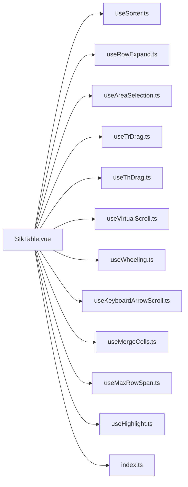

图表来源
- [StkTable.vue](file://src/StkTable/StkTable.vue)
- [index.ts](file://src/StkTable/index.ts)

章节来源
- [StkTable.vue](file://src/StkTable/StkTable.vue)
- [index.ts](file://src/StkTable/index.ts)

## 性能注意事项
- 虚拟滚动与滚轮事件应使用节流/防抖，减少高频触发带来的重绘压力
- 区域选择在大数组下应避免全量遍历，采用增量更新
- 合并单元格与高亮计算尽量缓存结果，避免重复计算
- 拖拽与排序操作在大数据集上建议开启虚拟化渲染

[本节为通用指导，不直接分析具体文件]

## 故障排查指南
- 事件未触发
  - 检查功能模块是否启用
  - 确认主组件是否正确转发事件
- 事件参数异常
  - 核对事件命名与参数结构是否与实现一致
  - 检查是否在正确的生命周期监听
- 性能问题
  - 检查是否存在高频事件未节流
  - 大数据场景是否启用虚拟滚动

[本节为通用指导，不直接分析具体文件]

## 结论
StkTable 的事件体系围绕功能模块解耦设计，主组件统一对外暴露，便于集成与扩展。开发者应根据不同事件的使用场景与参数结构，合理监听与处理，以获得最佳的用户体验与性能表现。

[本节为总结性内容，不直接分析具体文件]

## 附录：TypeScript 类型与监听示例
- 类型定义
  - 建议在应用层定义事件类型映射，结合组件导出的类型进行约束
  - 参考文档与类型文件获取准确的字段与枚举值
- 监听示例
  - 使用 on('事件名', handler) 或 v-on 语法绑定
  - 在 handler 中根据事件参数执行业务逻辑

章节来源
- [table-props.md](file://docs-src/main/api/table-props.md)
- [emits.md](file://docs-src/main/api/emits.md)
- [index.ts](file://src/StkTable/index.ts)