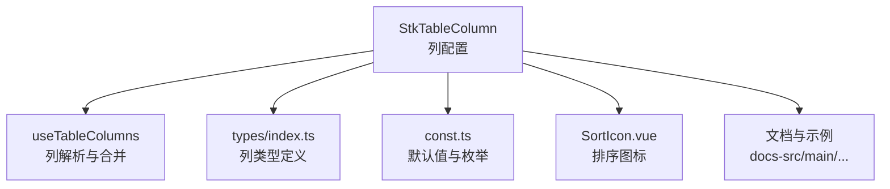
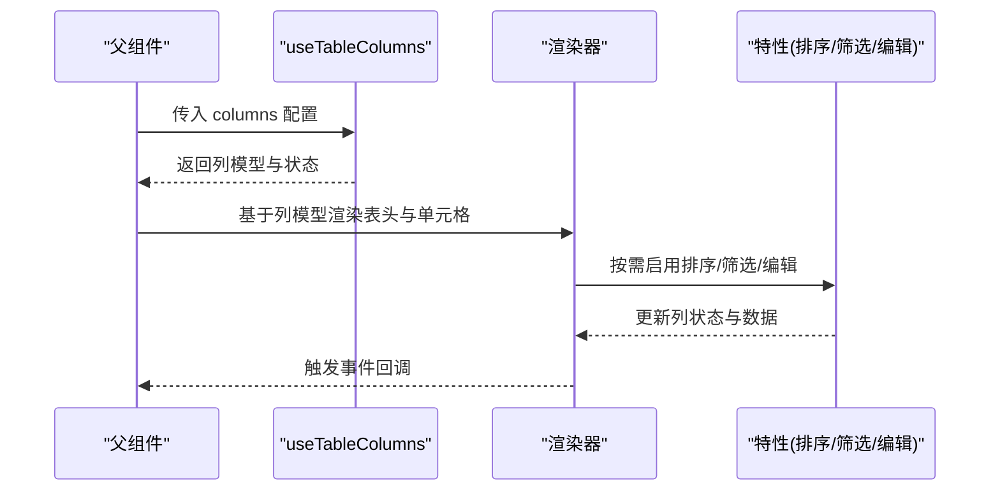
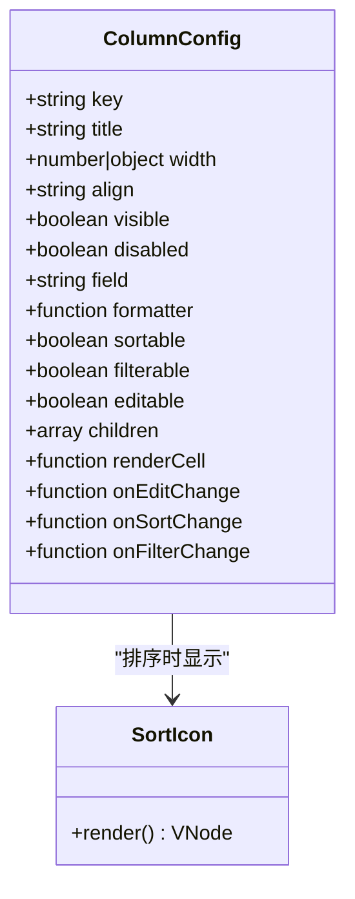
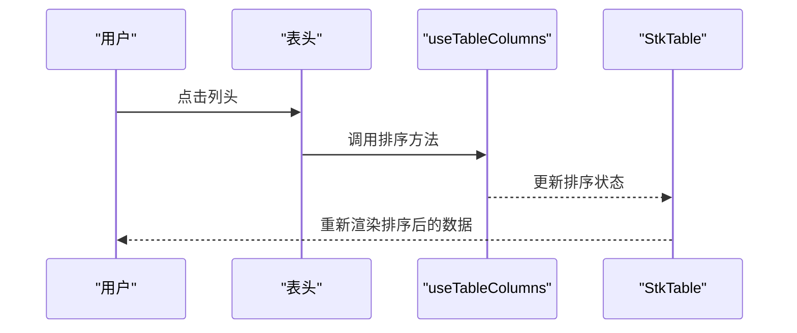
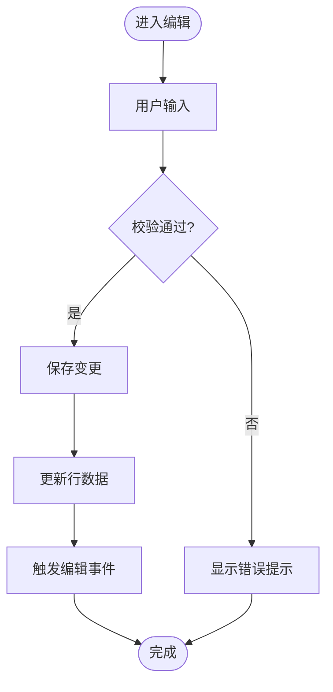
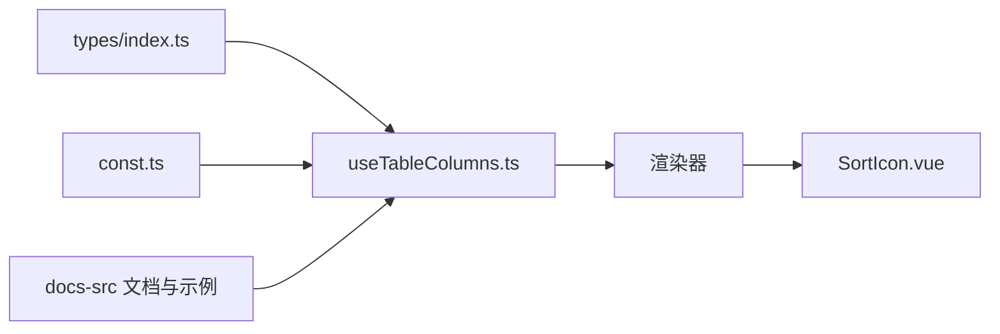

# 列配置 (StkTableColumn)

<cite>
**本文引用的文件**
- [src/StkTable/types/index.ts](file://src/StkTable/types/index.ts)
- [src/StkTable/useTableColumns.ts](file://src/StkTable/useTableColumns.ts)
- [src/StkTable/const.ts](file://src/StkTable/const.ts)
- [src/StkTable/components/SortIcon.vue](file://src/StkTable/components/SortIcon.vue)
- [docs-src/main/api/stk-table-column.md](file://docs-src/main/api/stk-table-column.md)
- [docs-src/main/table/basic/column-width.md](file://docs-src/main/table/basic/column-width.md)
- [docs-src/main/table/basic/align.md](file://docs-src/main/table/basic/align.md)
- [docs-src/main/table/basic/sort.md](file://docs-src/main/table/basic/sort.md)
- [docs-src/main/table/advanced/custom-cells/editable-cell.md](file://docs-src/main/table/advanced/custom-cells/editable-cell.md)
- [docs-src/main/table/advanced/custom-cells/filter-cell.md](file://docs-src/main/table/advanced/custom-cells/filter-cell.md)
- [docs-src/main/table/advanced/custom-cells/checkbox-cell.md](file://docs-src/main/table/advanced/custom-cells/checkbox-cell.md)
- [docs-src/main/table/advanced/custom-cells/change-cell.md](file://docs-src/main/table/advanced/custom-cells/change-cell.md)
- [docs-src/main/table/advanced/custom-cells/number-cell.md](file://docs-src/main/table/advanced/custom-cells/number-cell.md)
- [docs-src/main/table/advanced/custom-cell.md](file://docs-src/main/table/advanced/custom-cell.md)
- [docs-src/main/table/basic/multi-header.md](file://docs-src/main/table/basic/multi-header.md)
- [docs-src/main/table/basic/tree.md](file://docs-src/main/table/basic/tree.md)
- [docs-src/main/table/basic/fixed.md](file://docs-src/main/table/basic/fixed.md)
- [docs-src/main/table/basic/expand-row.md](file://docs-src/main/table/basic/expand-row.md)
</cite>

## 目录
1. [简介](#简介)
2. [项目结构](#项目结构)
3. [核心组件与类型](#核心组件与类型)
4. [架构总览](#架构总览)
5. [详细组件分析](#详细组件分析)
6. [依赖关系分析](#依赖关系分析)
7. [性能考量](#性能考量)
8. [故障排查指南](#故障排查指南)
9. [结论](#结论)
10. [附录：TypeScript 接口与示例索引](#附录typescript-接口与示例索引)

## 简介
本章节为 StkTable 的列配置组件 StkTableColumn 提供完整的 API 文档。内容覆盖列的基本属性（宽度、对齐方式、标题）、数据绑定（字段名、格式化函数）、交互能力（可编辑、可排序、可筛选）以及高级用法（嵌套表头、条件渲染、自定义渲染函数等）。文档同时给出 TypeScript 接口定义说明与示例文件路径，帮助开发者快速掌握并灵活配置复杂表格列需求。

## 项目结构
围绕 StkTableColumn 的相关代码与文档主要分布在以下位置：
- 类型定义与常量：src/StkTable/types/index.ts、src/StkTable/const.ts
- 列处理逻辑：src/StkTable/useTableColumns.ts
- 排序图标组件：src/StkTable/components/SortIcon.vue
- 官方文档与示例：docs-src/main/api/stk-table-column.md 及 table/basic、table/advanced 下的相关页面

图表来源
- [src/StkTable/useTableColumns.ts](file://src/StkTable/useTableColumns.ts)
- [src/StkTable/types/index.ts](file://src/StkTable/types/index.ts)
- [src/StkTable/const.ts](file://src/StkTable/const.ts)
- [src/StkTable/components/SortIcon.vue](file://src/StkTable/components/SortIcon.vue)
- [docs-src/main/api/stk-table-column.md](file://docs-src/main/api/stk-table-column.md)

章节来源
- [src/StkTable/types/index.ts](file://src/StkTable/types/index.ts)
- [src/StkTable/useTableColumns.ts](file://src/StkTable/useTableColumns.ts)
- [src/StkTable/const.ts](file://src/StkTable/const.ts)
- [docs-src/main/api/stk-table-column.md](file://docs-src/main/api/stk-table-column.md)

## 核心组件与类型
- StkTableColumn 是用于描述表格列配置的单元，支持基础展示、数据绑定、交互扩展与渲染定制。
- 列类型定义集中在 types/index.ts，包含列的属性、方法、插槽参数、事件回调等。
- useTableColumns 负责列的解析、合并、层级构建、排序与筛选状态联动等。
- const.ts 提供列相关的默认值、枚举与常量。

章节来源
- [src/StkTable/types/index.ts](file://src/StkTable/types/index.ts)
- [src/StkTable/useTableColumns.ts](file://src/StkTable/useTableColumns.ts)
- [src/StkTable/const.ts](file://src/StkTable/const.ts)

## 架构总览
StkTableColumn 在表格中的使用流程如下：
- 父组件声明 columns 数组，每个元素为一个 StkTableColumn 配置对象。
- useTableColumns 对 columns 进行解析、扁平化或树形构建，生成内部列模型。
- 渲染阶段根据列模型决定单元格渲染策略：内置渲染、自定义渲染、可编辑/筛选/排序等。
- 排序、筛选、固定、展开行、树形等特性通过列配置与表格全局配置共同驱动。

图表来源
- [src/StkTable/useTableColumns.ts](file://src/StkTable/useTableColumns.ts)
- [src/StkTable/types/index.ts](file://src/StkTable/types/index.ts)

## 详细组件分析

### 基本属性
- 标题与键名
  - 标题：用于显示列头文本，支持国际化与插槽自定义。
  - 键名：唯一标识列，常用于数据绑定与排序/筛选字段映射。
- 宽度与对齐
  - 宽度：支持像素、百分比、自适应等多种设置方式。
  - 对齐：支持左、中、右对齐，影响单元格与表头的文本布局。
- 可见性与禁用
  - 可见性：控制列是否渲染。
  - 禁用：控制列交互是否可用（如不可点击、不可编辑）。

章节来源
- [docs-src/main/api/stk-table-column.md](file://docs-src/main/api/stk-table-column.md)
- [docs-src/main/table/basic/column-width.md](file://docs-src/main/table/basic/column-width.md)
- [docs-src/main/table/basic/align.md](file://docs-src/main/table/basic/align.md)

### 数据绑定与格式化
- 字段名
  - 指定列绑定的数据字段路径，支持嵌套路径访问。
- 格式化函数
  - 提供格式化回调，接收原始值与上下文，返回渲染值或 JSX/VNode。
- 条件渲染
  - 根据行数据或外部状态动态决定是否渲染单元格内容。

章节来源
- [src/StkTable/types/index.ts](file://src/StkTable/types/index.ts)
- [docs-src/main/api/stk-table-column.md](file://docs-src/main/api/stk-table-column.md)

### 交互功能
- 可编辑
  - 开启后可在单元格内直接编辑，支持输入校验、失焦保存、键盘导航等。
- 可排序
  - 支持单列或多列排序，可自定义比较函数与排序方向。
- 可筛选
  - 支持下拉筛选、搜索过滤、范围筛选等，可与后端分页结合。

章节来源
- [docs-src/main/table/advanced/custom-cells/editable-cell.md](file://docs-src/main/table/advanced/custom-cells/editable-cell.md)
- [docs-src/main/table/basic/sort.md](file://docs-src/main/table/basic/sort.md)
- [docs-src/main/table/advanced/custom-cells/filter-cell.md](file://docs-src/main/table/advanced/custom-cells/filter-cell.md)

### 高级用法
- 嵌套表头
  - 通过列的 children 构建多级表头，支持跨列合并与独立排序/筛选。
- 自定义渲染
  - 使用插槽或自定义渲染函数替换默认单元格渲染，实现复杂 UI。
- 固定列与展开行
  - 固定列提升横向滚动体验；展开行支持行级详情展示。
- 树形数据
  - 支持树形结构的列展示，含折叠/展开、层级缩进等。

章节来源
- [docs-src/main/table/basic/multi-header.md](file://docs-src/main/table/basic/multi-header.md)
- [docs-src/main/table/advanced/custom-cell.md](file://docs-src/main/table/advanced/custom-cell.md)
- [docs-src/main/table/basic/fixed.md](file://docs-src/main/table/basic/fixed.md)
- [docs-src/main/table/basic/expand-row.md](file://docs-src/main/table/basic/expand-row.md)
- [docs-src/main/table/basic/tree.md](file://docs-src/main/table/basic/tree.md)

### 类图：列类型与关系

图表来源
- [src/StkTable/types/index.ts](file://src/StkTable/types/index.ts)
- [src/StkTable/components/SortIcon.vue](file://src/StkTable/components/SortIcon.vue)

### 序列图：排序流程

图表来源
- [src/StkTable/useTableColumns.ts](file://src/StkTable/useTableColumns.ts)
- [src/StkTable/components/SortIcon.vue](file://src/StkTable/components/SortIcon.vue)

### 流程图：可编辑单元格变更

图表来源
- [docs-src/main/table/advanced/custom-cells/editable-cell.md](file://docs-src/main/table/advanced/custom-cells/editable-cell.md)

## 依赖关系分析
- StkTableColumn 的类型定义与默认值由 types/index.ts 与 const.ts 提供。
- useTableColumns 依赖类型定义与常量，负责列模型的构建与状态管理。
- SortIcon.vue 作为排序视觉反馈组件被列渲染逻辑引用。
- 文档与示例位于 docs-src，涵盖列宽、对齐、排序、筛选、可编辑、自定义渲染等场景。

图表来源
- [src/StkTable/types/index.ts](file://src/StkTable/types/index.ts)
- [src/StkTable/const.ts](file://src/StkTable/const.ts)
- [src/StkTable/useTableColumns.ts](file://src/StkTable/useTableColumns.ts)
- [src/StkTable/components/SortIcon.vue](file://src/StkTable/components/SortIcon.vue)
- [docs-src/main/api/stk-table-column.md](file://docs-src/main/api/stk-table-column.md)

章节来源
- [src/StkTable/types/index.ts](file://src/StkTable/types/index.ts)
- [src/StkTable/useTableColumns.ts](file://src/StkTable/useTableColumns.ts)
- [src/StkTable/const.ts](file://src/StkTable/const.ts)
- [src/StkTable/components/SortIcon.vue](file://src/StkTable/components/SortIcon.vue)
- [docs-src/main/api/stk-table-column.md](file://docs-src/main/api/stk-table-column.md)

## 性能考量
- 列数量与复杂度：过多列或复杂渲染函数会影响首屏与滚动性能，建议按需加载与懒渲染。
- 虚拟滚动：大数据量场景下配合虚拟滚动减少 DOM 节点数量。
- 排序与筛选：服务端排序/筛选可减少前端计算开销。
- 自定义渲染：避免在渲染函数中进行重计算，必要时缓存结果或使用 memoization。

[本节为通用指导，不直接分析具体文件]

## 故障排查指南
- 列未显示
  - 检查 visible 属性与父容器样式，确认列未被隐藏或溢出。
- 排序无效
  - 确认 sortable 已开启且 field 正确指向数据字段；若使用自定义比较函数，确保返回值符合预期。
- 编辑无法保存
  - 检查 onEditChange 是否正确更新行数据；校验失败时需提示用户。
- 筛选无效果
  - 确认 filterable 已开启，filterFn 或筛选组件是否正确触发筛选事件。
- 嵌套表头错位
  - 检查 children 结构与列宽设置，确保合并单元格计算正确。

章节来源
- [docs-src/main/table/basic/sort.md](file://docs-src/main/table/basic/sort.md)
- [docs-src/main/table/advanced/custom-cells/editable-cell.md](file://docs-src/main/table/advanced/custom-cells/editable-cell.md)
- [docs-src/main/table/advanced/custom-cells/filter-cell.md](file://docs-src/main/table/advanced/custom-cells/filter-cell.md)
- [docs-src/main/table/basic/multi-header.md](file://docs-src/main/table/basic/multi-header.md)

## 结论
StkTableColumn 提供了丰富的列配置能力，从基础展示到高级交互与渲染定制，能够满足大多数表格场景。通过合理的类型定义与列处理逻辑，开发者可以高效地构建复杂表格。建议在大数据量与高交互场景中关注性能优化，并结合文档与示例快速落地。

[本节为总结，不直接分析具体文件]

## 附录：TypeScript 接口与示例索引
- 类型定义
  - 列配置接口与相关类型：[src/StkTable/types/index.ts](file://src/StkTable/types/index.ts)
- 常量与默认值
  - 列相关常量与枚举：[src/StkTable/const.ts](file://src/StkTable/const.ts)
- 列处理逻辑
  - 列解析与状态管理：[src/StkTable/useTableColumns.ts](file://src/StkTable/useTableColumns.ts)
- 排序图标组件
  - 排序视觉反馈：[src/StkTable/components/SortIcon.vue](file://src/StkTable/components/SortIcon.vue)
- 文档与示例
  - StkTableColumn API 文档：[docs-src/main/api/stk-table-column.md](file://docs-src/main/api/stk-table-column.md)
  - 列宽与对齐：[docs-src/main/table/basic/column-width.md](file://docs-src/main/table/basic/column-width.md)、[docs-src/main/table/basic/align.md](file://docs-src/main/table/basic/align.md)
  - 排序：[docs-src/main/table/basic/sort.md](file://docs-src/main/table/basic/sort.md)
  - 可编辑单元格：[docs-src/main/table/advanced/custom-cells/editable-cell.md](file://docs-src/main/table/advanced/custom-cells/editable-cell.md)
  - 筛选单元格：[docs-src/main/table/advanced/custom-cells/filter-cell.md](file://docs-src/main/table/advanced/custom-cells/filter-cell.md)
  - 复选框单元格：[docs-src/main/table/advanced/custom-cells/checkbox-cell.md](file://docs-src/main/table/advanced/custom-cells/checkbox-cell.md)
  - 数值单元格：[docs-src/main/table/advanced/custom-cells/number-cell.md](file://docs-src/main/table/advanced/custom-cells/number-cell.md)
  - 变更单元格：[docs-src/main/table/advanced/custom-cells/change-cell.md](file://docs-src/main/table/advanced/custom-cells/change-cell.md)
  - 自定义渲染：[docs-src/main/table/advanced/custom-cell.md](file://docs-src/main/table/advanced/custom-cell.md)
  - 嵌套表头：[docs-src/main/table/basic/multi-header.md](file://docs-src/main/table/basic/multi-header.md)
  - 树形数据：[docs-src/main/table/basic/tree.md](file://docs-src/main/table/basic/tree.md)
  - 固定列：[docs-src/main/table/basic/fixed.md](file://docs-src/main/table/basic/fixed.md)
  - 展开行：[docs-src/main/table/basic/expand-row.md](file://docs-src/main/table/basic/expand-row.md)