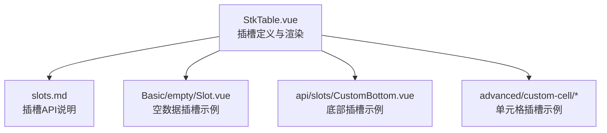
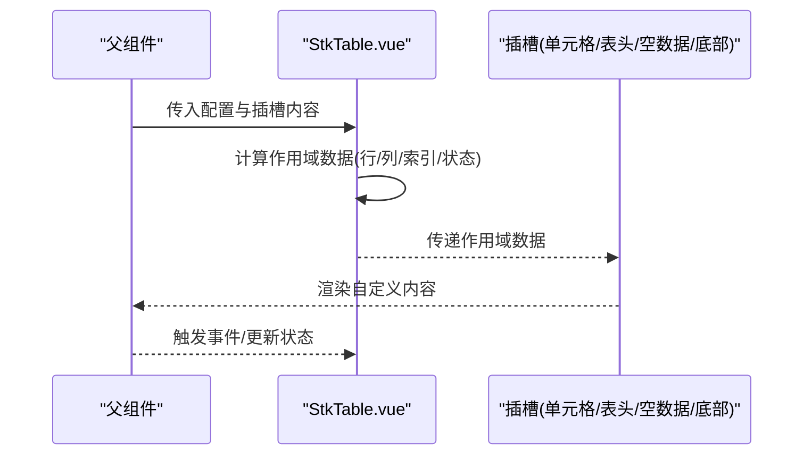
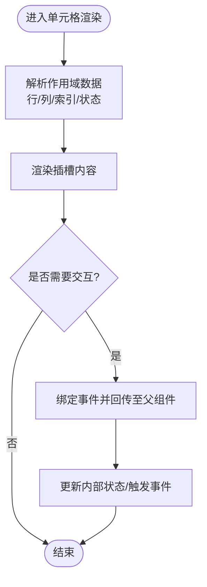
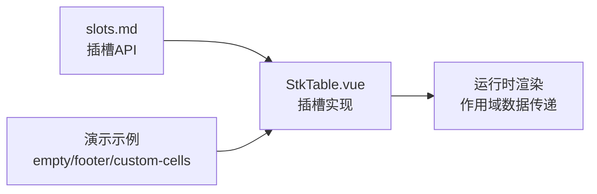

# 插槽 (Slots)

<cite>
**本文引用的文件**   
- [StkTable.vue](file://src/StkTable/StkTable.vue)
- [slots.md](file://docs-src/main/api/slots.md)
- [CustomBottom.vue](file://docs-demo/api/slots/CustomBottom.vue)
- [Empty Slot.vue](file://docs-demo/basic/empty/Slot.vue)
- [Footer.vue](file://docs-demo/basic/footer/Footer.vue)
- [YieldCell.vue](file://docs-demo/advanced/custom-cell/CustomCell/YieldCell.vue)
- [CheckboxComponentCell.vue](file://docs-demo/advanced/custom-cells/CheckboxCell/CheckboxComponentCell.vue)
- [EditableCell/index.vue](file://docs-demo/advanced/custom-cells/EditableCell/index.vue)
- [FilterCell/index.vue](file://docs-demo/advanced/custom-cells/FilterCell/index.vue)
- [NumberCell/index.vue](file://docs-demo/advanced/custom-cells/NumberCell/index.vue)
</cite>

## 目录
1. [简介](#简介)
2. [项目结构](#项目结构)
3. [核心组件与插槽总览](#核心组件与插槽总览)
4. [架构总览](#架构总览)
5. [详细组件分析](#详细组件分析)
6. [依赖关系分析](#依赖关系分析)
7. [性能考虑](#性能考虑)
8. [故障排查指南](#故障排查指南)
9. [结论](#结论)
10. [附录：插槽使用示例与最佳实践](#附录插槽使用示例与最佳实践)

## 简介
本章节面向 StkTable 组件的插槽系统，系统化说明各命名插槽的作用、可用参数（作用域数据）、动态内容渲染方式以及样式定制要点。覆盖单元格插槽、表头插槽、空数据插槽、底部插槽等常见场景，并提供完整的使用示例与最佳实践，帮助开发者通过插槽实现高度自定义的表格内容与布局。

## 项目结构
围绕插槽能力，本项目在源码与文档示例中提供了多处参考实现：
- 源码入口与插槽定义集中在 StkTable 主组件中
- 文档 API 对插槽进行统一说明
- 演示示例覆盖空数据、底部、单元格等多种插槽用法

图表来源
- [StkTable.vue](file://src/StkTable/StkTable.vue)
- [slots.md](file://docs-src/main/api/slots.md)
- [Empty Slot.vue](file://docs-demo/basic/empty/Slot.vue)
- [CustomBottom.vue](file://docs-demo/api/slots/CustomBottom.vue)
- [YieldCell.vue](file://docs-demo/advanced/custom-cell/CustomCell/YieldCell.vue)

章节来源
- [StkTable.vue](file://src/StkTable/StkTable.vue)
- [slots.md](file://docs-src/main/api/slots.md)

## 核心组件与插槽总览
StkTable 提供多类插槽以支持灵活的内容扩展：
- 单元格插槽：用于自定义列单元格的显示与交互
- 表头插槽：用于自定义列标题或表头区域
- 空数据插槽：当无数据时展示占位内容
- 底部插槽：用于表格底部的附加内容（如分页、统计）

这些插槽通过作用域数据向使用者暴露必要的上下文信息（如行、列、索引、状态等），以便在插槽内完成动态渲染与事件处理。

章节来源
- [StkTable.vue](file://src/StkTable/StkTable.vue)
- [slots.md](file://docs-src/main/api/slots.md)

## 架构总览
下图展示了 StkTable 插槽体系的整体结构与数据流向：父组件通过命名插槽注入自定义内容，StkTable 在渲染过程中将作用域数据传递给插槽，从而实现“框架控制 + 内容自定义”的解耦模式。

图表来源
- [StkTable.vue](file://src/StkTable/StkTable.vue)

## 详细组件分析

### 单元格插槽
- 作用：为任意列的单元格提供完全自定义的渲染逻辑，包括复杂组件、交互控件、富文本等
- 作用域数据：通常包含当前行数据、列定义、行索引、列索引、选中状态、排序/筛选上下文等（具体字段以 slots.md 为准）
- 动态渲染：可在插槽内根据行/列属性动态切换组件或样式
- 样式定制：可通过 CSS 变量或 scoped 样式覆盖默认样式

图表来源
- [YieldCell.vue](file://docs-demo/advanced/custom-cell/CustomCell/YieldCell.vue)
- [CheckboxComponentCell.vue](file://docs-demo/advanced/custom-cells/CheckboxCell/CheckboxComponentCell.vue)
- [EditableCell/index.vue](file://docs-demo/advanced/custom-cells/EditableCell/index.vue)
- [FilterCell/index.vue](file://docs-demo/advanced/custom-cells/FilterCell/index.vue)
- [NumberCell/index.vue](file://docs-demo/advanced/custom-cells/NumberCell/index.vue)

章节来源
- [YieldCell.vue](file://docs-demo/advanced/custom-cell/CustomCell/YieldCell.vue)
- [CheckboxComponentCell.vue](file://docs-demo/advanced/custom-cells/CheckboxCell/CheckboxComponentCell.vue)
- [EditableCell/index.vue](file://docs-demo/advanced/custom-cells/EditableCell/index.vue)
- [FilterCell/index.vue](file://docs-demo/advanced/custom-cells/FilterCell/index.vue)
- [NumberCell/index.vue](file://docs-demo/advanced/custom-cells/NumberCell/index.vue)

### 表头插槽
- 作用：自定义列标题、图标、下拉菜单、排序指示器等
- 作用域数据：通常包含列定义、排序状态、筛选状态等
- 使用建议：保持表头语义化，确保可访问性与键盘操作友好

章节来源
- [slots.md](file://docs-src/main/api/slots.md)
- [StkTable.vue](file://src/StkTable/StkTable.vue)

### 空数据插槽
- 作用：当表格无数据时展示占位内容，提升用户体验
- 作用域数据：可能包含空状态提示文案、是否允许自定义布局等
- 使用建议：结合业务文案与图标，提供明确的操作引导

章节来源
- [Empty Slot.vue](file://docs-demo/basic/empty/Slot.vue)
- [slots.md](file://docs-src/main/api/slots.md)

### 底部插槽
- 作用：在表格底部插入额外内容，如分页器、统计信息、导出按钮等
- 作用域数据：可能包含分页状态、总条数、页码等信息
- 使用建议：与表格宽度对齐，避免破坏整体布局

章节来源
- [CustomBottom.vue](file://docs-demo/api/slots/CustomBottom.vue)
- [Footer.vue](file://docs-demo/basic/footer/Footer.vue)
- [slots.md](file://docs-src/main/api/slots.md)

## 依赖关系分析
StkTable 的插槽系统与以下模块存在依赖关系：
- 插槽 API 文档：slots.md 定义了各插槽的名称与作用域数据结构
- 演示组件：basic/empty、api/slots、advanced/custom-cells 等目录下的示例展示了插槽的实际用法
- 主组件：StkTable.vue 负责插槽的注册、作用域数据的计算与渲染调度

图表来源
- [slots.md](file://docs-src/main/api/slots.md)
- [StkTable.vue](file://src/StkTable/StkTable.vue)
- [Empty Slot.vue](file://docs-demo/basic/empty/Slot.vue)
- [CustomBottom.vue](file://docs-demo/api/slots/CustomBottom.vue)
- [YieldCell.vue](file://docs-demo/advanced/custom-cell/CustomCell/YieldCell.vue)

章节来源
- [slots.md](file://docs-src/main/api/slots.md)
- [StkTable.vue](file://src/StkTable/StkTable.vue)

## 性能考虑
- 避免在插槽内执行高开销计算：尽量将计算逻辑移至父组件或使用响应式缓存
- 合理使用 v-if/v-show：根据条件渲染减少不必要的 DOM 节点
- 事件委托与批量更新：在单元格插槽中合并多次状态更新，减少重渲染
- 虚拟滚动配合：大数据量场景下结合虚拟滚动优化性能

[本节为通用指导，不直接分析具体文件]

## 故障排查指南
常见问题与解决思路：
- 插槽未生效：检查插槽名称是否正确，确认父组件正确传入插槽内容
- 作用域数据为空：查看 slots.md 中的字段定义，确认是否使用了正确的键名
- 样式冲突：使用 scoped 样式或更具体的选择器覆盖默认样式
- 事件不触发：确认事件绑定与回调函数是否正确传递

章节来源
- [slots.md](file://docs-src/main/api/slots.md)
- [StkTable.vue](file://src/StkTable/StkTable.vue)

## 结论
StkTable 的插槽系统提供了强大的内容扩展能力，通过统一的插槽接口与清晰的作用域数据约定，开发者可以灵活定制单元格、表头、空数据和底部等内容。遵循本文档的最佳实践，可以在保证性能与可维护性的前提下，实现高度个性化的表格界面。

[本节为总结性内容，不直接分析具体文件]

## 附录：插槽使用示例与最佳实践

### 单元格插槽示例
- 基础渲染：在插槽内直接使用模板语法渲染行数据
- 组件封装：将复杂逻辑封装为独立组件，提高复用性
- 交互处理：在插槽中绑定事件并调用父组件方法

章节来源
- [YieldCell.vue](file://docs-demo/advanced/custom-cell/CustomCell/YieldCell.vue)
- [CheckboxComponentCell.vue](file://docs-demo/advanced/custom-cells/CheckboxCell/CheckboxComponentCell.vue)
- [EditableCell/index.vue](file://docs-demo/advanced/custom-cells/EditableCell/index.vue)
- [FilterCell/index.vue](file://docs-demo/advanced/custom-cells/FilterCell/index.vue)
- [NumberCell/index.vue](file://docs-demo/advanced/custom-cells/NumberCell/index.vue)

### 表头插槽示例
- 自定义标题：在插槽内添加图标、下拉菜单等元素
- 排序指示：根据排序状态显示不同的图标或样式
- 筛选功能：集成筛选器组件，提供列级筛选能力

章节来源
- [slots.md](file://docs-src/main/api/slots.md)

### 空数据插槽示例
- 占位文案：根据业务场景显示友好的提示信息
- 操作引导：提供刷新、清空等操作按钮
- 样式适配：确保在不同屏幕尺寸下显示正常

章节来源
- [Empty Slot.vue](file://docs-demo/basic/empty/Slot.vue)

### 底部插槽示例
- 分页集成：嵌入分页组件，支持页码跳转与每页条数设置
- 统计信息：显示总条数、筛选结果数量等统计信息
- 工具按钮：添加导出、打印等功能按钮

章节来源
- [CustomBottom.vue](file://docs-demo/api/slots/CustomBottom.vue)
- [Footer.vue](file://docs-demo/basic/footer/Footer.vue)

### 最佳实践
- 职责分离：将复杂的插槽逻辑拆分为独立组件
- 类型安全：使用 TypeScript 定义作用域数据结构
- 可访问性：确保插槽内容符合无障碍标准
- 性能优化：避免不必要的重渲染和内存泄漏

[本节为通用指导，不直接分析具体文件]