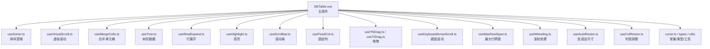
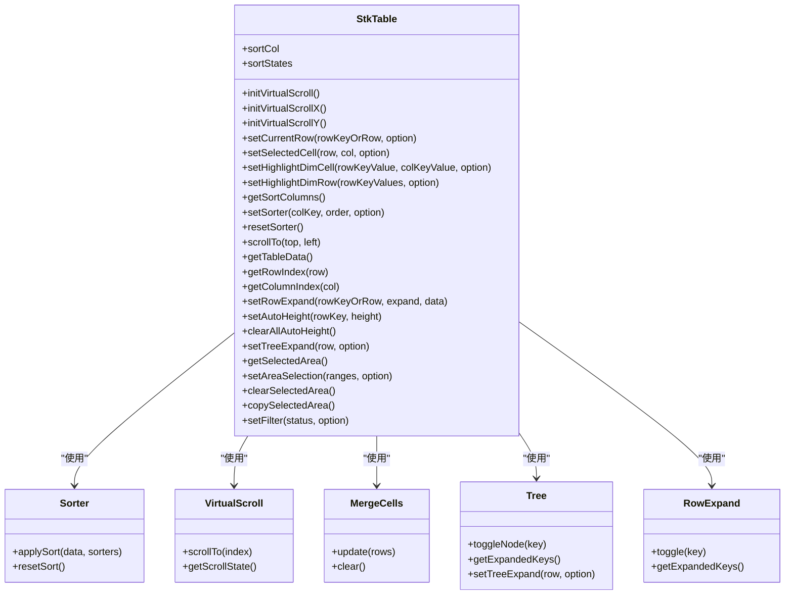
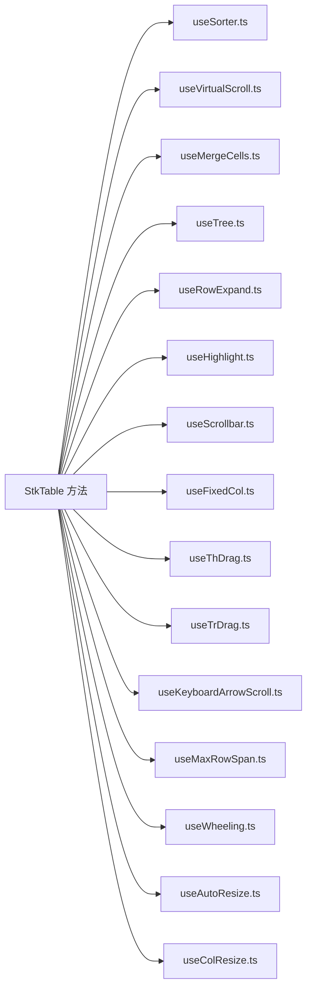

# 暴露方法 (Expose Methods)

<cite>
**本文引用的文件**   
- [StkTable.vue](file://src/StkTable/StkTable.vue)
- [useTree.ts](file://src/StkTable/useTree.ts)
- [index.ts](file://src/StkTable/index.ts)
- [types/index.ts](file://src/StkTable/types/index.ts)
- [expose.md](file://docs-src/main/api/expose.md)
</cite>

## 更新摘要
**已进行的更改**   
- 更新了 `setTreeExpand` 方法的类型检查说明，现在支持字符串和数字类型的行键
- 增强了树节点操作的类型安全性，支持数据库生成的ID和其他数值主键
- 完善了方法参数说明和使用示例

## 目录
1. [简介](#简介)
2. [项目结构](#项目结构)
3. [核心组件](#核心组件)
4. [架构总览](#架构总览)
5. [详细组件分析](#详细组件分析)
6. [依赖分析](#依赖分析)
7. [性能考虑](#性能考虑)
8. [故障排查指南](#故障排查指南)
9. [结论](#结论)
10. [附录](#附录)

## 简介
本章节为 StkTable 组件的"暴露方法"API 文档，聚焦通过 ref 或模板引用可调用的一切公共方法。内容覆盖数据操作方法（刷新、排序、筛选）、滚动控制方法、状态查询方法等，并提供参数说明、返回值类型、使用示例与注意事项，帮助开发者以编程方式控制表格行为与状态。

## 项目结构
StkTable 的核心实现位于 src/StkTable 目录，其中：
- StkTable.vue 是主组件，负责组合各项能力并对外暴露方法。
- index.ts 作为导出入口，通常用于统一导出组件与类型。
- useTree.ts 处理树形数据的展开/收起逻辑。
- types/index.ts 定义所有类型，包括增强的 UniqKey 类型。
- docs-src/main/api/expose.md 为官方文档中关于暴露方法的说明页面，可作为参考。



**图表来源**
- [StkTable.vue](file://src/StkTable/StkTable.vue)
- [index.ts](file://src/StkTable/index.ts)

## 核心组件
StkTable 通过组合多个 hooks 与内部模块提供完整表格能力，并在组件实例上暴露一组方法供外部调用。这些方法通常包括：
- 数据操作：刷新、排序、筛选、选择、展开、树节点操作、合并单元格更新等
- 滚动控制：滚动到指定位置/行、获取滚动状态、重置滚动等
- 状态查询：获取当前页数据、选中项、排序状态、筛选条件、可见列、滚动信息等
- 渲染控制：强制重排/重绘、更新列配置、切换主题/尺寸等

注意：具体方法名与签名以实际源码为准。以下内容为基于源码分析的详细说明。

## 架构总览
下图展示了 StkTable 组件与其内部功能模块的关系，以及对外暴露方法的职责划分。



**图表来源**
- [StkTable.vue](file://src/StkTable/StkTable.vue)

## 详细组件分析
本节按方法类别梳理常见暴露方法的使用要点、参数与返回值、调用时机、性能影响与错误处理建议。

### 数据操作方法

#### setTreeExpand - 设置树节点展开状态
**更新** 该方法现已增强类型检查，支持字符串和数字两种类型的行键，适用于数据库生成的ID或其他数值主键场景。

- **作用**：设置树节点的展开/收起状态，支持单个节点或多个节点批量操作
- **参数**：
  - `row`: `(UniqKey | DT) | (UniqKey | DT)[]` - 可以是行键（字符串或数字）或行对象，支持数组形式批量操作
  - `option`: `SetTreeExpandOption` - 可选配置对象
    - `expand?: boolean` - 是否展开（不传则根据当前状态取反）
    - `all?: boolean` - 是否展开所有子节点
    - `level?: number` - 展开到第几层
- **返回**：void
- **调用时机**：程序化控制树节点展开状态、批量设置节点状态
- **性能**：支持批量操作，避免频繁调用；大数据量时注意虚拟滚动性能
- **错误处理**：当找不到指定行键时会输出警告信息

**使用示例**：
```typescript
// 单个节点展开（支持字符串和数字行键）
tableRef.value.setTreeExpand('node-1', { expand: true })
tableRef.value.setTreeExpand(123, { expand: true }) // 数字行键

// 批量操作
tableRef.value.setTreeExpand(['node-1', 'node-2', 456], { expand: true })

// 展开所有子节点
tableRef.value.setTreeExpand('parent-node', { all: true })

// 展开到指定层级
tableRef.value.setTreeExpand('root-node', { level: 2 })
```

**Section sources**
- [useTree.ts:100-102](file://src/StkTable/useTree.ts#L100-L102)
- [useTree.ts:45-98](file://src/StkTable/useTree.ts#L45-L98)
- [types/index.ts:220](file://src/StkTable/types/index.ts#L220)

#### setCurrentRow - 设置当前选中行
- **作用**：设置当前选中的行，支持通过行键或行对象设置
- **参数**：
  - `rowKeyOrRow`: `string | undefined | DT` - 行键或行对象，undefined 表示取消选中
  - `option`: `{ silent?: boolean; deep?: boolean }` - 选项配置
    - `silent`: 是否静默模式，不触发 current-change 事件
    - `deep`: 是否在子行中递归查找
- **返回**：void
- **调用时机**：程序化设置选中行、恢复用户选择状态
- **性能**：支持深度查找，但会遍历数据结构
- **错误处理**：找不到指定行键时会输出警告

#### setRowExpand - 设置展开行
- **作用**：设置行的展开/收起状态
- **参数**：
  - `rowKeyOrRow`: `string | undefined | DT` - 行键或行对象
  - `expand?`: `boolean` - 是否展开
  - `data?`: `{ col?: StkTableColumn<DT>; silent?: boolean }` - 附加数据和选项
- **返回**：void
- **调用时机**：程序化控制行展开状态

#### setFilter - 设置筛选状态（Beta）
- **作用**：设置表格筛选状态，支持远程和本地筛选
- **参数**：
  - `status`: `Record<UniqKey, FilterStatus> | null` - 筛选状态对象，null 清除所有筛选
  - `option?`: `{ remote?: boolean; silent?: boolean }` - 选项配置
    - `remote`: 是否远程筛选，不自动触发数据过滤
    - `silent`: 是否静默模式，不触发 filter-change 事件
- **返回**：void
- **调用时机**：动态设置筛选条件、批量应用筛选规则

**Section sources**
- [StkTable.vue:1630-1670](file://src/StkTable/StkTable.vue#L1630-L1670)
- [StkTable.vue:1866-1871](file://src/StkTable/StkTable.vue#L1866-L1871)

### 滚动控制方法

#### scrollTo - 滚动到指定位置
- **作用**：设置滚动条位置，支持纵向和横向滚动
- **参数**：
  - `top`: `number | null = 0` - 纵向滚动位置，null 表示不改变
  - `left`: `number | null = 0` - 横向滚动位置，null 表示不改变
- **返回**：void
- **调用时机**：跳转到特定位置、恢复滚动状态、定位到某一行
- **性能**：在实验性滚动模式下使用 transform 优化性能
- **错误处理**：组件未挂载时调用无效

#### initVirtualScroll - 初始化虚拟滚动
- **作用**：重新计算虚拟列表可视区的行数和列数
- **参数**：`height?: number` - 可选的高度参数
- **返回**：void
- **调用时机**：容器尺寸变化后、手动调整窗口大小后

#### initVirtualScrollX/Y - 初始化横向/纵向虚拟滚动
- **作用**：分别初始化横向和纵向虚拟滚动参数
- **参数**：`height?: number` - 可选的高度参数
- **返回**：void

**Section sources**
- [StkTable.vue:1692-1703](file://src/StkTable/StkTable.vue#L1692-L1703)
- [StkTable.vue:1717-1731](file://src/StkTable/StkTable.vue#L1717-L1731)

### 状态查询方法

#### getTableData - 获取表格数据
- **作用**：返回当前表格的数据快照，包含排序后的结果
- **参数**：无
- **返回**：`DT[]` - 当前表格数据数组
- **调用时机**：导出数据、统计计算、数据同步

#### getRowIndex - 获取行索引
- **作用**：根据 rowKey 或行对象获取行索引
- **参数**：`row: UniqKey | DT` - 行键或行对象
- **返回**：`number` - 行索引，未找到返回 -1
- **调用时机**：精确定位行、验证数据存在性

#### getColumnIndex - 获取列索引
- **作用**：根据 colKey 或列对象获取列索引
- **参数**：`col: string | StkTableColumn<DT>` - 列键或列对象
- **返回**：`number` - 列索引，未找到返回 -1
- **调用时机**：列操作、布局计算

#### getSelectedArea - 获取选区信息
- **作用**：获取拖选选中的单元格信息
- **参数**：无
- **返回**：`{ rows: DT[]; cols: StkTableColumn<DT>[]; ranges: AreaSelectionRange[] }`
- **调用时机**：批量操作前获取选区、复制粘贴操作

**Section sources**
- [StkTable.vue:1706-1708](file://src/StkTable/StkTable.vue#L1706-L1708)
- [StkTable.vue:1807-1808](file://src/StkTable/StkTable.vue#L1807-L1808)
- [StkTable.vue:1843-1844](file://src/StkTable/StkTable.vue#L1843-L1844)

### 渲染控制方法

#### setHighlightDimCell/Row - 设置高亮效果
- **作用**：设置单元格或行的渐暗高亮效果
- **参数**：
  - `setHighlightDimCell`: `rowKeyValue: UniqKey, colKeyValue: string, option: HighlightDimCellOption`
  - `setHighlightDimRow`: `rowKeyValues: UniqKey[], option: HighlightDimRowOption`
- **返回**：void
- **调用时机**：用户交互反馈、数据变更提示
- **性能**：支持 CSS 动画和 Web Animations API

#### setAutoHeight/clearAllAutoHeight - 管理可变行高
- **作用**：在可变行高模式下设置或清除行高缓存
- **参数**：
  - `setAutoHeight`: `rowKey: UniqKey, height?: number | null`
  - `clearAllAutoHeight`: 无参数
- **返回**：void
- **调用时机**：行内容变化后更新高度、清理缓存

#### setAreaSelection/clearSelectedArea/copySelectedArea - 区域选择操作
- **作用**：设置、清空选区或复制选区内容
- **参数**：根据具体方法而定
- **返回**：根据方法不同返回 void 或字符串
- **调用时机**：批量操作、数据导出

**Section sources**
- [StkTable.vue:1752-1759](file://src/StkTable/StkTable.vue#L1752-L1759)
- [StkTable.vue:1822-1829](file://src/StkTable/StkTable.vue#L1822-L1829)
- [StkTable.vue:1843-1864](file://src/StkTable/StkTable.vue#L1843-L1864)

## 依赖分析
StkTable 的方法依赖其内部 hooks 与工具模块。下图展示方法与模块的依赖关系。



**图表来源**
- [StkTable.vue](file://src/StkTable/StkTable.vue)

## 性能考虑
- **大数据场景**：优先启用虚拟滚动，减少 DOM 节点数量
- **排序与筛选**：尽量走后端，前端只做轻量处理与缓存
- **合并单元格**：计算复杂，避免频繁更新与过大数据集
- **滚动控制**：在动画或过渡期间暂停调用，防止抖动
- **批量更新**：列配置与主题切换时合并多次调用，降低重排次数
- **树节点操作**：`setTreeExpand` 支持批量操作，避免频繁调用

## 故障排查指南
- **方法调用无效**
  - 检查组件是否已挂载，确保在 onMounted 之后调用
  - 确认方法名与签名与源码一致
- **排序/筛选不生效**
  - 校验字段名与列配置匹配
  - 检查是否有远程接口拦截或缓存策略
- **滚动位置异常**
  - 确认容器高度与滚动区域正确
  - 虚拟滚动模式下检查行高配置
- **选中状态不同步**
  - 检查 rowKey 的唯一性与稳定性
  - 避免在渲染过程中修改选中状态
- **树节点操作失败**
  - 确认行键类型（字符串或数字）与数据源一致
  - 检查节点是否存在于数据源中

## 结论
通过 ref 或模板引用调用 StkTable 的暴露方法，可以实现对表格行为的精细控制。`setTreeExpand` 方法现已增强类型检查，支持字符串和数字两种行键类型，更好地适应不同的数据源需求。建议在理解各方法职责与性能影响的基础上，合理组织调用时机与参数，以获得稳定且高效的交互体验。

## 附录
- **官方文档参考**：[expose.md](file://docs-src/main/api/expose.md)
- **组件导出入口**：[index.ts](file://src/StkTable/index.ts)
- **类型定义**：[types/index.ts](file://src/StkTable/types/index.ts)
- **树形数据处理**：[useTree.ts](file://src/StkTable/useTree.ts)

**Section sources**
- [StkTable.vue](file://src/StkTable/StkTable.vue)
- [index.ts](file://src/StkTable/index.ts)
- [expose.md](file://docs-src/main/api/expose.md)