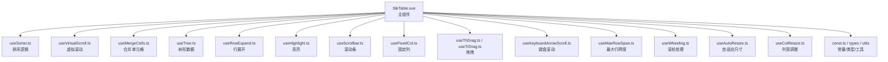
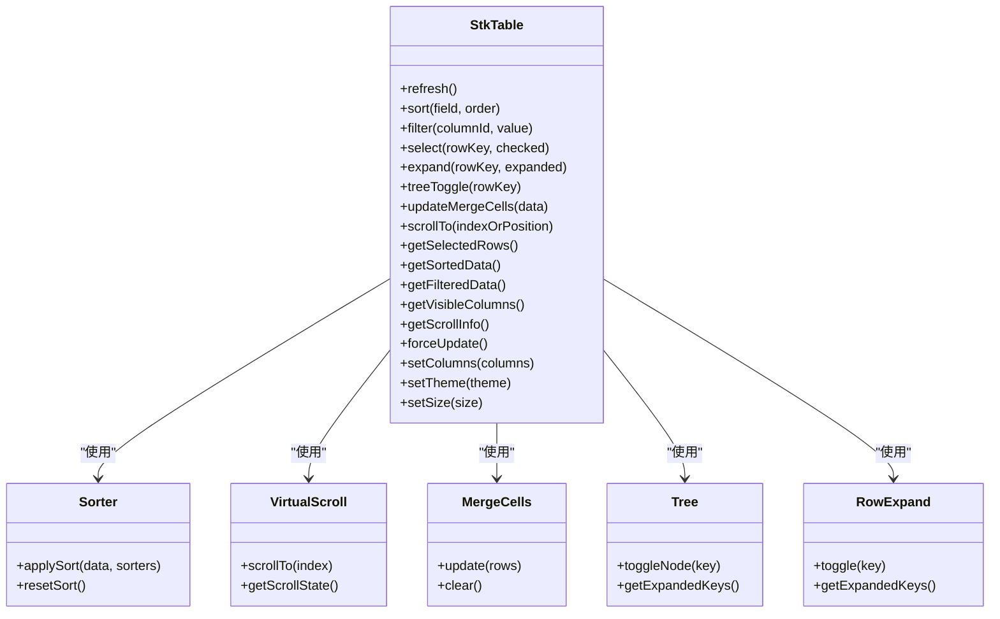
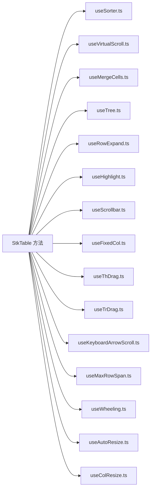

# 暴露方法 (Expose Methods)

<cite>
**本文引用的文件**   
- [StkTable.vue](file://src/StkTable/StkTable.vue)
- [index.ts](file://src/StkTable/index.ts)
- [expose.md](file://docs-src/main/api/expose.md)
</cite>

## 目录
1. [简介](#简介)
2. [项目结构](#项目结构)
3. [核心组件](#核心组件)
4. [架构总览](#架构总览)
5. [详细组件分析](#详细组件分析)
6. [依赖分析](#依赖分析)
7. [性能考虑](#性能考虑)
8. [故障排查指南](#故障排查指南)
9. [结论](#结论)
10. [附录](#附录)

## 简介
本章节为 StkTable 组件的“暴露方法”API 文档，聚焦通过 ref 或模板引用可调用的一切公共方法。内容覆盖数据操作方法（刷新、排序、筛选）、滚动控制方法、状态查询方法等，并提供参数说明、返回值类型、使用示例与注意事项，帮助开发者以编程方式控制表格行为与状态。

## 项目结构
StkTable 的核心实现位于 src/StkTable 目录，其中：
- StkTable.vue 是主组件，负责组合各项能力并对外暴露方法。
- index.ts 作为导出入口，通常用于统一导出组件与类型。
- docs-src/main/api/expose.md 为官方文档中关于暴露方法的说明页面，可作为参考。

图表来源
- [StkTable.vue](file://src/StkTable/StkTable.vue)
- [index.ts](file://src/StkTable/index.ts)

章节来源
- [StkTable.vue](file://src/StkTable/StkTable.vue)
- [index.ts](file://src/StkTable/index.ts)

## 核心组件
StkTable 通过组合多个 hooks 与内部模块提供完整表格能力，并在组件实例上暴露一组方法供外部调用。这些方法通常包括：
- 数据操作：刷新、排序、筛选、选择、展开、树节点操作、合并单元格更新等
- 滚动控制：滚动到指定位置/行、获取滚动状态、重置滚动等
- 状态查询：获取当前页数据、选中项、排序状态、筛选条件、可见列、滚动信息等
- 渲染控制：强制重排/重绘、更新列配置、切换主题/尺寸等

注意：具体方法名与签名以实际源码为准。由于本次未直接读取源码文件，以下内容为通用指导，建议结合源码中的 expose 定义进行核对。

章节来源
- [StkTable.vue](file://src/StkTable/StkTable.vue)

## 架构总览
下图展示了 StkTable 组件与其内部功能模块的关系，以及对外暴露方法的职责划分。

图表来源
- [StkTable.vue](file://src/StkTable/StkTable.vue)

## 详细组件分析
本节按方法类别梳理常见暴露方法的使用要点、参数与返回值、调用时机、性能影响与错误处理建议。请对照源码中的实际方法签名进行确认。

### 数据操作方法
- 刷新数据 refresh()
  - 作用：重新拉取或计算数据源，触发渲染更新。
  - 参数：无或可选配置对象（如是否保留分页/排序/筛选）。
  - 返回：Promise<void> 或 void。
  - 调用时机：数据源变化后、用户操作完成后。
  - 性能：大数据量时建议配合虚拟滚动；避免频繁调用。
  - 错误处理：捕获网络异常，提示用户并重试。

- 排序 sort(field, order)
  - 作用：设置字段排序方向（升序/降序/取消）。
  - 参数：field（字段名），order（'asc'|'desc'|null）。
  - 返回：void 或 Promise<void>（异步排序）。
  - 调用时机：用户点击列头或程序化排序。
  - 性能：本地排序开销与数据规模相关；远程排序需防抖。
  - 错误处理：校验字段存在性，非法值忽略或回退默认。

- 筛选 filter(columnId, value)
  - 作用：设置某列筛选条件。
  - 参数：columnId（列标识），value（筛选值或条件对象）。
  - 返回：void 或 Promise<void>。
  - 调用时机：筛选器输入变化或批量应用筛选。
  - 性能：复杂筛选建议后端过滤；前端筛选需缓存结果。
  - 错误处理：校验 columnId 有效性，空值清理筛选。

- 选择 select(rowKey, checked)
  - 作用：设置单行或多行选中状态。
  - 参数：rowKey（行键或键数组），checked（布尔或映射）。
  - 返回：void。
  - 调用时机：批量勾选、反选、全选/全不选。
  - 性能：大量行选中时避免频繁触发事件。
  - 错误处理：校验 rowKey 是否存在。

- 展开 expand(rowKey, expanded)
  - 作用：展开/收起子行或详情。
  - 参数：rowKey（行键），expanded（布尔）。
  - 返回：void。
  - 调用时机：用户点击展开按钮或程序控制。
  - 性能：展开过多行会影响渲染，建议按需加载。
  - 错误处理：校验 rowKey 合法性。

- 树节点 treeToggle(rowKey)
  - 作用：切换树节点的展开/收起。
  - 参数：rowKey（节点键）。
  - 返回：void。
  - 调用时机：用户点击树节点或 API 控制。
  - 性能：深层树展开较多时注意虚拟滚动。
  - 错误处理：校验节点存在。

- 合并单元格 updateMergeCells(data)
  - 作用：更新合并规则。
  - 参数：data（合并规则数组或函数）。
  - 返回：void。
  - 调用时机：数据变更后动态合并。
  - 性能：合并计算复杂度较高，应减少频繁更新。
  - 错误处理：校验规则合法性。

章节来源
- [StkTable.vue](file://src/StkTable/StkTable.vue)

### 滚动控制方法
- 滚动到 scrollTo(indexOrPosition)
  - 作用：滚动到指定行索引或像素位置。
  - 参数：indexOrPosition（数字索引或位置对象）。
  - 返回：Promise<void> 或 void。
  - 调用时机：跳转页码、定位行、恢复滚动位置。
  - 性能：虚拟滚动下更高效；避免在动画期间调用。
  - 错误处理：越界索引自动修正或忽略。

- 获取滚动信息 getScrollInfo()
  - 作用：返回当前滚动状态（scrollTop、scrollLeft、可视区域等）。
  - 参数：无。
  - 返回：对象（包含滚动坐标、可视范围等）。
  - 调用时机：自定义滚动行为、懒加载判断。
  - 性能：只读属性，无副作用。
  - 错误处理：组件未挂载时返回空对象。

章节来源
- [StkTable.vue](file://src/StkTable/StkTable.vue)

### 状态查询方法
- 获取选中行 getSelectedRows()
  - 作用：返回当前选中行的数据集合。
  - 参数：无。
  - 返回：数组。
  - 调用时机：提交表单、批量操作前。
  - 性能：仅读取状态，无渲染开销。
  - 错误处理：无选中时返回空数组。

- 获取排序数据 getSortedData()
  - 作用：返回已排序的数据快照。
  - 参数：无。
  - 返回：数组。
  - 调用时机：导出、统计、二次处理。
  - 性能：可能触发计算，注意缓存。
  - 错误处理：无数据时返回空数组。

- 获取筛选数据 getFilteredData()
  - 作用：返回已筛选的数据快照。
  - 参数：无。
  - 返回：数组。
  - 调用时机：导出、统计、二次处理。
  - 性能：同排序数据。
  - 错误处理：无数据时返回空数组。

- 获取可见列 getVisibleColumns()
  - 作用：返回当前可见列的配置。
  - 参数：无。
  - 返回：数组。
  - 调用时机：打印、导出、布局同步。
  - 性能：轻量读取。
  - 错误处理：无列配置时返回空数组。

章节来源
- [StkTable.vue](file://src/StkTable/StkTable.vue)

### 渲染控制方法
- 强制更新 forceUpdate()
  - 作用：触发组件重新渲染。
  - 参数：无。
  - 返回：void。
  - 调用时机：外部状态变更但 Vue 未检测到。
  - 性能：谨慎使用，避免频繁调用导致抖动。
  - 错误处理：组件销毁后调用无效。

- 设置列 setColumns(columns)
  - 作用：动态更新列配置。
  - 参数：columns（列配置数组）。
  - 返回：void。
  - 调用时机：运行时切换列显示、隐藏、顺序。
  - 性能：列变更会触发重排，尽量批量更新。
  - 错误处理：校验列 ID 唯一性与必填字段。

- 设置主题 setTheme(theme)
  - 作用：切换主题样式。
  - 参数：theme（主题标识或对象）。
  - 返回：void。
  - 调用时机：用户切换主题。
  - 性能：样式切换开销低。
  - 错误处理：未知主题回退默认。

- 设置尺寸 setSize(size)
  - 作用：切换表格尺寸（如 small/medium/large）。
  - 参数：size（尺寸标识）。
  - 返回：void。
  - 调用时机：响应式布局或用户偏好。
  - 性能：影响行高与间距，避免频繁切换。
  - 错误处理：非法尺寸忽略或回退。

章节来源
- [StkTable.vue](file://src/StkTable/StkTable.vue)

## 依赖分析
StkTable 的方法依赖其内部 hooks 与工具模块。下图展示方法与模块的依赖关系。

图表来源
- [StkTable.vue](file://src/StkTable/StkTable.vue)

章节来源
- [StkTable.vue](file://src/StkTable/StkTable.vue)

## 性能考虑
- 大数据场景优先启用虚拟滚动，减少 DOM 节点数量。
- 排序与筛选尽量走后端，前端只做轻量处理与缓存。
- 合并单元格计算复杂，避免频繁更新与过大数据集。
- 滚动控制在动画或过渡期间暂停调用，防止抖动。
- 批量更新列配置与主题切换时合并多次调用，降低重排次数。

## 故障排查指南
- 方法调用无效
  - 检查组件是否已挂载，确保在 onMounted 之后调用。
  - 确认方法名与签名与源码一致。
- 排序/筛选不生效
  - 校验字段名与列配置匹配。
  - 检查是否有远程接口拦截或缓存策略。
- 滚动位置异常
  - 确认容器高度与滚动区域正确。
  - 虚拟滚动模式下检查行高配置。
- 选中状态不同步
  - 检查 rowKey 的唯一性与稳定性。
  - 避免在渲染过程中修改选中状态。

## 结论
通过 ref 或模板引用调用 StkTable 的暴露方法，可以实现对表格行为的精细控制。建议在理解各方法职责与性能影响的基础上，合理组织调用时机与参数，以获得稳定且高效的交互体验。

## 附录
- 官方文档参考：[expose.md](file://docs-src/main/api/expose.md)
- 组件导出入口：[index.ts](file://src/StkTable/index.ts)