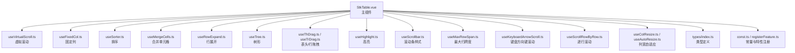
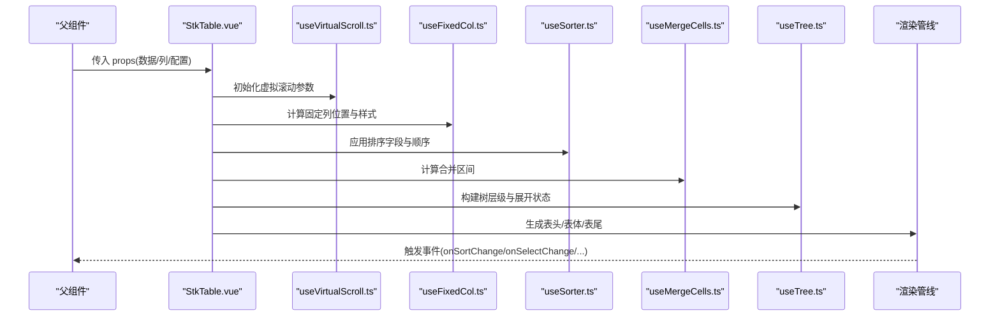
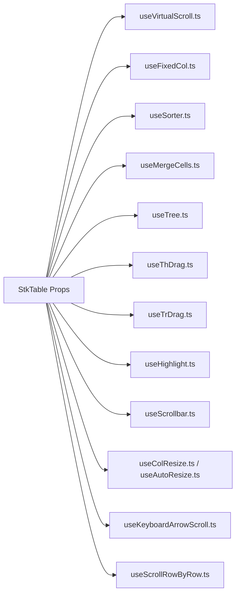

# 表格属性 (Table Props)

<cite>
**本文引用的文件**   
- [src/StkTable/StkTable.vue](file://src/StkTable/StkTable.vue)
- [src/StkTable/types/index.ts](file://src/StkTable/types/index.ts)
- [src/StkTable/useVirtualScroll.ts](file://src/StkTable/useVirtualScroll.ts)
- [src/StkTable/useFixedCol.ts](file://src/StkTable/useFixedCol.ts)
- [src/StkTable/useSorter.ts](file://src/StkTable/useSorter.ts)
- [src/StkTable/useMergeCells.ts](file://src/StkTable/useMergeCells.ts)
- [src/StkTable/useRowExpand.ts](file://src/StkTable/useRowExpand.ts)
- [src/StkTable/useTree.ts](file://src/StkTable/useTree.ts)
- [src/StkTable/useThDrag.ts](file://src/StkTable/useThDrag.ts)
- [src/StkTable/useTrDrag.ts](file://src/StkTable/useTrDrag.ts)
- [src/StkTable/useHighlight.ts](file://src/StkTable/useHighlight.ts)
- [src/StkTable/useScrollbar.ts](file://src/StkTable/useScrollbar.ts)
- [src/StkTable/useMaxRowSpan.ts](file://src/StkTable/useMaxRowSpan.ts)
- [src/StkTable/useKeyboardArrowScroll.ts](file://src/StkTable/useKeyboardArrowScroll.ts)
- [src/StkTable/useScrollRowByRow.ts](file://src/StkTable/useScrollRowByRow.ts)
- [src/StkTable/useColResize.ts](file://src/StkTable/useColResize.ts)
- [src/StkTable/useAutoResize.ts](file://src/StkTable/useAutoResize.ts)
- [src/StkTable/const.ts](file://src/StkTable/const.ts)
- [src/StkTable/features/index.ts](file://src/StkTable/features/index.ts)
- [src/StkTable/registerFeature.ts](file://src/StkTable/registerFeature.ts)
- [docs-src/main/api/table-props.md](file://docs-src/main/api/table-props.md)
- [docs-src/main/table/basic/basic.md](file://docs-src/main/table/basic/basic.md)
- [docs-src/main/table/basic/fixed.md](file://docs-src/main/table/basic/fixed.md)
- [docs-src/main/table/basic/sort.md](file://docs-src/main/table/basic/sort.md)
- [docs-src/main/table/advanced/virtual.md](file://docs-src/main/table/advanced/virtual.md)
- [docs-src/main/table/advanced/custom-cell.md](file://docs-src/main/table/advanced/custom-cell.md)
</cite>

## 目录
1. [简介](#简介)
2. [项目结构](#项目结构)
3. [核心组件与属性总览](#核心组件与属性总览)
4. [架构概览](#架构概览)
5. [详细属性说明](#详细属性说明)
6. [依赖关系分析](#依赖关系分析)
7. [性能考量](#性能考量)
8. [故障排查指南](#故障排查指南)
9. [结论](#结论)
10. [附录：TypeScript 类型定义与示例](#附录typescript-类型定义与示例)

## 简介
本文件为 StkTable 主组件的属性文档，聚焦于所有配置属性的完整定义、数据类型、默认值、是否必需、作用与使用场景、以及配置方法。内容覆盖基础配置（数据源、列配置、尺寸）、高级功能（虚拟滚动、固定列、排序筛选、合并单元格、树形、拖拽、高亮、滚动优化等），并提供 TypeScript 类型定义参考与实际使用示例路径，帮助开发者准确理解和使用表格配置选项。

## 项目结构
StkTable 主组件位于 src/StkTable 目录下，采用“主组件 + 特性 Hook + 类型定义”的模块化组织方式。核心入口为 StkTable.vue，各能力通过独立的 useXxx.ts 钩子实现，类型集中在 types/index.ts，常量与注册机制在 const.ts 与 registerFeature.ts 中维护。

图表来源
- [src/StkTable/StkTable.vue](file://src/StkTable/StkTable.vue)
- [src/StkTable/useVirtualScroll.ts](file://src/StkTable/useVirtualScroll.ts)
- [src/StkTable/useFixedCol.ts](file://src/StkTable/useFixedCol.ts)
- [src/StkTable/useSorter.ts](file://src/StkTable/useSorter.ts)
- [src/StkTable/useMergeCells.ts](file://src/StkTable/useMergeCells.ts)
- [src/StkTable/useRowExpand.ts](file://src/StkTable/useRowExpand.ts)
- [src/StkTable/useTree.ts](file://src/StkTable/useTree.ts)
- [src/StkTable/useThDrag.ts](file://src/StkTable/useThDrag.ts)
- [src/StkTable/useTrDrag.ts](file://src/StkTable/useTrDrag.ts)
- [src/StkTable/useHighlight.ts](file://src/StkTable/useHighlight.ts)
- [src/StkTable/useScrollbar.ts](file://src/StkTable/useScrollbar.ts)
- [src/StkTable/useMaxRowSpan.ts](file://src/StkTable/useMaxRowSpan.ts)
- [src/StkTable/useKeyboardArrowScroll.ts](file://src/StkTable/useKeyboardArrowScroll.ts)
- [src/StkTable/useScrollRowByRow.ts](file://src/StkTable/useScrollRowByRow.ts)
- [src/StkTable/useColResize.ts](file://src/StkTable/useColResize.ts)
- [src/StkTable/useAutoResize.ts](file://src/StkTable/useAutoResize.ts)
- [src/StkTable/types/index.ts](file://src/StkTable/types/index.ts)
- [src/StkTable/const.ts](file://src/StkTable/const.ts)
- [src/StkTable/registerFeature.ts](file://src/StkTable/registerFeature.ts)

章节来源
- [src/StkTable/StkTable.vue](file://src/StkTable/StkTable.vue)
- [src/StkTable/types/index.ts](file://src/StkTable/types/index.ts)

## 核心组件与属性总览
StkTable 主组件通过 props 暴露大量配置项，涵盖：
- 数据与列：dataSource、columns、keyField、rowKey、rowClassName、cellClassName、headerClassName、footerClassName、emptyText、noDataComponent
- 尺寸与布局：width、height、minWidth、maxWidth、size、bordered、stripe、align、overflow、scrollbarStyle、autoHeight、flex
- 交互与行为：sortable、sortMode、sortField、sortOrder、filterable、filters、filterMethod、selectable、selectedKeys、onSelect、onSelectAll、expandable、expandedKeys、onExpand、treeProps、mergeCells、highlight、dragHeader、dragRow、keyboardArrowScroll、scrollRowByRow、areaSelection、virtualX、virtualY、fixedCols、fixedRows、rowHeight、colResizable、autoResize
- 渲染与插槽：slots（如 header、body、footer、empty、customCell）
- 事件与回调：onChange、onSortChange、onFilterChange、onSelectChange、onExpandChange、onRowClick、onCellClick、onRowDblClick、onCellDblClick、onContextMenu、onScroll、onResize、onVirtualScroll
- 其他：theme、i18n、contextmenu、experimental、optimize

注意：具体默认值与必填性以源码实现为准；本节仅作分类与范围说明。

章节来源
- [src/StkTable/StkTable.vue](file://src/StkTable/StkTable.vue)
- [docs-src/main/api/table-props.md](file://docs-src/main/api/table-props.md)

## 架构概览
StkTable 的主流程由父组件传入 props，内部通过多个 useXxx 钩子组合能力，最终渲染表格 DOM。关键流程包括：
- 初始化阶段：解析 columns、dataSource、keyField、rowKey、size、bordered、stripe、align、overflow、scrollbarStyle、autoHeight、flex 等基础配置
- 能力启用：根据 props 启用虚拟滚动、固定列、排序、筛选、合并单元格、树形、拖拽、高亮、滚动优化等
- 渲染阶段：按列配置生成表头/表体/表尾，处理空数据、展开行、树节点、合并单元格、自定义单元格
- 交互阶段：响应排序、筛选、选择、展开、拖拽、键盘导航、滚动等行为，触发相应事件

图表来源
- [src/StkTable/StkTable.vue](file://src/StkTable/StkTable.vue)
- [src/StkTable/useVirtualScroll.ts](file://src/StkTable/useVirtualScroll.ts)
- [src/StkTable/useFixedCol.ts](file://src/StkTable/useFixedCol.ts)
- [src/StkTable/useSorter.ts](file://src/StkTable/useSorter.ts)
- [src/StkTable/useMergeCells.ts](file://src/StkTable/useMergeCells.ts)
- [src/StkTable/useTree.ts](file://src/StkTable/useTree.ts)

## 详细属性说明
以下按类别梳理常用属性，给出类型、默认值、是否必需、作用与使用场景、配置方法。由于不同版本可能调整默认值与必填性，建议结合源码与文档页确认。

- 数据与列
  - dataSource：数组，非必需。表格数据源，支持对象数组或原始值数组（需配合 keyField）。
  - columns：数组，必需。列配置，包含字段、标题、宽度、对齐、排序、筛选、自定义渲染等。
  - keyField：字符串，可选。当 dataSource 为原始值数组时指定唯一键字段。
  - rowKey：函数或字符串，可选。行唯一标识，用于选中、展开、树形等状态管理。
  - rowClassName/cellClassName/headerClassName/footerClassName：函数或字符串，可选。动态类名。
  - emptyText/noDataComponent：字符串/组件，可选。空数据文案与组件。

- 尺寸与布局
  - width/height/minWidth/maxWidth：数字或字符串，可选。表格宽高控制。
  - size：枚举，可选。预设尺寸（如 default/small/large）。
  - bordered/stripe/align：布尔/枚举，可选。边框、斑马纹、单元格对齐。
  - overflow：枚举，可选。溢出处理策略。
  - scrollbarStyle：对象，可选。滚动条样式定制。
  - autoHeight/flex：布尔，可选。自动高度与弹性布局。

- 交互与行为
  - sortable/sortMode/sortField/sortOrder：布尔/枚举/字段/顺序，可选。开启排序及多列排序。
  - filterable/filters/filterMethod：布尔/配置/函数，可选。列级筛选。
  - selectable/selectedKeys/onSelect/onSelectAll：布尔/集合/回调，可选。行选择。
  - expandable/expandedKeys/onExpand：布尔/集合/回调，可选。行展开。
  - treeProps：对象，可选。树形配置（children/key/expandIcon 等）。
  - mergeCells：数组/函数，可选。行列合并规则。
  - highlight：对象，可选。高亮配置（区域/动画/样式）。
  - dragHeader/dragRow：布尔，可选。表头/行拖拽。
  - keyboardArrowScroll：布尔，可选。键盘方向键滚动。
  - scrollRowByRow：布尔，可选。逐行滚动模式。
  - areaSelection：布尔，可选。区域选择。
  - virtualX/virtualY：布尔，可选。横向/纵向虚拟滚动。
  - fixedCols/fixedRows：数组/数量，可选。固定列/行。
  - rowHeight：数字/函数，可选。行高。
  - colResizable/autoResize：布尔，可选。列宽可调整/自适应。

- 渲染与插槽
  - slots：对象，可选。自定义渲染插槽（header/body/footer/empty/customCell 等）。

- 事件与回调
  - onChange/onSortChange/onFilterChange/onSelectChange/onExpandChange/onRowClick/onCellClick/onRowDblClick/onCellDblClick/onContextMenu/onScroll/onResize/onVirtualScroll：函数，可选。各类交互回调。

- 其他
  - theme/i18n/contextmenu/experimental/optimize：对象/布尔，可选。主题、国际化、右键菜单、实验特性、性能优化开关。

章节来源
- [src/StkTable/StkTable.vue](file://src/StkTable/StkTable.vue)
- [docs-src/main/api/table-props.md](file://docs-src/main/api/table-props.md)
- [docs-src/main/table/basic/basic.md](file://docs-src/main/table/basic/basic.md)
- [docs-src/main/table/basic/fixed.md](file://docs-src/main/table/basic/fixed.md)
- [docs-src/main/table/basic/sort.md](file://docs-src/main/table/basic/sort.md)
- [docs-src/main/table/advanced/virtual.md](file://docs-src/main/table/advanced/virtual.md)
- [docs-src/main/table/advanced/custom-cell.md](file://docs-src/main/table/advanced/custom-cell.md)

## 依赖关系分析
StkTable 的属性与各能力模块存在明确依赖：
- 虚拟滚动：virtualX/virtualY 驱动 useVirtualScroll.ts，影响渲染窗口与滚动事件。
- 固定列：fixedCols/fixedRows 驱动 useFixedCol.ts，计算偏移与 z-index。
- 排序：sortable/sortMode/sortField/sortOrder 驱动 useSorter.ts，更新排序状态并触发 onSortChange。
- 筛选：filterable/filters/filterMethod 驱动筛选逻辑，更新过滤结果。
- 合并单元格：mergeCells 驱动 useMergeCells.ts，计算合并区间。
- 树形：treeProps 驱动 useTree.ts，构建层级与展开状态。
- 拖拽：dragHeader/dragRow 驱动 useThDrag.ts/useTrDrag.ts，处理拖拽事件。
- 高亮：highlight 驱动 useHighlight.ts，标记高亮区域。
- 滚动优化：keyboardArrowScroll/scrollRowByRow 驱动对应钩子，改善交互体验。
- 列宽：colResizable/autoResize 驱动 useColResize.ts/useAutoResize.ts，调整列宽。

图表来源
- [src/StkTable/StkTable.vue](file://src/StkTable/StkTable.vue)
- [src/StkTable/useVirtualScroll.ts](file://src/StkTable/useVirtualScroll.ts)
- [src/StkTable/useFixedCol.ts](file://src/StkTable/useFixedCol.ts)
- [src/StkTable/useSorter.ts](file://src/StkTable/useSorter.ts)
- [src/StkTable/useMergeCells.ts](file://src/StkTable/useMergeCells.ts)
- [src/StkTable/useTree.ts](file://src/StkTable/useTree.ts)
- [src/StkTable/useThDrag.ts](file://src/StkTable/useThDrag.ts)
- [src/StkTable/useTrDrag.ts](file://src/StkTable/useTrDrag.ts)
- [src/StkTable/useHighlight.ts](file://src/StkTable/useHighlight.ts)
- [src/StkTable/useScrollbar.ts](file://src/StkTable/useScrollbar.ts)
- [src/StkTable/useColResize.ts](file://src/StkTable/useColResize.ts)
- [src/StkTable/useAutoResize.ts](file://src/StkTable/useAutoResize.ts)
- [src/StkTable/useKeyboardArrowScroll.ts](file://src/StkTable/useKeyboardArrowScroll.ts)
- [src/StkTable/useScrollRowByRow.ts](file://src/StkTable/useScrollRowByRow.ts)

章节来源
- [src/StkTable/StkTable.vue](file://src/StkTable/StkTable.vue)
- [src/StkTable/features/index.ts](file://src/StkTable/features/index.ts)
- [src/StkTable/registerFeature.ts](file://src/StkTable/registerFeature.ts)

## 性能考量
- 虚拟滚动：大数据集务必启用 virtualX/virtualY，减少 DOM 节点数量，提升滚动性能。
- 固定列：固定列较多时需关注 z-index 与重排开销，合理设置 fixedCols。
- 排序与筛选：服务端排序/筛选更适合海量数据；客户端排序/筛选适合中小数据集。
- 合并单元格：合并计算复杂度较高，避免过多复杂合并。
- 自定义单元格：尽量复用组件与 memoization，减少重复渲染。
- 滚动优化：keyboardArrowScroll/scrollRowByRow 可改善键盘与滚动体验，但需注意事件频率。

[本节为通用指导，不直接分析具体文件]

## 故障排查指南
- 数据为空：检查 dataSource 是否为空，必要时设置 emptyText/noDataComponent。
- 列未显示：确认 columns 配置正确，字段名与 keyField/rowKey 匹配。
- 虚拟滚动异常：检查容器高度与 virtualX/virtualY 配置，确保滚动容器可用。
- 固定列错位：核对 fixedCols 与列宽，检查 z-index 冲突。
- 排序无效：确认 sortable 与 sortField/sortOrder 配置，检查 onSortChange 是否更新数据。
- 筛选无效果：检查 filterable/filters/filterMethod 是否正确返回过滤条件。
- 合并单元格错乱：检查 mergeCells 规则与数据一致性。
- 树形不展开：确认 treeProps.children/key 与 expandedKeys 一致。

章节来源
- [src/StkTable/StkTable.vue](file://src/StkTable/StkTable.vue)
- [docs-src/main/api/table-props.md](file://docs-src/main/api/table-props.md)

## 结论
StkTable 提供丰富的属性与能力，通过模块化 Hook 实现高内聚低耦合。开发者应依据业务需求选择合适的配置，重点关注数据规模与交互复杂度对性能的影响，合理使用虚拟滚动、固定列、排序筛选等功能，以获得最佳用户体验。

[本节为总结，不直接分析具体文件]

## 附录：TypeScript 类型定义与示例
- 类型定义参考：
  - 主组件类型与属性接口见 types/index.ts。
  - 各能力相关类型可在对应 useXxx.ts 文件中查找。
- 实际使用示例：
  - 基础用法与列配置见 docs-src/main/table/basic/basic.md。
  - 固定列与虚拟滚动见 docs-src/main/table/basic/fixed.md 与 docs-src/main/table/advanced/virtual.md。
  - 排序与筛选见 docs-src/main/table/basic/sort.md。
  - 自定义单元格见 docs-src/main/table/advanced/custom-cell.md。

章节来源
- [src/StkTable/types/index.ts](file://src/StkTable/types/index.ts)
- [docs-src/main/table/basic/basic.md](file://docs-src/main/table/basic/basic.md)
- [docs-src/main/table/basic/fixed.md](file://docs-src/main/table/basic/fixed.md)
- [docs-src/main/table/advanced/virtual.md](file://docs-src/main/table/advanced/virtual.md)
- [docs-src/main/table/basic/sort.md](file://docs-src/main/table/basic/sort.md)
- [docs-src/main/table/advanced/custom-cell.md](file://docs-src/main/table/advanced/custom-cell.md)