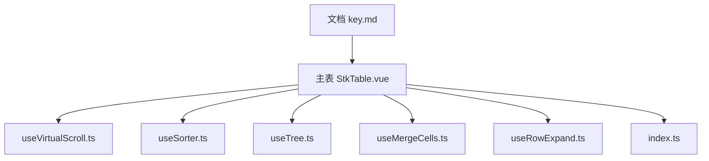
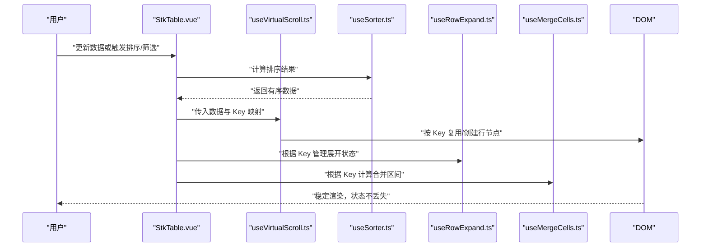
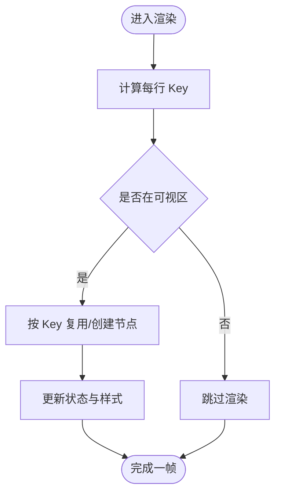
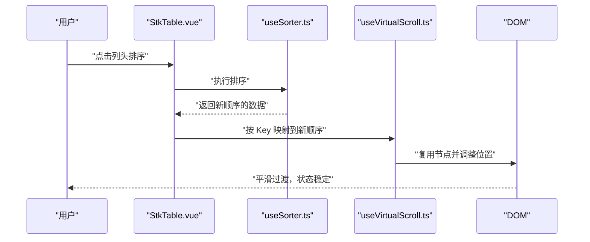
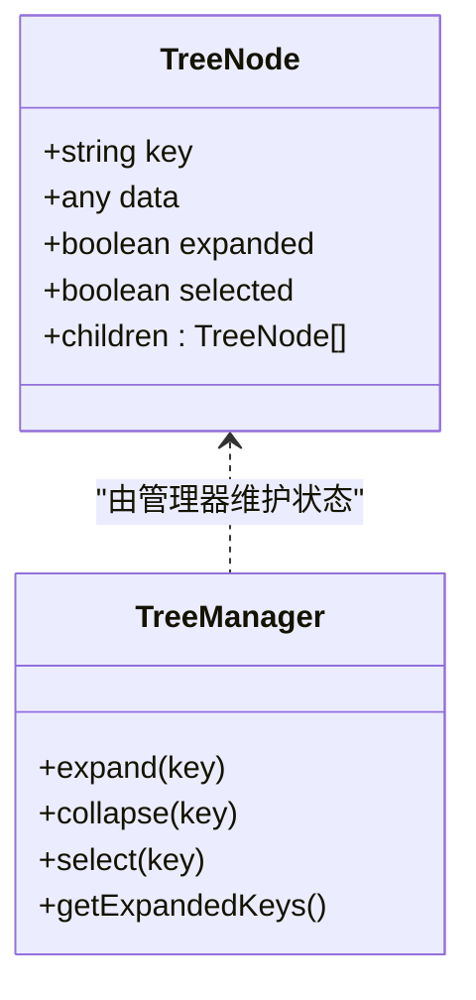
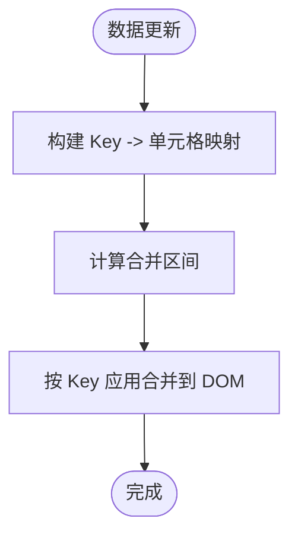
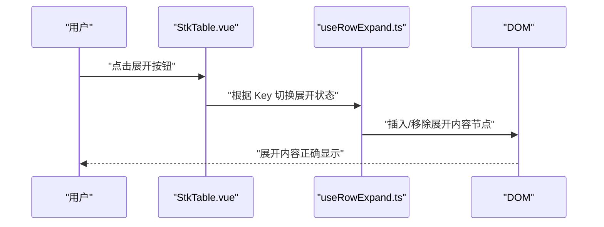
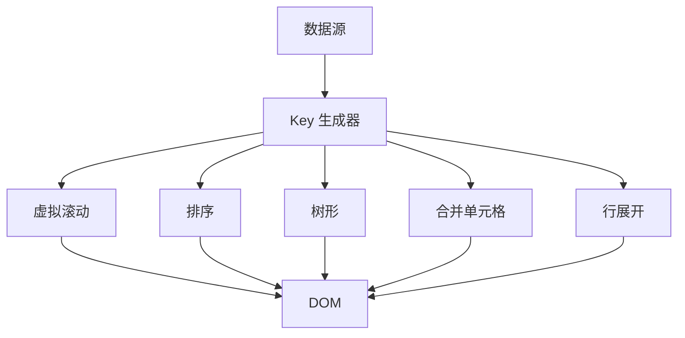
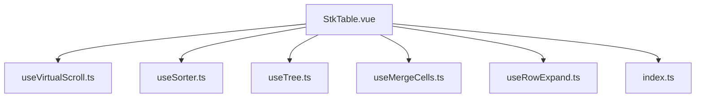

# Key 属性

<cite>
**本文引用的文件**   
- [StkTable.vue](file://src/StkTable/StkTable.vue)
- [key.md](file://docs-src/main/table/basic/key.md)
- [useVirtualScroll.ts](file://src/StkTable/useVirtualScroll.ts)
- [useSorter.ts](file://src/StkTable/useSorter.ts)
- [useTree.ts](file://src/StkTable/useTree.ts)
- [useMergeCells.ts](file://src/StkTable/useMergeCells.ts)
- [useRowExpand.ts](file://src/StkTable/useRowExpand.ts)
- [index.ts](file://src/StkTable/index.ts)
</cite>

## 目录
1. [简介](#简介)
2. [项目结构](#项目结构)
3. [核心组件](#核心组件)
4. [架构总览](#架构总览)
5. [详细组件分析](#详细组件分析)
6. [依赖关系分析](#依赖关系分析)
7. [性能考量](#性能考量)
8. [故障排查指南](#故障排查指南)
9. [结论](#结论)
10. [附录](#附录)

## 简介
Key 属性是表格在数据更新与渲染过程中的“唯一标识”。正确配置 Key 能够：
- 保证虚拟滚动、排序、筛选等场景下的 DOM 节点稳定复用，避免不必要的重建与重排
- 维持展开行、树形节点、合并单元格等复杂状态的一致性
- 提升大数据量下的渲染性能，减少闪烁与错位

本章节将系统阐述 Key 的作用机制、配置策略以及与虚拟滚动、排序、筛选、树形、合并单元格等功能的协作方式，并提供常见问题排查方法。

## 项目结构
与 Key 属性相关的实现主要分布在以下位置：
- 文档说明：docs-src/main/table/basic/key.md
- 主表组件与关键特性模块：src/StkTable/ 下各 use* 模块（虚拟滚动、排序、树形、合并单元格、行展开等）
- 入口导出：src/StkTable/index.ts

图表来源 
- [key.md](file://docs-src/main/table/basic/key.md)
- [StkTable.vue](file://src/StkTable/StkTable.vue)
- [useVirtualScroll.ts](file://src/StkTable/useVirtualScroll.ts)
- [useSorter.ts](file://src/StkTable/useSorter.ts)
- [useTree.ts](file://src/StkTable/useTree.ts)
- [useMergeCells.ts](file://src/StkTable/useMergeCells.ts)
- [useRowExpand.ts](file://src/StkTable/useRowExpand.ts)
- [index.ts](file://src/StkTable/index.ts)

章节来源
- [key.md](file://docs-src/main/table/basic/key.md)
- [StkTable.vue](file://src/StkTable/StkTable.vue)
- [index.ts](file://src/StkTable/index.ts)

## 核心组件
- 主表组件：负责接收数据、列定义与各项特性开关，并在内部协调 Key 的生成与使用
- 虚拟滚动模块：基于 Key 进行可视区域行节点的精确匹配与复用
- 排序模块：在数据顺序变化时，通过 Key 保持行实例稳定
- 树形模块：以 Key 维护节点展开/收起、选中态等状态
- 合并单元格模块：借助 Key 确保跨行列合并后的 DOM 结构与数据一致
- 行展开模块：以 Key 区分不同行的展开内容，避免状态错乱

章节来源
- [StkTable.vue](file://src/StkTable/StkTable.vue)
- [useVirtualScroll.ts](file://src/StkTable/useVirtualScroll.ts)
- [useSorter.ts](file://src/StkTable/useSorter.ts)
- [useTree.ts](file://src/StkTable/useTree.ts)
- [useMergeCells.ts](file://src/StkTable/useMergeCells.ts)
- [useRowExpand.ts](file://src/StkTable/useRowExpand.ts)

## 架构总览
Key 贯穿数据到视图的全链路：数据源变更 → Key 计算 → 列表渲染 → DOM 复用/重建 → 状态保持。下图展示 Key 在各特性中的协作流程。

图表来源 
- [StkTable.vue](file://src/StkTable/StkTable.vue)
- [useVirtualScroll.ts](file://src/StkTable/useVirtualScroll.ts)
- [useSorter.ts](file://src/StkTable/useSorter.ts)
- [useRowExpand.ts](file://src/StkTable/useRowExpand.ts)
- [useMergeCells.ts](file://src/StkTable/useMergeCells.ts)

## 详细组件分析

### Key 的作用与最佳实践
- 唯一性：Key 必须对每行数据唯一且稳定，推荐优先使用业务主键（如 id），避免使用索引或随机值
- 稳定性：数据对象引用变化但业务主键不变时，不应导致 Key 变化
- 可序列化：作为 Key 的值应可被比较和缓存（字符串或数字）
- 组合策略：当无业务主键时，可使用多字段组合（如 userId+orderId），并保证组合键全局唯一

章节来源
- [key.md](file://docs-src/main/table/basic/key.md)

### 虚拟滚动与 Key
- 作用机制：虚拟滚动仅渲染可视区内的行，Key 用于精准识别同一行在不同帧之间的身份，从而复用 DOM 节点与组件实例
- 配置要点：
  - 为每一行提供稳定的 Key
  - 避免在滚动过程中改变 Key，否则会导致频繁重建
  - 大数据量场景下，Key 的正确性直接影响滚动流畅度与内存占用

图表来源 
- [useVirtualScroll.ts](file://src/StkTable/useVirtualScroll.ts)

章节来源
- [useVirtualScroll.ts](file://src/StkTable/useVirtualScroll.ts)

### 排序与 Key
- 作用机制：排序会改变数据顺序，但不会改变 Key；通过 Key，排序后仍能将相同行映射到同一 DOM 节点，避免输入焦点丢失与动画抖动
- 配置要点：
  - 排序前后 Key 保持不变
  - 若排序字段参与 Key 计算，需确保排序不影响 Key 的唯一性与稳定性

图表来源 
- [useSorter.ts](file://src/StkTable/useSorter.ts)
- [useVirtualScroll.ts](file://src/StkTable/useVirtualScroll.ts)

章节来源
- [useSorter.ts](file://src/StkTable/useSorter.ts)

### 树形与 Key
- 作用机制：树形结构的展开/收起、选中、高亮等状态均以 Key 为维度维护
- 配置要点：
  - 每个节点必须有唯一 Key
  - 避免动态修改 Key，防止状态错乱
  - 父子关系变化时，Key 仍需保持稳定

图表来源 
- [useTree.ts](file://src/StkTable/useTree.ts)

章节来源
- [useTree.ts](file://src/StkTable/useTree.ts)

### 合并单元格与 Key
- 作用机制：合并单元格需要跨行/跨列共享同一 DOM 单元，Key 用于定位合并区间与同步更新
- 配置要点：
  - 合并区间的 Key 必须稳定且唯一
  - 数据更新时，合并逻辑应基于 Key 重新计算，避免错位

图表来源 
- [useMergeCells.ts](file://src/StkTable/useMergeCells.ts)

章节来源
- [useMergeCells.ts](file://src/StkTable/useMergeCells.ts)

### 行展开与 Key
- 作用机制：展开内容以行为单位，Key 用于区分不同行的展开状态与内容
- 配置要点：
  - 展开/收起切换不应影响 Key
  - 展开内容的更新应基于 Key 精准定位

图表来源 
- [useRowExpand.ts](file://src/StkTable/useRowExpand.ts)

章节来源
- [useRowExpand.ts](file://src/StkTable/useRowExpand.ts)

### 概念总览
Key 是连接数据与视图的桥梁，贯穿所有交互与渲染路径。无论功能多么复杂，只要 Key 稳定唯一，就能获得一致的 DOM 复用与状态保持。

[此图为概念示意，不直接对应具体源码文件]

## 依赖关系分析
Key 的使用涉及多个模块的协同，下图展示了关键依赖关系。

图表来源 
- [StkTable.vue](file://src/StkTable/StkTable.vue)
- [useVirtualScroll.ts](file://src/StkTable/useVirtualScroll.ts)
- [useSorter.ts](file://src/StkTable/useSorter.ts)
- [useTree.ts](file://src/StkTable/useTree.ts)
- [useMergeCells.ts](file://src/StkTable/useMergeCells.ts)
- [useRowExpand.ts](file://src/StkTable/useRowExpand.ts)
- [index.ts](file://src/StkTable/index.ts)

章节来源
- [StkTable.vue](file://src/StkTable/StkTable.vue)
- [index.ts](file://src/StkTable/index.ts)

## 性能考量
- 选择稳定的业务主键作为 Key，避免每次渲染都重建节点
- 在大数据量与高频交互（排序、筛选、滚动）场景下，Key 的正确性决定性能上限
- 避免在 Key 中使用对象引用或函数，尽量使用可序列化的基本类型
- 合理拆分复杂组件，减少 Key 变化带来的级联更新

[本节为通用指导，不直接分析具体文件]

## 故障排查指南
常见问题与解决思路：
- 行状态错乱（输入框内容错位、选中态异常）
  - 检查 Key 是否唯一且稳定，避免使用索引或随机数
  - 确认排序/筛选未改变 Key
- 虚拟滚动卡顿或闪烁
  - 确认 Key 在滚动过程中未发生变化
  - 检查是否存在不必要的重渲染
- 树形节点展开/收起失效
  - 校验节点 Key 的唯一性与稳定性
  - 检查父/子 Key 是否随数据变化而变化
- 合并单元格错位
  - 验证合并区间的 Key 映射是否正确
  - 数据更新后重新计算合并逻辑

章节来源
- [key.md](file://docs-src/main/table/basic/key.md)

## 结论
Key 是表格渲染与状态管理的基石。通过为每行数据提供稳定唯一的 Key，可以确保虚拟滚动、排序、筛选、树形、合并单元格、行展开等功能的正确性与高性能。建议在数据模型设计阶段就规划好 Key 策略，并在开发中严格遵循唯一性与稳定性原则。

[本节为总结性内容，不直接分析具体文件]

## 附录
- 参考文档：docs-src/main/table/basic/key.md
- 相关模块：
  - 虚拟滚动：src/StkTable/useVirtualScroll.ts
  - 排序：src/StkTable/useSorter.ts
  - 树形：src/StkTable/useTree.ts
  - 合并单元格：src/StkTable/useMergeCells.ts
  - 行展开：src/StkTable/useRowExpand.ts
  - 主表组件：src/StkTable/StkTable.vue
  - 入口导出：src/StkTable/index.ts

章节来源
- [key.md](file://docs-src/main/table/basic/key.md)
- [useVirtualScroll.ts](file://src/StkTable/useVirtualScroll.ts)
- [useSorter.ts](file://src/StkTable/useSorter.ts)
- [useTree.ts](file://src/StkTable/useTree.ts)
- [useMergeCells.ts](file://src/StkTable/useMergeCells.ts)
- [useRowExpand.ts](file://src/StkTable/useRowExpand.ts)
- [StkTable.vue](file://src/StkTable/StkTable.vue)
- [index.ts](file://src/StkTable/index.ts)