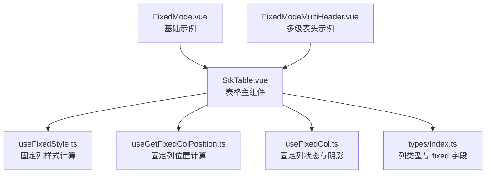
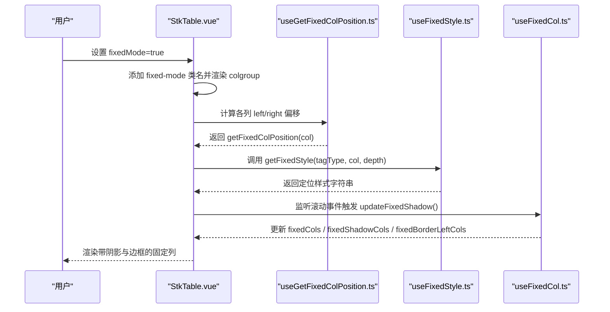
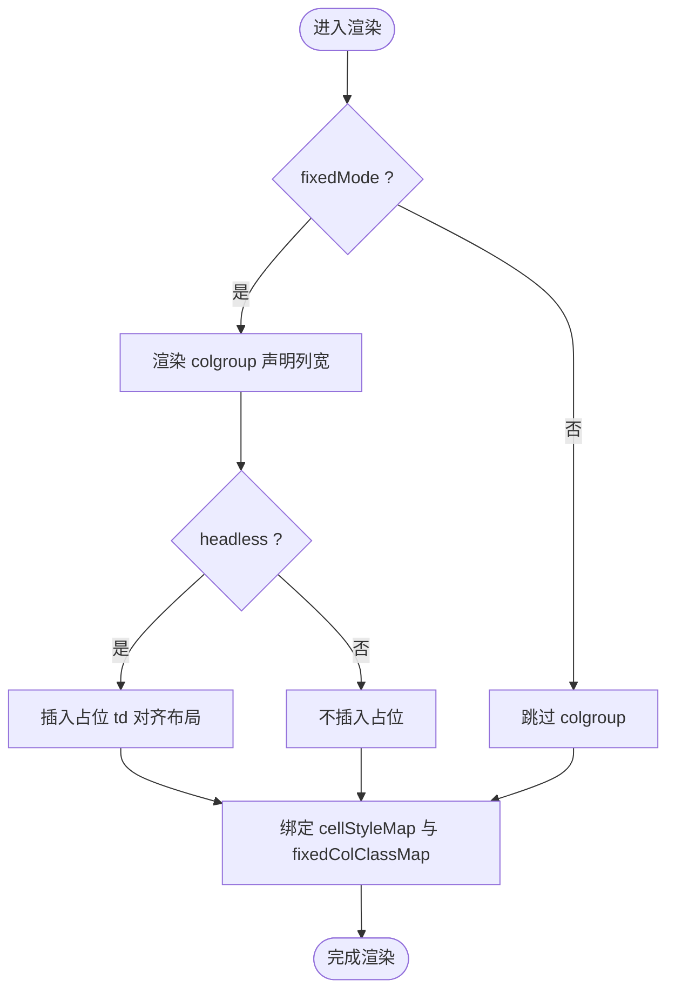
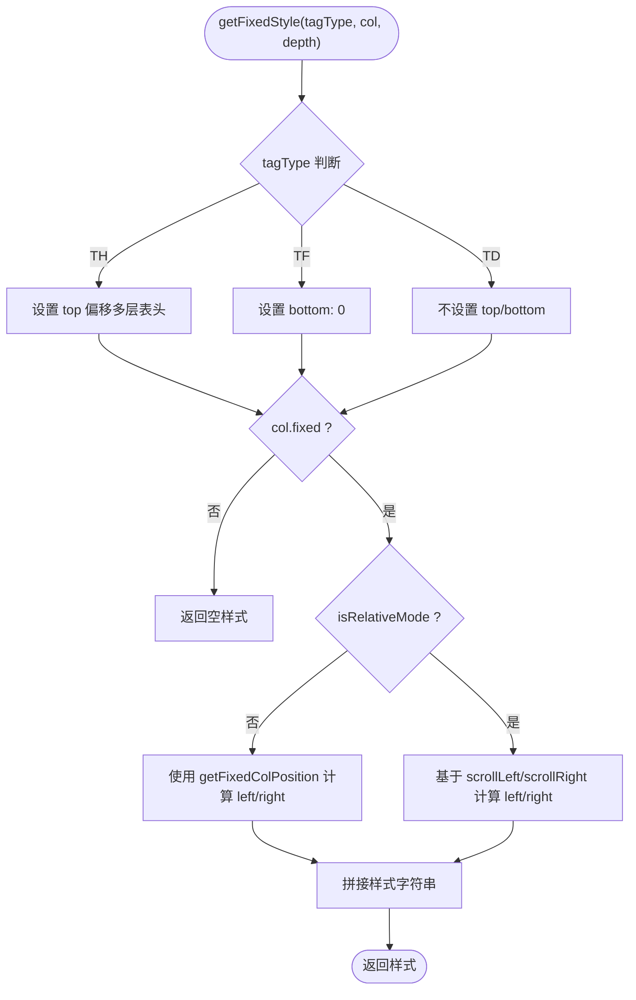
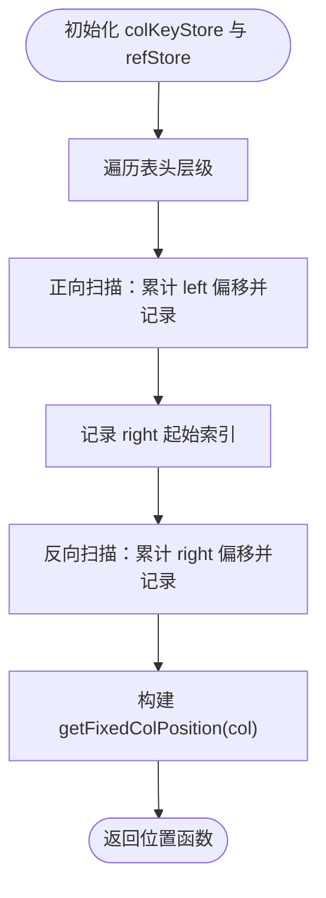
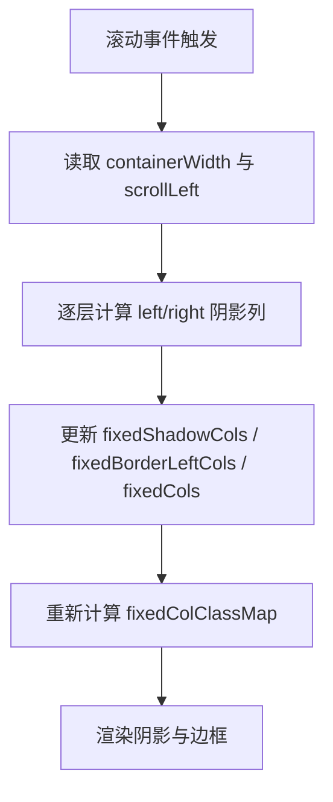
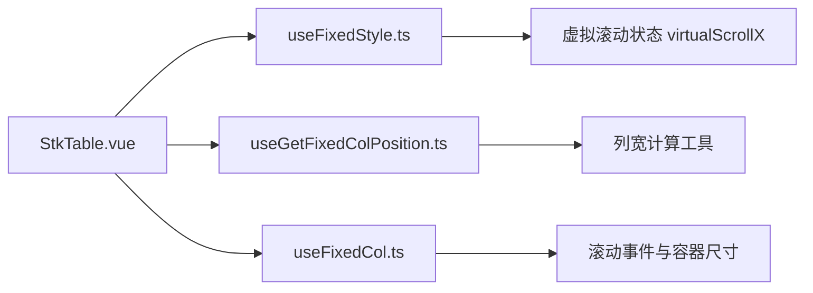

# 固定模式

<cite>
**本文引用的文件**   
- [src/StkTable/StkTable.vue](file://src/StkTable/StkTable.vue)
- [src/StkTable/useFixedCol.ts](file://src/StkTable/useFixedCol.ts)
- [src/StkTable/useFixedStyle.ts](file://src/StkTable/useFixedStyle.ts)
- [src/StkTable/useGetFixedColPosition.ts](file://src/StkTable/useGetFixedColPosition.ts)
- [src/StkTable/types/index.ts](file://src/StkTable/types/index.ts)
- [docs-demo/basic/fixed-mode/FixedMode.vue](file://docs-demo/basic/fixed-mode/FixedMode.vue)
- [docs-demo/basic/fixed-mode/FixedModeMultiHeader.vue](file://docs-demo/basic/fixed-mode/FixedModeMultiHeader.vue)
- [docs-src/main/table/basic/fixed-mode.md](file://docs-src/main/table/basic/fixed-mode.md)
</cite>

## 目录
1. [简介](#简介)
2. [项目结构](#项目结构)
3. [核心组件](#核心组件)
4. [架构总览](#架构总览)
5. [详细组件分析](#详细组件分析)
6. [依赖分析](#依赖分析)
7. [性能考虑](#性能考虑)
8. [故障排查指南](#故障排查指南)
9. [结论](#结论)
10. [附录](#附录)

## 简介
本文件围绕 stk-table-vue 的“固定模式”（fixed mode）进行系统化文档化，涵盖其设计目标、实现原理、关键数据流与样式计算、以及与虚拟滚动和阴影效果的协同机制。该模式通过启用 table-layout: fixed，使列宽行为更符合“一列固定、其余平分”的预期，同时为多级表头提供一致的宽度表现。

## 项目结构
固定模式相关代码主要分布在以下位置：
- 主组件渲染与属性控制：StkTable.vue
- 固定列样式计算：useFixedStyle.ts
- 固定列位置计算：useGetFixedColPosition.ts
- 固定列状态与阴影控制：useFixedCol.ts
- 类型定义（含列配置 fixed 字段等）：types/index.ts
- 示例与文档：docs-demo/basic/fixed-mode/* 与 docs-src/main/table/basic/fixed-mode.md

**图表来源** 
- [src/StkTable/StkTable.vue](file://src/StkTable/StkTable.vue)
- [src/StkTable/useFixedStyle.ts](file://src/StkTable/useFixedStyle.ts)
- [src/StkTable/useGetFixedColPosition.ts](file://src/StkTable/useGetFixedColPosition.ts)
- [src/StkTable/useFixedCol.ts](file://src/StkTable/useFixedCol.ts)
- [src/StkTable/types/index.ts](file://src/StkTable/types/index.ts)
- [docs-demo/basic/fixed-mode/FixedMode.vue](file://docs-demo/basic/fixed-mode/FixedMode.vue)
- [docs-demo/basic/fixed-mode/FixedModeMultiHeader.vue](file://docs-demo/basic/fixed-mode/FixedModeMultiHeader.vue)

**章节来源**
- [src/StkTable/StkTable.vue](file://src/StkTable/StkTable.vue)
- [docs-src/main/table/basic/fixed-mode.md](file://docs-src/main/table/basic/fixed-mode.md)

## 核心组件
- StkTable.vue：负责在启用 fixedMode 时设置表格 class 并渲染 colgroup，确保子列 width 生效；同时在 headless + fixedMode 场景下处理占位行以对齐布局。
- useFixedStyle.ts：根据 tagType（th/td/tf）、是否相对模式、以及虚拟滚动状态，生成固定列的 left/right/top/bottom 样式。
- useGetFixedColPosition.ts：遍历表头层级，计算每列距离左侧或右侧的偏移量，支持 key 与对象引用两种标识方式。
- useFixedCol.ts：维护固定列集合、阴影列集合、需要绘制左边框的右固定列集合，并在滚动时更新这些状态。

**章节来源**
- [src/StkTable/StkTable.vue](file://src/StkTable/StkTable.vue)
- [src/StkTable/useFixedStyle.ts](file://src/StkTable/useFixedStyle.ts)
- [src/StkTable/useGetFixedColPosition.ts](file://src/StkTable/useGetFixedColPosition.ts)
- [src/StkTable/useFixedCol.ts](file://src/StkTable/useFixedCol.ts)

## 架构总览
固定模式的核心流程如下：
- 当 props.fixedMode 为真时，StkTable 将表格类名设置为 fixed-mode，并渲染 colgroup 来声明叶子列宽度。
- useGetFixedColPosition 预先计算各列的 left/right 偏移，供样式计算使用。
- useFixedStyle 根据当前滚动位置与相对模式，输出最终的定位样式。
- useFixedCol 在滚动事件中更新阴影与边框需求，驱动 classMap 变化，从而渲染阴影与左边框。

**图表来源** 
- [src/StkTable/StkTable.vue](file://src/StkTable/StkTable.vue)
- [src/StkTable/useGetFixedColPosition.ts](file://src/StkTable/useGetFixedColPosition.ts)
- [src/StkTable/useFixedStyle.ts](file://src/StkTable/useFixedStyle.ts)
- [src/StkTable/useFixedCol.ts](file://src/StkTable/useFixedCol.ts)

## 详细组件分析

### StkTable.vue（固定模式渲染与控制）
- 在启用 fixedMode 时为表格添加 fixed-mode 类名，用于 CSS 层控制。
- 在 fixedMode 且未启用横向虚拟滚动时，渲染 colgroup 并为每个叶子列声明 width，保证多级表头的子列宽度生效。
- 在 headless + fixedMode 场景下，为 padding-top tr 插入占位 td，保持与虚拟滚动列对齐。
- 通过 cellStyleMap 与 fixedColClassMap 将样式与 class 绑定到 th/td/tf 节点。

**图表来源** 
- [src/StkTable/StkTable.vue](file://src/StkTable/StkTable.vue)

**章节来源**
- [src/StkTable/StkTable.vue](file://src/StkTable/StkTable.vue)

### useFixedStyle.ts（固定列样式计算）
- 根据 tagType（TH/TD/TF）与 fixed 方向（left/right），结合 isRelativeMode 与虚拟滚动状态，生成定位样式。
- 非相对模式下，使用 getFixedColPosition 计算的偏移值；相对模式下，基于 scrollLeft/scrollRight 动态计算。
- TH 层支持 top 偏移（多层表头），TF 层设置 bottom: 0。

**图表来源** 
- [src/StkTable/useFixedStyle.ts](file://src/StkTable/useFixedStyle.ts)

**章节来源**
- [src/StkTable/useFixedStyle.ts](file://src/StkTable/useFixedStyle.ts)

### useGetFixedColPosition.ts（固定列位置计算）
- 遍历每一层表头，分别正向与反向扫描，累计 fixed:left 与 fixed:right 的列宽，得到每列距离左/右的偏移。
- 支持两种标识：key 与对象引用（WeakMap），兼容无 key 的多级表头列。

**图表来源** 
- [src/StkTable/useGetFixedColPosition.ts](file://src/StkTable/useGetFixedColPosition.ts)

**章节来源**
- [src/StkTable/useGetFixedColPosition.ts](file://src/StkTable/useGetFixedColPosition.ts)

### useFixedCol.ts（固定列状态与阴影）
- 维护三个状态：fixedCols（正在固定的列）、fixedShadowCols（需要显示阴影的列）、fixedBorderLeftCols（右固定列中需绘制左边框的列）。
- updateFixedShadow 在滚动事件中根据容器宽度与 scrollLeft 计算哪些列需要阴影与边框，并更新 classMap。
- 对最右侧连续 fixed:right 列做特殊处理，避免依赖中间列声明宽度导致的失真。

**图表来源** 
- [src/StkTable/useFixedCol.ts](file://src/StkTable/useFixedCol.ts)

**章节来源**
- [src/StkTable/useFixedCol.ts](file://src/StkTable/useFixedCol.ts)

### types/index.ts（列类型与 fixed 字段）
- StkTableColumn 定义包含 fixed?: 'left' | 'right' | null，用于指定列的固定方向。
- PrivateStkTableColumn 扩展了内部计算所需的字段（如 __W__、__LF_S__、__LF_E__ 等），支撑多级表头与虚拟滚动。

**章节来源**
- [src/StkTable/types/index.ts](file://src/StkTable/types/index.ts)

### 示例与文档
- FixedMode.vue：演示 fixedMode 与 headless 组合使用，展示百分比宽度下的列宽行为。
- FixedModeMultiHeader.vue：演示多级表头下子列 width 生效与父列宽度为子列之和的行为。
- fixed-mode.md：官方文档说明 fixedMode 的作用与限制（仅生效列 width）。

**章节来源**
- [docs-demo/basic/fixed-mode/FixedMode.vue](file://docs-demo/basic/fixed-mode/FixedMode.vue)
- [docs-demo/basic/fixed-mode/FixedModeMultiHeader.vue](file://docs-demo/basic/fixed-mode/FixedModeMultiHeader.vue)
- [docs-src/main/table/basic/fixed-mode.md](file://docs-src/main/table/basic/fixed-mode.md)

## 依赖分析
固定模式的依赖关系如下：
- StkTable.vue 依赖 useFixedStyle、useGetFixedColPosition、useFixedCol 提供的计算结果与状态。
- useFixedStyle 依赖虚拟滚动状态（virtualScrollX）与 isRelativeMode。
- useGetFixedColPosition 依赖表头层级结构与列宽计算工具。
- useFixedCol 依赖滚动事件与容器尺寸信息，并驱动 classMap 更新。

**图表来源** 
- [src/StkTable/StkTable.vue](file://src/StkTable/StkTable.vue)
- [src/StkTable/useFixedStyle.ts](file://src/StkTable/useFixedStyle.ts)
- [src/StkTable/useGetFixedColPosition.ts](file://src/StkTable/useGetFixedColPosition.ts)
- [src/StkTable/useFixedCol.ts](file://src/StkTable/useFixedCol.ts)

**章节来源**
- [src/StkTable/StkTable.vue](file://src/StkTable/StkTable.vue)
- [src/StkTable/useFixedStyle.ts](file://src/StkTable/useFixedStyle.ts)
- [src/StkTable/useGetFixedColPosition.ts](file://src/StkTable/useGetFixedColPosition.ts)
- [src/StkTable/useFixedCol.ts](file://src/StkTable/useFixedCol.ts)

## 性能考虑
- 列宽计算与位置缓存：useGetFixedColPosition 使用 Map/WeakMap 缓存列偏移，减少重复计算。
- 滚动事件节流：建议在 updateFixedShadow 中加入节流或防抖策略，避免频繁重排。
- 阴影与边框最小化：仅在必要时更新 fixedShadowCols 与 fixedBorderLeftCols，降低 classMap 变更频率。
- 多级表头优化：避免对非叶子列重复计算宽度，优先使用已计算的叶子列宽度。

[本节为通用指导，无需特定文件引用]

## 故障排查指南
- 列宽不一致：检查是否在 fixedMode 下正确设置了列 width；多级表头需确保子列 width 有效。
- 阴影缺失：确认 fixedColShadow 属性开启，并确保滚动事件能触发 updateFixedShadow。
- 右边框错位：检查 rightSuffixStart 逻辑是否正确识别最右侧连续 fixed:right 列。
- 虚拟滚动冲突：在 virtualX_on 情况下，注意 offsetLeft 与 virtualX_offsetRight 的影响。

**章节来源**
- [src/StkTable/useFixedCol.ts](file://src/StkTable/useFixedCol.ts)
- [src/StkTable/useFixedStyle.ts](file://src/StkTable/useFixedStyle.ts)

## 结论
固定模式通过 table-layout: fixed 与精确的列宽声明，实现了稳定的列宽行为与多级表头一致性。配合 useFixedStyle、useGetFixedColPosition 与 useFixedCol，系统在滚动、阴影与边框方面提供了完善的视觉反馈。合理配置与性能优化可进一步提升用户体验。

[本节为总结性内容，无需特定文件引用]

## 附录
- 相关 API 与属性：
  - fixedMode：启用 table-layout: fixed 模式
  - fixedColShadow：启用固定列阴影效果
  - columns[].fixed：指定列固定方向（left/right）
  - columns[].width：在 fixedMode 下生效的列宽属性

**章节来源**
- [docs-src/main/table/basic/fixed-mode.md](file://docs-src/main/table/basic/fixed-mode.md)
- [src/StkTable/types/index.ts](file://src/StkTable/types/index.ts)