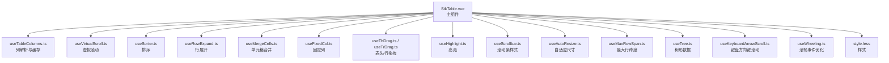
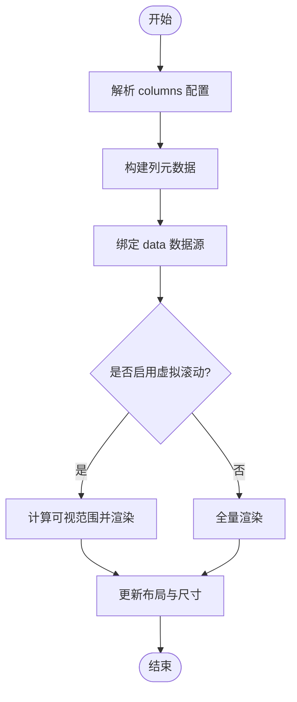
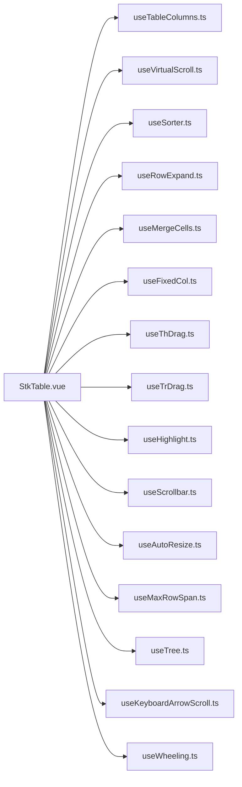

# 基础功能

<cite>
**本文引用的文件**   
- [StkTable.vue](file://src/StkTable/StkTable.vue)
- [index.ts](file://src/StkTable/index.ts)
- [const.ts](file://src/StkTable/const.ts)
- [useTableColumns.ts](file://src/StkTable/useTableColumns.ts)
- [useVirtualScroll.ts](file://src/StkTable/useVirtualScroll.ts)
- [useSorter.ts](file://src/StkTable/useSorter.ts)
- [useRowExpand.ts](file://src/StkTable/useRowExpand.ts)
- [useMergeCells.ts](file://src/StkTable/useMergeCells.ts)
- [useFixedCol.ts](file://src/StkTable/useFixedCol.ts)
- [useThDrag.ts](file://src/StkTable/useThDrag.ts)
- [useTrDrag.ts](file://src/StkTable/useTrDrag.ts)
- [useHighlight.ts](file://src/StkTable/useHighlight.ts)
- [useScrollbar.ts](file://src/StkTable/useScrollbar.ts)
- [useAutoResize.ts](file://src/StkTable/useAutoResize.ts)
- [useMaxRowSpan.ts](file://src/StkTable/useMaxRowSpan.ts)
- [useTree.ts](file://src/StkTable/useTree.ts)
- [useKeyboardArrowScroll.ts](file://src/StkTable/useKeyboardArrowScroll.ts)
- [useWheeling.ts](file://src/StkTable/useWheeling.ts)
- [style.less](file://src/StkTable/style.less)
- [Basic.vue](file://docs-demo/basic/Basic.vue)
- [Align.vue](file://docs-demo/basic/align/Align.vue)
- [Default.vue](file://docs-demo/basic/border/Default.vue)
- [Checkbox.vue](file://docs-demo/basic/checkbox/Checkbox.vue)
- [ColumnWidth.vue](file://docs-demo/basic/column-width/ColumnWidth.vue)
- [Empty.vue](file://docs-demo/basic/empty/Default.vue)
- [ExpandRow.vue](file://docs-demo/basic/expand-row/ExpandRow.vue)
- [Fixed.vue](file://docs-demo/basic/fixed/Fixed.vue)
- [Footer.vue](file://docs-demo/basic/footer/Footer.vue)
- [Headless.vue](file://docs-demo/basic/headless/Headless.vue)
- [MergeCellsRow.vue](file://docs-demo/basic/merge-cells/MergeCellsRow.vue)
- [MultiHeader.vue](file://docs-demo/basic/multi-header/MultiHeader.vue)
- [Overflow.vue](file://docs-demo/basic/overflow/Overflow.vue)
- [RowHeight.vue](file://docs-demo/basic/row-height/RowHeight.vue)
- [ScrollRowByRow.vue](file://docs-demo/basic/scroll-row-by-row/ScrollRowByRow.vue)
- [ScrollbarStyle.vue](file://docs-demo/basic/scrollbar-style/ScrollbarStyle.vue)
- [Seq.vue](file://docs-demo/basic/seq/Seq.vue)
- [Size.vue](file://docs-demo/basic/size/Default.vue)
- [Sort.vue](file://docs-demo/basic/sort/Sort.vue)
- [Stripe.vue](file://docs-demo/basic/stripe/Stripe.vue)
- [Theme.vue](file://docs-demo/basic/theme/CssVarsDemo.vue)
- [Tree.vue](file://docs-demo/basic/tree/Tree.vue)
</cite>

## 目录
1. [简介](#简介)
2. [项目结构](#项目结构)
3. [核心组件与概念](#核心组件与概念)
4. [架构总览](#架构总览)
5. [详细组件分析](#详细组件分析)
6. [依赖关系分析](#依赖关系分析)
7. [性能考量](#性能考量)
8. [故障排查指南](#故障排查指南)
9. [结论](#结论)
10. [附录：渐进式示例与最佳实践](#附录渐进式示例与最佳实践)

## 简介
本章节面向 stk-table-vue 的基础能力，聚焦表格的核心概念与常用特性：列定义、数据绑定、渲染机制、对齐方式、边框样式、复选框选择、行高设置、斑马纹效果等。文档同时解释组件的生命周期与响应式更新机制，并提供从简单到复杂的渐进式示例，帮助开发者快速上手并掌握表格的基本用法。

## 项目结构
stk-table-vue 采用“主组件 + 组合式 Hook”的架构组织方式。核心表格组件位于 src/StkTable 目录下，通过多个 useXxx.ts 组合式函数实现各项能力（如虚拟滚动、排序、展开、合并、固定列、拖拽、高亮、滚动条、自适应尺寸、树形、键盘导航、滚轮优化等）。样式集中在 style.less 中，演示用例位于 docs-demo/basic 下，便于对照学习。

图表来源
- [StkTable.vue](file://src/StkTable/StkTable.vue)
- [useTableColumns.ts](file://src/StkTable/useTableColumns.ts)
- [useVirtualScroll.ts](file://src/StkTable/useVirtualScroll.ts)
- [useSorter.ts](file://src/StkTable/useSorter.ts)
- [useRowExpand.ts](file://src/StkTable/useRowExpand.ts)
- [useMergeCells.ts](file://src/StkTable/useMergeCells.ts)
- [useFixedCol.ts](file://src/StkTable/useFixedCol.ts)
- [useThDrag.ts](file://src/StkTable/useThDrag.ts)
- [useTrDrag.ts](file://src/StkTable/useTrDrag.ts)
- [useHighlight.ts](file://src/StkTable/useHighlight.ts)
- [useScrollbar.ts](file://src/StkTable/useScrollbar.ts)
- [useAutoResize.ts](file://src/StkTable/useAutoResize.ts)
- [useMaxRowSpan.ts](file://src/StkTable/useMaxRowSpan.ts)
- [useTree.ts](file://src/StkTable/useTree.ts)
- [useKeyboardArrowScroll.ts](file://src/StkTable/useKeyboardArrowScroll.ts)
- [useWheeling.ts](file://src/StkTable/useWheeling.ts)
- [style.less](file://src/StkTable/style.less)

章节来源
- [StkTable.vue](file://src/StkTable/StkTable.vue)
- [index.ts](file://src/StkTable/index.ts)
- [const.ts](file://src/StkTable/const.ts)

## 核心组件与概念
- 列定义
  - 通过 columns 配置项声明列，支持标题、字段映射、宽度、对齐、排序、过滤、自定义渲染等。
  - 列解析与缓存由 useTableColumns 负责，确保列配置变更时高效重算。
- 数据绑定
  - 数据源通过 data 传入，内部维护可见行索引、选中状态、展开状态等。
  - 响应式更新基于 Vue 的响应式系统，数据变化触发局部重渲染与必要的布局计算。
- 基本渲染机制
  - 默认渲染为表格 DOM 结构；可选启用虚拟滚动以优化大数据量场景。
  - 行高、斑马纹、边框、对齐等样式通过 CSS 变量与类名控制。
- 生命周期与响应式
  - 初始化阶段：解析列、计算尺寸、建立虚拟滚动视图。
  - 运行时：监听 data、columns、options 等响应式变化，按需更新视图与布局。
  - 销毁阶段：清理事件监听、定时器、虚拟滚动状态等。

章节来源
- [useTableColumns.ts](file://src/StkTable/useTableColumns.ts)
- [useVirtualScroll.ts](file://src/StkTable/useVirtualScroll.ts)
- [StkTable.vue](file://src/StkTable/StkTable.vue)

## 架构总览
下图展示了 StkTable 主组件与各组合式 Hook 的交互关系，以及它们如何协同完成列解析、数据渲染、交互与样式控制。

```mermaid
classDiagram
class StkTable {
+props : "data, columns, options"
+methods : "renderRows(), updateLayout()"
+lifecycle : "onMounted(), onUpdated(), onUnmounted()"
}
class UseTableColumns {
+parseColumns()
+cacheColumns()
+recomputeOnPropsChange()
}
class UseVirtualScroll {
+initViewPort()
+updateVisibleRange()
+handleScroll()
}
class UseSorter {
+sortData()
+applySortState()
}
class UseRowExpand {
+toggleRow()
+getExpandedKeys()
}
class UseMergeCells {
+computeMerges()
+applyToRender()
}
class UseFixedCol {
+calcPositions()
+syncScroll()
}
class UseThDrag {
+startResize()
+onMove()
+endResize()
}
class UseTrDrag {
+startDrag()
+onDrop()
}
class UseHighlight {
+markRows()
+clearMarks()
}
class UseScrollbar {
+styleScrollbar()
}
class UseAutoResize {
+observeResize()
+recalcLayout()
}
class UseMaxRowSpan {
+computeMaxSpan()
}
class UseTree {
+buildTree()
+toggleNode()
}
class UseKeyboardArrowScroll {
+handleKeydown()
}
class UseWheeling {
+throttleWheel()
}
StkTable --> UseTableColumns : "使用"
StkTable --> UseVirtualScroll : "使用"
StkTable --> UseSorter : "使用"
StkTable --> UseRowExpand : "使用"
StkTable --> UseMergeCells : "使用"
StkTable --> UseFixedCol : "使用"
StkTable --> UseThDrag : "使用"
StkTable --> UseTrDrag : "使用"
StkTable --> UseHighlight : "使用"
StkTable --> UseScrollbar : "使用"
StkTable --> UseAutoResize : "使用"
StkTable --> UseMaxRowSpan : "使用"
StkTable --> UseTree : "使用"
StkTable --> UseKeyboardArrowScroll : "使用"
StkTable --> UseWheeling : "使用"
```

图表来源
- [StkTable.vue](file://src/StkTable/StkTable.vue)
- [useTableColumns.ts](file://src/StkTable/useTableColumns.ts)
- [useVirtualScroll.ts](file://src/StkTable/useVirtualScroll.ts)
- [useSorter.ts](file://src/StkTable/useSorter.ts)
- [useRowExpand.ts](file://src/StkTable/useRowExpand.ts)
- [useMergeCells.ts](file://src/StkTable/useMergeCells.ts)
- [useFixedCol.ts](file://src/StkTable/useFixedCol.ts)
- [useThDrag.ts](file://src/StkTable/useThDrag.ts)
- [useTrDrag.ts](file://src/StkTable/useTrDrag.ts)
- [useHighlight.ts](file://src/StkTable/useHighlight.ts)
- [useScrollbar.ts](file://src/StkTable/useScrollbar.ts)
- [useAutoResize.ts](file://src/StkTable/useAutoResize.ts)
- [useMaxRowSpan.ts](file://src/StkTable/useMaxRowSpan.ts)
- [useTree.ts](file://src/StkTable/useTree.ts)
- [useKeyboardArrowScroll.ts](file://src/StkTable/useKeyboardArrowScroll.ts)
- [useWheeling.ts](file://src/StkTable/useWheeling.ts)

## 详细组件分析

### 列定义与数据绑定
- 列定义
  - 通过 columns 数组描述列，包含标题、字段、宽度、对齐、排序、过滤、自定义渲染等属性。
  - useTableColumns 负责解析列配置、生成列元数据、处理多级表头与叶子列识别。
- 数据绑定
  - data 作为表格的数据源，内部维护可见行集合、选中状态、展开状态等。
  - 响应式更新：当 data 或 columns 变化时，触发列解析与渲染范围更新。
- 渲染机制
  - 默认渲染完整 DOM；可开启虚拟滚动仅渲染可视区域以提升性能。
  - 行高与斑马纹通过 CSS 控制，支持动态调整。

图表来源
- [useTableColumns.ts](file://src/StkTable/useTableColumns.ts)
- [useVirtualScroll.ts](file://src/StkTable/useVirtualScroll.ts)
- [StkTable.vue](file://src/StkTable/StkTable.vue)

章节来源
- [useTableColumns.ts](file://src/StkTable/useTableColumns.ts)
- [StkTable.vue](file://src/StkTable/StkTable.vue)

### 对齐方式
- 说明：列内容支持左、中、右对齐，可通过列配置或全局选项统一设置。
- API 要点：
  - 列级 align 属性：控制单列文本对齐。
  - 全局对齐：通过 options 或主题变量统一设置。
- 示例参考：
  - [Align.vue](file://docs-demo/basic/align/Align.vue)

章节来源
- [Align.vue](file://docs-demo/basic/align/Align.vue)
- [StkTable.vue](file://src/StkTable/StkTable.vue)

### 边框样式
- 说明：表格边框样式支持内边距、外边框、单元格分隔线等。
- API 要点：
  - border 相关属性：控制边框显示与样式。
  - 主题变量：通过 CSS 变量覆盖默认边框颜色与粗细。
- 示例参考：
  - [Default.vue](file://docs-demo/basic/border/Default.vue)

章节来源
- [Default.vue](file://docs-demo/basic/border/Default.vue)
- [style.less](file://src/StkTable/style.less)

### 复选框选择
- 说明：支持行级复选框选择，可多选、全选、单选模式。
- API 要点：
  - checkbox 列：在 columns 中声明复选框列。
  - 选中状态：通过 selectedKeys 或回调事件同步。
- 示例参考：
  - [Checkbox.vue](file://docs-demo/basic/checkbox/Checkbox.vue)

章节来源
- [Checkbox.vue](file://docs-demo/basic/checkbox/Checkbox.vue)
- [StkTable.vue](file://src/StkTable/StkTable.vue)

### 行高设置
- 说明：支持固定行高与自动行高两种模式。
- API 要点：
  - rowHeight：设置固定行高。
  - autoHeight：根据内容自适应高度。
- 示例参考：
  - [RowHeight.vue](file://docs-demo/basic/row-height/RowHeight.vue)

章节来源
- [RowHeight.vue](file://docs-demo/basic/row-height/RowHeight.vue)
- [StkTable.vue](file://src/StkTable/StkTable.vue)

### 斑马纹效果
- 说明：交替行背景色提升可读性。
- API 要点：
  - stripe：启用斑马纹。
  - 样式覆盖：通过 CSS 变量定制交替色。
- 示例参考：
  - [Stripe.vue](file://docs-demo/basic/stripe/Stripe.vue)

章节来源
- [Stripe.vue](file://docs-demo/basic/stripe/Stripe.vue)
- [style.less](file://src/StkTable/style.less)

### 列宽与表格宽度
- 说明：支持列宽固定、百分比、自适应填充。
- API 要点：
  - column.width：设置列宽。
  - tableWidth：设置表格整体宽度策略。
- 示例参考：
  - [ColumnWidth.vue](file://docs-demo/basic/column-width/ColumnWidth.vue)

章节来源
- [ColumnWidth.vue](file://docs-demo/basic/column-width/ColumnWidth.vue)
- [useTableColumns.ts](file://src/StkTable/useTableColumns.ts)

### 空数据展示
- 说明：当 data 为空时展示占位内容。
- API 要点：
  - emptyText：自定义空数据文案。
  - 插槽：自定义空数据区域内容。
- 示例参考：
  - [Empty.vue](file://docs-demo/basic/empty/Default.vue)

章节来源
- [Empty.vue](file://docs-demo/basic/empty/Default.vue)
- [StkTable.vue](file://src/StkTable/StkTable.vue)

### 行展开
- 说明：支持行级展开折叠，用于展示详细信息。
- API 要点：
  - expandable：启用行展开。
  - expandedKeys：控制展开的行键集合。
- 示例参考：
  - [ExpandRow.vue](file://docs-demo/basic/expand-row/ExpandRow.vue)

章节来源
- [ExpandRow.vue](file://docs-demo/basic/expand-row/ExpandRow.vue)
- [useRowExpand.ts](file://src/StkTable/useRowExpand.ts)

### 固定列
- 说明：支持左右固定列，横向滚动时保持固定。
- API 要点：
  - fixed：列级固定标识。
  - syncScroll：同步滚动位置。
- 示例参考：
  - [Fixed.vue](file://docs-demo/basic/fixed/Fixed.vue)

章节来源
- [Fixed.vue](file://docs-demo/basic/fixed/Fixed.vue)
- [useFixedCol.ts](file://src/StkTable/useFixedCol.ts)

### 底部与多表头
- 说明：支持底部汇总行与多级表头。
- API 要点：
  - footer：底部行数据与渲染。
  - multiHeader：多级表头配置。
- 示例参考：
  - [Footer.vue](file://docs-demo/basic/footer/Footer.vue)
  - [MultiHeader.vue](file://docs-demo/basic/multi-header/MultiHeader.vue)

章节来源
- [Footer.vue](file://docs-demo/basic/footer/Footer.vue)
- [MultiHeader.vue](file://docs-demo/basic/multi-header/MultiHeader.vue)
- [StkTable.vue](file://src/StkTable/StkTable.vue)

### 无头模式
- 说明：隐藏表头，仅渲染数据行，适用于自定义头部场景。
- API 要点：
  - headless：启用无头模式。
- 示例参考：
  - [Headless.vue](file://docs-demo/basic/headless/Headless.vue)

章节来源
- [Headless.vue](file://docs-demo/basic/headless/Headless.vue)
- [StkTable.vue](file://src/StkTable/StkTable.vue)

### 单元格合并
- 说明：支持行列合并，常用于报表场景。
- API 要点：
  - mergeCells：合并规则配置。
  - computeMerges：计算合并区间。
- 示例参考：
  - [MergeCellsRow.vue](file://docs-demo/basic/merge-cells/MergeCellsRow.vue)

章节来源
- [MergeCellsRow.vue](file://docs-demo/basic/merge-cells/MergeCellsRow.vue)
- [useMergeCells.ts](file://src/StkTable/useMergeCells.ts)

### 溢出处理
- 说明：单元格内容溢出时的显示策略（截断、省略、换行等）。
- API 要点：
  - overflow：列级溢出策略。
- 示例参考：
  - [Overflow.vue](file://docs-demo/basic/overflow/Overflow.vue)

章节来源
- [Overflow.vue](file://docs-demo/basic/overflow/Overflow.vue)
- [StkTable.vue](file://src/StkTable/StkTable.vue)

### 逐行滚动
- 说明：支持按行步进滚动，提升交互体验。
- API 要点：
  - scrollRowByRow：启用逐行滚动。
- 示例参考：
  - [ScrollRowByRow.vue](file://docs-demo/basic/scroll-row-by-row/ScrollRowByRow.vue)

章节来源
- [ScrollRowByRow.vue](file://docs-demo/basic/scroll-row-by-row/ScrollRowByRow.vue)
- [useKeyboardArrowScroll.ts](file://src/StkTable/useKeyboardArrowScroll.ts)

### 滚动条样式
- 说明：自定义滚动条外观与行为。
- API 要点：
  - scrollbar：滚动条样式配置。
- 示例参考：
  - [ScrollbarStyle.vue](file://docs-demo/basic/scrollbar-style/ScrollbarStyle.vue)

章节来源
- [ScrollbarStyle.vue](file://docs-demo/basic/scrollbar-style/ScrollbarStyle.vue)
- [useScrollbar.ts](file://src/StkTable/useScrollbar.ts)

### 序号列
- 说明：自动生成序号列，支持起始索引设置。
- API 要点：
  - seq：启用序号列与起始值。
- 示例参考：
  - [Seq.vue](file://docs-demo/basic/seq/Seq.vue)

章节来源
- [Seq.vue](file://docs-demo/basic/seq/Seq.vue)
- [StkTable.vue](file://src/StkTable/StkTable.vue)

### 尺寸与布局
- 说明：表格尺寸与布局策略，包括默认与弹性布局。
- API 要点：
  - size：尺寸预设。
  - flex：弹性布局开关。
- 示例参考：
  - [Size.vue](file://docs-demo/basic/size/Default.vue)

章节来源
- [Size.vue](file://docs-demo/basic/size/Default.vue)
- [useAutoResize.ts](file://src/StkTable/useAutoResize.ts)

### 排序
- 说明：支持单列排序、多列排序、远程排序。
- API 要点：
  - sortable：列级排序开关。
  - sortState：排序状态管理。
- 示例参考：
  - [Sort.vue](file://docs-demo/basic/sort/Sort.vue)

章节来源
- [Sort.vue](file://docs-demo/basic/sort/Sort.vue)
- [useSorter.ts](file://src/StkTable/useSorter.ts)

### 主题与 CSS 变量
- 说明：通过 CSS 变量定制主题，包括颜色、间距、边框等。
- API 要点：
  - theme：主题变量覆盖。
- 示例参考：
  - [Theme.vue](file://docs-demo/basic/theme/CssVarsDemo.vue)

章节来源
- [Theme.vue](file://docs-demo/basic/theme/CssVarsDemo.vue)
- [style.less](file://src/StkTable/style.less)

### 树形数据
- 说明：支持树形数据结构，含展开/折叠、层级缩进。
- API 要点：
  - tree：树形配置。
  - toggleNode：节点展开/折叠。
- 示例参考：
  - [Tree.vue](file://docs-demo/basic/tree/Tree.vue)

章节来源
- [Tree.vue](file://docs-demo/basic/tree/Tree.vue)
- [useTree.ts](file://src/StkTable/useTree.ts)

## 依赖关系分析
StkTable 主组件依赖多个组合式 Hook，形成低耦合、高内聚的模块化结构。各 Hook 职责清晰，便于扩展与维护。

图表来源
- [StkTable.vue](file://src/StkTable/StkTable.vue)
- [useTableColumns.ts](file://src/StkTable/useTableColumns.ts)
- [useVirtualScroll.ts](file://src/StkTable/useVirtualScroll.ts)
- [useSorter.ts](file://src/StkTable/useSorter.ts)
- [useRowExpand.ts](file://src/StkTable/useRowExpand.ts)
- [useMergeCells.ts](file://src/StkTable/useMergeCells.ts)
- [useFixedCol.ts](file://src/StkTable/useFixedCol.ts)
- [useThDrag.ts](file://src/StkTable/useThDrag.ts)
- [useTrDrag.ts](file://src/StkTable/useTrDrag.ts)
- [useHighlight.ts](file://src/StkTable/useHighlight.ts)
- [useScrollbar.ts](file://src/StkTable/useScrollbar.ts)
- [useAutoResize.ts](file://src/StkTable/useAutoResize.ts)
- [useMaxRowSpan.ts](file://src/StkTable/useMaxRowSpan.ts)
- [useTree.ts](file://src/StkTable/useTree.ts)
- [useKeyboardArrowScroll.ts](file://src/StkTable/useKeyboardArrowScroll.ts)
- [useWheeling.ts](file://src/StkTable/useWheeling.ts)

章节来源
- [StkTable.vue](file://src/StkTable/StkTable.vue)
- [index.ts](file://src/StkTable/index.ts)

## 性能考量
- 虚拟滚动：大数据量场景建议启用虚拟滚动，减少 DOM 节点数量，提升渲染性能。
- 列解析缓存：useTableColumns 对列元数据进行缓存，避免重复计算。
- 事件节流：useWheeling 对滚轮事件进行节流，降低频繁重排开销。
- 样式优化：通过 CSS 变量与类名切换，避免大量内联样式导致的性能问题。
- 按需加载：仅启用所需 Hook，减少不必要的逻辑与状态管理。

[本节为通用性能建议，不直接分析具体文件]

## 故障排查指南
- 列未正确渲染
  - 检查 columns 配置是否正确，字段映射是否匹配 data。
  - 确认 useTableColumns 的列解析逻辑是否被正确调用。
- 虚拟滚动异常
  - 检查容器高度与滚动区域设置。
  - 确认 useVirtualScroll 的可视范围计算是否正确。
- 排序无效
  - 检查列级 sortable 与 sortState 配置。
  - 确认 useSorter 的排序逻辑是否被触发。
- 固定列错位
  - 检查 fixed 列配置与同步滚动逻辑。
  - 确认 useFixedCol 的位置计算与滚动同步。
- 样式不生效
  - 检查 style.less 中的 CSS 变量覆盖是否正确。
  - 确认主题变量与类名是否应用。

章节来源
- [useTableColumns.ts](file://src/StkTable/useTableColumns.ts)
- [useVirtualScroll.ts](file://src/StkTable/useVirtualScroll.ts)
- [useSorter.ts](file://src/StkTable/useSorter.ts)
- [useFixedCol.ts](file://src/StkTable/useFixedCol.ts)
- [style.less](file://src/StkTable/style.less)

## 结论
stk-table-vue 的基础功能围绕列定义、数据绑定与渲染机制展开，通过对齐、边框、复选框、行高、斑马纹等特性的支持，满足常见表格需求。其模块化架构与组合式 Hook 设计使得扩展与维护更加便捷。通过渐进式示例与最佳实践，开发者可以快速掌握表格的基本用法并逐步深入高级特性。

[本节为总结性内容，不直接分析具体文件]

## 附录：渐进式示例与最佳实践
- 入门示例
  - 基础表格：参考 [Basic.vue](file://docs-demo/basic/Basic.vue)
  - 列对齐：参考 [Align.vue](file://docs-demo/basic/align/Align.vue)
  - 边框样式：参考 [Default.vue](file://docs-demo/basic/border/Default.vue)
- 进阶示例
  - 复选框选择：参考 [Checkbox.vue](file://docs-demo/basic/checkbox/Checkbox.vue)
  - 行高设置：参考 [RowHeight.vue](file://docs-demo/basic/row-height/RowHeight.vue)
  - 斑马纹效果：参考 [Stripe.vue](file://docs-demo/basic/stripe/Stripe.vue)
  - 列宽与表格宽度：参考 [ColumnWidth.vue](file://docs-demo/basic/column-width/ColumnWidth.vue)
  - 空数据展示：参考 [Empty.vue](file://docs-demo/basic/empty/Default.vue)
  - 行展开：参考 [ExpandRow.vue](file://docs-demo/basic/expand-row/ExpandRow.vue)
  - 固定列：参考 [Fixed.vue](file://docs-demo/basic/fixed/Fixed.vue)
  - 底部与多表头：参考 [Footer.vue](file://docs-demo/basic/footer/Footer.vue)、[MultiHeader.vue](file://docs-demo/basic/multi-header/MultiHeader.vue)
  - 无头模式：参考 [Headless.vue](file://docs-demo/basic/headless/Headless.vue)
  - 单元格合并：参考 [MergeCellsRow.vue](file://docs-demo/basic/merge-cells/MergeCellsRow.vue)
  - 溢出处理：参考 [Overflow.vue](file://docs-demo/basic/overflow/Overflow.vue)
  - 逐行滚动：参考 [ScrollRowByRow.vue](file://docs-demo/basic/scroll-row-by-row/ScrollRowByRow.vue)
  - 滚动条样式：参考 [ScrollbarStyle.vue](file://docs-demo/basic/scrollbar-style/ScrollbarStyle.vue)
  - 序号列：参考 [Seq.vue](file://docs-demo/basic/seq/Seq.vue)
  - 尺寸与布局：参考 [Size.vue](file://docs-demo/basic/size/Default.vue)
  - 排序：参考 [Sort.vue](file://docs-demo/basic/sort/Sort.vue)
  - 主题与 CSS 变量：参考 [Theme.vue](file://docs-demo/basic/theme/CssVarsDemo.vue)
  - 树形数据：参考 [Tree.vue](file://docs-demo/basic/tree/Tree.vue)

章节来源
- [Basic.vue](file://docs-demo/basic/Basic.vue)
- [Align.vue](file://docs-demo/basic/align/Align.vue)
- [Default.vue](file://docs-demo/basic/border/Default.vue)
- [Checkbox.vue](file://docs-demo/basic/checkbox/Checkbox.vue)
- [RowHeight.vue](file://docs-demo/basic/row-height/RowHeight.vue)
- [Stripe.vue](file://docs-demo/basic/stripe/Stripe.vue)
- [ColumnWidth.vue](file://docs-demo/basic/column-width/ColumnWidth.vue)
- [Empty.vue](file://docs-demo/basic/empty/Default.vue)
- [ExpandRow.vue](file://docs-demo/basic/expand-row/ExpandRow.vue)
- [Fixed.vue](file://docs-demo/basic/fixed/Fixed.vue)
- [Footer.vue](file://docs-demo/basic/footer/Footer.vue)
- [MultiHeader.vue](file://docs-demo/basic/multi-header/MultiHeader.vue)
- [Headless.vue](file://docs-demo/basic/headless/Headless.vue)
- [MergeCellsRow.vue](file://docs-demo/basic/merge-cells/MergeCellsRow.vue)
- [Overflow.vue](file://docs-demo/basic/overflow/Overflow.vue)
- [ScrollRowByRow.vue](file://docs-demo/basic/scroll-row-by-row/ScrollRowByRow.vue)
- [ScrollbarStyle.vue](file://docs-demo/basic/scrollbar-style/ScrollbarStyle.vue)
- [Seq.vue](file://docs-demo/basic/seq/Seq.vue)
- [Size.vue](file://docs-demo/basic/size/Default.vue)
- [Sort.vue](file://docs-demo/basic/sort/Sort.vue)
- [Theme.vue](file://docs-demo/basic/theme/CssVarsDemo.vue)
- [Tree.vue](file://docs-demo/basic/tree/Tree.vue)