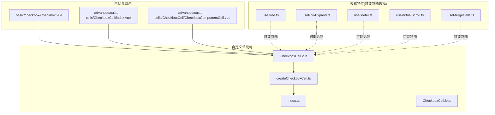
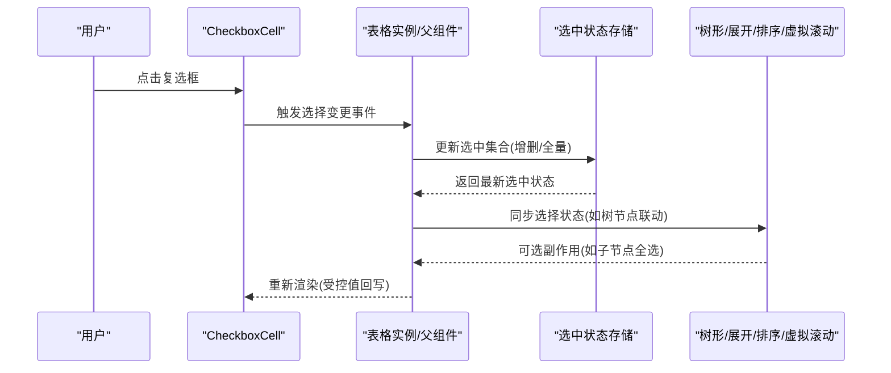
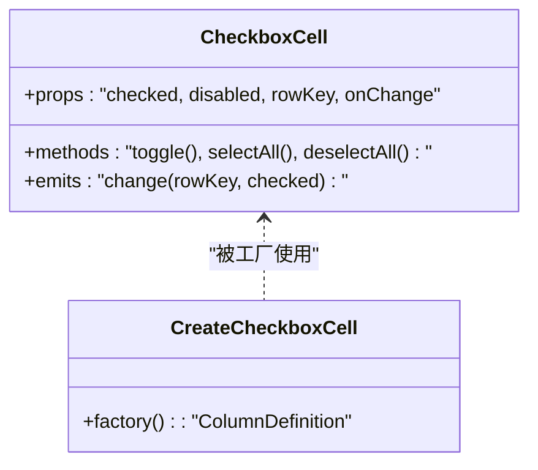
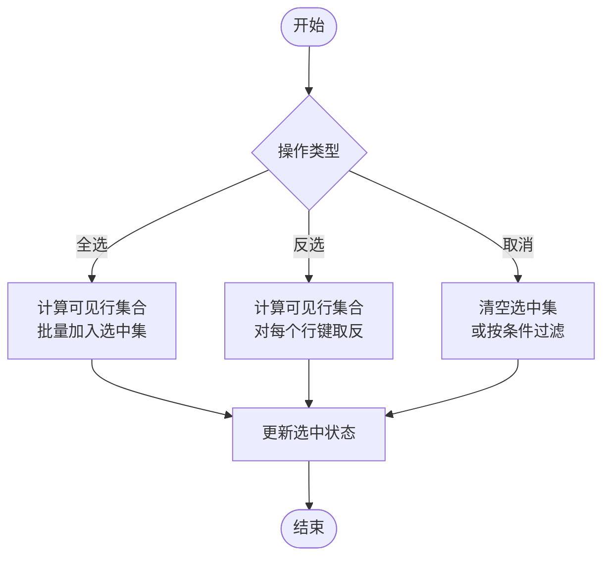
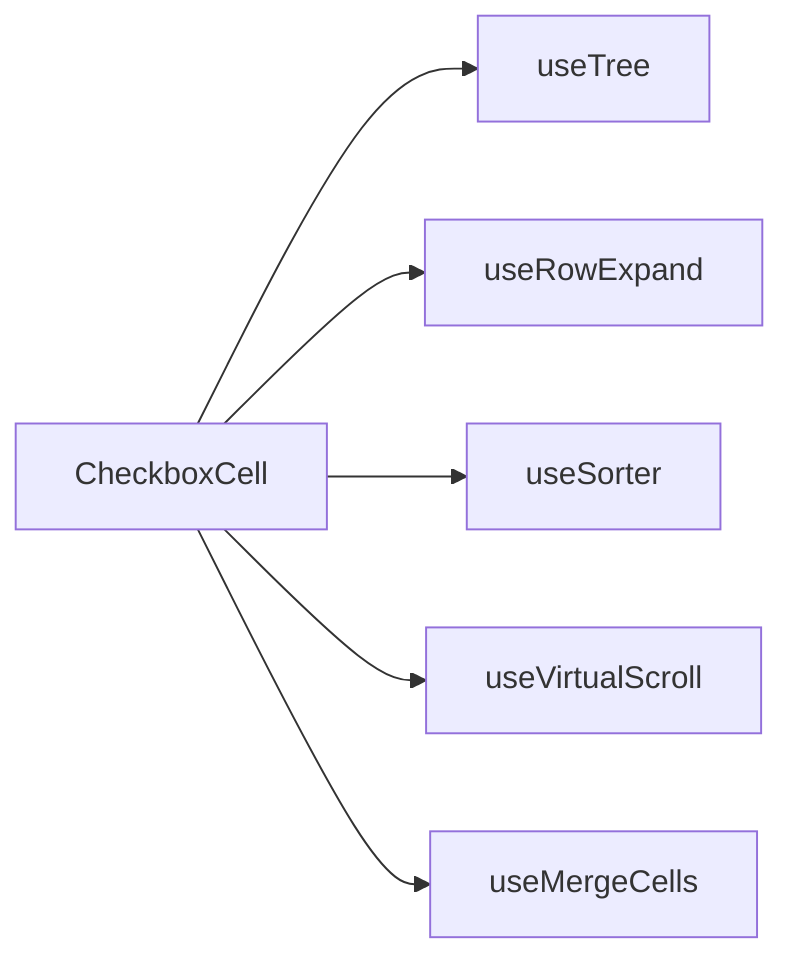

# 复选框选择

<cite>
**本文引用的文件**   
- [src/StkTable/custom-cells/CheckboxCell/index.ts](file://src/StkTable/custom-cells/CheckboxCell/index.ts)
- [src/StkTable/custom-cells/CheckboxCell/CheckboxCell.vue](file://src/StkTable/custom-cells/CheckboxCell/CheckboxCell.vue)
- [src/StkTable/custom-cells/CheckboxCell/createCheckboxCell.ts](file://src/StkTable/custom-cells/CheckboxCell/createCheckboxCell.ts)
- [src/StkTable/custom-cells/CheckboxCell/CheckboxCell.less](file://src/StkTable/custom-cells/CheckboxCell/CheckboxCell.less)
- [docs-demo/basic/checkbox/Checkbox.vue](file://docs-demo/basic/checkbox/Checkbox.vue)
- [docs-demo/advanced/custom-cells/CheckboxCell/index.vue](file://docs-demo/advanced/custom-cells/CheckboxCell/index.vue)
- [docs-demo/advanced/custom-cells/CheckboxCell/CheckboxComponentCell.vue](file://docs-demo/advanced/custom-cells/CheckboxCell/CheckboxComponentCell.vue)
- [src/StkTable/useTree.ts](file://src/StkTable/useTree.ts)
- [src/StkTable/useRowExpand.ts](file://src/StkTable/useRowExpand.ts)
- [src/StkTable/useSorter.ts](file://src/StkTable/useSorter.ts)
- [src/StkTable/useVirtualScroll.ts](file://src/StkTable/useVirtualScroll.ts)
- [src/StkTable/useMergeCells.ts](file://src/StkTable/useMergeCells.ts)
</cite>

## 目录
1. [简介](#简介)
2. [项目结构](#项目结构)
3. [核心组件与能力](#核心组件与能力)
4. [架构总览](#架构总览)
5. [详细组件分析](#详细组件分析)
6. [依赖关系分析](#依赖关系分析)
7. [性能考虑](#性能考虑)
8. [故障排查指南](#故障排查指南)
9. [结论](#结论)
10. [附录：API 速查](#附录api-速查)

## 简介
本文件围绕表格的“复选框选择”功能，系统性说明如何实现行选择（单选/多选）、配置 checkbox 列、全选/反选/取消选择的 API、选中状态的数据绑定与事件处理、选中数据的管理方式与性能优化技巧，以及禁用特定行选择和条件选择的实现方案。内容基于仓库中的 CheckboxCell 自定义单元格与相关示例进行归纳与提炼，帮助开发者快速落地并扩展选择能力。

## 项目结构
与复选框选择相关的代码主要分布在以下位置：
- 自定义单元格实现：src/StkTable/custom-cells/CheckboxCell
- 文档示例：docs-demo/basic/checkbox 与 docs-demo/advanced/custom-cells/CheckboxCell
- 与选择行为可能交互的表格特性：树形、展开行、排序、虚拟滚动、合并单元格等

图表来源
- [src/StkTable/custom-cells/CheckboxCell/CheckboxCell.vue](file://src/StkTable/custom-cells/CheckboxCell/CheckboxCell.vue)
- [src/StkTable/custom-cells/CheckboxCell/createCheckboxCell.ts](file://src/StkTable/custom-cells/CheckboxCell/createCheckboxCell.ts)
- [src/StkTable/custom-cells/CheckboxCell/index.ts](file://src/StkTable/custom-cells/CheckboxCell/index.ts)
- [docs-demo/basic/checkbox/Checkbox.vue](file://docs-demo/basic/checkbox/Checkbox.vue)
- [docs-demo/advanced/custom-cells/CheckboxCell/index.vue](file://docs-demo/advanced/custom-cells/CheckboxCell/index.vue)
- [docs-demo/advanced/custom-cells/CheckboxCell/CheckboxComponentCell.vue](file://docs-demo/advanced/custom-cells/CheckboxCell/CheckboxComponentCell.vue)
- [src/StkTable/useTree.ts](file://src/StkTable/useTree.ts)
- [src/StkTable/useRowExpand.ts](file://src/StkTable/useRowExpand.ts)
- [src/StkTable/useSorter.ts](file://src/StkTable/useSorter.ts)
- [src/StkTable/useVirtualScroll.ts](file://src/StkTable/useVirtualScroll.ts)
- [src/StkTable/useMergeCells.ts](file://src/StkTable/useMergeCells.ts)

章节来源
- [src/StkTable/custom-cells/CheckboxCell/index.ts](file://src/StkTable/custom-cells/CheckboxCell/index.ts)
- [src/StkTable/custom-cells/CheckboxCell/CheckboxCell.vue](file://src/StkTable/custom-cells/CheckboxCell/CheckboxCell.vue)
- [src/StkTable/custom-cells/CheckboxCell/createCheckboxCell.ts](file://src/StkTable/custom-cells/CheckboxCell/createCheckboxCell.ts)
- [docs-demo/basic/checkbox/Checkbox.vue](file://docs-demo/basic/checkbox/Checkbox.vue)
- [docs-demo/advanced/custom-cells/CheckboxCell/index.vue](file://docs-demo/advanced/custom-cells/CheckboxCell/index.vue)
- [docs-demo/advanced/custom-cells/CheckboxCell/CheckboxComponentCell.vue](file://docs-demo/advanced/custom-cells/CheckboxCell/CheckboxComponentCell.vue)

## 核心组件与能力
- CheckboxCell 自定义单元格：提供行级复选框渲染与交互，支持受控与非受控模式，便于在表格中作为“选择列”。
- createCheckboxCell：用于将 CheckboxCell 封装为可复用单元格工厂，简化列定义。
- index.ts：导出创建与注册逻辑，供表格或业务侧按需引入。
- 样式文件：CheckboxCell.less 控制复选框外观与对齐。

章节来源
- [src/StkTable/custom-cells/CheckboxCell/CheckboxCell.vue](file://src/StkTable/custom-cells/CheckboxCell/CheckboxCell.vue)
- [src/StkTable/custom-cells/CheckboxCell/createCheckboxCell.ts](file://src/StkTable/custom-cells/CheckboxCell/createCheckboxCell.ts)
- [src/StkTable/custom-cells/CheckboxCell/index.ts](file://src/StkTable/custom-cells/CheckboxCell/index.ts)
- [src/StkTable/custom-cells/CheckboxCell/CheckboxCell.less](file://src/StkTable/custom-cells/CheckboxCell/CheckboxCell.less)

## 架构总览
下图展示了“用户操作 → 单元格 → 表格/父组件 → 数据层”的选择流程，以及与树形、展开行、排序、虚拟滚动等特性的交互点。

图表来源
- [src/StkTable/custom-cells/CheckboxCell/CheckboxCell.vue](file://src/StkTable/custom-cells/CheckboxCell/CheckboxCell.vue)
- [src/StkTable/useTree.ts](file://src/StkTable/useTree.ts)
- [src/StkTable/useRowExpand.ts](file://src/StkTable/useRowExpand.ts)
- [src/StkTable/useSorter.ts](file://src/StkTable/useSorter.ts)
- [src/StkTable/useVirtualScroll.ts](file://src/StkTable/useVirtualScroll.ts)

## 详细组件分析

### CheckboxCell 组件
- 职责：渲染行级复选框，响应点击，向上抛出选择变更事件；支持禁用态、只读态、受控值绑定。
- 关键交互：
  - 行内点击：切换当前行的选中状态。
  - 全选/反选/取消：通过外部 API 调用，统一更新选中集合。
  - 禁用行：根据行数据或列配置动态禁用复选框。
- 数据流：
  - 受控模式：由父组件传入 checked 值，内部仅触发事件，不维护本地状态。
  - 非受控模式：内部维护临时状态，提交时再同步到父组件。

图表来源
- [src/StkTable/custom-cells/CheckboxCell/CheckboxCell.vue](file://src/StkTable/custom-cells/CheckboxCell/CheckboxCell.vue)
- [src/StkTable/custom-cells/CheckboxCell/createCheckboxCell.ts](file://src/StkTable/custom-cells/CheckboxCell/createCheckboxCell.ts)

章节来源
- [src/StkTable/custom-cells/CheckboxCell/CheckboxCell.vue](file://src/StkTable/custom-cells/CheckboxCell/CheckboxCell.vue)
- [src/StkTable/custom-cells/CheckboxCell/createCheckboxCell.ts](file://src/StkTable/custom-cells/CheckboxCell/createCheckboxCell.ts)

### 全选/反选/取消选择 API
- 全选：遍历可见行，将全部行键加入选中集合。
- 反选：对当前可见行集合执行对称差运算，已选则取消，未选则选中。
- 取消选择：清空选中集合或按条件过滤。
- 注意：
  - 需考虑分页/筛选/排序后的“可见行”范围。
  - 树形模式下，建议同时处理父子节点的联动规则。

图表来源
- [src/StkTable/custom-cells/CheckboxCell/CheckboxCell.vue](file://src/StkTable/custom-cells/CheckboxCell/CheckboxCell.vue)

章节来源
- [src/StkTable/custom-cells/CheckboxCell/CheckboxCell.vue](file://src/StkTable/custom-cells/CheckboxCell/CheckboxCell.vue)

### 单选与多选模式
- 单选模式：
  - 每次选择前清空历史选中项，再设置当前行为选中。
  - 适用于“只能选择一个”的业务场景。
- 多选模式：
  - 维护一个集合（Set/Map）保存所有选中行键。
  - 支持全选/反选/取消等操作。
- 边界情况：
  - 空数据、隐藏行、禁用行不参与选择。
  - 树形/分组下的父子联动策略需明确。

章节来源
- [src/StkTable/custom-cells/CheckboxCell/CheckboxCell.vue](file://src/StkTable/custom-cells/CheckboxCell/CheckboxCell.vue)

### 数据绑定与事件处理
- 受控绑定：
  - 父组件维护 selectedKeys，传递给 CheckboxCell 的 checked 属性。
  - 监听 change 事件，统一更新 selectedKeys。
- 非受控绑定：
  - 组件内部维护临时状态，提交时再同步给父组件。
- 事件：
  - change(rowKey, checked)：单行选择变化。
  - 可通过暴露方法实现全选/反选/取消。

章节来源
- [docs-demo/basic/checkbox/Checkbox.vue](file://docs-demo/basic/checkbox/Checkbox.vue)
- [docs-demo/advanced/custom-cells/CheckboxCell/index.vue](file://docs-demo/advanced/custom-cells/CheckboxCell/index.vue)
- [docs-demo/advanced/custom-cells/CheckboxCell/CheckboxComponentCell.vue](file://docs-demo/advanced/custom-cells/CheckboxCell/CheckboxComponentCell.vue)

### 禁用特定行选择
- 行级禁用：
  - 根据行数据的某个字段（如 disabled、status）决定复选框是否可用。
- 列级禁用：
  - 在列定义中提供全局禁用函数，针对整列生效。
- 注意事项：
  - 禁用行不应参与全选/反选的计算。
  - 键盘导航与无障碍访问需保持一致。

章节来源
- [src/StkTable/custom-cells/CheckboxCell/CheckboxCell.vue](file://src/StkTable/custom-cells/CheckboxCell/CheckboxCell.vue)

### 条件选择
- 条件判断：
  - 基于行数据字段（如 type、role）决定是否允许选择。
- 联动规则：
  - 树形模式下，父节点选中时子节点自动选中/半选。
  - 分组模式下，组头复选框与组内行保持同步。
- 实现要点：
  - 在 change 事件中插入业务校验逻辑，必要时阻止选择。

章节来源
- [src/StkTable/useTree.ts](file://src/StkTable/useTree.ts)
- [src/StkTable/custom-cells/CheckboxCell/CheckboxCell.vue](file://src/StkTable/custom-cells/CheckboxCell/CheckboxCell.vue)

## 依赖关系分析
- CheckboxCell 与表格特性：
  - 树形 useTree：影响父子节点选择联动。
  - 展开行 useRowExpand：展开/收起不影响选择集合，但需避免重复计算。
  - 排序 useSorter：排序后“可见行”顺序变化，全选/反选应基于排序后的可见行。
  - 虚拟滚动 useVirtualScroll：仅渲染可视区域，全选/反选需基于完整数据集而非可视集合。
  - 合并单元格 useMergeCells：合并行应避免重复选择同一逻辑行。

图表来源
- [src/StkTable/custom-cells/CheckboxCell/CheckboxCell.vue](file://src/StkTable/custom-cells/CheckboxCell/CheckboxCell.vue)
- [src/StkTable/useTree.ts](file://src/StkTable/useTree.ts)
- [src/StkTable/useRowExpand.ts](file://src/StkTable/useRowExpand.ts)
- [src/StkTable/useSorter.ts](file://src/StkTable/useSorter.ts)
- [src/StkTable/useVirtualScroll.ts](file://src/StkTable/useVirtualScroll.ts)
- [src/StkTable/useMergeCells.ts](file://src/StkTable/useMergeCells.ts)

章节来源
- [src/StkTable/useTree.ts](file://src/StkTable/useTree.ts)
- [src/StkTable/useRowExpand.ts](file://src/StkTable/useRowExpand.ts)
- [src/StkTable/useSorter.ts](file://src/StkTable/useSorter.ts)
- [src/StkTable/useVirtualScroll.ts](file://src/StkTable/useVirtualScroll.ts)
- [src/StkTable/useMergeCells.ts](file://src/StkTable/useMergeCells.ts)

## 性能考虑
- 数据结构选择：
  - 使用 Set/Map 管理选中行键，O(1) 查询与去重。
- 批量更新：
  - 全选/反选时尽量一次性更新选中集合，减少多次 re-render。
- 可见行计算：
  - 排序/筛选后，先计算可见行集合，再进行选择操作，避免无效计算。
- 虚拟滚动：
  - 全选/反选基于完整数据集，而非可视区行，防止遗漏。
- 树形联动：
  - 增量更新父子节点状态，避免全量重算。
- 事件节流：
  - 高频交互场景下对 change 事件做节流或防抖。

[本节为通用指导，无需具体文件引用]

## 故障排查指南
- 全选无效：
  - 检查是否基于“可见行”计算；确认排序/筛选后集合是否正确。
- 树形联动异常：
  - 确认父子节点 key 唯一性；检查半选状态逻辑。
- 虚拟滚动导致选择丢失：
  - 确保选中集合基于完整数据集维护，而非可视区。
- 禁用行仍被选中：
  - 检查禁用条件是否在 change 事件中正确拦截。
- 合并单元格重复选择：
  - 确保以逻辑行键为准，避免物理行重复。

章节来源
- [src/StkTable/custom-cells/CheckboxCell/CheckboxCell.vue](file://src/StkTable/custom-cells/CheckboxCell/CheckboxCell.vue)
- [src/StkTable/useTree.ts](file://src/StkTable/useTree.ts)
- [src/StkTable/useVirtualScroll.ts](file://src/StkTable/useVirtualScroll.ts)

## 结论
通过 CheckboxCell 自定义单元格与配套的工厂方法，可以灵活地在表格中实现行选择功能。结合树形、展开行、排序、虚拟滚动等特性，需要特别注意“可见行”与“完整数据集”的边界，以及父子节点联动的语义。采用合适的数据结构与批量更新策略，可在大数据量场景下保持良好的性能体验。

[本节为总结性内容，无需具体文件引用]

## 附录：API 速查
- 列定义
  - 使用 createCheckboxCell 生成列配置，传入必要的 props（如 rowKey、disabled、onChange）。
- 事件
  - change(rowKey, checked)：单行选择变化回调。
- 方法
  - selectAll()：全选可见行。
  - toggleAll()：反选可见行。
  - deselectAll()：取消所有选择。
- 受控绑定
  - checked：父组件传入的选中状态。
  - onChange：接收 change 事件并更新选中状态。

章节来源
- [src/StkTable/custom-cells/CheckboxCell/createCheckboxCell.ts](file://src/StkTable/custom-cells/CheckboxCell/createCheckboxCell.ts)
- [src/StkTable/custom-cells/CheckboxCell/CheckboxCell.vue](file://src/StkTable/custom-cells/CheckboxCell/CheckboxCell.vue)
- [docs-demo/basic/checkbox/Checkbox.vue](file://docs-demo/basic/checkbox/Checkbox.vue)
- [docs-demo/advanced/custom-cells/CheckboxCell/index.vue](file://docs-demo/advanced/custom-cells/CheckboxCell/index.vue)
- [docs-demo/advanced/custom-cells/CheckboxCell/CheckboxComponentCell.vue](file://docs-demo/advanced/custom-cells/CheckboxCell/CheckboxComponentCell.vue)