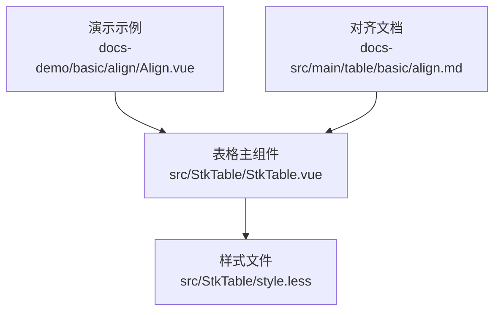
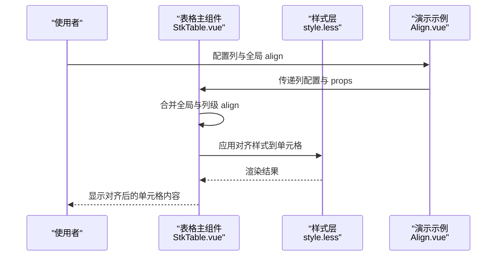
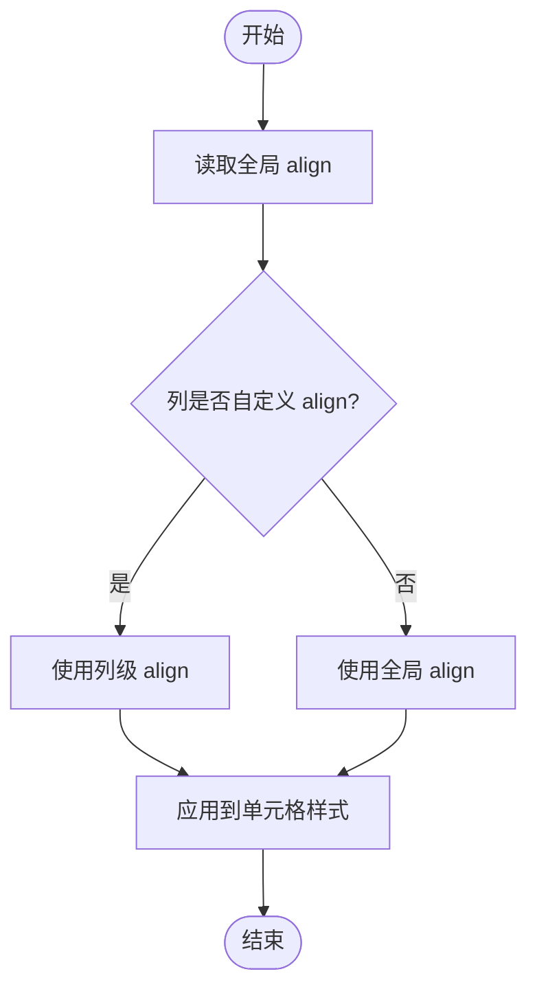
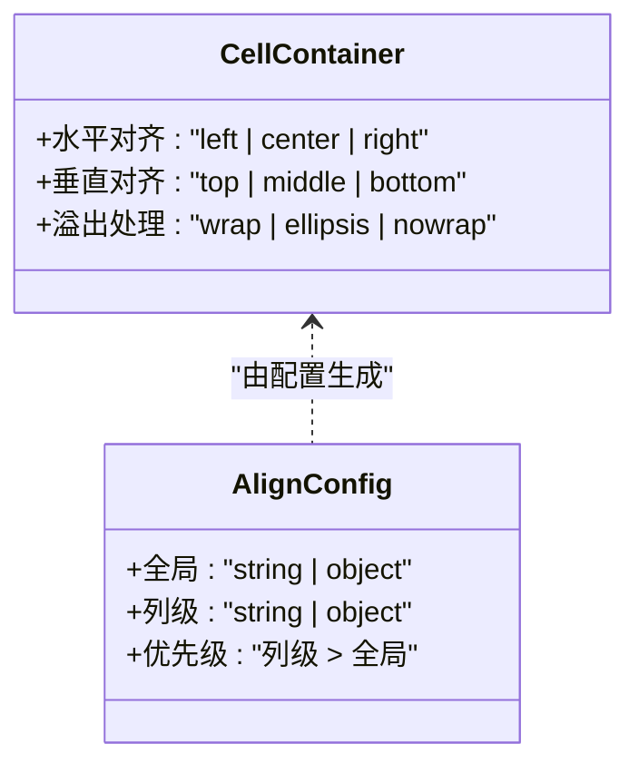
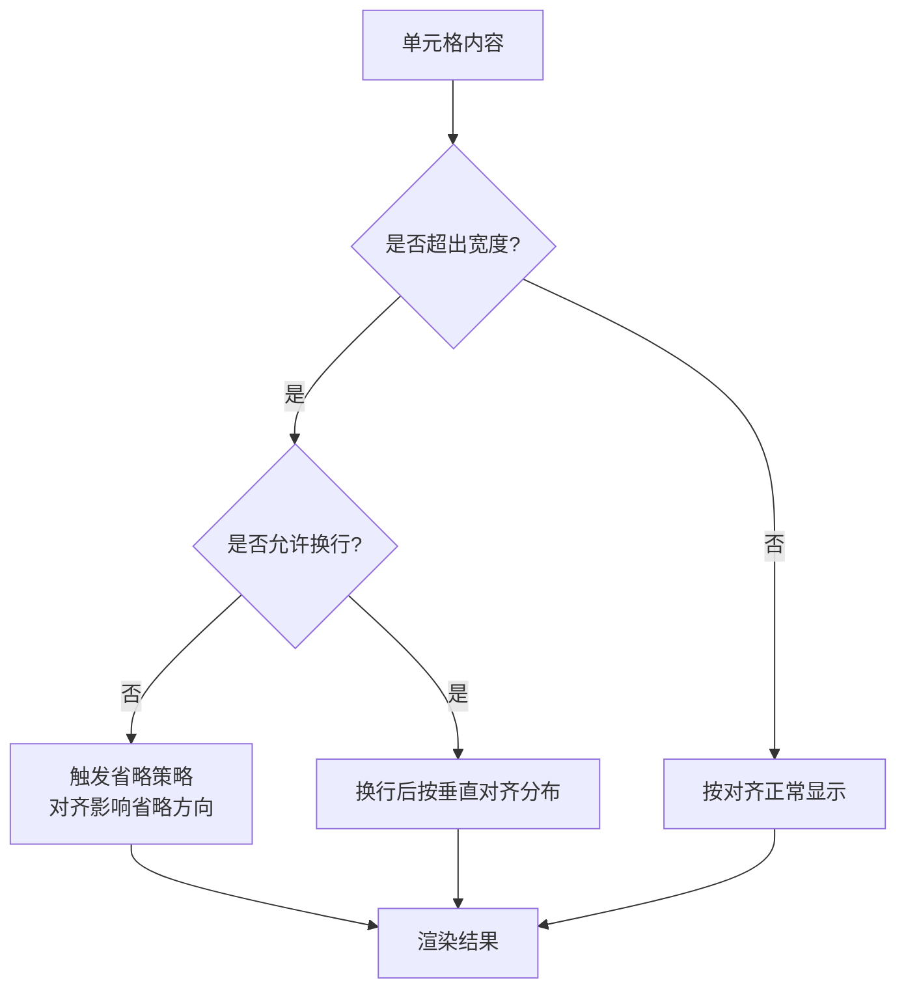
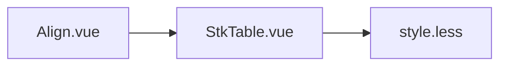

# 对齐方式

<cite>
**本文引用的文件**   
- [docs-demo/basic/align/Align.vue](file://docs-demo/basic/align/Align.vue)
- [src/StkTable/StkTable.vue](file://src/StkTable/StkTable.vue)
- [src/StkTable/style.less](file://src/StkTable/style.less)
- [docs-src/main/table/basic/align.md](file://docs-src/main/table/basic/align.md)
</cite>

## 目录
1. [简介](#简介)
2. [项目结构](#项目结构)
3. [核心组件与能力](#核心组件与能力)
4. [架构总览](#架构总览)
5. [详细组件分析](#详细组件分析)
6. [依赖关系分析](#依赖关系分析)
7. [性能考量](#性能考量)
8. [故障排查指南](#故障排查指南)
9. [结论](#结论)
10. [附录：示例与最佳实践](#附录示例与最佳实践)

## 简介
本章节聚焦表格单元格内容的对齐能力，涵盖水平对齐（左、中、右）与垂直对齐（顶部、中部、底部），并说明如何通过 align 属性进行全局设置与列级别覆盖。同时解释对齐与内容溢出处理的交互关系，以及在响应式布局下的行为表现。

## 项目结构
与“对齐”功能直接相关的代码与文档分布如下：
- 演示示例：docs-demo/basic/align/Align.vue
- 表格核心实现：src/StkTable/StkTable.vue
- 样式定义：src/StkTable/style.less
- 官方文档：docs-src/main/table/basic/align.md

**图表来源** 
- [docs-demo/basic/align/Align.vue](file://docs-demo/basic/align/Align.vue)
- [src/StkTable/StkTable.vue](file://src/StkTable/StkTable.vue)
- [src/StkTable/style.less](file://src/StkTable/style.less)
- [docs-src/main/table/basic/align.md](file://docs-src/main/table/basic/align.md)

**章节来源**
- [docs-demo/basic/align/Align.vue](file://docs-demo/basic/align/Align.vue)
- [src/StkTable/StkTable.vue](file://src/StkTable/StkTable.vue)
- [src/StkTable/style.less](file://src/StkTable/style.less)
- [docs-src/main/table/basic/align.md](file://docs-src/main/table/basic/align.md)

## 核心组件与能力
- 表格主组件负责解析列配置与全局配置，将 align 属性转换为渲染时的样式或类名，作用于单元格容器。
- 样式层通过 CSS 控制文本的水平与垂直对齐，并与内容溢出策略协同工作。
- 演示示例展示了不同 align 值的效果，便于快速验证与参考。

**章节来源**
- [src/StkTable/StkTable.vue](file://src/StkTable/StkTable.vue)
- [src/StkTable/style.less](file://src/StkTable/style.less)
- [docs-demo/basic/align/Align.vue](file://docs-demo/basic/align/Align.vue)

## 架构总览
对齐能力的数据流与渲染流程如下：
- 用户通过 props 或列配置传入 align（支持字符串或对象形式）。
- 表格主组件在渲染单元格时，根据优先级合并全局与列级配置。
- 样式层应用对应的 CSS 属性，完成水平与垂直对齐。
- 当内容超出单元格宽度时，溢出处理策略决定文本是否换行、省略等，从而影响最终的对齐视觉效果。

**图表来源** 
- [src/StkTable/StkTable.vue](file://src/StkTable/StkTable.vue)
- [src/StkTable/style.less](file://src/StkTable/style.less)
- [docs-demo/basic/align/Align.vue](file://docs-demo/basic/align/Align.vue)

## 详细组件分析

### 对齐属性的配置方法
- 全局设置：在表格实例上统一指定 align，作为默认对齐规则。
- 列级别覆盖：在列配置中单独设置 align，优先于全局设置。
- 推荐做法：为数值型列默认右对齐，文本列默认左对齐；标题列可居中对齐以提升可读性。

**图表来源** 
- [src/StkTable/StkTable.vue](file://src/StkTable/StkTable.vue)

**章节来源**
- [src/StkTable/StkTable.vue](file://src/StkTable/StkTable.vue)
- [docs-src/main/table/basic/align.md](file://docs-src/main/table/basic/align.md)

### 水平与垂直对齐的交互
- 水平对齐：通常对应 CSS 的 text-align（left、center、right）。
- 垂直对齐：通常对应 CSS 的 vertical-align（top、middle、bottom），在多行或高行高场景下尤为明显。
- 组合效果：例如“居中+中部”使文本在单元格内水平和垂直都居中。

**图表来源** 
- [src/StkTable/StkTable.vue](file://src/StkTable/StkTable.vue)
- [src/StkTable/style.less](file://src/StkTable/style.less)

**章节来源**
- [src/StkTable/StkTable.vue](file://src/StkTable/StkTable.vue)
- [src/StkTable/style.less](file://src/StkTable/style.less)

### 对齐与内容溢出处理的交互
- 当单元格宽度不足且未启用换行时，文本可能以省略号显示，此时对齐方向影响省略位置（如右对齐时省略发生在左侧）。
- 启用换行后，垂直对齐会决定多行文本在单元格内的纵向分布。
- 建议：对长文本列开启换行，并对数值列保持不换行以便对齐更直观。

**图表来源** 
- [src/StkTable/style.less](file://src/StkTable/style.less)

**章节来源**
- [src/StkTable/style.less](file://src/StkTable/style.less)

### 响应式布局下的对齐行为
- 在小屏设备上，列宽可能压缩，导致更多列出现溢出与省略，对齐方向对阅读体验影响更大。
- 建议在移动端对关键数值列保持右对齐，文本列适当换行，避免误读。
- 可通过媒体查询或动态列配置在不同屏幕尺寸下调整 align。

[本节为概念性说明，不直接分析具体文件]

## 依赖关系分析
- StkTable.vue 负责解析 align 配置并应用到单元格渲染。
- style.less 提供对齐相关的 CSS 规则，确保跨浏览器一致性。
- Align.vue 演示了不同 align 值的实际效果，便于验证与学习。

**图表来源** 
- [docs-demo/basic/align/Align.vue](file://docs-demo/basic/align/Align.vue)
- [src/StkTable/StkTable.vue](file://src/StkTable/StkTable.vue)
- [src/StkTable/style.less](file://src/StkTable/style.less)

**章节来源**
- [docs-demo/basic/align/Align.vue](file://docs-demo/basic/align/Align.vue)
- [src/StkTable/StkTable.vue](file://src/StkTable/StkTable.vue)
- [src/StkTable/style.less](file://src/StkTable/style.less)

## 性能考量
- 对齐属于样式层面，开销较小，但频繁重排仍会影响性能。
- 避免在大数据量场景下动态切换大量列的 align，建议批量更新或使用虚拟滚动配合固定对齐策略。
- 合理设置列宽与溢出策略，减少不必要的换行与重绘。

[本节为通用指导，不直接分析具体文件]

## 故障排查指南
- 现象：对齐不生效
  - 检查列配置是否覆盖了全局设置。
  - 确认单元格容器未被外部样式覆盖。
- 现象：内容溢出后对齐异常
  - 检查是否启用了换行或省略策略。
  - 确认单元格宽度与父容器约束。
- 现象：移动端对齐错位
  - 检查媒体查询与列宽自适应逻辑。
  - 必要时为小屏设备单独设置 align。

**章节来源**
- [src/StkTable/style.less](file://src/StkTable/style.less)
- [docs-src/main/table/basic/align.md](file://docs-src/main/table/basic/align.md)

## 结论
通过对齐属性的全局与列级配置，可以灵活控制单元格内容的水平与垂直对齐。结合溢出处理策略与响应式布局，能够在不同场景下获得一致的视觉体验。建议遵循数值右对齐、文本左对齐、标题居中的通用规范，并在移动端进行针对性优化。

[本节为总结性内容，不直接分析具体文件]

## 附录：示例与最佳实践
- 示例参考路径：
  - 演示示例：docs-demo/basic/align/Align.vue
  - 官方文档：docs-src/main/table/basic/align.md
- 最佳实践：
  - 为数值列默认右对齐，提升对比与扫描效率。
  - 对长文本列启用换行，避免横向滚动。
  - 在移动端为关键列设置合适的对齐与溢出策略。
  - 避免频繁动态切换 align，尽量在初始化阶段确定。

**章节来源**
- [docs-demo/basic/align/Align.vue](file://docs-demo/basic/align/Align.vue)
- [docs-src/main/table/basic/align.md](file://docs-src/main/table/basic/align.md)