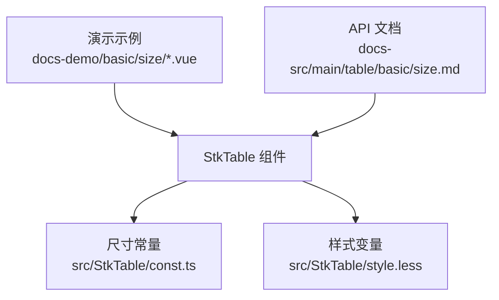
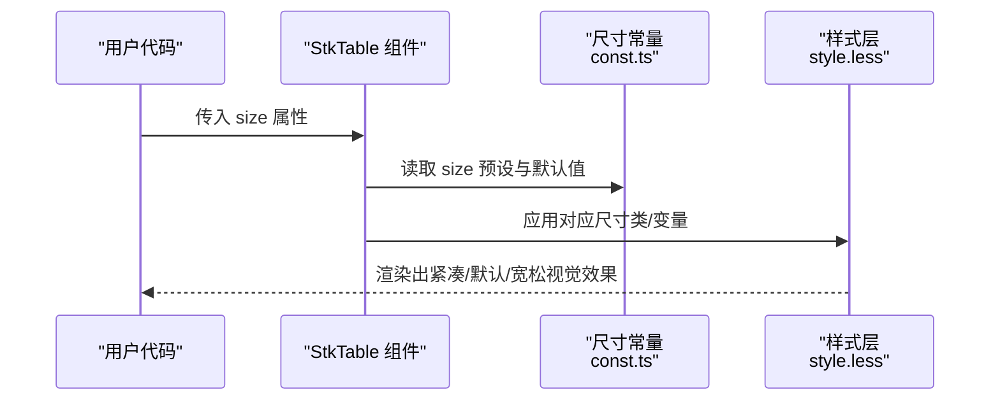
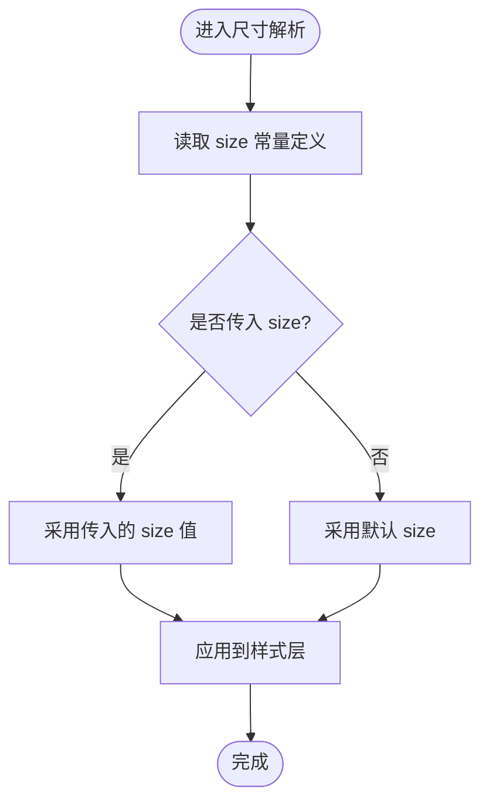
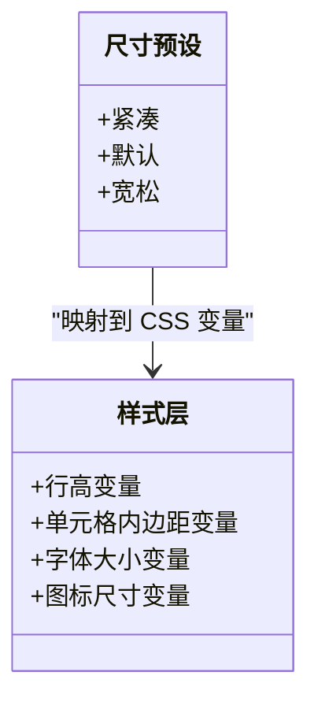
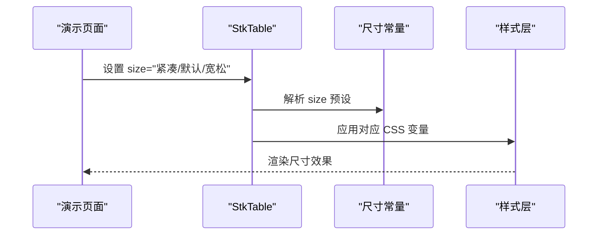
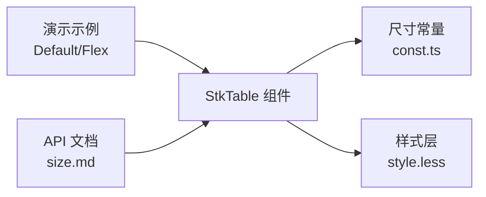

# 尺寸设置

<cite>
**本文引用的文件**   
- [src/StkTable/const.ts](file://src/StkTable/const.ts)
- [src/StkTable/style.less](file://src/StkTable/style.less)
- [docs-demo/basic/size/Default.vue](file://docs-demo/basic/size/Default.vue)
- [docs-demo/basic/size/Flex.vue](file://docs-demo/basic/size/Flex.vue)
- [docs-src/main/table/basic/size.md](file://docs-src/main/table/basic/size.md)
</cite>

## 目录
1. [简介](#简介)
2. [项目结构](#项目结构)
3. [核心组件与属性](#核心组件与属性)
4. [架构总览](#架构总览)
5. [详细组件分析](#详细组件分析)
6. [依赖关系分析](#依赖关系分析)
7. [性能考虑](#性能考虑)
8. [故障排查指南](#故障排查指南)
9. [结论](#结论)
10. [附录](#附录)

## 简介
本章节围绕表格的尺寸功能，系统说明如何设置表格整体尺寸、使用内置预设（紧凑、默认、宽松）、通过 CSS 变量自定义尺寸，以及在不同屏幕下的响应式适配策略。文档同时给出移动端优化建议与常见布局间距变化的参考，帮助你在不同场景下获得一致的视觉与交互体验。

## 项目结构
与尺寸相关的实现主要分布在以下位置：
- 常量与默认值定义：用于声明 size 的可选取值与默认值
- 样式文件：基于 CSS 变量控制行高、单元格内边距等视觉尺寸
- 演示示例：展示 size 属性的用法与效果
- 文档说明：对 size 属性的 API 说明与最佳实践

**图表来源** 
- [src/StkTable/const.ts](file://src/StkTable/const.ts)
- [src/StkTable/style.less](file://src/StkTable/style.less)
- [docs-demo/basic/size/Default.vue](file://docs-demo/basic/size/Default.vue)
- [docs-demo/basic/size/Flex.vue](file://docs-demo/basic/size/Flex.vue)
- [docs-src/main/table/basic/size.md](file://docs-src/main/table/basic/size.md)

**章节来源**
- [src/StkTable/const.ts](file://src/StkTable/const.ts)
- [src/StkTable/style.less](file://src/StkTable/style.less)
- [docs-demo/basic/size/Default.vue](file://docs-demo/basic/size/Default.vue)
- [docs-demo/basic/size/Flex.vue](file://docs-demo/basic/size/Flex.vue)
- [docs-src/main/table/basic/size.md](file://docs-src/main/table/basic/size.md)

## 核心组件与属性
- size 属性
  - 作用：控制表格的整体尺寸，影响行高、单元格内边距、图标大小等
  - 预设值：紧凑、默认、宽松（具体取值以常量定义为准）
  - 默认值：遵循组件默认配置
- 覆盖方式
  - 通过 CSS 变量覆盖：可针对行高、单元格内边距等进行精细化调整
  - 在主题或全局样式中统一覆盖，确保多表格一致性

**章节来源**
- [src/StkTable/const.ts](file://src/StkTable/const.ts)
- [src/StkTable/style.less](file://src/StkTable/style.less)
- [docs-src/main/table/basic/size.md](file://docs-src/main/table/basic/size.md)

## 架构总览
size 的工作流从属性传入到样式生效的关键路径如下：

**图表来源** 
- [src/StkTable/const.ts](file://src/StkTable/const.ts)
- [src/StkTable/style.less](file://src/StkTable/style.less)

## 详细组件分析

### 尺寸常量与默认值
- 职责：集中管理 size 的可选项与默认值，保证组件行为一致
- 关键点：
  - 提供紧凑、默认、宽松等预设
  - 为未显式设置 size 的场景提供回退逻辑

**图表来源** 
- [src/StkTable/const.ts](file://src/StkTable/const.ts)

**章节来源**
- [src/StkTable/const.ts](file://src/StkTable/const.ts)

### 样式变量与尺寸映射
- 职责：将 size 映射到具体的 CSS 变量，控制行高、内边距、字体大小等
- 关键点：
  - 使用 CSS 变量作为尺寸锚点，便于主题化与覆盖
  - 针对不同 size 预设切换变量值，保持布局一致性

**图表来源** 
- [src/StkTable/style.less](file://src/StkTable/style.less)

**章节来源**
- [src/StkTable/style.less](file://src/StkTable/style.less)

### 演示示例与用法
- Default.vue：展示 size 的基础用法与三种预设效果对比
- Flex.vue：结合弹性布局，演示在不同容器宽度下的尺寸表现

**图表来源** 
- [docs-demo/basic/size/Default.vue](file://docs-demo/basic/size/Default.vue)
- [docs-demo/basic/size/Flex.vue](file://docs-demo/basic/size/Flex.vue)
- [src/StkTable/const.ts](file://src/StkTable/const.ts)
- [src/StkTable/style.less](file://src/StkTable/style.less)

**章节来源**
- [docs-demo/basic/size/Default.vue](file://docs-demo/basic/size/Default.vue)
- [docs-demo/basic/size/Flex.vue](file://docs-demo/basic/size/Flex.vue)

### API 文档要点
- size 属性说明：取值范围、默认值、对布局的影响
- 覆盖建议：如何在主题中统一覆盖 CSS 变量
- 响应式建议：在不同断点下如何组合 size 与容器宽度

**章节来源**
- [docs-src/main/table/basic/size.md](file://docs-src/main/table/basic/size.md)

## 依赖关系分析
- 组件与常量：StkTable 依赖 const.ts 中的 size 预设与默认值
- 组件与样式：StkTable 通过 style.less 中的 CSS 变量驱动视觉尺寸
- 演示与文档：演示示例与文档共同验证 size 的行为与最佳实践

**图表来源** 
- [src/StkTable/const.ts](file://src/StkTable/const.ts)
- [src/StkTable/style.less](file://src/StkTable/style.less)
- [docs-demo/basic/size/Default.vue](file://docs-demo/basic/size/Default.vue)
- [docs-demo/basic/size/Flex.vue](file://docs-demo/basic/size/Flex.vue)
- [docs-src/main/table/basic/size.md](file://docs-src/main/table/basic/size.md)

**章节来源**
- [src/StkTable/const.ts](file://src/StkTable/const.ts)
- [src/StkTable/style.less](file://src/StkTable/style.less)
- [docs-demo/basic/size/Default.vue](file://docs-demo/basic/size/Default.vue)
- [docs-demo/basic/size/Flex.vue](file://docs-demo/basic/size/Flex.vue)
- [docs-src/main/table/basic/size.md](file://docs-src/main/table/basic/size.md)

## 性能考虑
- 合理选择 size：在数据密集场景优先使用“紧凑”，减少行高带来的渲染压力
- 避免频繁切换 size：批量更新或条件渲染时尽量稳定 size，降低重排成本
- 使用 CSS 变量覆盖：相比动态计算样式，变量切换更高效且易于维护

[本节为通用指导，不直接分析具体文件]

## 故障排查指南
- 尺寸未生效
  - 检查 size 取值是否在预设范围内
  - 确认样式层已正确引入，CSS 变量未被其他样式覆盖
- 移动端显示异常
  - 检查容器宽度与列宽设置，必要时配合响应式 size
  - 适当调小行高与内边距，提升信息密度
- 主题冲突
  - 在全局样式中统一覆盖 CSS 变量，避免局部覆盖导致不一致

[本节为通用指导，不直接分析具体文件]

## 结论
通过统一的 size 预设与 CSS 变量体系，表格能够在不同设备与场景下保持一致的视觉与交互体验。推荐在桌面端根据内容密度选择合适预设，在移动端适度收紧尺寸以提升可读性与操作效率。借助主题化覆盖，可在项目中快速实现品牌化尺寸规范。

[本节为总结性内容，不直接分析具体文件]

## 附录
- 常用尺寸建议
  - 紧凑：适合大数据量、仪表盘、监控面板
  - 默认：通用业务列表、后台管理系统
  - 宽松：强调可读性的报表、详情列表
- 响应式策略
  - 小屏优先：在小屏幕上使用更紧凑的行高与内边距
  - 断点切换：在不同断点下组合 size 与列宽策略
- 移动端优化
  - 减少横向滚动：隐藏次要列或使用横向滚动条
  - 增大触控区域：适当增加点击热区，提升可用性

[本节为通用指导，不直接分析具体文件]