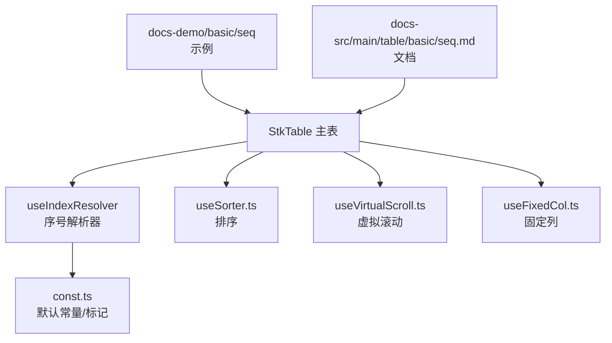
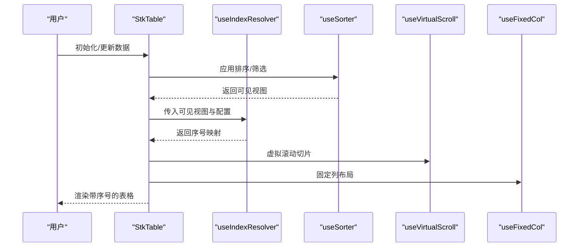
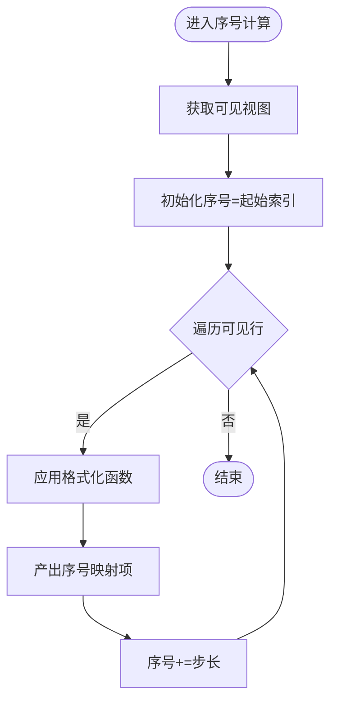
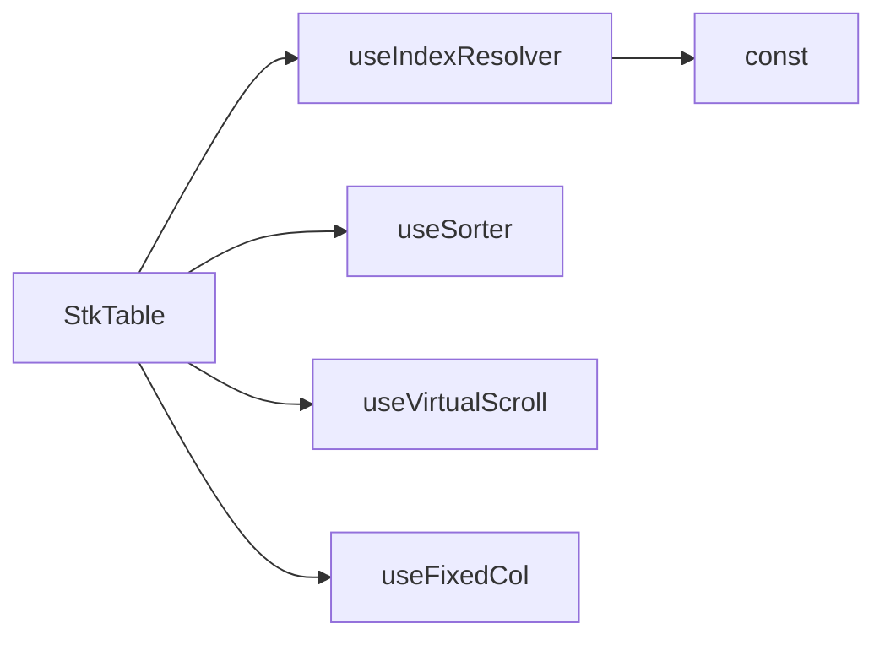

# 序号列

<cite>
**本文引用的文件**   
- [src/StkTable/useIndexResolver.ts](file://src/StkTable/useIndexResolver.ts)
- [src/StkTable/const.ts](file://src/StkTable/const.ts)
- [docs-demo/basic/seq/Seq.vue](file://docs-demo/basic/seq/Seq.vue)
- [docs-demo/basic/seq/SeqStartIndex.vue](file://docs-demo/basic/seq/SeqStartIndex.vue)
- [docs-src/main/table/basic/seq.md](file://docs-src/main/table/basic/seq.md)
- [src/StkTable/useSorter.ts](file://src/StkTable/useSorter.ts)
- [src/StkTable/useVirtualScroll.ts](file://src/StkTable/useVirtualScroll.ts)
- [src/StkTable/useFixedCol.ts](file://src/StkTable/useFixedCol.ts)
</cite>

## 目录
1. [简介](#简介)
2. [项目结构](#项目结构)
3. [核心组件](#核心组件)
4. [架构总览](#架构总览)
5. [详细组件分析](#详细组件分析)
6. [依赖分析](#依赖分析)
7. [性能考虑](#性能考虑)
8. [故障排查指南](#故障排查指南)
9. [结论](#结论)
10. [附录](#附录)

## 简介
本章节面向表格的“序号列”功能，系统性说明如何启用自动编号、配置起始索引与步长、自定义序号格式，以及在分页、排序、筛选等场景下的序号保持策略。同时覆盖与固定列、虚拟滚动等高级特性的集成方式，以及导出与打印时的序号处理建议。

## 项目结构
序号列能力由核心解析器与示例文档共同构成：
- 核心实现位于 useIndexResolver.ts，负责计算并输出每行的序号值。
- 常量定义在 const.ts，包含默认行为与关键标记。
- 使用示例位于 docs-demo/basic/seq 目录，演示基础用法与起始索引配置。
- 官方文档位于 docs-src/main/table/basic/seq.md，提供属性与用法说明。

图表来源 
- [src/StkTable/useIndexResolver.ts](file://src/StkTable/useIndexResolver.ts)
- [src/StkTable/const.ts](file://src/StkTable/const.ts)
- [src/StkTable/useSorter.ts](file://src/StkTable/useSorter.ts)
- [src/StkTable/useVirtualScroll.ts](file://src/StkTable/useVirtualScroll.ts)
- [src/StkTable/useFixedCol.ts](file://src/StkTable/useFixedCol.ts)
- [docs-demo/basic/seq/Seq.vue](file://docs-demo/basic/seq/Seq.vue)
- [docs-demo/basic/seq/SeqStartIndex.vue](file://docs-demo/basic/seq/SeqStartIndex.vue)
- [docs-src/main/table/basic/seq.md](file://docs-src/main/table/basic/seq.md)

章节来源
- [src/StkTable/useIndexResolver.ts](file://src/StkTable/useIndexResolver.ts)
- [src/StkTable/const.ts](file://src/StkTable/const.ts)
- [docs-demo/basic/seq/Seq.vue](file://docs-demo/basic/seq/Seq.vue)
- [docs-demo/basic/seq/SeqStartIndex.vue](file://docs-demo/basic/seq/SeqStartIndex.vue)
- [docs-src/main/table/basic/seq.md](file://docs-src/main/table/basic/seq.md)

## 核心组件
- 序号解析器（useIndexResolver）
  - 职责：根据当前可见行集合与配置，计算每行的序号值；支持起始索引、步长、格式化函数等。
  - 关键点：与排序、分页、筛选后的数据视图联动，保证序号基于“展示顺序”而非原始索引。
- 常量（const）
  - 职责：维护序号列相关默认值与内部标记，确保与其他模块一致。
- 示例与文档
  - 示例：演示基础用法与起始索引设置。
  - 文档：描述 seq 属性、格式化、以及与排序/分页/筛选的交互。

章节来源
- [src/StkTable/useIndexResolver.ts](file://src/StkTable/useIndexResolver.ts)
- [src/StkTable/const.ts](file://src/StkTable/const.ts)
- [docs-demo/basic/seq/Seq.vue](file://docs-demo/basic/seq/Seq.vue)
- [docs-demo/basic/seq/SeqStartIndex.vue](file://docs-demo/basic/seq/SeqStartIndex.vue)
- [docs-src/main/table/basic/seq.md](file://docs-src/main/table/basic/seq.md)

## 架构总览
序号列作为表格的一列，其数值来源于解析器对“当前可见数据视图”的计算。排序、分页、筛选会改变可见视图的顺序与范围，序号随之动态更新。固定列与虚拟滚动影响渲染与布局，但不改变序号逻辑。

图表来源 
- [src/StkTable/useIndexResolver.ts](file://src/StkTable/useIndexResolver.ts)
- [src/StkTable/useSorter.ts](file://src/StkTable/useSorter.ts)
- [src/StkTable/useVirtualScroll.ts](file://src/StkTable/useVirtualScroll.ts)
- [src/StkTable/useFixedCol.ts](file://src/StkTable/useFixedCol.ts)

## 详细组件分析

### 序号解析器（useIndexResolver）
- 输入
  - 当前可见数据视图（受排序、筛选、分页影响）
  - 序号配置：起始索引、步长、格式化函数、是否参与导出/打印等
- 处理流程
  - 按可见视图顺序遍历
  - 依据起始索引与步长生成序号序列
  - 调用格式化函数生成最终显示文本
  - 输出序号映射供渲染层使用
- 输出
  - 序号映射或渲染回调，供单元格渲染
- 复杂度
  - 时间复杂度 O(n)，n 为可见行数
  - 空间复杂度 O(n)，用于缓存序号映射

图表来源 
- [src/StkTable/useIndexResolver.ts](file://src/StkTable/useIndexResolver.ts)

章节来源
- [src/StkTable/useIndexResolver.ts](file://src/StkTable/useIndexResolver.ts)

### 常量（const）
- 作用
  - 定义序号列默认行为与内部标记，确保与其他特性（如导出、打印、固定列）保持一致。
- 关注点
  - 默认起始索引、默认步长、默认格式化策略
  - 序号列标识，避免与其他列冲突

章节来源
- [src/StkTable/const.ts](file://src/StkTable/const.ts)

### 示例与文档
- 基础示例（Seq.vue）
  - 展示如何启用序号列，观察排序、分页、筛选后序号的变化。
- 起始索引示例（SeqStartIndex.vue）
  - 演示通过配置调整起始索引，使序号从指定数字开始。
- 文档（seq.md）
  - 详细说明 seq 属性的使用方法、格式化选项、与其他功能的集成注意事项。

章节来源
- [docs-demo/basic/seq/Seq.vue](file://docs-demo/basic/seq/Seq.vue)
- [docs-demo/basic/seq/SeqStartIndex.vue](file://docs-demo/basic/seq/SeqStartIndex.vue)
- [docs-src/main/table/basic/seq.md](file://docs-src/main/table/basic/seq.md)

### 与排序的集成（useSorter）
- 行为
  - 排序后，序号基于排序后的可见顺序重新计算，保证序号与展示顺序一致。
- 策略
  - 每次排序变化触发序号重算，避免序号错乱。
- 注意
  - 若使用服务端排序，需确保前端仅对当前页可见数据进行序号计算。

章节来源
- [src/StkTable/useSorter.ts](file://src/StkTable/useSorter.ts)
- [docs-src/main/table/basic/seq.md](file://docs-src/main/table/basic/seq.md)

### 与虚拟滚动的集成（useVirtualScroll）
- 行为
  - 虚拟滚动仅影响可视区域渲染，序号仍基于完整可见视图计算，保证跨页连续。
- 策略
  - 序号映射按可见视图生成，虚拟滚动切片时复用同一映射。
- 注意
  - 避免在渲染层重复计算序号，提升性能。

章节来源
- [src/StkTable/useVirtualScroll.ts](file://src/StkTable/useVirtualScroll.ts)
- [docs-src/main/table/basic/seq.md](file://docs-src/main/table/basic/seq.md)

### 与固定列的集成（useFixedCol）
- 行为
  - 固定列不影响序号计算，仅影响布局与渲染层级。
- 策略
  - 序号列可设置为固定列，便于快速定位行号。
- 注意
  - 固定列切换时，序号映射保持不变。

章节来源
- [src/StkTable/useFixedCol.ts](file://src/StkTable/useFixedCol.ts)
- [docs-src/main/table/basic/seq.md](file://docs-src/main/table/basic/seq.md)

### 与分页、筛选的序号保持策略
- 分页
  - 每页独立序号：序号从起始索引开始，按页内可见顺序递增。
  - 全局序号：结合分页上下文，序号跨越页边界连续递增。
- 筛选
  - 序号基于筛选后的可见顺序计算，隐藏行不参与序号生成。
- 排序+筛选+分页
  - 优先级：先筛选，再排序，最后分页；序号基于最终可见顺序计算。

章节来源
- [docs-src/main/table/basic/seq.md](file://docs-src/main/table/basic/seq.md)

### 自定义序号格式
- 格式化函数
  - 接收当前序号与上下文（如页码、总页数），返回显示文本。
- 常见格式
  - 纯数字、前缀后缀、零填充、千分位分隔、国际化等。
- 性能
  - 格式化函数应轻量，避免复杂计算；必要时缓存结果。

章节来源
- [docs-src/main/table/basic/seq.md](file://docs-src/main/table/basic/seq.md)

### 导出与打印处理
- 导出
  - 序号列可参与导出，通常导出“当前视图”的序号；如需全局序号，需在导出前合并分页上下文。
- 打印
  - 打印样式中保留序号列，确保打印输出与屏幕一致。
- 注意事项
  - 导出/打印前刷新序号映射，确保与当前视图一致。

章节来源
- [docs-src/main/table/basic/seq.md](file://docs-src/main/table/basic/seq.md)

## 依赖分析
序号列依赖以下模块：
- useIndexResolver：核心计算逻辑
- const：默认常量与标记
- useSorter：排序影响可见顺序
- useVirtualScroll：虚拟滚动影响渲染范围
- useFixedCol：固定列影响布局

图表来源 
- [src/StkTable/useIndexResolver.ts](file://src/StkTable/useIndexResolver.ts)
- [src/StkTable/const.ts](file://src/StkTable/const.ts)
- [src/StkTable/useSorter.ts](file://src/StkTable/useSorter.ts)
- [src/StkTable/useVirtualScroll.ts](file://src/StkTable/useVirtualScroll.ts)
- [src/StkTable/useFixedCol.ts](file://src/StkTable/useFixedCol.ts)

章节来源
- [src/StkTable/useIndexResolver.ts](file://src/StkTable/useIndexResolver.ts)
- [src/StkTable/const.ts](file://src/StkTable/const.ts)
- [src/StkTable/useSorter.ts](file://src/StkTable/useSorter.ts)
- [src/StkTable/useVirtualScroll.ts](file://src/StkTable/useVirtualScroll.ts)
- [src/StkTable/useFixedCol.ts](file://src/StkTable/useFixedCol.ts)

## 性能考虑
- 序号计算复杂度为 O(n)，建议在大数据量下：
  - 限制可见行数（虚拟滚动）
  - 避免在格式化函数中进行昂贵操作
  - 缓存序号映射，减少重复计算
- 与排序、筛选联动时，增量更新优于全量重算。

[本节为通用指导，不直接分析具体文件]

## 故障排查指南
- 序号不随排序变化
  - 检查是否在排序回调后触发了序号重算。
- 分页后序号断号
  - 确认分页模式下序号策略（每页独立 vs 全局连续）。
- 虚拟滚动下序号错位
  - 确保序号映射基于可见视图，而非 DOM 索引。
- 固定列导致序号不可见
  - 检查固定列层级与序号列宽度设置。

章节来源
- [docs-src/main/table/basic/seq.md](file://docs-src/main/table/basic/seq.md)

## 结论
序号列为表格提供了直观的行定位能力。通过合理的配置与与排序、分页、筛选、虚拟滚动、固定列等特性的协同，可实现稳定、高性能且一致的序号体验。导出与打印时应保持与视图一致的序号策略，确保输出质量。

[本节为总结性内容，不直接分析具体文件]

## 附录
- 常用配置要点
  - 起始索引：决定序号起点
  - 步长：控制序号递增间隔
  - 格式化函数：灵活定制显示文本
  - 导出/打印：与视图一致性优先

[本节为补充信息，不直接分析具体文件]