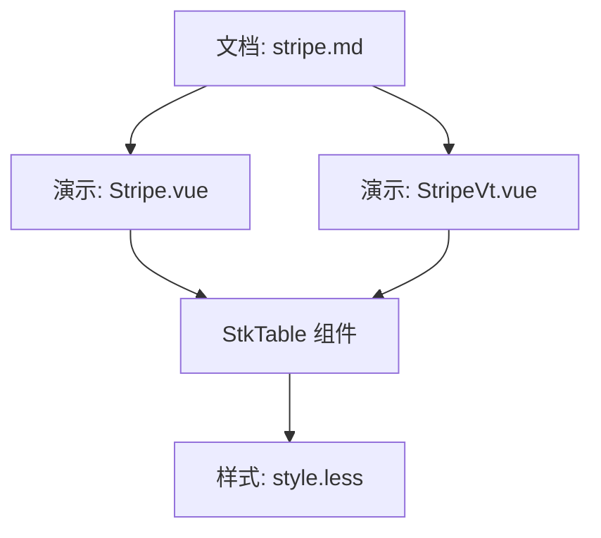
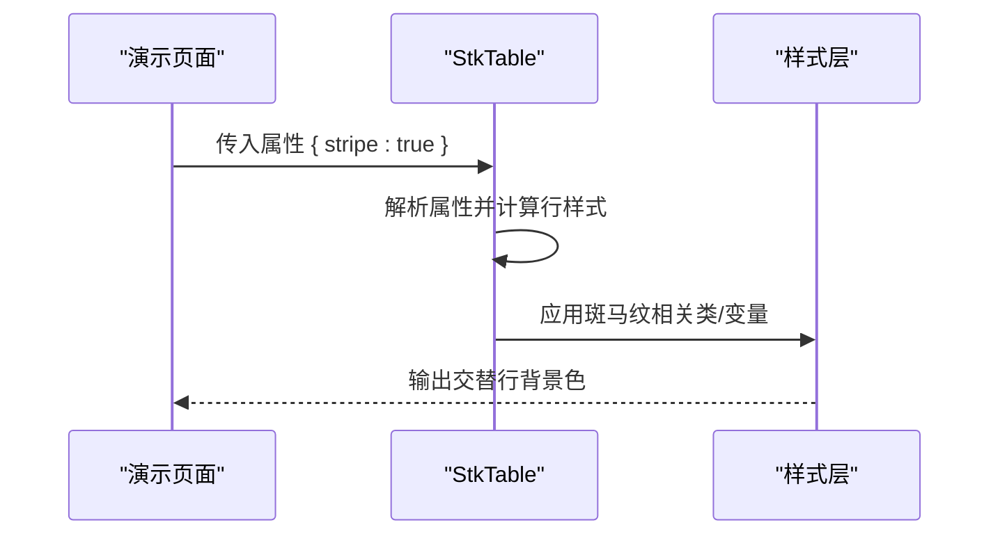
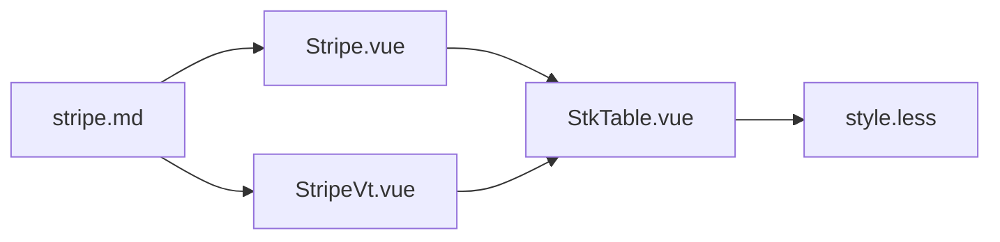

# 斑马纹效果

<cite>
**本文引用的文件**   
- [docs-demo/basic/stripe/Stripe.vue](file://docs-demo/basic/stripe/Stripe.vue)
- [docs-demo/basic/stripe/StripeVt.vue](file://docs-demo/basic/stripe/StripeVt.vue)
- [src/StkTable/StkTable.vue](file://src/StkTable/StkTable.vue)
- [src/StkTable/style.less](file://src/StkTable/style.less)
- [docs-src/main/table/basic/stripe.md](file://docs-src/main/table/basic/stripe.md)
</cite>

## 目录
1. [简介](#简介)
2. [项目结构](#项目结构)
3. [核心组件与属性](#核心组件与属性)
4. [架构总览](#架构总览)
5. [详细组件分析](#详细组件分析)
6. [依赖关系分析](#依赖关系分析)
7. [性能考量](#性能考量)
8. [故障排查指南](#故障排查指南)
9. [结论](#结论)
10. [附录](#附录)

## 简介
本章节面向表格的“斑马纹”功能，说明如何启用交替行背景色以提升数据可读性，并给出 stripe 属性的配置方法、自定义样式覆盖策略，以及与选中状态、悬停状态的视觉层次处理。同时提供奇偶行不同样式的高级用法示例思路，以及无障碍访问和可打印性的注意事项。

## 项目结构
与斑马纹相关的演示与文档位于以下位置：
- 基础演示：docs-demo/basic/stripe/Stripe.vue
- 虚拟滚动演示：docs-demo/basic/stripe/StripeVt.vue
- 官方文档页：docs-src/main/table/basic/stripe.md
- 核心表格实现与样式：src/StkTable/StkTable.vue、src/StkTable/style.less

图表来源 
- [docs-demo/basic/stripe/Stripe.vue](file://docs-demo/basic/stripe/Stripe.vue)
- [docs-demo/basic/stripe/StripeVt.vue](file://docs-demo/basic/stripe/StripeVt.vue)
- [src/StkTable/StkTable.vue](file://src/StkTable/StkTable.vue)
- [src/StkTable/style.less](file://src/StkTable/style.less)
- [docs-src/main/table/basic/stripe.md](file://docs-src/main/table/basic/stripe.md)

章节来源
- [docs-demo/basic/stripe/Stripe.vue](file://docs-demo/basic/stripe/Stripe.vue)
- [docs-demo/basic/stripe/StripeVt.vue](file://docs-demo/basic/stripe/StripeVt.vue)
- [docs-src/main/table/basic/stripe.md](file://docs-src/main/table/basic/stripe.md)

## 核心组件与属性
- 组件：StkTable
- 关键属性：stripe（布尔值）用于开启或关闭交替行背景色
- 默认行为：开启后，表格行按奇偶行应用不同的背景色，提升阅读体验
- 扩展能力：可通过 CSS 变量或类名覆盖默认样式，适配主题或业务需求

章节来源
- [docs-src/main/table/basic/stripe.md](file://docs-src/main/table/basic/stripe.md)
- [src/StkTable/StkTable.vue](file://src/StkTable/StkTable.vue)

## 架构总览
下图展示了从演示到核心组件再到样式的调用链，帮助理解 stripe 属性如何影响渲染与样式。

图表来源 
- [docs-demo/basic/stripe/Stripe.vue](file://docs-demo/basic/stripe/Stripe.vue)
- [src/StkTable/StkTable.vue](file://src/StkTable/StkTable.vue)
- [src/StkTable/style.less](file://src/StkTable/style.less)

## 详细组件分析

### 基础使用：启用斑马纹
- 在 StkTable 上设置 stripe 为 true 即可启用交替行背景色
- 适用于静态列表与动态数据场景
- 建议配合合适的列宽与行高，确保视觉层次清晰

章节来源
- [docs-demo/basic/stripe/Stripe.vue](file://docs-demo/basic/stripe/Stripe.vue)
- [docs-src/main/table/basic/stripe.md](file://docs-src/main/table/basic/stripe.md)

### 虚拟滚动下的斑马纹
- 在大数据量场景中，结合虚拟滚动使用 stripe，仍保持交替行背景色的正确性
- 注意虚拟滚动区域滚动时的重绘与样式一致性

章节来源
- [docs-demo/basic/stripe/StripeVt.vue](file://docs-demo/basic/stripe/StripeVt.vue)

### 自定义样式覆盖
- 通过覆盖样式变量或类名，调整奇偶行的背景色、边框、阴影等
- 推荐做法：
  - 定义主题变量，统一控制颜色与对比度
  - 针对 hover 与 selected 状态叠加样式，保证层级清晰
  - 避免直接修改内部类名，优先使用 CSS 变量或外层容器类限定作用域

章节来源
- [src/StkTable/style.less](file://src/StkTable/style.less)
- [docs-src/main/table/basic/stripe.md](file://docs-src/main/table/basic/stripe.md)

### 与选中状态、悬停状态的视觉层次
- 优先级建议：selected > hover > stripe
- 实现要点：
  - 选中态应覆盖斑马纹与悬停态，突出当前操作目标
  - 悬停态仅在未选中时生效，避免干扰选中反馈
  - 斑马纹作为底层背景，不遮挡交互态的高亮

章节来源
- [src/StkTable/style.less](file://src/StkTable/style.less)
- [docs-src/main/table/basic/stripe.md](file://docs-src/main/table/basic/stripe.md)

### 高级用法：奇偶行不同样式
- 可在奇偶行分别应用不同样式，如左侧边框、图标或标签
- 常见模式：
  - 奇数行添加轻微阴影或分隔线
  - 偶数行使用更浅的背景色，增强对比
- 注意：保持整体主题一致，避免过度装饰影响可读性

章节来源
- [docs-src/main/table/basic/stripe.md](file://docs-src/main/table/basic/stripe.md)

### 无障碍访问与可打印性
- 无障碍：
  - 确保背景色与文字色对比度符合 WCAG 标准
  - 斑马纹不应替代语义化标识（如 aria-selected）
- 可打印性：
  - 打印样式中可隐藏斑马纹背景，减少墨水消耗
  - 保留必要的分隔线或边框，确保打印可读性

章节来源
- [docs-src/main/table/basic/stripe.md](file://docs-src/main/table/basic/stripe.md)

## 依赖关系分析
- 演示页面依赖 StkTable 组件
- StkTable 组件依赖样式层（style.less）
- 文档页引用演示与组件说明

图表来源 
- [docs-demo/basic/stripe/Stripe.vue](file://docs-demo/basic/stripe/Stripe.vue)
- [docs-demo/basic/stripe/StripeVt.vue](file://docs-demo/basic/stripe/StripeVt.vue)
- [src/StkTable/StkTable.vue](file://src/StkTable/StkTable.vue)
- [src/StkTable/style.less](file://src/StkTable/style.less)
- [docs-src/main/table/basic/stripe.md](file://docs-src/main/table/basic/stripe.md)

章节来源
- [docs-demo/basic/stripe/Stripe.vue](file://docs-demo/basic/stripe/Stripe.vue)
- [docs-demo/basic/stripe/StripeVt.vue](file://docs-demo/basic/stripe/StripeVt.vue)
- [src/StkTable/StkTable.vue](file://src/StkTable/StkTable.vue)
- [src/StkTable/style.less](file://src/StkTable/style.less)
- [docs-src/main/table/basic/stripe.md](file://docs-src/main/table/basic/stripe.md)

## 性能考量
- 大数据量场景下，优先使用虚拟滚动以减少 DOM 节点数量
- 斑马纹样式计算应在渲染路径之外进行，避免频繁重排
- 样式覆盖尽量使用 CSS 变量，减少样式抖动与重绘

[本节为通用指导，无需代码来源]

## 故障排查指南
- 现象：斑马纹未生效
  - 检查是否设置了 stripe=true
  - 确认样式未被第三方样式覆盖
  - 在虚拟滚动模式下，检查可视区域是否正确渲染
- 现象：选中态被斑马纹遮挡
  - 提高选中态样式优先级
  - 使用独立类名或 CSS 变量控制选中背景
- 现象：打印效果不佳
  - 在 print 媒体查询中隐藏斑马纹背景
  - 增加边框或分割线以维持可读性

章节来源
- [src/StkTable/style.less](file://src/StkTable/style.less)
- [docs-src/main/table/basic/stripe.md](file://docs-src/main/table/basic/stripe.md)

## 结论
通过启用 stripe 属性，可以快速获得交替行背景色，显著提升表格的可读性与美观度。结合自定义样式与状态管理，可实现一致的视觉层次与主题风格。在大数据量与打印场景中，应注意性能与可打印性优化，确保用户体验稳定可靠。

[本节为总结内容，无需代码来源]

## 附录
- 快速上手：在 StkTable 上设置 stripe=true
- 主题定制：通过样式变量覆盖奇偶行背景色
- 状态优先级：selected > hover > stripe
- 无障碍与打印：对比度达标、打印隐藏背景

[本节为补充信息，无需代码来源]