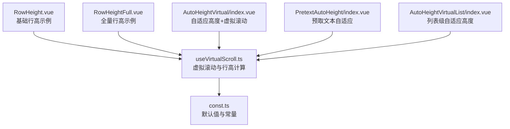
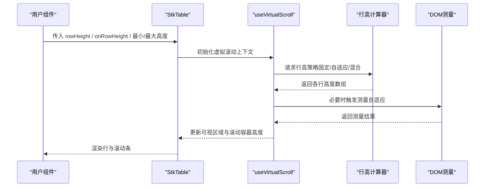
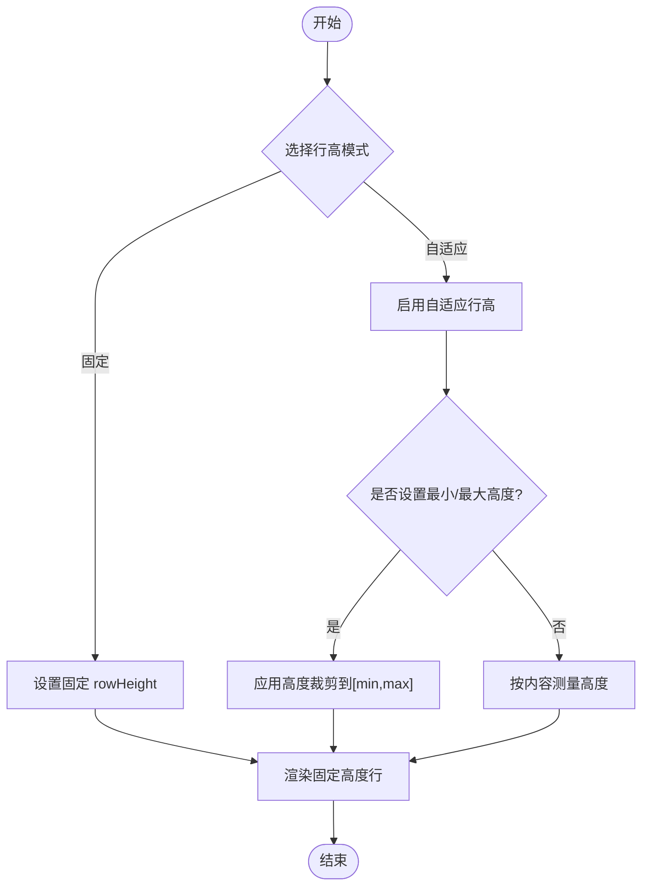
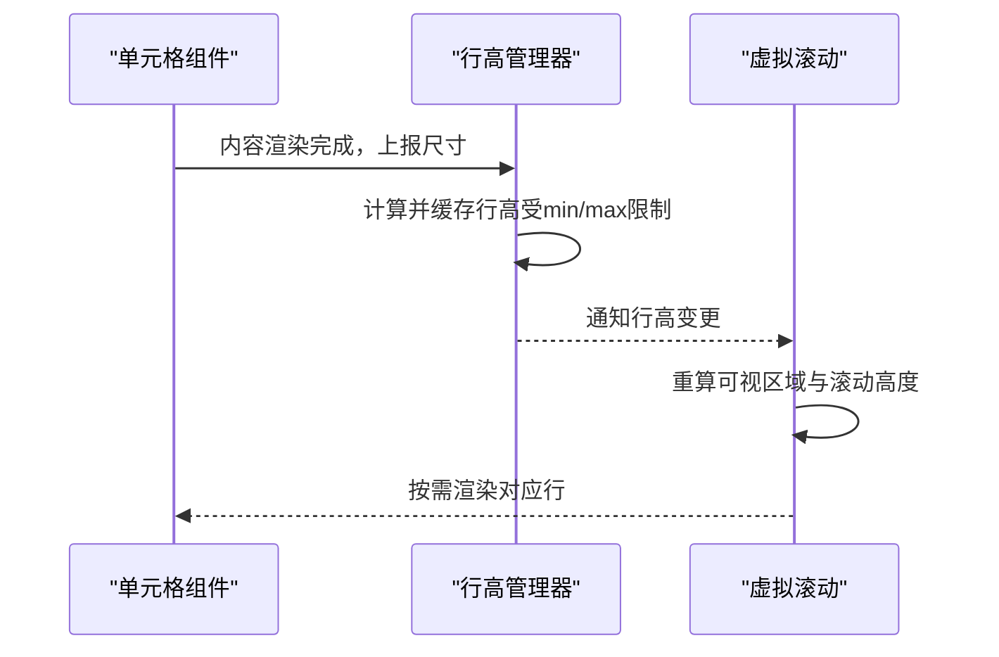
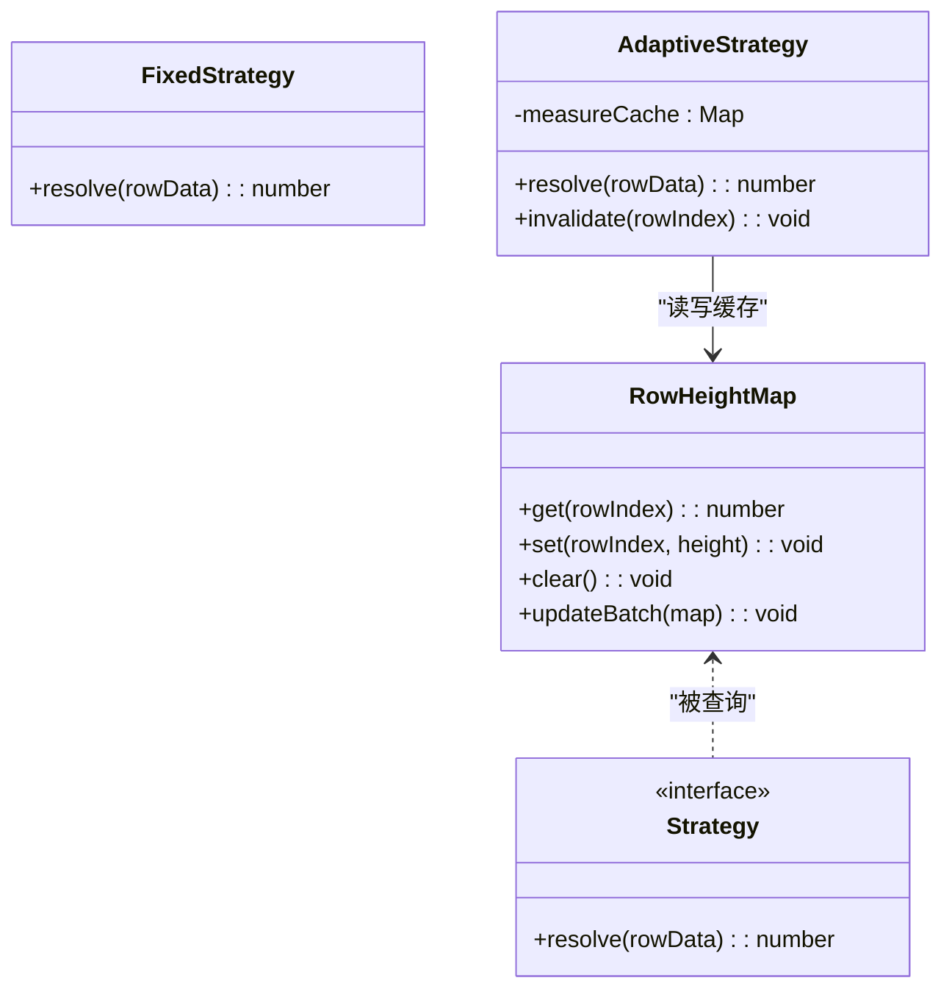
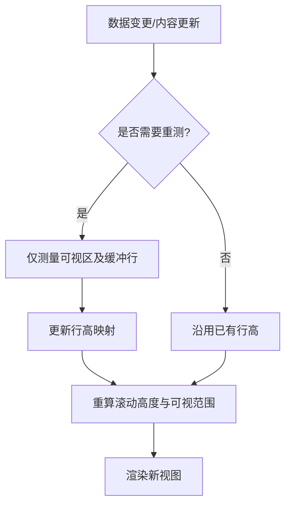
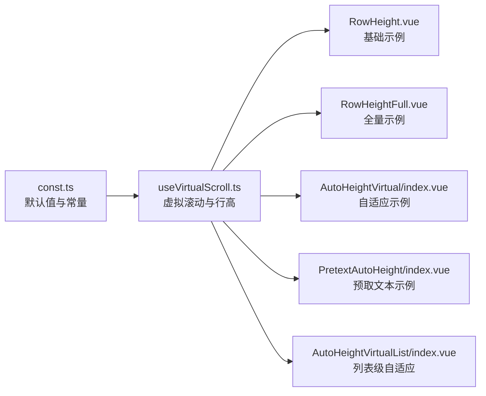

# 行高设置

<cite>
**本文引用的文件**   
- [src/StkTable/useVirtualScroll.ts](file://src/StkTable/useVirtualScroll.ts)
- [src/StkTable/const.ts](file://src/StkTable/const.ts)
- [docs-demo/basic/row-height/RowHeight.vue](file://docs-demo/basic/row-height/RowHeight.vue)
- [docs-demo/basic/row-height/RowHeightFull.vue](file://docs-demo/basic/row-height/RowHeightFull.vue)
- [docs-demo/advanced/auto-height-virtual/AutoHeightVirtual/index.vue](file://docs-demo/advanced/auto-height-virtual/AutoHeightVirtual/index.vue)
- [docs-demo/advanced/auto-height-virtual/AutoHeightVirtual/types.ts](file://docs-demo/advanced/auto-height-virtual/AutoHeightVirtual/types.ts)
- [docs-demo/advanced/auto-height-virtual/PretextAutoHeight/index.vue](file://docs-demo/advanced/auto-height-virtual/PretextAutoHeight/index.vue)
- [docs-demo/advanced/auto-height-virtual/PretextAutoHeight/types.ts](file://docs-demo/advanced/auto-height-virtual/PretextAutoHeight/types.ts)
- [docs-src/main/table/basic/row-height.md](file://docs-src/main/table/basic/row-height.md)
- [docs-src/en/main/table/basic/row-height.md](file://docs-src/en/main/table/basic/row-height.md)
- [docs-src/ja/main/table/basic/row-height.md](file://docs-src/ja/main/table/basic/row-height.md)
- [docs-src/ko/main/table/basic/row-height.md](file://docs-src/ko/main/table/basic/row-height.md)
- [docs-demo/demos/VirtualList/AutoHeightVirtualList/index.vue](file://docs-demo/demos/VirtualList/AutoHeightVirtualList/index.vue)
- [docs-demo/demos/VirtualList/AutoHeightVirtualList/Panel.vue](file://docs-demo/demos/VirtualList/AutoHeightVirtualList/Panel.vue)
- [docs-demo/demos/VirtualList/AutoHeightVirtualList/types.ts](file://docs-demo/demos/VirtualList/AutoHeightVirtualList/types.ts)
</cite>

## 目录
1. [简介](#简介)
2. [项目结构](#项目结构)
3. [核心组件与能力](#核心组件与能力)
4. [架构总览](#架构总览)
5. [详细组件分析](#详细组件分析)
6. [依赖关系分析](#依赖关系分析)
7. [性能考虑](#性能考虑)
8. [故障排查指南](#故障排查指南)
9. [结论](#结论)
10. [附录](#附录)

## 简介
本章节面向表格的行高功能，系统性说明如何配置固定行高与自适应行高，解释 rowHeight 属性的使用方式（含最小高度、最大高度的限制），并提供动态行高的实现方案（如根据内容自动调整高度）、混合行高的应用场景，以及虚拟滚动与行高的兼容性与性能优化建议。文档同时给出示例路径与流程图，帮助读者快速上手并避免常见陷阱。

## 项目结构
围绕行高功能的代码与示例主要分布在以下位置：
- 核心逻辑：虚拟滚动与行高计算位于 useVirtualScroll.ts；常量定义在 const.ts。
- 基础示例：基础行高与全量行高示例位于 docs-demo/basic/row-height。
- 高级示例：自适应高度与虚拟滚动结合示例位于 docs-demo/advanced/auto-height-virtual 与 docs-demo/demos/VirtualList/AutoHeightVirtualList。
- 文档说明：多语言文档入口位于 docs-src/main/table/basic/row-height.md 及其国际化版本。

图表来源
- [src/StkTable/useVirtualScroll.ts](file://src/StkTable/useVirtualScroll.ts)
- [src/StkTable/const.ts](file://src/StkTable/const.ts)
- [docs-demo/basic/row-height/RowHeight.vue](file://docs-demo/basic/row-height/RowHeight.vue)
- [docs-demo/basic/row-height/RowHeightFull.vue](file://docs-demo/basic/row-height/RowHeightFull.vue)
- [docs-demo/advanced/auto-height-virtual/AutoHeightVirtual/index.vue](file://docs-demo/advanced/auto-height-virtual/AutoHeightVirtual/index.vue)
- [docs-demo/advanced/auto-height-virtual/PretextAutoHeight/index.vue](file://docs-demo/advanced/auto-height-virtual/PretextAutoHeight/index.vue)
- [docs-demo/demos/VirtualList/AutoHeightVirtualList/index.vue](file://docs-demo/demos/VirtualList/AutoHeightVirtualList/index.vue)

章节来源
- [docs-src/main/table/basic/row-height.md](file://docs-src/main/table/basic/row-height.md)
- [docs-src/en/main/table/basic/row-height.md](file://docs-src/en/main/table/basic/row-height.md)
- [docs-src/ja/main/table/basic/row-height.md](file://docs-src/ja/main/table/basic/row-height.md)
- [docs-src/ko/main/table/basic/row-height.md](file://docs-src/ko/main/table/basic/row-height.md)

## 核心组件与能力
- 固定行高：通过 rowHeight 指定统一行高，适用于内容高度稳定、追求布局一致性的场景。
- 自适应行高：根据单元格内容实际渲染高度动态计算行高，适合富文本、图片、折叠面板等不确定高度内容。
- 最小/最大高度：对行高进行边界约束，防止过小导致不可读或过大导致布局异常。
- 混合行高：不同行或同一列的不同单元格可拥有不同高度，满足复杂业务展示需求。
- 虚拟滚动兼容：在大数据量场景下，行高需与虚拟滚动协同工作，确保滚动性能与视觉一致性。

章节来源
- [src/StkTable/useVirtualScroll.ts](file://src/StkTable/useVirtualScroll.ts)
- [src/StkTable/const.ts](file://src/StkTable/const.ts)

## 架构总览
下图展示了行高相关的数据流与控制流：用户通过属性或回调提供行高策略，核心模块负责计算每行高度并驱动虚拟滚动渲染。

图表来源
- [src/StkTable/useVirtualScroll.ts](file://src/StkTable/useVirtualScroll.ts)
- [docs-demo/advanced/auto-height-virtual/AutoHeightVirtual/index.vue](file://docs-demo/advanced/auto-height-virtual/AutoHeightVirtual/index.vue)

## 详细组件分析

### 固定行高与自适应行高配置
- 固定行高：直接设置 rowHeight 为数值，所有行采用统一高度。
- 自适应行高：通过回调函数或配置项启用自适应模式，由框架根据内容测量得到每行高度。
- 最小/最大高度：对自适应行高施加上下界，保证可读性与布局稳定性。

图表来源
- [docs-demo/basic/row-height/RowHeight.vue](file://docs-demo/basic/row-height/RowHeight.vue)
- [docs-demo/basic/row-height/RowHeightFull.vue](file://docs-demo/basic/row-height/RowHeightFull.vue)
- [docs-demo/advanced/auto-height-virtual/AutoHeightVirtual/index.vue](file://docs-demo/advanced/auto-height-virtual/AutoHeightVirtual/index.vue)

章节来源
- [docs-demo/basic/row-height/RowHeight.vue](file://docs-demo/basic/row-height/RowHeight.vue)
- [docs-demo/basic/row-height/RowHeightFull.vue](file://docs-demo/basic/row-height/RowHeightFull.vue)
- [docs-demo/advanced/auto-height-virtual/AutoHeightVirtual/index.vue](file://docs-demo/advanced/auto-height-virtual/AutoHeightVirtual/index.vue)

### 动态行高：根据内容自动调整高度
- 适用场景：富文本、图片、展开详情、自定义单元格等高度不确定的内容。
- 实现要点：
  - 在内容渲染后触发测量，获取真实高度。
  - 将测量结果缓存并按行索引映射，避免重复测量。
  - 当数据变化或内容更新时，重新计算受影响行的行高。
- 与虚拟滚动的协作：仅对可视区域与邻近行进行测量，减少开销。

图表来源
- [docs-demo/advanced/auto-height-virtual/AutoHeightVirtual/index.vue](file://docs-demo/advanced/auto-height-virtual/AutoHeightVirtual/index.vue)
- [docs-demo/advanced/auto-height-virtual/PretextAutoHeight/index.vue](file://docs-demo/advanced/auto-height-virtual/PretextAutoHeight/index.vue)
- [docs-demo/demos/VirtualList/AutoHeightVirtualList/index.vue](file://docs-demo/demos/VirtualList/AutoHeightVirtualList/index.vue)

章节来源
- [docs-demo/advanced/auto-height-virtual/AutoHeightVirtual/index.vue](file://docs-demo/advanced/auto-height-virtual/AutoHeightVirtual/index.vue)
- [docs-demo/advanced/auto-height-virtual/PretextAutoHeight/index.vue](file://docs-demo/advanced/auto-height-virtual/PretextAutoHeight/index.vue)
- [docs-demo/demos/VirtualList/AutoHeightVirtualList/index.vue](file://docs-demo/demos/VirtualList/AutoHeightVirtualList/index.vue)

### 混合行高：不同内容类型的行高适配
- 场景说明：同一表格中，某些行为固定高度，某些行为自适应高度；或同一列内不同单元格高度不同。
- 实现思路：
  - 以行索引为键维护行高映射表。
  - 对需要自适应的行调用测量流程，其余行沿用固定值。
  - 在数据更新或单元格内容变化时，增量更新映射表。
- 注意事项：
  - 避免频繁的全量重算，优先局部更新。
  - 合理设置最小/最大高度，防止极端情况影响布局。

图表来源
- [src/StkTable/useVirtualScroll.ts](file://src/StkTable/useVirtualScroll.ts)
- [docs-demo/demos/VirtualList/AutoHeightVirtualList/types.ts](file://docs-demo/demos/VirtualList/AutoHeightVirtualList/types.ts)

章节来源
- [src/StkTable/useVirtualScroll.ts](file://src/StkTable/useVirtualScroll.ts)
- [docs-demo/demos/VirtualList/AutoHeightVirtualList/types.ts](file://docs-demo/demos/VirtualList/AutoHeightVirtualList/types.ts)

### 虚拟滚动与行高的兼容性说明
- 关键点：
  - 行高必须准确且稳定，否则会导致滚动错位与闪烁。
  - 自适应行高需配合“可视区域+缓冲带”的测量策略，避免全表测量。
  - 数据更新后应触发必要的重排与重绘，保持滚动位置正确。
- 最佳实践：
  - 为每行提供稳定的 key，便于高效对比与复用。
  - 对大文本或图片进行懒加载与占位，减少首次测量成本。
  - 使用最小/最大高度限制，降低抖动风险。

图表来源
- [src/StkTable/useVirtualScroll.ts](file://src/StkTable/useVirtualScroll.ts)
- [docs-demo/demos/VirtualList/AutoHeightVirtualList/Panel.vue](file://docs-demo/demos/VirtualList/AutoHeightVirtualList/Panel.vue)

章节来源
- [src/StkTable/useVirtualScroll.ts](file://src/StkTable/useVirtualScroll.ts)
- [docs-demo/demos/VirtualList/AutoHeightVirtualList/Panel.vue](file://docs-demo/demos/VirtualList/AutoHeightVirtualList/Panel.vue)

## 依赖关系分析
- useVirtualScroll.ts：集中处理虚拟滚动与行高计算的核心逻辑，协调行高策略与渲染。
- const.ts：提供默认行高、最小/最大高度等常量与默认值。
- 示例组件：演示固定、自适应、混合行高的用法以及与虚拟滚动的集成。

图表来源
- [src/StkTable/const.ts](file://src/StkTable/const.ts)
- [src/StkTable/useVirtualScroll.ts](file://src/StkTable/useVirtualScroll.ts)
- [docs-demo/basic/row-height/RowHeight.vue](file://docs-demo/basic/row-height/RowHeight.vue)
- [docs-demo/basic/row-height/RowHeightFull.vue](file://docs-demo/basic/row-height/RowHeightFull.vue)
- [docs-demo/advanced/auto-height-virtual/AutoHeightVirtual/index.vue](file://docs-demo/advanced/auto-height-virtual/AutoHeightVirtual/index.vue)
- [docs-demo/advanced/auto-height-virtual/PretextAutoHeight/index.vue](file://docs-demo/advanced/auto-height-virtual/PretextAutoHeight/index.vue)
- [docs-demo/demos/VirtualList/AutoHeightVirtualList/index.vue](file://docs-demo/demos/VirtualList/AutoHeightVirtualList/index.vue)

章节来源
- [src/StkTable/const.ts](file://src/StkTable/const.ts)
- [src/StkTable/useVirtualScroll.ts](file://src/StkTable/useVirtualScroll.ts)

## 性能考虑
- 测量成本：自适应行高会触发 DOM 测量，应限制测量范围（可视区+缓冲），并对结果进行缓存。
- 更新频率：数据高频更新时，合并更新批次，避免多次重排。
- 渲染优化：使用稳定的 key、避免不必要的重渲染；对大图或富文本进行懒加载与占位。
- 内存占用：及时清理不再需要的行高缓存，防止内存泄漏。
- 滚动体验：合理设置最小/最大高度，减少抖动与跳变；在数据变更后保持滚动位置稳定。

[本节为通用指导，不直接分析具体文件]

## 故障排查指南
- 行高错乱：检查是否对自适应行高设置了合理的 min/max；确认数据 key 稳定；避免在渲染过程中修改行高。
- 滚动卡顿：减少测量次数，仅在必要时机触发；对大内容进行懒加载；避免在行高回调中进行昂贵计算。
- 内容溢出：检查单元格样式与换行规则；必要时增加最小行高或调整列宽。
- 虚拟滚动异常：确保行高映射完整且无空值；数据变更后正确通知行高变化并重算滚动高度。

章节来源
- [src/StkTable/useVirtualScroll.ts](file://src/StkTable/useVirtualScroll.ts)
- [docs-demo/advanced/auto-height-virtual/AutoHeightVirtual/index.vue](file://docs-demo/advanced/auto-height-virtual/AutoHeightVirtual/index.vue)

## 结论
行高功能是表格展示的基础能力之一。通过固定行高与自适应行高的组合，可以满足从简单列表到复杂内容的多样化需求。在虚拟滚动场景下，行高计算的准确性与性能至关重要。建议结合最小/最大高度限制、可视区测量、缓存与懒加载等策略，构建稳定高效的行高体系。

[本节为总结性内容，不直接分析具体文件]

## 附录
- 参考示例路径：
  - 基础行高：docs-demo/basic/row-height/RowHeight.vue、RowHeightFull.vue
  - 自适应行高：docs-demo/advanced/auto-height-virtual/AutoHeightVirtual/index.vue、PretextAutoHeight/index.vue
  - 列表级自适应：docs-demo/demos/VirtualList/AutoHeightVirtualList/index.vue、Panel.vue、types.ts
- 文档入口：docs-src/main/table/basic/row-height.md 及其多语言版本

章节来源
- [docs-src/main/table/basic/row-height.md](file://docs-src/main/table/basic/row-height.md)
- [docs-src/en/main/table/basic/row-height.md](file://docs-src/en/main/table/basic/row-height.md)
- [docs-src/ja/main/table/basic/row-height.md](file://docs-src/ja/main/table/basic/row-height.md)
- [docs-src/ko/main/table/basic/row-height.md](file://docs-src/ko/main/table/basic/row-height.md)